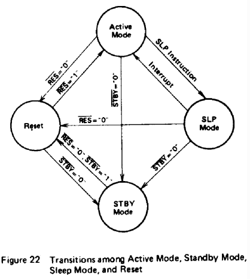

# HD6303R, HD63A03R, HD63B03R <br>CMOS MPU (Micro Processing Unit) 
The HD6303R is an 8-bit CMOS micro processing unit which has the completely compatible instruction set with the HD6301V1. 128 bytes RAM, Serial Communication Interface (SCI), parallel I/O ports and multi function timer are incorporated in the HD6303R. It is bus compatible with HMCS6800 and can be expanded up to 65k bytes. Like the HMCS6800 family, I/O level is TTL compatible with 50V single power supply. As the HD6303R is CMOS MPU, power dissipation is extremely low. And also HD6303R has Sleep Mode and Stand-by Mode as lower power dissipation mode. Therefore, flexible low power consumption application is possible. 

HD6303Rは、HD6301V1と完全互換の命令セットを持つ8ビットCMOSマイクロプロセッシングユニットです。128バイトRAM、シリアル通信インタフェース(SCI)、パラレルI/Oポート、マルチファンクションタイマを内蔵しています。HMCS6800とバス互換性があり、最大65kバイトまで拡張できます。HMCS6800ファミリ同様、I/OレベルはTTL互換で50V単一電源です。HD6303RはCMOS MPUであるため、消費電力が非常に小さくなっています。また、低消費電力モードとしてスリープモードとスタンバイモードを備えています。このため、柔軟な低消費電力アプリケーションに対応できます。


## FEATURES 
* Object Code Upward Compatible with the HD6800, HD6801, HD6802 
* Multiplexed Bus (D0/A0-D7/A7, A8-A15), Non Multiplexed Bus (D0-D7, A0-A15) 
* Abundant On-Chip Functions Compatible with the HD6301V1; 128 Bytes RAM, 13 Parallel I/O Lines, 16-bit Timer, Serial Communication Interface (SCI) 
* Low Power Consumption Mode; Sleep Mode, Stand-By Mode 
* Minimum Instruction Execution Time: 1us (f=1MHz), 0.67μs (f=1.5MHz), 0.5μs (f=2.0MHz) 
* Bit Manipulation, Bit Test Instruction 
* Error Detecting Function; Address Trap, Op Code Trap 
* Up to 65k Bytes Address Space 
* Wide Operation Range  
  Vcc 3 to 6V (f = 0.1 ～ 0.5 MHz)  
  f = 0.1 to 2.0 MHz (Vcc  5V ± 10%) 

## 特徴

* HD6800、HD6801、HD6802と上位互換のオブジェクトコード 
* 多重化バス(D0/A0-D7/A7, A8-A15)、非多重化バス(D0-D7, A0-A15) 
* HD6301V1と互換性のある豊富なオンチップ機能: 128バイトRAM、13パラレルI/Oライン、16ビットタイマ、シリアル通信インタフェース(SCI) 
* 低消費電力モード: スリープモード、スタンバイモード 
* 最小命令実行時間: 1us (f=1MHz), 0.67μs (f=1.5MHz), 0.5μs (f=2.0MHz)
* ビット操作、ビットテスト命令 
* エラー検出機能: アドレストラップ、オペコードトラップ 
* 最大65kバイトのアドレス空間 
* 広い動作範囲  
  Vcc 3 to 6V (f = 0.1 ～ 0.5 MHz)  
  f = 0.1 to 2.0 MHz (Vcc  5V ± 10%) 

## TYPE OF PRODUCTS

|Type No.|Bus Timing|
|--|--|
|HD6303R|1.0MHz
|HD63A03R|1.5MHz
|HD63B03R|2.0MHz

<div style="page-break-before:always"></div>

## PROGRAM DEVELOPMENT SUPPORT TOOLS

* Cross assembler and C compiler software for IBM PCs and compatibles
* In circuit emulator for use with IBM PCs and compatibles

(和訳)

* IBM PC および互換機用のクロスアセンブラおよび C コンパイラソフトウェア
* IBM PCおよび互換機用インサーキットエミュレーター

##  PIN ARRANGEMENT 

HD6303RP, HD63A03RP, HD63B03RP 


<div style="page-break-before:always"></div>

HD6303RF, HD63A03RF, HD63B03RF 


<div style="page-break-before:always"></div>

HD6303RCG, HD63A03RCG, 


<div style="page-break-before:always"></div>

HD6303RCP, HD63A03RCP, HD63B03RCP 


<div style="page-break-before:always"></div>

HD6303RL, HD63A03RL, HD63B03RL


<div style="page-break-before:always"></div>

## BLOCK DIAGRAM 


###  ABSOLUTE MAXIMUM RATINGS 


(NOTE) This product has protection circuits in input terminal from high static electricity voltage and high electric field, 

(注)本製品は入力端子に高電圧高電界保護回路を内蔵しています、 

But be careful not to apply overvoltage more than maximum ratings to these high input impedance protection circuits. To assure the normal operation, we recommend Vin, Vout: Vss <= (Vin or Vout) <= Vcc. 

但し、これらの高入力インピーダンス保護回路には最大定格以上の過電圧を印加しないようご注意下さい。正常な動作を保証するために、Vin, Vout:  Vss <= (Vout または Vin) <= Vcc.

##  ELECTRICAL CHARACTERISTICS 

### DC CHARACTERISTICS (Vcc = 5.0V±10%, Vss = 0V, Ta = 0~+70°C, unless otherwise noted.) 


\* VIH min = Vcc-1.0V, V11 max = 0.8V 

\*\* Current Dissipation of the operating or sleeping condition is proportional to the operating frequency. So the typ. or max. values about Current Dissipations at f = x MHz operation are decided according to the following formula; 

動作時またはスリープ時の許容損失電流は動作周波数に比例します。従って、f = x MHz動作時の許容損失電流のTyp.値またはMax.値は、以下の式に従って決定されます;
```
typ. value (f = x MHz) = typ. value (f = 1MHz) x x
max. value (f = x MHz) = max. value (f = 1MHz) x x 
(both the sleeping and operating) 
```

<div style="page-break-before:always"></div>

###  AC CHARACTERISTICS (Vcc = 5.0V±10%, Vss = 0V, Ta = 0~+70°C, unless otherwise noted.) 

### BUS TIMING 


\* These timings change in approximate proportion to tcyc. The figures in this characteristics represent those when tcyc is minimum (= in the highest speed operation). 

\* これらのタイミングはtcycにほぼ比例して変化する。この特性の数値は、tcycが最小の場合(＝最高速動作時)の数値である。

<div style="page-break-before:always"></div>

### PERIPHERAL PORT TIMING 


### TIMER, SCI TIMING 


### MODE PROGRAMMING 


<div style="page-break-before:always"></div>

Figure 1 Multiplexed Bus Timing 


<div style="page-break-before:always"></div>

Figure 2 Non-Multiplexed Bus Timing 


Figure 3 Port Data Set-up and Hold Times 


<div style="page-break-before:always"></div>

Figure 4 Port Data Delay Times (MPU Write) 


Figure 5 Timer Output Timing 


Figure 6 Mode Programming Timing 


Figure 7 Bus Timing Test Loads (TTL Load) 


Figure 8 Interrupt Sequence 


<div style="page-break-before:always"></div>

Figure9 Reset Timing


## FUNCTIONAL PIN DESCRIPTION 

### Vcc. Vss 

These two pins are used for power supply and GND. Recommended power supply voltage is 5V ± 10%, 3 to 6V can be used for low speed operation (100 ~ 500 kHz). 

この 2 つのピンは電源と GND に使用されます。推奨電源電圧は5V±10％で、低速動作(100～500kHz)には3～6Vを使用できます。

### XTAL, EXTAL 

These two pins are connected with parallel resonant fundamental crystal, AT cut. For instance, in order to obtain the system clock 1MHz, a 4MHz resonant fundamental crystal is used because the devide-by-4 circuitry is included. An example of the crystal interface is shown in Fig. 10. EXTAL accepts an external clock input of duty 45% to 55% to drive. For external clock, XTAL pin should be open. The crystal and capacitors should be mounted as close as possible to the pins. 

この2ピンに並列共振基本波ATカットの水晶振動子を接続します。例えば、システムクロック1MHzを得るためには、内部の4分周回路を通すので、共振基本波4MHzの水晶振動子を使用する。図10に水晶振動子の接続の例を示します。EXTALはデューティ45%～55%駆動の外部クロック入力を受け付けます。外部クロック入力の場合、XTAL端子はオープンとしてください。水晶振動子とコンデンサは可能な限りピンの近くに実装すること。

Figure 10. Crystal Interface


### Standby (STBY) 

This pin is used to place the MPU in the standby mode. If this goes to "Low" level, the oscillation stops, the internal clock is tied to Vss or Vcc and the MPU is reset. In order to retain information in RAM during standby, write "0" into RAM enable bit (RAME). RAME is bit 6 of the RAM Control Register at address \$0014. This disables the RAM, so the contents of RAM is guaranteed. For details of the standby mode, see the Standby section. 

MPU をスタンバイ状態にする端子である。"L"レベルになると発振が停止し、内部クロックは Vss または Vcc に固定され、MPU はリセットされる。スタンバイ時に RAM の情報を保持するためには、RAM イネーブルビット(RAME)に "0"を書き込む。RAMEは、アドレス\$0014のRAMコントロールレジスタのビット6です。これにより、RAMは無効となり、RAMの内容は保証されます。スタンバイモードの詳細については、スタンバイのセクションを参照してください。

### Reset (RES) 
This input is used to reset the MPU. RES must be held "Low" for at least 20ms when the power starts up. It should be noted that, before clock generator stabilize, the internal state and I/O ports are uncertain, because MPU can not be reset without clock. To reset the MPU during system operation, it must be held "Low" for at least 3 system clock cycles. From the third cycle, all address buses become "high-impedance" and it continues while RES is "Low". If RES goes to "High", CPU does the following. 

MPU のリセットに使用する。電源立ち上げ時、RES は 20ms 以上 "Low"を保持しなければならない。クロックジェネレータが安定するまでは、クロックがないと MPU をリセットできないため、内部状態や I/O ポートの状態は不確定であることに注意する必要がある。システム動作中に MPU をリセットするには、最低 3 システムクロックサイクル "Low"を保持する必要がある。3サイクル目以降、全てのアドレスバスはハイインピーダンスとなり、RESが "Low"の間継続する。RESが "High"になるとCPUは以下の動作を行う。

1. I/O Port 2 bits 2,1,0 are latched into bits PC2, PC1, PCO of program control register. 
2. The contents of the two Start Addresses, \$FFFE, \$FFFF are brought to the program counter, from which program starts (see Table 1). 
3. The interrupt mask bit is set. In order to have the CPU recognize the maskable interrupts IRQ, and IRQ2, clear it before those are used. 

リセット解除時の動作

1. I/Oポート2の2,1,0ビットがプログラム制御レジスタのPC2,PC1,PCOビットにラッチされる。
2. 2つの開始アドレス、\$FFFE、\$FFFFの内容がプログラムカウンタに書き込まれ、そこからプログラムが開始される(表1を参照)。
3. 割り込みマスクビットが設定される。CPUにマスク可能な割り込みIRQとIRQ2を認識させるには、それらを使用する前にこのビットをクリアする必要があります。

### Enable (E) 
This output pin supplies system clock. Output is a single. phase, TTL compatible and 1/4 the crystal oscillation frequency. It will drive two LS TTL load and 40pF capacitance. 

システムクロックを供給する出力端子。出力は単相、TTL 互換、水晶発振周波数の 1/4 のクロックです。2つのLS TTL負荷と40pF容量を駆動します。

### Non Maskable Interrupt (NMI) 
When the falling edge of the input signal of this pin is recognized, NMI sequence starts. The current instruction is continued to complete, even if NMI signal is detected. Interrupt mask bit in Condition Code Register has no effect on NMI detection. In response to NMI interrupt, the information of Program Counter, Index Register, Accumulators, and Condition Code Register are stored on the stack. On completion of this sequence, vectoring address \$FFFC and \$FFFD are generated to load the contents to the program counter. Then the CPU branch to a non maskable interrupt service routine. 

このピンの入力信号の立ち下がりエッジが認識されると、NMIシーケンスが開始される。NMI信号が検出されても、現在の命令は継続して完了します。コンディションコードレジスタの割り込みマスクビットはNMI検出には影響しません。NMI割り込みに応答して、プログラムカウンタ、インデックスレジスタ、アキュムレータ、およびコンディションコードレジスタの情報がスタックに格納されます。このシーケンスが完了すると、プログラムカウンタに内容をロードするために\$FFFCとSFFFDのベクトルアドレスが生成されます。その後、CPUはマスク不可能な割り込みサービスルーチンに分岐します。

###  Interrupt Request (IRQ1) 

This level sensitive input requests a maskable interrupt sequence. When IRQ goes to "Low", the CPU waits until it completes the current instruction that being executed. Then, if the interrupt mask bit in Condition Code Register is not set, CPU begins interrupt sequence; otherwise, interrupt request is neglected. 

このレベルセンシティブ入力は、マスク可能な割り込みシーケンスを要求する。IRQが "Low"になると、CPUは実行中の命令が完了するまで待機する。コンディションコードレジスタの割り込みマスクビットが設定されていなければ、CPUは割り込みシーケンスを開始し、そうでなければ割り込み要求は無視されます。

Once the sequence has started, the information of Program Counter, Index Register, Accumulator, Condition Code Register are stored on the stack. Then the CPU sets the interrupt mask bit so that no further maskable interrupts may be responded. 

割り込みシーケンスが開始されると、プログラムカウンタ、インデックスレジスタ、アキュムレータ、コンディションコードレジスタの情報がスタックに格納される。その後、CPUは割り込みマスクビットをセットし、それ以上マスク可能な割り込みが応答できないようにします。

Table 1 Interrupt Vectoring memory map 


At the end of the cycle, the CPU generates 16 bit vectoring addresses indicating memory addresses \$FFF8 and \$FFF9, and loads the contents to the Program Counter, then branch to an interrupt service routine. 

サイクルの終了時に、CPUはメモリアドレスの\$FFF8と\$FFF9を指す16ビットのベクタアドレスを生成し、その内容をプログラムカウンタにロードした後、割り込みサービスルーチンに分岐します。

The Internal Interrupt will generate signal (IRQ2) which is quite the same as IRQ, except that it will use the vector address \$FFF0 to \$FFF7. 

内部割り込みはIRQと全く同じ信号(IRQ2)を発生させますが、ベクタアドレスが\$FFF0～\$FFF7になります。

When IRQ, and IRQ2 are generated at the same time, the former precedes the latter. Interrupt Mask Bit in the condition code register, if being set, will keep the both interrupts off. 

IRQとIRQ2が同時に発生した場合は、前者が優先されます。コンディションコードレジスタの割り込みマスクビットがセットされていると、両方の割り込みがオフになります。

On occurrence of Address error or Op-code error, TRAP interrupt is invoked. This interrupt has priority next to RES. Regardless of the interrupt Mask Bit condition, the CPU will start an interrupt sequence. The vector for this interrupt will be \$FFEE, \$FFEF. 

アドレスエラーまたはオペコードエラーが発生すると、TRAP 割り込みが発生します。この割り込みはRESの次の優先度を持ちます。割り込みマスクビットの状態に関係なく、CPUは割り込みシーケンスを開始します。この割り込みのベクタは \$FFEE、\$FFEFになります。

###  Read/Write (R/W) 
This TTL compatible output signals peripheral and memory devices whether CPU is in Read ("High"), or in Write (“Low"). The normal stand-by state is Read ("High"). Its output will drive one TTL load and 90pF capacitance. 

このTTL互換出力は、CPUがリード("High")かライト("Low")かに関わらず、周辺機器やメモリデバイスに信号を送る。通常のスタンバイ状態はリード("High")である。この出力は1つのTTL負荷と90pF容量を駆動します。

### Address Strobe (AS) 
In the multiplexed mode, address strobe signal appears at this pin. It is used to latch the lower 8 bits addresses multiplexed with data at Do/Ao D/A7. The 8-bit latch is controlled by address strobe as shown in Figure 15. Thereby, Do/Ao ~ D7/A7 can become data bus during E pulse. The timing chart of this signal is shown in Figure 1. 

多重化モードでは、アドレスストローブ信号がこのピンに現れます。D0/A0-D7/A7でデータと多重化された下位8ビットのアドレスをラッチするために使用されます。8ビットのラッチは図15に示すようにアドレスストローブによって制御される。これにより、Eパルスの間、D0/A0-D7/A7はデータバスになることができる。この信号のタイミングチャートを図1に示す。

Address Strobe (AS) is sent out even if the internal address is accessed. 

アドレスストローブ(AS)は内部アドレスのメモリアクセスの際も出力されます。

##  PORTS 
There are two I/O ports on HD6303R MPU (one 8-bit ports and one 5-bit port). Each port has an independent write-only data direction register to program individual I/O pins for input or output.\*

HD6303R MPUのI/Oポートは、8ビットと5ビットの2ポートです。各I/Oポートには独立した書き込み専用のデータ方向レジスタがあり、各I/Oピンを入力用または出力用にプログラムすることができます。\*

When the bit of associated Data Direction Register is "1", 1/0 pin is programmed for output, if "0", then programmed for an input. 

関連するデータ方向レジスタのビットが "1"の場合、1/0ピンは出力用にプログラムされ、"0"の場合は入力用にプログラムされます。

There are two ports: Port 1, Port 2. Addresses of each port and associated Data Direction Register are shown in Table 2. 

ポートは2つあります:  ポート1とポート2です。各ポートのアドレスと関連するデータディレクションレジスタを表2に示します。

* Only one exception is bit 1 of Port 2 which becomes either a data input or a timer output. It cannot be used as an output port. 

* 唯一の例外は、ポート2のビット1で、データ入力またはタイマ出力となる。出力ポートとしては使用できない。

Table 2 Port and Data Direction Register Addresses 

|Ports|Port Address |Data Direction<br> Register Address 
|--|--|--|
I/O Port 1 |\$0002 |\$0000 
I/O Port 2 |\$0003 |\$0001

### I/O Port 1 

This is an 8-bit port, each bit being defined individually as input or outputs by associated Data Direction Register. The 8-bit output buffers have three-state capability, maintaining in high impedance state when they are used for input. In order to be read accurately, the voltage on the input lines must be more than 2.0V for logic “1” and less than 0.8V for logic “0”. 

これは8ビットポートで、各ビットは関連するデータディレクションレジスタによって個別に入力または出力として定義される。8ビット出力バッファは3ステート機能を持ち、入力に使用されるときはハイインピーダンス状態を維持する。正確に読み取るためには、入力ラインの電圧はロジック "1"で2.0V以上、ロジック "0"で0.8V以下でなければなりません。

These are TTL compatible. After the MPU has been reset, all I/O lines are configured as inputs in Multiplexed mode. In Non Multiplexed mode, Port 1 will be output line for lower order address lines (Ao A7), which can drive one TTL load and 30 pF capacitance. 

これらはTTL互換である。MPU がリセットされた後、マルチプレクスモードでは全ての I/O ラインが入力に設定される。非多重モードでは、ポート 1 は低次アドレスライン(A0-A7)の出力ラインとなり、1 つの TTL 負荷と 30pF の容量を駆動することができます。

###  I/O Port 2 

This port has five lines, whose I/O direction depends on its data direction register. The 5-bit output buffers have three-state capability, going high impedance state when used as inputs. In order to be read accurately, the voltage on the input lines must be more than 2.0V for logic "1" and less than 0.8V for logic "0". After the MPU has been reset, all I/O lines are configured as inputs. These pins on Port 2 (P20 P22 of the chip) are used to program the mode of operation during reset. The values of these three pins during reset are latched into the upper 3 bits (bit 7, 6 and 5) of Port 2 Data Register which is explained in the MODE SELECTION section. 

このポートには5本のラインがあり、そのI/O方向はデータ方向レジスタに依存する。5ビットの出力バッファは3ステート機能を持ち、入力として使用されるときはハイインピーダンス状態になる。正確に読み出すためには、入力ラインの電圧はロジック "1"で2.0V以上、ロジック "0"で0.8V以下でなければならない。MPU がリセットされると全ての入出力端子は入力となります。ポート 2 (チップの P20 P22) のこれらのピンは、リセット時の動作モードをプログラムするために使用される。リセット中のこれら 3 つのピンの値は、MODE SELECTION セクションで説明するポート 2 データレジスタの上位 3 ビット(ビット 7、6、5)にラッチされる。

In all modes, Port 2 can be configured as I/O lines. This port also provides access to the Serial I/O and the Timer. However, note that bit 1 (P21) is the only pin restricted to data input or Timer output. 

全てのモードにおいて、ポート 2 は I/O ラインとして設定できる。このポートはシリアルI/Oとタイマへのアクセスも提供する。ただし、ビット 1(P21)はデータ入力またはタイマ出力に制限された唯一のピンであることに注意。

##  BUS 

### D0/A0 - D7/A7 
This TTL compatible three-state buffer can drive one TTL load and 90 pF capacitance. 

このTTL互換3ステートバッファは、1つのTTL負荷と90 pF容量を駆動することができます。

* **Non Multiplexed Mode**: In this mode, these pins become only data bus (Do - D7). 
* **Multiplexed Mode**: These pins becomes both the data bus (Do - D7) and lower bits of the address bus (A0 - A7). An address strobe output is "High" when the address is on the pins. 

(和訳)

* **非多重モード**:  このモードでは、これらのピンはデータバス (Do - D7) のみとなります。
* **多重化モード**:  データバス(Do - D7)とアドレスバスの下位ビット(A0 - A7)の両方になります。アドレスがピン上にある場合、アドレスストローブ出力は "High"になります。

### A8 - A15

Each line is TTL compatible and can drive one TTL load and 90 pF capacitance. After reset, these pins become output for upper order address lines (A8 - A15).

各ラインはTTL互換で、1つのTTL負荷と90pF容量を駆動できる。リセット後、これらのピンは上位アドレスライン(A8～A15)の出力となる。

## MODE SELECTION 

The operation mode after the reset must be determined by the user wiring the P20, P21, and P22 externally. These three pins are lower order bits; I/O 0, I/O 1, I/O 2 of Port 2. They are latched into the control bits PC0, PC1, PC2 of I/O Port 2 register when RES goes "High". I/O Port 2 Register is shown below. 

リセット後の動作モードは、P20,P21,P22 の外部配線により決定される。これら 3 つのピンは、ポート 2 の I/O 0、I/O 1、I/O 2 の下位ビットである。RESが "H"になるとI/Oポート2レジスタの制御ビットPC0、PC1、PC2にラッチされる。I/Oポート2レジスタを以下に示す。

Port 2 DATA REGISTER 


An example of extemal hardware used for Mode Selection is shown in Figure 11. The HD14053B is used to separate the peripheral device from the MPU during reset. It is necessary if the data may conflict between peripheral device and Mode generation circuit. 

モード選択に使用される外部ハードウェアの例を図 11 に示します。HD14053Bは、リセット時に周辺デバイスとMPUを分離するために使用します。周辺デバイスとモード生成回路の間でデータが衝突する可能性がある場合に必要である。

No mode can be changed through software because the bits 5, 6, and 7 of Port 2 Data Register are read-only. The mode selection of the HD6303R is shown in Table 3. 

ポート2データレジスタの5,6,7ビットは読み出し専用であるため、ソフトウェアによるモード変更はできません。

The HD6303R operates in two basic modes: (1) Multiplexed Mode, (2) Non Multiplexed Mode. 

HD6303Rのモード選択を表3に示します。HD6303Rは、(1)多重モード、(2)非多重モードの2つの基本モードで動作します。

### Multiplexed Mode 
The data bus and the lower order address bus are multiplexed in the D0/A0-D7/A7 and can be separated by the Address Strobe. 

Port 2 is configured for 5 parallel I/O or Serial I/O, or Timer, or any combination thereof. Port I is configured for 8 parallel 1/0. 

データバスと低次アドレスバスはD0/A0-D7/A7で多重化され、アドレスストローブで分離できる。

ポート2は、5パラレルI/O、シリアルI/O、タイマ、またはそれらの組み合わせ用に構成される。ポート1は8パラレル1/0用に構成される。

### Non Multiplexed Mode 
In this mode, the HD6303R can directly address HMCS6800 peripherals with no address latch. Do/Ao D/A, become a data bus and Port 1 becomes Ao A, address bus. 

このモードでは、HD6303RはアドレスラッチなしでHMCS6800ペリフェラルを直接アドレス指定できます。D0/A0-D7/A7がデータバスになり、ポート1がA0-A7のアドレスバスになります。

In this mode, the HD6303R is expandable up to 65k bytes with no address latch. 

このモードでは、HD6303Rはアドレスラッチなしで最大65kバイトまで拡張可能です。

### Lower Order Address Bus Latch 
Because the data bus is multiplexed with the lower order address bus in Do/Ao~ D7/A7 in the multiplexed mode, address bits must be latched. It requires the 74LS373 Transparent octal D-type to latch the LSB. Latch connection of the HD6303R is shown in Figure 15. 

多重化モードでは、Do/Ao～D7/A7でデータバスが下位アドレスバスと多重化されるため、アドレスビットをラッチする必要がある。LSBをラッチするには74LS373トランスペアレント8進Dラッチが必要です。HD6303Rのラッチ接続を図15に示します。

<div style="page-break-before:always"></div>

Figure 11 Recommended Circuit for Mode Selection 


Figure 12 HD14053B Multiplexers/De-Multiplexers 


<div style="page-break-before:always"></div>

Figure 13 HD6303R MPU Multiplexed Mode 


Figure 14 HD6303R MPU Non Multiplexed Mode 


Figure 15 Latch Connection 


Table 3 Mode Selection 


<div style="page-break-before:always"></div>

Table 4 Internal Register Area 


## MEMORY MAP 

The MPU can provide up to 65k byte address space. Figure 16 shows a memory map for each operating mode. The first 32 locations of each map are for the CPU's internal register only, as shown in Table 4. 

MPUは最大65kバイトのアドレス空間を提供できる。図 16 に各動作モードのメモリマップを示す。各マップの先頭 32 位置は、表 4 に示すように CPU 内部レジスタのみである。

<div style="page-break-before:always"></div>

Figure 16 HD6303R Memory Maps 


## PROGRAMMABLE TIMER 
The HD6303R contains 16-bit programmable timer which may measure input waveform. In addition to that it can generate an output waveform by itself. For both input and output waveform, the pulse width may vary from a few microseconds to several seconds. 

HD6303Rは16ビットのプログラマブルタイマを内蔵しており、入力波形を測定することができます。また、出力波形を自ら生成することもできます。入力波形、出力波形ともに、パルス幅は数マイクロ秒から数秒まで変化します。

The timer hardware consists of 

* an 8-bit control and status register 
* a 16-bit free running counter 
* a 16-bit output compare register 
* a 16-bit input capture register 

A block diagram of the timer is shown in Figure 17. 

タイマのハードウェアは次の要素により構成されています。

* 8ビットの制御およびステータスレジスタ 
* 16ビットフリーランニングカウンタ 
* 16ビット出力比較レジスタ 
* 16ビット入力キャプチャレジスタ 

タイマのブロック図を図 17 に示す。

Figure 17 Programmable Timer Block Diagram 


### Free Running Counter (\$0009: \$000A) 
The key element in the programmable timer is a 16-bit free running counter, that is driven by an E (Enable) clock to increment its values. The counter value will be read out by the CPU software at any time with no effects on the counter. Reset will clear the counter. 

プログラマブルタイマのキーエレメントは、E(イネーブル)クロックによって値をインクリメントする16ビットのフリーランカウンタである。カウンタ値は、CPUソフトウェアによっていつでも読み出されるが、カウンタに影響はない。リセットするとカウンタはクリアされます。

When the MSB of this counter is read, the LSB is stored in temporary latch. The data is fetched from this latch by the subsequent read of LSB. Thus consistent double byte data can be read from the counter. 

このカウンタのMSBが読み出されると、LSBがテンポラリラッチに格納されます。その後のLSBの読み出しによって、このラッチからデータが取り出されます。このようにして、一貫性のある2バイトデータをカウンタから読み出すことができます。

When the CPU writes arbitrary data to the MSB (\$09), the value of \$FFF8 is being pre-set to the counter (\$09, \$OA) regardless of the write data value. Then the CPU writes arbitrary data to the LSB (SOA), the data is set to the "Low" byte of the counter, at the same time, the data preceedingly written in the MSB (\$09) is set to "High" byte of the counter. 

CPUがMSB(\$09)に任意のデータを書き込むと、書き込みデータの値に関係なくカウンタ(\$09, \$OA)に\$FFF8がプリセットされる。次にCPUがLSB(SOA)に任意のデータを書き込むと、そのデータがカウンタのLowバイトにセットされ、同時にMSB(\$09)に先に書き込まれたデータがカウンタのHighバイトにセットされる。

When the data is written to this counter, a double byte store instruction (ex. STD) must be used. If only the MSB of counter is written, the counter is set to SFFF8. 

このカウンタにデータを書き込む場合は、2バイトストア命令(STD など)を使用しなければならない。カウンタの MSB だけを書き込むと、カウンタは \$FFF8 に設定されます。

The counter value written to the counter using the double byte store instruction is shown in Figure 18. 

2バイトストア命令を使用してカウンタに書き込まれるカウンタ値を図 18 に示す。

To write to the counter can disturb serial operations, so it should be inhibited during using the SCI. If external clock mode is used for SCI, this will not disturb serial operations. 

カウンタへの書き込みはシリアル動作の妨げになるため、SCI 使用中は禁止すること。SCI で外部クロックモードを使用する場合は、シリアル動作の妨げにはなりません。

Figure 18 Counter Write Timing 


###  Output Compare Register (\$000B:\$000C) 

This is a 16-bit read/write register which is used to control an output waveform. The contents of this register are constantly being compared with current value of the free running counter. 

このレジスタは 16 ビットのリード/ライトレジスタで、出力波形の制御に使用される。このレジスタの内容はフリーランカウンタの現在値と常に比較される。

When the contents match with the value of the free running counter, a flag (OCF) in the timer control/status register (TCSR) is set and the current value of an output level Bit (OLVL) in the TCSR is transferred to Port 2 bit 1. When bit 1 of the Port 2 data direction register is "1" (output), the OLVL value will appear on the bit 1 of Port 2. Then, the value of Output Compare Register and Output level bit may be changed for the next compare. 

内容がフリーランニングカウンタの値と一致すると、タイマ制御/ステータスレジスタ(TCSR)のフラグ(OCF)がセットされ、TCSRの出力レベルビット(OLVL)の現在値がポート2のビット1に転送される。ポート 2 のデータ方向レジスタのビット 1 が "1"(出力)の時、OLVL の値はポート 2 のビット 1 に表示される。その後、出力比較レジスタと出力レベルビットの値は次の比較のために変更することができる。

The output compare register is set to \$FFFF during reset. 

出力コンペアレジスタはリセット中\$FFFFに設定されます。

The compare function is inhibited at the cycle of writing to the high byte of the output compare register and at the cycle just after that to ensure valid compare. It is also inhibited in same manner at writing to the free running counter. 

出力コンペアレジスタの上位バイトへの書き込みサイクルとその直後のサイクルでコンペア機能が禁止され、 有効なコンペアが保証される。また、フリーランニングカウンタへの書き込みも同様に禁止される。

In order to write a data to Output Compare Register, a double byte store instruction (ex.STD) must be used. 

出力コンペアレジスタにデータを書き込むには、2バイトストア命令(例えばSTD命令)を使用しなければならない。

###  Input Capture Register (\$000D: \$000E) 

The input capture register is a 16-bit read-only register used to hold the current value of free running counter captured when the proper transition of an external input signal occurs. 

入力キャプチャレジスタは16ビットの読み出し専用レジスタで、外部入力信号が適切に遷移したときにキャプチャされるフリーランニングカウンタの現在値を保持するために使用される。

The input transition change required to trigger the counter transfer is controlled by the input edge bit (IEDG). 

カウンタ転送のトリガに必要な入力遷移の変化は、入力エッジビット(IEDG)によって制御される。

To allow the external input signal to go in the edge detect unit, the bit of the Data Direction Register corresponding to bit 0 of Port 2 must have been cleared (to zero). 

外部入力信号がエッジ検出ユニットに入るためには、ポート2のビット0に対応するデータ方向レジスタのビットがクリア(ゼロに)されていなければなりません。

To insure input capture in all cases, the width of an input pulse requires at least 2 Enable cycles. 

すべてのケースで入力キャプチャを保証するために、入力パルスの幅は少なくとも2イネーブル(E)サイクルを必要とする。

### Timer Control/Status Register (TCSR) (\$0008) 

This is an 8-bit register. All 8-bits are readable and the lower 5 bits may be written. The upper 3 bits are read-only, indicating the timer status information as is shown below. 

これは8ビットのレジスタである。8ビット全ては読み出し可能で、下位5ビットは書き込み可能である。上位3ビットは読み出し専用で、以下に示すタイマのステータス情報を示す。

1. A proper transition has been detected on the input pin 
(ICF). 
2. A match has been found between the value in the free running counter and the output compare register (OCF). 
3. When counting up to \$0000 (TOF). 

1. 入力ピン(ICF)で適切な遷移が検出された。
2. フリーランニングカウンタの値と出力コンペアレジスタ(OCF)の値が一致した。
3. \$0000(TOF)までカウントしたとき。

Each flag has an individual enable bit in TCSR which determines whether or not an interrupt request may occur (IRQ2). If the I-bit in Condition Code Register has been cleared, a prior vectored address occurs corresponding to each flag. A description of each bit is as follows. 

各フラグには、割り込み要求(IRQ2)が発生するかどうかを決定する個別のイネーブルビットがTCSRにあります。コンディションコードレジスタのIビットが事前にクリアされていると、各フラグに対応する先行ベクトルアドレスが発生します。各ビットの説明は以下の通り。

Figure. Timer Control / Status Register 


**Bit 0 OLVL (Output Level):** When a match is found in the value between the counter and the output compare register, this bit is transferred to the Port 2 bit 1. If the DDR corresponding to Port 2 bit I is set "1", the value will appear on the output pin of Port 2 bit 1.

**ビット0 OLVL(出力レベル):** OLVL(出力レベル): カウンタと出力コンペアレジスタの値が一致すると、このビットはポート 2 のビット 1 に転送される。ポート 2 のビット 1 に対応する DDR が "1"に設定されている場合、ポート 2 のビット 1 の出力ピンに値が現れる。

**Bit 1 IEDG (Input Edge):** This bit control which transition of an input of Port 2 bit 0 will trigger the data transfer from the counter to the input capture register. The DDR corresponding to Port 2 bit 0 must be clear in advance of using this function. When IEDG = 0, trigger takes place on a negative edge ("High"-to-"Low" transition), When IEDG = 1, trigger takes place on a positive edge (“Low”-to-"High" transition). 

**ビット1 IEDG(入力エッジ):** このビットは、ポート 2 ビット 0 の入力のどの遷移がカウンタから入力キャプチャレジスタへのデータ転送をトリガするかを制御する。この機能を使用する前に、ポート 2 ビット 0 に対応する DDR をクリアしておく必要がある。IEDG = 0の時、トリガは負エッジ("High"-"Low"遷移)で起こり、IEDG = 1の時、トリガは正エッジ("Low"-"High"遷移)で起こる。

**Bit 2 ETOI (Enable Timer Overflow Interrupt):** When set, this bit enables TOF interrupt to generate the interrupt request (IRQ2). When cleared, the interrupt is inhibited. 

**ビット2 ETOI (Enable Timer Overflow Interrupt):** このビットがセットされるとTOF割り込みが有効になり、割り込み要求(IRQ2)を生成します。クリアされると割り込みは禁止されます。

**Bit 3 EOCI (Enable Output Compare Interrupt):** When set, this bit enables OCF interrupt to generate the interrupt request (IRQ2). When cleared, the interrupt is inhibited. 

**ビット3 EOCI(Enable Output Compare Interrupt):** このビットがセットされると、OCF 割り込みが有効になり、割り込み要求 (IRQ2) が生成されます。クリアされると、割り込みは禁止されます。

**Bit 4 EICI (Enable Input Capture Interrupt):** When set, this bit enables ICF interrupt to generate the interrupt request (IRQ2). When cleared, the interrupt is inhibited. 

**ビット4 EICI (Enable Input Capture Interrupt):** このビットがセットされると、ICF割り込みが割り込み要求(IRQ2)を生成します。クリアされると割り込みは禁止されます。

**Bit 5 TOF (Timer Over Flow Flag):** This read-only bit is set at the transition of \$FFFF to \$0000 of the counter. It is cleared by CPU read of TCSR (with TOF set) followed by a CPU read of the counter (\$0009). 

**Bit 5 TOF (タイマオーバーフローフラグ):** この読み出し専用ビットは、カウンタの\$FFFFから\$0000への遷移時に設定されます。(TOFが設定された状態で)TCSRのCPU読み出しに続いてカウンタのCPU読み出し(\$0009)を行うとクリアされます。

**Bit 6 OCF (Output Compare Flag):** This read-only bit is set when a match is found in the value between the output compare register and the counter. It is cleared by a read of TCSR (with OCF set) followed by a CPU write to the output compare register (\$000B or \$000C). 

**Bit 6 OCF (出力比較フラグ):** この読み出し専用ビットは、出力比較レジスタとカウンタの値が一致した時に設定されます。このビットは、TCSRのリード(OCFがセットされている状態)に続いて、CPUが出力コンペアレジスタ(\$000Bまたは\$000C)に書き込むとクリアされます。

**Bit 7 ICF (Input Capture Flag):** The read-only bit is set by a proper transition on the input, and is cleared by 
a read of TCSR (with ICF set) followed by a CPU read of Input Capture Register (\000D). 

**ビット7 ICF(入力キャプチャフラグ):** この読み出し専用ビットは、入力の適切な遷移によってセットされ、TCSRの読み出し(OCFがセットされた状態)によってクリアされる。
(ICFが設定された状態で)TCSRを読み出し、次にCPUが入力キャプチャレジスタ(\$000D)を読み出すとクリアされます。

Reset will clear each bit of Timer Control and Status Register. 

リセットは、タイマ制御およびステータスレジスタの各ビットをクリアする。

<div style="page-break-before:always"></div>

## SERIAL COMMUNICATION INTERFACE 

The HD6303R contains a full-duplex asynchronous Serial Communication Interface (SCI). SCI may select the several kinds of the data rate. It consists of a transmitter and a receiver which operate independently but with the same data format and the same data rate. Both of transmitter and receiver communicate with the CPU via the data bus and with the outside world through Port 2 bit 2, 3 and 4. Description of hardware, software and register is as follows. 

HD6303Rは、全二重の非同期シリアル通信インタフェース(SCI)を内蔵しています。SCIは、数種類のデータレートを選択することができます。SCIは、同じデータフォーマットと同じデータレートで動作するトランスミッタとレシーバで構成されています。トランスミッタとレシーバの両方は、データバスを介してCPUと通信し、ポート2のビット2、3、4を介して外部と通信する。ハードウェア、ソフトウェア、レジスタの説明は以下の通り。

###  Wake-Up Feature 

In typical multiprocessor applications the software protocol will usually have the designated address at the initial byte of the message. The purpose of Wake-Up feature is to have the nonselected MPU neglect the remainder of the message. Thus the non-selected MPU can inhibit the all further interrupt process until the next message begins. 

一般的なマルチプロセッサアプリケーションでは、ソフトウェアプロトコルは通常メッセージの先頭バイトに指定アドレスを持つ。Wake-Up機能の目的は、非選択MPUにメッセージの残りを無視させることです。そのため、非選択MPUは次のメッセージが始まるまで、それ以降の割り込み処理をすべて禁止することができます。

Wake-Up feature is re-enabled by a ten consecutive "1"s which indicates an idle transmit line. Therefore software protocol must put an idle period between the messages and must prevent it within the message. 

Wake-Up機能は10回連続の "1"で再有効となり、これは送信ラインがアイドルであることを示す。従って、ソフトウェアプロトコルはメッセージとメッセージの間にアイドル期間を設け、メッセージ内ではそれを防ぐ必要がある。

With this hardware feature, the non-selected MPU is reenabled (or "waked-up") by the next message. 

このハードウェア機能により、非選択 MPU は次のメッセージで再有効化(wake-up)される。

### Programmable Options 
The HD6303R has the following programmable features. 

*  data format: standard mark/space (NRZ) 
* clock source: external or internal 
* baud rate: one of 4 rates per given E clock frequency or 1/8 of external clock 
* wake-up feature: enabled or disabled 
* interrupt requests: enabled or masked individually for transmitter and receiver 
* clock output: internal clock enabled or disabled to Port 2 bit 2 
* Port 2 (bits 3, 4): dedicated or not dedicated to serial I/O individually 

HD6303Rには、以下のプログラマブル機能があります。

* データフォーマット: 標準マーク/スペース(NRZ)
* クロックソース: 外部または内部
* ボーレート: 所定のEクロック周波数または外部クロックの1/8あたり4つのレートのうちの1つ 
* ウェイクアップ機能: 有効または無効 
* 割り込み要求: 送信機と受信機で個別に有効またはマスクされる。
* クロック出力: ポート2ビット2への内部クロック出力の有効/無効 
* ポート2(ビット3、4): 個別にシリアルI/O専用または非専用

### Serial Communication Hardware 
The serial communications hardware is controlled by 4 registers as shown in Figure 19. The registers include: 

シリアル通信ハードウェアは、図 19 に示すように 4 つのレジスタによって制御される。レジスタには以下が含まれる:

* an 8-bit control/status register
* a 4-bit rate/mode control register (write-only)
* an 8-bit read-only receive data register
* an 8-bit write-only transmit data register

(和訳)

* 8 ビットのコントロール/ステータスレジスタ 
* 4 ビットのレート/モード制御レジスタ(書き込み専用) 
* 8 ビット読み取り専用受信データレジスタ 
* 8 ビット書き込み専用送信データレジスタ

Besides these 4 registers, Serial I/O utilizes Port 2 bit 3 (input) and bit 4 (output). Port 2 bit 2 can be used when an option is selected for the internal-clock-out or the external clock-in. 

これら4つのレジスタの他に、シリアルI/Oはポート2のビット3(入力)とビット4(出力)を利用する。ポート 2 のビット 2 は、内部クロック出力または外部クロック入力のオプションが選択されている場合に使用できる。

### Transmit/Receive Control Status Register (TRCSR) 

TRCS Register consists of 8 bits which all may be read while only bits 0 to 4 may be written. The register is initialized to \$20 on RES. The bits of the TRCS Register are explained below. 

TRCSレジスタは8ビットで構成され、全て読み出し可能であるが、0～4ビットのみ書き込み可能である。レジスタはRESで\$20に初期化される。TRCSレジスタのビットを以下に説明する。

Figure. Transmit / Receive Control Status Register 


**Bit 0 WU (Wake Up):** Set by software and cleared by hardware on receipt of ten consecutive "1"'s. While this bit is "1", RDRF and ORFE flags are not set even if data are received or errors are detected. Therefore received data are ignored. It should be noted that RE flag must have already been set in advance of WU flag's set. 

**ビット0 WU(Wake Up):** ソフトウェアによって設定され、10回連続して "1"を受信すると ハードウェアによってクリアされる。このビットが "1"の間、RDRFフラグとORFEフラグは、データを受信してもエラーを検出してもセットされない。従って受信データは無視される。WUフラグがセットされる前にREフラグがセットされていなければならない。

**Bit 1 TE (Transmit Enable):** This bit enables transmitter. When this bit is set, bit 4 of Port 2 DDR is also forced to be set. It remains set even if TE is cleared. Preamble of ten consecutive "1"'s is transmitted just after this bit is set, and then transmitter becomes ready to send data. If this bit is cleared, the transmitter is disabled and serial I/O affects nothing on Port 2 bit 4. 

**ビット1 TE (Transmit Enable):** このビットは送信機を有効にする。このビットがセットされると、ポート2 DDRのビット4も強制的にセットされる。TEがクリアされてもセットされたままである。このビットがセットされた直後に10個の連続した "1"のプリアンブルが送信され、送信機はデータ送信のレディになる。このビットがクリアされた場合、送信機は無効となり、シリアルI/Oはポート2のビット4に何も影響を与えない。

**Bit 2 TIE (Transmit Interrupt Enable):** When this bit is set, TDRE (bit 5) causes an IRQ2 interrupt. When cleared, TDRE interrupt is masked. 

**ビット2 TIE(送信割り込みイネーブル):** このビットがセットされると、TDRE(ビット5)はIRQ2割り込みを発生させる。クリアされると、TDRE割り込みはマスクされる。

**Bit 3 RE (Receive Enable):** When set, Port 2 bit 3 can be used as an input of receive regardless of DDR value for this bit. When cleared, the receiver is disabled. 

**ビット3 RE(受信イネーブル):** セットされると、ポート2のビット3は、このビットのDDR値に関係なく、受信の入力として使用できる。クリアされると、受信は無効となる。

**Bit 4 RIE (Receive Interrupt Enable):** When this bit is set, RDRF (bit 7) or ORFE (bit 6) cause an IRQ2 interrupt. When cleared, this interrupt is masked. 

**ビット4 RIE(Receive Interrupt Enable):** このビットがセットされると、RDRF(ビット7)またはORFE(ビット6)によりIRQ2割り込みが発生する。クリアされると、この割り込みはマスクされる。

**Bit 5 TDRE (Transmit Data Register Empty):** When the data is transferred from the Transmit Data Register to Output Shift Register, this bit is set by hardware. The bit is cleared by reading the status register followed by writing the next new data into the Transmit Data Register. TDRE is initialized to 1 by RES. 

**ビット5 TDRE(送信データレジスタエンプティ):** データが送信データレジスタから出力シフトレジスタに転送されると、このビットはハードウェアによってセットされる。このビットは、ステータスレジスタを読み出し、次の新しいデータを送信データレジスタに書き込むことによってクリアされます。TDREはRESによって1に初期化される。

**Bit 6 ORFE (Over Run Framing Error):** When overrun or framing error occurs (receive only), this bit is set by hardware. Over Run Error occurs if the attempt is made to transfer the new byte to the receive data register while the RDRF is "1". Framing Error occurs when the bit counter is not synchronized with the boundary of the byte in the receiving bit stream. When Framing Error is de. tected, RDRF is not set. Therefore Framing Error can be distinguished from Overrun Error. That is, if ORFE is "1" and RDRF is "1", Overrun Error is detected. Otherwise Framing Error occurs. The bit is cleared by reading the status register followed by reading the receive data register, or by RES. 

**ビット6 ORFE(オーバーラン/フレーミングエラー):** オーバーランまたはフレーミングエラーが発生すると(受信のみ)、 このビットはハードウエアによって設定される。オーバーランエラーは、RDRF が "1"の間に新しいバイトを受信データレジスタに転送しようとした場合に発生する。フレーミングエラーは、ビットカウンタが受信ビットストリームのバイトの境界と同期していない場合に発生する。フレーミングエラーが検出されると、RDRF はセットされない。したがって、フレーミングエラーはオーバーランエラーと区別できる。すなわち、ORFE が "1"で RDRF が"1"であれば、オーバーランエラーが検出される。それ以外の場合はフレーミングエラーが発生する。このビットは、ステータスレジスタの読み出しの後に受信データレジスタを読み出すか、 RES によってクリアされる。

**Bit 7 RDRF (Receive Data Register Full):** This bit is set by hardware when the data is transferred from the receive shift register to the receive data register. It is cleared by reading the status register followed by reading the receive data register, or by RES. 

**ビット 7 RDRF(受信データレジスタフル):** このビットは受信シフトレジスタから受信データレジスタにデータが転送された時にハードウェアによってセットされる。このビットは、ステータスレジスタの読み出しに続いて受信データレジスタを読み出すか、 RES によってクリアされる。

<div style="page-break-before:always"></div>

Figure 19 Serial I/O Register 


<div style="page-break-before:always"></div>

Table 5 SCI Bit Times and Transfer Rates 


Table 6 SCI Format and Clock Source Control 


### Transfer Rate/Mode Control Register (RMCR) 

The register controls the following serial I/O functions: 

* Bauds rate 
* data format 
* clock source 
* Port 2 bit 2 feature 

このレジスタは、以下のシリアルI/O機能を制御する:

* ボーレート 
* データフォーマット 
* クロックソース 
* ポート 2 ビット 2 機能

It is 4-bit write-only register, cleared by RES. The 4 bits are considered as a pair of 2-bit fields. The lower 2 bits control the bit rate of internal clock while the upper 2 bits control the format and the clock select logic. 

4ビットの書き込み専用レジスタで、RESでクリアされる。4ビットは一対の2ビットフィールドとみなされる。下位2ビットは内部クロックのビットレートを制御し、上位2ビットはフォーマットとクロックセレクトロジックを制御する。

|||
|--|--|
|Bit0 SS0<br>Bit1 SS1|Speed Select 

These bits select the Baud rate for the internal clock. The rates selectable are function of E clock frequency of the CPU. Table 5 lists the available Baud Rates. 

これらのビットは内部クロックのボーレートを選択する。選択可能なレートはCPUのEクロック周波数の関数である。表5に選択可能なボーレートを示す。

|||
|--|--|
|Bit2 CC0<br>Bit3 CC1|Clock Control/Format Select 

They control the data format and the clock select logic. Table 6 defines the bit field. 

これらのビットはデータフォーマットとクロックセレクトロジックを制御する。表6にビットフィールドを定義する。

### Internally Generated Clock

If the user wish to use externally an internal clock of the serial I/O, the following requirements should be noted. 

シリアルI/Oの内部クロックを外部で使用する場合は、以下の要件に注意する必要がある。

* CC1, CC0 must be set to "10". 
* The maximum clock rate must be E/16. 
* The clock rate is equal to the bit rate. 
* The values of RE and TE have no effect. 

(和訳)

* CCI、CCOは必ず "10"に設定すること。
* 最大クロックレートはE/16でなければならない。
* クロックレートはビットレートと等しい。
* REとTEの値は影響しない。

### Externally Generated Clock 
If the user wish to supply an external clock to the Serial I/O, the following requirements should be noted. 

シリアルI/Oに外部クロックを供給したい場合、以下の要件に注意する必要がある。

* The CC1, CCO must be set to "11" (See Table 6).
* The external clock must be set to 8 times of the desired baud rate.
* The maximum external clock frequency is E/2 clock.

(和訳)

* CC1、CCOは "11"に設定されなければならない(表6参照)。
* 外部クロックは、希望のボーレートの8倍に設定しなければならない。
* 外部クロックの最大周波数はE/2クロックです。

### Serial Operations 
The serial I/O hardware must be initialized by the software before operation. The sequence will be normally as follows. 

シリアルI/Oハードウェアは、動作前にソフトウェアによって初期化されなければならない。シーケンスは通常以下のようになる。

* Writing the desired operation control bits of the Rate and Mode Control Register. 
* Writing the desired operation control bits of the TRCS register. 

(和訳)

* レートモード制御レジスタの希望の動作制御ビットを書き込む。
* TRCSレジスタの希望の動作制御ビットを書き込む。

If Port 2 bit 3, 4 are used for serial I/O, TE, RE bits may be kept set. When TE, RE bit are cleared during SCI operation, and subsequently set again, it should be noted that TE, RE must be kept "0" for at least one bit time of the current baud rate. If TE, RE are set again within one bit time, there may be the case where the initializing of internal function for transmitter and receiver does not take place correctly. 

ポート2のビット3,4をシリアルI/Oに使用する場合、TE,REビットはセットされたままでよい。SCI動作中にTE,REビットがクリアされ、その後再びセットされる場合、TE,REは現在のボーレートの少なくとも1ビット時間 "0"を維持しなければならないことに注意すること。もしTE,REが1ビット時間以内に再びセットされた場合、トランスミッタとレシーバの内部機能の初期化が正しく行われない場合がある。

### Transmit Operation 

Data transmission is enabled by the TE bit in the TRCS register. When set, the output of the transmit shift register is connected with Port 2 bit 4 which is unconditionally configured as an output. 

データ送信は TRCS レジスタの TE ビットで有効になる。設定されると、送信シフトレジスタの出力はポート 2 のビット 4 に接続され、無条件に出力に設定される。

After RES, the user should initialize both the RMC register and the TRCS register for desired operation. Setting the TE bit causes a transmission of ten-bit preamble of "1"s. Following the preamble, internal synchronization is established and the transmitter is ready to operate. Then either of the following states exists. 

RES の後、ユーザは RMC レジスタと TRCS レジスタの両方を初期化して望ましい動作にする必要がある。TE ビットを設定すると 10 ビットのプリアンブル "1"が送信される。プリアンブルの後、内部同期が確立され、トランスミッタは動作可能な状態になる。その後、次のいずれかの状態になる。

1. If the transmit data register is empty (TDRE 1), the consecutive "1"s are transmitted indicating an idle states. 
2. If the data has been loaded into the Transmit Data Register (TDRE 0), it is transferred to the output shift register and data transmission begins. 

(和訳)

1. 送信データレジスタが空の場合(TDRE 1)、アイドル状態を示す連続した "1"が送信される。
2. データが送信データレジスタにロードされている場合(TDRE 0)、データは出力シフトレジスタに転送され、データ転送が開始される。

During the data transfer, the start bit ("0") is first transferred. Next the 8-bit data (beginning at bit 0) and finally the stop bit ("1"). When the contents of the Transmit Data Register is transferred to the output shift register, the hardware sets the TDRE flag bit: If the CPU fails to respond to the flag within the proper time. TDRE is kept set and then a continuous string of 1's is sent until the data is supplied to the data register. 

データ転送中、まずスタートビット("0")が転送される。次に(ビット 0 から始まる)8 ビットのデータが転送され、最後にストップビット("1")が転送されます。送信データレジスタの内容が出力シフトレジスタに転送されると、ハードウェアは TDRE フラグビットを設定します:  CPUが適切な時間内にフラグに応答できなかった場合、TDREはセットされたままとなり、データがデータレジスタに供給されるまで、連続した "1"の文字列が送信される。

<div style="page-break-before:always"></div>

### Receive Operation 

The receive operation is enabled by the RE bit. The serial input is connected with Port 2 bit 3. The receiver operation is determined by the contents of the TRCS and RMC register. The received bit stream is synchronized by the first "0" (start bit). During 10-bit time, the data is strobed approximately at the center of each bit. If the tenth bit is not "1" (stop bit). the system assumes a framing error and the ORFE is set. 

受信動作は RE ビットで有効になる。シリアル入力はポート 2 のビット 3 に接続される。受信動作は TRCS と RMC レジスタの内容によって決定される。受信ビットストリームは最初の "0"(スタートビット)によって同期される。10ビット時間中、データは各ビットのほぼ中央でストローブされる。第10ビットが "1"(ストップビット)でない場合、システムはフレーミングエラーと見なし、ORFEが設定される。

If the tenth bit is "1", the data is transferred to the receive data register, and the RDRF flag is set. If the tenth bit of the next data is received and still RDRF is preserved set, then ORFE is set indicating that an overrun error has occurred. 

第10ビットが "1"であれば、データは受信データレジスタに転送され、RDRFフラグが設定される。次のデータの 10 ビット目が受信され、RDRF がセットされたままであれば、ORFE がセットされ、オーバランエラーが発生したことを示す。

After the CPU read of the status register as a response to RDRF flag or ORFE flag, followed by the CPU read of the receive data register, RDRF or ORFE will be cleared. 

RDRFフラグまたはORFEフラグに対する応答としてCPUがステータスレジスタを読み出した後、CPUが 受信データレジスタを読み出すと、RDRFまたはORFEはクリアされる。

## RAM CONTROL REGISTER 
The register assigned to the address \$0014 gives a status information about standby RAM. 

アドレス\$0014に割り当てられているレジスタは、スタンバイRAMのステータス情報を与える。

Figure. RAM Control Register 


|||
|--|--|
|Bit 0|Not used.  
|Bit 1|Not used.  
|Bit 2|Not used.  
|Bit 3|Not used.  
|Bit 4|Not used.  
|Bit 5|Not used.  
|Bit 6|RAM Enable (RAME). <br><br>Using this control bit, the user can disable the RAM. RAM Enable bit is set on the<br> positive edge of RES and RAM is enabled. The program can write "1" or "0". <br>If RAME is cleared, the RAM address becomes external address and the CPU<br> may read the data from the outside memory. <br>この制御ビットを使用することで、RAM を無効化することができます。<br>RAMイネーブルビットは、RESのプラスエッジで設定され、RAMが<br>有効になります。プログラムは "1"または "0"を書き込むことが<br>できます。RAMEがクリアされると、RAMアドレスは外部アドレスと<br>なり、CPUは外部メモリからデータを読み出すことができます。
|Bit 7|Standby Power Bit (STBY PWR)<br><br>This bit can be read or written by the user program. It is cleared when the Vcc<br> voltage is removed. Normally this bit is set by the program before going<br> into stand-by mode. When the CPU recovers from stand-by mode, this bit<br> should be checked. If it is "1", the data of the RAM is retained during<br> stand-by and it is valid. <br>このビットはユーザプログラムにより読み書き可能である。Vcc電圧が<br>除去されるとクリアされる。通常、このビットはスタンバイモードに入る<br>前にプログラムによってセットされる。CPUがスタンバイモードから復帰<br>したとき、このビットをチェックする必要がある。このビットが "1"で<br>あれば、RAMのデータはスタンバイ中も保持され、有効である。

## GENERAL DESCRIPTION OF INSTRUCTION SET 

The HD6303R has an upward object code compatible with the HD6801 to utilize all instruction sets of the HMCS6800. The execution time of the key instruction is reduced to increase the system through-put. In addition, the bit operation instruction, the exchange instruction between the index and the accumulator, the sleep instruction are added. This section describes: 

HD6303Rは、HMCS6800の全命令セットを利用するため、HD6801と上位互換のオブジェクトコードを持つ。キー命令の実行時間を短縮し、システムスループットを向上させています。また、ビット演算命令、インデックスとアキュムレータの交換命令、スリープ命令が追加されています。本節では、以下の内容を説明する:  

* CPU programming model (See Fig. 20) 
* Addressing modes 
* Accumulator and memory manipulation instructions (See Table 7) 
* New instructions 
* Index register and stack manipulation instructions (See Table 8) 
* Jump and branch instructions (See Table 9) 
* Condition code register manipulation instructions (See Table 10) 
* Op-code map (See Table 11) 
* Cycle-by-cycle operation (See Table 12) 

命令セット

* CPU プログラミングモデル(図 20 参照) 
* アドレス指定モード 
* アキュムレータおよびメモリ操作命令(表 7 参照) 
* 新しい命令 
* インデックスレジスタとスタック操作命令(表 8 参照) 
* ジャンプ分岐命令(表 9 参照) 
* 条件コードレジスタ操作命令(表 10 参照) 
* オペコードマップ(表 11 参照) 
* サイクルごとの操作(表 12 参照)

### CPU Programming Model 
The programming model for the HD6303R is shown in Fig. ure 20. The double accumulator is physically the same as the accumulator A concatenated with the accumulator B, so that the contents of A and B is changed with executing operation of an accumulator D. 

HD6303Rのプログラミングモデルを図20に示します。ダブルアキュムレータは、物理的にはアキュムレータAとアキュムレータBを連結したもので、アキュムレータDの実行操作でAとBの内容が変化します。

<div style="page-break-before:always"></div>

Figure 20. CPU Programming Model


### CPU Addressing Modes

The HD6303R has seven address modes which depend on both of the instruction type and the code.  The address mode for every instruction is shown along with execution time given in terms of machine cycles (Table 7 to 11). When the clock frequency is 4 MHz, the machine cycle will be microseconds. 

HD6303Rには、命令の種類とコードによって7つのアドレスモードがあります。 各命令のアドレスモードと実行時間をマシンサイクルで示します(表7～表11)。クロック周波数が4MHzの場合、マシンサイクルはマイクロ秒になります。

### Accumulator (ACCX) Addressing 

Only the accumulator (A or B) is addressed. Either accumulator A or B is specified by one-byte instructions. 

アキュムレータ(A または B)のみがアドレス指定されます。アキュムレータ A または B のどちらかを 1 バイト命令で指定します。

### Immediate Addressing 

In this mode, the operand is stored in the second byte of the instruction except that the operand in LDS and LDX, etc are stored in the second and the third byte. These are two or three-byte instructions, 

このモードでは、オペランドは命令の2バイト目に格納されるが、LDSやLDXなどのオペランドは2バイト目と3バイト目に格納される。これらは2バイトまたは3バイト命令である、

### Direct Addressing 

In this mode, the second byte of instruction indicates the address where the operand is stored. Direct addressing allows the user to directly address the lowest 256 bytes in the machine; locations zero through 255. Improved execution times are achieved by storing data in these locations. For system configuration, it is recommended that these locations should be RAM and be utilized preferably for user's data realm. These are two-byte instructions except the AIM, OIM, EIM and TIM which have three-byte. 

このモードでは、命令の2バイト目がオペランドが格納されているアドレスを示す。ダイレクトアドレス指定では、マシンの最下位256バイト(0～255番地)を直接アドレス指定できます。これらの場所にデータを格納することで、実行時間の向上が達成される。システム構成上、これらの場所はRAMとし、ユーザーのデータ領域に利用することが推奨される。AIM、OIM、EIM、TIMが3バイトである以外は、これらは2バイト命令である。

### Extended Addressing 

In this mode, the second byte indicates the upper 8 bit addresses where the operand is stored, while the third byte indicates the lower 8 bits. This is an absolute address in memory. These are three-byte instructions. 

このモードでは、2バイト目がオペランドが格納されている上位8ビットのアドレスを示し、3バイト目が下位8ビットのアドレスを示す。これはメモリ上の絶対アドレスである。これらは3バイト命令である。

### Indexed Addressing 

In this mode, the contents of the second byte is added to the lower 8 bits in the Index Register. For each of AIM, OIM, EIM and TIM instructions, the contents of the third byte are added to the lower 8 bits in the Index Register. In addition, the resulting "carry" is added to the upper 8 bits in the Index Register. The result is used for addressing memory. Because the modified address is held in the Temporary Address Register, there is no change to the Index Register. These are two-byte instructions but AIM, OIM, EIM, TIM have three-byte. 

このモードでは、2バイト目の内容がインデックスレジスタの下位8ビットに加算される。AIM、OIM、EIM、TIMの各命令では、3バイト目の内容がインデックスレジスタの下位8ビットに加算されます。さらに、結果の "キャリー"が インデックスレジスタの上位8ビットに加算されます。その結果がメモリのアドレス指定に使用される。変更されたアドレスは一時アドレスレジス タに保持されるため、インデックスレジスタに変更はない。これらは2バイト命令ですが、AIM、OIM、EIM、TIMは3バイト命令です。


### Implied Addressing 
In this mode, the instruction itself gives the address; stack pointer, index register, etc. These are 1-byte instructions. 

このモードでは、命令自体がアドレス、スタックポインタ、インデックスレジスタなどを与える。これらは1バイト命令である。

### Relative Addressing 
In this mode, the contents of the second byte is added to the lower 8 bits in the program counter. The resulting carry or borrow is added to the upper 8 bits. This helps the user to address the data within a range of -126 to +129 bytes of the current execution instruction. These are two-byte instructions. 

このモードでは、2 バイト目の内容がプログラムカウンタの下位 8 ビットに加算される。その結果、キャリーまたはボローが上位8ビットに加算される。これにより、ユーザーは現在の実行命令から-126～+129バイトの範囲内のデータをアドレス指定することができる。これらは2バイト命令である。


<div style="page-break-before:always"></div>

Table 7 Accumulator, Memory Manipulation Instructions 


<div style="page-break-before:always"></div>

Table 7 Accumulator, Memory Manipulation Instructions (cont) 


### New Instructions 
In addition to the HD6801 Instruction Set, the HD6303R has the following new instructions: 

HD6303Rでは、HD6801命令セットに加え、新たに以下の命令が追加されました: 

|||
|--|--|
AIM|(M) · (IMM) → (M)<br>Evaluates the AND of the immediate data and the<br> memory, places the result in the memory. 
OIM|(M) + (IMM) → (M)<br> Evaluates the OR of the immediate data and the<br> memory, places the result in the memory.  ́ 
EIM|(M) ✪ (IMM) → (M)<br>Evaluates the EOR of the immediate data and the<br> memory, places the result in the memory. 
TIM|(M) · (IMM)<br>Evaluates the AND of the immediate data and the<br> memory, changes the flag of associated condition code<br> register 
|||

Each instruction has three bytes; the first is op-code, the second is immediate data, the third is address modifier. 

|||
|--|--|
AIM|(M) · (IMM) → (M)<br>即時データとメモリの AND を評価し、結果をメモリに配置する。 
OIM|(M) + (IMM) → (M)<br>即値データとメモリのORを評価し、結果をメモリに格納。
EIM|(M) ✪ (IMM) → (M)<br>即値データとメモリのEORを評価し、結果をメモリに格納。
TIM|(M) · (IMM)<br>即値データとメモリのANDを評価し、関連する<br>コンディションコードレジスタのフラグを変更する。
|||

各命令は3バイトあり、1バイト目がオペコード、2バイト目が即値データ、3バイト目がアドレス修飾子である。

|||
|--|--|
XGDX|(ACCD) → (IX) <br>Exchanges the contents of accumulator and the index<br> register. 
SLP|The MPU is brought to the sleep mode. For sleep<br> mode, see the “sleep mode” section. 
|||

|||
|--|--|
XGDX|(ACCD) → (IX) <br>アキュムレータとインデックスレジスタの内容を交換します。
SLP|MPU をスリープモードに移行させます。スリープモードに<br>ついては、「スリープモード」の項を参照してください。
|||

Table 8 Index Register, Stack Manipulation Instructions 


<div style="page-break-before:always"></div>

Table 9 Jump, Branch Instruction 


<div style="page-break-before:always"></div>

Table 10 Condition Code Register Manipulation Instructions 


[NOTE 1] Condition Code Register Notes: (Bit set if test is true and cleared otherwise) 

1. Test: Result = 10000000? 
2. (Bit C) Test: Result * 00000000? 
3. (Bit C) Test: BCD Character of high-order byte greater than 9? (Not cleared if previously set) 
4. (Bit V) Test: Operand = 10000000 prior to execution? 
5. (Bit V) Test: Operand = 01111111 prior to execution? 
6. (Bit V) Test: Set equal to N®C=1 after the execution of instructions 
7. (Bit N) Test: Result less than zero? (Bit 15=1) 
8. (All B1t) Load Condition Code Register from Stack. 
9. (Bit 1) Set when interrupt occurs. If previously set, a Non-Maskable Interrupt is required to exit the wait state. 
10. (All Bit) Set according to the contents of Accumulator A. 
11. (Bit C) Result of Multiplication Bit 7=1 of ACCB? 

[NOTE 2] CLI instruction and interrupt.  
If interrupt mask-bit is set (I="1") and interrupt is requested (IRO, = "0" or IRQ2 = "0"), and then CLI instruction is executed, the CPU responds as follows. 

1. The next instruction of CLI is one-machine cycle instruction.  Subsequent two instructions are executed before the interrupt is responded. That is, the next and the next of the next instruction are executed. 
2. The next instruction of CLI is two-machine cycle (or more) instruction.  Only the next instruction is executed and then the CPU jump to the interrupt routine. 

Even if TAP instruction is used, instead of CLI, the same thing occurs. 

Table 11 OP-Code Map 


<div style="page-break-before:always"></div>


### Instruction Execution Cycles 
In the HMCS6800 series, the execution cycle of each instruction is the number of cycles between the start of the current instruction fetch and just before the start of the subsequent instruction fetch. 

HMCS6800シリーズでは、各命令の実行サイクルは、現在の命令フェッチ開始から後続命令フェッチ開始直前までのサイクル数となります。

The HD6303R uses a mechanism of the pipeline control for the instruction fetch and the subsequent instruction fetch is performed during the current instruction being executed. 

HD6303Rでは、命令フェッチにパイプライン制御の仕組みを採用しており、後続命令フェッチは現在の命令実行中に行われます。

Therefore, the method to count instruction cycles used in the HMCS6800 series cannot be applied to the instruction cycles such as MULT, PULL, DAA and XGDX in the HD6303R. 

従って、HD6303RのMULT、PULL、DAA、XGDXなどの命令サイクルには、HMCS6800シリーズで採用されている命令サイクルのカウント方法は適用できません。

Table 12 provides the information about the relationship among each data on the Address Bus, Data Bus, and R/W status in cycle-by-cycle basis during the execution of each instruction. 

表12に、各命令実行時のサイクル毎のアドレスバス、データバス、R/Wステータスの各データの関係を示します。

<figure>

</figure><figure>

</figure><figure>

</figure><figure>

</figure><figure>

</figure><figure>

</figure>

<div style="page-break-before:always"></div>


## LOW POWER CONSUMPTION MODE 

The HD6303R has two low power consumption modes; sleep and standby mode. 

HD6303Rには、スリープモードとスタンバイモードの2つの低消費電力モードがあります。

### Sleep Mode 
On execution of SLP instruction, the MPU is brought to the sleep mode. In the sleep mode, the CPU stops its operation, but the contents of the registers in the CPU are retained. In this mode, the peripherals of CPU will remain active. So the operations such as transmit and receive of the SCI data and counter may keep in operation. In this mode, the power consumption is reduced to about 1/6 the value of a normal operation. 

SLP 命令を実行すると MPU はスリープモードに移行する。スリープモードでは CPU は動作を停止しますが、CPU 内のレジスタの内容は保持されます。このモードでは、CPU の周辺回路はアクティブのままである。そのため、SCIデータの送受信やカウンタなどの動作は継続されます。このモードでは、消費電力は通常動作時の1/6程度に抑えられる。

The escape from this mode can be done by interrupt, RES, STBY.  The RES resets the MPU and the STBY brings it into the standby mode (This will be mentioned later). When interrupt is requested to the CPU and accepted, the sleep mode is released, then the CPU is brought in the operation mode and jumps to the interrupt routine. When the CPU has masked the interrupt, after recovering from the sleep mode, the next instruction of SLP starts to execute. However, in such a case that the timer interrupt is inhibited on the timer side, the sleep mode cannot be released due to the absence of the interrupt request to the CPU. 

このモードからの復帰は割り込み、RES、STBYです。RESはMPUをリセットし、STBYはMPUをスタンバイモード(後述)に移行させる。割り込みが CPU に要求され受け付けられるとスリープモードが解除され、CPU は動作モードに入り割り込みルーチンにジャンプする。CPUが割り込みをマスクすると、スリープモードから復帰した後、SLPの次の命令の実行が開始される。ただし、タイマ側でタイマ割り込みが禁止されている場合は、CPUへの割り込み要求がないため、スリープモードを解除できない。

This sleep mode is available to reduce an average power consumption in the applications of the HD6303R which may not be always running. 

このスリープモードは、HD6303Rを常時動作させないアプリケーションにおいて、平均的な消費電力を削減するために使用できます。

### Standby Mode 
Bringing STBY "Low", the CPU becomes reset and all clocks of the HD6303R become inactive. It goes into the standby mode. This mode remarkably reduces the power consumptions of the HD6303R. 

STBYを "Low"にするとCPUがリセットされ、HD6303Rの全てのクロックが非アクティブになります。スタンバイ状態になります。このモードはHD6303Rの消費電力を著しく低減します。

In the standby mode, if the HD6303R is continuously supplied with power, the contents of RAM is retained. The standby mode should escape by the reset start. The following is the typical application of this mode. 

スタンバイモードでは、HD6303Rに電力を供給し続けるとRAMの内容が保持されます。スタンバイモードは、リセットスタートにより解除されます。このモードの典型的な応用例を示します。

First, NMI routine stacks the CPU's internal information and the contents of SP in RAM, disables RAME bit of RAM control register, sets the standby bit, and then goes into the standby mode. If the standby bit keeps set on reset start, it means that the power has been kept during stand-by mode and the contents of RAM is normally guaranteed. The system recovery may be possible by returning SP and bringing into the condition before the standby mode has started. The timing relation for each line in this application is shown in Figure 21. 

まず、NMIルーチンでCPUの内部情報とSPの内容をRAMにスタックし、RAMコントロールレジスタのRAMEビットをディセーブルにしてスタンバイビットをセットし、スタンバイモードに入ります。リセットスタート時にスタンバイビットがセットされたままであれば、スタンバイモード中に電源が保持され、RAMの内容が正常に保証されていることを意味します。SP を復帰させ、スタンバイモードが開始する前の状態にすることで、システムの復旧が可能な場合がある。本アプリケーションにおける各ラインのタイミング関係を図 21 に示す。

Figure 21 Standby Mode Timing 


## ERROR PROCESSING 
When the HD6303R fetches an undefined instruction or fetches an instruction from unusable memory area, it generates the highest priority internal interrupt, that may protect from system upset due to noise or a program error.

HD6303Rは、未定義の命令をフェッチしたり、使用不可能なメモリ領域から命令をフェッチすると、最高優先度の内部割り込みを発生させ、ノイズやプログラムエラーによるシステムの混乱を防ぎます。

### Op-Code Error 
Fetching an undefined op-code, the HD6303R will stack the CPU register as in the case of a normal interrupt and vector to the TRAP (SFFEE, SFFEF), that has a second highest priority (RES is the highest). 

未定義のオペコードをフェッチすると、HD6303Rは通常の割り込みの場合と同様にCPUレジスタをスタックし、2番目に優先度の高い(RESが最高)TRAP(\$FFEE、\$FFEF)にベクタします。


<div style="page-break-before:always"></div>

### Address Error 

When an instruction is fetched from other than a resident RAM, or an external memory area, the CPU starts the same interrupt as op-code error. In the case which the instruction is fetched from external memory area and that area is not usable, the address error can not be detected.

常駐RAM以外、かつ外部メモリ領域以外から命令をフェッチした場合、CPUはオペコードエラーと同じ割り込みを開始します。外部メモリ領域から命令をフェッチした場合で、その領域が使用できない場合は、アドレスエラーを検出できません。

The address which cause address error are shown in Table 13. 

アドレスエラーが発生するアドレスを表 13 に示す。

This feature is applicable only to the instruction fetch, not to normal read/write of data accessing. 

この機能は命令フェッチにのみ適用され、通常のデータアクセスの読み出し/書き込みには適用されない。

Transitions among the active mode, sleep mode, standby mode and reset are shown in Figure 22. 

アクティブモード、スリープモード、スタンバイモード、リセット間の遷移を図 22 に示す。

Figures 23, 24 show a system configuration. 
The system flow chart of HD6303R is shown in Figure 25. 

図23、24にシステム構成を示します。
HD6303Rのシステムフローチャートを図25に示します。

Table 13 Address Error 


<div style="page-break-before:always"></div>

Figure 22 Transitions among Active Mode, Standby Mode, Sleep Mode, and Reset 




<div style="page-break-before:always"></div>

Figure 23 HD6303R MPU Multiplexed Mode 


<div style="page-break-before:always"></div>

Figure 24 HD6303R MPU Non-Multiplexed Mode 


Figure 25 HD6303R System Flow Chart 

> 画像省略

### PRECAUTION TO THE BOARD DESIGN OF OSCILLA. TION CIRCUIT 

As shown in Fig. 26, there is a case that the cross talk disturbs the normal oscillation if signal lines are put near the oscillation circuit. When designing a board, pay attention to this. Crystal and CL must be put as near the HD6303R as possible. 

図26に示すように、発振回路の近くに信号線を置くと、クロストークによって正常な発振が阻害される場合があります。基板設計の際には、この点に注意してください。水晶振動子やCLはできるだけHD6303Rの近くに配置する必要があります。


Figure 26 Precaution to the boad design of oscillation circuit 


Fig. 27 Example of Oscillation Circuits in Board Design 

> 画像省略

### PIN CONDITIONS AT SLEEP AND STANDBY STATE 

### Sleep State 
The conditions of power supply pins, clock pins, input pins and E clock pin are the same as those of operation. Refer to Table 14 for the other pin conditions. 

電源端子、クロック端子、入力端子、Eクロック端子の条件は動作時と同じです。その他の端子条件は表14を参照してください。

### Standby State 

Only power supply pins and STBY are active. As for the clock pin EXTAL, its input is fixed internally so the MPU is not influenced by the pin conditions. XTAL is in "1" output. All the other pins are in high impedance. 

電源端子と STBY 端子のみがアクティブとなる。クロック端子 EXTAL は入力が内部で固定されており、MPU は端子状態の影響を受けない。XTAL は "1"出力である。その他の端子は全てハイインピーダンスである。


<div style="page-break-before:always"></div>

<figure style="text-align: center">
<figcaption>Table 14 Pin Condition in Sleep State </figcaption>

</figure>


(Note) In the multiplexed mode, the data bus is set to "1" output state during E = "1" and it causes the conflict with the output of external memory. Following 1 and 2 should be done to avoid the conflict; 

1. Construct the system that disables the external memory during reset. 
2. Add 4.7Kohm pull-down resistance to the AS pin to make AS pin "0" level during E = "1". This operation makes the data bus high impedance state. 

(注) 多重モードでは、E="1"の時にデータバスが "1"出力となり、外部メモリの出力と競合します。このコンフリクトを回避するために以下の1、2を行う必要があります； 

1. リセット時に外部メモリを無効にするシステムを構築する。
2. AS端子に4.7KΩのプルダウン抵抗を追加し、E="1"時にAS端子を "0"レベルにする。この操作により、データバスはハイインピーダンス状態になる。


## DIFFERENCE BETWEEN HD6303 AND HD6303R 

The HD6303R is an upgraded version of the HD6303. The difference between HD6303 and HD6303R is shown in Table 16.

HD6303RはHD6303のアップグレード版である。HD6303とHD6303Rの違いを表16に示す。

Table 16 Difference between HD6303 and HD6303R 


|Item|HD6303|HD6303R|
|--|--|--|
|Operatiing<br>Mode|Mode 2: Not defined|Mode 2: Multiplexed Mode<br>(Equivalent to Mode 4)|
|Electrical<br>Character-<br>istics|The electircal characteristics<br> of 2MHz version (B version) are<br> not specified|Some characteristics are improved.<br>  The 2MHz version is guaranteed.
|Timer|Has problem in output<br> compare function.<br> (Can be avoided by software.)|The problem is solved.

|Item|HD6303|HD6303R|
|--|--|--|
|Operatiing<br>Mode|モード2: 定義なし|モード2: 多重モード<br>(モード4と同等)|
|Electrical<br>Character-<br>istics|2MHzバージョン(Bバージョ<br>ン)の電気的特性は規定<br>されていません。|一部の特性が改善されています。<br> 2MHz版は保証されます。
|Timer|出力コンペア機能に問題あり。<br>(ソフトウェアで回避可能)|解決済み
||||


<div style="page-break-before:always"></div>

## RECEIVE MARGIN OF THE SCI 

Receive margin of the SCI contained in the HD6303R is shown in Table 17.  
Note: SCI = Serial Communication Interface 

HD6303Rに内蔵されているSCIの受信マージンを表17に示します。  
注: SCI = シリアル通信インターフェース

Table 17


## APPLICATION NOTE FOR HIGH SPEED SYSTEM DESIGN USING THE HD6303R 

This note describes the solutions of the potential problem caused by noise generation in the system using the HD6303R. The CMOS ICs and LSIS featured by low power consumption and high noise immunity are generally considered to be enough with simply designed power source and the GND line. 

このノートでは、HD6303Rを使用したシステムで発生する可能性のあるノイズによる問題の解決方法について説明します。低消費電力、高耐ノイズ性を特長とするCMOS ICやLSISは、電源とGNDラインを設計するだけで十分と考えられています。

But this does not apply to the applications configured of high speed system or of high speed parts. Such high speed system may have a chance to work incorrectly because of the noise by the transient current generated during switching. One of example is a system in which the HD6303R directly accesses high speed memory such as the HM6264. The noise generation owing to the over current (Sometimes it may be several hundreds mA for peak level.) during switching may cause data write error.

しかし、高速システムや高速部品で構成されるアプリケーションではそうはいきません。このような高速システムでは、スイッチング時に発生する過渡電流によるノイズのために、誤動作する可能性がある。その一例として、HD6303RがHM6264などの高速メモリに直接アクセスするシステムがあります。この場合、スイッチング時の過電流(ピークで数百mAになることもあります)によるノイズの発生により、データの書き込みエラーが発生することがあります。

This noise problem may be observed only at the Expanded Mode (Mode 1, 2, 4, 5 and 6) of the HD6303R. 

このノイズは、HD6303Rの拡張モード(Mode 1, 2, 4, 5, 6)でのみ発生することがあります。

Assuming the HD6303R is used as CPU in a system. 

HD6303RをCPUとして使用する場合を想定しています。

#### I. Noise Occurrence 
If the HD6303R is connected to high speed RAM, a write error may occur. As shown in Fig. 28, the noise is generated in address bus during write cycle and data is written into an unexpected address from the HD6303R. This phenomenon causes random failures in systems whose data bus load capacitance exceeds the specification value (90 pF max.) and/or the impedance of the GND line is high. 

Fig. 28 Noise Occurrence in address bus during write cycle 


If the data bus Do - D7, changes from "FF" to "00", extremely large transient current flows through the GND line. Then the noise is generated on the LSI's Vss pins proportioning to the transient current and to the impedance [Zg] of the GND line.

Fig. 29 Noise Source 


Fig. 30 shows the dependency of the noise voltage on the each parameter. 

Fig. 30 Dependency of the noise voltage on each parameter 


### II. Noise Protection 
To avoid the noise on the address bus during the system operation mentioned before, there are two solutions as follows.

The one method is to isolate the HD6303R from peripheral devices so that peripherals are not affected by the noise. The other is to reduce noise level to the extent of not affecting peripherals using analog method. 


#### 1. Noise Isolation 

Addresses should be latched at the negative edge of the AS signal or at the positive edge of the E signal. The 74LS373 is often used in this case. 

Figure Additional Latch


#### 2. Noise Reduction 
As the noise level depends on each parameter such Cd,Vcc, Zg, the noise level can be reduced to the allowable level by con. trolling those analog parameters. 

#### a.  Transient Current Reduction 
1. Reduce the data bus load capacitance. If large load capacitance is expected, a bus buffer should be inserted. 
2. Lower the power supply voltage Vcc within specifi 
cation. 
3. Increase a time constant at transient state by inserting a resistor (100 ~ 2005) to Data Buses in series to keep noise level down.  Table 18 shows the relationship between a series resistor and noise level or a resistor and DC/AC characteristics. 


Table 18. 


Fig. 31 shows an example of the dependency of the noise voltage on the load capacitance of the data bus.\*


\*Note: The value of series resistor should be carefully selected because it heavily depends on each parameter of actual application system. 

Fig. 32 shows the typical wave form of the noise. 


#### b. Reduction of GND line impedance 

1. Widen the GND line width on the PC board. 
2. Place the HD6303R close by power source. 
3. Insert a bypass capacitor between the Vcc line and the GND of the HD6303R. A tantalum capacitor (about 0.1uF) is effective on the reduction. 

Fig. 33 Layout of the HD6303R on the PC board 


## WARNING CONCERNING POWER START-UP 

RES must be held low for at least 20 ms when the power starts up. In this case, the internal reset function is not effective until the oscillation begins at power-on. The RES signal is input to the LSI in synchronism with the internal clock φ(shown in Figure 34.) 

RESは電源起動時に20ms以上Lowに保持する必要がある。この場合、電源投入時に発振が始まるまで内部リセット機能は有効になりません。RES 信号は内部クロックφに同期して LSI に入力される(図 34)。

Therefore, after power starts up, the LSI conditions such as its I/O ports and operating mode, are unstable. Fix the level of I/O ports by means of an external circuit to determine the level for system operation during the oscillator stabilization time. 

そのため、電源立ち上げ後、LSIのI/Oポートや動作モードなどの状態が不安定になります。I/Oポートのレベルを外部回路で固定し、発振器安定時間中のシステム動作レベルを決定する。

Figure 34 RES circuit 


## WRITE-ONLY REGISTER 

When the CPU reads a write-only register, the read data is always \$FF, regardless of the value in the write-only register. Therefore, be careful of the results of instructions which read a write-only register and perform an arithmetic or logical operation on its contents, such as AIM, ADD, or ROL, is executed, because the arithmetic or logical operation is always done with the data \$FF. In particular, don't use the AIM, OIM or EIM instruction to manipulate the DDR bit of PORT. 

CPUが書き込み専用レジスタを読み出す場合、書き込み専用レジスタの値に関係なく、読み出されるデータは常に\$FFとなる。従って、AIM、ADD、ROLのように、書き込み専用レジスタを読み込んで、その内容に対して算術演算や論理演算を行う命令を実行した場合、必ず\$FFのデータで算術演算や論理演算が行われるため、その結果には注意が必要です。特に、AIM、OIM、EIM命令でPORTのDDRビットを操作しないでください。

<div style="page-break-before:always"></div>

## NOTICE ON HD6303R 
The HD6303R is the same die as the HD6301 V1. The on-chip Mask ROM is disabled by mask option; therefore not all modes of operation are available on the HD6303R. Please note that wherever HD6301 V1 is referenced, the information also applies to the HD6303R. 

HD6303RはHD6301 V1と同じダイです。オンチップマスクROMはマスクオプションにより無効にされています。そのため、HD6303Rではすべての動作モードが使用できるわけではありません。HD6301 V1と記載されている場合は、HD6303Rにも適用されます。

## NOTICE ON HD6303R1 
The HD6303R has been upgraded to HD6303R1. Refer to the following figures for differences between the devices. All other characteristics remain the same. 

HD6303RはHD6303R1にバージョンアップしました。両者の差異については以下の表を参照ください。その他の特性は変わりません。

<div style="page-break-before:always"></div>

## DIFFERENCES BETWEEN HD6301V1, HD6303R,<br> HD6303R1, HD63P01M1, AND HD63701V0
<figure>

</figure>
<figure>
</figure>
<figure>

</figure>
<figure>

</figure>
<figure>

</figure>

|Item|HD63P01M1|HD6301V1,HD6303R,<br>HD6303R1,HDR63701V0|
|--|--|--|
|AS<br>(Address<br>Strobe)|In Expanded Multiplexed Mode<br> (mode 0, 2, 4 or 6), AS becomes<br> high impedance state for a half<br> E clock cycle during reset. |During Reset, AS functions<br> normally.
|SCI|When framing error occurs,<br> receive data is not transferred<br> from the Receive Shift Register<br> to Receive Data Register(RDR).|Receive data is transferred from<br> Receive Shift Register to RDR<br> even if framing error occurs.|
|AS<br>(Address<br>Strobe)|拡張多重モード(モード0,2,4,6)<br>では、ASはリセット中に1/2E<br>クロックサイクルの間ハイ<br>インピーダンス状態になる。|リセット中もASは正常に<br>機能する。
|SCI|フレーミングエラーが発生した<br>とき、受信データは受信シフト<br>レジスタから受信データレジスタ(RDR)<br>に転送されない。|フレーミングエラーが発生した<br>場合でも、受信シフトレジスタ<br>から受信データレジスタへの<br>転送は行われる。|

|Item|HD6301V|HD63701V0 
|--|--|--|
|RAM|RAM Size: 128 byte<br>Address: \$0080 - \$00FF|RAM Size: 196 byte<br>Address: \$0040 - \$00FF|
|Port<br>Reset|The DDR of port is reset<br> synchronously with E clock.<br>  I/O state is undefined from<br> providing power supply till<br> oscillation start (max 20ms).|The DDR port is reset<br> asynchronously with E clock.<br>  CPU enters into high<br> impedance state (input state)<br> by bringing RES Low. Reset<br> release and MCU internal reset<br> is performed synchronously<br> with E clock.
|Timer|After providing supply voltage,<br> output level is undefined<br> The Output Level Register is<br> initialized to 0 by reset. (0 or<br> 1) unless the contents of the<br> Output Compare Register<br> matches with those of the Free<br> Running Counter. The Output<br> Level Register is not initialized<br> by reset. |The Output Level Register is<br> initialized to 0 by reset.
|Address<br> Delay<br> Time|1. tAD1 and tAD2 are constant<br> independently of operating<br> frequency. In HD63B01V (B<br> version of HD6301V), tAD1<br> and tAD2 are 160 ns max. at<br> 0.1 MHz through 2 MHz<br> operation.<br>2. tADL is related to operating<br> frequency. (tADL is in propor-<br>tion to 1/f, f = operating<br> frequency)|tAD1 tAD2 and tADL are related<br> to operating frequency (They are<br> in proportion to 1/f. f operating<br> frequency). Therefore, if HD637B01V<br> operates at lower operating<br> frequency, tAD1, tAD2 and tADL<br> will become  160ns or more.<br> tAD1, tAD2 and tADL are<br> calculated as follows.<br>tAD(f MHz) = 250ns(1MHz) × 1/f (MHz)|
|GND<br> Noise|If load capacitance in each data<br> line and GND impedance are<br> large, noise may appear on<br> address bus during MCU write<br> cycle and data won't be written<br> into RAM correctly.<br> The noise is caused by GND<br> impedance which becomes large<br> when large transient current flows<br> into GND at High to Low transition<br> of data line. |Noise is reduced by 35%<br>(HD6303R1, HD63P01M1),<br> or 50%(HD63700V0|)

|Item|HD6301V|HD63701V0|
|--|--|--|
|RAM|RAM容量: 128バイト<br>Address: \$0080 - \$00FF|RAM容量: 196バイト<br>Address: \$0040 - \$00FF|
|Port<br>Reset|ポートのDDRはEクロックと同期<br>してリセットされる。電源投入<br>からクロック発振が開始するまで<br>の間(最大20ms)、I/Oの状態は<br>不定である。|ポートのDDRはEクロックと同期<br>しない。RESをLowにすることで、<br>CPUはハイインピーダンス状態に<br>なる。リセット解放とMCU内部<br>のリセットはEクロックと同期して<br>行われる。|
|Timer|電源電圧供給後、出力コンペア<br>レジスタの内容がフリー<br>ランニングカウンタの内容と一致<br>するまでは出力レベルは不定<br>(0または1)となる。出力レベル<br>レジスタはリセットによって<br>初期化されない。|出力レベルレジスタはリセットに<br>より0にリセットされます。
|Address<br>Delay<br>Time|1. tAD1とtAD2は動作周波数と<br>独立に決まる定数です。<br>HD63B01V(HD6301VのBバー<br>ジョン)の場合、0.1MHzから<br>2MHzまででtAD1とtAD2は最大<br>160nsです。<br>2. tADLは動作周波数に関係<br>します。(tADLは1/fに比例し、<br>f=動作周波数となる。)|tAD1、tAD2、tADLは動作周波数に<br>関係します(1/f.f動作周波数に比例<br>します)。従って、HD637B01Vが低い<br>動作周波数で動作した場合、tAD1、<br>LAD2、IADLは160ns以上となり<br>ます。<br>tAD1, tAD2, tADLは以下の式で<br>計算されます。<br>tAD(f MHz) = 250ns(1MHz) ×<br> 1/f (MHz)| 
|GND<br>Noise|各データ線の負荷容量とGNDイン<br>ピーダンスが大きい場合、MCUの<br>ライトサイクルでノイズが<br>アドレスバスに出現し、RAMへ<br>データが正しく書き込まれない<br>ことがあります。データバスがH<br>からLに遷移する際に大量の電流<br>がGNDインピーダンスに流れ<br>込む際に、GNDインピー<br>ダンスが大きくなることに<br>由来するものです。|ノイズはHD6303R1, HD63P01M1で<br>35%削減され、HD63700V0で<br>50%削減されています。

* Chip design and manufacturing process of the HD6301V differ from those of the HD63701V0. Therefore, actual spec. and margin are different between the HD6301V and the HD63701V0. Please carefully examine your system before applying HD6301V or HD63701V0 to your system.

* HD6301Vは、HD63701V0とはチップ設計および製造プロセスが異なります。したがって、HD6301VとHD63701V0とは実際の仕様、マージンは異なる。自分のシステムにHD6301やHD63701V0を適用する前に、自分のシステムを注意深く調べてください。

