# HD63B09, HD63C09 ... CMOS MPU (Micro Processing Unit) 

## Description 

HD6309は、従来のHD6809と互換性のあるHMCS6800ファミリーの最上位8ビットマイクロプロセッサです。

HD6309は、ハードウェアおよびソフトウェア機能を備えており、より高度な言語実行や標準的なコントローラアプリケーションに最適なプロセッサです。

HD6309は完全なCMOSデバイスであり、その消費電力は極めて小さい。さらに、SYNC命令とCWAI命令により、低消費電力アプリケーションを可能にします。

<figure style="text-align: center">
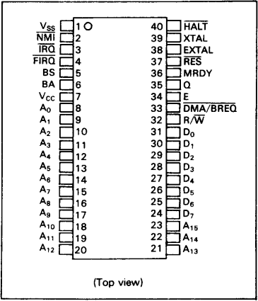
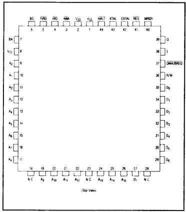
</figure>

* 特徴 
* ハードウェア:  すべてのHMCS6800ペリフェラルとのインタフェース - オートリフレッシュサイクルのないDMA転送 
* ソフトウェア: HD6809と互換性のあるオブジェクトコード 
* 低消費電力モード (スリープモード) 
  - SYNC命令のSYNC状態 
  - CWAI命令のWAIT状態 
* 外部クロック入力 - 内蔵発振器 
* 広い動作範囲:   
  広い動作範囲:  f = 0.5 to 3 MHz (Vcc = 5 V±10%)

|Type No. |Bus Timing
|--|--|
|HD63B09 |2.0 MHz 
|HD63C09 |3.0 MHz 

<figure style="text-align: center">
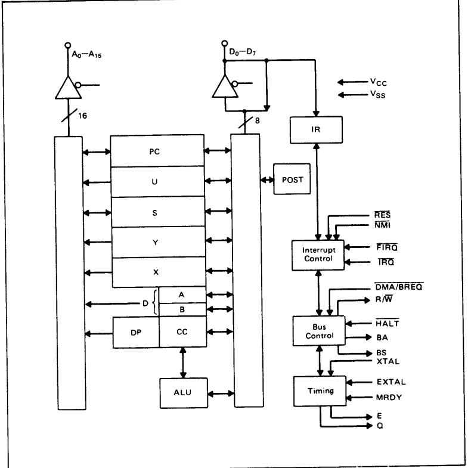
<figcaption>図3 ブロック図</figcaption>
</figure>


### Programming Model 
図1に示すように、HD6309はHD6800で使用可能なセットに3つのレジスタを追加しています。追加されたレジスタは、ダイレクトページレジスタ、ユーザースタックポインタ、2番目のインデックスレジスタです。

<figure style="text-align: center">
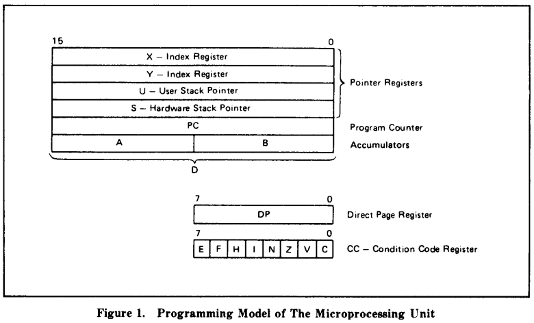
</figure>

### Accumulators (A, B, D) 
AおよびBレジスタは汎用アキュムレータで、算術計算やデータ操作に使用されます。

一部の命令では、A および B レジスタを連結して 1 つの 16 ビットアキュムレータを構成します。これは D レジスタと呼ばれます。D レジスタは A レジスタを最上位バイトとして形成されます。

### Direct Page Register (DP) 
HD6309のダイレクトページレジスタはダイレクトアドレッシングモードを強化します。ダイレクトページレジスタ(DP)は、ダイレクトアドレス指定命令実行時に上位アドレス出力(A8-A15)に表示されます。これにより、ダイレクトモードはプログラム制御の下で、メモリのどの場所でも使用できるようになります。HD6800との互換性を確保するため、このレジスタの全ビットはプロセッサリセット時にクリアされます。

### Index Registers (X, Y) 
インデックスレジスタはインデックスモードアドレッシングで使用します。このレジスタの16ビットアドレスは有効アドレスの計算に使用されます。このアドレスは、データを直接指定するために使用することも、オプションの定数またはレジスタオフセットによって変更することもできます。いくつかのインデックスモードでは、インデックスレジスタの内容は、表データの次の項目を指すためにインクリメントまたはデクリメントされる。4つのポインタレジスタ(X、Y、U、S)すべてをインデックスレジスタとして使用できます。

### Stack Pointer (U, S) 
ハードウェアスタックポインタ(S)は、サブルーチン呼び出しや割り込みの際にプロセッサが自動的に使用します。HD6309のスタックポインタはスタックの先頭を指しますが、HD6800のスタックポインタはスタックの次の空き位置を指していました。ユーザースタックポインター(U)は、プログラマーによって排他的に制御されるため、サブルーチンとの間で引数の受け渡しを簡単に行うことができます。どちらのスタックポインタも、XおよびYレジスタと同じインデックスモードアドレッシング機能を備えていますが、プッシュおよびプル命令もサポートしています。これにより、HD6309はスタックプロセッサとして効率的に使用することができ、高級言語やモジュールプログラミングをサポートする能力が大幅に向上します。
注: HD6309のスタックポインタはスタックの先頭を指しますが、HD6800のスタックポインタはスタックの次の空き位置を指していました。

> Figure 1. Programming Model of The Microprocessing Unit 

### Program Counter (PC) 
プログラムカウンタは、プロセッサが次に実行する命令のアドレスを指すために使用します。相対アドレッシングにより、プログラムカウンタをインデックスレジスタのように使用できます。

### Condition Code Register (CC) 
コンディションコードレジスタは、任意の時点でのプロセッサの状態を定義します。図2 を参照してください。

> Figure 2. Condition Code Register Format 

<figure style="text-align: center">
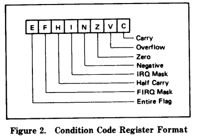
<figcaption>図2. Condition Code レジスタの形式</figcaption>
</figure>

### Condition Code Register Description

### Bit 0 (C) 
ビット 0 はキャリーフラグです。通常、バイナリ ALU からのキャリーです。Cは、減算命令(CMP、NEG、SUB、SBC)の繰り下がり(borrow)を表すためにも使用されます。このときは、バイナリ ALU からのキャリーの補数です。

### Bit 1 (V) 
ビット1はオーバーフローフラグです。符号付き2の補数算術のオーバーフローを引き起こす演算によって1に設定されます。このオーバーフローは、ALU の MSB からのキャリーが MSB から 1 を引いたキャリーと一致しない演算で検出されます。

### Bit 2 (Z) 
ビット2はゼロフラグです。直前の演算結果が同じようにゼロであった場合に 1 に設定されます。

### Bit 3 (N) 
ビット 3 は負フラグです。直前の演算結果の MSB の値がそのまま格納されます。したがって、負の 2 の補数の結果は N を 1 に設定したままにします。

### Bit 4 (I) 
ビット4はIRQマスクビットです。このビットが 1 に設定されている場合、プロセッサは IRQ ラインからの割り込みを認識しません。ÑMI、FIRQ、İRQ、RES、および SWI はすべて I を 1 に設定しますが、SWI2 および SWI3 は I に影響しません。

### Bit 5 (H) 
ビット5はハーフキャリービットです。このビットは、8 ビット加算(ADC または ADD)の結果として、ALU のビット 3 からのキャリーを示すために使用されます。このビットはDAA命令でBCD10進加算調整演算を実行するために使用される。このフラグの状態は、すべての減算類似命令では未定義です。

### Bit 6 (F) 
ビット6はFIRQマスクビットです。このビットが1の場合、プロセッサはFIRQラインからの割り込みを認識しません。NMI、FIRQ、SWI、および RES はすべて F を 1 に設定します。IRQ、SWI2、SWI3 は F に影響しません。

### Bit 7 (E) 
ビット 7 は全体のフラグです。1に設定されると、サブセット状態(PCとCCのみ)でななく、完全なマシン状態(すべてのレジスタ)がスタックに保持されたことを示します。スタックに保持されたCCのEビットは、割り込みからの復帰(RTI)で使用され、スタックからの復帰の範囲を決定する。したがって、コンディションコードレジスタに残っている現在のEは、過去の動作を表している。

## Signal Description 

### Power (Vss, Vcc) 
2つのピンが部品に電源を供給する:  Vss はグランドまたは 0V、Vcc は +5.0V ±10%。

### Address Bus (A0—A15) 
この16ピンはMPU からのアドレス情報をアドレスバスに出力します。プロセッサがデータ転送にバスを必要としない場合、アドレス FFFF、R/W=High、BS=Low を出力する。これは「ダミーアクセス」または VMA サイクルである(図 25、26 参照)。全てのアドレスバスドライバはバス使用可能出力(BA)がHighの時にハイインピーダンスになる。各ピンは1つのショットキーTTL負荷または4つのLS TTL負荷を駆動し、通常90pFを駆動する。

### Data Bus (D0−D7) 
これらの8つのピンは、システムの双方向データバスとの通信を提供します。各ピンは1つのショットキーTTL負荷または4つのLS TTL負荷を駆動し、通常は130pFです。

### Read/Write (R/W) 
この信号は、データバス上のデータ転送方向を示します。LowはMPUがデータバスにデータを書き込んでいることを示す。BAがHの時、R/Wはハイインピーダンスになります。図 25、図 26 を参照してください。

### Reset (RES) 
図 3 に示すように、このシュミットトリガ入力が 1 バスサイクル以上 Low レベルで MPU はリセットされる。リセットベクタは、割り込みアクノリッジが真(BABS=1)の時、FFFE と FFFF の位置(表 2)から取り出されます。初期電源投入時には、クロック発振器が完全に動作するまでリセットラインをLowに保つ必要がある。図4を参照してください。

HD6309のリセットピンは、標準的な周辺回路よりも高いしきい値電圧を持つシュミットトリガー入力を備えているため、単純なR/Cネットワークを使用してシステム全体をリセットすることができます。この高いしきい値電圧により、すべての周辺回路がプロセッサより先にリセット状態から抜け出すことが保証されます。

#### Table 1. Pin Description (6809 nonE version)

Symbol| Pin No. |I/O |Function 
|--|--|--|--|
Vss|1 ||Ground 
NMI |2 |I|Non maskable interrupt 
IRO |3 |I|Interrupt request 
FIRQ |4|I|Fast interrupt request 
BS, BA|5,6| O|Bus status, Bus available 
Vcc |7|| +5V power supply 
A0-A15|8-23|O |Address bus, bits 0-15 
D7-D0|24-31|I/O|Data bus, bits 0-7 
R/W |32| O|Read/Write output 
DMA/BREQ|33| I|DMA Bus request 
E, Q |34, 35| O| Clock signal 
MRDY |36 |I|Memory ready 
/RES |37| I|Reset input 
EXTAL|38|I|Oscillator connection 
XTAL|39|I|Oscillator connection 
HALT |40|I|Halt input

> Table 1. Pin Description 

#### Table 1. Pin Description (6809E version)

Symbol| Pin No. |I/O |Function 
|--|--|--|--|
Vss|1 ||Ground 
NMI |2 |I|Non maskable interrupt 
IRO |3 |I|Interrupt request 
FIRQ |4|I|Fast interrupt request 
BS, BA|5,6| O|Bus status, Bus available 
Vcc |7|| +5V power supply 
A0-A15|8-23|O |Address bus, bits 0-15 
D7-D0|24-31|I/O|Data bus, bits 0-7 
R/W |32| O|Read/Write output 
BUSY|33| O|DMA Bus request 
E, Q |34, 35|I| Clock Inputs 
AVME |36 |O|Advanced VME
/RES |37| I|Reset input 
LIC|38|O|Last Instruction Cycle
TSC|39|I|Three-State control input
HALT |40|I|Halt input

> Table 1. Pin Description 

#### Table 1b. Pin Description (6809/6809E comparison)

|Pin#|6809|I/O |Function| 6809E |I/O |Function 
|--|--|--|--|--|--|--|
1|Vss||Ground |||
2|NMI |I|Non maskable interrupt||| 
3|IRO |I|Interrupt request |||
4|FIRQ|I|Fast interrupt request||| 
5,6|BS,BA|O|Bus status, Bus available||| 
7|Vcc || +5V power supply |||
8-23|A0-A15|O |Address bus, bits 0-15||| 
24-31|D7-D0|I/O|Data bus, bits 0-7 |||
32|R/W |O|Read/Write output |||
33|DMA/BREQ|I|DMA Bus request |BUSY|O|不可分アクセスを示す
34, 35|E, Q |O| Clock signal output|E, Q|I|input|
36|MRDY |I|Memory ready |AVMA|O|次のバスサイクルでバスを使うことを示す。
37|/RES |I|Reset input |||
38|EXTAL|I|Oscillator connection |LIC|O|
39|XTAL |I|Oscillator connection |TSC|I|
40|HALT |I|Halt input|||

> Table 1. Pin Description 


### Halt (HALT) 
この入力端子が Low レベルになると、MPU は現在の命令の終了時に動作を停止し、データを失うことなく 無限に停止し続けます。停止中は BA 出力がハイレベルになり、バスがハイインピーダンスであることを示します。BS出力もHighとなり、プロセッサが停止状態またはバスグラント状態にあることを示す。停止中、MPUは外部からのリアルタイム要求(FIRQ, IRQ)に応答しませんが、DMA/BREQは常に受け付けられ、NMIまたはRESはラッチされます。停止中もQ,Eは正常に動作します。MPUが動作していない(RES)場合、RESがLowのままHALTをLowにすることで停止状態(BA  BS = 1)にすることができます。図 5 を参照してください。

### Bus Available, Bus Status (BA, BS) 
BA 出力は MPU の MOS バスをハイインピーダンスにする内部制御信号である。この信号は、バスが 1 サイクル以上使用可能であることを意味するものではない。BA が Low になると MPU がバスを取得するまでにさらにデッドサイクルが経過する。

BAとデコードされたBS出力信号はMPUの状態を表す。

> 6309E: valid with leading edge of Qが追記されている。

割り込み許可は、ハードウェアベクタフェッチ(RES, NMI, FIRQ, IRQ, SWI, SWI2, SWI3)の両サイクルで示される。この信号と下位4つのアドレスラインのデコードにより、ユーザはどの割り込みレベルが処理されているかを知ることができ、デバイスによるベクタリングが可能になります。表 2 を参照してください。

シンクアクノレッジは、MPUが外部同期を待っている間に表示されます。

HD6309が停止状態またはバスグラント状態の時、Halt/Bus Grantが真になります。

> 6309E: ここにInterrupt Acknowledge, Sync Acknowledge, Halt Acknowledgeの項が追記されている。
> 
> 割り込みアクノレッジは、ハードウェアベクタ-fetch (RES、NMI、FIRQ、IRQ、SWI、SWI2、SWI3) の両サイクル中に表示されます。 この信号と下位4つのアドレスラインのデコードにより、どの割り込みレベルがサービスされているかが分かり、デバイスによるベクタリングが可能になります。 表 1 を参照。
> 
> MPU が外部同期を待っている間、割り込み信号が出力されます。
> 
> HD6309E が停止状態にあるとき、Halt Acknowledge を表示します。

### Non Maskable Interrupt (NMI) 
NMIの負エッジはノンマスカブル割り込みの発生を要求します。ノンマスカブル割り込みは、プログラマが割り込みを禁止することができず、FIRQ、IRQ、ソフトウェア割り込みよりも優先度が高くなります。NMI を認識している間、マシン状態全体がハードウェアスタックに保存されます。リセット後、NMI は、ハードウェアスタックポインタ(S)の最初のプログラムロードまで認識されません。NMIローのパルス幅は、少なくとも1Eサイクルでなければならない。NMI 入力が Q に対して設定された最小値を満たさない場合、割り込みは次のサイクルまで認識されません 図 6 を参照してください。

> Table 2. Memory Map for Interrupt Vectors 

<figure style="text-align: center">
<div>
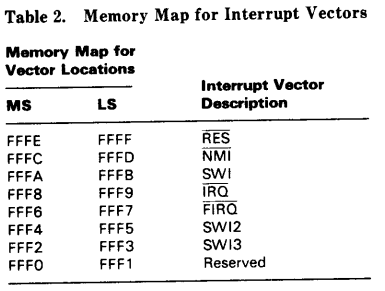
<figcaption>Memory Map and Interrupt Vector</figcaption>
</div>
<div>
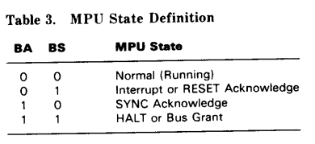
<figcaption>MPU State Definition</figcaption>
</div>
</figure>

Table 3. MPU State Definition 

|BA|BS|MPU State
|--|--|--| 
0|0|Normal (Running) 
0 |1|Interrupt or RESET Acknowledge 
1|0|SYNC Acknowledge 
1|1|HALT or Bus Grant 

<figure style="text-align: center">
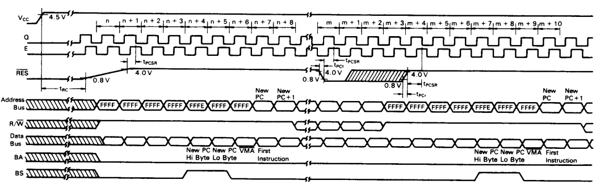
<figcaption>図3. RES Timing</figcaption>
</figure>

> Figure 3. RES Timing 

<figure style="text-align: center">
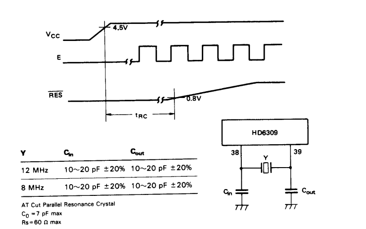
<figcaption>図4. Crystal Connections and Oscillator Start Up </figcaption>
</figure>

> Figure 4. Crystal Connections and Oscillator Start Up 

<figure style="text-align: center">
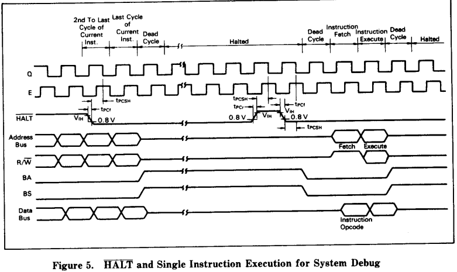
<figcaption>図5. HALT and Single Instruction Execution for System Debug  </figcaption>
</figure>

> Figure 5. HALT and Single Instruction Execution for System Debug 

<figure style="text-align: center">
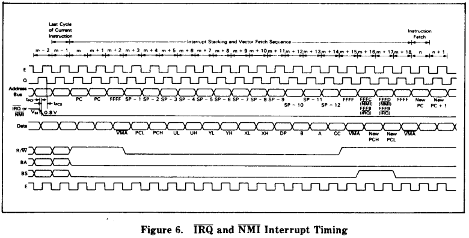
<figcaption>図6. IRQ and NMI Interrupt Timing</figcaption>
</figure>

> Figure 6. IRQ and NMI Interrupt Timing 

<figure style="text-align: center">
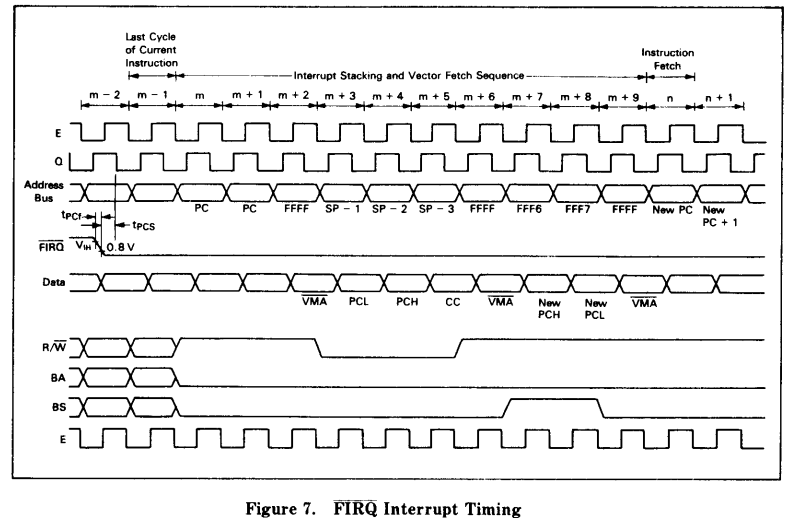
<figcaption>図7. FIRQ Interrupt Timing</figcaption>
</figure>

> Figure 7. FIRQ Interrupt Timing 

### Fast Interrupt Request (FIRQ) 
FIRQ入力がローレベルになると、CCのマスクビット(F)がクリアされている限り、高速割り込み シーケンスが開始されます。このシーケンスは標準割り込み要求(IRQ)よりも優先されます。これは、コンディショニングコードレジスタとプログラムカウンタの内容のみをスタックするという意味で高速です。割り込みサービスルーチンは RTI を実行する前に割り込み元をクリアする必要があります。図 7 を参照してください。

### Interrupt Request (IRQ) 
IRQにローレベルの入力があると、CCのマスクビット(I)がクリアされている限り、割り込み要求シーケンスが開始します。IRQ はマシン状態全体をスタックに退避するので、FIRQ よりも割り込みに対する応答が遅くなります。IRQ は FIRQ よりも優先度が低い。この場合も、割り込みサービスルーチンは RTI を実行する前に割り込み元をクリアする必要があります。図 6 を参照。

注: NMI、FIRQ、IRQ のリクエストは Q の立ち下がりエッジでサンプリングされます。保留中の割り込みは、SYNC または CWAI 条件が存在しない限り、現在の命令が完了するまで処理されません。もしÏRQとFIRQが現在の命令の完了までローのままでなければ、それらは認識されないかもしれない。しかし、NMIはラッチされるので、1サイクルだけローを維持すればよい。

> 6309E: 独自端子の項目。
> 
> ### Clock Inputs E, Q
> EとQはHD6309Eが必要とするクロック信号です。 QはEをリードしていなければなりません。つまり、Qの遷移の後、最小の遅延でEが同様の遷移をする必要があります。 アドレスはEの立ち下がりエッジの後tADでMPUからベールドされ、データはEの立ち下がりエッジでバスからラッチされます。Q入力は完全にTTL互換ですが、E入力は内部MOS回路を直接駆動するため、通常のTTLレベル以上のレベルが必要です。 このアプローチにより、内部バッファ特有のクロックスキューを最小限に抑えることができる。 EとQのタイミングと波形を図1と2に、HD6309Eのシンプルなクロックジェネレーターを図11に示します。
> 
> ### BUSY
> BUSY は、リード-モディファイ-ライト命令のリードおよびモディファイサイクル、およびダブルバイト演算(LDX、STD、ADDDなど)の最初のバイトのアクセス中に "High"になります。 ビジーは、間接命令やその他のベクタフェッチ(ジャンプ拡張命令、SWI間接命令など)の最初のバイトの間にも "High"になります。
> 
> マルチプロセッサシステムでは、BUSYは、上記の操作の完全性を保証するために、次のバスサイクルの再アービトレーションを延期する必要性を示す。 この違いは、いくつかのリードモディファイライト命令のいずれかを使用して、「テストアンドセット」プリミティブに必要な分割不可能なメモリアクセスを提供する。
>
> PSH または PUL 動作中、ビジーはアクティブにならない。 非定型リードモディファイライト命令(ASL)を図 12 に示す。 タイミング情報を図 13 に示す。 ビジーはQの立ち上がりエッジからtCD後に有効になる。
>
> ### AVMA
> AVMAはAdvanced VMA信号で、MPUが次のバスサイクルでバスを使用することを示す。 AVMA信号の予測性により、効率的な共有バスマルチプロセッサシステムを実現します。 AVMAはMPUがHALTまたはSYNC状態の時に "Low"となる。 AVBMAはQの立ち上がりからtCD後に有効となる。
> 
> ### LIC
> LIC(Last Instruction Cycle)は各命令の最終サイクルで "High"となり、"High"から "Low "への遷移は現在のバスサイクル終了時にオペコードの1バイト目がラッチされることを示す。 LICは命令終了時にMPUが停止している時(CWAIやRESET中でない時)、SYNC状態の時、または割り込み中のスタック中に "High"となる。 LICはQの立ち上がりからtCD後に "V"となる。
>
> ### TSC
> TSC(Three-State Control)はMOSアドレス、データ、R/Wバッファをハイインピーダンス状態にする。 制御信号(BA、BS、BUSY、AVMA、LIC)はハイインピーダンス状態にならない。 TSCは、1つのバスを他のバスマスタ(プロセッサやDMAコントローラ)と共有できるようにするためのものである。
> 
> Eが "Low"の間、TSCはアドレスバッファとR/Wを直接制御する。 書き込み動作中のデータバスバッファは、Qが立ち上がるまでハイフインピーダンス状態にあり、その時TSCが真であれば、ハイインピーダンス状態を維持する。  TSCがEの立ち上がりエッジを超えて保持された場合、TSCは内部でラッチされ、バスドライバはバスサイクルの残りの期間、ハイインピーダンス状態を維持する。 図14を参照。
> 
> <figure style+"text-align: center">
> 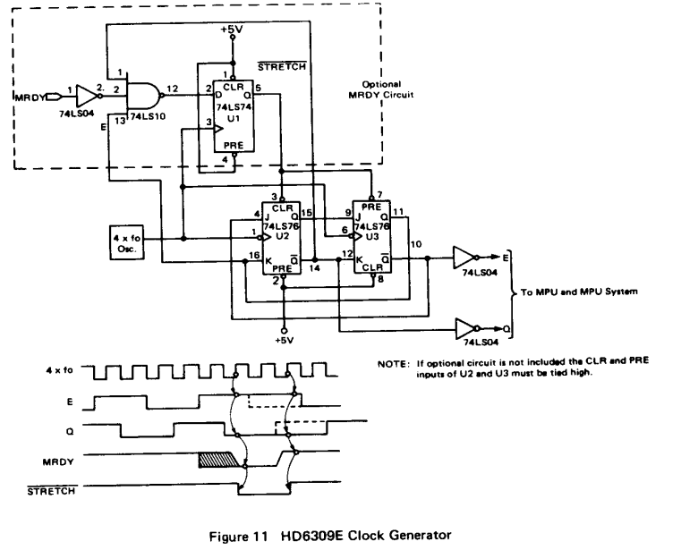
> </figure>
>
> Figure11 HD6309E CLock Generator
> 
> <figure style+"text-align: center">
> 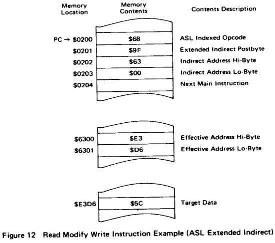
> </figure>
>
> Figure12 Read Modify Write Instruction Example (ASL Extended Indirect)
>
> <figure style+"text-align: center">
> 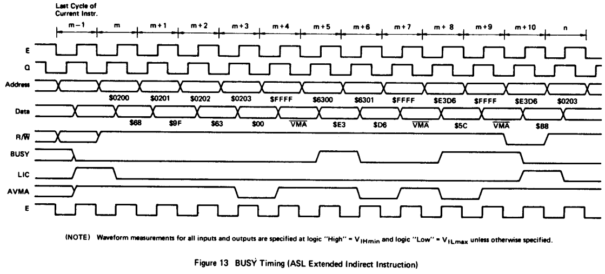
> </figure>
>
> Figure13 BUSY Timing
>
> <figure style+"text-align: center">
> 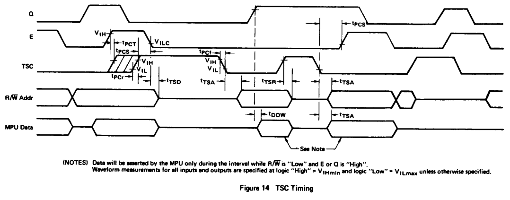
> </figure>
>
> Figure14 TSC Timing
>
> <figure style+"text-align: center">
> 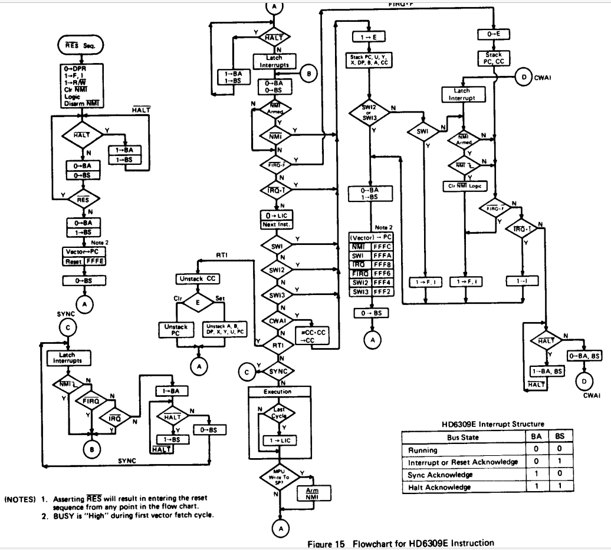
> </figure>
>
> Figure15 Flowchart for HD6303E Instruction

### XTAL, EXTAL (6809のみ)
これらの2つのピンは、並列抵抗基本水晶振動子、ATカットで接続されます。また、EXTALピンは、XTALをフローティングにして外部タイミング用のTTLレベル入力として使用することもできます。水晶振動子または外部周波数はバス周波数の4倍です。図 4 を参照。プリント回路基板のレイアウトには、適切なRFレイアウト技術を遵守する必要があります。

発振回路の基板設計上の注意:  基板設計において、水晶発振器を使用する場合は以下の注意が必要である。図8参照。

1. 水晶発振器と負荷容量Cin,CoutはできるだけLSIの近くに配置すること。(38,39ピンに外来ノイズが誘導されると正常な発振が妨げられることがあります。) 
2. 38,39 ピンの信号線は他の信号線とできるだけ離して配線して下さい。他のラインと並列に配線しないで下さい。(38,39ピンにE,Q信号がフィードバックされると正常な発振が妨げられることがあります。) 

<figure style="text-align: center">
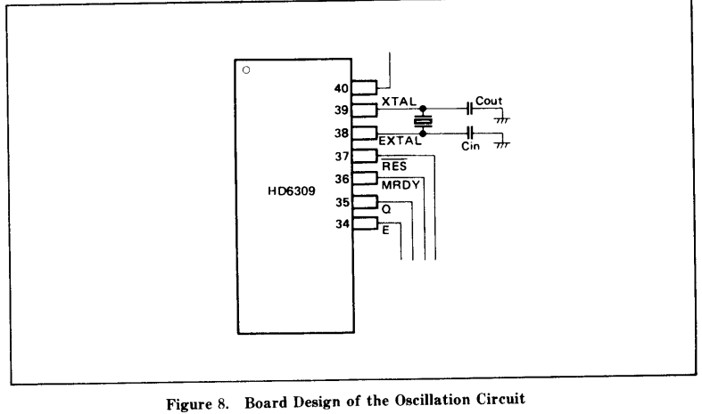
<figcaption>図8. Board Design of the Oscillation Circuit</figcaption>
</figure>

> Figure 8. Board Design of the Oscillation Circuit 
避けるべき設計: 発振回路ラインからの誘導を防ぐため、図9のように信号ラインや電源ラインが発振回路ラインと交差したり、近づいたりしないようにして下さい。XTAL,EXTAL端子間の抵抗は10ΜΩ以上とする。

### E, Q (6809のみ)
EはHD6800のバスタイミング信号2と同様で、QはEをリードする直交クロック信号です。EとQのタイミングを図10に示します。

### Memory Ready (MRDY)  (6809のみ)
この入力制御信号により、EとQを伸ばしてデータアクセス時間を延長することができます。MRDY が H の間、E と Q は正常に動作します。MRDY がローの時、E と Q はハーフ(1/2)バスサイクルの整数倍で伸張することができ、図 11 に示すように低速メモリへのインターフェイスが可能になります。最大ストレッチは5マイクロ秒である。

非有効メモリアクセス(VMAサイクル)の間、MRDYはEとQの伸張に影響しない。これは、「don't care」バスアクセスの間にプロセッサを遅くすることを抑制する。 MRDYは、バス制御が(HALTやDMA/BREQを使用して)外部デバイスに転送された場合に、(低速メモリ用に)クロックをストレッチするために使用することもできる。

MRDY はまた、デッドサイクル中に E と Q をストレッチします。

### DMA Bus Request (DMA/BREQ)  (6809のみ)
DMA/BREQ 入力は、図 12 に示すように、実行を一時停止し、MPU バスを別の用途のために使用するた めのものである。代表的な用途は、DMA やダイナミックメモリリフレッシュである。

DMA/BREQの遷移はQ中に発生する。このピンがLレベルになると現在のサイクルの最後で命令実行を停止する。MPUはBAとBSをハイレベルにすることによりDMA/BREQを認識します。HD6809で実行されたオートリフレッシュはHD6309では実行されません。図13を参照してください。

通常、DMA コントローラは E の立ち上がりエッジで DMA/BREQ 端子をローアサートしてバス の使用を要求し、MPU が BA、BS を 1 にして応答すると、そのサイクルは DMA コントローラにバスのマスタリ ングを移すためのデッドサイクルとなる。

<figure style="text-align: center">
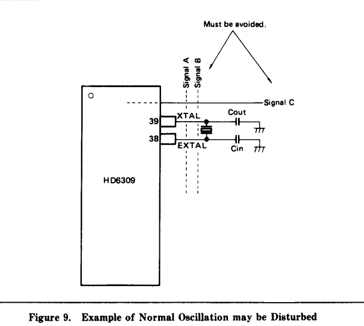
<figcaption>図9. Example of Normal Oscillation may be Disturbed</figcaption>
</figure>

> Figure 9. Example of Normal Oscillation may be Disturbed  (6809のみ)

BAが変化したサイクルでLowになるシステムDMÄVMA信号を開発することで、デッドサイクル中の偽メモリアクセスを防ぐことができる。

BAがLowになる(DMA/BREQがHighになる)と、MPUがメモリにアクセスする前に別のデッドサイクルが経過し、競合なしにバスのマスタシップを転送できるようになる。

DMA/BREQ入力はリセット状態の間Highに接続する。

<figure style="text-align: center">
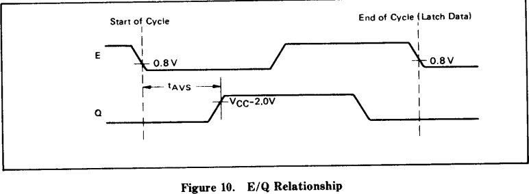
<figcaption>図10. E/Q Relationship</figcaption>
</figure>

> Figure 10. E/Q Relationship (6809のみ) 

<figure style="text-align: center">
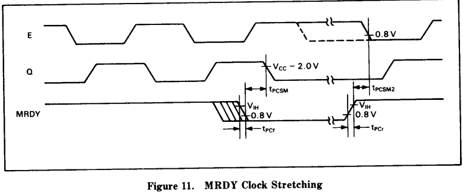
<figcaption>図11. MRDY Clock Stretching </figcaption>
</figure>

> Figure 11. MRDY Clock Stretching  (6809のみ)

## MPU Operation 
通常動作時、MPUはメモリから命令をフェッチし、要求された機能を実行します。このシーケンスは RES から始まり、特別な命令やハードウェアの発生により変更されない限り、 無限に繰り返されます。MPUの通常動作を変更するソフトウェア命令は以下の通りです:  SWI、SWI2、SW13、CWAI、RTI、SYNC。また、割り込み、HALT、DMA/BREQ によっても通常の命令の実行が変更されることがあります。図 14 に HD6309 のフローチャートを示します。

<figure style="text-align: center">
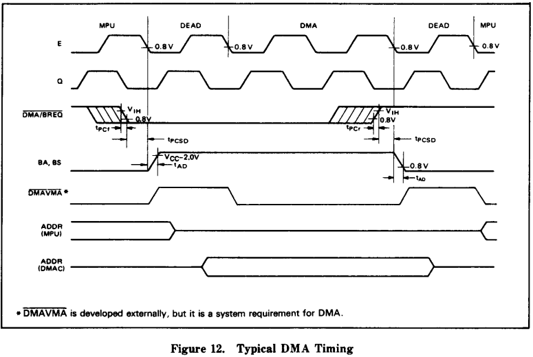
<figcaption>図11. MRDY Clock Stretching </figcaption>
</figure>

> Figure 12. Typical DMA Timing 

<figure style="text-align: center">
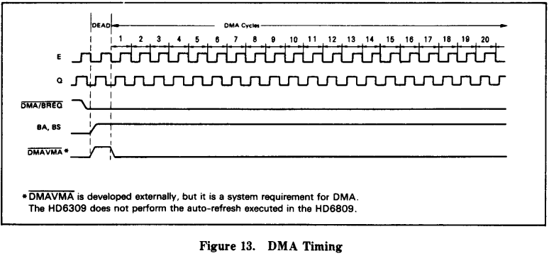
<figcaption>図11. MRDY Clock Stretching </figcaption>
</figure>

> Figure 13. DMA Timing 


<figure style="text-align: center">
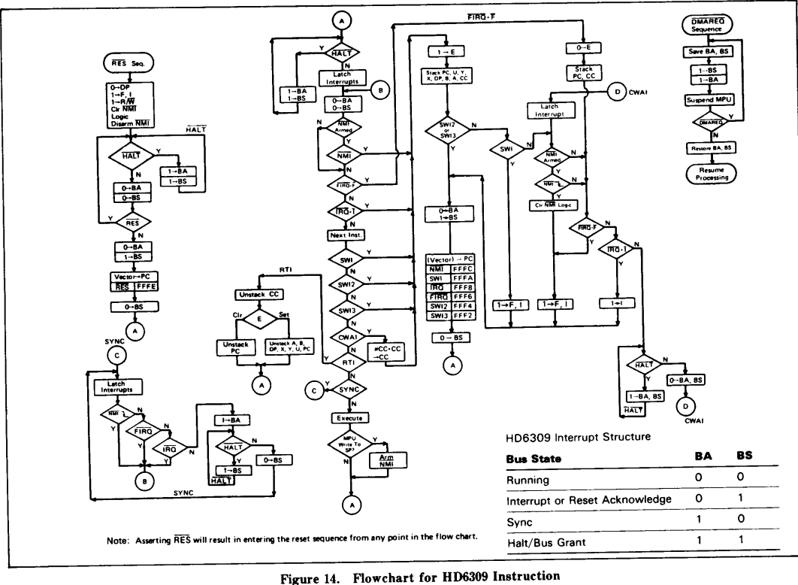
<figcaption>図11. MRDY Clock Stretching </figcaption>
</figure>

> Figure 14. Flowchart for HD6309 Instruction 

## Addressing Modes 
あらゆるコンピュータの基本的な命令は、強力なアドレッシングモードの存在によって大幅に強化されます。HD6309のアドレッシングモードは、現在のマイクロコンピュータの中で最も充実しています。例えば、HD6309は59の基本命令を持っていますが、1464種類の命令とアドレッシングモードを認識します。アドレッシングモードは最新のプログラミング技術をサポートします。HD6309では以下のアドレッシングモードが使用できます:  

* インプライド(アキュムレータを含む) イミディエイト 
* 拡張 
* 拡張間接 
* ダイレクト 
* レジスタ 
* インデックス付き 
  - ゼロオフセット 
  - 定数オフセット 
  - アキュムレータオフセット 
  - 自動インクリメント/デクリメント 
* インデックス付き間接 
* 相対 
* プログラムカウンタ相対

### Implied (Includes Accumulator) 
このアドレッシングモードでは、命令のオペコードに必要なアドレス情報がすべて含まれます。インプライドアドレッシングの例を以下に示します:  ABX、DAA、SWI、ASRA、CLRB。

### Immediate Addressing 
イミディエイトアドレッシングでは、データの実効アドレスはオペコードの直後の位置となります(つまり、命令で使用されるデータは命令のオペコードの直後となります)。HD6309では、オペコードで指定される引数のサイズに応じて、8ビットと16ビットの両方の即値が使用されます。即値指定命令の例を以下に示します:  

```
LDA #$20 
LDX #$F000 
LDY #CAT 
```
注: # は即時アドレス指定、\$ は 16 進値を表す。

### Extended Addressing 
拡張アドレス指定では、オペコードの直後の 2 バイトの内容が、その命令で使用される 16 ビットの有効アドレスを完全に指定します。拡張命令で生成されるアドレスは絶対アドレスを定義し、位置には依存しないことに 注意してください。拡張アドレス指定には次のような例がある: 

```
LDA CAT 
STX LDD 
MOUSE $2000 
```

### Extended Indirect 
インデックス付きアドレッシング(後述)の特殊なケースとして、拡張アドレッシングに 1 つのレベルの間接を追加することができます。拡張間接では、インデックス付き命令のポストバイトに続く2バイトがデータのアドレスを含む。

```
LDA [CAT] 
LDX [$FFFE] 
STU [DOG] 
```

### Direct Addressing 
ダイレクトアドレス指定は、オペコードに続くアドレスが1バイトしかないことを除けば、 拡張アドレス指定に似ている。このバイトは、使用するアドレスの下位8ビットを指定します。アドレスの上位8ビットはダイレクトページレジスタから供給される。ダイレクトアドレス指定に必要なアドレスは1バイトだけなので、このモードは拡張アドレス指定よりも少ないメモリで済み、実行速度も速い。もちろん、DPレジスタの内容を再定義せずにアクセスできるのは256ロケーション(1ページ)だけである。DPレジスタはリセット時に\$00に設定されるため、HD6309のダイレクトアドレッシングはHD6800のダイレクトアドレッシングと互換性があります。ダイレクトアドレッシングではインダイレクトは許されません。ダイレクトアドレッシングの例をいくつか示します: 

```
LDA $30 
SETDP $10 (Assembler directive) 
LDB $1030 
LDD  <CAT
```
Note: \< is an assembler directive which forces direct addressing. 

### Register Addressing 
一部のオペコードの後には、命令で使用されるレジスタまたはレジスタのセットを定義す るバイトが続きます。これはポストバイトと呼ばれる。レジスタアドレッシングの例をいくつか示します:  

```
TFR X,Y Transfers X into Y 
EXG А, В Exchanges A with B 
PSHS A, B, X, Y Push Y, X, B, and A onto S 
PULU X, Y, D Pull D, X, and Y from U 
```

### Indexed Addressing 
すべてのインデックス付きアドレッシングでは、ポインタレジスタ(X、Y、U、S、場合によってはPC)の1つが、命令で使用されるオペランドの実効アドレスの計算に使用されます。インデックス付けには5つの基本タイプがあり、以下で説明します。インデックス付き命令のポストバイトは、アドレス指定モードの基本タイプとバリエーション、および使用するポインタレジスタを指定します。図 15 に、ポストバイトの法的書式を示します。表4は、アセンブラの形式と、各バリエーションのインデックス付きアドレッシングの基本値に追加されるサイクル数とバイト数を示しています。

### Zero-Offset Indexed: 
ゼロオフセットインデックス付き:  このモードでは、選択されたポインタレジスタに、命令で使用されるデータの実効アドレスが格納されます。これは最も高速なインデックスモードです。

例を以下に示す:  

```
LDD 0, X 
LDA S 
```

<figure style="text-align: center">
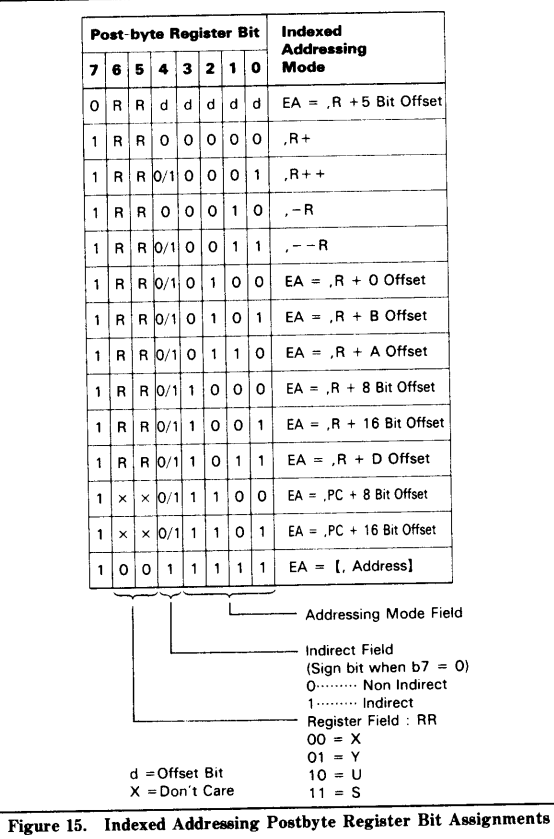
<figcaption>図15. Indexed Addressing Postbyte Register Bit Assignments </figcaption>
</figure>

> Figure 15. Indexed Addressing Postbyte Register Bit Assignments 

### Constant Offset Indexed: 
定数オフセットインデックス付き:  このモードでは、2の補数オフセットとポインタレジスタの1つの内容が加算され、オペランドの実効アドレスが形成されます。ポインタレジスタの初期内容は、加算によって変更されません。

3つのサイズのオフセットが利用可能です。

```
5-bit (-16 to +15) 
8-bit (-128 to +127) 
16-bit (-32768 to+32767) 
```

2 の補数 5 ビットオフセットはポストバイトに含まれるため、バイトとサイクルの使用効率が最も高い。2 の補数 8 ビットオフセットは、ポストバイトに続く 1 バイトに含まれます。2 の補数 16 ビットオフセットは、ポストバイトに続く 2 バイトに含まれます。ほとんどの場合、アセンブラが自動的に最適なサイズを選択するため、プログラマはこのオフセットのサイズを気にする必要はありません。

定数オフセットインデックスの例を以下に示す:  

```
LDA 23, X 
LDX -2, S 
LDY 300, X 
LDU CAT, Y 
```
<figure style="text-align: center">
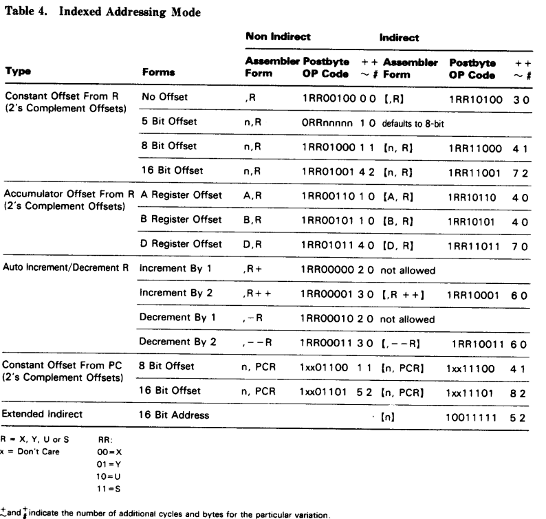
<figcaption>図11. MRDY Clock Stretching </figcaption>
</figure>

> Table 4. Indexed Addressing Mode 

### Accumulator Offset Indexed: 
アキュムレータオフセットインデックス付き:  このモードは定数オフセットインデックス方式と似ていますが、アキュム レータ(A、B、D)の 2 の補数値とポインタレジスタの内容を加算してオペ ランドの実効アドレスを形成する点が異なります。アキュムレータとポインタレジスタの両方の内容は、 加算によって変更されません。ポストバイトは、オフセットとして使用するアキュムレータを指定するもので、 追加バイトは必要ありません。アキュムレータオフセットの利点は、プログラムが実行時にオフセッ トの値を計算できることです。 

いくつかの例を示します: 

```
LDA  B, Y 
LDX  D, Y 
LEAX B, X 
```

### Auto Increment/Decrement Indexed: 
オートインクリメント/デクリメントインデックスド:  オートインクリメントアドレッシングモードでは、ポインタレジスタにオペランドのアドレスが格納される。そして、ポインタレジスタが使用された後、1または2インクリメントされる。このアドレッシングモードは、テーブルのステップ実行やデータの移動、ソフトウェアスタックの作成に便利である。オートデクリメントでは、ポインタレジスタはデータのアドレスとして使用される前にデクリメントされる。オートデクリメントの使用方法はオートインクリメントと似ているが、テーブルなどは上位アドレスから下位アドレスへスキャンされる。インクリメント／デクリメントのサイズは、プログラマが選択可能な8ビットまたは16ビットデータのテーブルをアクセスできるように、1つまたは2つにすることができる。これらのモードのプリデクリメント、ポストインクリメントの性質は、UとSスタックと同じように動作する追加ソフトウェアスタックを作成するために使用することができます。

自動インクリメント/デクリメントアドレッシングモードの例をいくつか挙げる:  

```
LDA ,X+ 
STD ,Y++ 
LDB ,Y 
LDX ,--S
```

16ビットポインタレジスタ(X、Y、U、S)に対する演算を実行する場合、同じレジスタが実効アドレスの計算に使用される場合には注意が必要である。

次の命令を考えてみよう: 
```
STX 0, X++ (X initialized to 0) 
```
この場合、\$0000と\$0001に0を格納し、Xをインクリメントして\$0002を指すようにする。実際には、次のようになる:  

```
0→temp   calculate the EA; temp is a holding register 
X+2→X    perform autoincrement 
X→(temp) do store operation 
```

### Indexed Indirect 
オートインクリメント/オートデクリメント、または±4ビットオフセットを除くすべての インデクシングモードには、さらに1レベルのインダイレクトを指定することができます。間接アドレッシングでは、有効アドレスはインデックスレジスタの内容 に任意のオフセットを加えたものに指定された場所に含まれます。以下の例では、インデックスレジスタとオフセットから計算した有効アドレ スを使用して、A アキュムレータを直接ロードしています。

実行前: 

```
A = X× (don't care)  
X=$F000 
```

```
$0100 LDA [$10, X] EA is now \$F010 

$F010 $F1          $F150 is now the 
$F011 $50          new EA

$F150 $AA
```

After Execution: 
```
A $AA (Actual Data Loaded) 
X=$F000 
```
インデックス付き間接のすべてのモードは、無意味なもの(例えば、1間接による自動インクリメント／デクリメント)を除いて含まれる。インデックス付き間接法の例をいくつか挙げます:  

```
LDA [X] 
LDD [10,S] 
LDA [B,Y] 
LDD [X++] 
```

### Relative Addressing 
分岐オペコードに続くバイトは符号付きオフセットとして扱われ、プログラムカウンタ に追加されます。分岐条件が TRUE の場合、計算されたアドレス(PC + 符号付きオフセット)が プログラムカウンタにロードされます。プログラムの実行は、PC が示す新しい場所で続行されます。ショート(1 バイトオフセット)とロング(2 バイトオフセット)の相対アドレッシングモードが利用可能です。ロング相対アドレッシングでは、有効アドレスがモジュロ216で解釈されるため、すべてのメモリに到達することができます。相対アドレッシングの例をいくつか示します: 

```
        BEQ  CAT (short) 
        BGT  DOG (short) 
CAT     LBEQ RAT (long) 
DOG     LBGT RABBIT (long)


RAT     NOP 
RABBIT  NOP 
```

### Program Counter Relative 
PC は、8 ビットまたは 16 ビットの符号付きオフセットを持つポインタレジスタとし て使用できます。相対アドレス指定と同様に、オフセットは現在の PC に加算され、有効アドレスが作成されます。有効アドレスはオペランドまたはデータのアドレスとして使用されます。プログラムカウンタ相対アドレッシングは、位置に依存しないプログラムを記述するために使用されます。特定のルーチンに関連するテーブルは、プログラムカウンタからの相対参照であ れば、ルーチンが移動しても同じ関係を維持します。例としては 

```
LDA  CAT, PCR 
LEAX TABLE, PCR 
```

プログラムカウンタの相対指定はインデキシングの一種であるため、追加のレベルのインダイレクトが利用可能である。

```
LDA  [CAT, PCR]
LDU  [DOG, PCR] 
```

## HD6309 Instruction Set 
HD6309の命令セットはHD6800のものと似ており、ソースコードレベルで上位互換性があります。オペコード数は72から59に減少していますが、アーキテクチャの拡張とアドレッシングモードの追加により、使用可能なオペコード数は197から1464に増加しています。

いくつかの命令とアドレス指定モードについて、以下に詳しく説明する:  

### PSHU/PSHS 
プッシュ命令では、1 つの命令で任意の 1 つのレジスタ、またはレジスタの セットをハードウェアスタック(S)またはユーザスタック(U)にプッシュ できます。

### PULU/PULS 
プル命令には、プッシュ命令と同じ機能があります。プッシュまたはプルのオペコードの直後のバイトによって、プッシュまたはプルされるレジスタが決まります。実際のPUSH/PULLシーケンスは固定で、図16に示すように、各ビットがプッシュまたはプルする一意のレジスタを定義する。


<figure style="text-align: center">
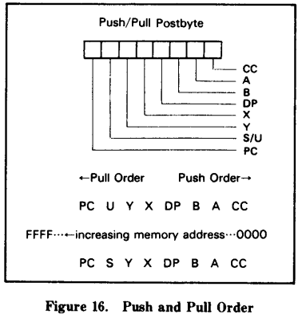
<figcaption>図11. MRDY Clock Stretching </figcaption>
</figure>


> Figure 16. Push and Pull Order 

### TFR/EXG 
HD6309では、どのレジスタも同じサイズの他のレジスタに転送したり、他のレジスタと交換したりすることができます。ポストバイトのビット4-7がソースレジスタを表し、ビット0-3がデスティネーションレジスタを表します(図17)。これらは以下のように表記される: 

```
0000-D 
0001-X 
0010-Y 
0011-U 
0100-S 
0101-PC 
1000-A 
1001-B 
1010-CC 
1011-DP 
```

Note: All other combinations are undefined and invalid. 

### LEAX/LEAY/LEAU/LEAS 
LEA(ロードエフェクティブアドレス)は、インデックス付き命令で使用されるエフェクティブアドレスを計算し、そのアドレスのデータではなく、そのアドレス値をポインタレジスタに格納することで機能する。これにより、プログラマは内部アドレス指定ハードウェアのすべての機能を利用できるようになります。この命令の意味を表 5 にいくつか示します。

LEA 命令はまた、ユーザーが位置に依存しない方法でデータにアクセスすることを可能にします。例えば 

```
LEAX MSG1, PCR 
LBSR PDATA(Print message routine) 
MSG1 FCC 'MESSAGE' 
```

このサンプルプログラムは 'MESSAGE' と表示します。MSG1, PCR を記述することにより、アセンブラは現在のアドレスと MSG1 の間の距離を計算します。この結果は定数としてLEAX命令に格納され、実行時のPC値から割り出されます。このコードがどこにあろうと、実行されたときに計算されたPCからのオフセットがMSG1の絶対アドレスをXポインタレジスタに入れる。このコードは完全に位置非依存である。

LEA 命令は非常に強力で、内部保持レジスタ(temp)を使用します。オートインクリメントおよびオートデクリメントアドレッシングモードで LEA 命令を使用する場合は、内部動作のシーケンスに注意が必要です。LEA内部シーケンスの概要は以下の通りである: 

```
LEAa,b+ 
1. b→temp 2. b + 1-b 3. temp →a 
LEAa,- b 
1. b 1 temp 
2. b 1-b 3. temp →a 
(any of the 16-bit pointer registers X, Y, U, or S may be substituted for a and b) 
(calculate the EA) (modify b, postincrement) (load a) 
(calculate EA with predecrement) 
(modify b, predecrement) (load a) 
```

オートインクリメントバイツー命令とオートデクリメントバイツー命令も同様に動作する。LEAX,X+はXを変更しないが、LEAX,-XはXをデクリメントすることに注意。

### MUL 
A および B アキュムレータ内の符号なし 2 進数を乗算し、符号なしの結 果を 16 ビット D アキュムレータに格納します。この符号なし乗算では、多倍精度乗算も可能です。

<figure style="text-align: center">
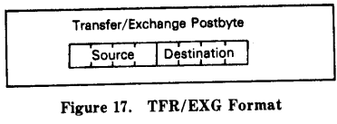
<figcaption>図11. MRDY Clock Stretching </figcaption>
</figure>

> Figure 17. TFR/EXG Format 

<figure style="text-align: center">
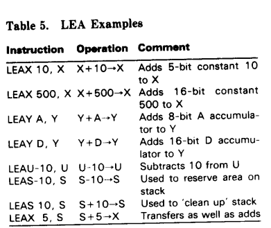
<figcaption>表5. LEA Examples </figcaption>
</figure>

> Table 5. LEA Examples 

### Long And Short Relative Branches 
HD6309はメモリマップ全体を通してプログラムカウンタからの相対分岐が可能です。このモードでは、分岐を行う場合、8ビットまたは16ビットの符号付きオフセットがプログラムカウンタの値に加算され、実効アドレスとして使用されます。これにより、プログラムは64kメモリマップのどこにでも分岐できる。相対分岐を使用することで、位置に依存しないコードを簡単に生成できる。ショートブランチ(8ビット)とロングブランチ(16ビット)の両方が利用できる。

### SYNC 
MPUは同期命令に出会うと同期状態に入り、命令処理を停止して割り込みを待ちます。保留中の割り込み がノンマスカブル(ÑMI)またはマスク可能(FIRQ、IRQ)であり、マスクビット(FまたはI)がクリアされている場合、プロセッサは同期状態をクリアし、通常の割り込みスタックおよびサービスルーチンを実行します。FIRQとIRQはエッジトリガではないので、割り込みを確実に取るには最低3バスサイクルのローレベルが必要です。割り込みがマスク可能(FIRQ、IRQ)で、マスクビット(F または I)が設定されている場合、プロセッサは同期状態をクリアし、次のインライン命令を実行して処理を続行します。図18に同期タイミングを示す。

### Software Interrupt 
ソフトウェア割り込み命令は割り込みを発生させ、関連するベクタをフェッチします。これらのソフトウェア割り込みは、オペレーティングシステムコール、ソフトウェアデバッグ、トレース操作、メモリマッピング、ソフトウェア開発システムなどで有用です。HD6309では、3つのレベルのSWIが利用可能で、以下の順序で優先順位が付けられます:  SWI、SWI2、SW13。

<figure style="text-align: center">
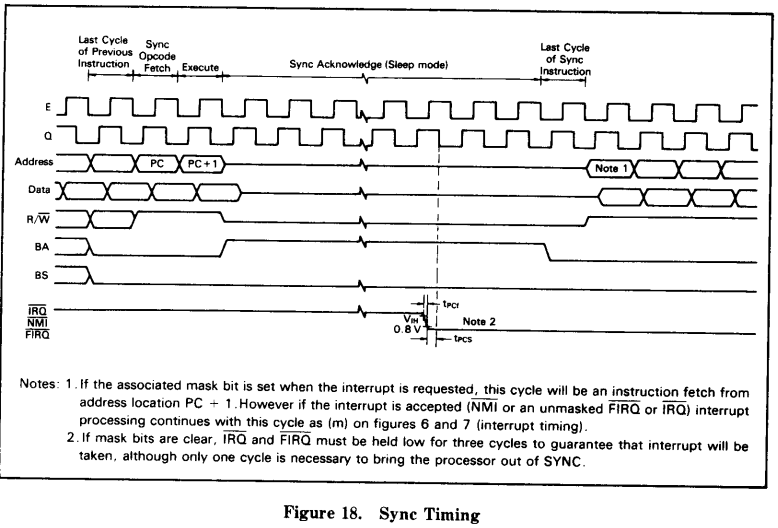
<figcaption>図18. Sync Timing </figcaption>
</figure>

Notes: (of Sync Timing)

> 注意事項 
> 1. 割り込みが要求されたときに関連するマスクビットが設定されている場合、このサイクルはアドレス位置PC + 1からの命令フェッチになります。しかし、割り込みが受け入れられた場合(NMIまたはマスクされていないFIRQまたはIRQ)、割り込み処理は図6と7(割り込みタイミング)の(m)のようにこのサイクルで続行されます。
> 2. マスクビットがクリアされている場合、IRQとFIRQは割り込みがかかることを保証するために3サイクルLowに保持する必要があります。但し、プロセッサをSYNCから外すのに必要なのは1サイクルのみである。

> Figure 18. Sync Timing 

### 16-Bit Operation 
HD6309は16ビットのデータ処理が可能です。これらの命令には、ロード、ストア、比較、加算、減算、転送、交換、プッシュ、プルが含まれます。

### Cycle-by-Cycle Operation 
アドレスバスのサイクルごとの性能チャートは、HD6309の各命令とアドレスモードに対応するメモリアクセスシーケンスを示しています。各命令はオペコードのフェッチから始まります。そのオペコードが内部でデコードされている間、次のプログラムバイトが常にフェッチされます。(ほとんどの命令は次のバイトを使用するため、この手法によりスループットが大幅に高速化されます)。次に、各オペコードの動作をフローチャートに沿って説明する。VMAはアドレスバス上のFFFF16を示し、R/WはHigh、BSはLowである。以下の例はチャートの使い方を示している: 図19参照。

<figure style="text-align: center">
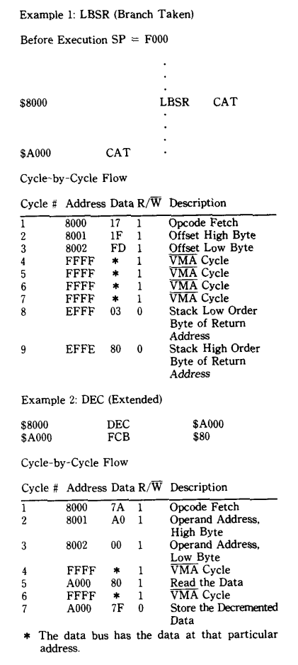
<figcaption>例1.LBSR (Branch Taken)</figcaption>
</figure>

> Example 1: LBSR (Branch Taken) 

Notes: (of Figure 19)

1. Each state shows  
  Data Bus    Offset High  
  Address Bus NNNN+1(2)  
2. Address NNNN is location of opcode. 
3. If opcode is two byte opcode subsequent addresses are in parenthesis ( ). 
4. Two-byte opcodes are highlighted. 

* The data bus has the data at that particular address. 

<figure style="text-align: center">
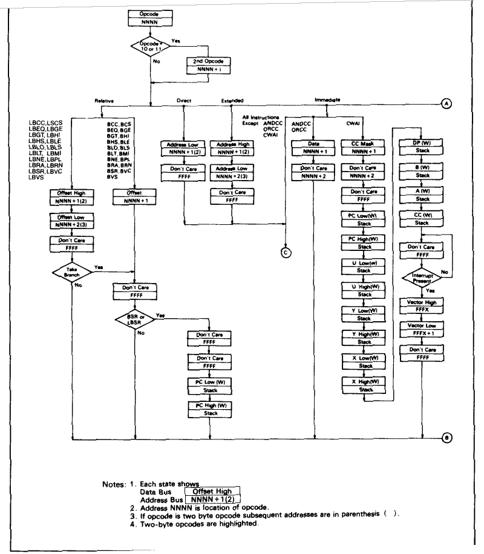
<figcaption>図19. Cycle-by-Cycle Performance</figcaption>
</figure>

> Figure 19. Cycle-by-Cycle Performance (1)

<figure style="text-align: center">
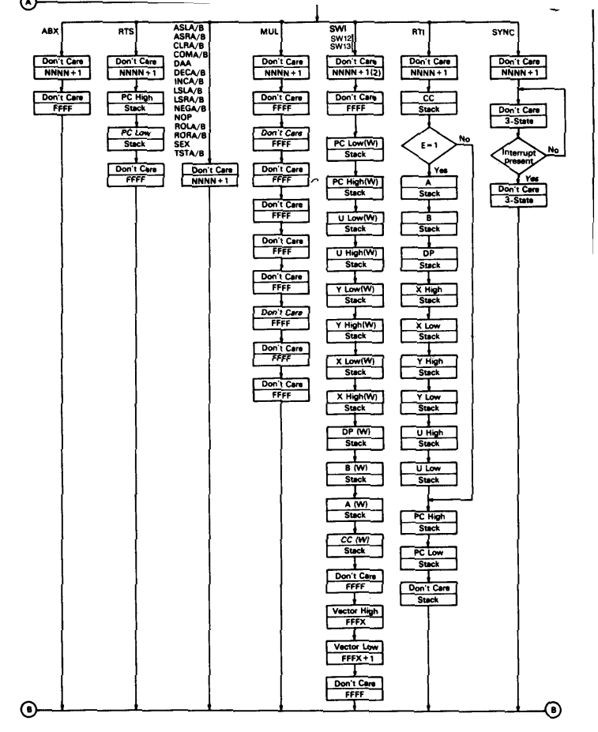
<figcaption>図19. Cycle-by-Cycle Performance</figcaption>
</figure>

> Figure 19. Cycle-by-Cycle Performance (Cont.) (2)

<figure style="text-align: center">
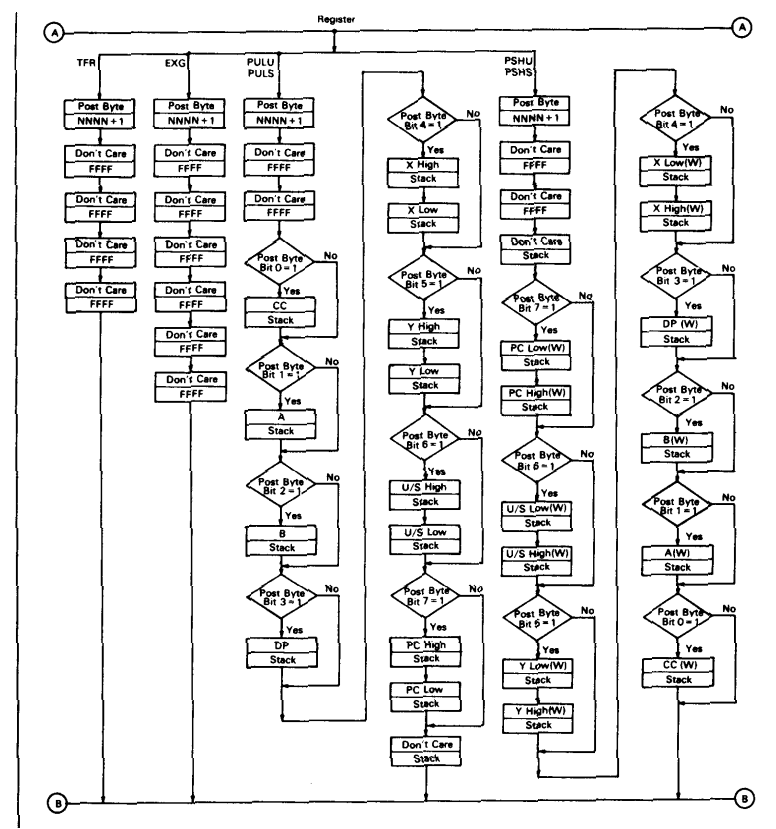
<figcaption>図19. Cycle-by-Cycle Performance</figcaption>
</figure>

> Figure 19. Cycle-by-Cycle Performance (Cont.) (3)

<figure style="text-align: center">
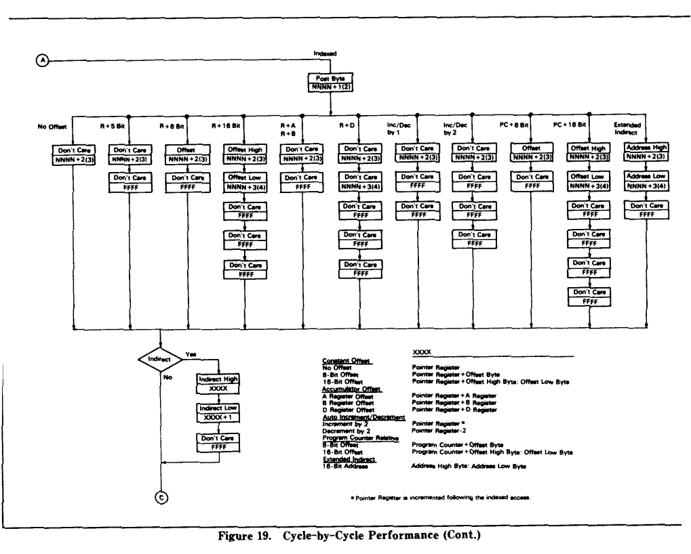
<figcaption>図19. Cycle-by-Cycle Performance</figcaption>
</figure>

> Figure 19. Cycle-by-Cycle Performance (Cont.) (4)

### Sleep mode

During the interrupt wait period in the SYNC instruction (the sync state) and in the CWAI instruction (the wait state), MPU operation is halted and goes to the sleep mode.  However, the state of I/O pins is the same as that of the HD6809 in this mode.

## HD6309 Instruction set Tables

The instruction of the HD6309 hav ebeen broken down into five different categories.  They are as follows:

* 8-bit operation (table 6)
* 16-bit operation (table 7)
* Index register/stack pointer instructions (table 8)
* Relative branches (long and short) (table 9)
* Miscellaneous instructions (table 10)

HD6309 instruction set tables and Hexadecimal Values of instructions are shown in table 11 and table 12.

<figure style="text-align: center">
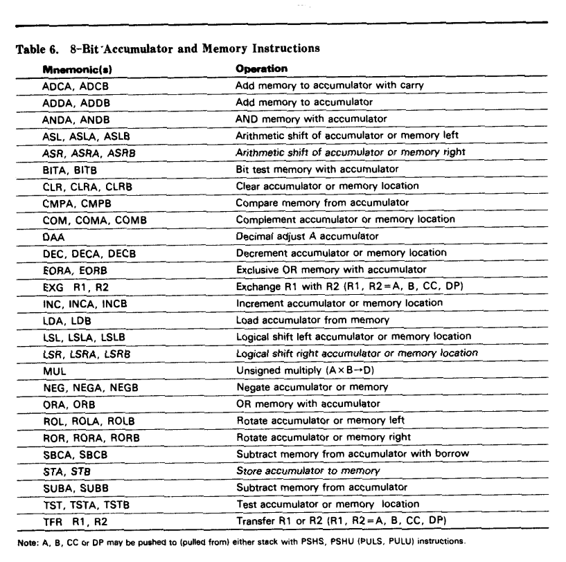
<figcaption>表6. 8-Bit Accumulator and Memory Instructions</figcaption>
</figure>

> Table 6. 8-Bit Accumulator and Memory Instructions

<figure style="text-align: center">
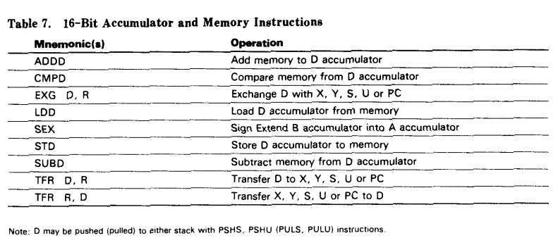
<figcaption>表7. 16-Bit Accumulator and Memory Instructions</figcaption>
</figure>

> Table 7. 16-bit Accumulator and Memory Instructions

<figure style="text-align: center">
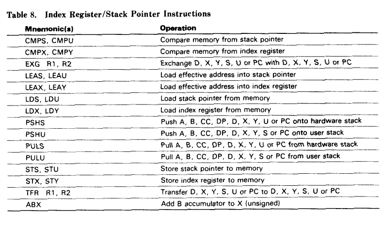
<figcaption>表8. Index Register/Stack Pointer Instructions</figcaption>
</figure>

> Table 8. Index Register/Stack Pointer Instructions

<figure style="text-align: center">
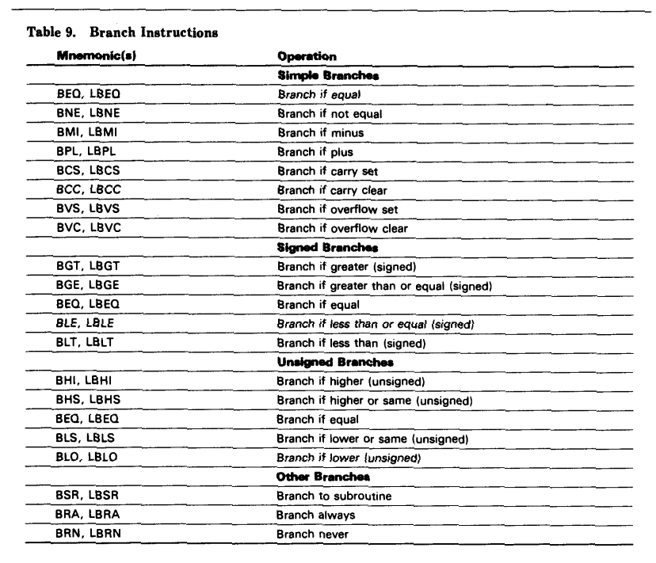
<figcaption>表9. Branch Instructions</figcaption>
</figure>

> Table 9. Branch Instructions

<figure style="text-align: center">
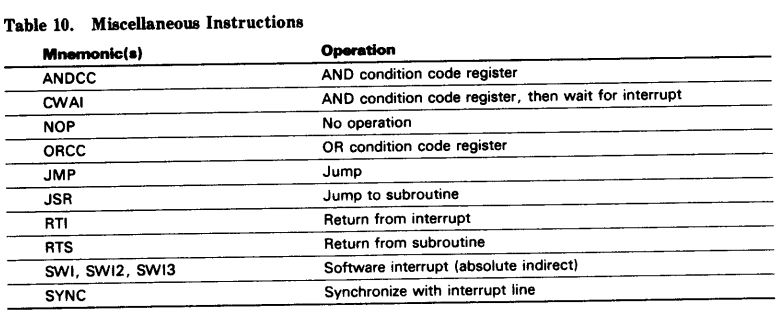
<figcaption>表10. Miscellaneous Instructions</figcaption>
</figure>

> Table 10. Miscellaneous Instructions

<figure style="text-align: center">
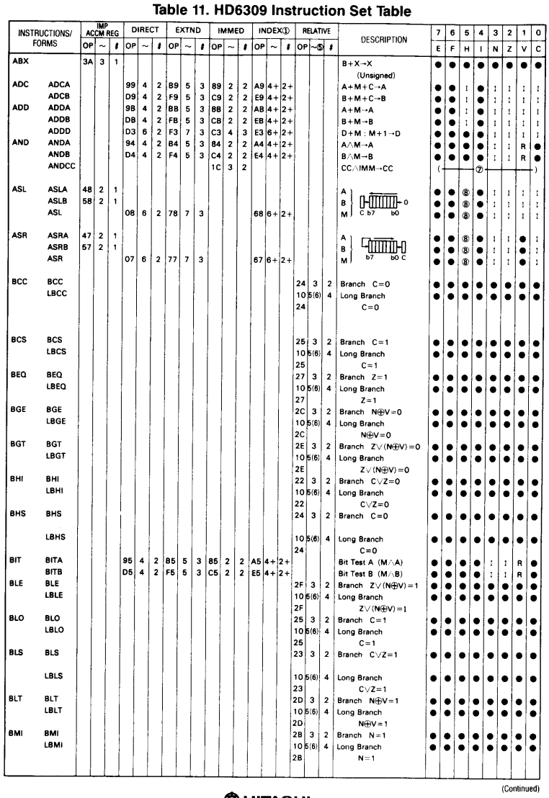
<figcaption>表11. HD6309 Instruction Set Table (1)</figcaption>
</figure>

> Table 11. HD6309 Instruction Set Table (1)

<figure style="text-align: center">
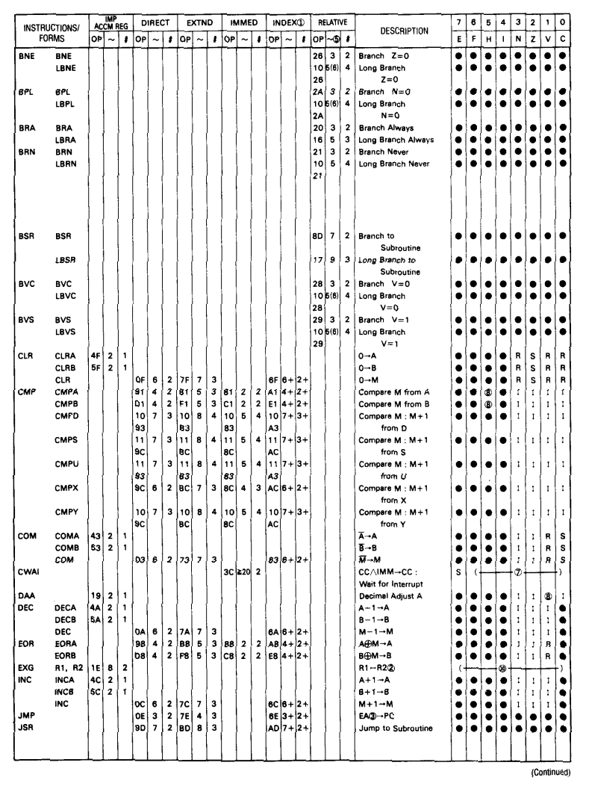
<figcaption>表11. HD6309 Instruction Set Table (2)</figcaption>
</figure>

> Table 11. HD6309 Instruction Set Table (2)

<figure style="text-align: center">
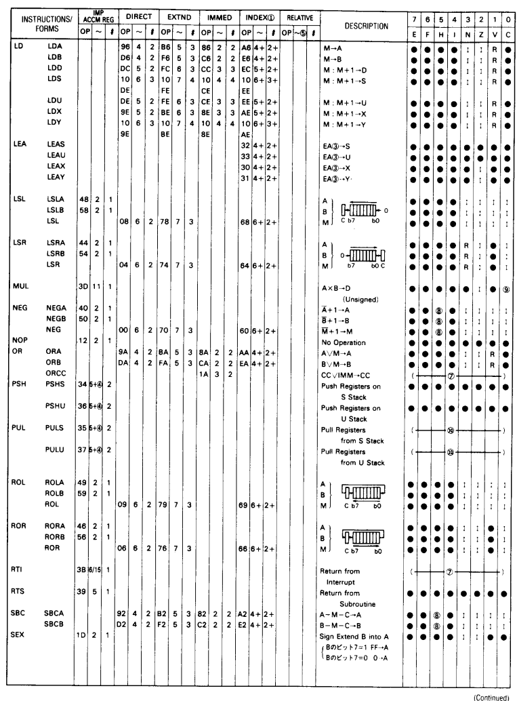
<figcaption>表11. HD6309 Instruction Set Table (3)</figcaption>
</figure>

> Table 11. HD6309 Instruction Set Table (3)

<figure style="text-align: center">
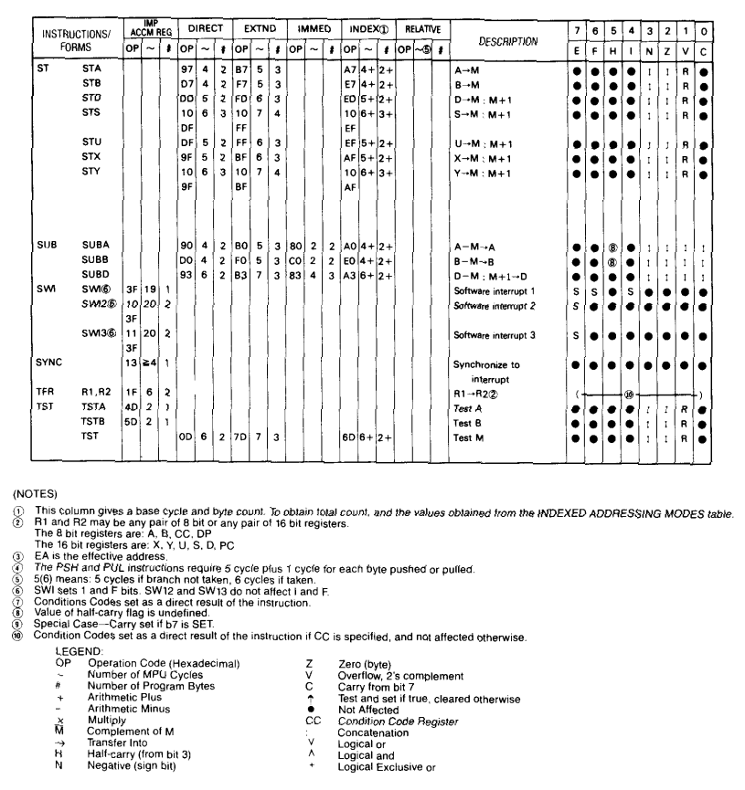
<figcaption>図11. HD6309 Instruction Set Table (4)</figcaption>
</figure>

> Table 11. HD6309 Instruction Set Table (4)

(NOTES) (for Table 11)
 
1. This column gives a base cycle and byte count. To obtain total count, and the values obtained from the INDEXED ADDRESSING MODES table. 
2. R1 and R2 may be any pair of 8 bit or any pair of 16 bit registers.  
  The 8 bit registers are: A, B, CC, DP  
  The 16 bit registers are: X, Y, U, S, D, PC 
3. EA is the effective address. 
4. The PSH and PUL instructions require 5 cycle plus 1 cycle for each byte pushed or pulled. 
5. 5(6) means: 5 cycles if branch not taken, 6 cycles if taken. 
6. SWI sets 1 and F bits. SW12 and SW13 do not affect I and F. 
7. Conditions Codes set as a direct result of the instruction. 
8. Value of half-carry flag is undefined. 
9. Special Case-Carry set if b7 is SET. 
10. Condition Codes set as a direct result of the instruction if CC is specified, and not affected otherwise. 

<figure style="text-align: center">
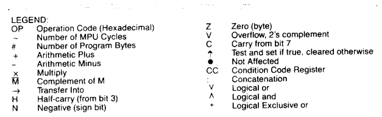
<figcaption>Legend</figcaption>
</figure>

> Legend

<figure style="text-align: center">
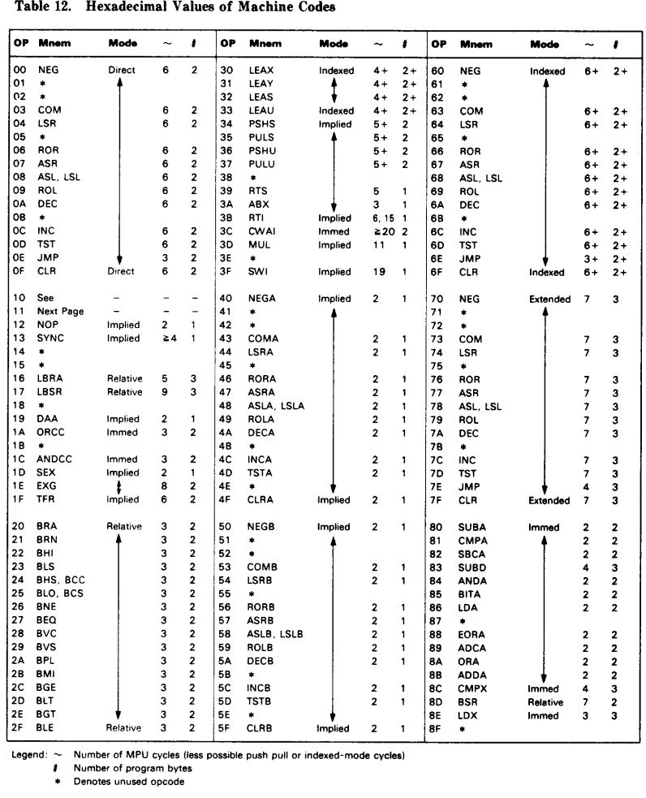
<figcaption>表12. Hexadecimal Values and Machine Codes</figcaption>
</figure>

> Table 12. Hexadecimal Values and Machine Codes

<figure style="text-align: center">
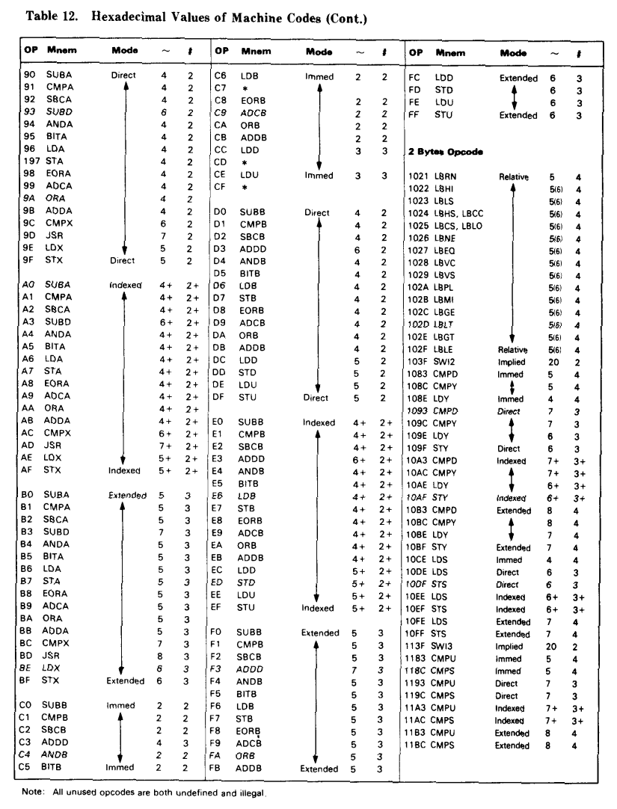
<figcaption>表12. Hexadecimal Values and Machine Codes (Cont.)</figcaption>
</figure>

> Table 12. Hexadecimal Values and Machine Codes (Cont.)

## Note for Use 

### Compatibility with NMOS MPU (HD6809のみ) 
HD6309(CMOS)とHD6809(NMOS)の違いを表13に示します。

<figure style="text-align: center">
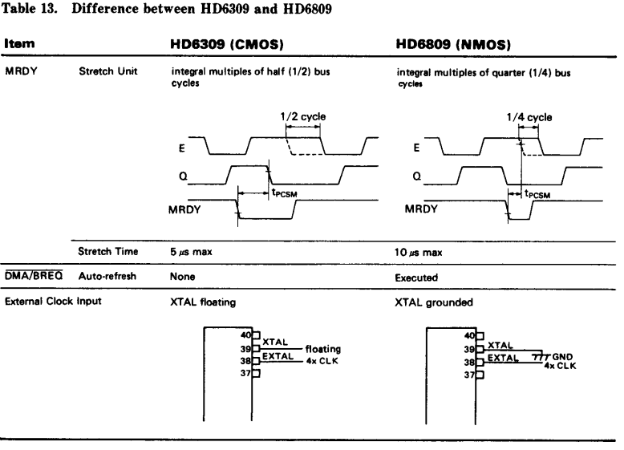
<figcaption>表13. Difference between HD6309 and HD6809</figcaption>
</figure>

> Table 13. Difference between HD6309 and HD6809 

### Execution Sequence of CLR Instruction 
CLR命令(ダイレクト、拡張、インデックスアドレッシングモード)のサイクルごとの流れを以下に示します。このシーケンスでは、オペランドで指定されたメモリ位置に 00 を書き込む前に、その内容が読み出されます。IRQフラグのようなステータスフラグは、周辺デバイスのコントロール/ステータスレジスタ(読み出しと書き込みで同じアドレスを共有)にアクセスする場合、この余分なデータ読み出し動作によってクリアされることに注意してください。

Example: CLR (Extended) 
```
$8000   CLR $A000 
$A000   FCB $80
```

Cycle #|Address|Data|R/W|Description
|--|--|--|--|--| 
1|8000|7F|1|Opcode Fetch 
2|8001|A0|1|Operand Address,High Byte 
3|8002|00|1|Operand Address, Low Byte 
4|FFFF|\*|1|VMA Cycle 
5|A000|80|1|Read the Data 
6|FFFF|\*|1|VMA Cycle 
7|A000|00|0|Store Fixed 00 into Specified Location 

*The data bus has the data at that particular address. 


## Application Note for System Design 
アドレスバスの後縁で、HD6309の出力信号にノイズパルスが現れることがあります。

ノイズパルスとその対策について以下に示します。

ノイズの発生条件 図20に示すように、アドレスバスがHighからLowに変化する時、EクロックとQクロックに0.8V以上のノイズパルスが現れることがあります。

アドレスバス(A～A15,R/W)がHighからLowに変化するとGNDに過渡電流が流れる。この電流と GND 配線のインピーダンス状態に応じて LSI の Vss 端子にノイズパルスが発生する。

図 21 に各パラメータに対するノイズ電圧依存性を示す。

図 23 にアドレスバスの負荷容量に対するノイズ電圧依存性を示す。

注: ノイズレベルは、実際のアプリケーションシステムの各パラメータに依存するため、慎重に確認する必要がある。

ノイズの低減

1. 図21のCd,Vcc,Zgなどの各パラメータを制御し、ノイズレベルを許容値まで下げる。
2. HD6309のVccとGND間にバイパスコンデンサを挿入する。
3. ノイズマージンのあるCMOSバッファをE、Qクロックに接続する。
4. アドレスバスにダンピングレジスタを挿入する。ダンピング抵抗は、図22に示すように、アドレスバスの上位バイト(A 15 A)に40～50程度、下位バイト(A7～A)に130～140 2程度、R/Wに挿入します。ダンピング抵抗を挿入しても電気的特性は変わらない。

<figure style="text-align: center">
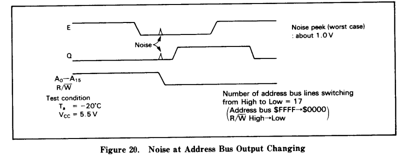
<figcaption>図20. Noise at Address Bus Output Changing</figcaption>
</figure>

> Figure 20. Noise at Address Bus Output Changing 

<figure style="text-align: center">
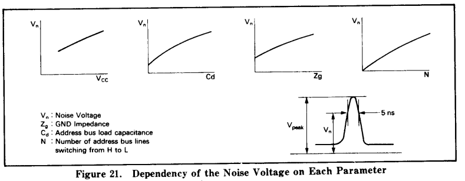
<figcaption>図21. Dependency of the Noise Voltage on Each Parameter</figcaption>
</figure>

> Figure 21. Dependency of the Noise Voltage on Each Parameter 

<figure style="text-align: center">
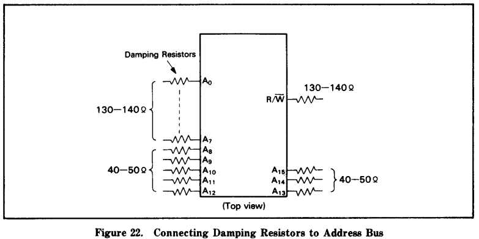
<figcaption>図22. Connecting Damping Resistors to Address Bus </figcaption>
</figure>

> Figure 22. Connecting Damping Resistors to Address Bus 

<figure style="text-align: center">
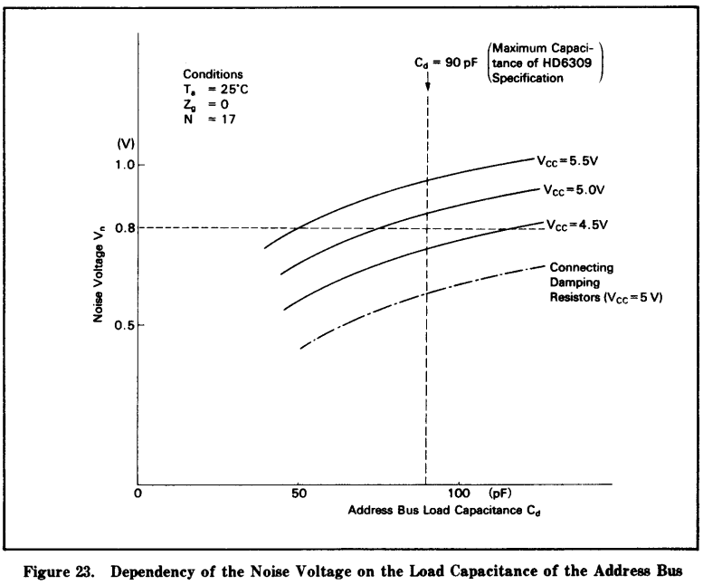
<figcaption>図23. Dependency of the Noise Voltage on the Load Capacitance of the Address Bus</figcaption>
</figure>

> Figure 23. Dependency of the Noise Voltage on the Load Capacitance of the Address Bus 

## Absolute Maximum Ratings 

<figure style="text-align: center">
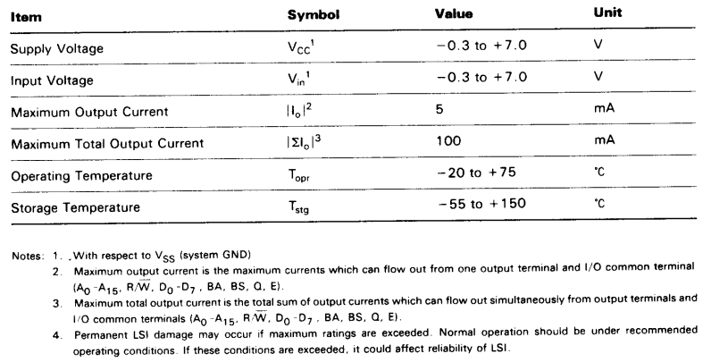
<figcaption>表. Absolute Maximum Ratings</figcaption>
</figure>

> table

Notes: 
1. With respect to Vss (system GND) 
2. Maximum output current is the maximum currents which can flow out from one output terminal and I/O common terminal (Ao-A15, RW, Do -D7, BA, BS, Q, E). 
3. Maximum total output current is the total sum of output currents which can flow out simultaneously from output terminals and 1/0 common terminals (Ao -A15. R/W, Do-Dy, BA, BS, Q, E). 
4. Permanent LSI damage may occur if maximum ratings are exceeded. Normal operation should be under recommended operating conditions. If these conditions are exceeded, it could affect reliability of LSI.

## Recommended Operating Conditions 

<figure style="text-align: center">
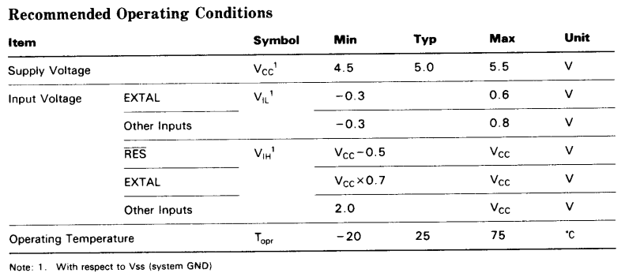
<figcaption>表 Recommended Operating Conditions</figcaption>
</figure>

> table

Note: 1. With respect to Vss (system GND) 

### Electrical Characteristics 

DC Characteristics (Vcc=5.0 V ± 10%, Vss=0 V, Ta=-20 to +75°C, unless otherwise noted.) 

<figure style="text-align: center">
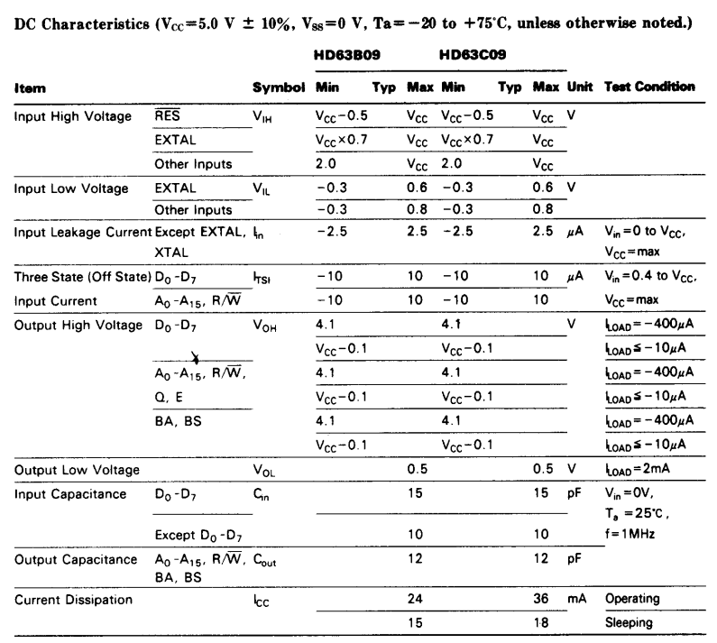
<figcaption>表. DC Characteristics</figcaption>
</figure>

> table

### Clock Timing 

<figure style="text-align: center">
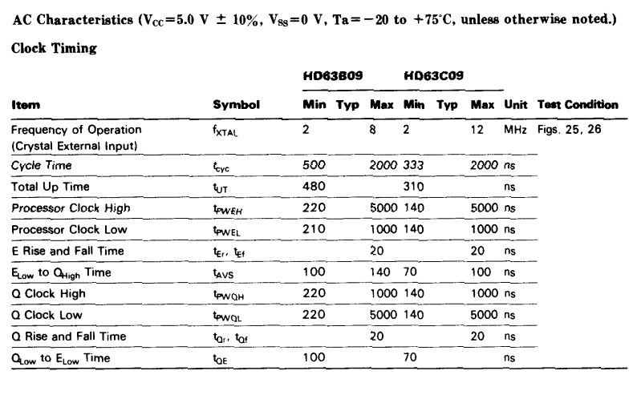
<figcaption>表. Clock Timing</figcaption>
</figure>

> table

### Bus Timing 

<figure style="text-align: center">
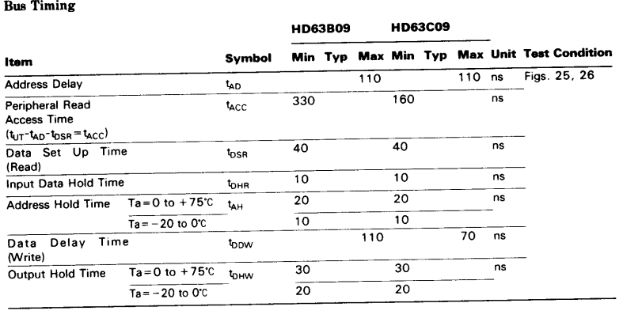
<figcaption>表. Bus Timing</figcaption>
</figure>

>table 

### Processor Control Timing 

<figure style="text-align: center">
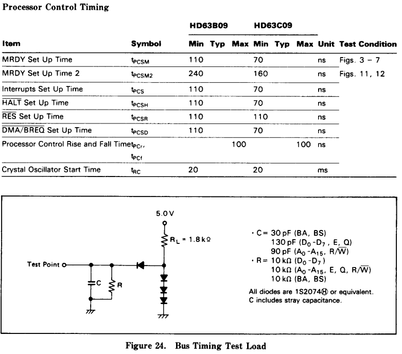
<figcaption>図24. Bus Timing Test Load</figcaption>
</figure>

> Figure 24. Bus Timing Test Load 

<figure style="text-align: center">
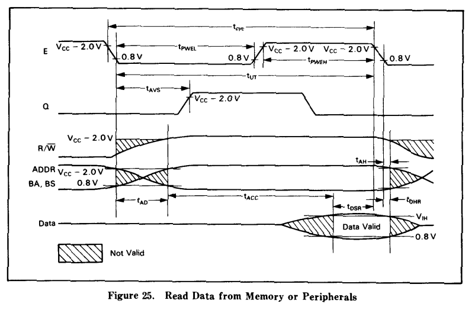
<figcaption>図25. Read Data from Memory or Peripherals</figcaption>
</figure>

> Figure 25. Read Data from Memory or Peripherals 

<figure style="text-align: center">
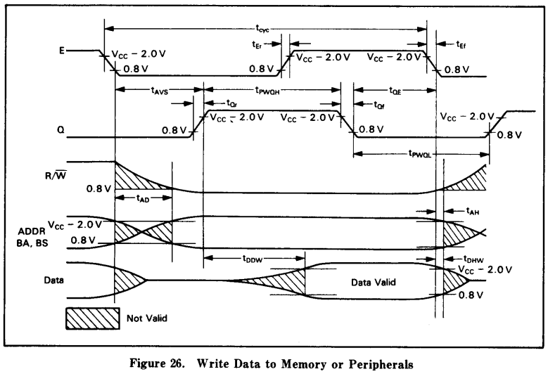
<figcaption>図26. Write Data to Memory or Peripherals</figcaption>
</figure>

> Figure 26. Write Data to Memory or Peripherals 

