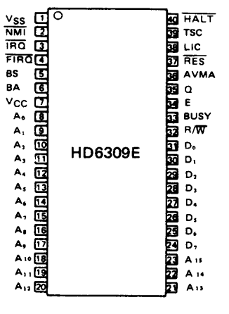
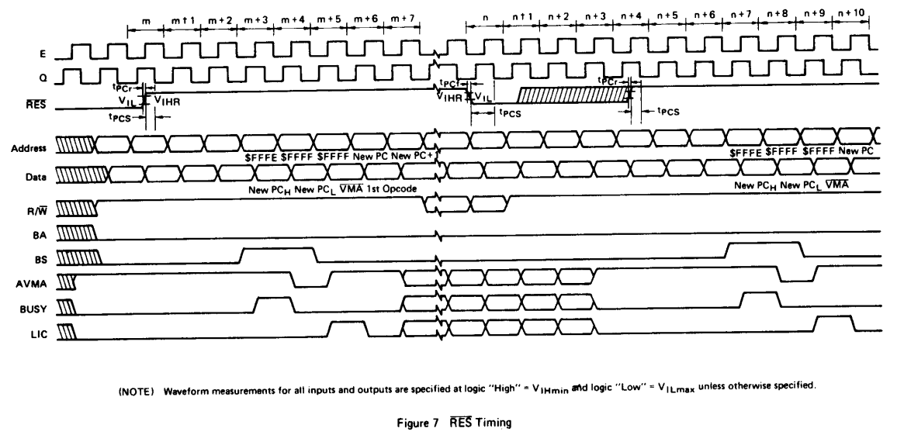
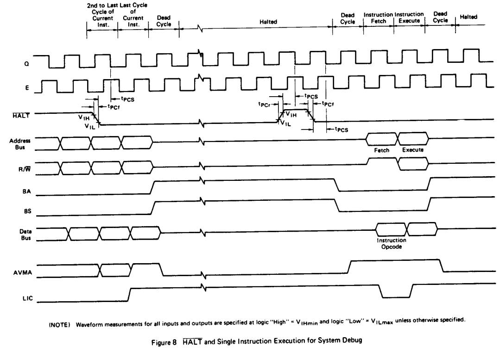
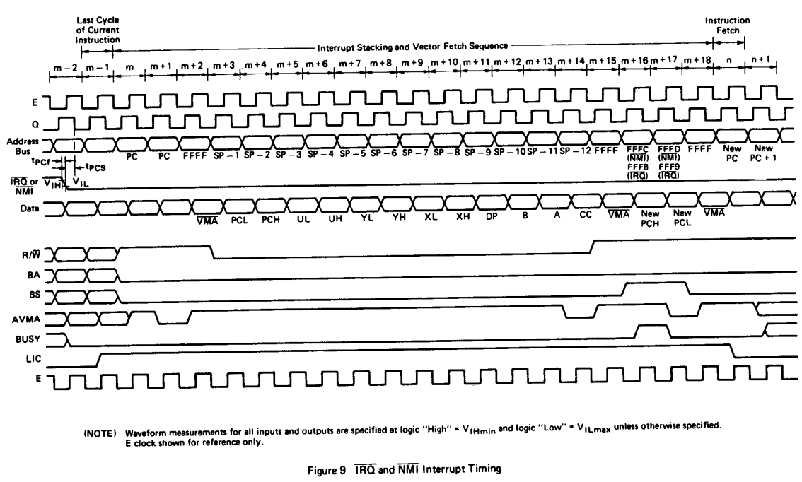
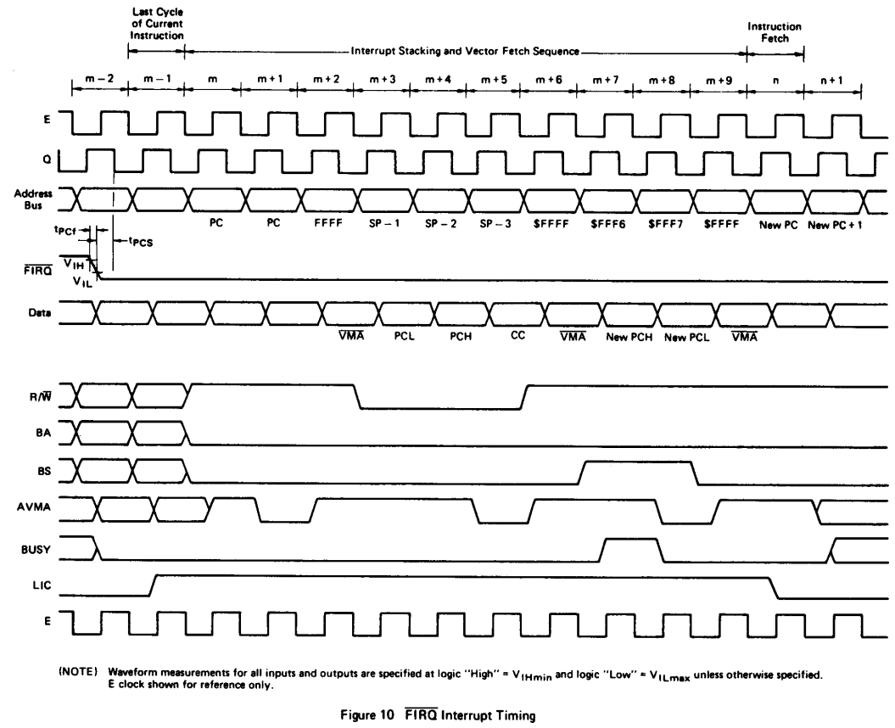

# HD63C09E Pin Description

<figure style="text-align: center">

</figure>

## Power (Vss, Vcc)
Two pins are used to supply power to the part: Vss is ground or 0 volts, while Vcc is +5.0 V ±10%.

2つのピンが部品への電源供給に使用される: Vssはグランドまたは0ボルト、Vccは+5.0V±10%である。

## Address Bus (A0 ~ A15)
Sixteen pins are used to output address information from the MPU onto the Address Bus. When the processor does not require the bus for a data transfer, it will output address FFFF 16, R/W = "High", and BS = "Low"; this is a "dummy access" or VMA cycle. All address bus drivers are made high- impedance when output Bus Available (BA) is "High" or when TSC is asserted. Each pin will drive one Schottky TTL load or four LS TTL loads, and 90 pF. Refer to Figures 1 and 2.

この16ピンは、MPUからアドレス情報をアドレスバスに出力するために使用される。プロセッサがデータ転送のためにバスを必要としない場合、アドレス FFFF(16)、R/W = "High"、BS = "Low "を出力する。全てのアドレスバスドライバは、バスアベイラブル(BA)出力が "High" またはTSCがアサートされるとハイインピーダンスになる。各ピンは1つのショットキーTTL負荷または4つのLS TTL負荷と90pFを駆動する。図 1 と図 2 を参照してください。

## Data Bus (Do ~ D7)
These eight pins provide communication with the system bi-directional data bus. Each pin will drive one Schottky TTL load or four LS TTL loads, and 130 pF.

これらの8つのピンは、システムの双方向データバスとの通信を提供する。各ピンは、1つのショットキーTTL負荷または4つのLS TTL負荷と130 pFを駆動します。

## Read/Write (R/W)
This signal indicates the direction of data transfer on the data bus. A "Low" indicates that the MPU is writing data onto the data bus. R/W is made high impedance when BA is "High" or when TSC is asserted. Refer to Figures 1 and 2.

この信号は、データバス上のデータ転送方向を示す。Low "はMPUがデータバスにデータを書き込んでいることを示す。R/WはBAが "H "またはTSCがアサートされるとハイインピーダンスとなる。図 1、図 2 を参照すること。

## RES
A "Low" level on this Schmitt-trigger input for greater than one bus cycle will reset the MPU, as shown in Figure 7. The Reset vectors are fetched from locations FFFE16 and FFFF16 (Table 1) when Interrupt Acknowledge is true, (BA · BS = 1). During initial power-on, the Reset line should be held "Low" until the clock input signals are fully operational.

Because the HD6309E Reset pin has a Schmitt-trigger input with a threshold voltage higher than that of standard peripherals, a simple R/C network may be used to reset the entire system.

このシュミットトリガ入力が 1 バスサイクル以上 "Low "レベルになると MPU はリセットされる(図 7)。リセットベクタは、割り込み認識(Interrupt Acknowledge)が真(/BA・BS = 1)の時、FFFE(16) と FFFF(16) の位置(表 1)から取り出される。初期電源投入時には、クロック入力信号が完全に動作するまでリセットラインを "Low"に保持する必要があります。

HD6309Eのリセットピンははシュミットトリガ入力で、標準的な周辺回路よりも高いしきい値電圧を持つため、単純なR/Cネットワークを使用してシステム全体をリセットすることができます。

<figure>

</figure>

## HALT
A "Low" level on this input pin will cause the MPU to stop running at the end of the present instruction and remain halted indefinitely without loss of data. When halted, the BA output is driven "High" indicating the buses are high impedance. BS is also "High" which indicates the processor is in the Halt state. While halted, the MPU will not respond to external real-time requests (FIRQ, IRQ) although NMI or RES will be latched for later response. During the Halt state Q and E should continue to run normally. A halted state (BA BS = 1) can be achieved by pulling HALT "Low" while RES is still "Low". See Figure 8.

この入力端子を "L"レベルにすると、MPUは現在の命令の終了時に動作を停止し、データを失うことなく 無限に停止したままとなる。停止中、BA 出力は "High"レベルとなり、バスがハイインピーダンスであることを示す。BS出力も "High"となり、プロセッサが停止状態にあることを示す。停止中、MPUは外部からのリアルタイム要求(FIRQ, IRQ)に応答しませんが、NMIやRESはラッチされ、後で応答することができます。停止中もQ, Eは正常に動作します。RESが "Low" のままHALTを "Low" にすることにより、停止状態(BA・BS = 1)にすることができる。図 8 を参照。

<figure>

</figure>

## Bus Available, Bus Status (BA, BS)
The Bus Available output is an indication of an internal control signal which makes the MOS buses of the MPU high impedance. When BA goes "Low", a dead cycle will elapse before the MPU acquires the bus. BA will not be asserted when TSC is active, thus allowing dead cycle consistency.

The Bus Status output signal, when decoded with BA, represents the MPU state (valid with leading edge of Q).

Bus Available 出力は MPU の MOS バスをハイインピーダンスにする内部制御信号の表示である。BA が "Low" になると MPU がバスを取得するまでにデッドサイクルが発生する。TSCがアクティブの時はBAはアサートされないので、デッドサイクルの整合性がとれる。

バスステータス出力信号は、BA とともに解釈することで、MPU の状態を表す(Q の立ち上がりエッジで有効)。

|BS|BA|MPU State Definition|
|--|--|--|
|0|0|Normal (Running)
|0|1|Interrupt or RESET Acknowledge
|1|0|SYNC Acknowledge
|1|1|HALT Acknowledge
||||

Interrupt Acknowledge is indicated during both cycles of a hardware-vector-fetch (RES, NMI, FIRQ, IRQ, SWI, SW12, SW13). This signal, plus decoding of the lower four address lines, can provide the user with an indication of which interrupt level is being serviced and allow vectoring by device. See Table 1.

ハードウェアベクタフェッチ(RES、NMI、FIRQ、IRQ、SWI、SWI2、SWI3)の両サイクル中に割り込みア クノレッジが表示されます。この信号と下位4つのアドレスラインのデコードにより、どの割り込みレベルが処理されているかが分かり、デバイスによるベクタリングが可能になります。表 1 を参照してください。

## Non Maskable Interrupt (NMI)*
A negative transition on this input requests that a non- maskable interrupt sequence be generated. A non-maskable interrupt cannot be inhibited by the program, and also has a higher priority than FIRQ, IRQ or software interrupts. During recognition of an NMI, the entire machine state is saved on the hardware stack. After reset, an NMI will not be recognized until the first program load of the Hardware Stack Pointer (S). The pulse width of NMI low must be at least one E cycle. If the NMI input does not meet the minimum set up with respect to Q, the interrupt will not be recognized until the next cycle. See Figure 9.

この入力が負に遷移すると、マスク不可能な割り込みシーケンスの発生を要求します。ノンマスカブル割り込みはプログラムによって禁止されることはなく、FIRQ、IRQ、ソフトウェア割り込みよりも優先度が高くなります。NMIの認識中は、マシン状態全体がハードウェアスタックに保存されます。リセット後、ハードウェアスタックポインタ(S)が最初にプログラムロードされるまで、NMI は認識されません。NMI Low のパルス幅は、少なくとも1Eサイクルでなければならない。NMI 入力が Q に対して設定された最小値を満たさない場合、割り込みは次のサイクルまで認識されません。図 9 を参照してください。

<figure>

</figure>

## Fast-Interrupt Request (FIRQ)*
A "Low" level on this input pin will initiate a fast interrupt sequence, provided its mask bit (F) in the CC is clear. This sequence has priority over the standard Interrupt Request (IRQ), and is fast in the sense that it stacks only the contents of the condition code register and the program counter. The interrupt service routine should clear the source of the interrupt before doing an RTI. See Figure 10.

この入力ピンが "Low"レベルになると、CC 内のマスクビット(F)がクリアされていれば、高速割り込みシーケンスが開始されます。このシーケンスは標準の割り込み要求(IRQ)よりも優先され、コンディションコードレジスタの内容とプログラムカウンタのみをスタックするという意味で高速です。割り込みサービスルーチンは、RTI を実行する前に割り込み元をクリアする必要があります。図 10 を参照してください。

<figure>

</figure>

## Interrupt Request (IRQ)*
A "Low" level input on this pin will initiate an Interrupt Request sequence provided the mask bit (1) in the CC is clear. Since IRQ stacks the entire machine state it provides a slower response to interrupts than FIRQ. IRQ also has a lower priority than FIRQ. Again, the interrupt service routine should clear the source of the interrupt before doing an RTI. See Figure 9.

このピンに "Low "レベルが入力されると、CC のマスクビット(1)がクリアされている限り、割り込み要求シーケンスが開始される。IRQ はマシン状態全体をスタックするので、FIRQ よりも割り込みに対する応答が遅くなる。IRQはFIRQよりも優先順位が低い。この場合も、割り込みサービスルーチンは RTI を実行する前に割り込み元をクリアする必要があります。図 9 を参照してください。

* NMI, FIRQ, and IRQ requests are sampled on the falling edge of Q. One cycle is required for synchronization before these interrupts are recognized. The pending interrupt(s) will not be serviced until completion of the current instruction unless a SYNC or CWAI condition is present. If IRQ and FIRQ do not remain "Low" until completion of the current instruction they may not be recognized. However, NMI is latched and need only remain "Low" for one cycle.

* NMI、FIRQ、IRQ 要求は Q の立ち下がりエッジでサンプリングされる。保留中の割り込みは、SYNC または CWAI 条件が存在しない限り、現在の命令が完了するまで処理されません。IRQ と FIRQ が現在の命令の完了まで "Low"を維持しない場合、これらは認識されない可能性がある。しかし、NMI はラッチされ、1 サイクルだけ "Low"を維持する必要がある。

## Clock Inputs E, Q
E and Q are the clock signals required by the HD6309E. Q must lead E; that is, a transition on Q must be followed by a similar transition on E after a minimum delay. Addresses will be valid from the MPU, TAD after the falling edge of E, and data will be latched from the bus by the falling edge of E. While the Q input is fully TTL compatible, the E input directly drives internal MOS circuitry and, thus, requires levels above normal TTL levels. This approach minimizes clock skew inherent with an internal buffer. Timing and waveforms for E and Q are shown in Figures 1 and 2 while Figure 11 shows a simple clock generator for the HD6309E.

EとQはHD6309Eが必要とするクロック信号です。QはEに先行していなければなりません。つまり、Qの遷移後、最短遅延でEが同様の遷移をする必要があります。アドレスはMPUから、Eの立ち下がりエッジからtADの後に有効となり、データはEの立ち下がりエッジまでにバスからラッチされます。Q入力は完全にTTL互換ですが、E入力は内部MOS回路を直接駆動するため、通常のTTLレベル以上のレベルが必要です。このアプローチにより、内部バッファ特有のクロックスキューを最小限に抑えることができる。EとQのタイミングと波形を図1と2に、HD6309Eのシンプルなクロックジェネレータを図11に示します。

## BUSY
Busy will be "High" for the read and modify cycles of a read- modify-write instruction and during the access of the first byte of a double-byte operation (e.g., LDX, STD, ADDD). Busy is also "High" during the first byte of any indirect or other vector fetch (e.g., jump extended, SWI indirect etc.).

In a multi-processor system, busy indicates the need to defer the rearbitration of the next bus cycle to insure the integrity of the above operations. This difference provides the indivisible memory access required for a "test-and-set" primitive, using any one of several read-modify-write instructions.

Busy does not become active during PSH or PUL operations. A typical read-modify-write instruction (ASL) is shown in Figure 12. Timing information is given in Figure 13. Busy is valid tcp after the rising edge of Q.

BUSYは、リード-モディファイ-ライト命令のリードサイクルおよびモディファイサイクル、ならびにダブルバイト演算(LDX、STD、ADDDなど)の最初のバイトのアクセス中に "High"になります。また、間接命令やその他のベクタフェッチ(ジャンプ拡張命令、SWI間接命令など)の最初のバイトのアクセス中もビジーは "High"になります。

マルチプロセッサシステムでは、BUSYは、上記の動作の完全性を保証するために、次のバスサイクルの再調停を延期する必要性を示す。この違いにより、いくつかのリードモディファイライト命令のいずれかを使用して、「テストアンドセット」プリミティブに必要な分割不可能なメモリアクセスが提供される。

ビジーはPSHまたはPUL動作中にはアクティブにならない。典型的な読み出し-変更-書き込み命令(ASL)を図 12 に示す。タイミング情報を図 13 に示す。ビジーはQの立ち上がりエッジのtcp後に有効になります。

## AVMA
AVMA is the Advanced VMA signal and indicates that the MPU will use the bus in the following bus cycle. The predictive nature of the AVMA signal allows efficient shared-bus multi- processor systems. AVMA is "Low" when the MPU is in either a HALT or SYNC state. AVMA is valid tcp after the rising edge of Q.

AVMAはAdvanced VMA信号で、MPUが次のバスサイクルでバスを使用することを示す。AVMA 信号の予測特性により、効率的な共有バスマルチプロセッサシステムが可能となる。AVMAはMPUがHALTまたはSYNC状態の時に "Low "になります。AVMAはQの立ち上がりエッジのtcp後に有効となる。

## LIC
LIC (Last Instruction Cycle) is "High" during the last cycle of every instruction, and its transition from "High" to "Low" will indicate that the first byte of an opcode will be latched at the end of the present bus cycle. LIC will be "High" when the MPU is Halted at the end of an instruction, (i.e., not in CWAI or RESET) in SYNC state or while stacking during interrupts. LIC is valid tcp after the rising edge of Q.

LIC(Last Instruction Cycle)は、各命令の最終サイクルで "High "となり、"High "から "Low "への遷移は、現バスサイクルの終 了時にオペコードの先頭バイトがラッチされることを示す。LICは、MPUが命令終了時に停止している時(CWAIやRESET中でない時)、SYNC状態または割り込み中スタック中に "High "となる。LICはQの立ち上がりエッジからtcp後に有効となる。

## TSC
TSC (Three-State Control) will cause MOS address, data, and R/W buffers to assume a high-impedance state. The control signals (BA, BS, BUSY, AVMA and LIC) will not go to the high-impedance state. TSC is intended to allow a single bus to be shared with other bus masters (processors or DMA con- trollers).
While E is "Low", TSC controls the address buffers and R/W directly. The data bus buffers during a write operation are in a high-impedance state until Q rises at which time, if TSC is true, they will remain in a high-impedance state. If TSC is held beyond the rising edge of E, then it will be internally latched, keeping the bus drivers in a high-impedance state for the remainder of the bus cycle. See Figure 14.

TSC(スリーステートコントロール)はMOSアドレス、データ、R/Wバッファをハイインピーダンス状態にする。制御信号(BA、BS、BUSY、AVMA、LIC)はハイインピーダンス状態にならない。TSC は、1 つのバスを他のバスマスタ(プロセッサまたは DMA コントローラ)と共有できるようにするためのものである。
Eが "Low "の間、TSCはアドレスバッファとR/Wを直接制御する。書き込み動作中のデータバスバッファは、Qが立ち上がるまでハイインピーダンス状態にある。TSCがEの立ち上がりエッジを超えて保持された場合、TSCは内部でラッチされ、バスドライバはバスサイクルの残りの期間、ハイインピーダンス状態を維持する。図14を参照。
