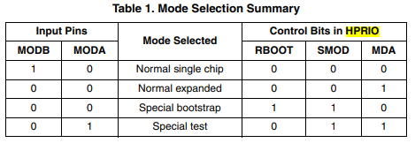
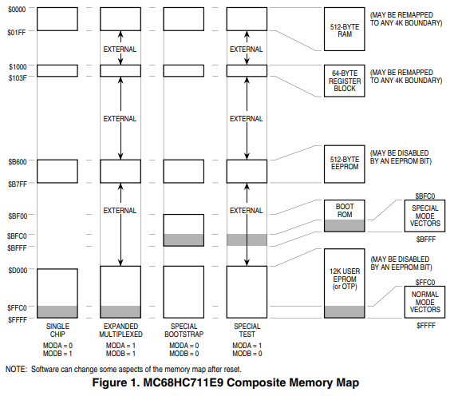
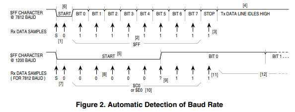
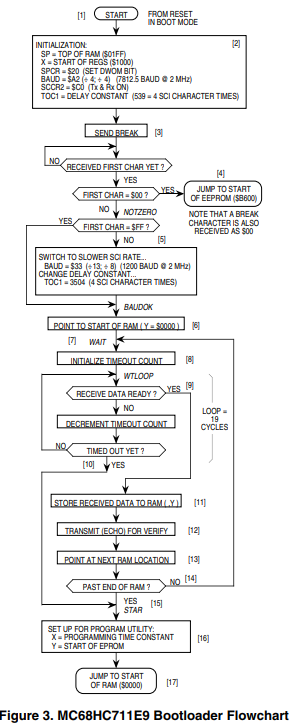

# M68HC11 Bootstrap Mode 

### By Jim Sibigtroth, Mike Rhoades, John Langan, Austin, Texas 

## Introduction 
The M68HC11 Family of MCUs (microcontroller units) has a bootstrap mode that allows a user-defined program to be loaded into the internal random-access memory (RAM) by way of the serial communications interface (SCI); the M68HC11 then executes this loaded program. The loaded program can do anything a normal user program can do as well as anything a factory test program can do because protected control bits are accessible in bootstrap mode. Although the bootstrap mode is a single-chip mode of operation, expanded mode resources are accessible because the mode control bits can be changed while operating in the bootstrap mode. 

This application note explains the operation and application of the M68HC11 bootstrap mode. Although basic concepts associated with this mode are quite simple, the more subtle implications of these functions require careful consideration. Useful applications of this mode are overlooked due to an incomplete understanding of bootstrap mode. Also, common problems associated with bootstrap mode could be 
avoided by a more complete understanding of its operation and implications.

Topics discussed in this application note include:

* Basic operation of the M68HC11 bootstrap mode 
* General discussion of bootstrap mode uses 
* Detailed explanation of on-chip bootstrap logic 
* Detailed explanation of bootstrap firmware 
* Bootstrap firmware vs. EEPROM security 
* Incorporating the bootstrap mode into a system 
* Driving bootstrap mode from another M68HC11 
* Driving bootstrap mode from a personal computer 
* Common bootstrap mode problems 
* Variations for specific versions of M68HC11 
* Commented listings for selected M68HC11 bootstrap ROMs

## Basic Bootstrap Mode  

This section describes only basic functions of the bootstrap mode. Other functions of the bootstrap mode  are described in detail in the remainder of this application note. 

When an M68HC11 is reset in bootstrap mode, the reset vector is fetched from a small internal read-only  memory (ROM) called the bootstrap ROM or boot ROM. The firmware pr＊ogram in this boot ROM then  controls the bootloading process, in this manner: 

* First, the on-chip SCI (serial communications interface) is initialized. The first character received  ($FF) determines which of two possible baud rates should be used for the remaining characters in  the download operation. 
* Next, a binary program is received by the SCI system and is stored in RAM. 
* Finally, a jump instruction is executed to pass control from the bootloader firmware to the user’s  loaded program. 

Bootstrap mode is useful both at the component level and after the MCU has been embedded into a  finished user system. 

At the component level, Freescale uses bootstrap mode to control a monitored burn-in program for the  on-chip electrically erasable programmable read-only memory (EEPROM). Units to be tested are loaded  into special circuit boards that each hold many MCUS. These boards are then placed in burn-in ovens. Driver boards outside the ovens download an EEPROM exercise and diagnostic program to all MCUs in  parallel. The MCUs under test independently exercise their internal EEPROM and monitor programming  and erase operations. This technique could be utilized by an end user to load program information into  the EPROM or EEPROM of an M68HC11 before it is installed into an end product. As in the burn-in setup,  many M68HC11s can be gang programmed in parallel. This technique can also be used to program the  EPROM of finished products after final assembly. 

Freescale also uses bootstrap mode for programming target devices on the M68HC11 evaluation  modules (EVM). Because bootstrap mode is a privileged mode like special test, the EEPROM-based  configuration register (CONFIG) can be programmed using bootstrap mode on the EVM. 

The greatest benefits from bootstrap mode are realized by designing the finished system so that bootstrap  mode can be used after final assembly. The finished system need not be a single-chip mode application  for the bootstrap mode to be useful because the expansion bus can be enabled after resetting the MCU  in bootstrap mode. Allowing this capability requires almost no hardware or design cost and the addition  of this capability is invisible in the end product until it is needed. 

The ability to control the embedded processor through downloaded programs is achieved without the  disassembly and chip-swapping usually associated with such control. This mode provides an easy way  to load non-volatile memories such as EEPROM with calibration tables or to program the application  firmware into a one-time programmable (OTP) MCU after final assembly. 

Another powerful use of bootstrap mode in a finished assembly is for final test. Short programs can be  downloaded to check parts of the system, including components and circuitry external to the embedded  MCU. If any problems appear during product development, diagnostic programs can be downloaded to  find the problems, and corrected routines can be downloaded and checked before incorporating them into  the main application program. 

Bootstrap Mode Logic M68HC11 Bootstrap Mode, Rev. 1.1 Freescale Semiconductor 195 Bootstrap mode can also be used to interactively calibrate critical analog sensors. Since this calibration  is done in the final assembled system, it can compensate for any errors in discrete interface circuitry and  cabling between the sensor and the analog inputs to the MCU. Note that this calibration routine is a  downloaded program that does not take up space in the normal application program. 

## Bootstrap Mode Logic 

In the M68HC11 MCUs, very little logic is dedicated to the bootstrap mode. Consequently, this mode adds  almost no extra cost to the MCU system. The biggest piece of circuitry for bootstrap mode is the small  boot ROM. This ROM is 192 bytes in the original MC68HC11A8, but some of the newest members of the  M68HC11 Family, such as the MC68HC711K4, have as much as 448 bytes to accommodate added  features. Normally, this boot ROM is present in the memory map only when the MCU is reset in bootstrap  mode to prevent interference with the user’s normal memory space. The enable for this ROM is controlled  by the read boot ROM (RBOOT) control bit in the highest priority interrupt (HPRIO) register. The RBOOT  bit can be written by software whenever the MCU is in special test or special bootstrap modes; when the  MCU is in normal modes, RBOOT reverts to 0 and becomes a read-only bit. All other logic in the MCU  would be present whether or not there was a bootstrap mode. 

Figure 1 shows the composite memory map of the MC68HC711E9 in its four basic modes of operation,  including bootstrap mode. The active mode is determined by the mode A (MDA) and special mode  (SMOD) control bits in the HPRIO control register. These control bits are in turn controlled by the state of  the mode A (MODA) and mode B (MODB) pins during reset. Table 1 shows the relationship between the  state of these pins during reset, the selected mode, and the state of the MDA, SMOD, and RBOOT control  bits. Refer to the composite memory map and information in Table 1 for the following discussion. 

The MDA control bit is determined by the state of the MODA pin as the MCU leaves reset. MDA selects  between single-chip and expanded operating modes. When MDA is 0, a single-chip mode is selected,  either normal single-chip mode or special bootstrap mode. When MDA is 1, an expanded mode is  selected, either normal expanded mode or special test mode. 

The SMOD control bit is determined by the inverted state of the MODB pin as the MCU leaves reset. SMOD controls whether a normal mode or a special mode is selected. When SMOD is 0, one of the two  normal modes is selected, either normal single-chip mode or normal expanded mode. When SMOD is 1,  one of the two special modes is selected, either special bootstrap mode or special test mode. When either  special mode is in effect (SMOD = 1), certain privileges are in effect, for instance, the ability to write to the  mode control bits and fetching the reset and interrupt vectors from $BFxx rather than $FFxx. 

Table 1. Mode Selection Summary



The alternate vector locations are achieved by simply driving address bit A14 low during all vector fetches if SMOD = 1. For special test mode, the alternate vector locations assure that the reset vector can be fetched from external memory space so the test system can control MCU operation. In special bootstrap mode, the small boot ROM is enabled in the memory map by RBOOT = 1 so the reset vector will be 
fetched from this ROM and the bootloader firmware will control MCU operation.

RBOOT is reset to 1 in bootstrap mode to enable the small boot ROM. In the other three modes, RBOOT  is reset to 0 to keep the boot ROM out of the memory map. While in special test mode, SMOD = 1, which  allows the RBOOT control bit to be written to 1 by software to enable the boot ROM for testing purposes. 

## Boot ROM Firmware  

The main program in the boot ROM is the bootloader, which is automatically executed as a result of  resetting the MCU in bootstrap mode. Some newer versions of the M68HC11 Family have additional utility  programs that can be called from a downloaded program. One utility is available to program EPROM or  OTP versions of the M68HC11. A second utility allows the contents of memory locations to be uploaded  to a host computer. In the MC68HC711K4 boot ROM, a section of code is used by Freescale for stress  testing the on-chip EEPROM. These test and utility programs are similar to self-test ROM programs in  other MCUs except that the boot ROM does not use valuable space in the normal memory map. 

Bootstrap firmware is also involved in an optional EEPROM security function on some versions of the  M68HC11. This EEPROM security feature prevents a software pirate from seeing what is in the on-chip  EEPROM. The secured state is invoked by programming the no security (NOSEC) EEPROM bit in the  CONFIG register. Once this NOSEC bit is programmed to 0, the MCU will ignore the mode A pin and  always come out of reset in normal single-chip mode or special bootstrap mode, depending on the state  of the mode B pin. Normal single-chip mode is the usual way a secured part would be used. Special  bootstrap mode is used to disengage the security function (only after the contents of EEPROM and RAM  have been erased). Refer to the M68HC11 Reference Manual, Freescale document order number  M68HC11RM/AD, for additional information on the security mode and complete listings of the boot ROMs  that support the EEPROM security functions. 

## Automatic Selection of Baud Rate 

The bootloader program in the MC68HC711E9 accommodates either of two baud rates. 

* The higher of these baud rates (7812 baud at a 2-MHz E-clock rate) is used in systems that operate  from a binary frequency crystal such as 223 Hz (8.389 MHz). At this crystal frequency, the baud  rate is 8192 baud, which was used extensively in automotive applications. 
* The second baud rate available to the M68HC11 bootloader is 1200 baud at a 2-MHz E-clock rate. Some of the newest versions of the M68HC11, including the MC68HC11F1 and MC68HC117K4,  accommodate other baud rates using the same differentiation technique explained here. Refer to  the reference numbers in square brackets in Figure 2 during the following explanation. 

<p style="text-align: center; color: red">
NOTE<br> 
Software can change some aspects of the memory map after reset. 
</p>

Figure 2 shows how the bootloader program differentiates between the default baud rate (7812 baud at  a 2-MHz E-clock rate) and the alternate baud rate (1200 baud at a 2-MHz E-clock rate). The host  computer sends an initial $FF character, which is used by the bootloader to determine the baud rate that  will be used for the downloading operation. The top half of Figure 2 shows normal reception of $FF.  Receive data samples at [1] detect the falling edge of the start bit and then verify the start bit by taking a  sample at the center of the start bit time. Samples are then taken at the middle of each bit time [2] to  reconstruct the value of the received character (all 1s in this case). A sample is then taken at the middle  of the stop bit time as a framing check (a 1 is expected) [3]. Unless another character immediately follows  this $FF character, the receive data line will idle in the high state as shown at [4]. 

The bottom half of Figure 2 shows how the receiver will incorrectly receive the $FF character that is sent  from the host at 1200 baud. Because the receiver is set to 7812 baud, the receive data samples are taken  at the same times as in the upper half of Figure 2. The start bit at 1200 baud [5] is 6.5 times as long as  the start bit at 7812 baud [6]. 





Figure 2. Automatic Detection of Baud Rate  

Samples taken at [7] detect the failing edge of the start bit and verify it is a logic 0. Samples taken at the  middle of what the receiver interprets as the first five bit times [8] detect logic 0s. The sample taken at the  middle of what the receiver interprets as bit 5 [9] may detect either a 0 or a 1 because the receive data  has a rising transition at about this time. The samples for bits 6 and 7 detect 1s, causing the receiver to  think the received character was $C0 or $E0 [10] at 7812 baud instead of the $FF which was sent at 1200  baud. The stop bit sample detects a 1 as expected [11], but this detection is actually in the middle of bit  0 of the 1200 baud $FF character. The SCI receiver is not confused by the rest of the 1200 baud $FF  character because the receive data line is high [12] just as it would be for the idle condition. If a character  other than $FF is sent as the first character, an SCI receive error could result. 

## Main Bootloader Program

Figure 3 is a flowchart of the main bootloader program in the MC68HC711E9. This bootloader  demonstrates the most important features of the bootloaders used on all M68HC11 Family members. For  complete listings of other M68HC11 versions, refer to Listing 3. MC68HC711E9 Bootloader ROM at the  end of this application note, and to Appendix B of the M68HC11 Reference Manual, Freescale document  order number M68HC11RM/AD. 

The reset vector in the boot ROM points to the start [1] of this program. The initialization block [2]  establishes starting conditions and sets up the SCI and port D. The stack pointer is set because there are  push and pull instructions in the bootloader program. The X index register is pointed at the start of the  register block ($1000) so indexed addressing can be used. Indexed addressing takes one less byte of  ROM space than extended instructions, and bit manipulation instructions are not available in extended  addressing forms. The port D wire-OR mode (DWOM) bit in the serial peripheral interface control register  (SPCR) is set to configure port D for wired-OR operation to minimize potential conflicts with external  systems that use the PD1/TxD pin as an input. The baud rate for the SCI is initially set to 7812 baud at a  2-MHz E-clock rate but can automatically switch to 1200 baud based on the first character received. The  SCI receiver and transmitter are enabled. The receiver is required by the bootloading process, and the  transmitter is used to transmit data back to the host computer for optional verification. The last item in the  initialization is to set an intercharacter delay constant used to terminate the download when the host  computer stops sending data to the MC68HC711E9. This delay constant is stored in the timer output  compare 1 (TOC1) register, but the on-chip timer is not used in the bootloader program. This example illustrates the extreme measures used in the bootloader firmware to minimize memory usage. However,  such measures are not usually considered good programming technique because they are misleading to  someone trying to understand the program or use it as an example. 

After initialization, a break character is transmitted [3] by the SCI. By connecting the TxD pin to the RxD  pin (with a pullup because of port D wired-OR mode), this break will be received as a $00 character and  cause an immediate jump [4] to the start of the on-chip EEPROM ($B600 in the MC68HC711E9). This  feature is useful to pass control to a program in EEPROM essentially from reset. Refer to Common  Bootstrap Mode Problems before using this feature. 

If the first character is received as $FF, the baud rate is assumed to be the default rate (7812 baud at a  2-MHz E-clock rate). If $FF was sent at 1200 baud by the host, the SCI will receive the character as $E0  or $C0 because of the baud rate mismatch, and the bootloader will switch to 1200 baud [5] for the rest of  the download operation. When the baud rate is switched to 1200 baud, the delay constant used to monitor  the intercharacter delay also must be changed to reflect the new character time. 

At [6], the Y index register is initialized to $0000 to point to the start of on-chip RAM. The index register Y  is used to keep track of where the next received data byte will be stored in RAM. The main loop for loading  begins at [7]. 

The number of data bytes in the downloaded program can be any number between 0 and 512 bytes (the  size of on-chip RAM). This procedure is called "variable-length download" and is accomplished by ending  the download sequence when an idle time of at least four character times occurs after the last character  to be downloaded. In M68HC11 Family members which have 256 bytes of RAM, the download length is  fixed at exactly 256 bytes plus the leading $FF character. 

The intercharacter delay counter is started [8] by loading the delay constant from TOC1 into the X index  register. The 19-E-cycle wait loop is executed repeatedly until either a character is received [9] or the  allowed intercharacter delay time expires [10]. For 7812 baud, the delay constant is 10,241 E cycles (539  x 19 E cycles per loop). Four character times at 7812 baud is 10,240 E cycles (baud prescale of 4 x baud  divider of 4 x 16 internal SCI clocks/bit time x 10 bit times/character x 4 character times). The delay from  reset to the initial $FF character is not critical since the delay counter is not started until after the first  character ($FF) is received. 

To terminate the bootloading sequence and jump to the start of RAM without downloading any data to the  on-chip RAM, simply send $FF and nothing else. This feature is similar to the jump to EEPROM at [4]  except the $FF causes a jump to the start of RAM. This procedure requires that the RAM has been loaded  with a valid program since it would make no sense to jump to a location in uninitialized memory. 

After receiving a character, the downloaded byte is stored in RAM [11]. The data is transmitted back to  the host [12] as an indication that the download is progressing normally. At [13], the RAM pointer is  incremented to the next RAM address. If the RAM pointer has not passed the end of RAM, the main  download loop (from [7] to [14]) is repeated. 

When all data has been downloaded, the bootloader goes to [16] because of an intercharacter delay  timeout [10] or because the entire 512-byte RAM has been filled [15]. At [16], the X and Y index registers  are set up for calling the PROGRAM utility routine, which saves the user from having to do this in a  downloaded program. The PROGRAM utility is fully explained in EPROM Programming Utility. The final  step of the bootloader program is to jump to the start of RAM [17], which starts the user’s downloaded  program. 

<figure style="textalign: center">

<figcaption>
Figure 3. MC68HC711E9 Bootloader Flowchart
</figcaption>


## UPLOAD Utility 

M68HC11 Bootstrap Mode, Rev. 1.1 Freescale Semiconductor 201 UPLOAD Utility  The UPLOAD utility subroutine transfers data from the MCU to a host computer system over the SCI serial  data link. 

<p style="text-align:center; color: red">
NOTE<br>
Only EPROM versions of the M68HC11 include this utility. 
</p>

Verification of EPROM contents is one example of how the UPLOAD utility could be used. Before calling  this program, the Y index register is loaded (by user firmware) with the address of the first data byte to be  uploaded. If a baud rate other than the current SCI baud rate is to be used for the upload process, the  user’s firmware must also write to the baud register. The UPLOAD program sends successive bytes of  data out the SCI transmitter until a reset is issued (the upload loop is infinite). 

For a complete commented listing example of the UPLOAD utility, refer to Listing 3. MC68HC711E9  Bootloader ROM. 

## EPROM Programming Utility

The EPROM programming utility is one way of programming data into the internal EPROM of the  MC68HC711E9 MCU. An external 12-V programming power supply is required to program on-chip  EPROM. The simplest way to use this utility program is to bootload a 3-byte program consisting of a single  jump instruction to the start of the PROGRAM utility program ($BF00). The bootloader program sets the  X and Y index registers to default values before jumping to the downloaded program (see [16] at the  bottom of Figure 3). When the host computer sees the $FF character, data to be programmed into the  EPROM is sent, starting with the character for location $D000. After the last byte to be programmed is  sent to the MC68HC711E9 and the corresponding verification data is returned to the host, the  programming operation is terminated by resetting the MCU. 

The number of bytes to be programmed, the first address to be programmed, and the programming time  can be controlled by the user if values other than the default values are desired. 

To understand the detailed operation of the EPROM programming utility, refer to Figure 4 during the  following discussion. Figure 4 is composed of three interrelated parts. The upper-left portion shows the  flowchart of the PROGRAM utility running in the boot ROM of the MCU. The upper-right portion shows  the flowchart for the user-supplied driver program running in the host computer. The lower portion of  Figure 4 is a timing sequence showing the relationship of operations between the MCU and the host  computer. Reference numbers in the flowcharts in the upper half of Figure 4 have matching numbers in  the lower half to help the reader relate the three parts of the figure. 

The shaded area [1] refers to the software and hardware latency in the MCU leading to the transmission  of a character (in this case, the $FF). The shaded area [2] refers to a similar latency in the host computer  (in this case, leading to the transmission of the first data character to the MCU). 

The overall operation begins when the MCU sends the first character ($FF) to the host computer,  indicating that it is ready for the first data character. The host computer sends the first data byte [3] and  enters its main loop. The second data character is sent [4], and the host then waits [5] for the first verify  byte to come back from the MCU. 

<figure style="text-align: center">

<figcaption>Figure 4. Host and MCU Activity during EPROM PROGRAM Utility</figcaption>
</figure>
After the MCU sends $FF [8], it enters the WAIT1 loop [9] and waits for the first data character from the
host. When this character is received [10], the MCU programs it into the address pointed to by the Y index
register. When the programming time delay is over, the MCU reads the programmed data, transmits it to
the host for verification [11], and returns to the top of the WAIT1 loop to wait for the next data character
[12]. Because the host previously sent the second data character, it is already waiting in the SCI receiver
of the MCU. Steps [13], [14], and [15] correspond to the second pass through the WAIT1 loop.
Back in the host, the first verify character is received, and the third data character is sent [6]. The host
then waits for the second verify character [7] to come back from the MCU. The sequence continues as
long as the host continues to send data to the MCU. Since the WAIT1 loop in the PROGRAM utility is an
indefinite loop, reset is used to end the process in the MCU after the host has finished sending data to be
programmed.
Allowing for Bootstrap Mode
Since bootstrap mode requires few connections to the MCU, it is easy to design systems that
accommodate bootstrap mode.
Bootstrap mode is useful for diagnosing or repairing systems that have failed due to changes in the
CONFIG register or failures of the expansion address/data buses, (rendering programs in external
memory useless). Bootstrap mode can also be used to load information into the EPROM or EEPROM of
an M68HC11 after final assembly of a module. Bootstrap mode is also useful for performing system
checks and calibration routines. The following paragraphs explain system requirements for use of
bootstrap mode in a product.
Mode Select Pins
It must be possible to force the MODA and MODB pins to logic 0, which implies that these two pins should
be pulled up to VDD through resistors rather than being tied directly to VDD. If mode pins are connected
directly to VDD, it is not possible to force a mode other than the one the MCU is hard wired for. It is also
good practice to use pulldown resistors to VSS rather than connecting mode pins directly to VSS because
it is sometimes a useful debug aid to attempt reset in modes other than the one the system was primarily
designed for. Physically, this requirement sometimes calls for the addition of a test point or a wire
connected to one or both mode pins. Mode selection only uses the mode pins while RESET is active.
RESET
It must be possible to initiate a reset while the mode select pins are held low. In systems where there is
no provision for manual reset, it is usually possible to generate a reset by turning power off and back on.
RxD Pin
It must be possible to drive the PD0/RxD pin with serial data from a host computer (or another MCU). In
many systems, this pin is already used for SCI communications; thus no changes are required.

Allowing for Bootstrap Mode
In systems where the PD0/RxD pin is normally used as a general-purpose output, a serial signal from the
host can be connected to the pin without resulting in output driver conflicts. It may be important to consider
what the existing logic will do with the SCI serial data instead of the signals that would have been
produced by the PD0 pin. In systems where the PD0 pin is used normally as a general-purpose input, the
driver circuit that drives the PD0 pin must be designed so that the serial data can override this driver, or
the driver must be disconnected during the bootstrap download. A simple series resistor between the
driver and the PD0 pin solves this problem as shown in Figure 5. The serial data from the host computer
can then be connected to the PD0/RxD pin, and the series resistor will prevent direct conflict between the
host driver and the normal PD0 driver.
Figure 5. Preventing Driver Conflict
TxD Pin
The bootloader program uses the PD1/TxD pin to send verification data back to the host computer. To
minimize the possibility of conflicts with circuitry connected to this pin, port D is configured for wire-OR
mode by the bootloader program during initialization. Since the wire-OR configuration prevents the pin
from driving active high levels, a pullup resistor to VDD is needed if the TxD signal is used.
In systems where the PD1/TxD pin is normally used as a general-purpose output, there are no output
driver conflicts. It may be important to consider what the existing logic will do with the SCI serial data
instead of the signals that would have been produced by the PD1 pin.
In systems where the PD1 pin is normally used as a general-purpose input, the driver circuit that drives
the PD1 pin must be designed so that the PD1/TxD pin driver in the MCU can override this driver. A simple
series resistor between the driver and the PD1 pin can solve this problem. The TxD pin can then be
configured as an output, and the series resistor will prevent direct conflict between the internal TxD driver
and the external driver connected to PD1 through the series resistor.
Other
The bootloader firmware sets the DWOM control bit, which configures all port D pins for wire-OR
operation. During the bootloading process, all port D pins except the PD1/TxD pin are configured as
high-impedance inputs. Any port D pin that normally is used as an output should have a pullup resistor so
it does not float during the bootloading process.
Driving Boot Mode from Another M68HC11
A second M68HC11 system can easily act as the host to drive bootstrap loading of an M68HC11 MCU.
This method is used to examine and program non-volatile memories in target M68HC11s in Freescale
EVMs. The following hardware and software example will demonstrate this and other bootstrap mode
features.
The schematic in Figure 6 shows the circuitry for a simple EPROM duplicator for the MC68HC711E9. The
circuitry is built in the wire-wrap area of an M68HC11EVBU evaluation board to simplify construction. The
schematic shows only the important portions of the EVBU circuitry to avoid confusion. To see the
complete EVBU schematic, refer to the M68HC11EVBU Universal Evaluation Board User’s Manual,
Freescale document order number M68HC11EVBU/D.
The default configuration of the EVBU must be changed to make the appropriate connections to the
circuitry in the wire-wrap area and to configure the master MCU for bootstrap mode. A fabricated jumper
must be installed at J6 to connect the XTAL output of the master MCU to the wire-wrap connector P5,
which has been wired to the EXTAL input of the target MCU. Cut traces that short across J8 and J9 must
be cut on the solder side of the printed circuit board to disconnect the normal SCI connections to the
RS232 level translator (U4) of the EVBU. The J8 and J9 connections can be restored easily at a later time
by installing fabricated jumpers on the component side of the board. A fabricated jumper must be installed
across J3 to configure the master MCU for bootstrap mode.
One MC68HC711E9 is first programmed by other means with a desired 12-Kbyte program in its EPROM
and a small duplicator program in its EEPROM. Alternately, the ROM program in an MC68HC11E9 can
be copied into the EPROM of a target MC68HC711E9 by programming only the duplicator program into
the EEPROM of the master MC68HC11E9. The master MCU is installed in the EVBU at socket U3. A
blank MC68HC711E9 to be programmed is placed in the socket in the wire-wrap area of the EVBU (U6).
With the VPP power switch off, power is applied to the EVBU system. As power is applied to the EVBU,
the master MCU (U3) comes out of reset in bootstrap mode. Target MCU (U6) is held in reset by the PB7
output of master MCU (U3). The PB7 output of U3 is forced to 0 when U3 is reset. The master MCU will
later release the reset signal to the target MCU under software control. The RxD and TxD pins of the target
MCU (U6) are high-impedance inputs while U6 is in reset so they will not affect the TxD and RxD signals
of the master MCU (U3) while U3 is coming out of reset. Since the target MCU is being held in reset with
MODA and MODB at 0, it is configured for the PROG EPROM emulation mode, and PB7 is the output
enable signal for the EPROM data I/O (input/output) pins. Pullup resistor R7 causes the port D pins,
including RxD and TxD, to remain in the high-impedance state so they do not interfere with the RxD and
TxD pins of the master MCU as it comes out of reset.
As U3 leaves reset, its mode pins select bootstrap mode so the bootloader firmware begins executing. A
break is sent out the TxD pin of U3. Pullup resistor R10 and resistor R9 cause the break character to be
seen at the RxD pin of U3. The bootloader performs a jump to the start of EEPROM in the master MCU
(U3) and starts executing the duplicator program. This sequence demonstrates how to use bootstrap
mode to pass control to the start of EEPROM after reset.
The complete listing for the duplicator program in the EEPROM of the master MCU is provided in
Listing 1. MCU-to-MCU Duplicator Program.

 

The duplicator program in EEPROM clears the DWOM control bit to change port D (thus, TxD) of U3 to
normal driven outputs. This configuration will prevent interference due to R9 when TxD from the target
MCU (U6) becomes active. Series resistor R9 demonstrates how TxD of U3 can drive RxD of U3[1] and
later TxD of U6 can drive RxD of U3 without a destructive conflict between the TxD output buffers.
As the target MCU (U6) leaves reset, its mode pins select bootstrap mode so the bootloader firmware
begins executing. A break is sent out the TxD pin of U6. At this time, the TxD pin of U3 is at a driven high
so R9 acts as a pullup resistor for TxD of the target MCU (U6). The break character sent from U6 is
received by U3 so the duplicator program that is running in the EEPROM of the master MCU knows that
the target MCU is ready to accept a bootloaded program.
The master MCU sends a leading $FF character to set the baud rate in the target MCU. Next, the master
MCU passes a 3-instruction program to the target MCU and pauses so the bootstrap program in the target
MCU will stop the loading process and jump to the start of the downloaded program. This sequence
demonstrates the variable-length download feature of the MC68HC711E9 bootloader.
The short program downloaded to the target MCU clears the DWOM bit to change its TxD pin to a normal
driven CMOS output and jumps to the EPROM programming utility in the bootstrap ROM of the target
MCU.
Note that the small downloaded program did not have to set up the SCI or initialize any parameters for
the EPROM programming process. The bootstrap software that ran prior to the loaded program left the
SCI turned on and configured in a way that was compatible with the SCI in the master MCU (the duplicator
program in the master MCU also did not have to set up the SCI for the same reason). The programming
time and starting address for EPROM programming in the target MCU were also set to default values by
the bootloader software before jumping to the start of the downloaded program.
Before the EPROM in the target MCU can be programmed, the VPP power supply must be available at
the XIRQ/VPPE pin of the target MCU. The duplicator program running in the master MCU monitors this
voltage (for presence or absence, not level) at PE7 through resistor divider R14–Rl5. The PE7 input was
chosen because the internal circuitry for port E pins can tolerate voltages slightly higher than VDD;
therefore, resistors R14 and R15 are less critical. No data to be programmed is passed to the target MCU
until the master MCU senses that VPP has been stable for about 200 ms.
When VPP is ready, the master MCU turns on the red LED (light-emitting diode) and begins passing data
to the target MCU. EPROM Programming Utility explains the activity as data is sent from the master MCU
to the target MCU and programmed into the EPROM of the target. The master MCU in the EVBU
corresponds to the HOST in the programming utility description and the "PROGRAM utility in MCU" is
running in the bootstrap ROM of the target MCU.
Each byte of data sent to the target is programmed and then the programmed location is read and sent
back to the master for verification. If any byte fails, the red and green LEDs are turned off, and the
programming operation is aborted. If the entire 12 Kbytes are programmed and verified successfully, the
red LED is turned off, and the green LED is turned on to indicate success. The programming of all 12
Kbytes takes about 30 seconds.
After a programming operation, the VPP switch (S2) should be turned off before the EVBU power is turned
off.


### Listing 1. MCU-to-MCU Duplication Program

```
1 **************************************************
2 * 68HC711E9 Duplicator Program for AN1060
3 **************************************************
4
5 *****
6 * Equates - All reg addrs except INIT are 2-digit
7 * for direct addressing
8 *****
9 103D INIT EQU $103D RAM, Reg mapping
10 0028 SPCR EQU $28 DWOM in bit-5
11 0004 PORTB EQU $04 Red LED = bit-1, Grn = bit-0
12 * Reset of prog socket = bit-7
13 0080 RESET EQU %10000000
14 0002 RED EQU %00000010
15 0001 GREEN EQU %00000001
16 000A PORTE EQU $0A Vpp Sense in bit-7, 1=ON
17 002E SCSR EQU $2E SCI status register
18 * TDRE, TC, RDRF, IDLE; OR, NF, FE, -
19 0080 TDRE EQU %10000000
20 0020 RDRF EQU %00100000
21 002F SCDR EQU $2F SCI data register
22 BF00 PROGRAM EQU $BF00 EPROM prog utility in boot ROM
23 D000 EPSTRT EQU $D000 Starting address of EPROM
24
25 B600 ORG $B600 Start of EEPROM
26
27 **************************************************
28 *
29 B600 7F103D BEGIN CLR INIT Moves Registers to $0000-3F
30 B603 8604 LDAA #$04 Pattern for DWOM off, no SPI
31 B605 9728 STAA SPCR Turns off DWOM in EVBU MCU
32 B607 8680 LDAA #RESET
33 B609 9704 STAA PORTB Release reset to target MCU
34 B60B 132E20FC WT4BRK BRCLR SCSR RDRF WT4BRK Loop till char received
35 B60F 86FF LDAA #$FF Leading char for bootload ...
36 B611 972F STAA SCDR to target MCU
37 B613 CEB675 LDX #BLPROG Point at program for target
38 B616 8D53 BLLOOP BSR SEND1 Bootload to target
39 B618 8CB67D CPX #ENDBPR Past end ?
40 B61B 26F9 BNE BLLOOP Continue till all sent
41 *****
42 * Delay for about 4 char times to allow boot related
43 * SCI communications to finish before clearing
44 * Rx related flags
45 B61D CE06A7 LDX #1703 # of 6 cyc loops
46 B620 09 DLYLP DEX [3]
47 B621 26FD BNE DLYLP [3] Total loop time = 6 cyc
48 B623 962E LDAA SCSR Read status (RDRF will be set)
49 B625 962F LDAA SCDR Read SCI data reg to clear RDRF
50 *****
51 * Now wait for character from target to indicate it's ready for
52 * data to be programmed into EPROM
53 B627 132E20FC WT4FF BRCLR SCSR RDRF WT4FF Wait for RDRF
54 B62B 962F LDAA SCDR Clear RDRF, don't need data
55 B62D CED000 LDX #EPSTRT Point at start of EPROM
56 * Handle turn-on of Vpp
57 B630 18CE523D WT4VPP LDY #21053 Delay counter (about 200ms)
58 B634 150402 BCLR PORTB RED Turn off RED LED
59 B637 960A DLYLP2 LDAA PORTE [3] Wait for Vpp to be ON
60 B639 2AF5 BPL WT4VPP [3] Vpp sense is on port E MSB
61 B63B 140402 BSET PORTB RED [6] Turn on RED LED
62 B63E 1809 DEY [4]
63 B640 26F5 BNE DLYLP2 [3] Total loop time = 19 cyc
64 * Vpp has been stable for 200ms
65
66 B642 18CED000 LDY #EPSTRT X=Tx pointer, Y=verify pointer
67 B646 8D23 BSR SEND1 Send first data to target
68 B648 8C0000 DATALP CPX #0 X points at $0000 after last
69 B64B 2702 BEQ VERF Skip send if no more
70 B64D 8D1C BSR SEND1 Send another data char
71 B64F 132E20FC VERF BRCLR SCSR RDRF VERF Wait for Rx ready
72 B653 962F LDAA SCDR Get char and clr RDRF
73 B655 18A100 CMPA 0,Y Does char verify ?
74 B658 2705 BEQ VERFOK Skip error if OK
75 B65A 150403 BCLR PORTB (RED+GREEN) Turn off LEDs
76 B65D 2007 BRA DUNPRG Done (programming failed)
77 B65F
78 B65F 1808 VERFOK INY Advance verify pointer
79 B661 26E5 BNE DATALP Continue till all done
80 B663
81 B663 140401 BSET PORTB GREEN Grn LED ON
82 B666
83 B666 150482 DUNPRG BCLR PORTB (RESET+RED) Red OFF, apply reset
84 B669 20FE BRA * Done so just hang
85 B66B
86 **************************************************
87 * Subroutine to get & send an SCI char. Also
88 * advances pointer (X).
89 **************************************************
90 B66B A600 SEND1 LDAA 0,X Get a character
91 B66D 132E80FC TRDYLP BRCLR SCSR TDRE TRDYLP Wait for TDRE
92 B671 972F STAA SCDR Send character
93 B673 08 INX Advance pointer
94 B674 39 RTS ** Return **
95
96 **************************************************
97 * Program to be bootloaded to target '711E9
98 **************************************************
99 B675 8604 BLPROG LDAA #$04 Pattern for DWOM off, no SPI
100 B677 B71028 STAA $1028 Turns off DWOM in target MCU
101 * NOTE: Can't use direct addressing in target MCU because
102 * regs are located at $1000.
103 B67A 7EBF00 JMP PROGRAM Jumps to EPROM prog routine
104 B67D ENDBPR EQU *
Symbol Table:
Symbol Name Value Def.# Line Number Cross Reference
BEGIN B600 *00029
BLLOOP B616 *00038 00040
BLPROG B675 *00099 00037
DATALP B648 *00068 00079
DLYLP B620 *00046 00047
DLYLP2 B637 *00059 00063
DUNPRG B666 *00083 00076
ENDBPR B67D *00104 00039
EPSTRT D000 *00023 00055 00066
GREEN 0001 *00015 00075 00081
INIT 103D *00009 00029
PORTB 0004 *00011 00033 00058 00061 00075 00081 00083
PORTE 000A *00016 00059
PROGRAM BF00 *00022 00103
RDRF 0020 *00020 00034 00053 00071
RED 0002 *00014 00058 00061 00075 00083
RESET 0080 *00013 00032 00083
SCDR 002F *00021 00036 00049 00054 00072 00092
SCSR 002E *00017 00034 00048 00053 00071 00091
SEND1 B66B *00090 00038 00067 00070
SPCR 0028 *00010 00031
TDRE 0080 *00019 00091
TRDYLP B66D *00091 00091
VERF B64F *00071 00069 00071
VERFOK B65F *00078 00074
WT4BRK B60B *00034 00034
WT4FF B627 *00053 00053
WT4VPP B630 *00057 00060
Errors: None
Labels: 28
Last Program Address: $B67C
Last Storage Address: $0000
Program Bytes: $007D 125
Storage Bytes: $0000 0
```

Driving Boot Mode from a Personal Computer
In this example, a personal computer is used as the host to drive the bootloader of an MC68HC711E9.
An M68HC11 EVBU is used for the target MC68HC711E9. A large program is transferred from the
personal computer into the EPROM of the target MC68HC711E9.
Hardware
Figure 7 shows a small modification to the EVBU to accommodate the 12-volt (nominal) EPROM
programming voltage. The XIRQ pin is connected to a pullup resistor, two jumpers, and the 60-pin
connectors, P4 and P5. The object of the modification is to isolate the XIRQ pin and then connect it to the
programming power supply. Carefully cut the trace on the solder side of the EVBU as indicated in Figure
7. This disconnects the pullup resistor RN1 D from XIRQ but leaves P4–18, P5–18, and jumpers J7 and
J14 connected so the EVBU can still be used for other purposes after programming is done. Remove any
fabricated jumpers from J7 and J14. The EVBU normally has a jumper at J7 to support the trace function
Figure 8 shows a small circuit that is added to the wire-wrap area of the EVBU. The 3-terminal jumper
allows the XIRQ line to be connected to either the programming power supply or to a substitute pullup
resistor for XIRQ. The 100-ohm resistor is a current limiter to protect the 12-volt input of the MCU. The
resistor and LED connected to P5 pin 9 (port C bit 0) is an optional indicator that lights when programming
is complete.
Software
BASIC was chosen as the programming language due to its readability and availability in parallel versions
on both the IBM® PC and the Macintosh®. The program demonstrates several programming techniques
for use with an M68HC11 and is not necessarily intended to be a finished, commercial program. For
example, there is little error checking, and the user interface is elementary. A complete listing of the
BASIC program is included in Listing 2. BASIC Program for Personal Computer with moderate comments.
The following paragraphs include a more detailed discussion of the program as it pertains to
communicating with and programming the target MC68HC711E9. Lines 25–45 initialize and define the
variables and array used in the program. Changes to this section would allow for other programs to be
downloaded.
* IBM is a registered trademark of International Business Machines.
* Macintosh is a registered trademark of Apple Computers, Inc.


Lines 50–95 read in the small bootloader from DATA statements at the end of the listing. The source code
for this bootloader is presented in the DATA statements. The bootloaded code makes port C bit 0 low,
initializes the X and Y registers for use by the EPROM programming utility routine contained in the boot
ROM, and then jumps to that routine. The hexadecimal values read in from the DATA statements are
converted to binary values by a subroutine. The binary values are then saved as one string
(BOOTCODE$).
The next long section of code (lines 97–1250) reads in the S records from an external disk file (in this
case, BUF34.S19), converts them to integer, and saves them in an array. The techniques used in this
section show how to convert ASCII S records to binary form that can be sent (bootloaded) to an
M68HC11.
This S-record translator only looks for the S1 records that contain the actual object code. All other
S-record types are ignored.
When an S1 record is found (lines 1000–1024), the next two characters form the hex byte giving the
number of hex bytes to follow. This byte is converted to integer by the same subroutine that converted the
bootloaded code from the DATA statements. This BYTECOUNT is adjusted by subtracting 3, which
accounts for the address and checksum bytes and leaves just the number of object-code bytes in the
record.
Starting at line 1100, the 2-byte (4-character) starting address is converted to decimal. This address is
the starting address for the object code bytes to follow. An index into the CODE% array is formed by
subtracting the base address initialized at the start of the program from the starting address for this S
record.
A FOR-NEXT loop starting at line 1130 converts the object code bytes to decimal and saves them in the
CODE% array. When all the object code bytes have been converted from the current S record, the
program loops back to find the next S1 record.

A problem arose with the BASIC programming technique used. The draft versions of this program tried
saving the object code bytes directly as binary in a string array. This caused "Out of Memory" or "Out of
String Space" errors on both a 2-Mbyte Macintosh and a 640-Kbyte PC. The solution was to make the
array an integer array and perform the integer-to-binary conversion on each byte as it is sent to the target
part.
The one compromise made to accommodate both Macintosh and PC versions of BASIC is in lines 1500
and 1505. Use line 1500 and comment out line 1505 if the program is to be run on a Macintosh, and,
conversely, use line 1505 and comment out line 1500 if a PC is used.
After the COM port is opened, the code to be bootloaded is modified by adding the $FF to the start of the
string. $FF synchronizes the bootloader in the MC68HC711E9 to 1200 baud. The entire string is simply
sent to the COM port by PRINTing the string. This is possible since the string is actually queued in
BASIC’s COM buffer, and the operating system takes care of sending the bytes out one at a time. The
M68HC11 echoes the data received for verification. No automatic verification is provided, though the data
is printed to the screen for manual verification.
Once the MCU has received this bootloaded code, the bootloader automatically jumps to it. The small
bootloaded program in turn includes a jump to the EPROM programming routine in the boot ROM.
Refer to the previous explanation of the EPROM Programming Utility for the following discussion. The
host system sends the first byte to be programmed through the COM port to the SCI of the MCU. The SCI
port on the MCU buffers one byte while receiving another byte, increasing the throughput of the EPROM
programming operation by sending the second byte while the first is being programmed.
When the first byte has been programmed, the MCU reads the EPROM location and sends the result back
to the host system. The host then compares what was actually programmed to what was originally sent.
A message indicating which byte is being verified is displayed in the lower half of the screen. If there is
an error, it is displayed at the top of the screen.
As soon as the first byte is verified, the third byte is sent. In the meantime, the MCU has already started
programming the second byte. This process of verifying and queueing a byte continues until the host
finishes sending data. If the programming is completely successful, no error messages will have been
displayed at the top of the screen. Subroutines follow the end of the program to handle some of the
repetitive tasks. These routines are short, and the commenting in the source code should be sufficient
explanation.
Modifications
This example programmed version 3.4 of the BUFFALO monitor into the EPROM of an MC68HC711E9;
the changes to the BASIC program to download some other program are minor.
The necessary changes are:
1. In line 30, the length of the program to be downloaded must be assigned to the variable
CODESIZE%.
2. Also in line 30, the starting address of the program is assigned to the variable ADRSTART.
3. In line 9570, the start address of the program is stored in the third and fourth items in that DATA
statement in hexadecimal.
4. If any changes are made to the number of bytes in the boot code in the DATA statements in lines
9500–9580, then the new count must be set in the variable "BOOTCOUNT" in line 25.
Driving Boot Mode from a Personal Computer
Operation
Configure the EVBU for boot mode operation by putting a jumper at J3. Ensure that the trace command
jumper at J7 is not installed because this would connect the 12-V programming voltage to the OC5 output
of the MCU.
Connect the EVBU to its dc power supply. When it is time to program the MCU EPROM, turn on the
12-volt programming power supply to the new circuitry in the wire-wrap area.
Connect the EVBU serial port to the appropriate serial port on the host system. For the Macintosh, this is
the modem port with a modem cable. For the MS-DOS® computer, it is connected to COM1 with a straight
through or modem cable. Power up the host system and start the BASIC program. If the program has not
been compiled, this is accomplished from within the appropriate BASIC compiler or interpreter. Power up
the EVBU.
Answer the prompt for filename with either a [RETURN] to accept the default shown or by typing in a new
filename and pressing [RETURN].
The program will inform the user that it is working on converting the file from S records to binary. This
process will take from 30 seconds to a few minutes, depending on the computer.
A prompt reading, "Comm port open?" will appear at the end of the file conversion. This is the last chance
to ensure that everything is properly configured on the EVBU. Pressing [RETURN] will send the bootcode
to the target MC68HC711E9. The program then informs the user that the bootload code is being sent to
the target, and the results of the echoing of this code are displayed on the screen.
Another prompt reading "Programming is ready to begin. Are you?" will appear. Turn on the 12-volt
programming power supply and press [RETURN] to start the actual programming of the target EPROM.
A count of the byte being verified will be updated continually on the screen as the programming
progresses. Any failures will be flagged as they occur.
When programming is complete, a message will be displayed as well as a prompt requesting the user to
press [RETURN] to quit.
Turn off the 12-volt programming power supply before turning off 5 volts to the EVBU.

### Listing 2. BASIC Program for Personal Computer

```
1 ' ***********************************************************************
2 ' *
3 ' * E9BUF.BAS - A PROGRAM TO DEMONSTRATE THE USE OF THE BOOT MODE
4 ' * ON THE HC11 BY PROGRAMMING AN HC711E9 WITH
5 ' * BUFFALO 3.4
6 ' *
7 ' * REQUIRES THAT THE S-RECORDS FOR BUFFALO (BUF34.S19)
8 ' * BE AVAILABLE IN THE SAME DIRECTORY OR FOLDER
9 ' *
10 '* THIS PROGRAM HAS BEEN RUN BOTH ON A MS-DOS COMPUTER
11 '* USING QUICKBASIC 4.5 AND ON A MACINTOSH USING
12 '* QUICKBASIC 1.0.
14 '*
15 '************************************************************************
25 H$ = "0123456789ABCDEF" 'STRING TO USE FOR HEX CONVERSIONS
30 DEFINT B, I: CODESIZE% = 8192: ADRSTART= 57344!
35 BOOTCOUNT = 25 'NUMBER OF BYTES IN BOOT CODE
40 DIM CODE%(CODESIZE%) 'BUFFALO 3.4 IS 8K BYTES LONG
45 BOOTCODE$ = "" 'INITIALIZE BOOTCODE$ TO NULL
49 REM ***** READ IN AND SAVE THE CODE TO BE BOOT LOADED *****
50 FOR I = 1 TO BOOTCOUNT '# OF BYTES IN BOOT CODE
55 READ Q$
60 A$ = MID$(Q$, 1, 1)
65 GOSUB 7000 'CONVERTS HEX DIGIT TO DECIMAL
70 TEMP = 16 * X 'HANG ON TO UPPER DIGIT
75 A$ = MID$(Q$, 2, 1)
80 GOSUB 7000
85 TEMP = TEMP + X
90 BOOTCODE$ = BOOTCODE$ + CHR$(TEMP) 'BUILD BOOT CODE
95 NEXT I
96 REM ***** S-RECORD CONVERSION STARTS HERE *****
97 FILNAM$="BUF34.S19" 'DEFAULT FILE NAME FOR S-RECORDS
100 CLS
105 PRINT "Filename.ext of S-record file to be downloaded (";FILNAM$;") ";
107 INPUT Q$
110 IF Q$<>"" THEN FILNAM$=Q$
120 OPEN FILNAM$ FOR INPUT AS #1
130 PRINT : PRINT "Converting "; FILNAM$; " to binary..."
999 REM ***** SCANS FOR 'S1' RECORDS *****
1000 GOSUB 6000 'GET 1 CHARACTER FROM INPUT FILE
1010 IF FLAG THEN 1250 'FLAG IS EOF FLAG FROM SUBROUTINE
1020 IF A$ <> "S" THEN 1000
1022 GOSUB 6000
1024 IF A$ <> "1" THEN 1000
1029 REM ***** S1 RECORD FOUND, NEXT 2 HEX DIGITS ARE THE BYTE COUNT *****
1030 GOSUB 6000
1040 GOSUB 7000 'RETURNS DECIMAL IN X
1050 BYTECOUNT = 16 * X 'ADJUST FOR HIGH NIBBLE
1060 GOSUB 6000
1070 GOSUB 7000
1080 BYTECOUNT = BYTECOUNT + X 'ADD LOW NIBBLE
1090 BYTECOUNT = BYTECOUNT - 3 'ADJUST FOR ADDRESS + CHECKSUM
1099 REM ***** NEXT 4 HEX DIGITS BECOME THE STARTING ADDRESS FOR THE DATA *****
1100 GOSUB 6000 'GET FIRST NIBBLE OF ADDRESS
1102 GOSUB 7000 'CONVERT TO DECIMAL
1104 ADDRESS= 4096 * X
1106 GOSUB 6000 'GET NEXT NIBBLE
1108 GOSUB 7000
1110 ADDRESS= ADDRESS+ 256 * X
1112 GOSUB 6000
1114 GOSUB 7000
1116 ADDRESS= ADDRESS+ 16 * X
1118 GOSUB 6000
1120 GOSUB 7000
1122 ADDRESS= ADDRESS+ X
1124 ARRAYCNT = ADDRESS-ADRSTART 'INDEX INTO ARRAY
1129 REM ***** CONVERT THE DATA DIGITS TO BINARY AND SAVE IN THE ARRAY *****
1130 FOR I = 1 TO BYTECOUNT
1140 GOSUB 6000
1150 GOSUB 7000
1160 Y = 16 * X 'SAVE UPPER NIBBLE OF BYTE
1170 GOSUB 6000
1180 GOSUB 7000
1190 Y = Y + X 'ADD LOWER NIBBLE
1200 CODE%(ARRAYCNT) = Y 'SAVE BYTE IN ARRAY
1210 ARRAYCNT = ARRAYCNT + 1 'INCREMENT ARRAY INDEX
1220 NEXT I
1230 GOTO 1000
1250 CLOSE 1
1499 REM ***** DUMP BOOTLOAD CODE TO PART *****
1500 'OPEN "R",#2,"COM1:1200,N,8,1" 'Macintosh COM statement
1505 OPEN "COM1:1200,N,8,1,CD0,CS0,DS0,RS" FOR RANDOM AS #2 'DOS COM statement
1510 INPUT "Comm port open"; Q$
1512 WHILE LOC(2) >0 'FLUSH INPUT BUFFER
1513 GOSUB 8020
1514 WEND
1515 PRINT : PRINT "Sending bootload code to target part..."
1520 A$ = CHR$(255) + BOOTCODE$ 'ADD HEX FF TO SET BAUD RATE ON TARGET HC11
1530 GOSUB 6500
1540 PRINT
1550 FOR I = 1 TO BOOTCOUNT '# OF BYTES IN BOOT CODE BEING ECHOED
1560 GOSUB 8000
1564 K=ASC(B$):GOSUB 8500
1565 PRINT "Character #"; I; " received = "; HX$
1570 NEXT I
1590 PRINT "Programming is ready to begin.": INPUT "Are you ready"; Q$
1595 CLS
1597 WHILE LOC(2) > 0 'FLUSH INPUT BUFFER
1598 GOSUB 8020
1599 WEND
1600 XMT = 0: RCV = 0 'POINTERS TO XMIT AND RECEIVE BYTES
1610 A$ = CHR$(CODE%(XMT))
1620 GOSUB 6500 'SEND FIRST BYTE
1625 FOR I = 1 TO CODESIZE% - 1 'ZERO BASED ARRAY 0 -> CODESIZE-1
1630 A$ = CHR$(CODE%(I)) 'SEND SECOND BYTE TO GET ONE IN QUEUE
1635 GOSUB 6500 'SEND IT
1640 GOSUB 8000 'GET BYTE FOR VERIFICATION
1650 RCV = I - 1
1660 LOCATE 10,1:PRINT "Verifying byte #"; I; " "
1664 IF CHR$(CODE%(RCV)) = B$ THEN 1670
1665 K=CODE%(RCV):GOSUB 8500
1666 LOCATE 1,1:PRINT "Byte #"; I; " ", " - Sent "; HX$;
1668 K=ASC(B$):GOSUB 8500
1669 PRINT " Received "; HX$;
1670 NEXT I
1680 GOSUB 8000 'GET BYTE FOR VERIFICATION
1690 RCV = CODESIZE% - 1
1700 LOCATE 10,1:PRINT "Verifying byte #"; CODESIZE%; " "
1710 IF CHR$(CODE%(RCV)) = B$ THEN 1720
1713 K=CODE(RCV):GOSUB 8500
1714 LOCATE 1,1:PRINT "Byte #"; CODESIZE%; " ", " - Sent "; HX$;
1715 K=ASC(B$):GOSUB 8500
1716 PRINT " Received "; HX$;
1720 LOCATE 8, 1: PRINT : PRINT "Done!!!!"
4900 CLOSE
4910 INPUT "Press [RETURN] to quit...", Q$
5000 END
5900 '***********************************************************************
5910 '* SUBROUTINE TO READ IN ONE BYTE FROM A DISK FILE
5930 '* RETURNS BYTE IN A$
5940 '***********************************************************************
6000 FLAG = 0
6010 IF EOF(1) THEN FLAG = 1: RETURN
6020 A$ = INPUT$(1, #1)
6030 RETURN
6490 '***********************************************************************
6492 '* SUBROUTINE TO SEND THE STRING IN A$ OUT TO THE DEVICE
6494 '* OPENED AS FILE #2.
6496 '***********************************************************************
6500 PRINT #2, A$;
6510 RETURN
6590 '***********************************************************************
6594 '* SUBROUTINE THAT CONVERTS THE HEX DIGIT IN A$ TO AN INTEGER
6596 '***********************************************************************
7000 X = INSTR(H$, A$)
7010 IF X = 0 THEN FLAG = 1
7020 X = X - 1
7030 RETURN
7990 '**********************************************************************
7992 '* SUBROUTINE TO READ IN ONE BYTE THROUGH THE COMM PORT OPENED
7994 '* AS FILE #2. WAITS INDEFINITELY FOR THE BYTE TO BE
7996 '* RECEIVED. SUBROUTINE WILL BE ABORTED BY ANY
7998 '* KEYBOARD INPUT. RETURNS BYTE IN B$. USES Q$.
7999 '**********************************************************************
8000 WHILE LOC(2) = 0 'WAIT FOR COMM PORT INPUT
8005 Q$ = INKEY$: IF Q$ <> "" THEN 4900 'IF ANY KEY PRESSED, THEN ABORT
8010 WEND
8020 B$ = INPUT$(1, #2)
8030 RETURN
8490 '************************************************************************
8491 '* DECIMAL TO HEX CONVERSION
8492 '* INPUT: K - INTEGER TO BE CONVERTED
8493 '* OUTPUT: HX$ - TWO CHARACTER STRING WITH HEX CONVERSION
8494 '************************************************************************
8500 IF K > 255 THEN HX$="Too big":GOTO 8530
8510 HX$=MID$(H$,K\16+1,1) 'UPPER NIBBLE
8520 HX$=HX$+MID$(H$,(K MOD 16)+1,1) 'LOWER NIBBLE
8530 RETURN
9499 '******************** BOOT CODE ****************************************
9500 DATA 86, 23 'LDAA #$23
9510 DATA B7, 10, 02 'STAA OPT2 make port C wire or
9520 DATA 86, FE 'LDAA #$FE
9530 DATA B7, 10, 03 'STAA PORTC light 1 LED on port C bit 0
9540 DATA C6, FF 'LDAB #$FF
9550 DATA F7, 10, 07 'STAB DDRC make port C outputs
9560 DATA CE, 0F, A0 'LDX #4000 2msec at 2MHz
9570 DATA 18, CE, E0, 00 'LDY #$E000 Start of BUFFALO 3.4
9580 DATA 7E, BF, 00 'JMP $BF00 EPROM routine start address
9590 '***********************************************************************
```
Common Bootstrap Mode Problems
It is not unusual for a user to encounter problems with bootstrap mode because it is new to many users.
By knowing some of the common difficulties, the user can avoid them or at least recognize and quickly
correct them.
Reset Conditions vs. Conditions as Bootloaded Program Starts
It is common to confuse the reset state of systems and control bits with the state of these systems and
control bits when a bootloaded program in RAM starts.
Between these times, the bootloader program is executed, which changes the states of some systems
and control bits:
• The SCI system is initialized and turned on (Rx and Tx).
• The SCI system has control of the PD0 and PD1 pins.
• Port D outputs are configured for wire-OR operation.
• The stack pointer is initialized to the top of RAM.
• Time has passed (two or more SCI character times).
• Timer has advanced from its reset count value.
Users also forget that bootstrap mode is a special mode. Thus, privileged control bits are accessible, and
write protection for some registers is not in effect. The bootstrap ROM is in the memory map. The DISR
bit in the TEST1 control register is set, which disables resets from the COP and clock monitor systems.
Since bootstrap is a special mode, these conditions can be changed by software. The bus can even be
switched from single-chip mode to expanded mode to gain access to external memories and peripherals.

### Table 2. Summary of Boot-ROM-Related Features


