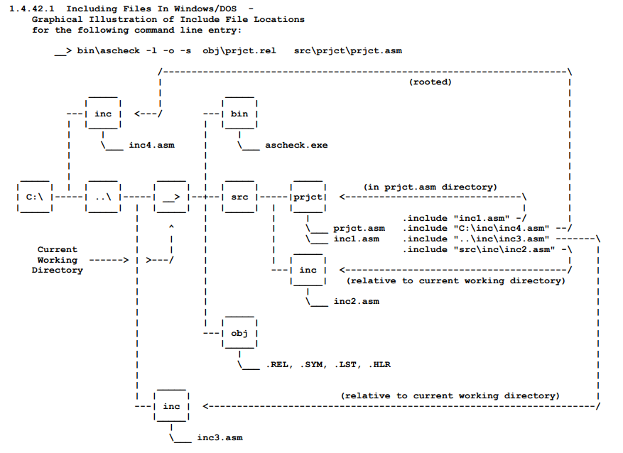
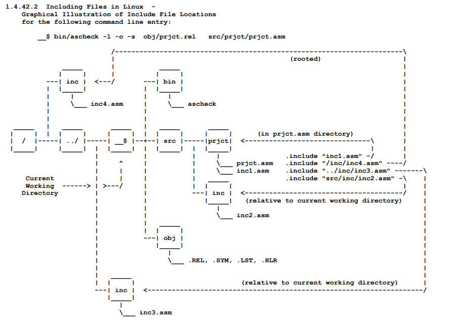

# ASxxxx Assemblers<br>and<br>ASLINK Relocating Linker

## Version   5.50, September 2023


## Table Of Contents


## CHAPTER 1  THE ASSEMBLER                                     1-1
#### 1.1     THE ASXXXX ASSEMBLERS                              1-1
#### 1.1.1     Assembly Pass 1                                  1-2
#### 1.1.2     Assembly Pass 2                                  1-2
#### 1.1.3     Assembly Pass 3                                  1-3
#### 1.2     SOURCE PROGRAM FORMAT                              1-3
#### 1.2.1     Statement Format                                 1-3
#### 1.2.1.1     Label Field                                    1-4
#### 1.2.1.2     Operator Field                                 1-5
#### 1.2.1.3     Operand Field                                  1-6
#### 1.2.1.4     Comment Field                                  1-6
#### 1.3     SYMBOLS AND EXPRESSIONS                            1-7
#### 1.3.1     Character Set                                    1-7
#### 1.3.2     User-Defined Symbols                            1-11
#### 1.3.3     Reusable Symbols                                1-12
#### 1.3.4     Current Location Counter                        1-13
#### 1.3.5     Numbers                                         1-15
#### 1.3.6     Terms                                           1-15
#### 1.3.7     Expressions                                     1-16
#### 1.4     GENERAL ASSEMBLER DIRECTIVES                      1-18
#### 1.4.1     .module Directive                               1-18
#### 1.4.2     .title Directive                                1-18
#### 1.4.3     .sbttl Directive                                1-19
#### 1.4.4     .list and .nlist Directives                     1-19
#### 1.4.5     .page Directive                                 1-21
#### 1.4.6     .msg Directive                                  1-21
#### 1.4.7     .error Directive                                1-22
#### 1.4.8     .byte, .db, and .fcb Directives                 1-22
#### 1.4.9     .word, .dw, and .fdb Directives                 1-23
#### 1.4.10    .3byte and .triple Directives                   1-23
#### 1.4.11    .dl, .long, .4byte, and .quad Directives        1-24
#### 1.4.12    .blkb, .ds, .rmb, and .rs Directives            1-24
#### 1.4.13    .blkw, .blkl, .blk3, and .blk4 Directives       1-25
#### 1.4.14    .ascii, .str, and .fcc Directives               1-25
#### 1.4.15    .ascis and .strs Directives                     1-26
#### 1.4.16    .asciz and .strz Directives                     1-26
#### 1.4.17    Non-Printing Characters In Strings              1-27
#### 1.4.18    .assume Directive                               1-27
#### 1.4.19    .radix Directive                                1-28
#### 1.4.20    .even Directive                                 1-28
#### 1.4.21    .odd Directive                                  1-28
#### 1.4.22    .bndry Directive                                1-29
#### 1.4.23    .area Directive                                 1-30
#### 1.4.24    .psharea and .poparea Directives                1-33
#### 1.4.25    .bank Directive                                 1-34
#### 1.4.26    .org Directive                                  1-35
#### 1.4.27    .globl Directive                                1-35
#### 1.4.28    .local Directive                                1-36
#### 1.4.29    .equ, .gblequ, and .lclequ Directives           1-37
#### 1.4.30    .if, .else, and .endif Directives               1-37
#### 1.4.31    .iff, .ift, and .iftf Directives                1-38
#### 1.4.32    .ifxx Directives                                1-39
#### 1.4.33    .ifdef Directive                                1-40
#### 1.4.34    .ifndef Directive                               1-42
#### 1.4.35    .ifb Directive                                  1-43
#### 1.4.36    .ifnb Directive                                 1-44
#### 1.4.37    .ifidn Directive                                1-45
#### 1.4.38    .ifdif Directive                                1-46
#### 1.4.39    Alternate .if Directive Forms                   1-47
#### 1.4.40    Immediate Conditional Assembly Directives       1-48
#### 1.4.41    .incbin Directive                               1-49
#### 1.4.42    .include Directive                              1-50
#### 1.4.42.1    Including Files In Windows/DOS                1-52
#### 1.4.42.2    Including Files in Linux                      1-53
#### 1.4.43    .define and .undefine Directives                1-54
#### 1.4.44    .enabl and .dsabl Directives                    1-55
#### 1.4.45    .setdp Directive                                1-55
#### 1.4.46    .16bit, .24bit, and .32bit Directives           1-57
#### 1.4.47    .msb Directive                                  1-58
#### 1.4.48    .lohi and .hilo Directives                      1-59
#### 1.4.49    .trace and .ntrace Directives                   1-59
#### 1.4.50    .end Directive                                  1-61
#### 1.5     INVOKING ASXXXX                                   1-62
#### 1.6     ERRORS                                            1-66
#### 1.7     LISTING FILE                                      1-68
#### 1.8     SYMBOL TABLE FILE                                 1-71
#### 1.9     OBJECT FILE                                       1-71
#### 1.10    HINT FILE                                         1-72

## CHAPTER 2  THE MACRO PROCESSOR                               2-1
#### 2.1     DEFINING MACROS                                    2-1
#### 2.1.1     .macro Directive                                 2-2
#### 2.1.2     .endm Directive                                  2-3
#### 2.1.3     .mexit Directive                                 2-3
#### 2.2     CALLING MACROS                                     2-4
#### 2.3     ARGUMENTS IN MACRO DEFINITIONS AND MACRO CALLS     2-5
#### 2.3.1     Macro Nesting                                    2-6
#### 2.3.2     Special Characters in Macro Arguments            2-7
#### 2.3.3     Passing Numerical Arguments as Symbols           2-8
#### 2.3.4     Number of Arguments in Macro Calls               2-9
#### 2.3.5     Creating Local Symbols Automatically             2-9
#### 2.3.6     Keyword Arguments                               2-10
#### 2.3.7     Concatenation of Macro Arguments                2-12
#### 2.4     MACRO ATTRIBUTE DIRECTIVES                        2-13
#### 2.4.1     .narg Directive                                 2-13
#### 2.4.2     .nchr Directive                                 2-14
#### 2.4.3     .ntyp Directive                                 2-15
#### 2.4.4     .nval Directive                               v  2-16
#### 2.5     INDEFINITE REPEAT BLOCK DIRECTIVES                2-16
#### 2.5.1     .irp Directive                                  2-17
#### 2.5.2     .irpc Directive                                 2-18
#### 2.6     REPEAT BLOCK DIRECTIVE                            2-19
#### 2.6.1     .rept Directive                                 2-19
#### 2.7     MACRO DELETION DIRECTIVE                          2-20
#### 2.7.1     .mdelete Directive                              2-20
#### 2.8     MACRO INVOCATION DETAILS                          2-20
#### 2.9     CONTROLLING MACRO LISTINGS                        2-21
#### 2.10    BUILDING A MACRO LIBRARY                          2-22
#### 2.10.1    .mlib Macro Directive                           2-22
#### 2.10.2    .mcall Macro Directive                          2-23
#### 2.11    EXAMPLE MACRO CROSS ASSEMBLERS                    2-25
## CHAPTER 3  THE LINKER                                        3-1
#### 3.1     ASLINK RELOCATING LINKER                           3-1
#### 3.2     INVOKING ASLINK                                    3-3
#### 3.3     LIBRARY PATH(S) AND FILE(S)                        3-7
#### 3.4     ASLINK PROCESSING                                  3-8
#### 3.5     ASXXXX VERSION 5.XX (4.XX) LINKING                3-11
#### 3.5.1     Object Module Format                            3-11
#### 3.5.2     Header Line                                     3-12
#### 3.5.3     Module Line                                     3-12
#### 3.5.4     Merge Mode Line                                 3-12
#### 3.5.5     Bank Line                                       3-13
#### 3.5.6     Area Line                                       3-13
#### 3.5.7     Symbol Line                                     3-14
#### 3.5.8     T Line                                          3-14
#### 3.5.9     R Line                                          3-14
#### 3.5.10    P Line                                          3-15
#### 3.5.11    24-Bit and 32-Bit Addressing                    3-16
#### 3.5.12    ASlink V5.xx (V4.xx) Error Messages             3-16
#### 3.6     ASXXXX VERSION 3.XX LINKING                       3-19
#### 3.6.1     Object Module Format                            3-19
#### 3.6.2     Header Line                                     3-20
#### 3.6.3     Module Line                                     3-20
#### 3.6.4     Area Line                                       3-20
#### 3.6.5     Symbol Line                                     3-20
#### 3.6.6     T Line                                          3-21
#### 3.6.7     R Line                                          3-21
#### 3.6.8     P Line                                          3-22
#### 3.6.9     24-Bit and 32-Bit Addressing                    3-22
#### 3.6.10    ASlink V3.xx Error Messages                     3-23
#### 3.7     HINT FILE FORMAT FOR RELOCATED LISTINGS           3-25
#### 3.8     INTEL HEX OUTPUT FORMAT                           3-27
#### 3.9     MOTOROLA S1-S9 OUTPUT FORMAT (16-BIT)             3-29
#### 3.10    MOTOROLA S2-S8 OUTPUT FORMAT (24-BIT)             3-30
#### 3.11    MOTOROLA S3-S7 OUTPUT FORMAT (32-BIT)             3-31
#### 3.12    TANDY COLOR COMPUTER DISK BASIC FORMAT            3-32
## CHAPTER 4  BUILDING ASXXXX AND ASLINK                        4-1
#### 4.1     BUILDING ASXXXX AND ASLINK WITH LINUX              4-2
#### 4.2     BUILDING ASXXXX AND ASLINK WITH CYGWIN             4-3
#### 4.3     BUILDING ASXXXX AND ASLINK WITH DJGPP              4-3
#### 4.4     BUILDING ASXXXX AND ASLINK WITH BORLAND'S
#### TURBO C++ 3.0                                      4-4
#### 4.4.1     Graphical User Interface                         4-4
#### 4.4.2     Command Line Interface                           4-4
#### 4.5     BUILDING ASXXXX AND ASLINK WITH
#### MS VISUAL C++ 6.0                                  4-5
#### 4.5.1     Graphical User Interface                         4-5
#### 4.5.2     Command Line Interface                           4-5
#### 4.6     BUILDING ASXXXX AND ASLINK WITH
#### MS VISUAL STUDIO 2005                              4-6
#### 4.6.1     Graphical User Interface                         4-6
#### 4.6.2     Command Line Interface                           4-6
#### 4.7     BUILDING ASXXXX AND ASLINK WITH
#### MS VISUAL STUDIO 2010                              4-7
#### 4.7.1     Graphical User Interface                         4-7
#### 4.7.2     Command Line Interface                           4-8
#### 4.8     BUILDING ASXXXX AND ASLINK WITH
#### MS VISUAL STUDIO 2013                              4-9
#### 4.8.1     Graphical User Interface                         4-9
#### 4.8.2     Command Line Interface                           4-9
#### 4.9     BUILDING ASXXXX AND ASLINK WITH
#### MS VISUAL STUDIO 2015                             4-10
#### 4.9.1     Graphical User Interface                        4-10
#### 4.9.2     Command Line Interface                          4-10
#### 4.10    BUILDING ASXXXX AND ASLINK WITH
#### MS VISUAL STUDIO 2019                             4-11
#### 4.10.1    Graphical User Interface                        4-11
#### 4.10.2    Command Line Interface                          4-11
#### 4.11    BUILDING ASXXXX AND ASLINK WITH
#### MS VISUAL STUDIO 2022                             4-12
#### 4.11.1    Graphical User Interface                        4-12
#### 4.11.2    Command Line Interface                          4-12
#### 4.12    BUILDING ASXXXX AND ASLINK WITH
#### OPEN WATCOM V1.9                                  4-13
#### 4.12.1    Graphical User Interface                        4-13
#### 4.12.2    Command Line Interface                          4-14
#### 4.13    BUILDING ASXXXX AND ASLINK WITH
#### SYMANTEC C/C++ V7.2                               4-15
#### 4.13.1    Graphical User Interface                        4-15
#### 4.13.2    Command Line Interface                          4-15
#### 4.14    THE _CLEAN.BAT AND _PREP.BAT FILES                4-16
#### 4.15    THE PRECOMPILED ASXXXX EXECUTABLES                4-16
#### APPENDIX A  ASXSCN LISTING FILE SCANNER                      A-1
#### APPENDIX B  ASXCNV LISTING CONVERTER                         B-1
#### APPENDIX C  S19OS9 CONVERSION UTILITY                        C-1
#### APPENDIX D  RELEASE NOTES                                    D-1
#### APPENDIX E  CONTRIBUTORS                                     E-1
#### APPENDIX F  NOTES AND TIPS                                   F-1
#### ---- Assembler Appendices ----
#### APPENDIX AA  ASCHECK ASSEMBLER                              AA-1
#### APPENDIX AB  AS1802 ASSEMBLER                               AB-1
#### APPENDIX AC  AS2650 ASSEMBLER                               AC-1
#### APPENDIX AD  AS4040 ASSEMBLER                               AD-1
#### APPENDIX AE  AS430 ASSEMBLER                                AE-1
#### APPENDIX AF  AS6100 ASSEMBLER                               AF-1
#### APPENDIX AG  AS61860 ASSEMBLER                              AG-1
#### APPENDIX AH  AS6500 ASSEMBLER                               AH-1
#### APPENDIX AI  AS6800 ASSEMBLER                               AI-1
#### APPENDIX AJ  AS6801 ASSEMBLER                               AJ-1
#### APPENDIX AK  AS6804 ASSEMBLER                               AK-1
#### APPENDIX AL  AS68(HC)05 ASSEMBLER                           AL-1
#### APPENDIX AM  AS68(HC[S])08 ASSEMBLER                        AM-1
#### APPENDIX AN  AS6809 ASSEMBLER                               AN-1
#### APPENDIX AO  AS6811 ASSEMBLER                               AO-1
#### APPENDIX AP  AS68(HC[S])12 ASSEMBLER                        AP-1
#### APPENDIX AQ  AS6816 ASSEMBLER                               AQ-1
#### APPENDIX AR  AS68CF ASSEMBLER                               AR-1
#### APPENDIX AS  AS68K ASSEMBLER                                AS-1
#### APPENDIX AT  AS740 ASSEMBLER                                AT-1
#### APPENDIX AU  AS78K0 ASSEMBLER                               AU-1
#### APPENDIX AV  AS78K0S ASSEMBLER                              AV-1
#### APPENDIX AW  AS8008 ASSEMBLER                               AW-1
#### APPENDIX AX  AS8008S ASSEMBLER                              AX-1
#### APPENDIX AY  AS8048 ASSEMBLER                               AY-1
#### APPENDIX AZ  AS8051 ASSEMBLER                               AZ-1
#### APPENDIX BA  AS8085 ASSEMBLER                               BA-1
#### APPENDIX BB  AS89LP ASSEMBLER                               BB-1
#### APPENDIX BC  AS8X300 ASSEMBLER                              BC-1
#### APPENDIX BD  AS8XCXXX ASSEMBLER                             BD-1
#### APPENDIX BE  ASAVR ASSEMBLER                                BE-1
#### APPENDIX BF  ASCOP4 ASSEMBLER                               BF-1
#### APPENDIX BG  ASCOP8 ASSEMBLER                               BG-1
#### APPENDIX BH  ASEZ8 ASSEMBLER                                BH-1
#### APPENDIX BI  ASEZ80 ASSEMBLER                               BI-1
#### APPENDIX BJ  ASF2MC8 ASSEMBLER                              BJ-1
#### APPENDIX BK  ASF8 ASSEMBLER                                 BK-1
#### APPENDIX BL  ASGB ASSEMBLER                                 BL-1
#### APPENDIX BM  ASH8 ASSEMBLER                                 BM-1
#### APPENDIX BN  ASM8C ASSEMBLER                                BN-1
#### APPENDIX BO  ASPDP11 ASSEMBLER                              BO-1
#### APPENDIX BP  ASPIC ASSEMBLER                                BP-1
#### APPENDIX BQ  ASRAB ASSEMBLER                                BQ-1
#### APPENDIX BR  ASRS08 ASSEMBLER                               BR-1
#### APPENDIX BS  ASSCMP ASSEMBLER                               BS-1
#### APPENDIX BT  ASST6 ASSEMBLER                                BT-1
#### APPENDIX BU  ASST7 ASSEMBLER                                BU-1
#### APPENDIX BV  ASST8 ASSEMBLER                                BV-1
#### APPENDIX BW  ASSX ASSEMBLER                                 BW-1
#### APPENDIX BX  ASZ8 ASSEMBLER                                 BX-1
#### APPENDIX BY  ASZ80 ASSEMBLER                                BY-1
#### APPENDIX BZ  ASZ280 ASSEMBLER                               BZ-1
---- Link To The Assemblers Index ----

# PREFACE

The  ASxxxx  assemblers  were  written following the style of several unfinished cross assemblers found in the Digital  Equipment  Corporation  Users  Society  (DECUS) distribution of the C programming language.  The incomplete DECUS  code  was  provided with  no  documentation  as  to  the  input syntax or the output format.  I wish to thank the author for inspiring  me  to  begin the development of this set of assemblers.

The  ASLINK  program was written as a companion to the ASxxxx assemblers, its design and implementation was not  derived  from any other work.

I  would  greatly  appreciate  receiving  the  details of any changes, additions, or errors pertaining to these  programs  and will  attempt  to  incorporate  any  fixes  or  generally useful changes in a future update to these programs.

ASxxxxアセンブラは、Cプログラミング言語のDigital Equipment Corporation Users Society (DECUS)ディストリビューションにあった未完成のクロスアセンブラのスタイルに従って書かれました。 未完成のDECUSコードは、入力構文や出力フォーマットに関する文書がないまま提供された。 このアセンブラの開発を始めるきっかけを与えてくれた著者に感謝したい。

ASLINKプログラムはASxxxxアセンブラに付随するものとして書かれたものであり、その設計と実装は他のいかなる作品からも派生したものではありません。

これらのプログラムに関連する変更、追加、エラーの詳細についてお知らせいただければ幸いです。

Alan R.  Baldwin  
Kent State University  
Physics Department  
Kent, Ohio 44242  
U.S.A.  


http://shop-pdp.net

baldwin@shop-pdp.net

baldwin@kent.edu

# END   USER   LICENSE   AGREEMENT

Copyright (C) 1989-2023 Alan R.  Baldwin

This  program  is  free  software:   you  can redistribute it and/or modify it under the  terms  of  the  GNU  General  Public License  as  published  by  the Free Software Foundation, either version 3 of the License, or (at your option) any later version. 

This  program is distributed in the hope that it will be useful, but WITHOUT ANY WARRANTY;  without even  the  implied  warranty  of  MERCHANTABILITY  or FITNESS FOR A PARTICULAR PURPOSE.

See the GNU General Public License for more details.

You  should  have  received  a copy of the GNU General Public License   along   with    this    program.     If    not,    see <http://www.gnu.org/licenses/>.


Submitted by Alan R.  Baldwin,  
Kent State University, Kent, Ohio

Operating System:  Linux, Windows, MS-DOS or other supporting ANSI C.

Source Language:  C

# Abstract:

The  ASxxxx  assemblers are a series of microprocessor assemblers written in the C programming  language.   This  collection contains   cross   assemblers   for   the  1802,  S2650,  SC/MP, 4040(4004),  MPS430,   6100,   61860,   6500,   6800(6802/6808), 6801(6803/HD6303),   6804,   6805,   68HC(S)08,   6809,  68HC11, 68HC(S)12, 68HC16, 68CF 68K, 740, 78K/0,  78K/0S,  8008,  8008S, 8048(8041/8022/8021),  8051,  8085(8080),  AT89LP, 8X300(8X305), COP4,  COP8,  DS8XCXXX,  AVR,  EZ8,  EZ80,  F2MC8L/FX,  F8/3870, GameBoy(Z80),  H8/3xx,  Cypress  PSoC(M8C),  PDP11,  PIC, Rabbit 2000/3000, RS08, ST6, ST7, ST8, SX, Z8, Z80(HD64180),  and  Z280 series  microprocessors.   Each  assembler has a device specific section which includes:  

ASxxxx アセンブラは、C 言語で記述されたマイクロプロセッサ用アセンブラのシリーズです。  このコレクションには、1802, S2650, SC/MP, 4040(4004), MPS430, 6100, 61860, 6500, 6800(6802/6808)、 6801(6803/hd6303), 6804, 6805, 68hc(s)08, 6809, 68hc11, 68hc(s)12, 68hc16, 68cf 68k, 740, 78k/0, 78k/0s, 8008, 8008s, 8048(8041/8022/8021)、  8051, 8085(8080), AT89LP, 8X300(8X305), COP4, COP8, DS8XCXXX, AVR, EZ8, EZ80, F2MC8L/FX, F8/3870, GameBoy(Z80), H8/3xx、  Cypress PSoC(M8C)、PDP11、PIC、Rabbit 2000/3000、RS08、ST6、ST7、ST8、SX、Z8、Z80(HD64180)、Z280 シリーズ、以上のマイクロプロセッサ対応のアセンブラが含まれています。  各アセンブラには、以下の項目を含むデバイス固有のセクションがあります：

1) device description, byte order, and file  extension  information,  
2)  a table of assembler general directives, special directives, assembler  mnemonics  and  associated operation codes, 
3) machine specific code for processing the device mnemonics, addressing modes, and special directives.

The assemblers have a common device independent section which handles the details of file input/output, symbol  table  generation,  program/data  areas,  expression  analysis, and assembler directive processing.

1) デバイスの説明、バイトオーダー、ファイル拡張子情報、  
2) アセンブラの一般命令、特殊命令、アセンブラのニーモニック、関連する操作コードの表、 
3) デバイスニーモニック、アドレッシングモード、特殊ディレクティブを処理するためのマシン固有コード。

アセンブラには、ファイル入出力、シンボルテーブル生成、プログラム/データ領域、式解析、アセンブラ指令処理の詳細を処理する共通のデバイス独立セクションがある。

The  assemblers  provide  the following features:  

1) alphabetized, formatted symbol table listings,
2) relocatable object modules, 
3) global symbols for linking object modules, 
4) conditional assembly directives, 
5) reusable  local  symbols,
6) include-file  processing,  and  
7)  a  general macro processing facility.

アセンブラは以下の機能を提供する：  

1) アルファベット順の、フォーマットされたシンボルテーブルリスト
2) リロケータブルオブジェクトモジュール
3) オブジェクトモジュールをリンクするためのグローバルシンボル
4) 条件付きアセンブリ命令 
5) 再利用可能なローカルシンボル
6) インクルードファイル処理
7) 一般的なマクロ処理機能

The  companion program ASLINK is a relocating linker performing the following functions:  

1) bind multiple  object  modules into  a  single  memory  image,  
2) resolve inter-module symbol references,  
3)  resolve  undefined  symbols   from   specified librarys of object modules, 
4) process absolute, relative, concatenated, and overlay attributes in data and program  sections,
5)  perform  byte and word program-counter relative (pc or pcr) addressing calculations,
6) define absolute  symbol  values  at link  time, 
7) define absolute area base address values at link time, 
8) produce an Intel Hex  record,  Motorola  S  record  or Tandy  CoCo  Disk  Basic  output  file, 
9) produce a map of the linked memory image, and
10) update the ASxxxx assembler  listing files with the absolute linked addresses and data.

 添付のプログラムASLINKは、以下の機能を実行する再配置リンカである：  

1) 複数のオブジェクトモジュールを単一のメモリイメージにバインドする  
2) モジュール間のシンボル参照を解決する
3) 指定されたオブジェクトモジュールのライブラリから未定義シンボルを解決する
4) データセクションとプログラムセクションの絶対属性、相対属性、連結属性、オーバーレイ属性の処理
5) バイトおよびワードのプログラムカウンタ相対(pc または pcr)アドレッシング計算の実行
6) リンク時に絶対シンボル値を定義する
7) リンク時に絶対エリアベースアドレス値を定義する
8) インテルHexレコード、モトローラSレコード、またはタンディCoCoディスクベーシック出力ファイルを作成する
9) リンクされたメモリーイメージのマップを作成する
10) 絶対リンクアドレスとデータで ASxxxx アセンブラのリストファイルを更新する

The  assemblers  and  linker have been tested using Linux and DJGPP, Cygwin, Symantec C/C++ V7.2, Borland Turbo C++ 3.0,  Open Watcom V1.9, VC6, Visual Studio 2005, 2010, 2013, 2015, 2019 and 2022.  Complete source code and documentation for the assemblers and  linker  is  included  with the distribution.  Additionally, test code for each assembler and several microprocessor monitors (ASSIST05 for the 6805, MONDEB and ASSIST09 for the 6809, BUFFALO 2.5 for the 6811, and MONDEB for 8051 / AT89LP series ) are included as working examples of use of these assemblers.

アセンブラとリンカは、Linux、DJGPP、Cygwin、Symantec C/C++ V7.2、Borland Turbo C++ 3.0、Open Watcom V1.9、VC6、Visual Studio 2005、2010、2013、2015、2019、2022を使用してテスト済です。 アセンブラとリンカの完全なソースコードとドキュメントが配布物に含まれています。 さらに、各アセンブラのテストコードと、いくつかのマイクロプロセッサモニター(6805用のASSIST05、6809用のMONDEBとASSIST09、6811用のBUFFALO 2.5、8051 / AT89LPシリーズ用のMONDEB)が、これらのアセンブラの使用例として含まれています。

<div style="page-break-before:always"></div>

# <p style="text-align: center">CHAPTER 1<br>THE ASSEMBLER</p>

## 1.1  THE ASXXXX ASSEMBLERS

The  ASxxxx  assemblers are a series of microprocessor assemblers written in the C programming language.  Each assembler has a device specific section which includes:

ASxxxxアセンブラは、C言語で記述された一連のマイクロプロセッサアセンブラです。 各アセンブラには、以下のようなデバイス固有のセクションがあります：

1.  device  description, byte order, and file extension information
2.  a  table  of  the assembler general directives, special device directives, assembler mnemonics  and  associated operation codes
3.  machine specific code for processing the device mnemonics, addressing modes, and special directives

1. デバイスの説明、バイト順序、ファイル拡張子情報。
2. アセンブラの一般命令、特殊デバイス命令、アセンブラのニーモニック、関連するオペレーションコードの表
3. デバイスニーモニック、アドレッシングモード、特殊ディレクティブを処理するためのマシン固有のコード

The device specific information is detailed in the appendices.

デバイス固有の情報については、付録を参照してください。

The assemblers have a common device independent section which handles the details of file input/output, symbol  table  generation,  program/data  areas,  expression  analysis, and assembler directive processing.

アセンブラには、ファイル入出力、シンボルテーブル生成、プログラム/データ領域、式解析、アセンブラ指令処理の詳細を処理する共通のデバイス非依存セクションがあります。

The assemblers provide the following features:

これらのアセンブラには以下の特徴があります。

1.  Command string control of assembly functions
2.  Alphabetized, formatted symbol table listing
3.  Relocatable object modules
4.  Global symbols for linking object modules
5.  Conditional assembly directives
6.  Program sectioning directives

1.  アセンブリ機能のコマンドストリング制御
2.  アルファベット化され、フォーマットされたシンボルテーブルリスト
3.  再配置可能なオブジェクトモジュール
4.  オブジェクトモジュールをリンクするためのグローバルシンボル
5.  条件付きアセンブリ指令
6.  プログラムセクション化ディレクティブ

ASxxxx assembles one or more source files into a single relocatable ascii object file.  The output of the ASxxxx  assemblers consists of an ascii relocatable object file(\*.rel), an assembly listing file(\*.lst), and a symbol file(\*.sym) each controlled by an  assembler  option.  If both the object and listing files are specified then a listing to relocated listing hint file  (\*.hlr) is  created  as  a  helper for the linker to properly create the relocated listing file.

ASxxxx は、1 つまたは複数のソースファイルを 1 つのリロケータブルな ascii オブジェクトファイルにアセンブルします。 ASxxxx アセンブラの出力は、ascii リロケータブルオブジェクトファイル( \*.rel)、アセンブリリストファイル( \*.lst)、シンボルファイル( \*.sym) から構成され、それぞれがアセンブラオプションによって制御されます。 オブジェクトファイルとリスティングファイルの両方が指定された場合は、リンカがリロケーショ ンリスティングファイルを適切に作成するための補助として、リスティングからリロケーショ ンリスティングへのヒントファイル( \*.hlr) が作成されます。

### 1.1.1  Assembly Pass 1

During  pass  1, ASxxxx opens all source files and performs a rudimentary assembly of each source statement.  During this process  all symbol tables are built, program sections defined, and number of bytes for each assembled source line is estimated.

パス1の間、ASxxxxはすべてのソースファイルを開き、各ソース文の初歩的なアセンブルを実行します。 この過程で、すべてのシンボルテーブルが構築され、プログラムセクションが定義され、アセンブルされた各ソース行のバイト数が推定されます。

At the end of pass 1 all undefined symbols may be made global (external) using the ASxxxx switch -g, otherwise undefined  symbols will be flagged as errors during succeeding passes.

パス1の最後に、ASxxxxスイッチ-gを使用して、すべての未定義シンボルをグローバル(外部)にすることができます。

### 1.1.2  Assembly Pass 2

During  pass  2  the ASxxxx assembler resolves forward references and determines the number  of  bytes  for  each  assembled line.   The  number  of bytes used by a particular assembler instruction may depend upon the addressing mode, whether  the  instruction allows multiple forms based upon the relative distance to the addressed location, or other factors.   Pass  2  resolves these  cases  and  determines the address of all symbols.  Those assemblers with multiple forms are able to automatically  repeat pass  2 as many times as necessary to resolve all differences in instruction lengths and forward references.   All  other  assemblers  can  manually  specify  additional passes to resolve more than one level of forward referencing.

パス2の間、ASxxxxアセンブラは前方参照を解決し、各アセンブル行のバイト数を決定します。  特定のアセンブラ命令で使用されるバイト数は、アドレス指定モードや、アドレス指定された位置までの相対的な距離に基づいて複数の形式を許容する命令かどうか、またはその他の要因に依存する場合があります。  パス 2 はこれらのケースを解決し、すべてのシンボルのアドレスを決定します。 複数のフォームを持つアセンブラは、命令長と前方参照のすべての違いを解決するために、必要な回数だけパス 2 を自動的に繰り返すことができます。  他のすべてのアセンブラは、1 レベル以上の前方参照を解決するために、手動で追加のパスを指定できます。

### 1.1.3  Assembly Pass 3

Pass 3 by the assembler generates the listing file, the relocatable output file, the listing to relocated listing hint file, and  the  symbol  tables.  Also during pass 3 the errors will be reported.

アセンブラによるパス3では、リスティングファイル、再配置可能な出力ファイル、リスティングから再配置されたリスティングへのヒントファイル、シンボルテーブルが生成される。 また、パス3の間にエラーが報告される。

The  relocatable object file is an ascii file containing symbol references and definitions, program  area  definitions,  and the  relocatable assembled code, the linker ASLINK will use this information to generate an absolute load file  (Intel,  Motorola or Tandy CoCo Disk Basic formats).

再配置可能オブジェクトファイルは、シンボルの参照と定義、プログラム領域の定義、再配置可能なアセンブルコードを含むasciiファイルで、リンカASLINKはこの情報を使用して絶対ロードファイル(インテル、モトローラ、タンディCoCoディスクベーシック形式)を生成します。

## 1.2  SOURCE PROGRAM FORMAT

### 1.2.1  Statement Format

A source program is composed of assembly-language statements.  Each statement must be completed on one line.  A line  may  contain a maximum of 128 characters, longer lines are truncated and lost.

ソースプログラムはアセンブリ言語のステートメントで構成される。 各ステートメントは1行で完結しなければならない。 1行に含めることができる文字数は最大128文字で、これより長い行は切り捨てられ、失われます。

An  ASxxxx  assembler  statement  may  have  as  many as four fields.  These fields are identified by their order  within  the statement  and/or  by separating characters between fields.  The general format of the ASxxxx statement is:

ASxxxxアセンブラステートメントには4つのフィールドがあります。 これらのフィールドは、ステートメント内での順序やフィールド間の区切り文字によって識別されます。 ASxxxx文の一般的な書式は以下の通りです：

```
[label:]  Operator        Operand         [;Comment(s)]
```

The  label and comment fields are optional.  The operator and operand fields are interdependent.  The operator field may be an assembler  directive or an assembly mnemonic.  The operand field may be optional or required as defined in  the  context  of  the operator.

ラベルフィールドとコメントフィールドは任意である。 演算子フィールドとオペランドフィールドは相互に依存する。 演算子フィールドは、アセンブラ指令またはアセンブラのニーモニックである。 オペランドフィールドは、演算子のコンテキストで定義されたオプションまたは必須フィールドです。

ASxxxx  interprets  and  processes source statements one at a time.  Each statement causes a particular operation to  be  performed.

ASxxxxはソース文を1つずつ解釈し、処理します。 各ステートメントでは、特定の操作が実行されます。

#### 1.2.1.1  Label Field  -

A  label is a user-defined symbol which is assigned the value of the current location counter and entered into  the  user  defined  symbol  table.   The  current location counter is used by ASxxxx to assign memory addresses to the source  program  statements as they are encountered during the assembly process.  Thus a label is a means  of  symbolically  referring  to  a  specific
statement.  When  a program section is absolute, the value of the current location counter is absolute;  its value references an  absolute memory  address.   Similarly, when a program section is relocatable, the value of the current location counter is  relocatable.

ラベルは、現在位置カウンタの値が割り当てられ、ユーザー定義シンボルテーブルに入力されるユーザー定義シンボルです。  カレントロケーションカウンタは、ASxxxxがアセンブリ処理中にソースプログラムステートメントにメモリアドレスを割り当てるために使用します。 このように、ラベルは特定のステートメントをシンボリックに参照する手段です。
ステートメントをシンボリックに参照する手段です。 プログラムセクションが絶対の場合、現在位置カウンタの値は絶対で、その値は絶対メモリアドレスを参照します。  同様に、プログラムセクションが再配置可能な場合、現在位置カウンタの値は再配置可能である。

A  relocation  bias  calculated at link time is added to the apparent value of the current location counter  to  establish  its effective  absolute  address  at  execution time.  (The user can also force the linker to relocate sections defined as  absolute.  This may be required under special circumstances.)

リンク時に計算された再配置バイアスが現在位置カウンタの見かけの値に加算され、実行時の実効絶対アドレスが確定する。 (ユーザは、絶対アドレスとして定義されたセクションの再配置をリンカに強制することもできる。 これは特別な状況下で必要とされるかもしれない)。

If  present,  a  label  must  be  the first field in a source statement and must be terminated by a colon (:).   For  example, if  the  value  of  the  current  location  counter  is absolute 01F0(H), the statement:

ラベルが存在する場合、ラベルはソース文の最初のフィールドでなければならず、コロン (:) で終了しなければならない。  例えば、現在位置カウンタの値が絶対値01F0(H)の場合、次のように記述する：

```
abcd:     nop
```
assigns  the  value  01F0(H) to the label abcd.  If the location counter value were relocatable, the final value of abcd would be 01F0(H)+K, where K represents the relocation bias of the program section, as calculated by the linker at link time.

はラベルabcdに01F0(H)を代入する。 もしロケーションカウンターの値が再配置可能であれば、 abcdの最終値は01F0(H)+Kとなり、Kはリンク時にリンカが計算した プログラムセクションの再配置バイアスを表す。

More  than  one label may appear within a single label field.  Each label so specified is assigned the same address value.  For example,  if  the  value  of  the  current  location  counter is 1FF0(H), the multiple labels in the following statement are each assigned the value 1FF0(H):

1つのラベルフィールドに複数のラベルを指定することができる。 このように指定された各ラベルには、同じアドレス値が割り当てられる。 例えば、カレントロケーションカウンタの値が1FF0(H)の場合、以下の文の中の複数のラベルには、それぞれ1FF0(H)という値が割り当てられる：

```
abcd:     aq:     $abc:   nop
```

Multiple labels may also appear on successive lines.  For example, the statements

複数のラベルが連続した行に表示されることもある。 例えば

```
abcd:
aq:
$abc:     nop
```

likewise  cause  the  same value to be assigned to all three labels.

は、同様に、3つのラベルすべてに同じ値を割り当てる。

A  double  colon  (::)  defines the label as a global symbol.  For example, the statement

ダブルコロン(::)は、ラベルをグローバルシンボルとして定義する。 例えば
```
abcd::    nop
```

establishes the label abcd as a global symbol.  The distinguishing attribute of a global symbol is that it  can  be  referenced from  within an object module other than the module in which the symbol is defined.  References to this label  in  other  modules are  resolved when the modules are linked as a composite executable image.

はラベル abcd をグローバルシンボルとして定義します。 グローバルシンボルの特徴は、そのシンボルが定義されているモジュール以外の オブジェクトモジュールから参照できることです。 他のモジュール内のこのラベルへの参照は、モジュールが複合実行イメージとしてリンクされたときに解決されます。

The legal characters for defining labels are:

ラベルを定義するのに有効な文字は以下の通り：

A through Z  
a through z  
0 through 9  
. (Period)  
\$ (Dollar sign)  
\_ (underscore)  

A から Z  
A から Z  
0 から 9  
. (ピリオド)  
\$ ドル記号  
_ アンダースコア  

A  label  may  be  any  length,  however  only  the  first 79 characters are significant and, therefore must be  unique  among all  labels in the source program (not necessarily among separately compiled modules).  An error code(s) (`<m>` or `<p>`)  will  be generated  in the assembly listing if the first 79 characters in two or more labels are the same.  The `<m>` code is caused by  the redeclaration  of  the symbol or its reference by another statement.  The `<p>` code is generated because the symbols location is changing on each pass through the source file.

ラベルはどのような長さでもかまいませんが、最初の79文字だけが重要であり、したがってソースプログラム内のすべてのラベルの中で一意でなければなりません(別々にコンパイルされたモジュールの中で一意である必要はありません)。 2つ以上のラベルの最初の79文字が同じであれば、エラーコード (`<m>` または `<p>`) がアセンブリリストに生成されます。 `<m>`はシンボルの再宣言または他のステートメントによる参照によって発生します。 `<p>`コードは、シンボルの位置がソースファイルを通過するたびに変化するために生成されます。

The  label  must  not  start with the characters 0-9, as this designates a reusable symbol with special  attributes  described in a later section.

ラベルは0-9で始まってはいけません。これは後のセクションで説明する特別な属性を持つ再利用可能なシンボルを指定するためです。


#### 1.2.1.2  Operator Field  -

The  operator field specifies the action to be performed.  It may consist of an instruction mnemonic (op code) or an assembler directive.

演算子フィールドは、実行される動作を指定する。 これは、命令ニーモニック(オペコード)またはアセンブラ指令で構成される。

When  the  operator is an instruction mnemonic, a machine instruction is generated and the assembler evaluates the addresses of  the operands which follow.  When the operator is a directive ASxxxx performs certain control actions or processing operations during assembly of the source program.

演算子が命令ニーモニックの場合、機械命令が生成され、アセンブラはそれに続くオペランドのアドレスを評価します。 演算子がディレクティブの場合、ASxxxx はソースプログラムのアセンブル中に特定の制御動作や処理操作を実行します。

Leading  and  trailing  spaces  or tabs in the operator field have no significance;  such characters serve  only  to  separate the operator field from the preceding and following fields.

演算子フィールドの先頭および末尾のスペースやタブは意味を持ちません。これらの文字は、演算子フィールドを前後のフィールドから分離するためだけに使用されます。

An operator is terminated by a space, tab or end of line.

演算子は、スペース、タブ、行末で終了します。

#### 1.2.1.3  Operand Field  -

When  the  operator is an instruction mnemonic (op code), the operand  field  contains  program  variables  that  are  to   be evaluated/manipulated by the operator.

演算子が命令ニーモニック(オペコード)の場合、オペランドフィールドには、演算子によって評価／操作されるプログラム変数が格納される。


Operands  may  be  expressions  or  symbols, depending on the operator.  Multiple expressions used in the operand  fields  may be  separated  by  a comma.  An operand should be preceded by an operator field;  if it is not, the statement will give an  error (`<q>` or `<o>`).   All operands following instruction mnemonics are treated as expressions.

オペランドは、演算子により式またはシンボルのいずれかである。オペランドフィールドで複数の式を記述する場合はコンマで区切る。オペランドフィールドの前に演算子フィールドを置かねばならない。そうでない場合、その文はエラー(`<q>` or `<o>`)となる。命令ニーモニックの後に置かれるオペランドは式として扱われる。

The operand field is terminated by a semicolon when the field is followed  by  a  comment.   For  example,  in  the  following statement:

オペランドフィールドの後にコメントが続く場合、オペランドフィールドはセミコロンで終了します。  例えば、以下のステートメントでは
```
label:    lda     abcd,x          ;Comment field
```

the  tab  between lda and abcd terminates the operator field and defines the beginning of the operand field;  a  comma  separates the operands abcd and x;  and a semicolon terminates the operand field and defines the beginning of the comment field.   When  no comment  field  follows,  the operand field is terminated by the end of the source line.

ldaとabcdの間のタブは、演算子フィールドを終了し、オペランドフィールドの開始を定義します。コンマは、オペランドabcdとxを区切り、セミコロンは、オペランドフィールドを終了し、コメントフィールドの開始を定義します。  コメントフィールドが続かない場合、オペランドフィールドはソース行の終端で終了する。

#### 1.2.1.4  Comment Field  -

The comment field begins with a semicolon and extends through the end of the line.  This field is optional and may contain any 7-bit ascii character except null.

Comments  do not affect assembly processing or program execution.


コメントフィールドはセミコロンで始まり、行末まで続く。 このフィールドはオプションであり、nullを除く任意の7ビットのアスキー文字を含めることができる。

コメントはアセンブリ処理やプログラムの実行には影響しない。

## 1.3  SYMBOLS AND EXPRESSIONS

This  section  describes the generic components of the ASxxxx assemblers:  the character set, the conventions observed in constructing  symbols,  and  the use of numbers, operators, and expressions.

このセクションでは、ASxxxx アセンブラの一般的な構成要素である、文字セット、シンボルを構成する際の規則、数値、演算子、および式の使用について説明します。

### 1.3.1  Character Set


The following characters are legal in ASxxxx source programs:

1.  The  letters  A  through Z.  Both upper- and lower-case letters are acceptable.  The  assemblers,  by  default, are  case  sensitive,  i.e.   ABCD and abcd are not the same symbols.  (The assemblers can be made case  insen-
sitive by using the -z command line option.)
2.  The digits 0 through 9
3.  The  characters . (period), \$ (dollar sign), and _ (underscore).
4.  The special characters listed in Tables 1 through 6.

ASxxxx ソースプログラムでは、以下の文字が使用可能です：

1.  大文字でも小文字でもかまいません。 デフォルトでは、アセンブラは大文字と小文字を区別します(ABCD と abcd は同じ記号ではありません)。 (アセンブラは大文字と小文字を区別しない。
アセンブラは、-z コマンドラインオプションを使用することで、大文字と小文字を区別しないようにすることができる)。
2.  0から9までの数字
3.  .(ピリオド)、\$(ドル記号)、_(アンダースコア)。
4.  表1～表6の特殊文字。


Tables  1  through  6  describe  the various ASxxxx label and field terminators, assignment operators, operand separators, assembly, unary, binary, and radix operators.

表1～表6に、さまざまなASxxxxラベルおよびフィールド終端子、代入演算子、オペランド分離子、アセンブリ演算子、単項演算子、二項演算子、基数演算子について説明します。

Table 1         Label Terminators and Assignment Operators

||||
|--|--|--|
|:|Colon|Label terminator.
|::|Double colon|Label  Terminator;   defines the<br> label as a global label.
|=|Equal sign|Direct assignment operator.
|==|Global equal|Direct assignment operator;  defines<br> the  symbol  as  a  global symbol.
|=:|Local equal|Direct assignment operator;  defines<br> the symbol as a local symbol.

Table 2         Field Terminators and Operand Separators

||||
|--|--|--|
|Tab||Item or field terminator.
|Space||Item or field terminator.
|,|Comma|Operand field separator.
|;|Semicolon|Comment field indicator.

Table 3         Assembler Operators

||||
|--|--|--|
|#|Number sign|Immediate expression indicator.
|.|Period|Current location counter.
|(|Left parenthesis|Expression delimiter.
|)|Right parenthesis|Expression delimiter.

Table 4         Unary Operators
|||||
|--|--|--|--|
|<|Left bracket|<FEDC|Produces  the lower byte value<br> of the expression. (DC)
|>|Right bracket|>FEDC|Produces  the upper byte value<br> of the expression.(FE)
|+|Plus sign|+A|Positive value of A
|-|Minus sign|-A|Produces   the  negative (2's<br> complement) of A.
|~|Tilde|~A|Produces the 1's complement of A.
|'|Single quote|'D|Produces  the  value  of the<br> character D.
|"|Double quote|"AB|Produces the double byte value<br> for AB.
|\\ |Backslash|'\n|Unix style characters, \b, \f, \n,<br> \r, \t or '\001   or octal byte values.


Table 5         Binary Operators

|||||
|--|--|--|--|
|<<|Double|0800 << 4|Produces the 4 bit Left bracket<br>                left-shifted   value  of 0800.  (8000)
|>>|Double|0800 >> 4|Produces the 4 bit Right bracket<br>               right-shifted  value  of 0800.  (0080)
|+|Plus sign|A + B|Arithmetic      Addition operator.
|-|Minus sign|A - B|Arithmetic   Subtraction operator.
|\*|Asterisk|A \* B|Arithmetic   Multiplication operator.
|/|Slash|A / B|Arithmetic      Division operator.
|&|Ampersand|A & B|Logical AND operator.
|\| |   Bar|            A \| B |     Logical OR operator. 
|%|Percent sign|   A % B|Modulus operator.
|^|Up arrow or<br> circumflex|A ^ B|EXCLUSIVE OR operator.

Table 6         Temporary Radix Operators

|||||
|--|--|--|--|
|$%,|   ^b, ^B, 0b, 0B|Binary radix operator.
|$&,|^o, ^O, 0o, 0O<br>^q, ^Q, 0q, 0Q|    Octal radix operator.
|$#,|^d, ^D, 0d, 0D|Decimal radix operator.
|$@,|^x, ^X, 0x, 0X<br>^h, ^H, 0h, 0H|Hexadecimal radix operator.

Potential  ambiguities arising from the use of 0b and 0d as temporary radix operators may be circumvented by preceding  all  non-prefixed  hexadecimal  numbers with 00.  Leading 0's are required in any  case  where  the  first
hexadecimal  digit is abcdef as the assembler will treat the letter sequence as a label.

The  decimal  point, '.', following any numerical sequence not preceded by a temporary radix and  containing only  the  decimal  digits  0-9  will  be  treated  as a decimal, radix 10, value.

一時的な基数演算子として0bと0dを使用することから生じる潜在的な曖昧さは、接頭辞のないすべての16進数の前に00を付けることで回避することができる。 先頭の0は、16進数の1桁目が
16進数の最初の桁がabcdefである場合、アセンブラはその文字列をラベルとして扱うので、先頭に0が必要である。

一時基数が先行せず、10進数0～9のみを含む数値列に続く10進小数点'.'は、10進数基数10の値として扱われる。

When   the   'C  Style  Numbers'  option  is  enabled (see .enabl csn) all temporary radixs beginning with a 0 (zero),  except  0x  and  0X,  are disabled.  Number sequences beginning with 0x or 0X are interpreted as  hex,
all other numbers beginning with 0 are octal, and numerical sequences not beginning with a 0 are decimal.

「Cスタイル番号」オプションが有効な場合(.enabl csnを参照)、0xと0Xを除く、0(ゼロ)で始まるすべての一時基数が無効になる。 0xまたは0Xで始まる数列は16進数として解釈される、
0から始まるその他の数値は8進数、0から始まらない数値列は10進数として解釈される。

### 1.3.2  User-Defined Symbols

User-defined  symbols are those symbols that are equated to a specific value through a direct assignment statement  or  appear as  labels.  These symbols are added to the User Symbol Table as they are encountered during assembly.

The following rules govern the creation of user-defined symbols:

ユーザー定義記号とは、直接代入文によって特定の値と等号化されたり、ラベルとして表示されたりする記号のことです。 これらのシンボルは、アセンブリ中に遭遇したときにユーザーシンボルテーブルに追加されます。

ユーザー定義記号の作成には、以下のルールがあります：

1.  Symbols  can  be  composed  of alphanumeric characters, dollar signs (\$),  periods  (.),  and  underscores  (_) only.
2.  The  first  character  of a symbol must not be a number (except in the case of reusable symbols).
3.  The  first 79 characters of a symbol must be unique.  A symbol  can  be  written  with  more  than   79   legal characters,  but the 80th and subsequent characters are ignored.
4.  Spaces and Tabs must not be embedded within a symbol.

1.  記号は英数字、ドル記号(\$)、ピリオド(.)、アンダースコア(_)のみで構成することができる。
2.  記号の最初の文字は数字であってはならない(再利用可能な記号の場合を除く)。
3.  記号の最初の79文字は一意でなければならない。 記号は79文字以上で書くことができるが、80文字目以降は無視される。
4.  記号の中にスペースやタブを入れてはならない。
   
### 1.3.3  Reusable Symbols

Reusable  symbols are specially formatted symbols used as labels within a block of coding that has been delimited as a reusable symbol block.  Reusable symbols are of the form n$, where n is a decimal integer from 0 to 65535,  inclusive.   Examples  of reusable symbols are:

再利用可能な記号は、再利用可能な記号ブロックとして区切られた符号化ブロック内のラベルと して使用される特別な書式の記号である。 再利用可能な記号は n$ の形式で、n は 0 から 65535 までの 10 進整数である。  再利用可能なシンボルの例

```
1$
27$
138$
244$
```

The range of a reusable symbol block consists of those statements between two normally constructed  symbolic  labels.   Note that a statement of the form:

再利用可能なシンボルブロックの範囲は、通常構成される2つのシンボルラベルの間にあるステートメントで構成されます。  という形のステートメントに注意してください：

```
ALPHA = EXPRESSION
```

is a direct assignment statement but does not create a label and thus does not delimit the range of a reusable symbol block.

Note  that  the  range  of a reusable symbol block may extend across program areas.

Reusable symbols provide a convenient means of generating labels for branch instructions and other  such  references  within reusable symbol blocks.  Using reusable symbols reduces the possibility of symbols with multiple definitions appearing within a user  program.   In  addition,  the use of reusable symbols differentiates entry-point labels from other labels, since reusable labels cannot be referenced from outside their respective symbol blocks.  Thus, reusable symbols of the same name can  appear  in other  symbol blocks without conflict.  Reusable symbols require less symbol table space  than  normal  symbols.   Their  use  is recommended.

は直接代入文であるが、ラベルを作成しないので、再利用可能なシンボルブロックの範囲を区切らない。

再利用可能なシンボルブロックの範囲は、プログラム領域にまたがる可能性があることに注意してください。

再利用可能なシンボルは、再利用可能なシンボルブロック内の分岐命令やその他の参照用のラベルを生成する便利な手段を提供します。 再利用可能なシンボルを使用することで、ユーザープログラム内に複数の定義を持つシンボルが出現する可能性を減らすことができます。  さらに、再利用可能なラベルはそれぞれのシンボルブロックの外から参照できないため、再利用可能なシンボルを使用することで、エントリーポイントラベルを他のラベルと区別することができます。 そのため、同じ名前の再利用可能なシンボルは、他のシンボルブロックに矛盾なく出現させることができます。 再利用可能なシンボルは、通常のシンボルよりもシンボルテーブルのスペースが少なくて済みます。  その使用を推奨する。

The  use  of  the  same reusable symbol within a symbol block will generate one or both of the `<m>` or `<p>` errors.

シンボルブロック内で同じ再利用可能なシンボルを使用すると、`<m>` または `<p>` エラーのどちらか、または両方が発生します。

Example of reusable symbols:

再利用可能なシンボルの例: 

```
a:      ldx     #atable ;get table address
        lda     #0d48   ;table length
1$:     clr     ,x+     ;clear
        deca
        bne     1$

b:      ldx     #btable ;get table address
        lda     #0d48   ;table length
1$:     clr     ,x+     ;clear
        deca
bne     1$
```

### 1.3.4  Current Location Counter

The  period  (.) is the symbol for the current location counter.  When used in the operand  field  of  an  instruction,  the period   represents  the  address  of  the  first  byte  of  the instruction:

ピリオド (.) は、現在位置カウンタを表す記号です。 命令のオペランドフィールドで使用される場合、ピリオドは命令の最初のバイトのアドレスを表します：

```
AS:     ldx     #.      ;The period (.) refers to
                        ;the address of the ldx
                        ;instruction.
```

When  used  in  the  operand field of an ASxxxx directive, itrepresents the address of the current byte or word:

ASxxxx 命令のオペランドフィールドで使用される場合、現在のバイトまたはワードのアドレスを表します：
```
QK = 0

.word   0xFFFE,.+4,QK   ;The operand .+4 in the .word
                        ;directive represents a value
                        ;stored in the second of the
                        ;three words during assembly.
```

If  we  assume  the  current  value of the program counter is 0H0200, then during assembly, ASxxxx  reserves  three  words  of storage  starting  at  location  0H0200.   The  first  value,  a hexadecimal constant FFFE, will be stored  at  location  0H0200.

The  second  value represented by .+4 will be stored at location 0H0202, its value will be 0H0206 ( = 0H0202  +  4).   The  third value  defined  by  the  symbol  QK  will  be placed at location 0H0204.

At the beginning of each assembly pass, ASxxxx resets the location counter.  Normally, consecutive memory locations are  assigned  to  each  byte  of  object code generated.  However, the value of the location counter can be changed  through  a  direct assignment statement of the following form:

プログラムカウンターの現在値を0H0200とすると、ASxxxxはアセンブル中に0H0200番地を起点とする3ワードのストレージを確保する。  最初の値である16進数定数FFFEは、場所0H0200に格納される。

.+4で表される2番目の値は、0H0202番地に格納され、その値は0H0206(= 0H0202 + 4)となる。  記号 QK で定義される 3 番目の値は、場所 0H0204 に配置されます。

各アセンブリパスの開始時に、ASxxxxはロケーションカウンタをリセットします。 通常、生成されるオブジェクトコードの各バイトには、連続したメモリ位置が割り当てられます。 しかし、ロケーションカウンタの値は、以下の形式の直接代入文によって変更することができます：

```
. = . + expression
```


The  new  location  counter can only be specified relative to the current location counter.  Neglecting to specify the current program  counter  along with the expression on the right side of the assignment operator will generate the <.> error.   (Absolute program areas may use the .org directive to specify the absolute location of the current program counter.)

The following coding illustrates the use of the current location counter:

新しい位置カウンターは、現在の位置カウンターからの相対値でしか指定できない。 代入演算子の右辺の式とともに現在のプログラムカウンタを指定しないと、<.>エラーが発生する。  (絶対プログラム領域は、現在のプログラムカウンタの絶対位置を指定するために .org 指令を使用することができます)。

次のコーディングは、現在の位置カウンタの使用を示しています。

```
        .area   CODE1   (ABS)   ;program area CODE1
                                ;is ABSOLUTE

        .org    0H100           ;set location to
                                ;0H100 absolute

num1:   ldx     #.+0H10         ;The label num1 has
                                ;the value 0H100.
                                ;X is loaded with
                                ;0H100 + 0H10

        .org    0H130           ;location counter
                                ;set to 0H130

num2:   ldy     #.              ;The label num2 has
                                ;the value 0H130.
                                ;Y is loaded with
                                ;value 0H130.

        .area   CODE2   (REL)   ;program area CODE2
                                ;is RELOCATABLE

        . = . + 0H20            ;Set location counter
                                ;to relocatable 0H20 of
                                ;the program section.

num3:   .word   0               ;The label num3 has　the value
                                ;of relocatable 0H20.

        . = . + 0H40            ;will reserve 0H40
                                ;bytes of storage as will
        .blkb   0H40            ;or
        .blkw   0H20
```

The  .blkb  and .blkw directives are the preferred methods of allocating space.

.blkbディレクティブと.blkwディレクティブは、スペースを割り当てるのに好ましい方法である。

### 1.3.5  Numbers

ASxxxx  assumes that all numbers in the source program are to be interpreted in decimal radix unless otherwise specified.  The .radix  directive  may  be used to specify the default as octal, decimal, or hexadecimal.  Individual numbers can  be  designated as  binary, octal, decimal, or hexadecimal through the temporary radix prefixes shown in table 6.

Negative  numbers  must  be preceded by a minus sign;  ASxxxx translates such numbers into two's  complement  form.   Positive numbers may (but need not) be preceded by a plus sign.

Numbers are always considered to be absolute values, therefore they are never relocatable.

ASxxxxでは、特に指定がない限り、ソースプログラム中のすべての数値は10進数基数で解釈されるものとします。 .radix指令を使用すると、デフォルトを8進数、10進数、16進数に指定することができます。 個々の数値は、表6に示す一時的な基数接頭辞によって、2進数、8進数、10進数、16進数として指定することができる。

負の数の前にはマイナス記号を付けなければならない。ASxxxxはこのような数を2の補数形式に変換する。  正の数の前にはプラス記号を付けることができる(付ける必要はない)。

数値は常に絶対値とみなされるため、再配置可能ではありません。

### 1.3.6  Terms

A  term is a component of an expression and may be one of the following:


1.  A number.
2.  A symbol:
    1.  A  period (.) specified in an expression causes the current location counter to be used.
    2.  A User-defined symbol.
    3.  An undefined symbol is assigned a value of zero and inserted in the User-Defined  symbol  table  as  an undefined symbol.
3.  A single quote followed by a single ascii character, or a double quote followed by two ascii characters.
4.  An  expression enclosed in parenthesis.  Any expression so enclosed is evaluated and reduced to a  single  term before  the remainder of the expression in which it appears is evaluated.  Parenthesis, for example,  may  be used  to  alter the left-to-right evaluation of expressions, (as in A*B+C versus A*(B+C)), or to apply a  unary operator to an entire expression (as in -(A+B)).
5.  A unary operator followed by a symbol or number.

用語は式の構成要素であり、以下のいずれかである：


1.  数値。
2.  記号：
    1.  式でピリオド(.)を指定すると、現在の位置カウンタが使用される。
    2.  ユーザー定義記号。
    3.  未定義シンボルにはゼロの値が割り当てられ、未定義シンボルとしてユーザー定義シンボルテーブルに挿入される。
3.  一重引用符の後にAECII文字1文字、または二重引用符の後にASCII文字2文字。
4.  括弧で囲まれた式。 このように囲まれた式はすべて評価され、それが現れる式の残りの部分が評価される前に、1つの項へと縮小される。 括弧は、たとえば、式の左から右への評価を変更したり(A*B+CとA*(B+C)のように)、単項演算子を式全体に適用したり(-(A+B)のように)するのに使われる。
5.  単項演算子の後に記号や数値を続けること。


### 1.3.7  Expressions


Expressions  are  combinations  of  terms  joined together by binary operators.  Expressions reduce to a value.   The  evaluation  of  an expression includes the determination of its attributes.  A resultant expression value may be one of  three  types (as  described  later  in this section):  relocatable, absolute, and external.

Expressions are evaluate with an operand hierarchy as follows:

式は、二項演算子によって結合された用語の組み合わせである。 式は値に還元される。  式の評価には、その属性の決定も含まれる。 結果として得られる式の値は、(このセクションで後述するように)再配置可能、絶対、外部という3つのタイプのいずれかになります。

式は次のようなオペランド階層で評価されます：

|||
|--|--|
|*       /       %|      multiplication, division, and modulus first.
|+       -        |      addition and subtraction second.
|<<      >>       |      left shift and right shift third.
|^                |      exclusive or fourth.
|&                |      logical and fifth.
|\|               |       logical or last

except that unary operators take precedence over binary operators.

A  missing  or  illegal  operator  terminates  the expression analysis, causing error codes `<o>` and/or  `<q>`  to  be  generated depending upon the context of the expression itself.

At assembly time the value of an external (global) expression is equal to the value of the absolute part of  that  expression.  For  example,  the expression external+4, where 'external' is an external symbol, has the value of 4.  This expression,  however, when  evaluated  at link time takes on the resolved value of the symbol 'external', plus 4.

A missing or illegal operator terminates the expression analysis, causing error codes `<o>` and/or `<q>` to be generated depending upon the context of the expression itself.

演算子の欠落や不正は、式の解析を終了させ、式自体の文脈に応じてエラーコード `<o>` や `<q>` が生成される。

アセンブリ時、外部(グローバル)式の値は、その式の絶対部分の値と等しくなる。しかし、この式はリンク時に評価されると、シンボル'external'の解決された値に 4 を加えた値になります。

Expressions,  when  evaluated  by  ASxxxx,  are  one of three types:  relocatable, absolute, or external.  The following  distinctions are important:


1.  An  expression is relocatable if its value is fixed relative to the base address of the program area in which it appears;  it will have an offset value added at link time.  Terms that contain labels defined in relocatable program  areas  will  have  a relocatable value;  similarly, a period (.)  in  a  relocatable  program  area, representing  the value of the current program location counter, will also have a relocatable value.
2.  An  expression  is  absolute if its value is fixed.  An expression whose terms are numbers and ascii characters will  reduce  to  an absolute value.  A relocatable expression or term minus a relocatable term,  where  both elements  being  evaluated  belong  to the same program area, is an absolute expression.  This is because every term  in  a  program area has the same relocation bias.  When one term is subtracted from the other the  relocation bias is zero.
3.  An  expression is external (or global) if it contains a single global reference (plus or minus an absolute  expression  value) that is not defined within the current program.  Thus, an external  expression  is  only  partially  defined following assembly and must be resolved at link time.

ASxxxxによって評価される式は、再配置可能、絶対、外部という3つのタイプのうちの1つである。 以下の区別は重要である：

1.  リンク時にオフセット値が追加される。 同様に、現在のプログラムロケーションカウンタの値を表すリロケータブルプログラムエリア内のピリオド(.)
2.  式は、その値が固定であれば絶対である。 項が数字とアスキー文字である式は、絶対値に還元される。 評価される両方の要素が同じプログラム領域に属する場合、再配置可能な式または項から再配置可能な項を引いたものは絶対式である。 これは、プログラム領域内のすべての項が同じ再配置バイアスを持つためである。 一方の項から他方の項を引くと、再配置バイアスはゼロになる。
3.  式が外部式(またはグローバル式)であるのは、現在のプログラム内で定義されていない1つのグローバル参照(プラスまたはマイナスの絶対式値)を含んでいる場合である。 したがって、外部式はアセンブリ後に部分的に定義されるだけであり、リンク時に解決されなければならない。

## 1.4  GENERAL ASSEMBLER DIRECTIVES

An  ASxxxx  directive  is placed in the operator field of the source line.  Only one directive is  allowed  per  source  line.  Each  directive  may  have  a blank operand field or one or more operands.  Legal operands differ with each directive.

ASxxxx 命令は、ソース行の演算子フィールドに置かれる。 ソース行ごとに 1 つの指令のみが許可される。 各指令は、空白のオペランドフィールドを持つことも、1つ以上のオペランドを持つこともできます。 有効なオペランドは各指令によって異なります。

### 1.4.1  .module Directive

Format:
```
    .module name
```

The  .module  directive causes the name to be included in the assemblers output file as an identifier for this particular  object module.  The name may be from 1 to 79 characters in length.  The name may not have any embedded white space (spaces or tabs).  Only  one  identifier is allowed per assembled module.  The main  use of this directive  is  to  allow  the  linker  to  report  a modules'  use  of undefined symbols.  At link time all undefined symbols are  reported  and  the  modules  referencing  them  are listed.

.moduleディレクティブは、この名前をアセンブラの出力ファイルに、この特定のオブジェクトモジュールの識別子として含めるようにします。 名前の長さは1文字から79文字までです。 名前には空白 (スペースやタブ) を含めることはできません。 1つのアセンブルモジュールにつき、識別子は1つだけです。 このディレクティブの主な用途は、リンカがモジュールが未定義シンボルを使用していることを報告することです。 リンク時にすべての未定義シンボルが報告され、それらを参照しているモジュールがリストされます。

### 1.4.2  .title Directive

Format:
```
    .title  string
```

The .title directive provides a character string to be placed on the second line of each page during listing.  The string  begins  with  the first non white space character (after any space or tab) and ends with the end of the line.

.titleディレクティブは、一覧表示中に各ページの2行目に配置される文字列を提供します。 文字列は、最初の空白でない文字 (スペースやタブの後) で始まり、行末で終わります。

### 1.4.3  .sbttl Directive

Format:
```
    .sbttl  string
```

The .sbttl directive provides a character string to be placed on the third line of each page during listing.  The  string  begins  with  the first non white space character (after any space or tab) and ends with the end of the line.

.sbttlディレクティブは、リスト中の各ページの3行目に配置される文字列を提供します。 文字列は、最初の空白でない文字 (スペースやタブの後) で始まり、行末で終わります。

### 1.4.4  .list and .nlist Directives

Format:
```
.list                           ;Basic .list

.list   expr                    ;with expression

.list   (arg1,arg2,...,argn)    ;with sublist options

.nlist                          ;Basic .nlist

.nlist  expr                    ;with expression

.nlist  (arg1,arg2,...,argn)    ;with sublist options
```


The  .list  and  .nlist directives control the listing output to the .lst  file.   The  directives  have  the  following  sublist options:

.list と .nlist ディレクティブは、.lst ファイルへのリスト出力を制御します。  ディレクティブには以下のサブリストオプションがあります：

||||
|--|--|--|
err|    - |     errors
loc|    - |     program location
bin|    - |     binary output
eqt|    - |     symbol or .if evaluation
cyc|    - |     opcode cycle count
lin|    - |     source line number
src|    - |     source line text
pag|    - |     pagination
lst|    - |     .list/.nlist line listing
md |    - |     macro definition listing
me |    - |     macro expansion listing
meb|    - |     macro expansion binary only listing
mel|    - |     macro expansion binary with source
!  |    - |     sets the listing mode to !(.list) or<br> !(.nlist) before applying the sublist options

The  'normal' listing mode .list is the combination of err, loc, bin, eqt, cyc, lin, src, pag, lst, and md enabled with me,  meb, and mel disabled.  The 'normal' listing mode .nlist has all sublist items disabled.  When specifying sublist options the option list  must  be  enclosed within parenthesis and multiple options separated by commas.

The NOT option, !, is used to set the listing mode to the opposite of the .list or .nlist directive before applying the sublist options.  For example:

通常の」リスティングモード.listは、err、loc、bin、eqt、cyc、lin、src、 pag、lst、mdが有効で、me、meb、melが無効の組み合わせである。 通常の」リスティングモード.nlistは、すべてのサブリスト項目が無効になっている。 サブリストオプションを指定する場合、オプションリストは括弧で囲み、複数のオプションをカンマで区切る必要があります。

NOTオプションの! は、サブリストオプションを適用する前に、.listまたは.nlistディレクティブと反対のリスティングモードを設定するために使われます。 例えば

|||
|--|--|
.nlist  (!)|    is equivalent to .list  and
.list   (!)|    is equivalent to .nlist any additional options will
be applied normally

Normal  .list/.nlist processing is disabled within false conditional blocks.  However, the .list/.nlist with  an  expression can  override  this  behavior  if  the expression has a non zero value.

Examples of listing options:

||||
|--|--|--|
.list  |(me) |  ; listing options are enabled<br>; during macro processing
.list  |(meb)| ; macro processing lists only<br>; generated binary and location
.list  |(mel)|  ; macro processing lists only<br>; source lines generating<br>; binary output
.nlist |(src)|  ; .nlist src lines not listed
.nlist |(!,lst)|; list all except .nlist
.nlist ||         ; combination lists only
.list  |(src)|  ; the source line
.list  |(!,src)|; list only the source line
.list  |1|      ; enable listing even within<br>; a FALSE conditional block

### 1.4.5  .page Directive

Format:
```
    .page
```

The .page directive causes a page ejection with a new heading to be printed.  The new page occurs after the next line  of  the source  program is processed, this allows an immediately following .sbttl directive to appear  on  the  new  page.   The  .page source  line will not appear in the file listing.  Paging may be disabled by invoking the -p directive or by using the directive:

.page指示文は、新しい見出しを持つページの排出を印刷させます。 新しいページは、ソースプログラムの次の行が処理された後に生成されるため、 直後の .sbttl 命令が新しいページに表示されます。  .pageソース行はファイルリストには表示されない。 ページングを無効にするには、-p ディレクティブを実行するか、 ディレクティブを使用します：

```
    .nlist  (pag)
```
If  the .page directive is followed by a non zero constant or an expression that evaluates to a non zero value then pagination will be enabled within a false condition range to allow extended textual information to be incorporated  in  the  source  program with out the need to use the comment delimiter (;):

.pageディレクティブの後にゼロでない定数またはゼロでない値に評価される式が続く場合、コメント区切り文字(;)を使用しなくても、ソースプログラムに拡張テキスト情報を組み込むことができるように、偽の条件範囲内でページネーションが有効になります：

```
    .if     0

    .page   1       ;Enable pagination within 'if' block.
    This text will be bypassed during assembly
    but appear in the listing file.
    .
    .
    .

    .endif
```


### 1.4.6  .msg Directive

Format:
```
.msg     /string/               or

.msg    ^/string/
```
where:  string  represents a text string.  The string is printed to the console during the final assembly pass.

ここで、stringはテキスト文字列を表す。 この文字列は、最終的なアセンブルの際にコンソールに出力される。

`/  /`    represent   the  delimiting  characters.   These delimiters   may   be   any   paired    printing characters,  as  long  as the characters are not contained within  the  string  itself.   If  the delimiting  characters  do  not  match, the .msg directive will give the `<q>` error.

`/ /` represent the delimiting characters.   これらの区切り文字は、文字列自体に含まれていない限り、対になる任意の文字を使用することができます。  区切り文字が一致しない場合、.msg ディレクティブは `<q>` エラーを出します。


The  .msg  directive  is  useful to report assembly status or other information during the assembly process.

.msgディレクティブは、アセンブリステータスやその他の情報をアセンブリ プロセス中に報告するのに便利です。

### 1.4.7  .error Directive

Format:
```
    .error exp
```

where:  exp     represents   an  absolute  expression.   If  the evaluation of the expression results  in  a  non zero value then an `<e>` error is reported and the text line is listed in the generated error.

ここで: exp は絶対式を表します。  式を評価した結果、値が0でない場合、`<e>`エラーが報告され、生成されたエラーにそのテキスト行がリストされます。

The  .error  directive  is  useful to report configuration or value errors during the assembly process.  (The .error directive is  identical in function to the .assume directive, just perhaps more descriptive.)

.errorディレクティブは、アセンブル中に設定や値のエラーを報告するのに便利です。 (.error ディレクティブは .assume ディレクティブと機能は同じですが、より説明的です)。

### 1.4.8  .byte, .db, and .fcb Directives

Format:
```
    .byte   exp             ;Stores the binary value
    .db     exp             ;of the expression in the
    .fcb    exp             ;next byte.

    .byte   exp1,exp2,expn  ;Stores the binary values
    .db     exp1,exp2,expn  ;of the list of expressions
    .fcb    exp1,exp2,expn  ;in successive bytes.
```

where:  
```
    exp,    represent expressions that will be 
    exp1,   truncated to 8-bits of data.
    .       Each expression will be calculated,
    .       the high-order byte will be truncated.
    .       Multiple expressions must be
    expn    separated by commas.
```

The  .byte, .db, or .fcb directives are used to generate successive bytes of binary data in the object module.

.byte、.db、.fcbディレクティブは、オブジェクトモジュール内の連続したバイナリデータを生成するために使用されます。

### 1.4.9  .word, .dw, and .fdb Directives

Format:
```
    .word   exp             ;Stores the binary value
    .dw     exp             ;of the expression in
    .fdb    exp             ;the next word.

    .word   exp1,exp2,expn  ;Stores the binary values
    .dw     exp1,exp2,expn  ;of the list of expressions
    .fdb    exp1,exp2,expn  ;in successive words.
```
where:  
```
    exp,    represent expressions that will occupy two
    exp1,   bytes of data. Each expression will be
    .       calculated as a 16-bit word expression.
    .       Multiple expressions must be
    expn    separated by commas.
```
The  .word, .dw, or .fdb directives are used to generate successive words of binary data in the object module.

.word、.dw、.fdbディレクティブは、オブジェクトモジュールのバイナリデータの連続したワードを生成するために使われる。

### 1.4.10  .3byte and .triple Directives

Format:
```
    .3byte  exp             ;Stores the binary value
    .triple exp             ;of the expression in
                            ;the next triple (3 bytes).

    .3byte  exp1,exp2,expn  ;Stores the binary values
    .triple exp1,exp2,expn  ;of the list of expressions
                            ;in successive triples
                            ;(3 bytes).
```
where:  
```
    exp,    represent expressions that will occupy three
    exp1,   bytes of data. Each expression will be
    .       calculated as a 24-bit word expression.
    .       Multiple expressions must be
    expn    separated by commas.
```
The  .3byte  or .triple directive is used to generate successive triples of binary data in the object module.  (These directives   are  only  available  in  assemblers  supporting  24-bit addressing.)

.3byteまたは.tripleディレクティブは、オブジェクトモジュール内のバイナリデータの連続する3つのトリプルを生成するために使用されます。 (これらのディレクティブは24ビットアドレッシングをサポートするアセンブラでのみ使用可能です)。

### 1.4.11  .dl, .long, .4byte, and .quad Directives

Format:
```
    .dl     exp             ;Stores the binary value
    .long   exp             ;of the expression in
    .4byte  exp             ;the next quad (4 bytes).
    .quad   exp

    .dl     exp1,exp2,expn  ;Stores the binary values
    .long   exp1,exp2,expn  ;of the list of expressions
    .4byte  exp1,exp2,expn  ;in successive quads
    .quad   exp1,exp2,expn  ;(4 bytes).
```

where:
```
    exp,    represent expressions that will occupy three
    exp1,   bytes of data. Each expression will be
    .       calculated as a 32-bit word expression.
    .       Multiple expressions must be
    expn    separated by commas.
```

The .dl, .long, .4byte or .quad directive is used to generate successive quads of binary data in the  object  module.   (These directives  are  only  available in assemblers supporting 32-bit addressing.)

.dl、.long、.4byte、.quad 指令は、オブジェクトモジュールにバイナリデータの連続した4分の1を生成するために使用されます。  (これらのディレクティブは32ビットアドレッシングをサポートするアセンブラでのみ使用可能です)。

### 1.4.12  .blkb, .ds, .rmb, and .rs Directives

Format:
```
    .blkb   N       ;reserve N bytes of space
    .ds     N       ;reserve N bytes of space
    .rmb    N       ;reserve N bytes of space
    .rs     N       ;reserve N bytes of space
```

The  .blkb, .ds, .rmb, and .rs directives reserve byte blocks in the object module;

### 1.4.13  .blkw, .blkl, .blk3, and .blk4 Directives

Format:
```
    .blkw   N       ;reserve N words of space
    .blkl   N       ;reserve N quads of space
    .blk3   N       ;reserve N triples of space
    .blk4   N       ;reserve N quads of space
```

The .blkw directive reserves word blocks;  the .blk3 reserves 3  byte  blocks(available  in   assemblers   supporting   24-bit addressing);  the .blkl and .blk4 reserves 4 byte blocks (available in assemblers supporting 32-bit addressing).

.blkw指令はワードブロックを予約し、.blk3は3バイトブロック(24ビットアドレッシングをサポートするアセンブラで使用可能)を予約し、.blklと.blk4は4バイトブロック(32ビットアドレッシングをサポートするアセンブラで使用可能)を予約する。

### 1.4.14  .ascii, .str, and .fcc Directives

Format:
```
    .ascii   /string/               or

    .ascii  ^/string/

    .fcc     /string/               or

    .fcc    ^/string/

    .str     /string/               or

    .str    ^/string/
```
where:
```
    string  is a string of printable ascii characters.
    /  /    represent   the  delimiting  characters.   These
            delimiters   may   be   any   paired    printing
            characters,  as  long  as the characters are not
            contained within  the  string  itself.   If  the
            delimiting  characters  do not match, the .ascii
            directive will give the `<q>` error.
```

The  .ascii,  .fcc, and .str directives place one binary byte of data for each character in the string into the object module.

.ascii、.fcc、.strディレクティブは、文字列の各文字に対して1バイナリバイトのデータをオブジェクトモジュールに配置する。

### 1.4.15  .ascis and .strs Directives

Format:
```
    .ascis   /string/               or

    .ascis  ^/string/

    .strs    /string/               or

    .strs   ^/string/
```
where:
```
    string  is a string of printable ascii characters.

    /  /    represent   the  delimiting  characters.   These
            delimiters   may   be   any   paired    printing
            characters,  as  long  as the characters are not
            contained within  the  string  itself.   If  the
            delimiting  characters  do not match, the .ascis
            and .strs directives will give the `<q>` error.
```
The .ascis and .strs directives place one binary byte of data for each character in the string into the  object  module.   The last character in the string will have the high order bit set.

.ascisディレクティブと.strsディレクティブは、文字列の各文字に対して1バイトのバイナリデータをオブジェクトモジュールに配置します。  文字列の最後の文字は上位ビットが設定されます。

### 1.4.16  .asciz and .strz Directives

Format:
```
    .asciz   /string/               or

    .asciz  ^/string/

    .strz    /string/               or

    .strz   ^/string/
```
where:
```
    string  is a string of printable ascii characters.

    /  /    represent   the  delimiting  characters.   These
            delimiters   may   be   any   paired    printing
            characters,  as  long  as the characters are not
            contained within  the  string  itself.   If  the
            delimiting  characters  do not match, the .asciz
            and .strz directive will give the `<q>` error.
```
The .asciz and .strz directives place one binary byte of data for each character in the string into the object  module.   Following  all  the  character data a zero byte is inserted to terminate the character string.

.ascizディレクティブと.strzディレクティブは、文字列の各文字に対して1バイナリバイトのデータをオブジェクトモジュールに配置します。  すべての文字データの後には、文字列を終了するために0バイトが挿入されます。

### 1.4.17  Non-Printing Characters In Strings

Non-printing  characters  can  be inserted into any string by enclosing the non-printing characters' value in  parenthesis  as shown in the following example.

以下の例のように、括弧で囲むことで、任意の文字列に非印字文字を挿入することができます。

```
.asciz  /Hello World!/(13)(10)
```

A  carriage return and line feed character have been appended to the string "Hello World!".  The  non-printing  character  values are  always  evaluated  in  the current radix (or in a temporary radix when specified.) The character  values  may  be  evaluated from  any legal expression and are truncated to 8-bit values before being inserted into the character string.

It   should  be  noted  that  multiple  string  segments  and non-printing character segments can  be  included  in  a  single string statemment:

文字列 "Hello World!"にキャリッジリターンと改行文字が追加された。 非印字文字値は、常に現在の基数(指定されている場合は一時基数)で評価されます。文字値は、任意の正規表現で評価することができ、文字列に挿入される前に8ビット値に切り詰められます。

複数の文字列セグメントと非印刷文字セグメントを1つの文字列ステートメントに含めることができることに注意すべきである：

```
.asciz  /I Said:/(13)(10)/Hello World!/(13)(10)
```


### 1.4.18  .assume Directive

Format:
```
.assume exp
```

where:  exp     represents   an  absolute  expression.   If  the evaluation of the expression results  in  a  non zero value then an `<e>` error is reported and the text line is listed in the generated error.

The  .assume  directive  is useful to check assumptions about assembler values.  (The .assume directive is identical in  function to the .error directive, just perhaps more descriptive.)

ここで: exp は絶対式を表します。  式を評価した結果、ゼロでない値が返された場合、`<e>`エラーが報告され、生成されたエラーにそのテキスト行がリストされます。

.assumeディレクティブはアセンブラの値の仮定をチェックするのに便利です。 (.assumeディレクティブは.errorディレクティブと機能は同じですが、より説明的です)。


### 1.4.19  .radix Directive

Format:
```
.radix  character
```

where:  character  represents  a single character specifying the default radix to be used for  succeeding  numbers.   The character may be any one of the following:

ここで: characterは、後続の数値に使用されるデフォルト基数を指定する1文字を表す。  この文字は以下のいずれかである：

```
    B,b     Binary

    O,o     Octal
    Q,q

    D,d     Decimal
    'blank'

    H,h     Hexadecimal
    X,x
```

### 1.4.20  .even Directive

Format:
```
.even
```

The .even directive ensures that the current location counter contains an even boundary value by adding 1 if the current location is odd.

### 1.4.21  .odd Directive

Format:
```
.odd
```

The  .odd directive ensures that the current location counter contains an odd boundary value by adding one if the current  location is even.

.odd指示文は、現在位置が偶数であれば1加算することで、現在位置カウンタが奇数境界値を含むことを保証する。

### 1.4.22  .bndry Directive

Format:
```
.bndry  n
```

If  the current location is not an integer multiple of n then the location counter is increased to the next  integer  multiple of n.

現在位置がnの整数倍でない場合、位置カウンタは次のnの整数倍に増加する。

As an example:
```
.bndry  4
```

changes  the current location to be at a multiple of 4, a 4-byte boundary.

The boundary specifications are propagated to the linker as a boundary modulus, ie the smallest common boundary for all  .odd, .even, and .bndry directives contained within the area.  A boundary value of 1 is equivalent to .odd and a boundary value of  2 is equivalent to .even.  Because areas are always assembled with an initial address of 0, an even address, both  .odd  and  .even are modulus 2 boundaries.

As  an  example, suppose there are two sections:  a CODE section and a DATA section.  The program code is  written  so  that the  data  associated with this section of the program code follows immediately.

は現在の位置を4の倍数、つまり4バイト境界に変更する。

境界の指定は、その領域内に含まれるすべての .odd、.even、.bndry ディレクティブに共通する最小の境界、すなわち境界係数としてリンカに伝えられる。 境界値1は.oddに相当し、境界値2は.evenに相当する。 領域は常に初期アドレス0(偶数アドレス)で組み立てられるので、.oddも.evenもモジュラス2の境界となります。

例として、CODEセクションとDATAセクションの2つのセクションがあるとする。 プログラムコードは、このセクションに関連するデータがすぐに続くように書かれている。

```
    .area   CODE
    ; Subroutine 1 Code
    ; Uses data having a boundary of 6

    .area   DATA
    ; Subroutine 1 Data
    .bndry  6
    .word   1, 2, 3

    ...

    .area   CODE
    ; Subroutine 2 Code
    ; Uses data having a boundary of 8

    .area   DATA
    ; Subroutine 2 Data
    .bndry  8
    .word   1, 2, 3, 4,
```

Since  the CODE and DATA sections are assembled during a single assembly (also applies to include files) the  the  assembler compiles all CODE segments as a single area segment.  The assembler also compiles all the DATA segments as a single  area  segment  which  has  two .bndry directives and will have a boundary modulus of 24.  24 is the smallest boundary divisible by 6 and 8 with  no remainder.  When the assembled file is linked the location of the data in the DATA area will be offset to  an  address which has a boundary modulus of 24.

When  multiple files containing the same area names (projects with multiple independently compiled files or library files) are linked  together  each  area segment will be offset to match the segments boundary modulus.

Boundary  specifications  will also be preserved when an area base address is specified with the -a linker option  and/or  the area is placed within a bank.

CODEセクションとDATAセクションは1回のアセンブルで組み立てられるため(インクルードファイルにも適用される)、アセンブラはすべてのCODEセグメントを1つのエリアセグメントとしてコンパイルする。 24は、6と8で割り切れる最小の境界で、余りはありません。 アセンブルされたファイルがリンクされると、DATAエリアのデータの位置は、境界モジュラス24を持つアドレスにオフセットされる。

同じエリア名を持つ複数のファイル(複数の独立したコンパイルファイルまたはライブラリファイルを持つプロジェクト)が一緒にリンクされる場合、各エリアセグメントはセグメントの境界モジュラスに合わせてオフセットされます。

エリアベースアドレスが -a リンカオプションで指定されている場合や、エリアがバンク内に配置されている場合にも、境界の指定は保持されます。

### 1.4.23  .area Directive

Format:
```
.area   name    [(options)]
```

where:
```
    name    represents the symbolic name of the program section.  
            This  name  may  be  the  same  as   any user-defined  
            symbol  or  bank as the area names are independent  
            of  all  symbols,  labels,  and banks.

    options specify the type of program or data area:
        ABS     absolute (automatically invokes OVR)
        REL     relocatable
        OVR     overlay
        CON     concatenate
        NOPAG   non-paged area
        PAG     paged area

    options specify a code or data segment:
        CSEG    Code segment
        DSEG    Data segment

    option  specifies the data area bank:
    BANK    Named collection of areas
```

The .area directive provides a means of defining and separating multiple programming and data sections.   The  name  is  the area  label used by the assembler and the linker to collect code from various separately assembled modules into one section.  The name may be from 1 to 79 characters in length.

The options are specified within parenthesis and separated by commas as shown in the following example:

.areaディレクティブは、複数のプログラミングセクションとデータセクションを定義し、分離する手段を提供する。  この名前は、アセンブラとリンカが、別々にアセンブルされたさまざまなモジュールからコードを1つのセクションに集めるために使用する領域ラベルです。 名前の長さは1文字から79文字までである。

オプションは、次の例に示すように括弧で囲み、カンマで区切って指定する：

```
    .area  TEST  (REL,CON)  ;This section is relocatable
                            ;and concatenated with other
                            ;sections of this program area.

    .area  DATA  (REL,OVR)  ;This section is relocatable
                            ;and overlays other sections
                            ;of this program area.

    .area  SYS   (ABS,OVR)  ;(CON not allowed with ABS)
                            ;This section is defined as
                            ;absolute. Absolute sections
                            ;are always overlaid with
                            ;other sections of this program
                            ;area.

    .area  PAGE  (PAG)      ;This is a paged section. The
                            ;section must be on a 256 byte
                            ;boundary and its length is
                            ;checked by the linker to be
                            ;no larger than 256 bytes.
                            ;This is useful for direct page
                            ;areas.
```

The  default  area type is REL|CON;  i.e.  a relocatable section which is concatenated with other sections of code with  the same area name.  The ABS option indicates an absolute area.  The OVR and CON options indicate if program  sections  of  the  same name  will overlay each other (start at the same location) or be concatenated with each other (appended to each other).

デフォルトの領域タイプはREL|CONである。つまり、同じ領域名を持つ他のセクションと連結される再配置可能なセクションである。 ABSオプションは絶対領域を示す。 OVRオプションとCONオプションは、同じ名前のプログラムセクションが互いに重なる(同じ位置から始まる)か、互いに連結される(互いに付加される)かを示す。

The  area can be specified as either a code segment, CSEG, or a data segment, DSEG.  The CSEG and DSEG descriptors are  useful when  the  microprocessor  code  and  data  unit allocations are unequal:  e.g.  the executable code  uses  an  allocation  of  2 bytes for each instruction and is addressed at an increment of 1 for every instruction, and the data uses an allocation of 1 byte for  each element and is addressed at an increment of 1 for each data byte.  The allocation units are defined by the architecture of the particular microprocessor.

領域は、コードセグメント(CSEG)またはデータセグメント(DSEG)として指定できる。 CSEGおよびDSEG記述子は、マイクロプロセッサのコードユニットとデータユニットの割り当てが不均等な場合に便利です。例えば、実行コードは各命令に2バイトの割り当てを使用し、命令ごとに1のインクリメントでアドレス指定され、データは各要素に1バイトの割り当てを使用し、データバイトごとに1のインクリメントでアドレス指定されます。 割り当て単位は、特定のマイクロプロセッサのアーキテクチャによって定義されます。

The  .area  directive also provides a means of specifying the bank this area is associated with.  All areas associated with  a particular  bank  are  combined  at  link  time  into a block of code/data.

.areaディレクティブは、このエリアがどのバンクに関連するかを指定する手段も提供する。 特定のバンクに関連付けられたすべてのエリアは、リンク時にコード/データのブロックに結合されます。

The  CSEG,  DSEG,  and  BANK options are specified within the parenthesis as shown in the following examples:

CSEG、DSEG、BANKオプションは、次の例のように括弧の中で指定します：

```
    .area   C_SEG   (CSEG,BANK=C1)
                        ;This is a code section
                        ;and is included in bank C1
    .area   D_SEG   (DSEG,BANK=D1)
                        ;This is a data section
                        ;and is included in bank D1.
```

Multiple  invocations  of  the  .area directive with the same name must specify the same options or leave  the  options  field blank,  this  defaults  to  the previously specified options for this program area.

The   ASxxxx   assemblers   automatically  provide  two  program sections:

.areaディレクティブを同じ名前で複数回呼び出す場合は、同じオプションを指定するか、オプションフィールドを空白にする必要があります。

ASxxxx アセンブラは自動的に 2 つのプログラムセクションを提供します：

```
    '_CODE'         This  is  the  default  code/data  area.
                    This   program   area   is    of    type
                    (REL,CON,CSEG).

    '_DATA'         This  is the default optional data area.
                    This   program   area   is    of    type
                    (REL,CON,DSEG).
```

The .area names and options are never case sensitive.

The  linker  -a option allows the repositioning of an area by specifying its start address.

.area名とオプションは決して大文字と小文字を区別しない。

リンカの -a オプションは、開始アドレスを指定することで領域の位置を変更できる。

```
    -a TEST=arg
```

Where  TEST  is  the  area name and arg is an expression that evaluates to a start address.

TESTはエリア名、argは開始アドレスを評価する式である。

### 1.4.24  .psharea and .poparea Directives

Format:
```
    .psharea

    .poparea
```

The .psharea directive pushes the current area context onto a 16 element stack.  Attempting a .psharea operation with  a  full stack results in a stack overflow error message.

The  .poparea directive pops an area context from the 16 element stack.  Attemptimg a .poparea operation form an empty stack results in a stack underflow error message.

These  directives  can  be  useful  when calling macros which place code and/or data into other areas.   As  an  example  this macro  saves the current area context, places descriptors into a specific area, and then restores the area context.

.psharea指示文は、現在のエリアコンテキストを16要素のスタックにプッシュする。 スタックがいっぱいの状態で .psharea を実行しようとすると、 スタックオーバーフローのエラーメッセージが表示されます。

.poparea 指令は16個の要素スタックから領域コンテキストをポップします。 空のスタックで .poparea 操作を行おうとすると、 スタックアンダーフローのエラーメッセージが表示されます。

これらのディレクティブは、コードやデータを他の領域に置くマクロを呼び出すときに便利です。  例として、このマクロは現在の領域コンテキストを保存し、記述子を特定の領域に配置した後、領域コンテキストを復元する。

```
    .macro  .descriptor     name, device, block, flags
        .psharea
        .area Descriptors
        name:   .rad50  device
                .word   block
                .word   flags
        .poparea
    .endm
```

Code or data added to an area whose context is in the psh/pop stack is not affected by the restoration of the area's  context.  The  code or data pointer is not part of the stacked area's context.

コンテキストが psh/pop スタック内にある領域に追加されたコードまたはデータは、その領域のコンテキストの復元による影響を受けない。 コードまたはデータのポインタは、スタックされている領域のコンテキストの一部ではない。


### 1.4.25  .bank Directive

Format:
```
    .bank   name    [(options)]
```

where:  
```
    name    represents  the  symbolic  name of the bank sec-
            tion.   This  name  may  be  the  same  as   any
            user-defined  symbol  or  area as the bank names
            are independent  of  all  symbols,  labels,  and
            areas.   The name may be from 1 to 79 characters
            in length.

    options specify the parameters of the bank:
            BASE    base address of bank
            SIZE    maximum size of bank
            FSFX    file suffix for this bank
            MAP     NOICE mapping
```

The  .bank  directive allows an arbitrary grouping of program and/or data areas to be communicated to the  linker.   The  bank parameters are all optional and are described as follows:

1.  BASE, the  starting  address of the bank (default is 0) may be defined.  This address can be overridden by  using  the  linker -b option.  The bank address is always specified in 'byte' addressing.  A first area which  is not  'byte' addressed (e.g.  a processor addressed by a 'word' of 2 or more bytes) has the area address  scaled to begin at the 'byte' address.
2.  SIZE, the  maximum  length  of  the  bank  specified in bytes.  The size is always specified in terms of bytes.
3.  FSFX, the file suffix to be used by the linker for this bank.  The suffix may not contain embedded white space.
4.  MAP,  NOICE   mapping   parameter   for  this  bank  of code/data.

.bankディレクティブは、プログラム領域とデータ領域の任意のグループ化をリンカに伝えることができる。  バンクパラメーターはすべてオプションで、以下のように記述される：

1.  BASE、バンクの開始アドレス(デフォルトは0)を定義することができる。 このアドレスは、リンカの -b オプションを使って上書きすることができる。 バンクアドレスは常に「バイト」アドレッシングで指定される。 バイト」アドレスでない最初の領域(例えば、2バイト以上の「ワード」でアドレス指定されたプロセッサ)は、領域アドレスが「バイト」アドレスから始まるようにスケーリングされる。
2.  SIZE(サイズ)：バイト単位で指定されるバンクの最大長。 サイズは常にバイト単位で指定される。
3.  FSFX：このバンクのリンカが使用するファイルサフィックス。 サフィックスに空白を含めることはできない。
4.  MAP、このバンクのコード/データの NOICE マッピングパラメータ。

The options are specified within parenthesis and separated by commas as shown in the following example:

オプションは、次の例のように括弧で囲み、カンマで区切って指定する：

```
    .BANK  C1  (BASE=0x0100,SIZE=0x1000,FSFX=_C1)
            ;This bank starts at 0x0100,
            ;has a maximum size of 0x1000,
            ;and is to be placed into
            ;a file with a suffix of _C1
```

The parameters must be absolute (external symbols are not allowed.)

パラメータは絶対値でなければならない(外部シンボルは使用不可)。

### 1.4.26  .org Directive

Format:
```
    .org    exp
```

where:  
```
    exp     is  an absolute expression that becomes the cur-
            rent location counter.
```

The  .org directive is valid only in an absolute program section and will give a `<q>` error if used in a relocatable program area.  The  .org  directive specifies that the current location counter is to become the specified absolute value.

.org指示文は絶対プログラムセクションでのみ有効で、再配置可能なプログラム領域で使用すると `<q>` エラーが発生します。 .org ディレクティブは、現在の位置カウンタが指定された絶対値になるように指定します。


### 1.4.27  .globl Directive

Format:
```
    .globl  sym1,sym2,...,symn
```

where:  
```
    sym1,           represent legal symbolic names.
    sym2,...        When multiple symbols are specified,
    symn            they are separated by commas.
```

A  .globl directive may also have a label field and/or a comment field.

The  .globl directive is provided to export (and thus provide linkage to) symbols not  otherwise  defined  as  global  symbols within  a  module.   In  exporting  global symbols the directive .globl J is similar to:

.globl指示文は、ラベルフィールドやコメントフィールドを持つこともある。

.globl指示文は、モジュール内でグローバルシンボルとして定義されていないシンボルを エクスポートする(つまり、リンクを提供する)ために用意されています。  グローバルシンボルをエクスポートする場合、.globl J ディレクティブは次のようになります：

```
    J == expression or J::
```

Because  object  modules  are linked by global symbols, these symbols are vital to a program.  All internal symbols  appearing within  a  given program must be defined at the end of pass 1 or they will be considered undefined.  The assembly directive  (-g) can  be  invoked to make all undefined symbols global at the end of pass 1.

The  .globl directive and == construct can be overridden by a following .local directive.

オブジェクトモジュールはグローバルシンボルによってリンクされているため、これらのシンボルはプログラムにとって不可欠である。 与えられたプログラム内に現れる内部シンボルは、パス1の終了時にすべて定義されていなければならず、そうでなければ未定義とみなされる。 アセンブリ指示文(-g)を使用すると、パス 1 の終了時にすべての未定義シンボルをグローバルにすることができます。

.globl指示文と==構成文は、次の.local指示文によって上書きすることができます。

<p style="text-align: center">
NOTE

The  ASxxxx  assemblers  use the last occurring symbol specification in the source file(s) as the type  shown in the symbol table and output to the .rel file.

ASxxxxアセンブラは、ソースファイル内で最後に出現したシンボル指定をシンボルテーブルに表示される型として使用し、.relファイルに出力します。
</p>

### 1.4.28  .local Directive

Format:
```
    .local  sym1,sym2,...,symn
```

where:
```
    sym1,           represent legal symbolic names.
    sym2,...        When multiple symbols are specified,
    symn            they are separated by commas.
```

A  .local directive may also have a label field and/or a comment field.

The  .local  directive is provided to define symbols that are local to the current assembly process.  Local  symbols  are  not effected  by  the assembler option -a (make all symbols global).  In defining local symbols the directive .local J is similar to:

.local指示文は、ラベルフィールドやコメントフィールドを持つこともある。

.local ディレクティブは、現在のアセンブラプロセスに対してローカルなシンボルを 定義するために用意されています。 ローカルシンボルは、アセンブラのオプション -a (make all symbols global) の影響を受けません。 ローカルシンボルを定義する場合、.local J 指令は次のようになります：

```
    J =: expression
```

The  .local directive and the =:  construct are useful in defining symbols and constants within a header or definition  file that contains many symbols specific to the current assembly process that should not be exported into the .rel output  file.   A typical  usage  is  in  the definition of SFRs (Special Function Registers) for a microprocessor.

The `.local` directive and `=:`  construct can be overridden by a following .globl directive.

.localディレクティブと=:コンストラクトは、.rel出力ファイルにエクスポートされるべきでない、現在のアセンブリプロセス固有のシンボルを多く含むヘッダーファイルや定義ファイル内でシンボルや定数を定義する場合に便利です。  典型的な使用例としては、マイクロプロセッサのSFR(Special Function Registers)の定義がある。

.local`指示文と`=:`構成子は、次の.globl指示文によって上書きすることができる。


<p style="text-align: center">
NOTE

The  ASxxxx  assemblers  use the last occurring symbol specification in the source file(s) as the type  shown in the symbol table and output to the .rel file.

ASxxxxアセンブラは、ソースファイル内で最後に出現したシンボル指定をシンボルテーブルに表示される型として使用し、.relファイルに出力します。

</p>

### 1.4.29  .equ, .gblequ, and .lclequ Directives

Format:
```
    sym1    .equ    expr    ; equivalent to sym1  = expr
    sym2    .gblequ expr    ; equivalent to sym2 == expr
    sym3    .lclequ expr    ; equivalent to sym3 =: expr

    or

    .equ    sym1,   expr    ; equivalent to sym1  = expr
    .gblequ sym2,   expr    ; equivalent to sym2 == expr
    .lclequ sym3,   expr    ; equivalent to sym3 =: expr
```

These  alternate  forms  of equivalence are provided for user convenience.

これらの同等性の代替形式は、ユーザーの便宜のために提供されている。

### 1.4.30  .if, .else, and .endif Directives

Format:
```
    .if     expr
    .                       ;}
    .                       ;} range of true condition
    .                       ;}
    .else
    .                       ;}
    .                       ;} range of false condition
    .                       ;}
    .endif
```

The  conditional  assembly directives allow you to include or exclude blocks of source code during the assembly process, based on the evaluation of the test condition.

The  range of true condition will be processed if the expression 'expr' is not zero (i.e.  true) and the range of false condition  will  be processed if the expression 'expr' is zero (i.e false).  The range of true condition is optional as is the .else directive  and  the range of false condition.  The following are all valid .if/.else/.endif constructions:

条件付きアセンブリディレクティブは、テスト条件の評価に基づいて、 アセンブリ処理中にソースコードのブロックを含めたり除外したりすることができます。

true 条件の範囲は、式 'expr' がゼロでない (すなわち true) 場合に処理され、false 条件の範囲は、式 'expr' がゼロ (すなわち false) の場合に処理されます。 true条件の範囲は、.else指示文やfalse条件の範囲と同様に省略可能です。 以下はすべて有効な.if/.else/.endif構文です：

```
    .if     A-4             ;evaluate A-4
    .byte   1,2             ;insert bytes if A-4 is
    .endif                  ;not zero

    .if     K+3             ;evaluate K+3
    .else
    .byte   3,4             ;insert bytes if K+3
    .endif                  ;is zero

    .if     J&3             ;evaluate J masked by 3
    .byte   12              ;insert this byte if J&3
    .else                   ;is not zero
    .byte   13              ;insert this byte if J&3
    .endif                  ;is zero
```

All .if/.else/.endif directives are limited to a maximum nesting of 10 levels.

The  use of a .else directive outside a .if/.endif block will generate an `<i>` error.  Assemblies having unequal .if and .endif counts will cause an `<i>` error.

All .if/.else/.endif directives are limited to a maximum nesting of 10 levels.

The use of a .else directive outside a .if/.endif block will generate an `<i>` error.  Assemblies having unequal .if and .endif counts will cause an `<i>` error.

### 1.4.31  .iff, .ift, and .iftf Directives

Format:
```
    .if     expr    ;'if' range Condition is
                    ;TRUE when expr is not zero
    .ift                                   ;}
    .      ;} range of true condition      ;}
    .iff                                   ;} if
    .      ;} range of false condition     ;} block
    .iftf                                  ;}
    .      ;} unconditional range          ;}
    .else           ;'else' range Condition is
                    ;TRUE when expr is zero
    .ift                                   ;}
    .      ;} range of true condition      ;}
    .iff                                   ;} else
    .      ;} range of false condition     ;} block
    .iftf                                  ;}
    .      ;} unconditional range          ;}
    .endif
```

The  subconditional  assembly directives may be placed within conditional assembly blocks to indicate:

1. The assembly of an alternate body of code when the condition of the block tests false.
2. The assembly of non-contiguous body of code within the conditional assembly block, depending upon the result of the conditional test in entering the block.
3. The unconditional assembly of a body of code within a conditional assembly block.

The use of the .iff, .ift, and .iftf directives makes the use of the .else directive redundant.

サブ条件付きアセンブリ指示文は、条件付きアセンブリブロックの中に置くことができる：

1. 1.ブロックの条件が偽のとき、別のコード本体をアセンブルする。
2. 2. 条件付きアセンブリブロック内で、ブロックに入る際の条件テストの結果に応じて、連続しないコード本体をアセンブリする。
3. 条件付きアセンブリブロック内のコード本体の無条件アセンブリ。

.iff、.ift、.iftfディレクティブの使用は、.elseディレクティブの使用を冗長にする。

Note  that  the  implementation of the .else directive causes the .if tested condition to be complemented.  The TRUE and FALSE conditions are determined by the .if/.else conditional state.

.elseディレクティブの実装は.ifのテストされた条件を補うことに注意してほしい。 TRUEとFALSEの条件は.if/.elseの条件状態によって決定される。

All  .if/.else/.endif  directives  are  limited  to a maximum nesting of 10 levels.

.if/.else/.endifディレクティブはすべて、最大10レベルの入れ子に制限されています。


The  use  of the .iff, .ift, or .iftf directives outside of a conditional block results in a `<i>` error code.

条件ブロックの外で .iff、.ift、.iftf ディレクティブを使用すると `<i>` エラーコードになります。

The  use of a .else directive outside a .if/.endif block will generate an `<i>` error.  Assemblies having unequal .if and .endif counts will cause an `<i>` error.

.if/.endifブロックの外側で.elseディレクティブを使用すると`<i>`エラーが発生する。.ifと.endifの数が等しくない状態でアセンブルすると、`<i>`エラーが発生する。

### 1.4.32  .ifxx Directives

Additional  conditional  directives are available to test the value of an evaluated expression:

評価された式の値をテストするために、追加の条件ディレクティブが利用できる：

```
    .ifne   expr            ; true if expr != 0
    .ifeq   expr            ; true if expr == 0
    .ifgt   expr            ; true if expr >  0
    .iflt   expr            ; true if expr <  0
    .ifge   expr            ; true if expr >= 0
    .ifle   expr            ; true if expr <= 0
```

Format:
```
    .ifxx   expr
    .                       ;}
    .                       ;} range of true condition
    .                       ;}
    .else
    .                       ;}
    .                       ;} range of false condition
    .                       ;}
    .endif
```

The  conditional  assembly directives allow you to include or exclude blocks of source code during the assembly process, based on the evaluation of the test condition.

The  range of true condition will be processed if the expression 'expr' is not zero (i.e.  true) and the range of false condition  will  be processed if the expression 'expr' is zero (i.e false).  The range of true condition is optional as is the .else directive  and  the range of false condition.  The following are all valid .ifxx/.else/.endif constructions:

条件付きアセンブリディレクティブは、テスト条件の評価に基づいて、 アセンブリ処理中にソースコードのブロックを含めたり除外したりすることができます。

true 条件の範囲は、式 'expr' がゼロでない (すなわち true) 場合に処理され、false 条件の範囲は、式 'expr' がゼロ (すなわち false) の場合に処理されます。 true条件の範囲は、.else指示文とfalse条件の範囲と同様に省略可能です。 以下はすべて有効な.ifxx/.else/.endif構文です：

```
    .ifne   A-4             ;evaluate A-4
    .byte   1,2             ;insert bytes if A-4 is
    .endif                  ;not zero

    .ifeq   K+3             ;evaluate K+3
    .byte   3,4             ;insert bytes if K+3
    .endif                  ;is zero

    .ifne   J&3             ;evaluate J masked by 3
    .byte   12              ;insert this byte if J&3
    .else                   ;is not zero
    .byte   13              ;insert this byte if J&3
    .endif                  ;is zero
```

All .if/.else/.endif directives are limited to a maximum nesting of 10 levels.


The  use of a .else directive outside a .if/.endif block will generate an `<i>` error.  Assemblies having unequal .if and .endif counts will cause an `<i>` error.

.if/.else/.endifディレクティブの最大ネストレベルは10に制限されている。

.if/.endifブロックの外側で.elseディレクティブを使用すると`<i>`エラーが発生する。.ifと.endifの数が等しくない状態でアセンブルすると、`<i>`エラーが発生する。

### 1.4.33  .ifdef Directive

Format:
```
    .ifdef  sym
    .                       ;}
    .                       ;} range of true condition
    .                       ;}
    .else
    .                       ;}
    .                       ;} range of false condition
    .                       ;}
    .endif
```

The  conditional  assembly directives allow you to include or exclude blocks of source code during the assembly process, based on the evaluation of the test condition.

The  range  of true condition will be processed if the symbol 'sym' has been defined with a .define directive or  'sym'  is  a variable  with  an  assigned  value else the false range will be processed.  The range of true condition is optional  as  is  the .else directive and the range of false condition.  The following are all valid .ifdef/.else/.endif constructions:

条件付きアセンブリディレクティブは、テスト条件の評価に基づいて、 アセンブリ処理中にソースコードのブロックを含めたり除外したりすることができます。

シンボル 'sym' が .define ディレクティブで定義されているか、'sym' が代入された変数である場合、 真の条件の範囲が処理されます。 .elseディレクティブやfalse条件の範囲と同様に、true条件の範囲はオプションです。 以下はすべて有効な.ifdef/.else/.endif構文です：

```
    .ifdef  sym$1           ;lookup symbol sym$1
    .byte   1,2             ;insert bytes if sym$1
    .endif                  ;is defined or
                            ;assigned a value

    .ifdef  sym$2           ;lookup symbol sym$2
    .else
    .byte   3,4             ;insert bytes if sym$1
    .endif                  ;is not defined and
                            ;not assigned a value

    .ifdef  sym$3           ;lookup symbol sym$3
    .byte   12              ;insert this byte if sym$3
    .else                   ;is defined/valued
    .byte   13              ;insert this byte if sym$3
    .endif                  ;is not defined/valued
```

Note  that the default assembler configuration of case sensitive means the testing for a defined symbol is also case sensitive.

アセンブラのデフォルトの設定で大文字小文字を区別するということは、定義されたシンボルもまた大文字小文字を区別することを意味します。

All  .if/.else/.endif  directives  are  limited  to a maximum nesting of 10 levels.

The  use of a .else directive outside a .if/.endif block will generate an `<i>` error.  Assemblies having unequal .if and .endif counts will cause an `<i>` error.

.if/.else/.endifディレクティブの最大ネストレベルは10に制限されている。

.if/.endifブロックの外側で.elseディレクティブを使用すると`<i>`エラーが発生する。.ifと.endifの数が等しくない状態でアセンブルすると、`<i>`エラーが発生する。


### 1.4.34  .ifndef Directive

Format:
```
    .ifndef sym
    .                       ;}
    .                       ;} range of true condition
    .                       ;}
    .else
    .                       ;}
    .                       ;} range of false condition
    .                       ;}
    .endif
```

The  conditional  assembly directives allow you to include or exclude blocks of source code during the assembly process, based on the evaluation of the condition test.

The  range  of true condition will be processed if the symbol 'sym' is not defined by a .define directive and a variable 'sym' has  not been assigned a value else the range of false condition will be processed.  The range of true condition is  optional  as is  the  .else  directive and the range of false condition.  The following are all valid .ifndef/.else/.endif constructions:

条件付きアセンブルディレクティブは、条件テストの評価に基づいて、 アセンブル処理中にソースコードのブロックを含めたり除外したりすることができます。

シンボル 'sym' が .define ディレクティブで定義されておらず、変数 'sym' に値が代入されていない場合、真の条件の範囲が処理されます。 真の条件の範囲は、.elseディレクティブと偽の条件の範囲と同様にオプションです。 以下はすべて有効な.ifndef/.else/.endif構文です：

```
    .ifndef sym$1           ;lookup symbol sym$1
    .byte   1,2             ;insert bytes if sym$1 is
    .endif                  ;not defined and
                            ;not assigned a value

    .ifndef sym$2           ;lookup symbol sym$2
    .else
    .byte   3,4             ;insert bytes if sym$1
    .endif                  ;is defined or
                            ;is assigned a value

    .ifndef sym$3           ;lookup symbol sym$3
    .byte   12              ;insert this byte if sym$3
    .else                   ;is not defined/valued
    .byte   13              ;insert this byte if sym$3
    .endif                  ;is defined/valued
```

All .if/.else/.endif directives are limited to a maximum nesting of 10 levels.

The  use of a .else directive outside a .if/.endif block will generate an `<i>` error.  Assemblies having unequal .if and .endif counts will cause an `<i>` error.

.if/.else/.endifディレクティブの最大ネストレベルは10に制限されている。

.if/.endifブロックの外側で.elseディレクティブを使用すると`<i>`エラーが発生する。.ifと.endifの数が等しくない状態でアセンブルすると、`<i>`エラーが発生する。


### 1.4.35  .ifb Directive

Format:
```
    .ifb    sym
    .                       ;}
    .                       ;} range of true condition
    .                       ;}
    .else
    .                       ;}
    .                       ;} range of false condition
    .                       ;}
    .endif
```

The  conditional  assembly directives allow you to include or exclude blocks of source code during the assembly process, based on the evaluation of the test condition.

The  conditional  .ifb  is most useful when used in macro definitions to determine if the argument is blank.  The  range  of true  condition  will be processed if the symbol 'sym' is blank.  The range of true condition is optional as is the  .else  directive  and  the  range of false condition.  The following are all valid .ifb/.else/.endif constructions:

条件付きアセンブリ指令は、テスト条件の評価に基づいて、アセンブリ処理中に ソースコードのブロックを含めたり除外したりすることができる。

条件付き .ifb は、引数が空白かどうかを判定するマクロ定義で使用すると最も便利です。 真の条件の範囲は、シンボル 'sym' が空白の場合に処理されます。 真の条件の範囲は、.elseディレクティブや偽の条件の範囲と同様にオプションです。 以下はすべて有効な.ifb/.else/.endif構文です：

```
    .ifb    sym$1           ;argument is not blank
    .byte   1,2             ;insert bytes if argument
    .endif                  ;is blank

    .ifb    sym$2           ;argument is not blank
    .else
    .byte   3,4             ;insert bytes if argument
    .endif                  ;is not blank

    .ifb                    ;argument is blank
    .byte   12              ;insert this byte if
    .else                   ;argument is blank
    .byte   13              ;insert this byte if
    .endif                  ;argument not blank
```
All .if/.else/.endif directives are limited to a maximum nesting of 10 levels.

The  use of a .else directive outside a .if/.endif block will generate an `<i>` error.  Assemblies having unequal .if and .endif counts will cause an `<i>` error.

.if/.else/.endifディレクティブの最大ネストレベルは10に制限されている。

.if/.endifブロックの外側で.elseディレクティブを使用すると`<i>`エラーが発生する。.ifと.endifの数が等しくない状態でアセンブルすると、`<i>`エラーが発生する。

### 1.4.36  .ifnb Directive

Format:
```
    .ifnb   sym
    .                       ;}
    .                       ;} range of true condition
    .                       ;}
    .else
    .                       ;}
    .                       ;} range of false condition
    .                       ;}
    .endif
```

The  conditional  assembly directives allow you to include or exclude blocks of source code during the assembly process, based on the evaluation of the test condition.

The  conditional  .ifnb is most useful when used in macro definitions to determine if the argument is not blank.  The  range of  true  condition will be processed if the symbol 'sym' is not blank.  The range of true condition is optional as is the  .else directive  and  the range of false condition.  The following are all valid .ifnb/.else/.endif constructions:

条件付きアセンブリ指令は、テスト条件の評価に基づいて、アセンブリ処理中に ソースコードのブロックを含めたり除外したりすることができる。

条件付き .ifnb は、引数が空白でないかどうかを判定するマクロ定義で使用すると最も便利です。 シンボル 'sym' が空白でなければ、真条件の範囲が処理されます。 真の条件の範囲は、.elseディレクティブや偽の条件の範囲と同様にオプションです。 以下はすべて有効な.ifnb/.else/.endif構文です：

```
    .ifnb   sym$1           ;argument is not blank
    .byte   1,2             ;insert bytes if argument
    .endif                  ;is not blank

    .ifnb   sym$2           ;argument is not blank
    .else
    .byte   3,4             ;insert bytes if argument
    .endif                  ;is blank

    .ifnb                   ;argument is blank
    .byte   12              ;insert this byte if
    .else                   ;argument is not blank
    .byte   13              ;insert this byte if
    .endif                  ;argument is blank
```

All .if/.else/.endif directives are limited to a maximum nesting of 10 levels.

The  use of a .else directive outside a .if/.endif block will generate an `<i>` error.  Assemblies having unequal .if and .endif counts will cause an `<i>` error.

.if/.else/.endifディレクティブの最大ネストレベルは10に制限されている。

.if/.endifブロックの外側で.elseディレクティブを使用すると`<i>`エラーが発生する。.ifと.endifの数が等しくない状態でアセンブルすると、`<i>`エラーが発生する。

### 1.4.37  .ifidn Directive

Format:
```
    .ifidn  sym$1,sym$2
    .                       ;}
    .                       ;} range of true condition
    .                       ;}
    .else
    .                       ;}
    .                       ;} range of false condition
    .                       ;}
    .endif
```

The  conditional  assembly directives allow you to include or exclude blocks of source code during the assembly process, based on the evaluation of the test condition.

The  conditional .ifidn is most useful when used in macro definitions to determine if  the  arguments  are  identical.   The range  of true condition will be processed if the symbol 'sym$1' is identical to 'sym$2' (i.e.  the character strings  for  sym$1 and  sym$2  are  the  same  consistent with the case sensitivity flag).  When this if statement occurs inside a  macro  where  an argument  substitution  may  be blank then an argument should be delimited with the form /symbol/ for each symbol.  The range  of true  condition  is  optional  as is the .else directive and the range  of  false  condition.   The  following  are   all   valid .ifidn/.else/.endif constructions:

条件付きアセンブリ指令は、テスト条件の評価に基づいて、アセンブリ処理中に ソースコードのブロックを含めたり除外したりすることができる。

条件付き .ifidn は、引数が同一かどうかを判定するマクロ定義で使用すると最も便利です。  シンボル'sym$1'が'sym$2'と同一である場合(すなわち、大文字小文字を区別するフラグと一致するsym$1とsym$2の文字列が同一である場合)、真条件の範囲が処理されます。 このif文が、引数の置換が空白になる可能性のあるマクロの内部で発生する場合、引数は、各シンボルに対して/symbol/の形式で区切られなければならない。 真の条件の範囲は、.elseディレクティブと偽の条件の範囲と同様に任意である。  以下はすべて有効な.ifidn/.else/.endif構文です：

```
    .ifidn  sym$1,sym$1     ;arguments are the same
    .byte   1,2             ;insert bytes if arguments
    .endif                  ;are the sane

    .ifidn  sym$1,sym$2     ;arguments are not the same
    .else
    .byte   3,4             ;insert bytes if arguments
    .endif                  ;are not the same

    .ifidn  sym$3,sym$3     ;arguments are the same
    .byte   12              ;insert this byte if
    .else                   ;arguments are the same
    .byte   13              ;insert this byte if
    .endif                  ;arguments are not the same
```

All .if/.else/.endif directives are limited to a maximum nesting of 10 levels.

The  use of a .else directive outside a .if/.endif block will generate an `<i>` error.  Assemblies having unequal .if and .endif counts will cause an `<i>` error.

.if/.else/.endifディレクティブの最大ネストレベルは10に制限されている。

.if/.endifブロックの外側で.elseディレクティブを使用すると`<i>`エラーが発生する。.ifと.endifの数が等しくない状態でアセンブルすると、`<i>`エラーが発生する。

### 1.4.38  .ifdif Directive

Format:
```
    .ifdif  sym$1,sym$2
    .                       ;}
    .                       ;} range of true condition
    .                       ;}
    .else
    .                       ;}
    .                       ;} range of false condition
    .                       ;}
    .endif
```

The  conditional  assembly directives allow you to include or exclude blocks of source code during the assembly process, based on the evaluation of the test condition.

The  conditional .ifdif is most useful when used in macro definitions to determine if  the  arguments  are  different.   The range  of true condition will be processed if the symbol 'sym$1' is different from 'sym$2' (i.e.  the character strings for sym$1 and  sym$2  are the not the same consistent with the case sensitivity flag).  When this if  statement  occurs  inside  a  macro where  an  argument  substitution  may be blank then an argument should be delimited with the form /symbol/ for each symbol.  The range  of  true  condition is optional as is the .else directive and the range of false condition.  The following are  all  valid .ifdif/.else/.endif constructions:

条件付きアセンブリ指令は、テスト条件の評価に基づいて、アセンブリ処理中に ソースコードのブロックを含めたり除外したりすることができる。

条件付き .ifdif は、引数が異なるかどうかを判定するマクロ定義で使用すると最も便利です。  シンボル'sym$1'が'sym$2'と異なる場合(すなわち、大文字小文字を区別するフラグと一致するsym$1とsym$2の文字列が同じでない場合)、真条件の範囲が処理されます。 このif文が引数の置換が空白になる可能性のあるマクロの内部で発生する場合、引数は各シンボルに対して/symbol/の形式で区切られなければならない。 真の条件の範囲は、.elseディレクティブと偽の条件の範囲と同様に任意である。 以下はすべて有効な.ifdif/.else/.endif構文です：

```
    .ifdif  sym$1,sym$2     ;arguments are different
    .byte   1,2             ;insert bytes if arguments
    .endif                  ;are different

    .ifdif  sym$1,sym$1     ;arguments are identical
    .else
    .byte   3,4             ;insert bytes if arguments
    .endif                  ;are different

    .ifdif  sym$1,sym$3     ;arguments are different
    .byte   12              ;insert this byte if
    .else                   ;arguments are different
    .byte   13              ;insert this byte if
    .endif                  ;arguments are identical
```

All .if/.else/.endif directives are limited to a maximum nesting of 10 levels.

The  use of a .else directive outside a .if/.endif block will generate an `<i>` error.  Assemblies having unequal .if and .endif counts will cause an `<i>` error.

.if/.else/.endifディレクティブの最大ネストレベルは10に制限されている。

.if/.endifブロックの外側で.elseディレクティブを使用すると`<i>`エラーが発生する。.ifと.endifの数が等しくない状態でアセンブルすると、`<i>`エラーが発生する。

### 1.4.39  Alternate .if Directive Forms


Format:
```
    .if     cnd(,)  arg1(, arg2)
```

where  the  cnd (followed by an optional comma) may be any of
the following:

||||
|--|--|--|
condition<br>(complement)|<br>Args|Assemble <br>Block if:
eq   ( ne )|    expr|   equal to zero<br>(not equal to zero)
gt   ( le )|    expr|   greater than zero<br>(less than or equal to zero)
lt   ( ge )|    expr|   less than zero<br>(greater than or equal to zero)
def  ( ndef )|  symbol| .define'd or user set<br>(not .define'd or user set)
b    ( nb )|    macro|  argument present <br>symbol  (argument not present)
idn  ( dif )|   macro|  arguments identical<br>symbol  (arguments not identical)
f    ( t )|     ----- |  only within a .if/.else/.endif<br>conditional block
tf        |     ----- | only within a .if/.else/.endif<br>conditional block

All .if/.else/.endif directives are limited to a maximum nesting of 10 levels.

The  use of a .else directive outside a .if/.endif block will generate an `<i>` error.  Assemblies having unequal .if and .endif counts will cause an `<i>` error.

.if/.else/.endifディレクティブの最大ネストレベルは10に制限されている。

.if/.endifブロックの外側で.elseディレクティブを使用すると`<i>`エラーが発生する。.ifと.endifの数が等しくない状態でアセンブルすると、`<i>`エラーが発生する。


### 1.4.40  Immediate Conditional Assembly Directives


The  immediate conditional assembly directives allow a single line of code to be assembled without  using  a  .if/.else/.endif construct.   All  of  the previously described conditionals have immediate equivalents.

即時条件組み立てディレクティブは、.if/.else/.endif 構造体を使用せずに、1 行のコードを組み立てることを可能にします。  先に説明したすべての条件分岐は、即値条件分岐に相当します。

Format:
```
    .iif            arg(,)          line_to_assemble
    .iifeq          arg(,)          line_to_assemble
    .iifne          arg(,)          line_to_assemble
    .iifgt          arg(,)          line_to_assemble
    .iifle          arg(,)          line_to_assemble
    .iifge          arg(,)          line_to_assemble
    .iiflt          arg(,)          line_to_assemble
    .iifdef         arg(,)          line_to_assemble
    .iifndef        arg(,)          line_to_assemble

    .iifb        (,)arg(,)          line_to_assemble
    .iifnb       (,)arg(,)          line_to_assemble
    .iifidn      (,)arg1,arg2(,)    line_to_assemble
    .iifdif      (,)arg1,arg2(,)    line_to_assemble
```

Valid only within a conditional block:
```

    .iiff                           line_to_assemble
    .iift                           line_to_assemble
    .iiftf                          line_to_assemble
```


Alternate Format:
```
    .iif            arg(,)          line_to_assemble
    .iif    eq      arg(,)          line_to_assemble
    .iif    ne      arg(,)          line_to_assemble
    .iif    gt      arg(,)          line_to_assemble
    .iif    le      arg(,)          line_to_assemble
    .iif    ge      arg(,)          line_to_assemble
    .iif    lt      arg(,)          line_to_assemble
    .iif    def     arg(,)          line_to_assemble
    .iif    ndef    arg(,)          line_to_assemble

    .iif    b    (,)arg(,)          line_to_assemble
    .iif    nb   (,)arg(,)          line_to_assemble
    .iif    idn  (,)arg1,arg2(,)    line_to_assemble
    .iif    dif  (,)arg1,arg2(,)    line_to_assemble
```

Valid only within a conditional block:
```
    .iif    f                       line_to_assemble
    .iif    t                       line_to_assemble
    .iif    tf                      line_to_assemble
```


The (,) indicates an optional comma.

The  .iif  types b, n, idn, and dif require the commas if the argument(s) may be blank.  These commas may be  removed  if  the arguments are delimited with the form ^/symbol/ for each symbol.

The  immediate  conditional  directives  do  not  change  the .if/.else/.endif nesting level.

(,)はオプションのカンマを示す。

.iif型のb、n、idn、およびdifでは、引数が空白の場合はカンマが必要である。 引数が各シンボルに対して ^/symbol/ の形式で区切られている場合、これらのカンマは削除することができる。

即時条件指示子は、.if/.else/.endif の入れ子レベルを変更しない。

### 1.4.41  .incbin Directive

Format:
```
    .incbin          /string/ [,offset [,count]]    or

    .incbin         ^/string/ [,offset [,count]]
```


where:
```
    string  represents  a string that is the file specifica-
            tion of any file type.

    /  /    represent   the  delimiting  characters.   These
            delimiters   may   be   any   paired    printing
            characters,  as  long  as the characters are not
            contained within  the  string  itself.   If  the
            delimiting  characters do not match, the .incbin
            directive will give the `<q>` error.
```

The  .incbin  directive  is  used to insert the contents of a file verbatim into the assembler as a byte stream.  This can  be handy  (for example) when including some arbitrary data directly into the executable output.  However, it is recommended  to  use this only for small pieces of data.

The .incbin can be invoked with one or two optional arguments which specify the number of bytes to skip in the  file  and  the maximum number of bytes to insert into the output file.

.incbinディレクティブは、ファイルの内容をそのままバイトストリームとしてアセンブラに挿入するために使用します。 これは(例えば)任意のデータを実行ファイルの出力に直接含める場合に便利です。 ただし、これは小さなデータに対してのみ使用することを推奨する。

.incbinは、1つまたは2つのオプション引数で呼び出すことができ、ファイル内でスキップするバイト数と、出力ファイルに挿入する最大バイト数を指定する。

```
    .incbin "file.dat"              ; include the whole file
    .incbin "file.dat",1024         ; skip the first 1024 bytes
    .incbin "file.dat",1024,512     ; skip first 1024, and
                                    ; include at most 512 bytes
```

The ',' delimiters can be any regular delimiter - space, tab, or ','.  The offset and count arguments must be local, evaluate  to a  constant, and may be 0.  A blank offset is by default 0 and a blank count is the remainder of the file.

デリミタ','は標準的なデリミタである、空白文字、タブ文字、','(カンマ)のいずれでも使用可能である。空白のオフセットはデフォルトで0であり、空白のカウントはファイルの残りとなる。

An offset equal to or greater than the file length results in an `<i>` error.  A count that is larger than the  remaining  bytes in a file does not result in an error.

オフセットがファイル長以上である場合は、`<i>`エラーとなる。 ファイルの残りバイト数より大きいカウントはエラーにならない。

### 1.4.42  .include Directive

Format:
```
    .include         /string/               or

    .include        ^/string/
```


where:
```
    string  represents  a string that is the file specifica-
            tion of an ASxxxx source file.

    /  /    represent   the  delimiting  characters.   These
            delimiters   may   be   any   paired    printing
            characters,  as  long  as the characters are not
            contained within  the  string  itself.   If  the
            delimiting characters do not match, the .include
            directive will give the `<q>` error.
```

The .include directive is used to insert a source file within the source file currently being assembled.  When this  directive is encountered, an implicit .page directive is issued.  When the end of the specified source file is reached, an  implicit  .page directive is issued and input continues from the previous source file.  The maximum nesting level of source files specified by  a .include directive is five.

The  total  number  of separately specified .include files is unlimited as each .include file is opened and then closed during each pass made by the assembler.

The  default  directory  path,  if none is specified, for any .include file is the directory path of the  current  file.   For example:   if  the  current  source file, D:\proj\file1.asm, includes  a  file  specified   as   "include1"   then   the   file D:\proj\include1.asm is opened.

.include指示文は、現在アセンブル中のソースファイル内にソースファイルを挿入するために使用されます。 このディレクティブに遭遇すると、暗黙の .page ディレクティブが発行される。 指定されたソースファイルの終端に達すると、暗黙の .page 指令が発行され、前のソースファイルから入力が続行されます。 .include ディレクティブで指定されるソースファイルの最大入れ子レベルは 5 です。

各 .include ファイルはアセンブラの各パスの間に開かれ、閉じられるので、別々に指定された .include ファイルの総数は無制限である。

.includeファイルのデフォルトのディレクトリパスは、何も指定されていない場合、現在のファイルのディレクトリパスになります。  例えば、現在のソースファイル D:￢projfile1.asm に "include1" と指定されたファイルが含まれている場合、D:￢proj feininclude1.asm がオープンされます。

### 1.4.42.1  Including Files In Windows/DOS  -

Graphical Illustration of Include File Locations for the following command line entry:

次のコマンドラインエントリ

```
__> bin\ascheck -l -o -s  obj\prjct.rel   src\prjct\prjct.asm
```
についてのインクルードファイルの場所の図解は以下のようになります。

<figure>

</figure>

### 1.4.42.2  Including Files in Linux  -

Graphical Illustration of Include File Locations for the following command line entry:

次のコマンドラインエントリ

```
__$ bin/ascheck -l -o -s  obj/prjct.rel   src/prjct/prjct.asm
```
についてのインクルードファイルの場所の図解は以下のようになります。

<figure>

</figure>


### 1.4.43  .define and .undefine Directives

Format:
```
.define        keyword  /string/        or

.define        keyword ^/string/

.undefine      keyword
```


where:  
```
    keyword is  the  substitutable  string  which must start
            with a letter and may contain any combination of
            digits and letters.
```

where:
```
    string  represents  a string that is substituted for the
            keyword.  The string may contain any sequence of
            characters including white space.

    /  /    represent   the  delimiting  characters.   These
            delimiters   may   be   any   paired    printing
            characters,  as  long  as the characters are not
            contained within  the  string  itself.   If  the
            delimiting  characters do not match, the .define
            directive will give the `<q>` error.
```

The  .define  directive specifies a user defined string which is substituted for the keyword.  The substitution string may itself  contain other keywords that are substitutable.  The assembler resumes the parse of the line at the point the keyword  was found.  Care must be excersized to avoid any circular references within .define directives, otherwise the assembler may  enter  a 'recursion runaway' resulting in an `<s>` error.

The  .undefine  directive removes the keyword as a substitutable string.  No error is returned if the keyword  was  not  defined.

.defineディレクティブは、キーワードを置換するユーザー定義文字列を指定する。 置換文字列は、それ自体が置換可能な他のキーワードを含んでいてもよい。 アセンブラは、キーワードが見つかった時点で行の解析を再開します。 .defineディレクティブ内の循環参照を避けるように注意しなければなりません。そうしないと、アセンブラは「再帰の暴走」を起こし、`<s>`エラーになるかもしれません。

.undefineディレクティブはキーワードを置換可能な文字列として削除します。 キーワードが定義されていない場合、エラーは返されません。

When a .define directive specifies a keyword, with or without a substitution string, the keyword is defined but is not a  symbol.   Because  the  keyword is not a symbol the keyword becomes undefined at the beginning of the next assembler pass.

The   keyword   substitution   is   never  applied  to  these directives:   .define,  .undefine,   .ifdef   .ifndef,   iifdef, iifndef, or any variation of def or ndef conditionals.

.defineディレクティブが置換文字列の有無にかかわらずキーワードを指定すると、そのキーワードは定義されますが、シンボルではありません。  キーワードはシンボルではないので、次のアセンブラパスの開始時にキーワードは未定義になります。

.define、.undefine、.ifdef .ifndef、iifdef、iifndef、def または ndef 条件指定のバリエーション。

### 1.4.44  .enabl and .dsabl Directives

Format:
```
.enabl  (optn1, optn2, ...)     ;enable options

.dsabl  (optn1, optn2, ...)     ;disable options
```

The  'csn'  option  , C Style Numbers', is currently the only option available to all ASxxxx assemblers.  Enabling  the  'csn' option disables all the temporary radix options beginning with a 0 (zero) except the hex radix options  0x  and  0X.   All  other numbers  beginning  with 0 are evaluated as octal values and all numbers beginning with  digits  1-9  are  evaluated  as  decimal values.

Individual assemblers may have additional options specific to that assembler and will be described in its documentation. 

csn' オプション(C スタイル番号)は、現在すべての ASxxxx アセンブラで使用できる唯一のオプションです。 'csn' オプションを有効にすると、16進数オプションの0xと0Xを除く、0(ゼロ)で始まるすべての一時基数オプションが無効になります。  0から始まるその他の数値はすべて8進数として評価され、1～9桁で始まる数値はすべて10進数として評価される。

個々のアセンブラには、そのアセンブラ固有のオプションが追加されている場合があり、そのオプションについてはそのアセンブラのドキュメントに記載されている。

### 1.4.45  .setdp Directive

Format:
```
.setdp [base [,area]]
```

The set direct page directive has a common format in all the assemblers supporting a paged mode.  The .setdp directive is  used to  inform  the  assembler of the current direct page region and the offset address within the selected area.  The normal invocation methods are:

set direct page 指令は、ページモードをサポートするすべてのアセンブラで共通 の書式を持っている。 .setdp指示文は、現在のダイレクトページ領域と選択された領域内のオフセットアドレスをアセンブラに通知するために使用される。 通常の呼び出し方法は以下の通りである：

```
    .area   DIRECT  (PAG)
    .setdp

    or

    .setdp  0,DIRECT
```

for  all  the  68xx microprocessors (the 6804 has only the paged ram area).  The commands specify that the direct page is in area DIRECT and its offset address is 0 (the only valid value for all but the 6809 microprocessor).  Be sure to place the DIRECT  area at address 0 during linking.  When the base address and area are not specified, then zero and the current area are the  defaults.  If  a  .setdp directive is not issued the assembler defaults the direct page to the area "_CODE" at offset 0.

The  assembler  verifies  that  any  local variable used in a direct variable reference is located in this area.  Local  variable  and  constant value direct access addresses are checked to be within the address range from 0 to 255.

コマンドは、すべての68xxマイクロプロセッサで使用できます(6804は、ページングされたラムエリアのみを持っています)。 コマンドは、ダイレクトページがエリアDIRECTにあり、そのオフセットアドレスが0(6809マイクロプロセッサを除くすべてのマイクロプロセッサで唯一有効な値)であることを指定します。 リンク時には、必ずDIRECTエリアを0番地に置くこと。 ベースアドレスと領域が指定されていない場合、0と現在の領域がデフォルトとなる。 .setdp指令が発行されない場合、アセンブラはデフォルトでオフセット0の領域"_CODE "にDIRECTページを配置します。

アセンブラは、直接変数参照で使用されるローカル変数がこの領域にあるかどうかを確認します。 ローカル変数と定数値のダイレクトアクセスアドレスが 0 から 255 までのアドレス範囲内にあるかどうかがチェックされます。

External direct references are assumed by the assembler to be in the correct area and have valid  offsets.   The  linker  will check all direct page relocations to verify that they are within the correct area.

The  6809  microprocessor  allows the selection of the direct page to be on any 256 byte boundary by loading  the  appropriate value  into the dp register.  Typically one would like to select the page boundary at link time, one method follows:

外部直接参照は、アセンブラによって正しい領域にあり、有効なオフセットを持っていると見なされる。  リンカはすべての直接ページ再配置をチェックし、正しい領域内にあるかどうかを確認する。

6809マイクロプロセッサでは、dpレジスタに適切な値をロードすることで、任意の256バイト境界にダイレクトページを選択することができます。 通常、リンク時にページ境界を選択したい場合、次のような方法がある：

```
    .area   DIRECT  (PAG)   ; define the direct page
    .setdp
    .
    .
    .
    .area   PROGRAM
    .
    ldd     #DIRECT         ; load the direct page register
    tfr     a,dp            ; for access to the direct page
```

At  link  time specify the base and global equates to locate the direct page:

リンク時に、ベースとグローバルの等号を指定し、直接ページを探す：

```
-a DIRECT=0x1000
-g DIRECT=0x1000
```

Both  the  area address and offset value must be specified (area and variable names are independent).   The  linker  will  verify that  the  relocated  direct page accesses are within the direct page.

The  preceding  sequence  could  be  repeated for multiple paged areas, however an alternate method is to define a non-paged area and use the .setdp directive to specify the offset value:

領域アドレスとオフセット値の両方を指定する必要がある(領域名と変数名は独立)。  リンカは、再配置されたダイレクトページアクセスがダイレクト ページ内にあるかどうかを検証する。

前述の手順を複数のページングされた領域に対して繰り返すこともできますが、別の方法として、ページングされていない領域を定義し、.setdp 命令を使用してオフセット値を指定することもできます：

```
    .area   DIRECT          ; define non-paged area
    .
    .
    .
    .area   PROGRAM
    .
    .setdp  0,DIRECT        ; direct page area
    ldd     #DIRECT         ; load the direct page register
    tfr     a,dp            ; for access to the direct page
    .
    .
    .setdp  0x100,DIRECT    ; direct page area
    ldd     #DIRECT+0x100   ; load the direct page register
    tfr     a,dp            ; for access to the direct page
```

The  linker  will  verify that subsequent direct page references are in the specified area and offset address range.  It  is  the programmers responsibility to load the dp register with the correct page segment  corresponding  to  the  .setdp  base  address specified.

For  those  cases  where a single piece of code must access a defined data structure within a direct page and there  are  many pages,  define  a  dummy  direct page linked at address 0.  This dummy page is used only to define  the  variable  labels.   Then load the dp register with the real base address but do not use a .setdp directive.  This method is equivalent to indexed addressing,  where the dp register is the index register and the direct addressing is the offset.

リンカは、後続の直接ページ参照が指定された領域とオフセットアドレス範囲にあることを確認する。 指定された .setdp ベースアドレスに対応する正しいページセグメントを dp レジスタにロードするのは、プログラマーの責任である。

単一コードがダイレクトページ内の定義されたデータ構造にアクセスしなければならず、ページ数が多い場合には、アドレス0にリンクされたダミーダイレクトページを定義する。 このダミーページは、変数ラベルを定義するためだけに使用される。  次に、dpレジスタに実際のベースアドレスをロードするが、.setdpディレクティブは使用しない。 この方法はインデックスアドレッシングと同じで、dpレジスタはインデックスレジスタで、ダイレクトアドレッシングはオフセットである。

### 1.4.46  .16bit, .24bit, and .32bit Directives

Format:
```
    .16bit          ;specify 16-bit addressing
    .24bit          ;specify 24-bit addressing
    .32bit          ;specify 32-bit addressing
```


The  .16bit, .24bit, and .32bit directives are special directives for assembler configuration when default  values  are  not used.

.16bit、.24bit、.32bitディレクティブは、デフォルト値を使用しない場合のアセンブラ設定用の特別なディレクティブです。


### 1.4.47  .msb Directive

Format:
```
.msb    n
```


The  .msb  directive is only available in selected assemblers which support 24 or 32-bit addressing.

The  assembler operator '>' selects the upper byte (MSB) when included in an assembler  instruction.   The  default  assembler mode  is  to  select bits <15:8> as the MSB.  The .msb directive allows the programmer to specify a particular byte as the  'MSB' when the address space is larger than 16-bits.

The assembler directive   .msb n  configures the assembler to select a particular byte as MSB.  Given a 32-bit address of MNmn (M(3)  is  <31:24>, N(2) is <23:16>, m(1) is <15:8>, and n(0) is <7:0>) the following examples show how to  select  a  particular address byte:

.msb 指令は、24 ビットまたは 32 ビットアドレッシングをサポートする特定のアセンブラでのみ使用可能である。

アセンブラ演算子 '>' は、アセンブラ命令に含まれる場合、上位バイト (MSB) を選択します。  デフォルトのアセンブラモードでは、ビット<15:8>をMSBとして選択する。 .msb命令により、アドレス空間が16ビットより大きい場合、プログラマーは特定のバイトを「MSB」として指定することができる。

アセンブラの .msb n 指令は、アセンブラが特定のバイトを MSB として選択するように設定します。 MNmnの32ビットアドレス(M(3)は<31:24>、N(2)は<23:16>、m(1)は<15:8>、n(0)は<7:0>)が与えられた場合、以下の例は特定のアドレスバイトを選択する方法を示している：

```
    .msb 1          ;select byte 1 of address
                    ;<M(3):N(2):m(1):n(0)>
    LD A,>MNmn      ;byte m <15:8> ==>> A
    ...

    .msb 2          ;select byte 2 of address
                    ;<M(3):N(2):m(1):n(0)>
    LD A,>MNmn      ;byte N <23:16> ==>> A
    ...

    .msb 3          ;select byte 3 of address
                    ;<M(3):N(2):m(1):n(0)>
    LD A,>MNmn      ;byte M <31:24> ==>> A
    ...
```

### 1.4.48  .lohi and .hilo Directives

Format:
```
.lohi           ;specify LSB first output
.hilo           ;specify MSB first output
```

The .lohi and .hilo directives are special directives for assembler output configuration.  These  directives  are  currently only enabled in assembler 'ascheck'.

An  `<m>` error will be generated if the .lohi and .hilo directives are both used within the same assembly source file.

.lohi と .hilo ディレクティブは、アセンブラ出力設定のための特別なディレクティブである。 これらのディレクティブは現在のところアセンブラ 'ascheck' でのみ有効です。

.lohi ディレクティブと .hilo ディレクティブの両方が同じアセンブラソースファイル内で使用されると `<m>` エラーが発生します。

### 1.4.49  .trace and .ntrace Directives

Format:
```
.trace                          ;Basic .trace

.trace  (arg1,arg2,...,argn)    ;with trace options

.ntrace                         ;Basic .ntrace

.ntrace (arg1,arg2,...,argn)    ;with trace options
```

The  .trace and .ntrace directives are used to trace the process of inserting assembler text lines, opening and closing of assembler  and  include  files,  and  the  processing of macros.  The directives have the following tracing options:

.trace ディレクティブと .ntrace ディレクティブは、アセンブラのテキスト行の挿入、 アセンブラとインクルードファイルのオープンとクローズ、 マクロの処理の過程をトレースするために使用されます。 ディレクティブには以下のトレースオプションがあります：

```
    ins     -       line insertion
    asm     -       assembler files
    inc     -       include files
    mcr     -       macro invocation
    rpt     -       macro repeat invocation
    !       -       sets the tracing mode to
                    !(.trace) or !(.ntrace) before
                    applying the tracing options
```


The 'normal' tracing mode .trace is the combination of ins, asm, inc, mcr and rpt enabled.  The 'normal' non tracing mode .ntrace has all tracing items disabled.  When specifying tracing options the option list must be enclosed within parenthesis and multiple options separated by commas.

The NOT option, !, is used to set the tracing mode to the opposite of the .trace or .ntrace directive  before  applying  the tracing options.

通常の」トレースモード.traceは、ins、asm、inc、mcr、rptの組み合わせが有効になっている。 通常の」非トレースモード .ntrace は、すべてのトレース項目を無効にします。 トレースオプションを指定する場合、オプションリストは括弧で囲み、複数のオプションをカンマで区切らなければならない。

NOTオプション「！」は、トレースオプションを適用する前に、トレースモードを.traceまたは.ntraceディレクティブの反対に設定するために使用します。

For example:
```
    .ntrace (!)     is equivalent to .trace  and
    .trace  (!)     is equivalent to .ntrace
                    any additional options will
                    be applied normally
```

When  tracing  is invoked each trace option inserts a comment line into the  assembler  listing  denoting  when  a  particular traced  action  occurs.   The inserted lines contain information related to the type of traced action:

トレースが実行されると、各トレースオプションは、特定のトレースアクションが発生したことを示すコメント行をアセンブラリストに挿入します。  挿入される行には、トレースされるアクションのタイプに関連する情報が含まれる：

```
    ins     at insertion    ;N>>

    asm     at entry        ;A>> file.ext
            at exit         ;A<< file.ext
            The name of the assembler file

    inc     at entry        ;I>> (N) file.ext
            at exit         ;I<< (N) file.ext
            The inclusion depth (N) and
            the name of the include file

    mcr     at entry        ;M>> (N) file.ext (L)
            at exit         ;M<< (N) file.ext (L)
            The macro recursion level,
            the name of the file defining the macro,
            and the line number in file.ext

    rpt     at invocation   ;R>> (N) file.ext (L)
            The macro repeat count,
            the name of the file defining the macro,
            and the line number in file.ext
```

The initial invocation of a macro or any repeat macro will be listed as ;M>> and subsequent repeats will be  listed  as  ;R>>.  Thus  the first ;R>> will be the second invocation of the repeat macro.

Examples of tracing options:

マクロやリピートマクロの最初の起動は ;M>> としてリストされ、それ以降のリピートは ;R>> としてリストされる。 したがって、最初の ;R>> は、リピートマクロの2回目の呼び出しとなる。

トレースオプションの例

```
    .trace  (mcr)   ; macro processing lists
                    ; the entry and exit from
                    ; a non repeating macro.

    .trace  (rpt)   ; macro processing lists
                    ; the entry, exit, and
                    ; repeat of a macro.
```


### 1.4.50  .end Directive

Format:
```
.end

.end    exp
```

```
where:  exp     represents  any expression, including constants,
                symbols, or labels.
```


The  .end  directive is used to specify a code entry point to be included in the linker output file.  Review  the  I86  and  S record formats described in the linker section for details.

The .end directive without an expression is ignored.

.end指示文は、リンカ出力ファイルに含めるコードエントリポイントを指定す るために使用する。 詳細については、リンカのセクションで説明されている I86 と S レコードの書式を確認してください。

式を指定しない .end 指令は無視されます。

<div style="page-break-before:always"></div>

### 1.5  INVOKING ASXXXX

Starting  an  ASxxxx assembler without any arguments provides the following option list and then exits:

引数なしでASxxxxアセンブラを起動すると、以下のオプションリストが表示され、終了します：

```
Usage: [-Options] [-Option with arg] file1 [file2 ...]
    -h   or NO ARGUMENTS  Show this help list
Output:
    -o   Enable  object output  (-o+ change file1[.rel])
    -o+  Conditional Options   -o+[ ][name][.ext]
    '-o+.ext'      (or)  '-o+  .ext'      ->  file1.ext
    '-o+name'      (or)  '-o+  name'      ->  name[.rel]
    '-o+name.ext'  (or)  '-o+  name.ext'  ->   name.ext
    -l   Create list   file1[.lst]   (file1  <-  name)
    -s   Create symbol file1[.sym]   (file1  <-  name)
Listing:
    -d   Decimal listing
    -q   Octal   listing
    -x   Hex     listing (default)
    -b   Display .define substitutions in listing
    -bb  and display without .define substitutions
    -c   Disable instruction cycle count in listing
    -f   Flag relocatable references by  `   in listing file
    -ff  Flag relocatable references by mode in listing file
    -k   Disable error messages to listing file
    -p   Disable automatic listing pagination
    -u   Disable .list/.nlist processing
    -w   Wide listing format for symbol table
Assembly:
    -i   Insert assembler line before input file(s)
    -v   Enable out of range signed / unsigned errors
    -n#  Set the maximum number of 'Pass 2' scans
Symbols:
    -a   All user symbols made global
    -g   Undefined symbols made global
    -z   Disable case sensitivity for symbols
Debugging:
    -j   Enable NoICE Debug Symbols
    -y   Enable SDCC  Debug Symbols
```

The  ASxxxx  assemblers are command line oriented.  Most systems require the option(s) and file(s) arguments to  follow  the ASxxxx assembler name:

ASxxxx アセンブラはコマンドライン指向コマンドです。 ほとんどのシステムでは、ASxxxxアセンブラ名の後にオプションとファイルの引数が必要です：

```
as6809 [-Options] [-Option with arg] file1 [file2 ...]
```

Some  systems  may  request the arguments after the assembler is started at a system specific prompt:
```
as6809
argv: [-Options] [-Option with arg] file1 [file2 ...]
```


The ASxxxx options in some more detail:
```
    -h      List the ASxxxx options

Output:
    -o      enable  object output file1.rel

    The object output file name and/or extension can
    be changed as desired using the -o+ option.
    The list and symbol file names are changed to match
    that of the object output file name.  The list and
    symbol file extensions cannot be changed as the
    linker requires a .LST extension in order to create
    the relocated, .RST, listing file.

    -o+   Conditional Options -o+[ ][name][.ext]
    '-o+.ext'      (or)  '-o+ .ext'      ->  file1.ext
    '-o+name'      (or)  '-o+ name'      ->   name.rel
    '-o+name.ext]  (or)  '-o+ name.ext'  ->   name.ext

    -l      create list   file1[.lst] (file1 <- name)

            If -s (symbol table output) is not
            specified then the symbol table is
            included at the end of the listing file.

    -s      create symbol file1[.sym] (file1 <- name)

Listing:
    -d      decimal listing
    -q      octal   listing
    -x      hex     listing (default)

            The listing radix affects the
            .lst, .rel, .hlr, and .sym files.

    -b      display .define substitutions in listing

            If a .define substitution has been applied
            to an assembler source line the source
            line is printed with the substitution.

    -bb     and display without .define substitutions

            If a .define substitution has been applied
            to an assembler source line the source
            line is first printed without substitution
            followed by the line with the substitution.

    -c      Disable instruction cycle count in listing

            This option overrides the listing option
            'cyc' in the .list and .nlist directives.
            Instruction cycle counts cannot be enabled
            if the -c option is specified.

    -f      by  `   in the listing file
    -ff     by mode in the listing file

            Relocatable modes are flagged by byte
            position (LSB, Byte 2, Byte 3, MSB)
            \*nMN    paged,
            uvUV    unsigned,
            rsRS    signed,
            pqPQ    program counter relative.

    -k      disable error messages to listing file

            This option inhibits the listing of
            error messages in the listing file

    -p      disable listing pagination

            This option inhibits the generation
            of a form-feed character and its
            associated page header in the
            assembler listing.

    -u      disable .list/.nlist processing

            This option disables all .list and
            .nlist directives. The listing mode
            is .list with the options err, loc,
            bin, eqt, cyc, lin, src, pag, lst,
            and md. The options cyc and pag are
            overridden by the -c and -p command
            line options.

    -w      wide listing format for symbol table

Assembly:
    -i      Insert assembler line before input file(s)

            This option inserts an assembly source
            line before the first file to be assembled.
            e.g.:  -i BUILD=2
            If the insert contains white space then
            delimit the insert.  Inserted lines are
            by default not listed. To list an inserted
            line preced the insert with a .list insert.
            e.g.:   -i .list -i BUILD=2

    -v      Enable out of range signed / unsigned errors

            This option enables checking for out of
            range signed / unsigned values in symbol
            equates and arithmetic operations.  This
            option has some ambiguities as internally
            the assemblers use unsigned arithmetic
            for calculations. (e.g. for a 2-byte machine
            -32768 and 32768 are both represented as 0x8000)

    -n#     Set the maximum number of 'Pass 2' scans

            Specify a maximum number of 'Pass 2' scans
            to resolve multiple level forward referencing
            and variable length instruction formats.

Symbols:
    -a      all user symbols made global

            All defined (not local or external)
            variables and symbols are flagged
            as global.

    -g      undefined symbols made global

            Unresolved (external) variables
            and symbols are flagged as global.

    -z      disable case sensitivity for symbols

Debugging:
    -j      enable NOICE debug symbols
    -y      enable SDCC debug symbols
```

The file name for the .lst, .rel, .hlr, and .sym files is the first file name specified in the command line.  All output files are ascii text files which may be edited, copied, etc.  The output files are the concatenation of all the input files, if files are  to be assembled independently invoke the assembler for each file.

The  .rel  file contains a radix directive so that the linker will use the proper onversion for this file.  Linked files  may have different radices.

The  ASxxxx  assemblers  also  have  several 'hidden' options which are not shown in the usage message.  These are:

.lst、.rel、.hlr、.symファイルのファイル名は、コマンドラインで指定された最初のファイル名です。 すべての出力ファイルはアスキーテキストファイルであり、編集、コピーなどが可能である。 出力ファイルはすべての入力ファイルを連結したものであり、ファイルを個別にアセンブルする場合は、ファイルごとにアセンブラを起動する。

.relファイルにはradixディレクティブが含まれており、リンカはこのファイルに対して適切なonversionを使用します。 リンクされたファイルの基数は異なる場合があります。

ASxxxxアセンブラには、使用状況メッセージに表示されない「隠し」オプションもいくつかあります。 これらは以下のとおりです：
```
    -r      Include assembler line numbers
            in the .hlr hint file
    -rr     Also include non listed line
            numbers in the .hlr hint file

    -t      Show Assembler Pass Count (-n#),
            Include File and Macro Expansion
            levels, and memory allocations for
            the assembler and macro processor

    -tt     Show Assembler Pass Count (-n#),
            Include File and Macro Expansion
            levels, and memory allocations for the
            assembler and macro processor without
            the macro allocation optimization
```


1.6  ERRORS


The  ASxxxx assemblers provide limited diagnostic error codes during the assembly process, these errors will be noted  in  the listing file and printed on the stderr device.

The assembler reports the errors on the stderr device as

ASxxxxアセンブラは、アセンブリ処理中に限定的な診断エラーコードを提供し、これらのエラーはリストファイルに記録され、標準エラーデバイスに出力されます。

アセンブラは標準エラーデバイスに次のようにエラーを報告します。

```
        ?ASxxxx-Error-<*> in line nnn of filename
```

where  `*` is the error code, nnn is the line number, and filename is the source/include file.  This line is followed by a  generic error message for the `<*>` error code.

ここで、`*`はエラーコード、nnnは行番号、filenameはソース/インクルードファイルである。 この行の後には、`<*>`エラーコードに対する一般的なエラーメッセージが続きます。

The errors are:

|||
|--|--|
`<.>`|  This  error  is caused by an absolute direct assignment of the current location counter<br>. = expression (incorrect)<br>rather than the correct<br>. = . + expression
`<a>`|  Indicates  a machine specific addressing or addressing mode error.
`<b>`|  Indicates a direct page boundary error.
`<c>`| Indicates modulus of .bndry directives to large.
`<d>`|  Indicates a direct page addressing error.
`<e>`|  Caused by a .error or .assume directive.
`<i>`|  Caused  by  an  .include file error or an .if/.endif mismatch.
`<m>`|  Multiple  definitions  of  the  same label, multiple .module directives, multiple conflicting<br>  attributes in  an  .area or .bank directive or the use of .hilo and lohi within the same<br> assembly.
`<n>`|  An  .mexit,  .endm,  or .narg directive outside of a macro, repeat block or indefinite<br> repeat block.
`<o>`|  Directive  or  mnemonic error or the use of the .org directive in a relocatable area.
`<p>`|  Phase error:  label location changing between passes 2 and 3.  Normally caused by having<br>  more  than  one level of forward referencing.
`<q>`|  Questionable syntax:  missing or improper operators, terminators, or delimiters.
`<r>`|  Relocation  error:   logic  operation attempted on a relocatable term, addition of two relocatable<br>  terms, subtraction  of two relocatable terms not within the same programming area or external <br> symbols.
`<s>`|  String Substitution / recursion error.
`<u>`|  Undefined symbol encountered during assembly.
`<z>`|  Divide by 0 or Modulus by 0 error:  result is 0.

|||
|--|--|
`<.>`|  このエラーは、正しい.= .+式ではなく、現在地カウンターの絶対的な直接代入が原因である。
`<a>`|  機械固有のアドレス指定またはアドレス指定モードのエラーを示す。
`<b>`| 直接ページ境界エラーを示す。
`<c>`| .bndry ディレクティブのモジュラスが大きいことを示す。
`<d>`|  直接ページアドレス指定エラーを示す。
`<e>`|  .error または .assume ディレクティブが原因です。
`<i>`|  .includeファイルのエラーまたは.if/.endifの不一致が原因です。
`<m>`|  同じラベルの複数の定義、複数の.moduleディレクティブ、.areaや.bankディレクティブの複数の競合する属性、同じアセンブリ内での.hiloやlohiの使用。
`<n>`|  .mexit、.endm、.nargディレクティブは、マクロ、リピートブロック、不定<br>リピートブロックの外にある。
`<o>`|  ディレクティブやニーモニックエラー、または再配置可能領域での.orgディレクティブの使用。
`<p>`|  Phase error: label location changing between passes 2 and 3.  フェーズエラー: 2パス目と3パス目の間でラベル位置が変わった。通常、2つ以上のレベルの前方参照を持っていることが原因です。
`<q>`|  構文に問題がある：演算子、ターミネーター、デリミターがない、または不適切である。
`<r>`|  再配置エラー：再配置可能な項に対する論理演算、2つの再配置可能な<br>項の加算、同じプログラミング領域内にない2つの再配置可能な項の減算、または外部<br>シンボル。
`<s>`|  文字列置換/再帰エラー。
`<u>`|  アセンブリ中に未定義のシンボルに遭遇した。
`<z>`|  0による除算または0によるモジュラスのエラー：結果は0です。

Most  assemblers  now include more descriptive error messages for `<a>`, `<o>`, and  `<q>`  errors.   Those  assemblers  updated  to provide the expanded error messages will show three lines on the stdout device as shown by this error:

ほとんどのアセンブラは `<a>`, `<o>`, `<q>` エラーに対して、より説明的なエラーメッセージを含むようになった。  拡張されたエラーメッセージを提供するようにアップデートされたアセンブラは、このエラーで示されるように標準出力デバイスに3行を表示します：

```
    ?ASxxxx-Error-<a> in line 1867 of tez80e.asm
                  `<a>` '1867         ld.l    sp,(var1)       ;a'
                  `<a>` Only .SIS and .LIL suffixes allowed.
```

The  first line is the basic error in line xxxx message.  The second line lists the actual line in error followed by  a  third line containing the more specific error.

The  listing  file (.lst) will have the first and third lines of the error message inserted preceding the line containing  the error.

最初の行は、xxxx行目の基本的なエラーメッセージである。 2行目には実際のエラー行が記載され、3行目にはより具体的なエラーが記載される。

リストファイル(.lst)には、エラーを含む行の前にエラーメッセージの1行目と3行目が挿入される。


### 1.7  LISTING FILE


The  (-l) option produces an ascii output listing file.  Each page of output contains a five line header:

1.  The ASxxxx program name and page number
2.  Assembler Radix, Address Bits, Date, and Time
3.  Title from a .title directive (if any)
4.  Subtitle from a .sbttl directive (if any)
5.  Blank line

Each succeeding line contains six fields:

1.  Error field (first two characters of line)
2.  Current location counter
3.  Generated code in byte format
4.  Opcode cycles count
5.  Source text line number
6.  Source text

(-l)オプションは、ascii出力のリストファイルを生成する。 出力の各ページには5行のヘッダーが含まれる：

1.  ASxxxxプログラム名とページ番号
2.  アセンブラの基数、アドレスビット、日付、時刻
3.  .titleディレクティブによるタイトル(もしあれば)
4.  .sbttlディレクティブによるサブタイトル (もしあれば)
5.  空白行

続く各行は6つのフィールドを含む：

1.  エラーフィールド(行の最初の2文字)
2.  現在地カウンター
3.  バイト形式の生成コード
4.  オペコードサイクルカウント
5.  ソーステキストの行番号
6.  ソーステキスト

The error field may contain upto 2 error flags indicating any errors encountered while assembling this line of source code.

The  current  location  counter  field  displays  the 16-bit, 24-bit, or 32-bit program position.  This field will be  in  the selected radix.

The generated code follows the program location.  The listing radix determines the number of bytes that will be  displayed  in this field.  Hexadecimal listing allows six bytes of data within the field, decimal and octal allow four bytes within the  field.  If more than one field of data is generated from the assembly of a single line of source code, then the data field is repeated on successive lines.

エラーフィールドには、このソースコード行のアセンブル中に発生したエラーを示すエラーフラグを 2 つまで含めることができる。

現在位置カウンタフィールドには、16 ビット、24 ビット、または 32 ビットのプログラム位置が表示されます。 このフィールドは選択された基数になります。

生成されるコードはプログラム位置に従います。 リスト基数によって、このフィールドに表示されるバイト数が決まります。 16進リスティングではフィールド内に6バイトのデータが表示され、10進リスティングと8進リスティングではフィールド内に4バイトのデータが表示されます。 1行のソースコードのアセンブリから複数のデータフィールドが生成される場合、データフィールドは連続した行で繰り返されます。

The  opcode cycles count is printed within the delimiters [ ] on the line with the source text.  This reduces  the  number  of generated code bytes displayed on the line with the source listing by one.  (The -c option disables all opcode cycle listing.)

The source text line number is printed in decimal and is followed by the source text.  A Source line with a .page  directive is never listed.  (The -u option overrides this behavior.)

Two  additional options are available for printing the source line text.  If the -b option is specified then the listed source line  contains all the .define substitutions.  If the -bb option is specified then the original source line is printed before the source line with substitutions.

オペコードサイクルカウントは、ソーステキストの行の区切り記号 [ ] 内に表示される。 これにより、ソースリストの行に表示される生成コードバイト数が 1 つ減ります。 (-c オプションは、すべてのオペコードサイクルリスティングを無効にする)。

ソーステキストの行番号は 10 進数で表示され、その後にソーステキストが続きます。 .page 指示子を持つソース行は決してリストされません。 (-u オプションはこの動作を上書きする)。

ソース行テキストの表示には、さらに 2 つのオプションがあります。 b オプションを指定すると、リストされるソース行にすべての .define 置換が含まれます。 bb オプションが指定されると、元のソース行が置換を含むソース行の前に表示されます。

Two  data  field  options  are  available to flag those bytes which will be relocated by the linker.   If  the  -f  option  is specified then each byte to be relocated will be preceded by the '`' character.  If the -ff option is specified then each byte to be   relocated   will  be  preceded  by  one  of  the  following characters:

リンカによって再配置されるバイトにフラグを付けるために、2つのデータ フィールドオプションが利用できる。  fオプションを指定すると、再配置される各バイトの前に'`'文字が付く。 ffオプションが指定された場合、再配置される各バイトの前には以下の文字のいずれかが付きます：

1.  `*`   paged relocation
2.  `u`   low  byte of unsigned word or unsigned byte
3.  `v`   high byte of unsigned word
4.  `p`   PCR low  byte of word relocation or PCR byte
5.  `q`   PCR high byte of word relocation
6.  `r`   low  byte relocation or byte relocation
7.  `s`   high byte relocation

Assemblers  which  use 24-bit or 32-bit addressing use an extended flagging mode:

24ビットまたは32ビットアドレッシングを使用するアセンブラは、拡張フラグモードを使用する：

1.  *   paged relocation
2.  u   1st  byte of unsigned value
3.  v   2nd  byte of unsigned value
4.  U   3rd  byte of unsigned value
5.  V   4th  byte of unsigned value
6.  p   PCR 1st  byte of relocation value or PCR byte
7.  q   PCR 2nd  byte of relocation value
8.  P   PCR 3rd  byte of relocation value
9.  Q   PCR 4th  byte of relocation value
10.  r   1st  byte of relocation value or byte relocation
11.  s   2nd  byte of relocation value
12.  R   3rd  byte of relocation value
13.  S   4th  byte of relocation value

## 1.8  SYMBOL TABLE FILE

The symbol table has two parts:

1.  The alphabetically sorted list of symbols and/or labels defined or referenced in the source program.

2.  A  list of the program areas defined during assembly of the source program.

The sorted list of symbols and/or labels contains the following information:

1.  Program  area  number (none if absolute value or external)

2.  The symbol or label

3.  Directly assigned symbol is denoted with an (=) sign

4.  The  value of a symbol, location of a label relative to the program area base address (=0), or a ****  indicating the symbol or label is undefined.

5.  The       characters:  
    G - global,  
    L - local,  
    R - relocatable, and  
    X - external.

シンボルテーブルには2つの部分がある：

1.  ソースプログラムで定義または参照されているシンボルやラベルをアルファベット順に並べたリスト。

2.  ソースプログラムのアセンブリ中に定義されたプログラム領域のリスト。

ソートされたシンボルやラベルのリストには、以下の情報が含まれています：

1.  プログラム領域番号(絶対値または外部の場合はなし)。

2.  シンボルまたはラベル

3.  直接割り当てられた記号は(=)記号で示す。

4.  シンボルの値、プログラム領域のベースアドレス(=0)に対するラベルの位置、またはシンボルやラベルが未定義であることを示す****。

5.  以下の文字:  
    G - global,  
    L - local,  
    R - relocatable, and  
    X - external.

The list of program areas provides the correspondence between the program area numbers and the defined program areas, the size of the program areas, and the area flags (attributes).

プログラムエリアのリストは、プログラムエリア番号と定義されたプログラムエリアの対応、プログラムエリアのサイズ、およびエリアフラグ(属性)を提供する。

## 1.9  OBJECT FILE

The  object  file is an ascii file containing the information needed by the linker to bind multiple object modules into a complete  loadable  memory  image.   The object module contains the following designators:

オブジェクトファイルは、リンカが複数のオブジェクトモジュールを完全なローダブルメモリイメージにバインドするために必要な情報を含むアスキーファイルです。  オブジェクトモジュールには以下のデジグネータが含まれます：

```
    [XDQ][HL][234]
        X       Hexadecimal radix 
        D       Decimal radix 
        Q       Octal radix

        H       Most significant byte first

        L       Least significant byte first

        2       16-Bit Addressing 
        3       24-Bit Addressing 
        4       32-Bit Addressing

    H       Header 
    M       Module 
    G       Merge Mode 
    B       Bank 
    A       Area 
    S       Symbol 
    T       Object code 
    R       Relocation information 
    P       Paging information
```

Refer to the linker for a detailed description of each of the designators and the format of the information contained  in  the object file.

各デジグネータの詳細と、オブジェクトファイルに含まれる情報のフォーマットについては、リンカを参照してください。

## 1.10  HINT FILE

The  hint file is an ascii file containing information needed by the linker to convert the listing file into a relocated listing  file.   Each  line in the .hlr file corresponds to a single line in the listing file.  The text line usually contains 3 or 4 parameters  in  the radix selected for the assembler as shown in the following table:

ヒントファイルは、リンカがリスティングファイルを再配置リスティング ファイルに変換するために必要な情報を含むアスキーファイルです。  .hlrファイルの各行は、リスティングファイルの1行に対応しています。 テキスト行には通常、次の表に示すように、アセンブラで選択された基数のパラメータが 3 つまたは 4 つ含まれています：

```
Line Position:  123456789012 
                -----------
Octal:           111 222 333 
Decimal:         111 222 333 
Hex:             11 22 33
```

Parameter 1 specifies the parameters listed in the line. A bit is set for each listing option enabled during the assembly of the line.

パラメータ1は、その行にリストされているパラメータを指定する。ビットは、行の組み立て中に有効化されたリストオプションごとに設定される。

```
    BIT 0   - LIST_ERR      Error Code(s) 
    BIT 1   - LIST_LOC      Location 
    BIT 2   - LIST_BIN      Generated Binary Value(s) 
    BIT 3   - LIST_EQT      Assembler Equate Value 
    BIT 4   - LIST_CYC      Opcode Cycles 
    BIT 5   - LIST_LIN      Line Numbers 
    BIT 6   - LIST_SRC      Assembler Source Code
    BIT 7   - HLR_NLST      Listing Inhibited
```

Parameter 2 is the internal assembler listing mode value specified for this line during the assembly process:

パラメータ 2 は、アセンブル処理中にこの行に指定された内部アセンブラリスティングモードの値である：

```
    0 - NLIST       No listing 
    1 - SLIST       Source only 
    2 - ALIST       Address only 
    3 - BLIST       Address only with allocation 
    4 - CLIST       Code 
    5 - ELIST       Equate only 
    6 - ILIST       IF conditional evaluation
```

Parameter 3 is the number of output bytes listed for this line.

The  4th  parameter  is only output if an equate references a value in a different area.  The area name is output in the  following format following the 3 parameters described above:

パラメータ3は、この行の出力バイト数である。

第4パラメータは、等号が異なる領域の値を参照する場合にのみ出力される。 エリア名は、上記の3つのパラメータに続いて、以下のフォーマットで出力される：

```
Line Position:  123456789012 
                -----------
Area Name:       equatearea
```

When  the  line number is output to the .hlr file (-r option) the line number is prepended to the 3 or 4 parameters  described above.   The  line  number is always in decimal in the following format:

行番号が.hlrファイルに出力されるとき(-rオプション)、行番号は上記の3つまたは4つのパラメータの前に付加される。  行番号は常に10進数で、以下の形式である：

```
Line Position:  1234567 
                -------
Decimal:          LLLLL
```

Thus the four formats (for each radix) that may be present in a .hlr file are:

したがって、.hlrファイルに含まれる可能性のある4つのフォーマット(各基数)は以下の通りである：

```
Line Position:  123456789012345678901234567890
                ------------------------------
                 11 22 33 
                 11 22 33 equatearea
                  LLLLL 11 22 33 
                  LLLLL 11 22 33 equatearea
```

The  linker understands these formats without any user interaction.

リンカは、ユーザーが操作しなくてもこれらのフォーマットを理解する。

<br>
<br>
<div style="page-break-before:always"></div>

# <p style="text-align: center">CHAPTER 2<br>THE MACRO PROCESSOR</p>

## 2.1  DEFINING MACROS

By  using macros a programmer can use a single line to insert a sequence of lines into a source program.

A  macro  definition is headed by a .macro directive followed by the source lines.  The source lines  may  optionally  contain dummy arguments.  If such arguments are used, each one is listed in the .macro directive.

A  macro call is the statement used by the programmer to call the macro source program.  It consists of the  macro  name  followed  by  the  real arguments needed to replace the dummy arguments used in the macro.

Macro  expansion  is  the insertion of the macro source lines into the main  program.   Included  in  this  insertion  is  the replacement of the dummy arguments by the real arguments.

Macro  directives provide a means to manipulate the macro expansions.  Only one directive is allowed per source line.   Each directive  may  have  a  blank  operand  field  or  one  or more operands.  Legal  operands  differ  with  each  directive.   The macros  and  their  associated  directives  are detailed in this chapter.

マクロを使うことで、プログラマーは1行を使ってソースプログラムに一連の行を挿入することができる。

マクロ定義は、.macroディレクティブの後にソース行が続く。 ソース行には、オプションで仮引数を含めることができる。 そのような引数が使用される場合、各引数は .macro ディレクティブにリストされる。

マクロ呼び出しは、プログラマがマクロ ソース プログラムを呼び出すために使用するステートメントです。 マクロ呼び出しは、マクロ名と、マクロで使用される仮引数を置き換えるために必要な実引数で構成される。

マクロ展開とは、マクロソース行をメインプログラムに挿入することである。  この挿入には、仮引数を実引数に置き換えることも含まれる。

マクロディレクティブは、マクロ展開を操作する手段を提供する。 ソース1行につき1つのディレクティブしか許されない。  各ディレクティブは、空白のオペランドフィールドを持つことも、1つ以上のオペランドを持つこともできます。 有効なオペランドは各ディレクティブによって異なります。  マクロとそれに関連するディレクティブについては、この章で詳しく説明します。


Macro  directives  can replace any machine dependent mnemonic associated with a specific assembler.  However, the basic assembler directives cannot be replaced with a macro.

マクロ指令は、特定のアセンブラに関連するマシン依存のニーモニックを置き換えることができる。 しかし、基本的なアセンブラのディレクティブをマクロで置き換えることはできない。

### 2.1.1  .macro Directive

Format:
```
[label:]        .macro  name, dummy argument list
```

where:
```
        label   represents an optional statement label.

        name    represents the user-assigned symbolic name of the 
                macro.  This name  may be any legal symbol and 
                may be used as a label elsewhere in the program.
                The macro name is not case sensitive, name, NAME, 
                or nAmE all refer to the same macro.

        ,       represents a legal macro separator (comma, space, 
                and/or tab).

        dummy   represents a number of legal symbols that may appear 
       argument anywhere in the body of the macro definition,  
        list    even as a label. These dummy symbols can be used 
                elsewhere in the program with no conflict of 
                definition.  Multiple dummy arguments specified in 
                this directive may be separated by any legal 
                separator.  The detection of a duplicate or an 
                illegal symbol in a dummy argument list terminates 
                the scan and causes a `<q>` error to be generated.
```

A  comment may follow the dummy argument list in a .macro directive, as shown below:

以下のように、.macroディレクティブの仮引数リストの後にコメントを付けることができる：

```
        .macro  abs     a,b     ;Defines macro abs
```

The  first  statement  of  a  macro  definition must be a .macro directive.  Defining a macro with the same name as  an  existing macro will generate an `<m>` error.  The .mdelete directive should be used to delete the previous macro definition before  redefining a macro.

マクロ定義の最初の文は .macro ディレクティブでなければなりません。 既存のマクロと同じ名前のマクロを定義すると `<m>` エラーが発生します。 マクロを再定義する前に、前のマクロ定義を削除するために .mdelete ディレクティブを使用しなければなりません。


### 2.1.2  .endm Directive

Format:
```
    .endm
```

The .endm directive should not have a label.  Because the directives .irp, .irpc, and .rept may repeat more than once the label will  be  defined multiple times resulting in `<m>` and/or `<p>` errors.

.endm ディレクティブはラベルを持つべきではありません。 .irp、.irpc、.rept ディレクティブは複数回繰り返されることがあるので、 ラベルが複数回定義されると `<m>` や `<p>` エラーが発生します。


The  .endm  directive  may be followed by a comment field, as shown below:

.endmディレクティブの後には、以下のようにコメントフィールドを書くことができます：

```
    .endm           ;end of macro
```

A  comment  may  follow  the  dummy argument list in a .macro directive, as shown below:

以下のように、.macroディレクティブの仮引数リストの後にコメントを付けることができる：

```
    .macro  typemsg message ;Type a message. 
    jsr     typemsg 
    .word   message 
    .endm                   ;End of typemsg
```

The  final  statement  of every macro definition must be a .endm directive.  The .endm directive is also used to terminate  indefinite  repeat  blocks and repeat blocks.  A .endm directive encountered outside a macro definition  is  flagged  with  an  `<n>` error.

すべてのマクロ定義の最後の文は .endm 指令でなければならない。 .endm ディレクティブは不定反復ブロックと反復ブロックを終了させるためにも使われます。 マクロ定義の外で .endm 命令に遭遇すると `<n>` エラーとなります。


### 2.1.3  .mexit Directive

Format:
```
.mexit
```

The  .mexit directive may be used to terminate a macro expansion before the end of the macro is encountered.  This  directive  is also  legal  within  repeat blocks.  It is most useful in nested macros.  The .mexit directive terminates the  current  macro  as though a .endm directive had been encountered.  Using the .mexit directive bypasses the complexities of nested conditional directives  and  alternate  assembly paths, as shown in the following

.mexit指示文は、マクロの終了に遭遇する前にマクロ展開を終了させるために使用することができる。 このディレクティブはリピートブロック内でも有効である。 入れ子になったマクロで最も有用である。 .mexit ディレクティブは、 .endm ディレクティブに遭遇したかのように現在のマクロを終了させます。 .mexit ディレクティブを使用すると、入れ子になった条件ディレクティブや代替アセンブリパスの複雑さを回避することができます。

example:
```
    .macro  altr    N,A,B 
    . 
    . 
    . 
    .if eq,N        ;Start conditional Block 
    . 
    . 
    . 
    .mexit          ;Terminate macro expansion 
    .endif          ;End of conditional block 
    . 
    . 
    . 
    .endm           ;Normal end of macro
```

In  an  assembly  where  the  symbol  N is replaced by zero, the .mexit directive would assemble the conditional block  and  terminate  the  macro  expansion.   When macros ar nested, a .mexit directive causes an exit to the next higher level of  macro  expansion.  A .mexit directive encountered outside a macro definition is flagged with an `<n>` error.

シンボル N がゼロに置き換えられたアセンブリでは、.mexit 指令は条件ブロックをアセンブルし、マクロ展開を終了する。  マクロが入れ子になっている場合、.mexit 指令は次のレベルのマクロ展開を終了させる。 マクロ定義の外で .mexit ディレクティブに遭遇すると `<n>` エラーが発生します。


## 2.2  CALLING MACROS

Format:
```
[label:]  name  real arguments
```

where:
```
        label   represents an optional statement label.

        name    represents the name of the macro, as specified in
                the macro definition.

        real    represent symbolic arguments which replace the dummy 
      arguments arguments listed in the .macro definition.  When
                multiple arguments occur, they are separated by any  
                legal separator.  Arguments to the macro call are 
                treated as character strings, their usage is 
                determined by the macro definition.
```
A  macro  definition  must be established by means of the .macro

directive before the macro can be called and expanded within the source program.

When a macro name is the same as a user label, the appearance of the symbol in the operator field designates the symbol  as  a macro  call;   the appearance of the symbol in the operand field designates it as a label, as shown below:

マクロの定義は、ソースプログラム内でマクロを呼び出して展開する前に、.macro

ディレクティブによって確立されなければならない。

マクロ名がユーザーラベルと同じ場合、operator フィールドにシンボルが表示されると、そのシンボルはマクロ呼び出しとして指定され、operand フィールドにシンボルが表示されると、ラベルとして指定される：

```
LESS:   mov     @r0,r1          ;LESS is a label 
        . 
        . 
        . 
        bra     LESS            ;LESS is considered a label 
        . 
        . 
        . 
        LESS    sym1,sym2       ;LESS is a macro call
```

## 2.3  ARGUMENTS IN MACRO DEFINITIONS AND MACRO CALLS

Multiple arguments within a macro must be separated by one of the legal separating characters (comma, space, and/or tab).

Macro  definition  arguments (dummy) and macro call arguments (real) maintain a strict positional relationship.  That is,  the first  real  argument in a macro call corresponds with the first dummy argument in the macro definition.

For  example,  the  following  macro definition and its associated macro call contain multiple arguments:

マクロ内の複数の引数は、正規の区切り文字(カンマ、スペース、タブ)で区切らなければならない。

マクロ定義引数(仮引数)とマクロ呼び出し引数(実引数)は、厳密な位置関係を維持する。 つまり、マクロ呼び出しの最初の実引数は、マクロ定義の最初の仮引数に対応する。

たとえば、次のマクロ定義とそれに関連するマクロ呼び出しには複数の引数が含まれる：

```
        .macro  new     a,b,c 
        . 
        . 
        .
        new     phi,sig,^/C1,C2/
```

Arguments which themselves contain separating characters must be enclosed  within  the  delimiter  construct  `^/   /`  where   the character  '/'  may be any character not in the argument string. For example, the macro call:

引数自体に区切り文字が含まれている場合は、区切り文字 `^/ /` で囲む必要があります。例えば、マクロ呼び出し

```
        new     ^/exg    x,y/,#44,ij
```

causes the entire expression

は、以下の式全体
```
    exg    x,y
```

to  replace all occurrences of the symbol a in the macro definition.  Real arguments with a macro call  are  considered  to  be character  strings  and  are  treated  as a single entity during macro expansion.

をマクロ定義内でシンボル a が出現するすべてを置き換える。 マクロ呼び出しの実引数は文字列とみなされ、マクロ展開時に1つの実体として扱われる。

The  up-arrow  (^)  construction also allows another up-arrow construction to be passed as part of the  argument.   This  construction,  for example, could have been used in the above macro call, as follows:

上向き矢印(^)構文は、引数の一部として別の上向き矢印構文を渡すこともできる。  この構文は、例えば、上記のマクロ呼び出しで次のように使用することができる：

```
    new     ^!^/exg    x,y/!,#44,ij
```

causing the entire string `^/exg    x,y/` to be passed as an argument.

文字列 `^/exg    x,y/` 全体が引数として渡される。

### 2.3.1  Macro Nesting

Macro  nesting  occurs  where  the expansion of one macro includes a call to another macro.  The depth of nesting  is  arbitrarily limited to 20.

To  pass  an argument containing legal argument delimiters to nested macros, enclose the  argument  in  the  macro  definition within  an up-arrow construction, as shown in the coding example below.  This extra set of delimiters for each level  of  nesting is required in the macro definition, not the in the macro call.

マクロのネストは、あるマクロの展開が別のマクロの呼び出しを含む場合に発生する。 入れ子の深さは任意に20に制限される。

ネストされたマクロに法的な引数の区切り文字を含む引数を渡すには、以下のコーディング例に示すように、マクロ定義の引数を上向き矢印で囲みます。 この入れ子の各レベルに対する追加の区切り記号のセットは、マクロ呼び出しではなく、マクロ定義で必要である。

```
        .macro  level1  dum1,dum2 
        level2  ^/dum1/ level2  ^/dum2/ 
        .endm

        .macro  level2  dum3 
        dum3 add     #10,z 
        push    z 
        .endm
```

A call to the level1 macro, as shown below, for example:

例えば以下のようなレベル1マクロの呼び出しは、

```
        level1  ^/leaz    0,x/,^/tfr     x,z/
```

causes the following macro expansion to occur:

マクロ展開されて以下のようになる。
```
        leaz    0,x 
        add     #10,z 
        push    z 
        tfr     x,z 
        add     #10,z push    z
```

When  macro  definitions are nested, the inner definition cannot be called until the outer macro has been  called  and  expanded. For example, in the following code:

マクロ定義が入れ子になっている場合、外側のマクロが呼び出されて展開されるまで、内側の定義を呼び出すことはできない。例えば、以下のコードでは

```
        .macro  lv1     a,b 
        . 
        . 
        . 
        .macro  lv2     c 
        . 
        . 
        . 
        .endm 
        .endm
```

the  lv2 macro cannot be called and expanded until the lv1 macro has been expanded.  Likewise, any macro defined within  the  lv2 macro  definition  cannot  be  called and expanded until lv2 has also been expanded.

lv1マクロが展開されるまでは、lv2マクロを呼び出して展開することはできない。 同様に、lv2マクロ定義内で定義されたマクロは、lv2が展開されるまで呼び出され展開されることはできない。

### 2.3.2  Special Characters in Macro Arguments

If  an  argument  does not contain spaces, tabs, or commas it may include special  characters  without  enclosing  them  in  a delimited construction.  For example:

引数にスペース、タブ、カンマが含まれていない場合、区切り構文で囲むことなく特殊文字を含めることができる。 例えば

```
        .macro  push    arg 
        mov     arg,-(sp) 
        .endm

        push    x+3(%2)
```

causes the following code to be generated:
```
        mov     x+3(%2),-(sp)
```

### 2.3.3  Passing Numerical Arguments as Symbols

If the unary operator backslash (\\) precedes an argument, the macro treats the argument as a numeric value in the current program  radix.   The  ascii characters representing this value are inserted in the macro expansion, and their function  is  defined in  the context of the resulting code, as shown in the following example:

単項演算子バックスラッシュ(\\)が引数の前にある場合、マクロは引数を現在のプログラム基数の数値として扱います。  次の例に示すように、この値を表す ascii 文字がマクロ展開に挿入され、その機能は結果のコードのコンテキストで定義されます：

```
        .macro  inc     a,b 
        con     a,\b 
        b = b + 1 
        .endm

        .macro  con     a,b 
a'b:    .word   4 .endm

        ...

        c = 0           ;Initialize

        inc     x,c
```

The above macro call (inc) would thus expand to:
```
        x0:     .word   4
```

In  this  expanded  code,  the  label x0:  results from the concatenation  of  two  real  arguments.   The  single  quote   (') character  in  the  label a'b:  concatenates the real argument x and 0 as they are passed during  the  expansion  of  the  macro. This  type  of argument construction is described in more detail in a following section.

A  subsequent  call to the same macro would generate the following code:

この展開されたコードでは、ラベル x0: は2つの実引数を連結した結果である。  ラベル a'b: のシングルクォート (') 文字は、マクロの展開中に渡された実引数 x と 0 を連結したものである。このような引数の構成については、次のセクションで詳しく説明する。

同じマクロを続けて呼び出すと、後で呼び出すための、次のようなコードが生成される：

```
        x1:     .word   4
```

and  so  on,  for  later  calls.   The two macro definitions are necessary because the symbol associated with the dummy  argument b (that is, symbol c) cannot be updated in the con macro definition, because the character 0 has replaced  c  in  the  argument string  (inc  x,c).   In  the  con  macro definition, the number passed is treated as a string argument.  (Where the value of the real  argument  is 0, only a single 0 character is passed to the macro expansion.

2つのマクロ定義が必要である。  この2つのマクロ定義が必要なのは、conマクロ定義では、引数文字列(inc x,c)において文字0がcに置き換わっているため、仮引数bに関連するシンボル(つまりシンボルc)を更新できないからである。  conマクロ定義では、渡された数値は文字列引数として扱われる。 (実引数の値が 0 の場合、マクロ展開に渡されるのは 1 文字の 0 だけである。

### 2.3.4  Number of Arguments in Macro Calls

A  macro  can  be defined with or without arguments.  If more arguments appear in the macro call than in the macro definition, a  `<q>`  error  is  generated.   If fewer arguments appear in the macro call than in the macro definition, missing  arguments  are assumed to be null values.  The conditional directives .if b and .if nb can be used within the macro to detect missing arguments. The number of arguments can be determined using the .narg directive.

A macro can be defined with or without arguments.  マクロ定義よりも多くの引数がマクロ呼び出しに含まれる場合、 `<q>` エラーが発生します。  マクロ呼び出しに現れる引数がマクロ定義に現れる引数より少ない場合、見つからない引数はヌル値とみなされる。マクロ内で .if b と .if nb という条件指示子を使用して、引数の欠落を検出することができる。引数の数は .narg 指示子を用いて決定することができる。

### 2.3.5  Creating Local Symbols Automatically

A  label is often required in an expanded macro.  In the conventional macro facilities thus far described, a label  must  be explicitly  specified  as an argument with each macro call.  The user must be careful in issuing subsequent  calls  to  the  same macro  in  order  avoid duplicating labels.  This concern can be eliminated through a feature of the ASxxxx macro  facility  that creates a unique symbol where a label is required in an expanded macro.

ASxxxx  allows temporary symbols of the form n$, where n is a decimal integer.  Automatically created symbols are  created  in numerical order beginning at 10000$.

拡張マクロではラベルが必要になることが多い。 これまで説明してきた従来のマクロ機能では、各マクロ呼び出しの引数としてラベルを明示的に指定しなければならない。 ラベルの重複を避けるため、同じマクロを続けて呼び出す際には注意が必要である。 この心配は、拡張マクロでラベルが必要な場合に一意のシンボルを作成するASxxxxマクロ機能の機能によって解消できる。

ASxxxxでは、n$(nは10進整数)という形式の一時記号を使用できます。 自動的に作成されるシンボルは、10000$から始まる番号順に作成される。

The  automatic generation of local symbols is invoked on each call of a macro whose definition contains a dummy argument  preceded  by the question mark (?) character, as shown in the macro definition below:

以下のマクロ定義のように、ローカルシンボルの自動生成は、疑問符(?)を前置したダミー引数を含むマクロ呼び出し1回ごとに呼び出される。

```
        .macro  beta    a,?b    ;dummy argument b with ? 
        tst     a 
        beq     b 
        add     #5,a 
b: 
        .endm
```

A  local symbol is created automatically only when a real argument of the macro call is either null or missing, as shown  in Example 1 below.  If the real argument is specified in the macro call, however, generation of the local symbol is  inhibited  and normal argument replacement occurs, as shown in Example 2 below. (Examples 1 and 2 are both expansions of the beta macro  defined above.)

ローカルシンボルは、以下の例 1 に示すように、マクロ呼び出しの実引数が NULL または欠落している場合にのみ自動的に生成される。 しかし、マクロ呼び出しで実引数が指定されている場合、ローカルシンボルの生成は抑制され、以下の例2に示すように、通常の引数置換が行われる。(例1と例2はどちらも上で定義したβマクロの展開である)。


Example 1:  Create a Local Symbol for the Missing Argument
```
        beta    flag    ;Second argument is missing. 
        tst     flag 
        beq     10000$  ;Local symbol is created. 
        add     #5,flag 
10000$:
```

Example 2:  Do Not Create a Local Symbol
```
        beta    r3,xyz 
        tst     r3 
        beq     xyz 
        add     #5,r3 
xyz:
```

Automatically created local symbols resulting from the expansion of a macro, as described above, do not  establish  a  local symbol block in their own right.

When  a  macro  has several arguments earmarked for automatic local symbol generation, substituting a specific label  for  one such  argument  risks  assembly errors because the arguments are constructed at the point of macro invocation.  Therefor, the appearance of a label in the macro expansion will create a new local symbol block.  The new local symbol block could leave  local symbol references in the previous block and their symbol definitions in the new one, causing error codes in the assembly  listing.   Furthermore  a  later  macro expansion that creates local symbols in the new block may duplicate one  of  the  symbols  in question,  causing  an additional error code `<p>` in the assembly listing.

上記のように、マクロの展開によって自動的に生成されるローカルシンボルは、それ自体ではローカルシンボルブロックを確立しない。

マクロにローカルシンボルの自動生成のために指定された複数の引数がある場合、そのような引数の 1 つに特定のラベルを代入すると、マクロ呼び出しの時点で引数が構築されるため、アセンブリエラーが発生する危険性がある。 そのため、マクロ展開でラベルが出現すると、新しいローカルシンボルブロックが作成される。 新しいローカルシンボルブロックは、前のブロックにローカルシンボル参照を残し、新しいブロックにそのシンボル定義を残す可能性があり、アセンブリリストでエラーコードを引き起こす。  さらに、新しいブロックにローカルシンボルを作成する後のマクロ展開では、問題のシンボルの1つが重複する可能性があり、アセンブリリストで追加のエラーコード `<p>` が発生します。


### 2.3.6  Keyword Arguments

Format:
```
        name=string
```

where:  
```
        name    represents the dummy argument

        string  represents the real symbolic argument
```

The  keyword  argument may not contain embedded argument separators unless delimited as described earlier.

Macros may be defined with, and/or called with, keyword arguments.  When a keyword argument appears in  the  dummy  argument list  of  a  macro  definition, the specified string becomes the default real argument at macro call.  When  a  keyword  argument appears  in the real argument list of a macro call, however, the specified string becomes the real argument for the  dummy  argument  that  matches the specified name, whether or not the dummy argument was defined with a keyword.  If a match  fails,  a  'q' error will be reported.  If it is desired to pass a non-matching argument  of  the  keyword  style  then  the  argument  must  be delimited.

キーワード引数には、前述のように区切られていない限り、引数の区切り文字を埋め込むことはできない。

マクロはキーワード引数で定義したり、キーワード引数で呼び出したりすることができる。 キーワード引数がマクロ定義の仮引数リストに現れると、指定された文字列がマクロ呼び出し時のデフォルトの実引数になる。 しかし、キーワード引数がマクロ呼び出しの実引数リストに現れると、指定された文字列は、ダミー引数がキーワードで定義されているかどうかにかかわらず、指定された名前にマッチするダミー引数の実引数になる。 マッチに失敗すると、'q'エラーが報告される。 キーワード形式のマッチしない引数を渡したい場合は、その引数を区切らなければならない。

A  keyword argument may be specified anywhere in the argument list of a macro definition and is part of the positional  ordering  of  macro arguments.  A keyword argument may also be specified anywhere in the real argument list of a macro call, but  in this  case, does not effect the positional ordering of the arguments.

キーワード引数は、マクロ定義の引数リストのどこにでも指定でき、マクロ引数の位置順序の一部となる。 キーワード引数は、マクロ呼び出しの実引数リストのどこにでも指定できるが、この場合、引数の位置順序には影響しない。

```
                  1         .list  (me) 
                  2 
                  3         ; MACRO With Dummy Arguments 
                  4 
                  5 .macro  TBL  name  dev="NL",blk=0,flg=3 
                  6         .word   blk 
                  7         .word   flg 
                  8 'name:  .asciz  dev 
                  9         .even 
                 10 .endm 
                 11 
                 12         ; Invoke Multiple Times 
                 13 
                 14         TBL  NL 
0000 00 00        6         .word   0 
0002 00 03        7         .word   3
0004 4E 4C 00     8 NL:     .asciz  "NL" 
0008              9         .even 
                 15 
                 16         TBL  DY  dev="DY0" 
0008 00 00        6         .word   0 
000A 00 03        7         .word   3 
000C 44 59 30 00  8 DY:     .asciz  "DY0" 
0010              9         .even 
                 17 
                 18         TBL  RL  dev="RL3",blk=20. 
0010 00 14        6         .word   20. 
0012 00 03        7         .word   3 
0014 52 4C 33 00  8 RL:     .asciz  "RL3" 
0018              9         .even
                 19 
                 20         TBL  DU  dev="DU1",blk=1,flg=7 
0018 00 01        6         .word   1 
001A 00 07        7         .word   7 
001C 44 55 31 00  8 DU:     .asciz  "DU1" 
0020              9         .even 21
```

### 2.3.7  Concatenation of Macro Arguments

The  apostrophe  or  single quote character (') operates as a legal delimiting character in macro definitions.  A single quote that precedes and/or follows a dummy argument in a macro definition is removed, and the substitution of the real  argument  occurs at that point.  For example, in the following statements:

アポストロフィまたは単一引用符文字(')は、マクロ定義において合法的な区切り文字として動作する。 マクロ定義で仮引数の前や後にある単一引用符は削除され、その時点で実引数の置換が行われる。 例えば、以下の文では

```
        .macro  def     A,B,C 
A'B:    asciz   "C" 
        .byte   ''A,''B 
        .endm
```

when the macro def is called through the statement:
```
        def     x,y,^/V05.00/
```

it is expanded, as follows:
```
xy:     asciz   "V05.00" 
        .byte   'x,'y
```

In  expanding  the  first  line, the scan for the first argument terminates upon finding  the  first  apostrophe  (')  character. Since A is a dummy argument, the apostrophe (') is removed.  The scan then resumes with B;  B is also noted as another dummy  argument.  The two real arguments x and y are then concatenated to form the label xy:.  The third dummy argument is  noted  in  the operand field of the .asciz directive, causing the real argument V05.00 to be substituted in this field.

最初の行を展開する際、最初の引数のスキャンは、最初のアポストロフィ(')文字を見つけた時点で終了する。Aは仮引数なので、アポストロフィ(')は削除される。 その後、スキャンはBで再開される。Bもまた、別のダミー引数として記録される。 次に、2つの実引数xとyが連結され、ラベルxy:となる。 第3の仮引数は、.asciz指令のオペランドフィールドに記され、このフィールドに実引数V05.00が代入される。

When  evaluating  the arguments of the .byte directive during expansion of the second line, the scan  begins  with  the  first apostrophe (') character.  Since it is neither preceded nor followed by a dummy argument, this apostrophe remains in the  macro expansion.   The  scan  then  encounters  the second apostrophe, which is followed by a dummy argument and is therefor discarded. The scan of argument A is terminated upon encountering the comma (,).  The third apostrophe is neither preceded nor followed by a dummy  argument  and  again remains in the macro expansion.  The fourth (and last) apostrophe is followed by another dummy  argument and is likewise discarded.  (Four apostrophe (') characters were necessary in the macro definition  to  generate  two  apostrophe (') characters in the macro expansion.)

2行目の展開中に.byte指示文の引数を評価する場合、スキャンは最初のアポストロフィ(')文字から始まる。 このアポストロフィの前にも後ろにも仮引数がないので、このアポストロフィはマクロ展開の中に残る。  スキャンは次に2つ目のアポストロフィに遭遇するが、これはダミー引数が続いているため、破棄される。引数Aのスキャンは、コンマ(,)に遭遇した時点で終了する。 番目のアポストロフィは、その前にも後にもダミー引数 もなく、再びマクロ展開の中に残る。 4番目の(そして最後の)アポストロフィは、別のダミー引数が続き、同様に破棄される。 (マクロ展開で2つのアポストロフィ(')文字を生成するには、マクロ定義で4つのアポストロフィ(')文字が必要であった)。

## 2.4  MACRO ATTRIBUTE DIRECTIVES

The  ASxxxx  assemblers  have  four directives that allow the user to determine certain attributes of macro arguments:  .narg, .nchr,  .ntyp,  and  .nval.  The use of these directives permits selective modifications of a macro expansion, depending  on  the nature  of  the  arguments  being  passed.  These directives are described below.

ASxxxxアセンブラには、マクロ引数の属性を決定する4つのディレクティブがあります。 .narg, .nchr, .ntyp, .nval である。これらのディレクティブを使用すると、渡される引数の性質に応じてマクロ展開を選択的に変更することができる。 これらのディレクティブについて以下に説明する。

### 2.4.1  .narg Directive

Format:
```
        [label:]        .narg   symbol
```

where:  
```
label   represents an optional statement label.

        symbol  represents any legal symbol. This symbol is equated to the number of arguments in the macro call currently being expanded. If a symbol is not specified, the .narg directive is flagged with a q error.
```

The .narg directive is used to determine the number of arguments in the macro call currently being expanded.   Hence,  the  .narg directive  can appear only within a macro definition;  if it appears elsewhere, an `<n>` error is generated.

.narg指示文は現在展開されているマクロ呼び出しの引数の数を決定するために使用されます。  したがって、.nargディレクティブはマクロ定義内にのみ現れることができます。

The  argument  count  includes null arguments as shown in the following:

引数の数には、以下のようにNULL引数も含まれる：
```
        .macro  pack    A,B,C 
        .narg   cnt 
        . 
        . 
        . 
        .endm

        pack    arg1,,arg3

        pack    arg1
```

When  the  first macro pack is invoked .narg will assign a value of three (3) to the number of arguments cnt, which includes  the empty  argument.  The second invocation of macro pack has only a single argument specified and .narg will assign a value  of  one (1) to cnt.

最初のマクロ pack が呼び出されると、.narg は、空の引数を含む引数の数 cnt に 3 の値を代入する。 マクロ pack の 2 回目の呼び出しでは、引数は 1 つしか指定されておらず、.narg は cnt に 1 の値を代入する。

### 2.4.2  .nchr Directive

Format:
```
        [label:]        .nchr   symbol,string
```

where:  
```
        label   represents an optional statement label.

        symbol  represents any legal symbol. This symbol is equated 
                to the number of characters in the string of the 
                macro call currently being expanded.  If a symbol 
                is not specified, the .nchr  directive is flagged 
                with a `<q>` error.

        ,       represents any legal separator (comma, space, and/or 
                tab).

        string  represents a string of printable 7-bit ascii 
                characters.  If the character string contains a 
                legal separator (comma, space and/or tab) the whole
                string must be delimited using the up-arrow (^) 
                construct ^/    /. If the delimiting characters do 
                not match or if the ending delimiter cannot be 
                detected because of a syntactical error in the 
                character string, the .nchr directive reports a 
                `<q>` error.
```

The .nchr directive, which can appear anywhere in an ASxxxx program, is used to determine the number of characters in a  specified  character string.  This directive is useful in calculating the length of macro arguments.

.nchr 指令は、ASxxxx プログラムのどこにでも現れることができ、指定された文字列の文字数を決定するために使用されます。 このディレクティブは、マクロの引数の長さを計算するのに便利です。

### 2.4.3  .ntyp Directive

Format:
```
        [label:]        .ntyp   symbol,arg
```

where:  
```
        label   represents an optional statement label.

        symbol  represents any legal symbol. The symbol is made 
                absolute and equated to 0 if arg is an absolute 
                value or a non relocatable symbol.  The symbol is 
                made absolute and equated to 1 if arg is a 
                relocatable symbol.  If a symbol is not specified 
                then the .ntyp directive is flagged with a `<q>` 
                error.

        ,       represents any legal separator (comma, space, and/or 
                tab).

        arg     represents any legal expression or symbol. If arg is 
                not specified then the .ntyp directive is flagged 
                with a `<q>` error.
```

The .ntyp directive, which can appear anywhere in an ASxxxx program, is used to determine the symbol or expression type as  absolute (0) or relocatable (1).

.ntyp指示文はASxxxxプログラムのどこにでも書くことができ、シンボルや式のタイプを絶対型(0)か再配置可能型(1)かを決定するために使用されます。

### 2.4.4  .nval Directive

Format:
```
        [label:]        .nval   symbol,arg
```

where:  
```
        label   represents an optional statement label.

        symbol  represents any legal symbol. The symbol is equated 
                to the value of arg and made absolute.  If a symbol 
                is not specified then the .nval directive is flagged
                with a `<q>` error.

        ,       represents any legal separator (comma, space, and/or 
                tab).

        arg     represents any legal expression or symbol. If arg is 
                not specified then the .nval directive is flagged 
                with a `<q>` error.
```

The .nval directive, which can appear anywhere in an ASxxxx program, is used to determine the value of arg and make the  result an absolute value.

.nval指令は、ASxxxxプログラムのどこにでも現れることができ、argの値を決定し、その結果を絶対値にするために使用される。

## 2.5  INDEFINITE REPEAT BLOCK DIRECTIVES

An  indefinite  repeat block is similar to a macro definition with only one dummy argument.  At each expansion  of  the  indefinite  repeat  range, this dummy argument is replaced with successive elements of a real  argument  list.   Since  the  repeat directive  and its associated range are coded in-line within the source program, this type of macro definition and expansion does not require calling the macro by name, as required in the expansion of the conventional macros previously described.

An  indefinite  repeat  block  can  appear  within or outside another macro definition, indefinite  repeat  block,  or  repeat block.   The  rules specifying indefinite repeat block arguments are the same as for specifying macro arguments.

不定反復ブロックは、1つの仮引数だけを持つマクロ定義に似ている。 不定反復範囲の拡張ごとに、この仮引数は実引数リストの連続する要素に置き換えられる。  repeat命令とそれに関連する範囲はソースプログラム内でインラインでコード化されるため、このタイプのマクロ定義と展開では、先に説明した従来のマクロの展開で必要なように、マクロを名前で呼び出す必要はない。

不定反復ブロックは、他のマクロ定義、不定反復ブロック、または反復ブロックの中にも外にも現れることができる。  不定反復ブロック引数の指定規則は、マクロ引数の指定規則と同じである。

### 2.5.1  .irp Directive

Format:
```
        [label:]    .irp    sym,argument_list 
                    . 
                    . 
                (range of indefinite repeat block) 
                    . 
                    . 
                    .endm
```

where:  
```
        label   represents an optional statement label.

        sym     represents a dummy argument that is replaced with 
                successive real arguments from the argument list.  
                If the dummy argument is not specified, the .irp 
                directive is flagged with a `<q>` error.

        ,       represents any legal separator (comma, space, and/or 
                tab).

        argument_list represents a list of real arguments that are 
                to be used in the expansion of the indefinite repeat 
                range. A real argument may consist of one or more 7-
                bit ascii characters; multiple arguments must be 
                separated by any legal separator (comma, space, 
                and/or tab).  If an argument must contain a legal 
                separator then the up-arrow (_^) construct is 
                require for that argument.  If no real arguments are 
                specified, no action is taken.

        range   represents the block of code to be repeated once for 
                each occurrence of a real argument in the list.  The 
                range may contain other macro definitions, repeat 
                ranges and/or the .mexit directive.

        .endm   indicates the end of the indefinite repeat block 
                range.
```

The .irp directive is used to replace a dummy argument with successive real arguments specified  in  an  argument  list.   This replacement process occurs during the expansion of an indefinite repeat block range.

.irp指令は、引数リストで指定された連続する実引数で仮引数を置き換えるために使用される。  この置き換え処理は、不定反復ブロック範囲の拡張中に発生する。

### 2.5.2  .irpc Directive

Format:
```
        [label:]    .irpc   sym,string 
        . 
        . 
    (range of indefinite repeat block) 
        . 
        . 
        .endm
```

where:  
```
        label   represents an optional statement label.

        sym     represents a dummy argument that is replaced with 
                successive real characters from the argument string.  
                If the dummy argument is not specified, the .irpc 
                directive is flagged with a `<q>` error.

        ,       represents any legal separator (comma, space, and/or 
                tab).

        string  represents a list of 7-bit ascii characters.  If the 
                string contains legal separator characters (comma, 
                space, and/or tab) then the up-arrow (_^) construct 
                must delimit the string.

        range   represents the block of code to be repeated once for 
                each occurrence of a real argument in the list.  The 
                range may contain other macro definitions, repeat 
                ranges and/or the .mexit directive.

        .endm   indicates the end of the indefinite repeat block 
                range.
```

The .irpc directive is available to permit single character substition.  On each iteration of the indefinite repeat range,  the dummy  argument  is  replaced  with successive characters in the specified string.

.irpc指令は、1文字の置換を許可するために使用できる。 不定反復範囲の各反復で、仮引数は指定された文字列の連続した文字で置き換えられる。

## 2.6  REPEAT BLOCK DIRECTIVE

A repeat block is similar to a macro definition with only one argument.  The argument specifies the number of times the repeat block  is  inserted  into the assembly stream.  Since the repeat directive and its associated range are coded in-line within  the source program, this type of macro definition and expansion does not require calling the macro by name, as required in the expansion of the conventional macros previously described.

A repeat block can appear within or outside another macro definition, indefinite repeat block, or repeat block.

リピートブロックはマクロ定義に似ているが、引数が1つしかない。 引数は、繰り返しブロックをアセンブリストリームに挿入する回数を指定する。 repeat 命令とそれに関連する範囲はソースプログラム内でインラインでコード化されるので、このタイプのマクロ定義と拡張では、先に説明した従来のマクロの拡張で必要なように、名前でマクロを呼び出す必要はありません。

リピートブロックは、他のマクロ定義、不定リピートブロック、リピートブロックの内部にも外部にも現れることができる。


### 2.6.1  .rept Directive

Format:
```
        [label:]    .rept   exp 
        . 
        . 
    (range of repeat block) 
        . 
        . 
        .endm
```

where:  
```
        label   represents an optional statement label.

        exp     represents any legal expression. This value controls 
                the number of times the block of code is to be 
                assembled within the program.  When the expression 
                value is less than or equal to zero (0), the repeat 
                block is not assembled.  If this value is not an 
                absolute value, the .rept directive is flagged with 
                an `<r>` error.

        range   represents the block of code to be repeated. The 
                range may contain other macro definitions, repeat 
                ranges and/or the .mexit directive.

        .endm   indicates the end of the repeat block range.
```

The  .rept  directive  is  used  to duplicate a block of code, a certain number of times, in line with other source code.

.reptディレクティブは、あるコードブロックを、他のソースコードと一緒に、ある回数だけ複製するために使われる。

## 2.7  MACRO DELETION DIRECTIVE

The  .mdelete directive deletes the definitions of the specified macro(s).

.mdelete ディレクティブは、指定されたマクロの定義を削除します。

### 2.7.1  .mdelete Directive

Format:
```
        .mdelete        name1,name2,...,namen
```

where:  
```
        name1,  represent legal macro names. When multiple 
        name2,  names are specified, they are separated 
        ...,    by any legal separator (comma, space, and/or 
        namen   tab).
```

## 2.8  MACRO INVOCATION DETAILS

The invocation of a macro, indefinite repeat block, or repeat block has specific implications for .if-.else-.endif  constructs and for .list-.nlist directives.

At  the  point  a  macro,  indefinite repeat block, or repeat block is called the following occurs:

1. The initial .if-.else-.endif state is saved.
2. The initial .list-.nlist state is saved.
3. The macro, indefinite repeat block, or repeat block is inserted into the assembler source code stream.  All argument substitution is performed at this point.

マクロ、不定反復ブロック、反復ブロックの呼び出しは、.if-.else-.endif 構文と .list-.nlist ディレクティブに特有の意味を持つ。

マクロ、不定反復ブロック、反復ブロックが呼び出された時点で、次のことが起こる：

1. 最初の.if-.else-.endifの状態が保存される。
2. 最初の.list-.nlist状態が保存される。
3. マクロ、不定反復ブロック、または反復ブロックがアセンブラソースコードストリームに挿入される。 すべての引数の置換はこの時点で実行される。

When  the  macro  completes and after each pass through an indefinite repeat block or repeat  block  the  .if-.else-.endif  and .list-.nlist state is reset to the initial state.

The  reset of the .if-.else-.endif state means that the invocation of a macro, indefinite repeat block, or repeat block cannot  change the .if-.else-.endif state of the calling code.  For example the following code does not change the  .if-.else-.endif condition at macro completion:

マクロが完了したとき、および不定反復ブロックまたは反復ブロックを通過するたびに、.if-.else-.endif および .list-.nlist 状態は初期状態にリセットされる。

.if-.else-.endif状態のリセットは、マクロ、不定反復ブロック、または反復ブロックの呼び出しが、呼び出しコードの.if-.else-.endif状態を変更できないことを意味する。 たとえば、次のコードはマクロ完了時に .if-.else-.endif 状態を変更しない：

```
        .macro  fnc     A 
          .if nb,^!A! 
            ... 
            .list (meb) 
            .mexit 
          .else 
            ... 
            .nlist 
            .mexit 
          .endif 
        .endm

code:   fnc
```

Within the macro the .if condition becomes false but the condition is not propagated outside the macro.

Similarly,  when  the  .list-.nlist state is changed within a macro the change is not propagated outside the macro.

The  normal  .if-.else-.endif  processing verifies that every .if has a corresponding .endif.  When a macro, indefinite repeat block,  or repeat block terminates by using the .mexit directive the .if-.endif checking is bypassed  because  all  source  lines between the .mexit and .endm directives are skipped.

マクロ内で.if条件はfalseになるが、その条件はマクロの外部に伝搬されない。

同様に、.list-.nlist 状態がマクロ内で変更されても、その変更はマクロの外部には伝搬されない。

通常の .if-.else-.endif 処理は、すべての .if が対応する .endif を持つことを確認します。 マクロ、不定反復ブロック、反復ブロックが .mexit ディレクティブを使用して終了する場合、.mexit ディレクティブと .endm ディレクティブの間のすべてのソース行がスキップされるため、.if-.endif のチェックはバイパスされます。

## 2.9  CONTROLLING MACRO LISTINGS

The  basic  .list  directive enables listing of all fields in the assembler listing and clears the 'me', 'meb' and  'mel'  options.

When  a  macro is entered the listing is by default inhibited unless the 'me' (enable listing), 'meb' (list  only  binary  and location), or 'mel' (enable listing forcing binary and location) options have been specified.  The 'me' option simply enables any previously  set  listing  options.   The 'meb' option clears all listing options and sets the 'bin' and 'loc' options.  The 'mel' option enables the previously set listing options and forces the

'bin' and 'loc' options.  If no listing options  have  been  set then a list 'me' option will not cause any listing.

Within  a  macro the .list/.nlist directives can set or clear any of the listing options but listing will only occur when  the 'me' option is set.

基本的な .list ディレクティブは、アセンブラリストの全フィールドのリストを有効にし、 'me'、'meb'、'mel' オプションをクリアする。

マクロが入力されると、'me' (リストを有効にする)、'meb' (バイナリと場所のみをリストする)、'mel' (バイナリと場所を強制的にリストする) オプションが指定されていない限り、デフォルトではリストが禁止される。 me' オプションは、以前に設定されていた一覧表示オプションを有効にするだけである。  meb' オプションはすべての一覧表示オプションを消去し、 'bin' と 'loc' オプションを設定する。 mel' オプションを指定すると、以前に設定した一覧表示オプションが有効 になり、'bin' と 'loc' オプションが強制的に設定される。

bin' と 'loc' オプションを強制する。 リスティングオプションが設定されていない場合、 list 'me' オプションを指定してもリスティングは行われない。

マクロ内の .list/.nlist ディレクティブは、リストオプションの設定や解除を行うことができるが、 リストされるのは 'me' オプションが設定されているときだけである。

## 2.10  BUILDING A MACRO LIBRARY

Using  the macro facilities of the ASxxxx assemblers a simple macro library can be built.  The macro library is built by  combining individual macros, sets of macros, or include file directives into a single file.  Each macro entity is enclosed  within a .if/.endif block that selects the desired macro definitions.

The  selection  of specific macros to be imported into a program is performed by three macros, .mlib,  .mcall,  and  .mload, contained in the file mlib.def.

ASxxxxアセンブラのマクロ機能を使用して、簡単なマクロライブラリを構築することができます。 マクロライブラリは、個々のマクロ、マクロのセット、またはインクルードファイルのディレクティブを1つのファイルにまとめることで構築されます。 各マクロエンティティは、必要なマクロ定義を選択する.if/.endifブロックで囲まれます。

プログラムにインポートする特定のマクロの選択は、mlib.defファイルに含まれる.mlib、.mcall、.mloadの3つのマクロによって実行される。

### 2.10.1  .mlib Macro Directive

Format:
```
        .mlib   file
```
where:  
```
        file    represents the macro library file name. If the file 
                name does not include a path then the path of the 
                current assembly file is used.  If the file name 
                (and/or path) contains white space then the path/name 
                must be delimited with the up-arrow (^) construct 
                ^/    /.
```

The .mlib directive defines two macros, .mcall and .mload, which when invoked will read a file, importing specific macro  definitions.   Any  previous  .mcall  and/or .mload directives will be deleted before the new .mcall and .mload directives are defined.

The  .mload  directive  is an internal directive which simply includes the macro library file with the listing disabled.

The  following  is the mlib.def file which defines the macros .mlib, .mcall, and .mload.

.mlibディレクティブは、.mcallと.mloadという2つのマクロを定義します。この2つのマクロが起動されると、ファイルを読み込み、特定のマクロ定義をインポートします。  以前の .mcall と .mload ディレクティブは、新しい .mcall と .mload ディレクティブが定義される前に削除されます。

.mloadディレクティブは内部ディレクティブで、単にマクロライブラリファイルのリストを無効にした状態でインクルードします。

以下は、マクロ.mlib、.mcall、.mloadを定義するmlib.defファイルです。

```
;************************************************ 
;*                                              * 
;*    A simple Macro Library Implementation     * 
;*                                              * 
;*              December 2008                   * 
;*                                              * 
;************************************************

.macro .mlib    FileName 
  .if b,^!FileName! 
    .error 1    ; File Name Required 
    .mexit 
  .endif 
  .mdelete      .mcall 
  .macro        .mcall  a,b,c,d,e,f,g,h 
    .irp sym    ^!a!,^!b!,^!c!,^!d!,^!e!,^!f!,^!g!,^!h! 
      .iif nb,^!sym!    .define    .$$.'sym 
    .endm 
    .mload 
    .irp sym    ^!a!,^!b!,^!c!,^!d!,^!e!,^!f!,^!g!,^!h! 
      .if nb,^!sym! 
        .iif ndef,sym'.$$.    .error  1  ; macro not found 
        .undefine       .$$.'sym 
        .undefine       sym'.$$. 
      .endif 
    .endm 
  .endm ;.mcall 
  .mdelete      .mload 
  .macro        .mload 
    .nlist 
    .include ^!FileName! 
    .list 
  .endm ;.mload 
.endm   ;.mlib
```

### 2.10.2  .mcall Macro Directive

Format:
```
        .mcall  macro1,macro2,...,macro8
```

where:
```
        macro1, represents from 1 to 8 macro library 
        macro2, references to a macro definition or 
        ...,    set of macro definitions included in 
        macro8  the file specified with the .mlib macro.
```

As  can  be  seen  from the macro definition of .mlib and .mcall shown above, when .mcall is invoked temporary  symbols  are  defined  for  each macro or macro set that is to be imported.  The macro .mload is then invoked to  load  the  macro  library  file specified in the call to .mlib.

For example, when the following macros are invoked:

上に示した.mlibと.mcallのマクロ定義からわかるように、.mcallが呼び出されると、インポートされる各マクロまたはマクロセットに対してテンポラリシンボルが定義される。 .mloadマクロは、.mlibの呼び出しで指定されたマクロライブラリファイルをロードするために呼び出される。

例えば、以下のマクロが呼び出される：

```
        .mlib   crossasm.sml    ; Cross Assembler Macros 
        .mcall  M6809           ; M6809 Macro Group
```

The  .mlib  macro  defines the .mload macro to access the system macro file crossasm.sml.  Invoking the .mcall  macro  creates  a temporary symbol, '.$$.M6809', and then invokes the macro .mload to import the system macro file crossasm.sml.   The  file  crossasm.sml  contains  conditional  statements  that define the required macros and creates  a  temporary  symbol  'M6809.$$.'  to indicate  the  macro group was found.  If the macro is not found an error message is generated.

The  following  is a small portion of the crossasm.sml system macro file which shows the M6809 macro group:

.mlibマクロは、システムマクロファイルcrossasm.smlにアクセスするための.mloadマクロを定義する。 .mcallマクロを起動すると、一時的なシンボル'.$$.M6809'が作成され、.mloadマクロを起動してシステムマクロファイルcrossasm.smlをインポートする。  ファイルcrossasm.smlには、必要なマクロを定義する条件文が含まれており、マクログループが見つかったことを示す一時的なシンボル「M6809.$$.  マクロが見つからない場合はエラーメッセージが生成される。

以下は、crossasm.sml システムマクロファイルの一部で、M6809 マクログループを示す：

```
        .title  Cross Assembler Macro Library

        ; This MACRO Library is Case Insensitive. 
        ;
        ...

; Macro Based 6809 Cross Assembler

.$.SML.$. =: 0 
.if     idn     a,A 
  .iif  def,.$$.m6809   .$.SML.$. = -1 
.else 
  .iif  def,.$$.m6809   .$.SML.$. = -1
  .iif  def,.$$.M6809   .$.SML.$. =  1 
.endif 
.iif    lt,.$.SML.$.    .define         m6809.$$. 
.iif    gt,.$.SML.$.    .define         M6809.$$. 
.iif    ne,.$.SML.$.    .include        "m6809.mac"

        ...
```
## 2.11  EXAMPLE MACRO CROSS ASSEMBLERS

The  'ascheck'  subdirectory 'macroasm' contains 7 assemblers written using only the general macro processing facility of  the ASxxxx assemblers:

ascheck'サブディレクトリ'macroasm'には、ASxxxxアセンブラの一般的なマクロ処理機能のみを使用して書かれた7つのアセンブラが含まれている：

```
        i8085.mac       -  8085 Microprocessor 
        m6800.mac       -  6800 Microprocessor 
        m6801.mac       -  6801 Microprocessor 
        m6804.mac       -  6804 Microprocessor 
        m6805.mac       -  6805 Microprocessor 
        m6809.mac       -  6809 Microprocessor 
        s2650.mac       -  2650 Microprocessor
```
These  absolute  macro  cross  assemblers are included to illustrate the  functionality  of  the  general  macro  processing facility  of  the ASxxxx assemblers.  In general they are useful examples of actual macro implementations.

これらのアブソリュートマクロクロスアセンブラは、ASxxxx アセンブラの一般的なマクロ処理機能の機能を説明するために含まれています。 一般的に、これらは実際のマクロ実装の例として役立ちます。


<br>
<br>
<div style="page-break-before:always"></div>

# <p style="text-align: center">CHAPTER 3<br>THE LINKER</p>

## 3.1  ASLINK RELOCATING LINKER

ASLINK  is  the  companion  linker for the ASxxxx assemblers. The linker supports versions 3.xx, 4.xx, and 5.xx of the  ASxxxx assemblers.  Object files from version 3, 4, and 5 may be freely mixed while linking.  Note that version 3 object  files  contain only a subset of the options available in versions 4 and 5.

The  program ASLINK is a general relocating linker performing the following functions:

1.  Bind multiple object modules into a single memory image

2.  Resolve inter-module symbol references

3.  Combine  code  belonging to the same area from multiple object files into a single contiguous memory region

4.  Search and import object module libraries for undefined global variables

5.  Perform   byte   and   word  program  counter  relative (pc or pcr) addressing calculations

6.  Define absolute symbol values at link time

7.  Define absolute area base address values at link time

8.  Produce Intel Hex, Motorola S, or Tandy CoCo Disk Basic output files

9.  Produce a map of the linked memory image

10.  Produce  an updated listing file with the relocated addresses and data

ASLINK は、ASxxxx アセンブラのコンパニオンリンカです。このリンカは、ASxxxx アセンブラのバージョン 3.xx、4.xx、および 5.xx をサポートしています。 バージョン 3、4、5 のオブジェクトファイルは、リンク時に自由に混在させることができます。 バージョン3のオブジェクトファイルには、バージョン4と5で利用可能なオプションのサブセットしか含まれていないことに注意してください。

ASLINK プログラムは、以下の機能を実行する一般的な再配置リンカです：

1.  複数のオブジェクトモジュールを1つのメモリイメージにバインドする。

2.  モジュール間のシンボル参照の解決

3.  複数のオブジェクトファイルから同じ領域に属するコードを1つの連続したメモリ領域にまとめる。

4.  未定義のグローバル変数に対するオブジェクトモジュールライブラリの検索とインポート

5.  バイトとワードのプログラムカウンタ相対(pc または pcr)アドレッシング計算を実行する。

6.  リンク時の絶対シンボル値の定義

7.  リンク時に絶対エリアベースアドレス値を定義する。

8.  Intel Hex、Motorola S、または Tandy CoCo Disk Basic 出力ファイルの作成

9.  リンクされたメモリーイメージのマップの作成

10.  再配置されたアドレスとデータを含む更新されたリストファイルを生成する。

<div style="page-break-before:always"></div>

## 3.2  INVOKING ASLINK

Starting  ASlink without any arguments provides the following option list and then exits:

引数なしでASlinkを起動すると、以下のオプションリストが表示され、終了します：
```
Usage: [-Options] [-Option with arg] file1 [file2 ...] 
  -h   or NO ARGUMENTS  Show this help list 
  -p   Echo commands to stdout (default) 
  -n   No echo of commands to stdout 
Alternates to Command Line Input: 
  -c                   ASlink >> prompt input 
  -f   file[.lnk]      Command File input 
Librarys: 
  -k   Library path specification, one per -k 
  -l   Library file specification, one per -l 
Relocation: 
  -a   Area base address=expression 
  -b   Bank base address=expression 
  -g   Global symbol=expression 
Map format: 
  -m   Map output generated as file1[.map] 
  -m1    Linker generated symbols included in file1[.map] 
  -w   Wide listing format for map file 
  -x   Hexadecimal (default) 
  -d   Decimal 
  -q   Octal 
Output: 
  -i   Intel Hex as file1[.hex] 
  -s   Motorola S Record as file1[.s--] 
  -t   Tandy CoCo Disk BASIC binary as file1[.bin] 
  -*+  -i+/-s+/-t+  Renaming Options  -*+[ ][name][.ext] 
    '-*+.ext'      (or)  '-*+  .ext'      ->  file1.ext 
    '-*+name'      (or)  '-*+  name'      ->  name[.---] 
    '-*+name.ext'  (or)  '-*+  name.ext'  ->   name.ext 
  -o   Linked file/library -i/-s/-t output enable (default) 
  -v   Linked file/library -i/-s/-t output disable 
  -j   NoICE Debug output as file1[.noi] 
  -y   SDCDB Debug output as file1[.cdb] 
List: 
  -u   Update listing file(s) with link data as file(s)[.rst] 
Case Sensitivity: 
  -z   Disable Case Sensitivity for Symbols 
End: 
  -e   or null line terminates input
```

<p style="text-align: center">NOTE

When  ASlink  is  invoked  with  a  single or multiple filenames the first filename is  the  output  filename and  the  remaining files, if any, are linked together into the output filename.

ASlinkが単一または複数のファイル名で起動された場合、最初のファイル名が出力ファイル名となり、残りのファイルがある場合は、出力ファイル名にリンクされます。
</p>

Most  sytems  require  the  options to be entered on the command line:

ほとんどのシステムでは、オプションをコマンドラインで入力する必要がある：
```
aslink [-Options] [-Options with args] file1 [file2 ...]
```

Some  systems  may  request  the  arguments  after the linker is started at a system specific prompt:

システムによっては、リンカの起動後にシステム固有のプロンプトで引数を要求する場合がある：

```
aslink 
argv: [-Options] [-Option with args] file1 [file2 ...]
```

The linker commands are explained in some more detail:

リンカコマンドについてもう少し詳しく説明する：
```
        -h      or NO ARGUMENTS show this help list

                Simply prints the help list on stdout.

        -c      ASlink >> prompt mode.

                The ASlink#>> prompt mode reads linker commands from 
                stdin.

        -f      file[.lnk]  Command File Input

                The command file mode imports linker commands from 
                the specified file (extension must be .lnk), imported
                -c and -f commands are ignored.  If the directory 
                path, for a file to be linked, is not specified in 
                the command file then the path defaults to the 
                command file directory path.

        -p/-n   enable/disable echoing commands to stdout.

        -i      Intel Hex as file1[.hex] 
        -s      Motorola S Record as file1[.s--]
        -t      Tandy CoCo Disk BASIC binary as file1[.bin]

        -*+   -i+/-s+/-t+ Renaming Options  -o+[ ][name][.ext] 
          '-*+.ext'      (or)  '-*+  .ext'      ->  file1.ext 
          '-*+name'      (or)  '-*+  name'      ->  name[.---] 
          '-*+name.ext'  (or)  '-*+  name.ext'  ->   name.ext

                The file name and/or extension of the output file 
                may be changed.

        -o      Linked file/library output enabled (default)

                Specifies that subsequent linked files/libraries 
                will enable object output. (if option -i, -s, or 
                -t was specified)

        -v      Linked file/library output disabled

                Specifies that subsequent linked files/libraries 
                will disable object output. (if option -i, -s, or
                -t was specified)

        -z      Disable Case Sensitivity for Symbols

                Disables the distinction between upper and lower 
                case letters.

        -m      Map output generated as file1[.map]

                Generate a map file (file1.map). This file contains
                a list of the symbols (by area) with absolute 
                addresses, sizes of linked areas, and other linking 
                information.

        -m1     Linker generated symbols included in file1[.map]

                The linker creates internal symbols for each area 
                (area segment) input during the linking process but
                normally suppresses their inclusion in the map file.
                This option enables their inclusion in the map file.

        -w      Wide listing format for map file

                Specifies that a wide listing format be used for the 
                map file.

        -x      Hexadecimal (default) 
        -d      Decimal 
        -q      Octal

                Specifies the number radix for the map file.

        -u      Update listing file(s) with link data

                Generate updated listing file(s) derived from the 
                relocated addresses and data from the linker and the
                hint file (file.hlr) output by the assembler.

        -a      Area base address=expression

                This specifies an area base address where the 
                expression may contain constants and/or defined 
                symbols from the linked files. (one definition per 
                line in a linker command file.)

        -b      Bank base address=expression

                This specifies a bank base address where the 
                expression may contain constants and/or defined 
                symbols from the linked files. (one definition per 
                line in a linker command file.)

        -g      Global symbol=expression

                This specifies the value for the symbol where the 
                expression may contain constants and/or defined 
                symbols from the linked files. (one definition per 
                line in a linker command file.)

        -k      Library path specification, one per -k

                This specifies one possible path to an object 
                library. More than one path is allowed.  (one 
                definition per line in a linker command file.)

        -l      Library file specification, one per -l

                This specifies a possible library file. More than 
                one file is allowed.  (one definition per line in 
                a linker command file.)

        -e      or null line, terminates input

                This -e option terminates the processing of a linker 
                command file (-f). Any lines remaining in the file 
                are ignored.
```

When  using  the command line all options and file(s) must be on a single line.

コマンドラインを使用する場合、すべてのオプションとファイルは1行にまとめなければならない。

When using the -c option (ASlink >>) or a command file [.lnk] options should precede the file(s).  The files  may  be  on  the same  line  as the options or on a separate line(s) one file per line or multiple files separated by spaces or tabs.  The use  of multiple  -o and -v options is available only with the interractive, ASlink >>, or command file modes.

cオプション(ASlink >>)またはコマンドファイル[.lnk]を使用する場合は、オプションの前にファイルを記述します。 ファイルは、オプションと同じ行に書くことも、1 行に 1 ファイルずつ書くことも、複数のファイルをスペースやタブで区切って書くこともできます。 複数の -o オプションと -v オプションを使用できるのは、 interractive モード、ASlink >> モード、コマンドファイルモードの場合だけである。

## 3.3  LIBRARY PATH(S) AND FILE(S)

The process of resolving undefined symbols after scanning the input object  files  includes  the  scanning  of  object  module libraries.   The  linker will search through all combinations of the library path specifications (input by the -k option) and the library  file  specifications (input by the -l option) that lead to an existing library file.  Each library file contains a  list (one  file  per  line)  of  modules  included in this particular library.  Each existing object module is scanned for a match  to the undefined symbol.  The first module containing the symbol is then linked with the previous modules to resolve the symbol  definition.   The  library  object  modules are rescanned until no more symbols can be resolved.   The  scanning  algorithm  allows resolution  of  back references.  No errors are reported for non existent library files or object modules.

入力オブジェクトファイルをスキャンした後、未定義シンボルを解決するプロセ スには、オブジェクトモジュールライブラリのスキャンも含まれる。  リンカは、ライブラリパス指定(-k オプションで入力)とライブラリファイル指定(-l オプションで入力)のすべての組み合わせの中から、既存のライブラリファイルにつながるものを検索します。 各ライブラリファイルには、この特定のライブラリに含まれるモジュールのリスト(1行に1ファイル)が含まれています。 既存の各オブジェクトモジュールは、未定義のシンボルにマッチするかどうかスキャンされる。 そして、シンボルを含む最初のモジュールが、シンボル定義を解決するために前のモジュールとリンクされる。  シンボルが解決できなくなるまで、ライブラリーのオブジェクトモジュールが再スキャンされる。  スキャンアルゴリズムにより、後方参照を解決することができる。 存在しないライブラリファイルやオブジェクトモジュールについては、エラーは報告されません。

The  library  file  specification may be formed in one of two ways:

1.  If  the  library  file  contained an absolute path/file specification  then  this  is   the   object   module's path/file. (i.e.  C:\...  or C:/...)

2.  If  the  library  file  contains  a  relative path/file specification then the concatenation of  the  path  and this  file  specification  becomes  the object module's path/file. (i.e.  \...  or /...)

As  an example, assume there exists a library file termio.lib in the syslib directory specifying the following object modules:

ライブラリファイルの指定は、次の2つの方法のいずれかで行う：

1.  ライブラリファイルに絶対パス/ファイル指定が含まれていた場合、これはオブジェ クトモジュールのパス/ファイルとなります。(例：C:˶...またはC:/...)

2.  ライブラリファイルに相対パス/ファイル指定が含まれている場合、パスとこのファイル指定の連結がオブジェクトモジュールのパス/ファイルになります。(例: \... または /...)

例として、syslib ディレクトリに termio.lib というライブラリファイルがあり、以下のオブジェクトモジュールが指定されているとする：
```
\6809\io_disk        first object module 
d:\special\io_comm   second object module
```

and the following parameters were specified to the linker:

リンカには以下のパラメータが指定されている：
```
-k c:\iosystem\    the first path 
-k c:\syslib\      the second path

-l termio          the first library file 
-l io              the second library file (no such file)
```

The  linker  will attempt to use the following object modules to resolve any undefined symbols:

リンカは、未定義のシンボルを解決するために、以下のオブジェクトモジュールの使用を試みる：
```
c:\syslib\6809\io_disk.rel     (concatenated path/file) 
d:\special\io_comm.rel         (absolute path/file)
```

all  other path(s)/file(s) don't exist.  (No errors are reported for non existent path(s)/file(s).)

他のすべてのパス(複数可)/ファイル(複数可)が存在しない。 (存在しないパス(複数可)/ファイル(複数可)については、エラーは報告されません)。

## 3.4  ASLINK PROCESSING

The  linker  processes  the  files  in  the  order  they  are presented.  The first pass through the input files  is  used  to define  all  program  areas, the section area sizes, and symbols defined or referenced.  Undefined symbols will initiate a search of any specified library file(s) and the importing of the module containing the symbol definition.  After the first pass  the  -a (area  base  address) and the -b (bank base address) definitions ,if any, are processed and the areas linked.

リンカは、入力されたファイルを順番に処理する。 入力ファイルの最初のパスでは、すべてのプログラムエリア、セクションエリアサイズ、定義または参照されているシンボルが定義されます。 未定義のシンボルは、指定されたライブラリファイルの検索と、シンボル定義を含むモジュー ルのインポートを開始する。 最初のパスの後、-a(エリアベースアドレス)と-b(バンクベースアドレス)の定義(もしあれば)が処理され、エリアがリンクされる。

The  area  linking proceeds by first examining the area types ABS, CON, REL, OVR and PAG.  Absolute areas (ABS) from  separate object  modules are always overlaid and have been assembled at a specific address, these are not normally relocated (if a -a  option  is  used  on an absolute area the area will be relocated). Relative areas (normally defined as REL|CON) have a base address of 0x0000 as read from the object files, the -a option specifies the beginning address of  the  area.   All  subsequent  relative areas will be concatenated with preceding relative areas.  Where specific ordering is desired, the first linker input file should have  the area definitions in the desired order.  At the completion of the area linking all area  addresses  and  lengths  have been  determined.  The areas of type PAG are verified to be on a 256 byte boundary and that the length does not exceed 256 bytes. Any errors are noted on stderr and in the map file.

領域リンクは、まず領域タイプABS、CON、REL、OVR、PAGを調べることで進行する。 別個のオブジェクトモジュールからの絶対領域(ABS)は常にオーバーレイされ、特定のアドレスでアセンブルされており、これらは通常再配置されません(-aオプションが絶対領域に使用された場合、領域は再配置されます)。相対領域 (通常 REL|CON と定義される) のベースアドレスはオブジェクトファイルから読み込まれる 0x0000 であり、-a オプションはその領域の開始アドレスを指定する。  それ以降の相対領域は、先行する相対領域と連結される。 特定の順序が必要な場合は、最初のリンカ入力ファイルに、必要な順序で領域定義を記述する。 領域のリンクが完了すると、すべての領域のアドレスと長さが決定される。 PAG型の領域は、256バイトの境界上にあり、長さが256バイトを超えないことが検証される。エラーは標準エラー出力とマップファイルに記録される。

The  linker  also  automatically  generates two symbols for each linked program area:

リンカはまた、リンクされたプログラム領域ごとに2つのシンボルを自動的に生成する：

```
    'a_<area>'      The starting address of the area.

    'l_<area>'      The length of the area.
```

and two symbols for each area segment:

そして、各エリアセグメントに2つのシンボルがある：
```
    'm_<area>_n'    The boundary modulus of the area segment.

    's_<area>_n'    The starting address of the area segment.
```

The  appended  '_n'  signifies  the area segment number within a linked area.

These  symbols  are in general only useful diagnostically and are not visible externally.  However if the -m1 linker option is used these symbols will be output to the map file.

Next  the  global symbol definitions (-g option), if any, are processed.  The symbol definitions have been delayed until  this point because the absolute addresses of all internal symbols are known and can be used in the expression calculations.

Before  continuing  with the linking process the symbol table is scanned to determine if any symbols have been referenced  but not defined.  Undefined symbols are listed on the stderr device. if a .module directive was included in the  assembled  file  the module  making  the reference to this undefined variable will be printed.

Constants  defined  as global in more than one module will be flagged as multiple definitions if their values are not  identical.

After  the  preceding  processes  are complete the linker may output a map file (-m option).  This file provides the following information:

n'は、リンクされたエリア内のエリアセグメント番号を示す。

これらの記号は一般に診断にのみ有用であり、外部からは見えない。 ただし、-m1リンカオプションを使用すると、これらのシンボルはマップファイルに出力される。

次に、グローバルシンボル定義(-gオプション)があれば、それを処理する。 この時点までシンボル定義が遅れているのは、すべての内部シンボルの絶対アドレ スがわかっており、式の計算に使用できるからである。

リンク処理を続行する前に、シンボルテーブルがスキャンされ、参照はされているが 定義されていないシンボルがないかどうかが調べられる。 .moduleディレクティブがアセンブルされたファイルに含まれていた場合、この未定義変数を参照しているモジュールが表示されます。

複数のモジュールでグローバルとして定義された定数は、その値が同一でない場合、多重定義としてフラグが立てられます。

前述の処理が完了すると、リンカはマップファイルを出力します(-m オプション)。 このファイルには以下の情報が記載されています：

1.  Global symbol values and label absolute addresses

2.  Defined areas and there lengths

3.  Remaining undefined symbols

4.  List of modules linked

5.  List of library modules linked

6.  List of -a, -b and -g definitions

1.  グローバルシンボル値とラベル絶対アドレス

2.  定義された領域とその長さ

3.  残りの未定義シンボル

4.  リンクされているモジュールのリスト

5.  リンクされたライブラリモジュールのリスト

6.  a、-b、-g定義のリスト

The final step of the linking process is performed during the second pass of the input files.  As the xxx.rel files  are  read the code is relocated by substituting the physical addresses for the referenced symbols and areas and may  be  output  in  Intel, Motorola, or Tandy CoCo Disk Basic formats.  The number of files linked and symbols defined/referenced is limited by the  processor  space  available to build the area/symbol lists.  If the -u option is specified then the listing files (file.lst) associated with  the  relocation  files  (file.rel) are scanned and used to create a new file (file.rst) which has all  addresses  and  data relocated to their final values.

リンク処理の最終段階は、入力ファイルの2回目の通過時に実行される。 xxx.relファイルが読み込まれると、参照されたシンボルや領域の物理アドレスが置き換えられてコードが再配置され、Intel、Motorola、TandyのCoCo Disk Basic形式で出力されます。 リンクされるファイルの数、定義/参照されるシンボルの数は、領域/シンボルリストを構築するために利用可能なプロセッサスペースによって制限される。 uオプションを指定すると、再配置ファイル(file.rel)に関連付けられたリストファイル(file.lst)がスキャンされ、すべてのアドレスとデータが最終的な値に再配置された新しいファイル(file.rst)を作成するために使用される。

The  -o/-v  options  allow the simple creation of loadable or overlay modules.  Loadable and overlay modules normally need  to be  linked  with  a  main module(s) to resolve external symbols. The -o/-v options can be used to enable object  output  for  the loadable  or overlay module(s) and suppress the object code from the linked main module(s).  The -o/-v  options  can  be  applied repeatedly  to specify a single linked file, groups of files, or libraries for object code inclusion or suppression.

o/-vオプションは、ローダブルモジュールやオーバーレイモジュールの簡単な作成を可能にする。 ローダブルモジュールやオーバーレイモジュールは通常、外部シンボルを解決するためにメインモジュールとリンクする必要があります。o/-vオプションを使用すると、ローダブルモジュールやオーバーレイモジュールのオブジェクト出力を有効にし、リンクされたメインモジュールからのオブジェクトコードを抑制することができます。 o/-vオプションを繰り返し適用して、1つのリンクファイル、ファイルグループ、またはライブラリを指定し、オブジェクトコードの包含または抑制を行うことができます。

## 3.5  ASXXXX VERSION 5.XX (4.XX) LINKING

The  linkers'  input  object file is an ascii file containing the information needed by the linker  to  bind  multiple  object modules into a complete loadable memory image.

The object module contains the following designators:

リンカの入力オブジェクトファイルは、リンカが複数のオブジェクトモジュールを完全なローダブルメモリイメージにバインドするために必要な情報を含むアスキーファイルです。

オブジェクトモジュールには以下のデジグネータが含まれる：
```
        [XDQ][HL][234] 
                X       Hexadecimal radix 
                D       Decimal radix 
                Q       Octal radix

                H       Most significant byte first 
                L       Least significant byte first

                2       16-Bit Addressing 
                3       24-Bit Addressing 
                4       32-Bit Addressing

        H       Header 
        M       Module 
        G       Merge Mode 
        B       Bank 
        A       Area 
        S       Symbol 
        T       Object code 
        R       Relocation information 
        P       Paging information
```

### 3.5.1  Object Module Format

The   first   line   of   an   object   module  contains  the [XDQ][HL][234] format specifier  (i.e.   XH2  indicates  a  hexadecimal  file  with  most significant byte first and 16-bit addressing) for the following designators.

オブジェクトモジュールの最初の行は、以下のデジグネータの[XDQ][HL][234]フォーマット指定子(すなわち、XH2は最上位バイトが最初の16ビットアドレッシングの16進数ファイルを示す)を含む。

### 3.5.2  Header Line
```
        H aa areas gg global symbols
```

The  header  line  specifies  the number of areas(aa) and the number of global symbols(gg) defined or referenced in  this  object module segment.

ヘッダー行には、このオブジェクトモジュールセグメントで定義または参照されているエリアの数(aa)とグローバルシンボル(gg)の数が指定されている。

### 3.5.3  Module Line

```
        M name
```

The  module  line  specifies  the module name from which this header segment was assembled.  The module line will  not  appear if the .module directive was not used in the source program.

module 行は、このヘッダーセグメントが組み立てられたモジュール名を指定します。 .moduleディレクティブがソースプログラムで使用されていない場合、module行は表示されません。

### 3.5.4  Merge Mode Line

```
        G nn ii 00 01 02 03 04 05 06 07 08 09 0A 0B 0C 0D 0E 0F
```

The  mode  structure  contains  the specification (or partial specification) of one of the assemblers' merge  modes.   Sixteen bits  may  be  specified  on a single line.  Each assembler must specify at least one merge mode.  The merging specification  allows  arbitrarily defined active bits and bit positions.  The 32 element arrays are indexed from 0 to 31.  Index 0 corresponds to bit  0,  ...,  and  31 corresponds to bit 31 of a normal integer value.

1.   nn is merge mode number

2.   ii is the beginning bit position of the following data

3.   00 ...  merge mode bit elements

モード構造体には、アセンブラのマージモードの1つの仕様(または部分的な仕様)が含まれる。  1行に16ビットを指定することができる。 各アセンブラは少なくとも1つのマージモードを指定しなければならない。 マージ指定では、アクティブビットとビット位置を任意に定義できる。 32個の要素配列は0から31までのインデックスを持つ。 インデックス0はビット0、...に対応し、31は通常の整数値のビット31に対応する。

1. nnはマージモード番号

2. ii は次のデータの開始ビット位置である。

3.   00 ... マージモードビットエレメント

The value of the element specifies if the normal integer bit is active (bit `<7>` is set, 0x80) and  what destination  bit  (bits  <4:0>,  0  -  31) should be loaded with this normal integer bit.

この要素の値は、通常の整数ビットがアクティブかどうか(ビット `<7>` がセットされているかどうか、0x80)と、この通常の整数ビットでロードされるべきデスティネーションビット(ビット <4:0>、0～31)を指定する。

### 3.5.5  Bank Line

```
        B name base nn size nn map nn flags nn fsfx string
```

The  B  line  defines a bank identifier as name.  A bank is a structure containing a collection of areas.  The bank is treated as  a  unique linking structure separate from other banks.  Each bank can have a unique base  address  (starting  address).   The size  specification  may  be  used to signal the overflow of the banks' allocated space.  The Linker combines all areas  included within  a  bank  as  separate from other areas.  The code from a bank may be output to a unique file by specifying the File  Suffix  parameter  (fsfx).   This allows the separation of multiple data and code segments into  isolated  output  files.   The  map parameter  is  for  NOICE processing.  The flags indicate if the parameters have been set.

B行はバンクの識別子をnameとして定義している。 バンクはエリアの集合を含む構造体である。 バンクは、他のバンクから切り離されたユニークなリンク構造として扱われる。 各バンクは一意のベースアドレス(開始アドレス)を持つことができる。  サイズ指定は、バンクに割り当てられた領域のオーバーフローを知らせるために使われる。 リンカは、バンクに含まれるすべての領域を、他の領域から分離されたものとして結合する。 ファイルサフィックスパラメーター(fsfx)を指定することで、バンクからのコードを一意のファイルに出力することができる。  これにより、複数のデータセグメントとコードセグメントを分離した出力ファイルにすることができます。  map パラメーターは NOICE 処理用です。 フラグは、パラメータが設定されているかどうかを示します。

### 3.5.6  Area Line

```
        A label size ss flags ff [bank bb] [bndry mm]
```

The  area  line  defines the area label, the size (ss) of the area in bytes, the area  flags  (ff),  the  optional  [bank  bb] specifies  the  bank  this area is a member of, and the optional [bndry mm] which specifies the boundary modulus  for  this  area segment.  The area flags specify the ABS, REL, CON, OVR, and PAG parameters:

オプションの[bank bb]は、このエリアが属するバンクを指定し、オプションの[bndry mm]は、このエリアセグメントの境界モジュラスを指定する。 領域フラグは、ABS、REL、CON、OVR、PAG パラメータを指定する：
```
        OVR/CON  (0x04/0x00 i.e.  bit position 2)

        ABS/REL  (0x08/0x00 i.e.  bit position 3)

        PAG      (0x10 i.e.  bit position 4)
```

The  bank label is optional and only specified if the area is to be included within a bank.

When  this area (area segment) is linked and their is a boundary modulus specified then the code/data beginning address will be  increased to match the boundary modulus.  This will also increase the area (area segment) size by the same amount.

バンクラベルはオプションであり、そのエリアがバンク内に含まれる場合にのみ指定される。

このエリア(エリアセグメント)がリンクされ、境界モジュラスが指定されると、コード/データ開始アドレスは境界モジュラスに合わせて増加する。 この場合、エリア(エリアセグメント)のサイズも同じだけ大きくなる。

### 3.5.7  Symbol Line

```
        S name Defnnnn

            or

        S name Refnnnn
```

The symbol line defines (Def) or references (Ref) the identifier name with the value nnnn.  The defined value is relative to the  current area base address.  References to constants and external global symbols will always appear before the  first  area definition.  References to external symbols will have a value of zero.

シンボル行は、nnnn という値の識別子名を定義(Def)または参照(Ref)する。 定義された値は、現在の領域のベースアドレスからの相対値である。 定数と外部グローバルシンボルへの参照は、常に最初の領域定義の前に現れる。 外部シンボルへの参照は、値がゼロになる。

### 3.5.8  T Line

```
        T xx xx nn nn nn nn nn ...
```

The  T  line contains the assembled code output by the assembler with xx xx being the offset address from the  current  area base address and nn being the assembled instructions and data in byte format.  (xx xx and nn nn can be 2, 3, or 4 bytes as specified by the .REL file header.)

T行には、アセンブラによって出力されたアセンブルされたコードが含まれ、xx xxは現在の領域のベースアドレスからのオフセットアドレス、nnはアセンブルされた命令とデータをバイト形式で表します(xx xxとnn nnは、.RELファイルヘッダで指定された2バイトまたは3バイトまたは4バイトです)。 (xx xxとnn nnは、.RELファイルヘッダで指定されているように、2バイト、3バイト、または4バイトにすることができる)。

### 3.5.9  R Line

```
R 0 0 nn nn n1 n2 xx xx ...
```

The R line provides the relocation information to the linker. The nn nn value is the current area index, i.e.  which area  the current  values  were  assembled.  Relocation information is encoded in groups of 4 bytes:

R行はリンカに再配置情報を提供する。nn nnの値は、現在の領域インデックス、つまり現在の値がどの領域でアセンブルされたかを示す。 再配置情報は4バイトのグループでエンコードされる：

```
    1.  n1 is the relocation mode and object format. 
        1.  bits <1:0> specify the number of bytes to output 
        2.  bits <2:3> normal(0x00) /   MSB   (0x0C) 
                signed(0x04) / unsigned(0x08) 
        3.  bit 4  normal(0x00)/page   '0' (0x10) reference 
        4.  bit 5  normal(0x00)/page 'nnn' (0x20) reference 
                PAGX mode if both bits are set (0x30) 
        5.  bit 6  normal(0x00)/PC relative(0x40) relocation 
        6.  bit 7  relocatable area(0x00)/symbol(0x80)

    2.  n2 is a byte index and a merge mode index
        1.  bits <3:0>  are a byte index into the corresponding (i.e.
            preceding) T line data (i.e.  a  pointer  to the data to
            be updated by the relocation). 
        2.  bits <7:4> are an index into a selected merge mode. 
            Currently mode 0 simply specifies to use standard byte 
            processing modes and merging is ignored.

    3.  xx xx  is the area/symbol index for the area/symbol being 
        referenced.  the corresponding area/symbol is found in the 
        header area/symbol lists.
```

The groups of 4 bytes are repeated for each item requiring relocation in the preceding T line.

4バイトのグループは、直前のT行で再配置を必要とする各項目について繰り返される。

### 3.5.10  P Line

```
        P 0 0 nn nn n1 n2 xx xx
```

The  P  line provides the paging information to the linker as specified by a .setdp directive.  The format of  the  relocation information is identical to that of the R line.  The corresponding T line has the following information: 

P行は、.setdp命令で指定されたページング情報をリンカに提供する。 再配置情報の書式はR行と同じである。 対応するT行は以下の情報を持つ：
```
T xx xx aa aa bb bb
```

Where  aa aa is the area reference number which specifies the selected page area and bb bb is the base address  of  the  page. bb bb will require relocation processing if the 'n1 n2 xx xx' is specified in the P line.  The linker will verify that  the  base address is on a 256 byte boundary and that the page length of an area defined with the PAG type is not larger than 256 bytes.

The  linker  defaults any direct page references to the first area defined in the input REL file.  All ASxxxx assemblers  will specify the _CODE area first, making this the default page area.

bb bbは、P行に'n1 n2 xx xx'が指定されている場合、再配置処理を必要とする。 リンカは、ベースアドレスが256バイト境界上にあり、PAGタイプで定義された領域のページ長が256バイトより大きくないことを確認する。

リンカは、直接ページ参照を入力 REL ファイルで定義された最初の領域にデフォルト設定します。 すべてのASxxxxアセンブラは_CODEエリアを最初に指定し、これをデフォルトのページエリアとします。

### 3.5.11  24-Bit and 32-Bit Addressing

When  24-bit  or  32-bit  addressing is specified in the file format line [XDQ][HL][234] then the S and T Lines have  modified formats: 

ファイルフォーマット行[XDQ][HL][234]で24ビットまたは32ビットアドレッシングが指定されている場合、S行とT行のフォーマットは変更される：
```
        S name Defnnnnnn                        (24-bit) 
        S name Refnnnnnn                        (24-bit) 
        T xx xx xx nn nn nn nn nn ...           (24-bit)

        S name Defnnnnnnnn                      (32-bit) 
        S name Refnnnnnnnn                      (32-bit) 
        T xx xx xx xx nn nn nn nn nn ...        (32-bit)
```

The  multibyte  formats for byte data replace the 2-byte form for 16-bit data with 3-byte or 4-byte data for 24-bit or  32-bit data  respectively.  The 2nd byte format (also named MSB) always uses the second byte of the 2, 3, or 4-byte data.

バイトデータのマルチバイトフォーマットは、16ビットデータの2バイトフォーマットを、それぞれ24ビットデータまたは32ビットデータの3バイトデータまたは4バイトデータに置き換えたものである。 2ndバイトフォーマット(MSBとも呼ばれる)は、常に2、3、4バイトデータの2バイト目を使用する。

### 3.5.12  ASlink V5.xx (V4.xx) Error Messages

The linker provides detailed error messages allowing the programmer to quickly find the errant code.   As  the  linker  completes  pass 1  over  the  input  file(s)  it  reports  any page boundary or page length errors as follows:

リンカは詳細なエラーメッセージを表示するので、プログラマはエラーコードをすぐに見つけることができる。  リンカは入力ファイルに対してパス1を完了すると、ページ境界やページ長のエラーを次のように報告する：

```
?ASlink-Warning-Paged Area PAGE0 Boundary Error
```

and/or

```
?ASlink-Warning-Paged Area PAGE0 Length Error
```

where PAGE0 is the paged area.

Also  during  Pass   1  any bank size (length) errors will be reported as follows:

?ASlink-Warning-Size limit exceeded in bank BANK where BANK is the bank name.

During  Pass  two the linker reads the T, R, and P lines performing the necessary relocations and  outputting  the  absolute code.  Various errors may be reported during this process

The P line processing can produce only one possible error:

ここで、PAGE0 はページングされた領域である。

また、パス1の間、バンクサイズ(長さ)のエラーは以下のように報告される：

ASlink-Warning-Size exceeded limit in bank BANK(BANKはバンク名)。

パス 2 では、リンカが T、R、P 行を読み取り、必要な再配置を実行して絶対コードを出力する。 このプロセスでは、さまざまなエラーが報告される。

P 行の処理で発生する可能性のあるエラーは 1 つだけである：

```
?ASlink-Warning-Page Definition Boundary Error 
        file        module      pgarea    pgoffset 
PgDef   t6809l      t6809l      PAGE0         0001
```

The error message specifies the file and module where the .setdp direct was issued and indicates  the  page  area  and  the  page offset value determined after relocation.

The R line processing produces various error messages:

エラーメッセージには、.setdp direct が発行されたファイルとモジュールが指定され、再配置後に決定されたページ領域とページオフセット値が示される。

Rライン処理では、さまざまなエラーメッセージが生成される：

```
?ASlink-Warning-Signed value error 
?ASlink-Warning-Unsigned value error 
?ASlink-Warning-Byte PCR relocation error 
?ASlink-Warning-Word PCR relocation error 
?ASlink-Warning-3-Byte PCR relocation error 
?ASlink-Warning-4-Byte PCR relocation error 
?ASlink-Warning-Page0 relocation error 
?ASlink-Warning-PageN relocation error 
?ASlink-Warning-PageX relocation error 
?ASlink-Warning-Signed Merge Bit Range error 
?ASlink-Warning-Unsigned/Overflow Merge Bit Range error
```

These  error  messages  also specify the file, module, area, and offset within the area of the code referencing (Refby)  and  defining (Defin) the symbol:

これらのエラーメッセージは、シンボルを参照(Refby)および定義(Definition)しているコードのファイル、モジュール、領域、領域内のオフセットも指定している：

```
?ASlink-Warning-Signed value error for symbol  two56 
         file        module      area        offset 
  Refby  t           Pagetest    PROGRAM     0006 
  Defin  t           Pagetest    DIRECT      0100
```

If the symbol is defined in the same module as the reference the linker is unable to report the symbol name.  The assembler listing  file(s) should be examined at the offset from the specified area to locate the offending code.

The errors are:

シンボルが参照と同じモジュールで定義されている場合、リンカはシンボル名を報告できない。 アセンブラのリストファイル(複数可)を、指定された領域からのオフセットで調べ、問題のあるコードを特定する必要がある。

エラーは以下のとおり：

1.  The  Signed value error indicates an indexing value exceeded the maximum negative or maximum  positive  value for the current variable size.

2.  The  Unsigned  value  error indicates an indexing value was greater than maximum positive value for the current variable size.

3.  The  byte PCR error is caused by exceeding the pc relative byte branch range.

4.  The  word PCR error is caused by exceeding the pc relative word branch range.

5.  The  3-byte PCR error is caused by exceeding the pc relative 3-byte branch range.

6.  The  4-byte PCR error is caused by exceeding the pc relative 4-byte branch range.

7.  The  Page0  error is generated if the direct page variable is not in the page0 range of 0 to 255.

8.  The  PageN  error is generated if the direct page variable is not within the Nth page range of 0 to 255.

9.  The  PageX  error is generated if the direct page variable is not within the extended page range.

10.  The  Signed Merge Bit Range error indicates an indexing value exceeded the maximum negative or maximum positive value for the current signed merge variable size.

11.  The  Unsigned/Overflow  Merge Bit Range error indicates an indexing value was  greater  than  maximum  positive value for the current unsigned merge variable size.

1.  符号付き値エラーは、インデックス値が現在の変数サイズの最大負値または最大正値を超えたことを示す。

2.  符号なし値エラーは、インデックス値が現在の変数サイズの最大正値を超えたことを示す。

3.  バイトPCRエラーは、pc相対バイト分岐範囲を超えたために発生します。

4.  ワードPCRエラーは、PC相対ワード分岐範囲を超えたために発生する。

5.  3バイトPCRエラーは、PC相対3バイト分岐範囲を超えたために発生する。

6.  4バイトPCRエラーは、PC相対4バイト分岐範囲を超えたために発生する。

7.  Page0 エラーは、直接ページ変数が page0 の範囲 0～255 にない場合に発生する。

8.  直接ページ変数が 0 から 255 までの N 番目のページ範囲内にない場合、PageN エラーが発生する。

9.  直接ページ変数が拡張ページ範囲内にない場合、PageX エラーが発生する。

10.  符号付きマージビット範囲エラーは、インデックス値が現在の符号付きマージ変数サイズの最大負の値または最大正の値を超えたことを示す。

11.  符号なし/オーバーフローマージビット範囲エラーは、インデックス値が現在の符号なしマージ変数サイズの最大正値を超えたことを示す。

<div style="page-break-before:always"></div>

## 3.6  ASXXXX VERSION 3.XX LINKING

The  linkers'  input  object file is an ascii file containing the information needed by the linker  to  bind  multiple  object modules into a complete loadable memory image.

The object module contains the following designators:

リンカの入力オブジェクトファイルは、リンカが複数のオブジェクトモジュールを完全なローダブルメモリイメージにバインドするために必要な情報を含むアスキーファイルです。

オブジェクトモジュールには以下のデジグネータが含まれる：

```
        [XDQ][HL][234] 
            X       Hexadecimal radix 
            D       Decimal radix 
            Q       Octal radix

            H       Most significant byte first 
            L       Least significant byte first

            2       16-Bit Addressing 
            3       24-Bit Addressing 
            4       32-Bit Addressing

    H       Header 
    M       Module 
    A       Area 
    S       Symbol 
    T       Object code 
    R       Relocation information 
    P       Paging information
```

### 3.6.1  Object Module Format

The   first   line   of   an   object   module  contains  the [XDQ][HL][234] format specifier  (i.e.   XH2  indicates  a  hexadecimal  file  with  most significant byte first and 16-bit addressing) for the following designators.

オブジェクトモジュールの最初の行は、以下のデジグネータの[XDQ][HL][234]フォーマット指定子(すなわち、XH2は最上位バイトが最初の16ビットアドレッシングの16進数ファイルを示す)を含む。

### 3.6.2  Header Line

```
        H aa areas gg global symbols
```

The  header  line  specifies  the number of areas(aa) and the number of global symbols(gg) defined or referenced in  this  object module segment.

ヘッダー行には、このオブジェクトモジュールセグメントで定義または参照されているエリアの数(aa)とグローバルシンボル(gg)の数が指定されている。

### 3.6.3  Module Line

```
        M name
```

The  module  line  specifies  the module name from which this header segment was assembled.  The module line will  not  appear if the .module directive was not used in the source program.

module 行は、このヘッダーセグメントが組み立てられたモジュール名を指定します。 .moduleディレクティブがソースプログラムで使用されていない場合、module行は表示されません。

### 3.6.4  Area Line

```
A label size ss flags ff
```

The  area  line  defines the area label, the size (ss) of the area in bytes, and the area flags (ff).  The area flags  specify the ABS, REL, CON, OVR, and PAG parameters:

エリア行は、エリアラベル、バイト単位のエリアサイズ(ss)、エリアフラグ(ff)を定義する。 エリアフラグは、ABS、REL、CON、OVR、PAGパラメータを指定する：

```
        OVR/CON  (0x04/0x00 i.e.  bit position 2)

        ABS/REL  (0x08/0x00 i.e.  bit position 3)

        PAG      (0x10 i.e.  bit position 4)
```

### 3.6.5  Symbol Line

```
        S name Defnnnn

            or

        S name Refnnnn
```

The symbol line defines (Def) or references (Ref) the identifier name with the value nnnn.  The defined value is relative to the  current area base address.  References to constants and external global symbols will always appear before the  first  area definition.  References to external symbols will have a value of zero.

シンボル行は、nnnn という値の識別子名を定義(Def)または参照(Ref)する。 定義された値は、現在の領域のベースアドレスからの相対値である。 定数と外部グローバルシンボルへの参照は、常に最初の領域定義の前に現れる。 外部シンボルへの参照は、値がゼロになる。

### 3.6.6  T Line

```
        T xx xx nn nn nn nn nn ...
```

The  T  line contains the assembled code output by the assembler with xx xx being the offset address from the  current  area base address and nn being the assembled instructions and data in byte format.

T行には、アセンブラによって出力されたアセンブルコードが格納される。xx xxは現在のエリアベースアドレスからのオフセットアドレス、nnはアセンブルされた命令とバイト形式のデータである。

### 3.6.7  R Line

```
        R 0 0 nn nn n1 n2 xx xx ...
```

The R line provides the relocation information to the linker. The nn nn value is the current area index, i.e.  which area  the current  values  were  assembled.  Relocation information is encoded in groups of 4 bytes:

R行はリンカに再配置情報を提供する。nn nnの値は、現在の領域インデックス、つまり現在の値がどの領域でアセンブルされたかを示す。 再配置情報は4バイトのグループでエンコードされる：

```
    1.  n1  is  the  relocation mode and object format, for the adhoc
        extension modes refer to asxxxx.h or aslink.h 
        1.  bit 0  word(0x00)/byte(0x01) 
        2.  bit 1  relocatable area(0x00)/symbol(0x02) 
        3.  bit 2  normal(0x00)/PC relative(0x04) relocation 
        4.  bit 3  1-byte(0x00)/2-byte(0x08) object format 
        5.  bit 4  signed(0x00)/unsigned(0x10) byte data 
        6.  bit 5  normal(0x00)/page   '0'(0x20) reference 
        7.  bit 6  normal(0x00)/page 'nnn'(0x40) reference 
        8.  bit 7  LSB byte(0x00)/MSB byte(0x80)

    2.  n2  is  a byte index into the corresponding (i.e.  preceding)
        T line data (i.e.  a pointer to the data to be updated by the  relocation).  The T line data may be 1-byte or 2-byte byte 
        data format or 2-byte word format.

    3.  xx xx  is the area/symbol index for the area/symbol being 
        referenced.  the corresponding area/symbol is found in the 
        header area/symbol lists.
```

The groups of 4 bytes are repeated for each item requiring relocation in the preceding T line.

4バイトのグループは、直前のT行で再配置を必要とする各項目について繰り返される。

### 3.6.8  P Line

```
        P 0 0 nn nn n1 n2 xx xx
```

The  P  line provides the paging information to the linker as specified by a .setdp directive.  The format of  the  relocation information is identical to that of the R line.  The corresponding T line has the following information: T xx xx aa aa bb bb

Where  aa aa is the area reference number which specifies the selected page area and bb bb is the base address  of  the  page. bb bb will require relocation processing if the 'n1 n2 xx xx' is specified in the P line.  The linker will verify that  the  base address is on a 256 byte boundary and that the page length of an area defined with the PAG type is not larger than 256 bytes.

P行は、.setdp命令で指定されたページング情報をリンカに提供する。 再配置情報の書式はR行と同じである。 対応するT行は以下の情報を持つ： T xx xx aa aa bb bb

ここで、aa aaは選択されたページ領域を指定する領域参照番号であり、bb bbはページのベースアドレスである。 bb bbは、P行で'n1 n2 xx xx'が指定されている場合に再配置処理を必要とする。 リンカは、ベースアドレスが256バイト境界上にあり、PAG型で定義された領域のページ長が256バイトより大きくないことを確認する。

The  linker  defaults any direct page references to the first area defined in the input REL file.  All ASxxxx assemblers  will specify the _CODE area first, making this the default page area.

リンカは、直接ページ参照を入力 REL ファイルで定義された最初の領域にデフォルト設定します。 すべてのASxxxxアセンブラは_CODEエリアを最初に指定し、これをデフォルトのページエリアとします。

### 3.6.9  24-Bit and 32-Bit Addressing

When  24-bit  or  32-bit  addressing is specified in the file format line [XDQ][HL][234] then the S and T Lines have  modified formats: 

ファイルフォーマット行[XDQ][HL][234]で24ビットまたは32ビットアドレッシングが指定されている場合、S行とT行のフォーマットは変更される：
```
        S name Defnnnnnn                        (24-bit) 
        S name Refnnnnnn                        (24-bit) 
        T xx xx xx nn nn nn nn nn ...           (24-bit)

        S name Defnnnnnnnn                      (32-bit) 
        S name Refnnnnnnnn                      (32-bit) 
        T xx xx xx xx nn nn nn nn nn ...        (32-bit)
```

The  multibyte  formats for byte data replace the 2-byte form for 16-bit data with 3-byte or 4-byte data for 24-bit or  32-bit data  respectively.  The 2nd byte format (also named MSB) always uses the second byte of the 2, 3, or 4-byte data.

バイトデータのマルチバイトフォーマットは、16ビットデータの2バイトフォーマットを、それぞれ24ビットデータまたは32ビットデータの3バイトデータまたは4バイトデータに置き換えたものである。 2ndバイトフォーマット(MSBとも呼ばれる)は、常に2、3、4バイトデータの2バイト目を使用する。

### 3.6.10  ASlink V3.xx Error Messages

The linker provides detailed error messages allowing the programmer to quickly find the errant code.   As  the  linker  completes  pass 1  over  the  input  file(s)  it  reports  any page boundary or page length errors as follows:

リンカは詳細なエラーメッセージを表示するので、プログラマはエラーコードをすぐに見つけることができる。  リンカは入力ファイルに対してパス1を完了すると、ページ境界やページ長のエラーを次のように報告する：

```
?ASlink-Warning-Paged Area PAGE0 Boundary Error
```

and/or

```
?ASlink-Warning-Paged Area PAGE0 Length Error
```

where PAGE0 is the paged area.

During  Pass  two the linker reads the T, R, and P lines performing the necessary relocations and  outputting  the  absolute code.  Various errors may be reported during this process The P line processing can produce only one possible error:

ここで、PAGE0 はページングされた領域である。

パス 2 の間、リンカは T、R、P 行を読み取り、必要な再配置を実行して絶対コードを出力する。 P 行の処理で発生する可能性のあるエラーは 1 つだけです：

```
?ASlink-Warning-Page Definition Boundary Error 
        file        module      pgarea      pgoffset 
 PgDef  t6809l      t6809l      PAGE0       0001
```

The error message specifies the file and module where the .setdp direct was issued and indicates  the  page  area  and  the  page offset value determined after relocation.

The R line processing produces various errors:

エラーメッセージには、.setdp direct が発行されたファイルとモジュールが指定され、再配置後に決定されたページ領域とページオフセット値が示される。

R行処理では様々なエラーが発生する：

```
?ASlink-Warning-Byte PCR relocation error for symbol  bra2 
?ASlink-Warning-Unsigned Byte error for symbol  two56 
?ASlink-Warning-Page0 relocation error for symbol  ltwo56 
?ASlink-Warning-Page Mode relocation error for symbol  two56 
?ASlink-Warning-Page Mode relocation error 
?ASlink-Warning-2K Page relocation error 
?ASlink-Warning-512K Page relocation error
```

These  error  messages  also specify the file, module, area, and offset within the area of the code referencing (Refby)  and  defining (Defin) the symbol:

これらのエラーメッセージは、シンボルを参照(Refby)および定義(Definition)しているコードのファイル、モジュール、領域、領域内のオフセットも指定している：

```
?ASlink-Warning-Unsigned Byte error for symbol  two56 
        file        module      area        offset 
 Refby  t6800l      t6800l      DIRECT      0015 
 Defin  tconst      tconst      .  .ABS.    0100
```

If the symbol is defined in the same module as the reference the linker is unable to report the symbol name.  The assembler listing  file(s) should be examined at the offset from the specified area to locate the offending code.

The errors are:

シンボルが参照と同じモジュールで定義されている場合、リンカはシンボル名を報告できない。 アセンブラのリストファイル(複数可)を、指定された領域からのオフセットで調べ、問題のあるコードを特定する必要がある。

エラーは以下のとおり：

1.  The  byte PCR error is caused by exceeding the pc relative byte branch range.

2.  The Unsigned byte error indicates an indexing value was negative or larger than 255.

3.  The  Page0  error is generated if the direct page variable is not in the page0 range of 0 to 255.

4.  The page mode error is generated if the direct variable is not within the current direct page (6809).

5.  The  2K  Page  relocation  error  is  generated  if the destination is not within the current  2K  page  (8051, DS8xCxxx).

6.  The  512K  Page  relocation  error  is generated if the destination  is  not  within  the  current  512K   page (DS80C390).

1.  バイトPCRエラーは、pc相対バイト分岐範囲を超えていることが原因です。

2.  Unsigned byteエラーは、インデックス値が負または255より大きかったことを示す。

3.  Page0 エラーは、直接ページ変数が page0 の範囲 0～255 にない場合に発生する。

4.  ページモードエラーは、直接変数が現在の直接ページ(6809)内にない場合に発生する。

5.  転送先が現在の 2K ページ内にない場合、2K ページ再配置エラーが発生する (8051、DS8xCxxx)。

6.  移動先が現在の512Kページ内にない場合、512Kページ再配置エラーが発生する(DS80C390)。

<div style="page-break-before:always"></div>


## 3.7  HINT FILE FORMAT FOR RELOCATED LISTINGS

The hint file is an ascii file containing information to help the linker convert the listing file  into  a  relocated  listing file.   Each  line in the .hlr file corresponds to a single line in the listing file.  The text line  usually  contains  3  or  4 parameters  in  the radix selected for the assembler as shown in the following table:

ヒントファイルは、リンカがリスティングファイルを再配置リスティング ファイルに変換する際に役立つ情報を含むアスキーファイルです。  .hlrファイルの各行は、リスティングファイルの1行に対応します。 テキスト行には通常、次の表に示すように、アセンブラで選択された基数のパラメータが 3 つまたは 4 つ含まれています：

```
Line Position:  123456789012 
                ------------
Octal:           111 222 333 
Decimal:         111 222 333 
Hex:             11 22 33
```

Parameter 1 specifies the parameters listed in the line. A bit is set for each listing option enabled during the assembly of the line.

パラメータ1は、その行にリストされているパラメータを指定する。ビットは、行の組み立て中に有効化されたリストオプションごとに設定される。

```
        BIT 0   - LIST_ERR      Error Code(s) 
        BIT 1   - LIST_LOC      Location 
        BIT 2   - LIST_BIN      Generated Binary Value(s) 
        BIT 3   - LIST_EQT      Assembler Equate Value 
        BIT 4   - LIST_CYC      Opcode Cycles 
        BIT 5   - LIST_LIN      Line Numbers 
        BIT 6   - LIST_SRC      Assembler Source Code 
        BIT 7   - HLR_NLST      Listing Inhibited
```

Parameter 2 is the internal assembler listing mode value specified for this line during the assembly process:

パラメータ 2 は、アセンブル処理中にこの行に指定された内部アセンブラリスティングモードの値である：

```
        0 - NLIST       No listing 
        1 - SLIST       Source only 
        2 - ALIST       Address only 
        3 - BLIST       Address only with allocation 
        4 - CLIST       Code 
        5 - ELIST       Equate only 
        6 - ILIST       IF conditional evaluation
```

Parameter 3 is the number of output bytes listed for this line.

The  4th  parameter  is only output if an equate references a value in a different area.  The area name is output in the  following format following the 3 parameters described above:

パラメータ3は、この行の出力バイト数である。

第4パラメータは、等号が異なるエリアの値を参照する場合にのみ出力される。 エリア名は、上記の3つのパラメータに続いて、以下のフォーマットで出力される：

```
Line Position:  123456789012 
                ------------
Area Name:       equatearea
```

When the line number is present it is prepended to the 3 or 4 parameters described  above.   The  line  number  is  always  in decimal in the following format:

行番号がある場合は、上記の3つまたは4つのパラメータの前に付加される。  行番号は常に10進数で、以下の形式である：
```
Line Position:  1234567 
                -------
Decimal:          LLLLL
```

Thus the four formats (for each radix) that may be present in a .hlr file are:

したがって、.hlrファイルに含まれる可能性のある4つのフォーマット(各基数)は以下の通りである：
```
Line Position:  123456789012345678901234567890 
                ------------------------------
                 11 22 33 
                 11 22 33 equatearea
                  LLLLL 11 22 33 
                  LLLLL 11 22 33 equatearea
```

The  linker understands these formats without any user interaction.

If  a  hint  file  does not exist then the linker attempts to convert the list file to a relocated list file using some  basic assumptions  about the parameters listed in each line.  The conversion without a hint file  requires  at  least  these  listing parameters:   LOC,  BIN,  MEB, and ME.  The 'equate' values will not be updated.

リンカは、ユーザーが操作しなくても、これらの形式を理解する。

ヒントファイルが存在しない場合、リンカは、各行にリストされているパラメー タに関するいくつかの基本的な仮定を用いて、リストファイルを再配置されたリスト ファイルに変換しようとする。 ヒントファイルがない場合の変換には、少なくとも以下のリストパラメータが必要である：   LOC、BIN、MEB、ME。 equate」値は更新されない。

<div style="page-break-before:always"></div>

## 3.8  INTEL HEX OUTPUT FORMAT

|||
|--|--|
Record Mark Field|This  field  signifies  the  start  of a record, and consists of an  ascii  colon (:).
Record Length Field|This   field   consists   of  two  ascii characters which indicate the number  of data   bytes   in   this   record.   The characters are the result of  converting the  number  of  bytes  in binary to two ascii characters, high digit first.   An End  of  File  record contains two ascii zeros in this field.
Load Address Field   |  This  field  consists  of the four ascii characters which result from  converting the binary value of the address in which to begin loading this record.  The order is as follows:<br>High digit of high byte of address. Low digit of high byte of address. High digit of low byte of address. Low digit of low byte of address.<br><br>In an End of File record this field consists of either four ascii zeros or  the program  entry address.  (Note:  The use of the end of file record to  specify  a start  address for a 16-Bit addresses is not part of the official Intel  specification.)
Record Type Field    |  This  field  identifies the record type, which is either 0 for data, 1 for an End of  File, or 5 for an Extended Start Address record.  It consists of two  ascii characters,  with  the high digit of the record type first, followed by  the  low digit of the record type.
Data Field           |  This  field consists of the actual data, converted to two ascii characters,  high digit first.  There are no data bytes in the standard End of File record.
Checksum Field       |  The  checksum  field is the 8 bit binary sum of the record length field, the load address  field,  the  record type field, and the data field.  This  sum  is  then negated  (2's  complement) and converted to  two  ascii  characters,  high  digit first.

<div style="page-break-before:always"></div>


## 3.9  MOTOROLA S1-S9 OUTPUT FORMAT (16-BIT)

|||
|--|--|
Record Type Field    |  This  field  signifies  the  start  of a record and identifies the record type as follows:
Ascii S1 | Data Record Ascii S9 - End of File Record
Record Length Field  |  This  field  specifies the record length which includes the  address,  data,  and checksum   fields.   The  8  bit  record length value is converted to  two  ascii characters, high digit first.
Load Address Field   |  This  field  consists  of the four ascii characters which result from  converting the binary value of the address in which to begin loading this record.  The order is as follows:<br><br>High digit of high byte of address. Low digit of high byte of address. High digit of low byte of address. Low digit of low byte of address.<br><br>In an End of File record this field consists of either four ascii zeros or  the program entry address.
Data Field           |  This  field consists of the actual data, converted to two ascii characters,  high digit first.  There are no data bytes in the End of File record.
Checksum Field       |  The  checksum  field is the 8 bit binary sum of the record length field, the load address field, and the data field.  This sum is then  complemented  (1's  complement)   and   converted   to  two  ascii characters, high digit first.

<div style="page-break-before:always"></div>

## 3.10  MOTOROLA S2-S8 OUTPUT FORMAT (24-BIT)

Record Type Field    -  This  field  signifies  the  start  of a record and identifies the record type as follows:

Ascii S2 - Data Record Ascii S8 - End of File Record

Record Length Field  -  This  field  specifies the record length which includes the  address,  data,  and checksum   fields.   The  8  bit  record length value is converted to  two  ascii characters, high digit first.

Load Address Field   -  This  field  consists  of  the six ascii characters which result from  converting the binary value of the address in which to begin loading this record.  The order is as follows:

High digit of 3rd byte of address. Low digit of 3rd byte of address. High digit of high byte of address. Low digit of high byte of address. High digit of low byte of address. Low digit of low byte of address.

In an End of File record this field consists of either six ascii zeros  or  the program entry address.

Data Field           -  This  field consists of the actual data, converted to two ascii characters,  high digit first.  There are no data bytes in the End of File record.

Checksum Field       -  The  checksum  field is the 8 bit binary sum of the record length field, the load address field, and the data field.  This sum is then  complemented  (1's  complement)   and   converted   to  two  ascii characters, high digit first.


<div style="page-break-before:always"></div>

## 3.11  MOTOROLA S3-S7 OUTPUT FORMAT (32-BIT)

Record Type Field    -  This  field  signifies  the  start  of a record and identifies the record type as follows:

Ascii S3 - Data Record Ascii S7 - End of File Record

Record Length Field  -  This  field  specifies the record length which includes the  address,  data,  and checksum   fields.   The  8  bit  record length value is converted to  two  ascii characters, high digit first.

Load Address Field   -  This  field  consists of the eight ascii characters which result from  converting the binary value of the address in which to begin loading this record.  The order is as follows:

High digit of 4th byte of address. Low digit of 4th byte of address. High digit of 3rd byte of address. Low digit of 3rd byte of address. High digit of high byte of address. Low digit of high byte of address. High digit of low byte of address. Low digit of low byte of address.

In an End of File record this field consists of either eight ascii zeros or the program entry address.

Data Field           -  This  field consists of the actual data, converted to two ascii characters,  high digit first.  There are no data bytes in the End of File record.

Checksum Field       -  The  checksum  field is the 8 bit binary sum of the record length field, the load address field, and the data field.  This sum is then  complemented  (1's  complement)   and   converted   to  two  ascii characters, high digit first.

<div style="page-break-before:always"></div>

## 3.12  TANDY COLOR COMPUTER DISK BASIC FORMAT

Record Preamble      -  This  field  is either $00 (for start of new record) or $FF (for last  record  in file).

Record Length Field  -  This  field specifies the number of data bytes which follows the  address  field. The  length  is  in  binary  MSB  to LSB order.

16-Bit Length - 2-bytes 24-Bit Length - 3-bytes 32-Bit Length - 4-bytes

Load Address Field   -  This field consists of the address where the record will be loaded  into  memory. The  address  is  in  binary  MSB to LSB order.

16-Bit Address - 2-bytes 24-Bit Address - 3-bytes 32-Bit Address - 4-bytes

Data Field           -  This field consists of the actual binary data.

After  the  last  code  segment,  a final record like the one above is placed.  In this final segment, the Record Preamble  is $FF, the Record Length Field is $0000 and the Load Address Field is the execution address.

<div style="page-break-before:always"></div>

# <p style="text-align: center">CHAPTER 4<br>BUILDING ASXXXX AND ASLINK</p>

The assemblers and linker have been successfully compiled for Linux, DOS, and various flavors of Windows using the Linux  GCC, the Cygwin environment, the DJGPP environment, and the graphical user   interfaces   and    command    line    environments    of MS Visual C++ V6.0,  MS Visual Studio 2005,  2010,  2013,  2015, 2019  and  2022,  Open Watcom V1.9,   Symantec C/C++ V7.2,   and Turbo C 3.0.

Makefiles  for  Linux,  Cygwin,  DJGPP,  project  files and a makefile for Turbo C and pseudo makefiles and project files  for VC6,  VS2005,  VS2010,  VS2013,  VS2015,  VS2019,  VS2022,  Open Watcom, and Symantec are available to build all  the  assemblers and the linker.

Unpack  the  asxv5p50.zip  file into an appropriate directory using the utility appropriate to your environment.  For  DOS  or Windows  the following command line will unpack the distribution zip file:

    pkunzip -d asxv5p50.zip

The  distribution  file  has  been  packed with DOS style end of lines (CR/LF), and UPPER CASE file names.  The Linux  make  file assumes  all  lower  case directories and file names.  For Linux the unpacking utility you choose should have an option to  force all  lower  case  directories / file names and convert the ascii files to local format.  On most systems  the  following  command should do the trick:

    unzip -L -a asxv5p50.zip

Some systems may require a -LL option to force all lower case.

The  distribution  will  be  unpacked into the base directory 'asxv5pxx' which will contain source directories for  each  supported  processor  (as6800, asz80, ...), the machine independent source (asxxsrc), the linker source (linksrc), and  the  miscellaneous  sources  (asxxmisc).  Other directories include the documentation  (asxdoc),  test  file  directory   (asxtst),   html documentation  (asxhtml),  NoICE  support files (noice), various debug monitors that can be assembled with the ASxxxx  assemblers (asmasm), the project directory (project) which contains two applications, (PHS) uses the AS6809 assembler and (MFM)  uses  the AS89LP assembler, and the packaging directory (zipper).

## 4.1  BUILDING ASXXXX AND ASLINK WITH LINUX

The  Linux  build  directory is /asxv5pxx/asxmak/linux/build. The makefile in this directory is compatible with the Linux  GNU make and GCC.  The command

Linuxのビルドディレクトリーは/asxv5pxx/asxmak/linux/buildです。このディレクトリのmakefileはLinuxのGNU makeとGCCと互換性があります。 コマンド

    make clean

will  remove  all  the  current  executable  files  in directory /asxv5pxx/asxmak/linux/exe and all the compiled  object  modules from the /asxv5pxx/asxmak/linux/build directory.

は、/asxv5pxx/asxmak/linux/exeディレクトリにある現在の実行ファイルと、/asxv5pxx/asxmak/linux/buildディレクトリにあるすべてのコンパイル済みオブジェクトモジュールを削除します。コマンド

The command

    make all

will compile and link all the ASxxxx assemblers, the ASlink program, and the utility programs asxscn, asxcnv, and s19os9.   The make  file  can  make a single program by invoking make with the specific assembler, linker, or utility you wish to build:

は、すべてのASxxxxアセンブラ、ASlinkプログラム、およびユーティリティプログラムasxscn、asxcnv、s19os9をコンパイルおよびリンクします。  make ファイルは、ビルドしたい特定のアセンブラ、リンカ、またはユーティリティを指定して make を起動することで、単一のプログラムを作成することができます：

    make aslink

## 4.2  BUILDING ASXXXX AND ASLINK WITH CYGWIN

The  Cygwin build directory is \asxv5pxx\asxmak\cygwin\build. The makefile in this directory is compatible with the Cygwin GNU make and GCC.  The command

    make clean

will  remove  all  the  current  executable  files  in directory `\asxv5pxx\asxmak\cygwin\exe` and all the compiled object  modules from the `\asxv5pxx\asxmak\cygwin\build` directory.  The command

    make all

will compile and link all the ASxxxx assemblers, the ASlink program, and the utility programs asxscn, asxcnv, and s19os9.   The make  file  can  make a single program by invoking make with the specific assembler, linker, or utility you wish to build:

    make aslink

## 4.3  BUILDING ASXXXX AND ASLINK WITH DJGPP

The  DJGPP  build  directory is \asxv5pxx\asxmak\djgpp\build. The makefile in this directory is compatible with the DJGPP  GNU make and GCC.  The command

    make clean

will  remove  all  the  current  executable  files  in directory `\asxv5pxx\asxmak\djgpp\exe` and all the compiled  object  modules from the `\asxv5pxx\asxmak\djgpp\build` directory.  The command

    make all

will compile and link all the ASxxxx assemblers, the ASlink program, and the utility programs asxscn, asxcnv, and s19os9.   The make  file  can  make a single program by invoking make with the specific assembler, linker, or utility you wish to build:

    make aslink

## 4.4  BUILDING ASXXXX AND ASLINK WITH BORLAND'S TURBO C++ 3.0

The  Borland  product  is  available in the Borland Turbo C++ Suite which contains C++ Builder 1.0, Turbo C++ 4.5 for  Windows and  Turbo C++ 3.0 for DOS.  The DOS IDE will install and run on x86 (16 or 32 bit) versions of Windows (not x64 versions).

### 4.4.1  Graphical User Interface

Each   ASxxxx   Assembler  has  two  project  specific  files (*.dsk and *.prj)     located      in      the      subdirectory `\asxv5pxx\asxmak\turboc30\build`.    You   must  enter  the  .prj filename into the Turbo C++ IDE:  enter Options->Directories and change  the  include and output directories to match your configuration.  After these changes have been made you will  be  able to compile the selected project.  These changes must be manually entered for each project.

### 4.4.2  Command Line Interface

Before  the  command line interface can be used you must perform the steps outlined in the 'Graphical  User  Interface'  instructions above for each project you wish to build.

Open      a      command     prompt     window     in     the `\asxv5pxx\asxmak\turboc30\build` directory.  Assuming the Turbo C compiler  has been installed in the default location (`C:\TC`) the file _setpath.bat will set the PATH variable.  If  this  is  not the case then the line

    PATH=C:\TC;C:\TC\BIN;C:\TC\INCLUDE

must  be changed to match your environment.  The compiled object code      modules      will      be      placed      in      the \asxv5pxx\asxmak\turboc30\build\  directory  and  the executable files will be placed in the \asxv5pxx\asxmak\turboc30\exe directory.

The command

    make all

will compile and link all the ASxxxx assemblers, the ASlink program, and the utility programs asxscn, asxcnv, and s19os9.   The make  file  can  make a single program by invoking make with the specific assembler, linker, or utility you wish to build:

    make aslink

The Turbo C make utility uses the information in the corresponding .prj and .dsk files to compile and link the programs.

The file _makeall.bat found in the directory can also be used to invoke the Turbo C command line compiler.   The  _makeall.bat file calls the _setpath.bat file to set the path to the compiler directories in the environment variable PATH  and  then  invokes 'make all'.

## 4.5  BUILDING ASXXXX AND ASLINK WITH MS VISUAL C++ 6.0

### 4.5.1  Graphical User Interface

Each  ASxxxx Assembler has a VC6 project file (*.dsw) located in a subdirectory of \asxv5pxx\asxmak\vc6\build.   Simply  enter this project filename into the VC6 IDE and build/rebuild the assembler.

### 4.5.2  Command Line Interface

Open      a      command     prompt     window     in     the `\asxv5pxx\asxmak\vc6\build` directory.  The file  make.bat  found in the directory can be used to invoke the VC6 command line compiler.  The `make.bat` file assumes that the Visual  C++  compiler has  been installed in the default location.  If this is not the case then the line

    SET MS$DEV="C:\Program Files\Microsoft Visual Studio\ Common\MSDev98\Bin\msdev.exe"

must  be changed to match your environment.  The compiled object code      modules      will      be      placed      in      the `\asxv5pxx\asxmak\vc6\build\as----\release` directory and the executable files will be  placed  in  the  `\asxv5pxx\asxmak\vc6\exe` directory.

The command

    make all

will compile and link all the ASxxxx assemblers, the ASlink program, and the utility programs asxscn, asxcnv, and s19os9.   The make  file  can  make a single program by invoking make with the specific assembler, linker, or utility you wish to build:

    make aslink

The  VC6  command line compiler uses the information in the corresponding .dsw/.dsp files to compile and link the programs.

The  command  'make clean' is not required or valid as a make of anything does a complete rebuild of the program.

## 4.6  BUILDING ASXXXX AND ASLINK WITH MS VISUAL STUDIO 2005

### 4.6.1  Graphical User Interface

Each  ASxxxx  Assembler  has a VS2005 project file (*.vcproj) located in a subdirectory of `\asxv5pxx\asxmak\vs05\build`.   Simply  enter  this  project  filename  into  the  VS2005  IDE  and build/rebuild the assembler.

### 4.6.2  Command Line Interface

Open      a      command     prompt     window     in     the `\asxv5pxx\asxmak\vs05\build` directory.  The file make.bat  found in  the  directory can be used to invoke the VS2005 command line compiler.  The make.bat file assumes that the  Visual  C++  compiler  has  been  installed in the default location.  If this is not the case then the line

    SET VC$BUILD="C:\Program Files\Microsoft Visual Studio 8\ Common\MSDev98\Bin\msdev.exe"

must  be changed to match your environment.  The compiled object code      modules      will      be      placed      in      the `\asxv5pxx\asxmak\vs05\build\as----\release` directory and the executable files will be placed in  the  `\asxv5pxx\asxmak\vs05\exe` directory.

The command

    make all

will compile and link all the ASxxxx assemblers, the ASlink program, and the utility programs asxscn, asxcnv, and s19os9.   The make  file  can  make a single program by invoking make with the specific assembler, linker, or utility you wish to build:

    make aslink

The  VS2005  command  line  compiler uses the information in the corresponding .vcproj file to compile and link the programs.

The  command  'make clean' is not required or valid as a make of anything does a complete rebuild of the program.

## 4.7  BUILDING ASXXXX AND ASLINK WITH MS VISUAL STUDIO 2010

### 4.7.1  Graphical User Interface

Each  ASxxxx  Assembler has a VS2010 project file (*.vcxproj) located in a subdirectory of `\asxv5pxx\asxmak\vs10\build`.   Simply  enter  this  project  filename  into  the  VS2010  IDE  and build/rebuild the assembler.

### 4.7.2  Command Line Interface

Open      a      command     prompt     window     in     the `\asxv5pxx\asxmak\vs10\build` directory.  The file make.bat  found in  the  directory can be used to invoke the VS2010 command line compiler.  The make.bat file assumes that the  Visual  C++  compiler  has  been  installed in the default location.  If this is not the case then the line

    call "c:\Program Files (x86)\Microsoft Visual Studio 10.0\ VC\bin\vcvars32.bat"

must  be changed to match your environment.  The compiled object code      modules      will      be      placed      in      the `\asxv5pxx\asxmak\vs10\build\as----\release` directory and the executable files will be placed in  the  `\asxv5pxx\asxmak\vs10\exe` directory.

The command

    make all

will compile and link all the ASxxxx assemblers, the ASlink program, and the utility programs asxscn, asxcnv, and s19os9.   The make  file  can  make a single program by invoking make with the specific assembler, linker, or utility you wish to build:

    make aslink

The  VS2010  command  line  compiler uses the information in the corresponding .vcxproj file to compile and link the programs.

The  command  '`make clean`' is not required or valid as a make of anything does a complete rebuild of the program.

## 4.8  BUILDING ASXXXX AND ASLINK WITH MS VISUAL STUDIO 2013

### 4.8.1  Graphical User Interface

Each  ASxxxx  Assembler has a VS2013 project file (*.vcxproj) located in a subdirectory of `\asxv5pxx\asxmak\vs13\build`.   Simply  enter  this  project  filename  into  the  VS2013  IDE  and build/rebuild the assembler.

### 4.8.2  Command Line Interface

Open      a      command     prompt     window     in     the `\asxv5pxx\asxmak\vs13\build` directory.  The file make.bat  found in  the  directory can be used to invoke the VS2013 command line compiler.  The make.bat file assumes that the  Visual  C++  compiler  has  been  installed in the default location.  If this is not the case then the line

    call "c:\Program Files (x86)\Microsoft Visual Studio 12.0\ VC\bin\vcvars32.bat"

must  be changed to match your environment.  The compiled object code      modules      will      be      placed      in      the `\asxv5pxx\asxmak\vs13\build\as----\release` directory and the executable files will be placed in  the  `\asxv5pxx\asxmak\vs13\exe` directory.

The command

    make all

will compile and link all the ASxxxx assemblers, the ASlink program, and the utility programs asxscn, asxcnv, and s19os9.   The make  file  can  make a single program by invoking make with the specific assembler, linker, or utility you wish to build:

    make aslink

The  VS2013  command  line  compiler uses the information in the corresponding .vcxproj file to compile and link the programs.

The  command  'make clean' is not required or valid as a make of anything does a complete rebuild of the program.

## 4.9  BUILDING ASXXXX AND ASLINK WITH MS VISUAL STUDIO 2015

### 4.9.1  Graphical User Interface

Each  ASxxxx  Assembler has a VS2015 project file (*.vcxproj) located in a subdirectory of `\asxv5pxx\asxmak\vs15\build`.   Simply  enter  this  project  filename  into  the  VS2015  IDE  and build/rebuild the assembler.

### 4.9.2  Command Line Interface

Open      a      command     prompt     window     in     the `\asxv5pxx\asxmak\vs15\build` directory.  The file make.bat  found in  the  directory can be used to invoke the VS2015 command line compiler.  The make.bat file assumes that the  Visual  C++  compiler  has  been  installed in the default location.  If this is not the case then the line

    call "c:\Program Files (x86)\Microsoft Visual Studio 14.0\ VC\bin\vcvars32.bat"

must  be changed to match your environment.  The compiled object code      modules      will      be      placed      in      the `\asxv5pxx\asxmak\vs15\build\as----\release` directory and the executable files will be placed in  the  `\asxv5pxx\asxmak\vs15\exe` directory.

The command

    make all

will compile and link all the ASxxxx assemblers, the ASlink program, and the utility programs asxscn, asxcnv, and s19os9.   The make  file  can  make a single program by invoking make with the specific assembler, linker, or utility you wish to build:

    make aslink

The  VS2015  command  line  compiler uses the information in the corresponding .vcxproj file to compile and link the programs.

The  command  'make clean' is not required or valid as a make of anything does a complete rebuild of the program.

## 4.10  BUILDING ASXXXX AND ASLINK WITH MS VISUAL STUDIO 2019

### 4.10.1  Graphical User Interface

Each  ASxxxx  Assembler has a VS2019 project file (*.vcxproj) located in a subdirectory of \asxv5pxx\asxmak\vs19\build.   Simply  enter  this  project  filename  into  the  VS2019  IDE  and build/rebuild the assembler.

### 4.10.2  Command Line Interface

Open      a      command     prompt     window     in     the \asxv5pxx\asxmak\vs19\build directory.  The file make.bat  found in  the  directory can be used to invoke the VS2019 command line compiler.  The make.bat file assumes that the  Visual  C++  compiler  has  been  installed in the default location.  If this is not the case then the lines

    SET MSBUILD="C:\Program Files (x86)\Microsoft Visual Studio \2019\Community\MSBuild\Current\MSBuild.exe"

and

    call "C:\Program Files (x86)\Microsoft Visual Studio \2019\Community\VC\Auxiliary\Build\vcvars32.bat"

must  be changed to match your environment.  The compiled object code      modules      will      be      placed      in      the \asxv5pxx\asxmak\vs19\build\as----\release directory and the executable files will be placed in  the  \asxv5pxx\asxmak\vs19\exe directory.

The command

    make all

will compile and link all the ASxxxx assemblers, the ASlink program, and the utility programs asxscn, asxcnv, and s19os9.   The make  file  can  make a single program by invoking make with the specific assembler, linker, or utility you wish to build:

    make aslink

The  VS2019  command  line  compiler uses the information in the corresponding .vcxproj file to compile and link the programs.

The  command  'make clean' is not required or valid as a make of anything does a complete rebuild of the program.

## 4.11  BUILDING ASXXXX AND ASLINK WITH MS VISUAL STUDIO 2022

### 4.11.1  Graphical User Interface

Each  ASxxxx  Assembler has a VS2022 project file (*.vcxproj) located in a subdirectory of \asxv5pxx\asxmak\vs22\build.   Simply  enter  this  project  filename  into  the  VS2022  IDE  and build/rebuild the assembler.

### 4.11.2  Command Line Interface

Open      a      command     prompt     window     in     the \asxv5pxx\asxmak\vs22\build directory.  The file make.bat  found in  the  directory can be used to invoke the VS2022 command line compiler.  The make.bat file assumes that the  Visual  C++  compiler  has  been  installed in the default location.  If this is not the case then the lines

    SET MSBUILD="C:\Program Files\Microsoft Visual Studio \2022\Community\MSBuild\Current\bin\MSBuild.exe"

and

    call "C:\Program Files\Microsoft Visual Studio \2022\Community\VC\Auxiliary\Build\vcvars32.bat"

must  be changed to match your environment.  The compiled object code      modules      will      be      placed      in      the \asxv5pxx\asxmak\vs22\build\as----\release directory and the executable files will be placed in  the  \asxv5pxx\asxmak\vs22\exe directory.

The command

    make all

will compile and link all the ASxxxx assemblers, the ASlink program, and the utility programs asxscn, asxcnv, and s19os9.   The make  file  can  make a single program by invoking make with the specific assembler, linker, or utility you wish to build:

    make aslink

The  VS2022  command  line  compiler uses the information in the corresponding .vcxproj file to compile and link the programs.

The  command  'make clean' is not required or valid as a make of anything does a complete rebuild of the program.

## 4.12  BUILDING ASXXXX AND ASLINK WITH OPEN WATCOM V1.9

### 4.12.1  Graphical User Interface

Each ASxxxx Assembler has a set of project files (.prj, .tgt, .mk,   .mk1,   and   .lk1)   located   in    the    subdirectory \asxv5pxx\asxmak\watcom\build.   You  will have to edit the project files to match your local file locations.

### 4.12.2  Command Line Interface

Open      a      command     prompt     window     in     the \asxv5pxx\asxmak\watcom\build directory.   Assuming  the  Watcom compiler  has been installed in the default location (C:\WATCOM) the file _setpath.bat will set the PATH variable.   If  this  is not the case then the line

    PATH=C:\WATCOM\BINNT;C:\WATCOM\BINW

must  be changed to match your environment.  The compiled object code      modules      will      be      placed      in      the \asxv5pxx\asxmak\watcom\build\   directory  and  the  executable files will be placed in the  \asxv5pxx\asxmak\watcom\exe  directory.

The command

    make all

will compile and link all the ASxxxx assemblers, the ASlink program, and the utility programs asxscn, asxcnv, and s19os9.   The make  file  can  make a single program by invoking make with the specific assembler, linker, or utility you wish to build:

    make aslink

The  Watcom command line compiler wmake.exe uses the information in the corresponding project files to compile and link the  programs.

The file _makeall.bat found in the directory can also be used to invoke the Watcom command line  compiler.   The  _makeall.bat file calls the _setpath.bat file to set the path to the compiler directories in the environment variable PATH  and  then  invokes 'make all'.

The  command  'make clean' is not required or valid as a make of anything does a complete rebuild of the program.

## 4.13  BUILDING ASXXXX AND ASLINK WITH SYMANTEC C/C++ V7.2

The  Symantec  product is no longer available but is included for historical reasons (the final version, 7.5,  was  introduced in  1996).   The  product had an excellent graphical user interface, built in editor, project manager, and supported  DOS,  Extended  DOS  (the  executable  contained a built in DOS extender which was rendered unusable in Windows 2000, after service  pack 2, or in Windows XP), Win95, and Windows NT.

### 4.13.1  Graphical User Interface

Each  ASxxxx Assembler has a series of project specific files (*.bro, *.def, *.dpd, *.lnk, *.mak, *.opn, and *.prj) located in in  the  subdirectory \asxv5pxx\asxmak\symantec\build.  You must enter the .prj filename into the Symantec IDE  and  then  select Project->Settings->Directories  and  change the include, target, and compiler output directories  to  match  your  configuration. After  these  changes have been made you will be able to compile the selected project.  These changes must  be  manually  entered for each project.

### 4.13.2  Command Line Interface

Before  the  command line interface can be used you must perform the steps outlined in the 'Graphical  User  Interface'  instructions above for each project you wish to build.

Open      a      command     prompt     window     in     the \asxv5pxx\asxmak\symantec\build directory.   The  file  make.bat found  in  the directory can be used to invoke the Symantec command line compiler.  The make.bat file assumes that the path  to the  compiler  directories has been set in the environment variable PATH.  Assuming the Symantec compiler has been installed in the  default location (C:\SC) the file _setpath.bat will set the PATH variable.  If this is not the case then the line

    PATH=C:\SC;C:\SC\BIN;C:\SC\INCLUDE;C:\SC\LIB

must  be changed to match your environment.  The compiled object code      modules      will      be      placed      in      the \asxv5pxx\asxmak\symantec\build  directory  and  the  executable files will be placed in the \asxv5pxx\asxmak\symantec\exe directory.

The command

    make all

will compile and link all the ASxxxx assemblers, the ASlink program, and the utility programs asxscn, asxcnv, and s19os9.   The make  file  can  make a single program by invoking make with the specific assembler, linker, or utility you wish to build:

    make aslink

The  Symantec  make utility , smake.exe, uses the information in the corresponding .mak files to compile and link the programs.

The file _makeall.bat found in the directory can also be used to invoke the Symantec command line compiler.  The  _makeall.bat file calls the _setpath.bat file to set the path to the compiler directories in the environment variable PATH  and  then  invokes 'make all'.

## 4.14  THE _CLEAN.BAT AND _PREP.BAT FILES

Each  of  the  build  directories have two maintenance files: _prep.bat and _clean.bat.  The command file  _prep.bat  prepares the particular compiler directories for distribution by removing all exteraneous files but keeping  the  final  compiled  executables.   The  _clean.bat command file performs the same function as _prep.bat and removes the compiled executables.

## 4.15  THE PRECOMPILED ASXXXX EXECUTABLES

The  downloadable executables have restrictions determined by the compiler and the end point operating system.

The  following  table can be used to select a specific set of executables based on your operating system and bitness.
```
                                Windows 2003 
                  Win7-10     Win7-8   Windows XP    DOS 
                 [64-Bit]    [32 Bit]   [32 Bit]   [16 Bit] 
                   ---        ---        ---        ---
    cygwin          *          *          * 
    djgpp                      *          * 
    symantec                   *          * 
    turboc30                   *          *          *

    vc6             *          *          * 
    vs05            *          *          * 
    vs10            *          *          * 
    vs13            *          * 
    vs15            *          * 
    vs19            *          * 
    vs22            *          *

    watcom          *          *
```

(The DJGPP, Symantec, and Watcom compilers can create DOS compatible executables.)

The  linux  executables are 64 bit and by default the bitness of the system on which they were compiled.  To  compile  32  bit executables  on a 64 bit system edit the makefile to include the -m32 option as follows:

    CCOPT=  -O3 -m32 and LDOPT=  -m32

and recompile the assemblers and linker.
<br>
<br>
<div style="page-break-before:always"></div>

# <p style="text-align: center">APPENDIX A<br><br>ASXSCN LISTING FILE SCANNER</p>

The  program  ASXSCN  is  a debugging utility program used to verify ASxxxx assembler code generation.  The program may be invoked with any of the following options:

ASXSCN プログラムは、ASxxxx アセンブラコード生成を検証するために使用されるデバッギングユーティリティプログラムです。 このプログラムは、以下のいずれかのオプションを指定して起動することができます：
```
        Usage: [-dqx234i] file 
          d    decimal listing 
          q    octal   listing 
          x    hex     listing (default) 
          2    16-Bit  address (default) 
          3    24-Bit  address 
          4    32-Bit  address 
          i    ignore relocation flags 
          c    comment starts at last ';'
```

Select  one of the -d, -q, or -x options to match the listing file format and select only one of the -2, -3, or -4 options  to match  the  addressing range of the listing file.  The -i option inhibits the verification  of  the  assembler  relocation  flags generated by the ASxxxx assemblers -f or -ff options.

Each  source assembly line selected for verification must include the expected output code in the comment field of the line. The  default  expects  verification code to follow the first ';' encountered in the line.  Use the -c option to specify that  the verification code follows the last ';' on the line.  The following has been extracted from the ASF2MC8 test file tf2mc8.asm:

d、-q、または -x オプションの 1 つを選択してリスティングファイルの形式と一致させ、 -2、-3、または -4 オプションの 1 つだけを選択してリスティングファイルのアドレス範囲と一致させます。 iオプションを指定すると、ASxxxxアセンブラの-fまたは-ffオプションによって生成されるアセンブラの再配置フラグの検証は行われません。

検証用に選択された各ソースアセンブリ行には、その行のコメントフィールドに期待される出力コードを含める必要があります。デフォルトでは、行の最初の ';' の後に検証コードを記述します。 c オプションを使用すると、検証コードが行の最後の ';' に続くように指定できます。 以下は、ASF2MC8のテストファイルtf2mc8.asmから抜粋したものである：
```
        reti            ; 30 
        call  ext       ; 31s12r34 
        subc  a         ; 32 
        subcw a         ; 33 
        subc  a,#v22    ; 34r22 
        subc  a,*dir    ; 35*33
        subc  a,@ix+off ; 36r44 
        subc  a,@ep     ; 37
```

The  r,  s,  and * are specific address relocation flags created when the -ff option is specified with any ASxxxx assembler.

r、s、*は、ASxxxxアセンブラで-ffオプションが指定されたときに作成される特定のアドレス再配置フラグである。

Invoking the assembler:

    asf2mc8 -gloaxff tf2mc8

produces a listing file:
```
033B 30          677    reti            ; 30 
033C 31s12r34    678    call  ext       ; 31s12r34 
033F 32          679    subc  a         ; 32 
0340 33          680    subcw a         ; 33 
0341 34r22       681    subc  a,#v22    ; 34r22 
0343 35*33       682    subc  a,*dir    ; 35*33 
0345 36r44       683    subc  a,@ix+off ; 36r44 
0347 37          684    subc  a,@ep     ; 37
```

The  expected code can be compared with the generated code by invoking the scanning program:

期待されるコードは、スキャンプログラムを起動することによって、生成されたコードと比較することができる：


    asxscn tf2mc8.lst 
    0 code difference(s) found in file tf2mc8.lst

The assembled code can also be linked:

アセンブルされたコードはリンクすることもできる：


    aslink -u ...options... t2fc8

to create an updated listing file:

を使用して更新されたリストファイルを作成します：
```
033B 30          677    reti            ; 30 
033C 31 12 34    678    call  ext       ; 31s12r34 
033F 32          679    subc  a         ; 32 
0340 33          680    subcw a         ; 33 
0341 34 22       681    subc  a,#v22    ; 34r22 
0343 35 33       682    subc  a,*dir    ; 35*33 
0345 36 44       683    subc  a,@ix+off ; 36r44
```

which resolves all relocations and removes the relocation flags. This file can also be verified:

このファイルはすべての再配置を解決し、再配置フラグを削除する。このファイルを検証することもできる：

    asxscn -i tf2mc8.rst 
    0 code difference(s) found in file tf2mc8.rst

The  verification  of  both  the .lst and .rst files from the same assembler test file requires careful definition of external variables  so  that  the  assembler  listing file and the linker listing file have the same code values.

同じアセンブラテストファイルから.lstファイルと.rstファイルの両方を検証するには、アセンブラリスティングファイルとリンカリスティングファイルが同じコード値を持つように、外部変数を慎重に定義する必要がある。

<div style="page-break-before:always"></div>


# <p style="text-align: center">APPENDIX B<br><br>ASXCNV LISTING CONVERTER</p>

The  program  ASXCNV  is  a debugging utility program used to create an assembler file with verification  data.   The  program may be invoked with any of the following options:

プログラム ASXCNV は、検証データを含むアセンブラファイルを作成するためのデバッギングユーティリティプログラムです。  このプログラムは、以下のいずれかのオプションで起動することができます：
```
        Usage: [-dqx234n#] file 
          d    decimal listing 
          q    octal   listing 
          x    hex     listing (default) 
          2    16-Bit  address (default) 
          3    24-Bit  address 
          4    32-Bit  address 
          n#   cycle digits (2-4) (default = 2)
```

Select  one of the -d, -q, or -x options to match the listing file format, select only one of the -2, -3,  or  -4  options  to match  the  addressing  range  of the listing file, and use -n#, where # is 2,3, or 4, to specify the  number  of  cycle  digits. The defaults are hex listing, 16-Bit addressing, and 2 cycle digits.

Each source assembly line which creates output data will have the data appended to the source line as a comment.  The appended comment will contain the relocation codes if they are present in the listing file.  Any existing comment  on  the  line  will  be overwritten.

Given an existing listing file, a.lst, containing:

d、-q、または -x オプションの 1 つを選択してリスティングファイルのフォーマットに一致させ、-2、-3、または -4 オプションの 1 つだけを選択してリスティングファイルのアドレス指定範囲に一致させ、-n#(# は 2、3、または 4)を使用してサイクル桁数を指定します。デフォルトは、16 進リスト、16 ビットアドレッシング、2 サイクル桁です。

出力データを作成する各ソースアセンブリ行には、データがコメントとしてソース行に追加されます。 追加されたコメントには、リロケーションコードがリスティング ファイルに存在する場合は、それが含まれます。 その行の既存のコメントは上書きされます。

既存のリストファイル a.lst が以下の内容を含んでいるとします：

```
033B 30          677    reti 
033C 31s12r34    678    call  ext 
033F 32          679    subc  a 
0340 33          680    subcw a 
0341 34r22       681    subc  a,#v22
0343 35*33       682    subc  a,*dir 
0345 36r44       683    subc  a,@ix+off 
0347 37          684    subc  a,@ep
```

A  converted  listing  file  can  be created using the following command:

変換されたリストファイルは以下のコマンドで作成できる：

    asxcnv -d2 a.lst

The  created output file, a.out, is a new assembly file now contain the verification data in the comments:

作成された出力ファイルa.outは、コメントに検証データを含む新しいアセンブリファイルである：

```
        reti            ; 30 
        call  ext       ; 31s12r34 
        subc  a         ; 32 
        subcw a         ; 33 
        subc  a,#v22    ; 34r22 
        subc  a,*dir    ; 35*33 
        subc  a,@ix+off ; 36r44 
        subc  a,@ep     ; 37
```

<div style="page-break-before:always"></div>


# <p style="text-align: center">APPENDIX C<br><br>S19OS9 CONVERSION UTILITY</p>

## C.1  BACKGROUND

OS9  is  an  Operating System for the TRS-80/Tandy Color Computers based on the 6809/6309 processors.  The open source  version  of  the  OS9 operating system is NitrOS-9 and is available at:

OS9は、6809/6309プロセッサを搭載したTRS-80/Tandyカラーコンピュータ用のオペレーティングシステムです。 OS9オペレーティングシステムのオープンソース版はNitrOS-9で、以下で入手できます：

    The NitrOS-9 Project 
    http://www.nitros9.org

The s19os9 utility package contains the following:

s19os9ユーティリティパッケージには以下が含まれます：

1)  OS9  definition files and an  OS9 assembler module which creates the OS9 header, code and data areas, and the module CRC block:

1) OS9定義ファイルと、OS9ヘッダー、コードエリア、データエリア、モジュールCRCブロックを作成するOS9アセンブラモジュール：

        os9_mod.def       OS9 Module Definitions 
        os9_sys.def       OS9 Sytem  Definitions 
        os9_mod.asm       OS9 Module Begin / End Code

2)  a program, s19os9, to post-process  assembled  OS9 modules from S19 format into  binary  OS9  modules with the appropriate  header  checksum  and module CRC values calculated.

2) S19 フォーマットでアセンブルされた OS9 モジュールを、適切な ヘッダチェックサムとモジュール CRC 値を計算したバイナリ OS9 モジュールに後処理するプログラム s19os9 です。

The  file `os9_mod.def` contains module definitions used in the header of OS9 binary files and was  derived  from  the  NitrOS-9 file `os9_mod.def`.

ファイル `os9_mod.def` は OS9 バイナリファイルのヘッダで使用されるモジュール定義を含み、NitrOS-9 のファイル `os9_mod.def` から派生した。

The  file  os9_sys.def contains system definitions pertaining to system service request codes, system reserved calls, I/O service  request  calls,  file  access modes, signal codes, get/put status codes, module offsets, and error codes.   This  file  was derived from the NitrOS-9 file os9defs.a.

os9_sys.defファイルには、システムサービス要求コード、システム予約コール、I/Oサービス要求コール、ファイルアクセスモード、シグナルコード、get/putステータスコード、モジュールオフセット、エラーコードに関するシステム定義が含まれている。  このファイルは NitrOS-9 のファイル os9defs.a から派生したものです。

## C.2  CREATING AN OS9 MODULE

This  section describes how to create an OS9 module using the files os9_mod.def, os9_sys.def, and os9_mod.asm.

When  creating  an OS9 module certain parameters are required by the os9_mod.asm file to create the appropriate headers.   The list of supported parameters is listed here:

このセクションでは、os9_mod.def、os9_sys.def、os9_mod.asmを使用してOS9モジュールを作成する方法を説明します。

OS9モジュールを作成するとき、os9_mod.asmファイルが適切なヘッダを作成するために特定のパラメータが必要です。  サポートされているパラメータのリストはここにある：

Basic Header:
```
    .define OS9_ModNam,     "Module_Name" 
    .define OS9_Typ,        "Type_Value" 
    .define OS9_Lng,        "Language_Value" 
    .define OS9_Att,        "Attributes_Value" 
    .define OS9_Rev,        "Revision_Value"
```

General Parameters: 

    .define OS9_ModExe,     "Module Entry Point Offset" 
    .define OS9_ModMem,     "Module Permanent Storage"

Device Driver Parameters:

    .define OS9_Mod,        "Module Mode"

Descriptor Parameters:

    .define OS9_FMN,        "Device Driver Name Label" 
    .define OS9_DDR,        "Device Driver Name Label" 
    .define OS9_AbsAdr02,   "Device Absolute Address <23:16>" 
    .define OS9_AbsAdr01,   "Device Absolute Address <15:08>" 
    .define OS9_AbsAdr00,   "Device Absolute Address <07:00>" 
    .define OS9_Opt,        "Descriptor Option" 
    .define OS9_DType,      "Descriptor Data Type"

The  OS9 Module file os9_mod.asm supports the creation of the following simple module types:

    SYSTM         -       System Module 
    PRGRM         -       Program Module
    SBTRN         -       Subroutine Module 
    DRIVR         -       Device Driver Module 
    FLMGR         -       File Manager Module 
    DEVIC         -       Device Descriptor Module

The  following code shows the steps required when creating an OS9 program using the os9_mod.asm file.  os9_mod.asm  loads  the os9_mod.def  and  os9_sys.def files, defines the software interrupt macro os9, and creates  the  os9  program  header  and  crc blocks.

os9_mod.asmはos9_mod.defファイルとos9_sys.defファイルをロードし、ソフトウェア割り込みマクロos9を定義し、os9プログラムヘッダとcrcブロックを作成する。

### C.2.1  Step 1:  Define Header Values
```
        ;**** 
        ; Step 1: 
        ; Use the .define assembler directive 
        ; to insert the parameters into the 
        ; os9_mod.asm's header structure. 
        ; 
        ;       Note:   See the file os9_mod.asm for 
        ;               parameter names and definitions. 
        ; 
        .title          List Program

        .sbttl          Header Definitions

        .define OS9_ModNam,     "LSTNAM" 
        .define OS9_Typ,        "PRGRM" 
        .define OS9_Lng,        "OBJCT" 
        .define OS9_Att,        "REENT" 
        .define OS9_Rev,        "1" 
        .define OS9_ModExe,     "LSTENT" 
        .define OS9_ModMem,     "LSTMEM"
```

### C.2.2  Step 2:  Create The Module Header
```
        ; Step 2: 
        ; Set the symbol OS9_Module equal to 1 
        ; and .include the file os9_mod.asm.

        OS9_Module = 1          ; OS9 Module Begin (==1) 
;       .include        "os9_mod.asm" 
        .nlist 
        .include        "os9_mod.asm" 
        .list
```
With  `OS9_Module = 1`  the following code is inserted into the code stream:
```
        .define os9,    "swi2   .byte"  ; os9 macro

        ; Include OS9 Definition Files 
        ; os9_sys.def Listing Disabled 
        .nlist 
        .include        "os9_sys.def" 
        .list 
        ; os9_mod.def Listing Disabled 
        .nlist 
        .include        "os9_mod.def" 
        .list

        ; Define The OS9 Module Bank and Areas. 
        ; 
        ; Place the module program code in area OS9_Module 
        ; and the module data in area OS9_Data. 
        ;

        .bank   OS9_Module      (BASE=0,FSFX=_OS9) 
        .area   OS9_Module      (REL,CON,BANK=OS9_Module)

        .bank   OS9_Data        (BASE=0,FSFX=_DAT) 
        .area   OS9_Data        (REL,CON,BANK=OS9_Data)

        .area   OS9_Module

        OS9_ModBgn = .

        .byte   OS9_ID0, OS9_ID1 
                    ; OS9 Module Sync Bytes 
        .word   OS9_ModEnd - OS9_ModBgn 
                    ; Length (Includes 3 CRC Bytes) 
        .word   OS9_ModNam - OS9_ModBgn 
                    ; Offset to Module Name String 
        .byte   OS9_Typ | OS9_Lng 
                    ; Type / Language 
        .byte   OS9_Att | OS9_Rev 
                    ; Attributes / Revision 
        .byte   0xFF 
                    ; Header Parity 
        .word   OS9_ModExe - OS9_ModBgn 
                    ; Execution Entry Offset
        .word   OS9_ModMem 
                    ; Storage Requirement 
        ;       OS9_ModData 
                    ; Module Data
```

### C.2.3  Step 3:  Allocate Storage

The  next  step  is to add the program data storage space for the program.  Note that the space is only allocated here and  no initialization is done.
```
;*****-----*****-----*****-----*****-----*****-----***** 
;  LIST UTILITY COMMAND 
;  Syntax: list <pathname> 
;  COPIES INPUT FROM SPECIFIED FILE TO STANDARD OUTPUT

; Step 3: 
; Allocate the storage in .area OS9_Data

.area   OS9_Data

; STATIC STORAGE OFFSETS

BUFSIZ  .equ    200     ; size of input buffer

        Base = .
IPATH = . - Base 
        .rmb    1               ; input path number 
PRMPTR = . - Base 
        .rmb    2               ; parameter pointer 
BUFFER = . - Base 
        .rmb    BUFSIZ          ; allocate line buffer 
        .rmb    200             ; allocate stack 
        .rmb    200             ; room for parameter list 
LSTMEM = . - Base
```

C.2.4  Step 4:  Insert The Program Code

Once  the data storage space has been allocated then the program code is added to .area OS9_Module:
```
        ; Step 4: 
        ; Insert the Module Code into .area OS9_Module

        .area   OS9_Module

LSTNAM: .strs   "List"          ; String with last byte 
                                ; or'd with 0x80 
LSTENT: stx     *PRMPTR         ; save parameter ptr 
        lda     #READ.          ; select read access mode 
        os9     I$OPEN          ; open input file 
        bcs     LIST50          ; exit if error 
        sta     *IPATH          ; save input path number 
        stx     *PRMPTR         ; save updated param ptr 
LIST20: lda     *IPATH          ; load input path number 
        leax    *BUFFER,U       ; load buffer pointer 
        ldy     #BUFSIZ         ; maximum bytes to read 
        os9     I$READLN        ; read line of input 
        bcs     LIST30          ; exit if error 
        lda     #1              ; load std. out. path # 
        os9     I$WRITLN        ; output line 
        bcc     LIST20          ; Repeat if no error 
        bra     LIST50          ; exit if error

LIST30: cmpb    #E$EOF          ; at end of file? 
        bne     LIST50          ; branch if not 
        lda     *IPATH          ; load input path number 
        os9     I$CLOSE         ; close input path 
        bcs     LIST50          ; ..exit if error 
        ldx     *PRMPTR         ; restore parameter ptr 
        lda     ,X 
        cmpa    #0x0D           ; End of parameter line? 
        bne     LSTENT          ; ..no, list next file 
        clrb 
LIST50: os9     F$EXIT          ; ... terminate
```

### C.2.5  Step 5:  End Assembly By Inserting CRC
```
        ; Step 5: 
        ; Set the symbol OS9_Module equal to 0 
        ; and .include the file os9_mod.asm.

        OS9_Module = 0          ; OS9 Module End (==0) 
;       .include        "os9_mod.asm" 
        .nlist 
        .include        "os9_mod.asm" 
        .list

        .end
```

With  OS9_Module = 0  the following code is the last code inserted into the code stream:
```
        .area   OS9_Module

        ; The 3-Byte Module CRC 
        .byte   OS9_CRC0, OS9_CRC1, OS9_CRC2

        OS9_ModEnd = .          ; End of OS9 Module
```

## C.3  THE CONVERSION UTILITY:  S19OS9

Once you have assembled your module into an .S19 file use the program s19os9 to create the binary OS9 module file.

The  program s19os9 is invoked from the command line:

    s19os9 mod.s19 -o mod.bin

where  mod.s19  is  the input S19 file and mod.bin is the OS9 binary output file.

The conversion utility s19os9 reads the .S19 file into an internal buffer (48K bytes maximum).  As each line  is  read  from the  .S19  file  the  record length, address, data, and checksum values are processed checking for invalid characters and a valid checksum.

After  the .S19 file has been loaded into the internal buffer the OS9 module is checked for correct length, and the OS9 Module ID,  OS9 Initial Header Checksum, and OS9 Initial Module CRC are verified.  After these parameters have been checked then the actual  header  checksum  and module CRC values are calculated and replace the Initial Module Checksum and CRC values.  The  finalized module is then written to the file mod.bin.

<div style="page-break-before:always"></div>


# <p style="text-align: center">APPENDIX D<br><br>RELEASE NOTES</p>

<p style="text-align: center">
ASxxxx/ASlink version 5.50 is considered a major release version.

M A J O R   C H A N G E S
</p>

## THE ASSEMBLERS

The assembler command argument structure has changed.  Previous versions specified that the first file of a multifile  argument was the output file.  This has been changed:

### THE OUTPUT FILE HAS THE NAME OF THE FIRST INPUT FILE

The output file name and/or extension can be changed by using the -o+ naming  option.   When  the  object  file  extension  is changed  from  the  default .rel then the linker input file must explicitly specify the extension.

Additional 'Pass 2' scans to resolve mutilevel forward references are available using the -n option.

The temporary hex radix prefix '$$' has been changed to '$@'. The decimal point, '.', following decimal  digits  is  now  considered a temporary decimal radix.

The string ascii, ascis, and asciz directives can now include byte values.

The following new assembler directives have been added:
```
        .psharea        save and restore area contexts 
        .poparea        to/from a 16 element stack

        .trace          trace insert, include, assembler 
        .ntrace         files, macros, and repeat macros

        .dl and .long   create 4-byte values 
        .blkl           allocate 4-byte blocks 
                        (only in specific assemblers)
```

## THE LINKER

The  linker command argument structure has changed.  Previous versions specified that the first file of a  multifile  argument was the output file.  This has been changed:

### THE OUTPUT FILE HAS THE NAME OF THE FIRST INPUT FILE

The  output hex format now uses the generally accepted format for Intel Hex.  In addition, the default output file name and/or extension  for  the Intel, Motorola, or Tandy linked code can be changed with the extended -i+/-s+/-t+ renaming options.

The  previous linker command line -b option, set base address of area, has been changed to the -a option.

The  redefined  command  line option -b now sets the base address of a bank.

Given: 
```
        .area   A       (bank=BankA) 
        .bank   BankA   (base=0x100)

        .area   B       (bank=BankB) 
        .bank   BankB   (base=0x200)
```

Then: 
```
  -a A=0x1000
        sets the start address of area A to 0x1000 (this overrides 
        any bank calculated address)

  -b BankB=0x4000  
        sets the start address of BankB to 0x4000 (this overrides 
        any defined base address)
```
Version  5.5  consolidates  all the updates since version 5.4 which includes the addition of nine assemblers:

        AS4040          (supports the 4004) 
        AS68CF          (ColdFire) 
        AS68K           (68000, 68008, 68010, and 68020) 
        ASCOP4 
        ASCOP8 
        ASEZ8 
        ASPDP11         (with EIS, FIS, FPP, and CIS) 
        ASRS08          (reduced version of the HCS08) 
        ASSX

A much updated ASGB assembler is now more compatible with the instruction syntax found in the SDCC Gameboy assembler.

The  internals  of  the AS6500 assembler have been updated to use  core  functionality  unavailable  when  the  assembler  was originally written.

```
2022_01_17 Version 5.40 Update 5

    UPDATE_02, UPDATE_03, AND UPDATE_04 
    MUST BE INSTALLED BEFORE INSTALLING THIS UPDATE.

    An update is performed by merging the update directories with 
    the asxv5pxx directories.  New files will be added and changed 
    files will be replaced.

      1) Addressing mode errors fixed in the AS78K0 and AS78K0S 
         assemblers.

      2) Test files for the AS78K0 and AS78K0S assemblers are
         updated.

    You must recompile the AS78K0 and AS78K0S assemblers to 
    incorporate the update.

2021_12_16 Version 5.40 Update 4

    This update brings the assembler and linker to version 5.44 
    There is NO version 5.43

    UPDATE_02 MUST BE INSTALLED AND
    UPDATE_03 MUST BE INSTALLED BEFORE INSTALLING THIS UPDATE.

    An update is performed by merging the update directories with 
    the asxv5pxx directories.  New files will be added and changed
    files will be replaced.

      1) New Assembler: ASRS08 supports the Freescale/NXP RS08 series 
         of microprocessors.
      2) Updates to build files.
      3) Documentation updated.

    You must recompile the ASxxxx Assemblers and Linker to 
    incorporate the update.xxx

2021_10_25 Version 5.40 Update 3

    This update brings the assembler and linker to version 5.42

    UPDATE_02 MUST BE INSTALLED BEFORE INSTALLING THIS UPDATE.

      1) Assembler and Linker errors are now reported in a more 
         consistent manner.

      2) Assembler and Linker exit codes have been updated.

      3) Corrected the handling of the -h option in aslink.

      4) Fix the ascop8 test file tcop8.asm

      5) Miscellaneous build and cleanup file corrections

    Assembler and Linker files modified:

    assemblers: 
      asdata.c, asmain.c, asout.c, assym.c, and asxxxx.h

    aslink: 
      lkarea.c, lkbank.c, kkeval.c, lkhead.c, lklex.c, lklibr.c,
      lkmain.c, lkroc.c, lkrloc3.c, lkrloc4.c, lksym.c, and aslink.h

    You must recompile the ASxxxx Assemblers and Linker to 
    incorporate the update.xxx

2021_09_01 Version 5.40 Update 2

    This update brings the assembler and linker to version 5.41

    Includes: 2021_05_11 Version 5.40 Update 1

    and the following:

    assemblers: 
      asmain    - 'cnt' variable changed to 'a_uint' type. 
      asxxxx.h  - Version 5.41

    aslink: 
      lklist.c  - linking errors now reported in .rst file 
      lkrloc4.c - corrected problem in reported error location 
      lkrloc3.c - " aslink.h  - Version 5.41

    as8x300: 
      s8xmch.c  - line 351 changed to 
                    if ((v2 == 0x07) | (v2 == 0x0F)) {

    New Assemblers: 
      as4040    - Intel 4040 and 4004 
      ascop4    - National Semiconductor COP400 Series Of 
                  Microprocessors 
      ascop8    - National Semiconductor COP800 Series Of 
                  Microprocessors

    Updates to build/make files, assembler test files, and
    documentation.

2021_05_11 Version 5.40 Update 1

    AS78K0 and AS78K0S -

    Instructions CMP, XOR, AND, OR, ADD, SUB, ADDC, SUBC, and XCH 
    with register to register operations of the form Rn,Rn failed to
    report an error if one of the arguments was not A.

    Instruction MOVW with an addressing mode of SADDRP failed to 
    report an ODD address as an error.

      Note: An externally defined SADDRP address which is ODD will 
            not be reported as an error by the assembler or the 
            linker.

    Asxxxx/ASlink version 5.40 is considered a major release version.

March 2021 Version 5.40

    (1)  Added a new assembler: AS89LP, which supports the AT89LP 
        series of advanced 8051 clones with extensions. SFR files and
        a Macro Library are included.

    (2)  A rewrite of the AS6816 assembler to provide full 20 bit 
        addressing and fixes to the code generation.

    (3)  ASZ80 assembler has been updated to support the 8085 and 
        8080 using the Z80 syntax.

    (4)  AS8085 assembler has been updated to support the 8080.

    (5)  Assemblers flagging <# and ># as syntax errors have been
        fixed to be equivalent to #< and #>.

    (6)  Added the .incbin directive to allow verbatim inclusion 
        of a byte stream.

    (7)  Added extended error reporting to all assemblers for most
         `<a>`, `<o>`, and `<q>` errors.

    (8)  Fixed bug in macro processor related to missing or 
        malformed arguments.

    (9)  Update sections of code using strncpy() giving errors 
        when compiled with GCC 10.2.0 (no other compiler flagged 
        this code with an error).

2019_03_10 Version 5.30 Update 1

    This  update  for  Version  5.30  of the  ASxxxx Cross Assemblers
    includes fixes for the following errors:

    (1)  The as78k0 assembler had numerous register 'H' and 'L' 
        errors which have been corrected.

    (2)  The linker reported the wrong version and has been 
        corrected.

January 2019 Version 5.3

    (1)  Added new assemblers: as78k0, as8008, as8008s, as8x300, and
         asz280

    (2)  General assembler updates added -i to insert assember lines
         before input files fixed .macro listing options fixes 
         related to `<q>` errors and the -bb option fix the escape
         processing of the '\' character .include file location 
         illustrations

    (3)  General linker updates fix library path file strings rewrite
         of .lst to .rst translation

    (4)  Assembler specific fixes 
        as740 
          changed 2-byte code to 1-byte code definition

        as8048 
          Corrected bug in "sel" instruction in .8041 mode.

        asf2mc 
          Corrected documentation for asf2mc processor types.

        aspic 
          Fixed missing machine type variable definition Fixed 'tris'
          instruction

        asst8 
          Included add/addw/sub/subw sp,#byte modes. Added the int 
          opcode.  Cleaned up st8addr.c addressing mode comments and 
          code.

January 2017 Version 5.20

    (1)  Completed the functionality for propagating the boundary 
        specifications .odd, .even, and .bndry processed during 
        assembly to the linker.

    (2)  Restored the correct functionality of the .org directive in
         areas of REL type.

    (3)  Added Intel Hex legacy start address record type 1 as an 
         option.

Summary  of changes/additions to the ASxxxx Assemblers from Version
5.11 to Version 4.11.

2015_06_27 Version 5.10 Update 1

This update for Version 5.10 of the ASxxxx Cross Assemblers includes
fixes for the following errors:

    (1)  The as6500 assembler incorrectly assembled cpx # and cpy #
         instructions.

    (2)  An error in asmain.c inhibited the listing of all .if.. 
         assembly directives.

2014_10_31 Version 5.10

    (1)  Rewrite of listing to relocated listing translation code in
         the assembler and the linker base code. The Assemblers now 
         create a .lst to .rst hint file with the extension .hlr 
         (when both .lst and .rel files are created by the 
         assembler).

    (2)  Add as6100 assembler (Intersil IM6100 / Harris HM6100)

    (3)  Add as78k0s assembler (Renesas/NEC 78K/0S)

2013_05_12 Version 5.00 Update 6

This  update  for  Version  5.00  of the  ASxxxx Cross Assemblers 
rolls up updates 1, 2, 3, 4, and 5 with fixes for the following:

    (1)  Fix asscmp assembler (pre-increment on fetch).

    (2)  Fix aslink error reporting for PC relative modes.

2012_08_01 Version 5.00 Update 5

Update_05 for the ASxxxx Assembler and Linker Version 5.00 (use '
pkunzip -d u05500.zip' for extraction with MS-DOS) (use '`unzip -L -a
 u05500.zip`' for extraction with Linux)

    See the note about merging this update with the asxv5pxx 
    distribution.

This  update  for  Version  5.00  of the  ASxxxx Cross Assemblers 
rolls up updates 1, 2, 3, and 4 with the addition of a new assembler
and fixes:

    (1)  A new cross assembler for the Fairchild F8 microprocessor
         (or Mostek 3870).

    (2)  Minor syntactical changes for ANSI C compatibility, fix 
         type conversion warnings, and update the various build, 
         make, and test files.

Update 4 Items

    (1)  The AS8048 base opcode value for the JMPP instruction 
         should be B3 and NOT 83.

    (2)  The AS8051 assembler calculates incorrect offsets when using
         the program counter, ".", as a destination in the 
         instructions having a PC-Relative addressing mode.  These 
         instructions include: jbc, jb, jbn, jc, jnc, jz, jnz, cjne,
         and djnz.

Update 3 Items

    (1)  A new cross assembler for the Fairchild F8 microprocessor 
         (or Mostek 3870).

    (2)  Minor syntactical changes for ANSI C compatibility, fix type
         conversion warnings, and update the various build, make, and
         test files.

    (3)  New cross assemblers for STMicroelectronics ST6, ST7, and 
         STM8 microprocessors.

    (4)  An ASlink list file update error fix (-u option) causing 
         some errors not to be inserted into the created .rst file.

    (5)  An additional ASxxxx assembler option (-v) which enables 
         checking for out of range signed / unsigned values in symbol
         equates and arithmetic operations. This option has some 
         mbiguities as internally the assemblers use unsigned 
         arithmetic for calculations. (e.g. for a 2-byte machine 
         -32768 and 32768 are both represented as 0x8000)

Update 2 Items

    (1)  When using the assembler directive .end to specify the code
         entry address the assembler fails to set the variable 
         .__.END. as a global.  Therefor the value of .__.END. is 
         not passed to the linker and the start address frame is 
         always zero.

    (2)  The linker will fail to create a start address frame when 
         there is no code generated within the area/bank referenced 
         by the .__.END. variable.

Update 1 Items

    (1)  The newest versions of gcc (and perhaps other compilers) 
         give warnings about missing arguments in the fprintf() 
         function.  This update replaces fprintf(arg1, arg2) with 
         fprintf(arg1, "%s", arg2) in each affected line of code.

    (2)  The newest versions of gcc (and perhaps other compilers) 
         have defined 'getline' as a standard function in 'stdio.h'.
         This conflicts with the function 'getline()' in the ASxxxx 
         package. All references to 'getline()' have been changed to
         'nxtline()'.

Before merging the asxv5pxx directory and subdirectories with the 
V5.00 distribution the following files/directories must be deleted:

        [asxv5pxx\asf2mc8\f8mch.c 
        [asxv5pxx\asf2mc8\f8adr.c 
        [asxv5pxx\asf2mc8\f8pst.c 
        [asxv5pxx\asf2mc8\f8.h

        [asxv5pxx\asxmak\vc6\asf2mc8] 
        [asxv5pxx\asxmak\vs05\asf2mc8]

2011_07_24 Version 5.00 Update 4

This  update  for  Version  5.00  of the  ASxxxx Cross Assemblers 
includes fixes for the following errors:

    (1)  The AS8048 base opcode value for the JMPP instruction should
         be B3 and NOT 83.

    (2)  The AS8051 assembler calculates incorrect offsets when using
         the program counter, ".", as a destination in the 
         instructions having a PC-Relative addressing mode.  These 
         instructions include: jbc, jb, jbn, jc, jnc, jz, jnz, cjne, 
         and djnz.

2010_10_31 Version 5.00 Update 3

This  update  for  Version  5.00  of the  ASxxxx Cross Assemblers 
rolls up updates 1 and 2 with the addition of three new assemblers 
and fixes:

    (1)  New cross assemblers for STMicroelectronics ST6, ST7, and 
         STM8 microprocessors.

    (2)  An ASlink list file update error fix (-u option) causing
         some errors not to be inserted into the created .rst file.

    (3)  An additional ASxxxx assembler option (-v) which enables 
         checking for out of range signed / unsigned values in symbol
         equates and arithmetic operations. This option has some 
         ambiguities as internally the assemblers use unsigned 
         arithmetic for calculations. (e.g. for a 2-byte machine 
         -32768 and 32768 are both represented as 0x8000)

Update 2 Items

    (1)  When using the assembler directive .end to specify the code 
         entry address the assembler fails to set the variable 
         .__.END. as a global.  Therefor the value of .__.END. is 
         not passed to the linker and the start address frame is 
         always zero.

    (2)  The linker will fail to create a start address frame when 
         there is no code generated within the area/bank referenced 
         by the .__.END. variable.

Update 1 Items

    (1)  The newest versions of gcc (and perhaps other compilers) 
         give warnings about missing arguments in the fprintf() 
         function.  This update replaces fprintf(arg1, arg2) with 
         fprintf(arg1, "%s", arg2) in each affected line of code.

    (2)  The newest versions of gcc (and perhaps other compilers) 
         have defined 'getline' as a standard function in 'stdio.h'.
         This conflicts with the function 'getline()' in the ASxxxx 
         package. All references to 'getline()' have been changed to 
         'nxtline()'.

2010_04_01 Version 5.00 Update 2

This  update  for  Version  5.00  of the  ASxxxx Cross Assemblers 
includes fixes for the following errors:

    (1)  When using the assembler directive .end to specify the code 
         entry address the assembler fails to set the variable 
         .__.END. as a global.  Therefor the value of .__.END. is not
         passed to the linker and the start address frame is always 
         zero.

    (2)  The linker will fail to create a start address frame when 
         there is no code generated within the area/bank referenced
         by the .__.END. variable.

2010_03_03 Version 5.00 Update 1

This  update  for  Version  5.00  of the  ASxxxx Cross Assemblers 
includes fixes for the following errors:

    (1)  The newest versions of gcc (and perhaps other compilers) 
         give warnings about missing arguments in the fprintf() 
         function.  This update replaces fprintf(arg1, arg2) with 
         fprintf(arg1, "%s", arg2) in each affected line of code.

    (2)  The newest versions of gcc (and perhaps other compilers) 
         have defined 'getline' as a standard function in 'stdio.h'.
         This conflicts with the function 'getline()' in the ASxxxx 
         package. All references to 'getline()' have been changed to 
         'nxtline()'.

2009_04_01 (Version 5.00)

Added  a general purpose macro processor to the ASxxxx assemblers.

Added  true (t), false (f), and true or false (tf) conditionals to 
the  .if / .else / .endif  construct.   The  conditionals .ift,  
.iff,  and .iftf allow replacement of the .else directive making the
.if / .endif construct more readable.

e.g.    .ift    if condition is true

An  alternate  .if  construction has been added to the ASxxxx 
assemblers:

e.g.    .if    eq,...   if argument == 0

The  immediate  conditional statements have been added to the ASxxxx
assemblers.   These   conditionals   can   replace   the .if / ... 
/ .endif construct for a single assembler source line:

e.g.    .iifeq  arg     label:  .word   0x1234

The alternate immediate conditional statements have also been added 
to the ASxxxx assemblers:

e.g.    .iif    eq,arg  label:  .word   0x1234

The  listing  options  for the ASxxxx assemblers has been updated to 
enable/disable any of the following parameters from being output to 
a generated listing file:

        err         error codes 
        loc         code location 
        bin         assembler binary code 
        eqt         symbolic equates / if evaluations 
        cyc         machine cycles 
        lin         assembler source line number 
        src         assembler source code 
        pag         paging control 
        lst         listing of .list / .nlist 
        md          macro definition 
        me          macro expansion 
        meb         macro expansion binary code

        !           sets the listing mode to !(.list) or !(.nlist)
                    before applying the sublist options

e.g.    .nlist  (lst,pag)       ; disable .list/.nlist listing 
                                ; and pagination

The  NOT parameter, !, is used to set the listing mode to the 
opposite sense of the .list or .nlist directive.  For example:

        .nlist (!)  is equivalent to .list and 
        .list  (!)  is equivalent to .nlist

To enable listing and simultaneously disable the cycle count use the 
directive:

        .nlist  (!,cyc)

or  if  you  wish  to suppress the listing of the .list / .nlist 
directives:

        .nlist              ; disables all listing 
        .nlist  (!,lst)     ; enables  all listing except 
                            : .list (...) and .nlist

Normally  the  .list  and .nlist directives are not evaluated when 
encountered within a FALSE conditional block.  This default behavior
can  be  modified by specifying a non zero argument in the .list or 
.nlist directive:

        .nlist   1,(!,lst)  ; enables listing even within 
                            ; a FALSE conditional block

The .bndry assembler directive has been added to ASxxxx.  The .bndry 
directive changes the  current  location  address  to  be evenly 
divisible by a specified integer value.

e.g.    .org    0 
        .bndry  4 
        ; . == 0

        .org    1 
        .bndry  4 
        ; . == 4

2009_02
   Added the Cypress PSoc (M8C) ASM8C assembler to ASxxxx.

2008_09 
   Added the 8048 (8021, 8022, and 8041) AS8048 assembler to Asxxxx.

2008_02 
   Added the SC/MP ASSCMP assembler to ASxxxx.

2008_02_03 (Version 4.11 Update 4)

    An update to the AS2650 assembler to fix the following errors:

    1)  The indexed addressing mode generates invalid code by using 
        the first argument register as the index register: (addr = 
        0x1234)

            loda    r0,[addr,r1]          0C F2 34 
                    this should give      0D F2 34

    2)  The index addressing mode did not generate an addressing 
        error when the first argument register was not r0:

            stra    r1,[addr,r2]  should give an `<a>` error, the
                    source must be r0

            loda    r2,[addr,r3]  should give an `<a>` error, the
                    destination must be r0

    3)  The S2650 auto increment and decrement indexing modes always 
        perform the register update before the register is used. 
        i.e. +Rn or -Rn.  The assembler now accepts +Rn or Rn+ as 
        meaning pre-increment and -Rn or Rn- as meaning
        pre-decrement.

    The AS2650 assembler tstscn files have been updated for testing 
    the assemblers.

2007_10_21 (Version 4.11 Fix)

    In the AS6816 assembler the instruction ANDP gives wrong object 
    code. Changed from 37 2A  to  37 3A.

2007_04_01 (Version 4.11 Update 3)

    An update to the ASPIC assembler and associated fix to ASLINK:

    1)  Change the pic addressing to lo/hi from hi/lo byte ordering.

    2)  The update fixes an error in the pic17 series LCALL 
        instruction.

    3)  A rewrite of the pic18 series assembler to change the PC 
        addressing from 1 per 16-bit word to 1 per 8-bit byte and add
        the extended instruction set.

    4)  Modify the Linker Merge Mode processing to take into account 
        the discarded low order bits for PC Relative Addressing.

    5)  New  tstscn files for testing the assemblers.

2006_11_01 (Version 4.11 Optional Update 2)

    1)  OS9  definition files and an  OS9 assembler module which 
        creates the OS9 header, code and data areas, and the module 
        CRC block:

            os9_mod.def       OS9 Module Definitions 
            os9_sys.def       OS9 Sytem  Definitions 
            os9_mod.asm       OS9 Module Begin / End Code

    2)  a program, s19os9, to post-process  assembled  OS9 modules 
        in  S19  format into  binary  OS9  modules with the 
        appropriate  header  checksum  and module CRC values 
        calculated.

    3)  new  make  and  project files which may be used to compile 
        the s19os9 program.

2006_11_01 (Version 4.11 Optional Update 01)

    The .list  and  .nlist  directives  are  now  modified by .if / 
    .else / .endif  processing  so  that they are active only in a 
    TRUE clause.

    The  .page  and  .include  directives are now modified by the 
    .list and .nlist  directives so that pagination occurs only when 
    listing is active.

    The new  default functionality for the  .list,  .nlist and .page 
    directives may  be  modified by including an optional argument 
    in the  directive as shown here for the .list directive:

        .list    arg

    a non-zero argument invokes the directive irrespective of the .if
    / .else / .endif status.

2006_07_26 (Version 4.11 Patch 01)

    The  assembly  of  a  direct  page  instruction with a numeric
    constant  causes a program  crash when a .rel file is created.
    e.g.:

        andb    *0x02

    The  use  of  a  symbolic  constant  or  symbol plus a a constant
    compiles normally.

        val = 0x02

        andb    *val 
        andb    *extern+0x01

    The assemblers effected are:

        as6809 
        as6812 
        ash8 
        aspic

Summary  of  changes/additions  to the ASxxxx Assemblers from Version
4.10 to Version 4.11.

    1.  Incorporated  the patches contained in p01410.zip which 
        corrected a coding error that affected BANKS containing 
        multiple ABS areas or mixed AREA types.

    2.  Incorporated  the patches contained in p02410.zip which 
        corrected improper use of  R_USGN  in  most  addressing modes
        in AS6500.  This caused unexpected `<a>` errors in V4.xx 
        because of the ASxxxx core change to  32-bit  integers and 
        arithmetic.

    3.  Incorporated  the patches contained in p03410.zip which 
        corrected errors in the  .local  and  .globl  assembler 
        directive  processing  routine that introduced unwanted side 
        effects for variable and symbol definition  files. These  
        effects included improper definitions and incorrect error 
        warnings.

    4.  The  following  new subdirectories and their files have been
        added to the asxtst directory:

        *  areabank     Area and Bank Processing Test 
            his  directory  contains  several  test  programs: ts.asm
            (single file - multiple areas), tm1.asm  and tm2.asm  
            (multiple  file  -  multiple  areas),  and tbm.asm, 
            tbm1.asm, and tbm2.asm ( multiple  file  multiple  areas
            within  a  bank) and several other files which verify the
            correct  operation  of  the linker  when used with a 
            single linked file, multiple linked files having no 
            banking,  and  multiple linked  files  with banking.
            These reference files show in detail how the .area and
            .bank  directives work together.

        *  equtst       Equate Processing Test 
            This  directory contains a test file for verifying the 
            operation of the .globl, .local, .equ, .gblequ, and  
            .lclequ  directives and  the  =,  ==,  and =: equalities.

        *  inctst       Nested Include File Test

        *  itst         Include File Error Reporting Test

    5.  Incorporated  the updates contained in u01410.zip which added
        10 undocumented 8085 instructions to  the  AS8085 assembler.

Summary  of  changes/additions  to the ASxxxx Assemblers from Version
4.00 to Version 4.10.

    1.  Added new assemblers for the Zilog EZ80, Zilog Z8, Signetics
        2650, and Fujitsu F2MC8(L,FX) processors.

    2.  Added the processor cycle count option (-c) to all 
        processors.

    3.  Several   of  the  assemblers  (ASZ80,  ASRAB,  AS6805, 
        AS6808, AS6812, ASF2MC8, ...) now  support  subsets  or 
        supersets  of  their basic opcodes by the use of assembler 
        specific directives.

    4.  Added .ifeq, .ifne, .iflt, .ifgt, .ifle, and .ifge 
        conditional assembly directives.

    5.  Added  support  for the Tandy Color Computer Disc Basic 
        binary file format to ASLINK.

    6.  Problem: When  an area size is equal to the 'address space 
        size' the size parameter is reported as 0.  (A normal  
        condition  caused  by  address rollover to 0.) Aslink 
        interpreted this as a 0 size.

        Fix: 
        A  new area 'Output Code Flag' bit was defined to indicate 
        when data is  defined  in  an  area.   ASxxxx  and Aslink
        have  been updated to set and process this area flag bit.

    7.  Problem: The  use  of  the .end assembler directive in an 
        Asxxxx assembler would cause Aslink  to  output  the  
        optional start address in all output files.

        Fix: 
        Updated  Aslink  to  output  the optional start address only 
        in the output file associated with  the  area/bank containing
        the .end directive.

    8.  Problem: Aslink  creates  output  files for banks with no 
        output data.

        Fix:
        Aslink  now  deletes  any created output file for banks with
        no data.

    9.  Incorporated  the  patches  contained in p01400.zip for files
        t1802.asm and 1802pst.c to correct for  an  error in  the  
        opcodes  generated  for  the  BM,  BL, and BNF mnemonics.

    10. Incorporated  the  patches  contained in p02400.zip for file
        ds8adr.c to correct for an  error  in  the  direct page 
        addressing mode of AS8xCxxx.

    11. Incorporated  the  patches  contained in p03400.zip for file 
        rabmch.c to correct for an error in the processing of the 
        "ret cc" instruction.

    12.  Made many corrections to internal code comments.
```

<br>
<br>
<div style="page-break-before:always"></div>


# <p style="text-align: center">APPENDIX E<br><br>CONTRIBUTORS</p>

Contributing Authors:

* Marko Makela                            First Author:   AS6500 Marko dot Makela at Helsinki dot Fi
* John L. Hartman                         First Author:   AS8051 noice at noicedebugger dot com          ASxxxx Internals
* G. Osborn               Contributed To:    LKS19.C and LKIXX.C gary at s-4 dot com
* Ken Hornstein           Contributed To:       Object Libraries kenh at cmf dot nrl dot navy dot mil
* Bill McKinnon                           CoAuthor:       AS8XCXXX w_mckinnon at conknet dot com
* Roger Ivie                              First Author:   ASGB ivie at cc dot usu dot edu
* Sebastion Reidel                Updating and Adding alternate sdcc at basxto dot de           instruction formats found in in the SDCC Gameboy assembler.
* Uwe Stellar                             First Author:   AS740 Uwe dot Steller at t-online dot de
* Shugen Chen                             First Author:   AS1802 schen at devry dot edu
* Edgar Puehringer                        First Author:   AS61860 edgar_pue at yahoo dot com
* Ulrich Raich / Razaq Ijoduola           First Authors:  ASRAB Ulrich dot Raich at cern dot ch
* Patrick Head                            First Author:   ASEZ80 patrick at phead dot net
* Boisy G. Pitre           Tandy Color Computer Disk Basic Binary boisy at boisypitre dot com                     .ifxx directives
* Mike McCarty                    Processor Cycle Count Option mike dot mccarty at sbcglobal dot net
* Mengjin Su                      PIC18Fxxx Extended Instructions msu at micron dot com
* Carl Rash                       Visual Studio 2010 Project Files crash at triad dot rr dot com
* John Coffman                            First Author:   ASZ280 johninsd at gmail dot com
* Mike Naberezny             Suggestions and Debugging:   AS78K0 mike at naberezny dot com
* Mike Bezera                     Extensive Debugging:    AS6816 mikebezera at gmail dot com
* Nick Downing                            First Author:   ASPDP11 nick @ ndcode dot org
* Nick Downing                            First Author:   AS68K nick @ ndcode dot org

And thanks to all those who took the time to send bug reports, suggest changes, or simply sent a note of encouragement.  These were and are greatly appreciated.  Thank you.

<div style="page-break-before:always"></div>

# <p style="text-align: center">APPENDIX F<br><br>NOTES AND TIPS</p>

In  no  particular order are some notes and tips on using the ASxxxx assemblers that users have asked about.

## F.1  REGISTER RENAMING

Sometimes  it  is  convenient  to  give  alternate names to a processor's registers to improve readability or make  your  code more descriptive.

For  almost  all the assemblers the registers are defined internally and do not have a value.   This  means  that  using  an equate statement will fail:
```
        iptr .equ R3  /  iptr = R3
```

and will give a `<u>`, undefined, error.

Use the .define directive to specify the alternate name for a register:

```
        .define   keyword   ^/string/
```
 e.g. 
```
        .define   iptr   ^/R3/
```

The  assembler, when it finds the key word 'iptr', will first replace the string 'iptr' with 'R3' and then process  the  line. (Note that the keyword must start with a letter.)

## F.2  AREAS AND BANKS

The  .area  and .bank directives are just a means of organizing, ordering, combining, and placing code where you want it.

An  example  might  be the construction of an area which contains addresses of messages and an area containing the messages. In this case define an area which will only contain the base address of the address table, the second will contain the list  of addresses, and the third which will contain the messages.
```
        .area   msgbas          ; Message address base 
        .area   msgadr          ; Message addresses 
        .area   msgs            ; Messages
```

Then insert message addresses in area msgaddr and messages in area msgs:
```
        .area   msgbas          ; Base of msgadr table msgadr:
        .area   msgadr 
        .word   msg01           ; Address of message 1 
        .word   msg02           ; Address of message 2 
        ...

        .area   msgs 
msg01:  .asciz  "Message Number 1" 
msg02:  .asciz  "Message Number 2" 
        ...

        .area   MyCode          ; Reselect Code Area
```

(Note:   be  sure  to  reselect the code area you want before continuing with your coding.)

At any further point in your source code you can insert additional messages in the table by simply repeating the process:
```
        .area   msgadr 
        .word   msg03           ; Address of message 3 
        ...

        .area   msgs 
msg03:  .asciz  "Message Number 3" 
        ...

        .area   MyCode          ; Reselect Code Area
```

with the message addresses and messages appended to the previous entries.  (Note that the label msgadr, which is the beginning of the address table, is required to be presented to the linker before area msgadr.)

This  procedure can be replicated as needed and also in other assembly files.  The ordering will be defined by  the  order  in which  the  individually assembled modules are linked.  This may be especially useful when  linking  optional  modules  and  want their messages included in the same dispatch table.

It  will be easier to manage your areas by creating an assembly file which contains the ordering of your code and  including it  in  all your assembly files or assemble this definition file and make it the first file when linking your project.

In  this  example the definition file should contain the following three areas:

```
        ... 
        .area   msgbas          ; Message Base 
        .area   msgadr          ; Message Addresses 
        .area   msgs            ; Messages 
        ...
```

The  bank  directive  allows  the programmer to position code anywhere in the address space of the processor.  Suppose  it  is desired  to  place  the message tables at location 0x6000 in the processor address space.  The bank directives might be:
```
        .bank   MsgTbl  (Base=0x6000)
```

and  the  area  definitions  should be changed to place the code into the specific bank:
```
        ... 
        .area   msgbas  (Bank=MsgTbl)   ; Message Base 
        .area   msgadr  (Bank=MsgTbl)   ; Message Addresses 
        .area   msgs    (Bank=MsgTbl)   ; Messages ...
```

One  should  note that by using a definition file, which contains all the area/bank options, all other assembly  files  need only .area directives with the area name.

## F.3  INHIBITING INCLUDE FILE PAGINATION

The  default  actions  when the .include directive is invoked are:

1)  Interrupt current assembly processing 
2)  Start a New Page 
3)  Assemble include file statements 
4)  Start a New Page 
5)  Continue assembling where interrupted

To  inhibit  the  'Start  a  New Page' steps when including a file, insert the appropriate listing directives as shown in this example.
```
        .nlist                          ; Inhibits Pagination 
        .include    "area.def"          ; Include the File 
        .list                           ; Restart Listing
```

Because the .nlist directive also applies to the include file you must place an appropriate .list  directive  in  the  include file.   At completion of the include file processing listing automatically reverts to the .nlist mode and pagination  is  again suppressed.  The .list directive then restores normal listing as assembly processing continues.

<p style="text-align: center">
NOTE

If  the assembled include file generates output object code  
and a .rst file is going to  be  created  by  the linker,  
then  the assembler listing file must include the .list options  
(loc,bin) for regular code or  (meb) for  macro  generated  code.  
Failure  to include all generated code in the  listing  file  will  
result  in translation errors in the .rst file.
</p>

When inserting an included file using the above technique and there is no listing directive within the file, then the  resulting  assembler listing file will show no indication the file was actually included.  .list and .nlist are never shown in the output  listing file.  To indicate the file was included, using the example Area/Bank definition file, one might list a single  line description of the inclusion by inserting these lines in the included file.
```
        .list   (!,src) 
        ;       area.def        Areas/Banks             Defined 
        .nlist
```

Then the result of
```
        .nlist                          ; Inhibits Pagination 
        .include    "area.def"          ; Include the File 
        .list                           ; Restart Listing
```

will be a single line in the assembly listing:
```
;       area.def        Areas/Banks             Defined
```

## F.4  TO INCLUDE OR TO INCLUDE

When  building  a project there is always the decision to assemble multiple files together on the command line, use the .include directive to insert assembly files into the project, or to assemble files  separately  and  then  combine  them  using  the linker.

When coding reusable modules it may be more convenient to assemble these modules separately.  However this also  requires  a method  to  define  the  global  entry  points  and data for the

calling program.  The following  technique  allows  any  of  the three methods described to be used.

The  module  is designed in such a way that it can be used as an independent module, included module, and a globals definition file.   The  first step is to open a file, perhaps 'fnctns.asm', inhibit listing, and create a macro which holds all  the  global definitions:
```
.nlist

        .macro  fnctns.globals 
        .globl   func1        ; function 1 
        .globl   func2        ; function 2 
        .globl   inpval       ; input variable 
        .globl   outval       ; ouput variable 
        .endm
```
Next  add  code  that invokes just the globals or the globals and the module's code.  Do this  by  using  a  conditional  that checks  if a specific label has been defined.  As an example use the string "_fnctns" as the label that must be defined.
```
        .ifdef  "_fnctns" 
          fnctns.globals 
        .else 
          .list 
          fnctns.globals
          ...                   ; module code 
          ... 
          ...

          .nlist 
        .endif
```
This  file can be assembled as a separate module or as an included file in the project.  If the project is built by  linking this  module with other modules then any module which references the functions or variables in the module "fnctns.asm" will  need these to be defined.  Add this code to any module using the module "fnctns".
```
        .define   "_fnctns"             ; key word 
        .nlist                          ; Inhibits Pagination 
        .include  "fnctns.asm"          ; Include the File 
        .list                           ; Restart Listing
```

This  results  in  only the globals being defined for the module "fnctns.asm".

<br>
<br>
<div style="page-break-before:always"></div>

# <p style="text-align: center">APPENDIX AA<br><br>ASCHECK ASSEMBLER</p>

The  ASxxxx assembler ASCHECK is used to test the machine independent features of the ASxxxx assemblers.  The  source  files for  the ASCHECK assembler are also useful as a template for the development of a new ASxxxx assembler.

The  ASCHECK  assembler has all the ASxxxx directives enabled for testing all features of the assemblers.

## AA.1  .opcode DIRECTIVE

Format:
```
        .opcode    n
```

The  .opcode  directive creates a single byte of code having the value n and having cycle counts defined in the following table:
```
/*--*--* 0  1  2  3  4  5  6  7  8  9  A  B  C  D  E  F */ 
/*--*--* -  -  -  -  -  -  -  -  -  -  -  -  -  -  -  - */ 
/*00*/   0, 1, 2, 3, 4, 5, 6, 7, 8, 9,10,11,12,13,14,15, 
/*10*/  UN, 1,UN,UN,UN,UN,UN,UN,UN,UN,UN,UN,UN,UN,UN,UN, 
/*20*/  UN,UN, 2,UN,UN,UN,UN,UN,UN,UN,UN,UN,UN,UN,UN,UN, 
/*30*/  UN,UN,UN, 3,UN,UN,UN,UN,UN,UN,UN,UN,UN,UN,UN,UN, 
/*40*/  UN,UN,UN,UN, 4,UN,UN,UN,UN,UN,UN,UN,UN,UN,UN,UN, 
/*50*/  UN,UN,UN,UN,UN, 5,UN,UN,UN,UN,UN,UN,UN,UN,UN,UN, 
/*60*/  UN,UN,UN,UN,UN,UN, 6,UN,UN,UN,UN,UN,UN,UN,UN,UN, 
/*70*/  UN,UN,UN,UN,UN,UN,UN, 7,UN,UN,UN,UN,UN,UN,UN,UN, 
/*80*/  UN,UN,UN,UN,UN,UN,UN,UN, 8,UN,UN,UN,UN,UN,UN,UN, 
/*90*/  UN,UN,UN,UN,UN,UN,UN,UN,UN, 9,UN,UN,UN,UN,UN,UN, 
/*A0*/  UN,UN,UN,UN,UN,UN,UN,UN,UN,UN,10,UN,UN,UN,UN,UN, 
/*B0*/  UN,UN,UN,UN,UN,UN,UN,UN,UN,UN,UN,11,UN,UN,UN,UN, 
/*C0*/  UN,UN,UN,UN,UN,UN,UN,UN,UN,UN,UN,UN,12,UN,UN,UN, 
/*D0*/  UN,UN,UN,UN,UN,UN,UN,UN,UN,UN,UN,UN,UN,13,UN,UN, 
/*E0*/  UN,UN,UN,UN,UN,UN,UN,UN,UN,UN,UN,UN,UN,UN,14,UN, 
/*F0*/  UN,UN,UN,UN,UN,UN,UN,UN,UN,UN,UN,UN,UN,UN,UN,15
```

The  UN symbols indicate 'undefined cycles' where no cycle count will be output.

<br>
<br>
<div style="page-break-before:always"></div>

# <p style="text-align: center">APPENDIX AB<br><br>AS1802 ASSEMBLER<p>

## AB.1  ACKNOWLEDGMENT

Thanks  to  Shujen  Chen  for  his contribution of the AS1802 cross assembler.
```
        Shujen Chen 
        DeVry University 
        Tinley Park, IL 
        schen at tp dot devry dot edu
```

## AB.2  1802 REGISTER SET

The following is a list of the 1802 registers used by AS1802:
```
        r0-r15  -       8-bit registers 
        sp      -       register r2 
        pc      -       register r3 
        call    -       register r4 
        return  -       register r5 
        argr    -       register r6
```

## AB.3  1802 INSTRUCTION SET

The  following  tables  list all 1802 mnemonics recognized by the AS1802 assembler.  The designation [] refers to  a  required addressing  mode  argument.   The  following  list specifies the format for each addressing mode supported by AS1802:
```
        #data           immediate data byte or word data

        expr            expression

        Rn              register addressing

        label           branch label
```

The terms data, expr, and label may be expressions.

Note  that  not all addressing modes are valid with every instruction, refer to the 1802 technical data for valid modes.

### AB.3.1  1802 Inherent Instructions
```
        adc             add             and 
        dis             idl             irx 
        ldx             ldxa            lsdf 
        lsie            lskp            lsnf 
        lsnq            lsnz            lsq 
        lsz             mark            nop 
        or              req             ret 
        rshl            rshr            sav 
        sd              sdb             seq 
        shl             shlc            shr 
        shrc            skp             sm 
        smb             stxd            xor
```

### AB.3.2  1802 Short Branch Instructions
```
        b1      label           b2      label 
        b3      label           b4      label 
        bdf     label           bge     label 
        bl      label           bm      label 
        bn1     label           bn2     label 
        bn3     label           bn4     label 
        bnf     label           bnq     label 
        bnz     label           bpz     label 
        bq      label           br      label 
        bz      label           nbr     label
```

### AB.3.3  1802 Long Branch Instructions

```
        lbdf    label           lbnf    label 
        lbnq    label           lbnz    label 
        lbq     label           lbr     label 
        lbz     label           nlbr    label
```

### AB.3.4  1802 Immediate Instructions
```
        adci    #data           adi     #data 
        ani     #data           ldi     #data 
        ori     #data           sdbi    #data 
        sdi     #data           smbi    #data 
        smi     #data           xri     #data
```

### AB.3.5  1802 Register Instructions

```
        dec     Rn              ghi     Rn 
        glo     Rn              inc     Rn 
        lda     Rn              ldn     Rn 
        phi     Rn              plo     Rn 
        sep     Rn              sex     Rn 
        str     Rn
```

### AB.3.6  1802 Input and Output Instructions

```
        inp     expr 
        out     expr
```
<div style="page-break-before:always"></div>

### AB.3.7  CDP1802 COSMAC Microprocessor Instruction Set Summary
```
----------------------------------------------------------------
|                                                              | 
|                                                              | 
|                         RCA                                  | 
|                                                              | 
|               1     88888      000      22222                | 
|              11    8     8    0   0    2     2               | 
|               1    8     8   0   0 0        2                | 
|               1     88888    0  0  0     222                 | 
|               1    8     8   0 0   0    2                    | 
|               1    8     8    0   0    2                     | 
|              111    88888      000     2222222               | 
|                                                              | 
|    CDP1802 COSMAC Microprocessor Instruction Set Summary     | 
|                                                              | 
|                                                              | 
|                                                              | 
|                                                              | 
|Written by     Jonathan Bowen                                 | 
|               Programming Research Group                     | 
|               Oxford University Computing Laboratory         | 
|               8-11 Keble Road                                | 
|               Oxford OX1 3QD                                 | 
|               England                                        | 
|                                                              | 
|               Tel +44-865-273840                             | 
|                                                              | 
|Created        August 1981                                    | 
|Updated        April 1985                                     | 
|Issue          1.3                Copyright (C) J.P.Bowen 1985| ----------------------------------------------------------------
```
<div style="page-break-before:always"></div>

```
---------------------------------------------------------------
|                                                              | 
|             CDP1802 COSMAC Microprocessor Pinout             | 
|                                                              | 
|                    _________    _________                    | 
|                  _|         \__/         |_                  | 
|       --> CLOCK |_|1                   40|_| Vdd             | 
|            ____  _|                      |_  ____            | 
|        --> WAIT |_|2                   39|_| XTAL -->        | 
|           _____  _|                      |_  ______          | 
|       --> CLEAR |_|3                   38|_| DMA IN <--      | 
|                  _|                      |_  _______         | 
|           <-- Q |_|4                   37|_| DMA OUT <--     | 
|                  _|                      |_  _________       | 
|         <-- SC1 |_|5                   36|_| INTERRUPT <--   | 
|                  _|                      |_  ___             | 
|         <-- SC0 |_|6                   35|_| MWR <--         | 
|             ___  _|                      |_                  | 
|         <-- MRD |_|7                   34|_| TPA -->         | 
|                  _|                      |_                  | 
|      <--> BUS 7 |_|8                   33|_| TPB -->         | 
|                  _|                      |_                  | 
|      <--> BUS 6 |_|9                   32|_| MA7 -->         | 
|                  _|                      |_                  | 
|      <--> BUS 5 |_|10       1802       31|_| MA6 -->         | 
|                  _|                      |_                  | 
|      <--> BUS 4 |_|11                  30|_| MA5 -->         | 
|                  _|                      |_                  | 
|      <--> BUS 3 |_|12                  29|_| MA4 -->         | 
|                  _|                      |_                  | 
|      <--> BUS 2 |_|13                  28|_| MA3 -->         | 
|                  _|                      |_                  | 
|      <--> BUS 1 |_|14                  27|_| MA2 -->         | 
|                  _|                      |_                  | 
|      <--> BUS 0 |_|15                  26|_| MA1 -->         | 
|                  _|                      |_                  | 
|             Vcc |_|16                  25|_| MA0 -->         | 
|                  _|                      |_  ___             | 
|          <-- N2 |_|17                  24|_| EF1 <--         | 
|                  _|                      |_  ___             | 
|          <-- N1 |_|18                  23|_| EF2 <--         | 
|                  _|                      |_  ___             | 
|          <-- N0 |_|19                  22|_| EF3 <--         | 
|                  _|                      |_  ___             | 
|             Vss |_|20                  21|_| EF4 <--         | 
|                   |______________________|                   | 
|                                                              | 
|                                                              | ----------------------------------------------------------------
```
<div style="page-break-before:always"></div>

```
---------------------------------------------------------------|
|Mnem. |Op|F|Description                 |Notes                | 
|------+--+-+----------------------------+---------------------| 
|ADC   |74|*|Add with Carry              |{DF,D}=mx+D+DF       | 
|ADCI i|7C|*|Add with Carry Immediate    |{DF,D}=mp+D+DF,p=p+1 | 
|ADD   |F4|*|Add                         |{DF,D}=mx+D          | 
|ADI  i|FC|*|Add Immediate               |{DF,D}=mp+D,p=p+1    | 
|AND   |F2|*|Logical AND                 |D={mx}&D             | 
|ANI  i|FA|*|Logical AND Immediate       |D={mp}&D,p=p+1       | 
|B1   a|34|-|Branch if EF1               |If EF1=1 BR else NBR | 
|B2   a|35|-|Branch if EF2               |If EF2=1 BR else NBR | 
|B3   a|36|-|Branch if EF3               |If EF3=1 BR else NBR | 
|B4   a|37|-|Branch if EF4               |If EF4=1 BR else NBR | 
|BDF  a|33|-|Branch if DF                |If DF=1 BR else NBR  | 
|BGE  a|33|-|Branch if Greater or Equal  |See BDF              | 
|BL   a|38|-|Branch if Less              |See BNF BR else NBR  | 
|BM   a|38|-|Branch if Minus             |See BNF              | 
|BN1  a|3C|-|Branch if Not EF1           |If EF1=0 BR else NBR | 
|BN2  a|3D|-|Branch if Not EF2           |If EF2=0 BR else NBR | 
|BN3  a|3E|-|Branch if Not EF3           |If EF3=0 BR else NBR | 
|BN4  a|3F|-|Branch if Not EF4           |If EF4=0 BR else NBR | 
|BNF  a|38|-|Branch if Not DF            |If DF=0 BR else NBR  | 
|BNQ  a|39|-|Branch if Not Q             |If Q=0 BR else NBR   | 
|BNZ  a|3A|-|Branch if D Not Zero        |If D=1 BR else NBR   | 
|BPZ  a|33|-|Branch if Positive or Zero  |See BDF              | 
|BQ   a|31|-|Branch if Q                 |If Q=1 BR else NBR   | 
|BR   a|30|-|Branch                      |pl=mp                | 
|BZ   a|32|-|Branch if D Zero            |If D=0 BR else NBR   | 
|DEC  r|2N|-|Decrement register N        |n=n-1                | 
|DIS   |71|-|Disable                     |{X,P}=mx,x=x+1,IE=0  | 
|GHI  r|9N|-|Get High register N         |D=nh                 | 
|GLO  r|8N|-|Get Low register N          |D=nl                 | 
|IDL   |00|-|Idle (wait for DMA or int.) |Bus=m0               | 
|INC  r|1N|-|Increment register N        |n=n+1                | 
|INP  d|6N|-|Input (N=d+8=9-F)           |mx=Bus,D=Bus,Nlines=d| 
|IRX   |60|-|Increment register X        |x=x+1                | 
|LBDF a|C3|-|Long Branch if DF           |If DF=1 LBR else LNBR| 
|LBNF a|C8|-|Long Branch if Not DF       |If DF=0 LBR else LNBR| 
|LBNQ a|C9|-|Long Branch if Not Q        |If Q=0 LBR else LNBR | 
|LBNZ a|CA|-|Long Branch if D Not Zero   |If D=1 LBR else LNBR | ----------------------------------------------------------------
```
<div style="page-break-before:always"></div>

```
----------------------------------------------------------------
|Mnem. |Op|F|Description                 |Notes                | 
|------+--+-+----------------------------+---------------------| 
|LBQ  a|C1|-|Long Branch if Q            |If Q=1 LBR else LNBR | 
|LBR  a|C0|-|Long Branch                 |p=mp                 | 
|LBZ  a|C2|-|Long Branch if D Zero       |If D=0 LBR else LNBR | 
|LDA  r|4N|-|Load advance                |D=mn,n=n+1           | 
|LDI  i|F8|-|Load Immediate              |D=mp,p=p+1           | 
|LDN  r|0N|-|Load via N (except N=0)     |D=mn                 | 
|LDX   |F0|-|Load via X                  |D=mx                 | 
|LDXA  |72|-|Load via X and Advance      |D=mx,x=x+1           | 
|LSDF  |CF|-|Long Skip if DF             |If DF=1 LSKP else NOP| 
|LSIE  |CC|-|Long Skip if IE             |If IE=1 LSKP else NOP| 
|LSKP  |C8|-|Long Skip                   |See NLBR             | 
|LSNF  |C7|-|Long Skip if Not DF         |If DF=0 LSKP else NOP| 
|LSNQ  |C5|-|Long Skip if Not Q          |If Q=0 LSKP else NOP | 
|LSNZ  |C6|-|Long Skip if D Not Zero     |If D=1 LSKP else NOP | 
|LSQ   |CD|-|Long Skip if Q              |If Q=1 LSKP else NOP | 
|LSZ   |CE|-|Long Skip if D Zero         |If D=0 LSKP else NOP | 
|MARK  |79|-|Push X,P to stack  (T={X,P})|m2={X,P},X=P,r2=r2-1 | 
|NBR   |38|-|No short Branch (see SKP)   |p=p+1                | 
|NLBR a|C8|-|No Long Branch (see LSKP)   |p=p+2                | 
|NOP   |C4|-|No Operation                |Continue             | 
|OR    |F1|*|Logical OR                  |D={mx}vD             | 
|ORI  i|F9|*|Logical OR Immediate        |D={mp}vD,p=p+1       | 
|OUT  d|6N|-|Output (N=d=1-7)            |Bus=mx,x=x+1,Nlines=d| 
|PLO  r|AN|-|Put Low register N          |nl=D                 | 
|PHI  r|BN|-|Put High register N         |nh=D                 | 
|REQ   |7A|-|Reset Q                     |Q=0                  | 
|RET   |70|-|Return                      |{X,P}=mx,x=x+1,IE=1  | 
|RSHL  |7E|*|Ring Shift Left             |See SHLC             | 
|RSHR  |76|*|Ring Shift Right            |See SHRC             | ----------------------------------------------------------------
```
<div style="page-break-before:always"></div>

```
---------------------------------------------------------------
|Mnem. |Op|F|Description                 |Notes                | 
|------+--+-+----------------------------+---------------------| 
|SAV   |78|-|Save                        |mx=T                 | 
|SDB   |75|*|Subtract D with Borrow      |{DF,D}=mx-D-DF       | 
|SDBI i|7D|*|Subtract D with Borrow Imm. |{DF,D}=mp-D-DF,p=p+1 | 
|SD    |F5|*|Subtract D                  |{DF,D}=mx-D          | 
|SDI  i|FD|*|Subtract D Immediate        |{DF,D}=mp-D,p=p+1    | 
|SEP  r|DN|-|Set P                       |P=N                  | 
|SEQ   |7B|-|Set Q                       |Q=1                  | 
|SEX  r|EN|-|Set X                       |X=N                  | 
|SHL   |FE|*|Shift Left                  |{DF,D}={DF,D,0}<-    | 
|SHLC  |7E|*|Shift Left with Carry       |{DF,D}={DF,D}<-      | 
|SHR   |F6|*|Shift Right                 |{D,DF}=->{0,D,DF}    | 
|SHRC  |76|*|Shift Right with Carry      |{D,DF}=->{D,DF}      | 
|SKP   |38|-|Short Skip                  |See NBR              | 
|SMB   |77|*|Subtract Memory with Borrow |{DF,D}=D-mx-{~DF}    | 
|SMBI i|7F|*|Subtract Mem with Borrow Imm|{DF,D}=D-mp-~DF,p=p+1| 
|SM    |F7|*|Subtract Memory             |{DF,D}=D-mx          | 
|SMI  i|FF|*|Subtract Memory Immediate   |{DF,D}=D-mp,p=p+1    | 
|STR  r|5N|-|Store via N                 |mn=D                 | 
|STXD  |73|-|Store via X and Decrement   |mx=D,x=x-1           | 
|XOR   |F3|*|Logical Exclusive OR        |D={mx}.D             | 
|XRI  i|FB|*|Logical Exclusive OR Imm.   |D={mp}.D,p=p+1       | 
|      |  |-|Interrupt action            |T={X,P},P=1,X=2,IE=0 | 
|------+--+-+--------------------------------------------------| 
|      |??| |8-bit hexadecimal opcode                          | 
|      |?N| |Opcode with register/device in low 4/3 bits       | 
|      |  |-|DF flag unaffected                                | 
|      |  |*|DF flag affected                                  | ----------------------------------------------------------------
```
<div style="page-break-before:always"></div>

```
---------------------------------------------------------------
|Arguments  |                     Notes                        | 
|-----------+--------------------------------------------------| 
| mn        |Register addressing                               | 
| mx        |Register-indirect addressing                      | 
| mp        |Immediate addressing                              | 
| R( )      |Stack addressing (implied addressing)             | 
|-----------+--------------------------------------------------| 
| D         |Data register (accumulator, 8-bit)                | 
| DF        |Data Flag (ALU carry, 1-bit)                      | 
| I         |High-order instruction digit (4-bit)              | 
| IE        |Interrupt Enable (1-bit)                          | 
| N         |Low-order instruction digit (4-bit)               | 
| P         |Designates Program Counter register (4-bit)       | 
| Q         |Output flip-flop (1-bit)                          | 
| R         |1 of 16 scratchpad Registers(16-bit)              | 
| T         |Holds old {X,P} after interrupt (X high, 8-bit)   | 
| X         |Designates Data Pointer register (4-bit)          | 
|-----------+--------------------------------------------------| 
| mn        |Memory byte addressed by R(N)                     | 
| mp        |Memory byte addressed by R(P)                     | 
| mx        |Memory byte addressed by R(X)                     | 
| m?        |Memory byte addressed by R(?)                     | 
| n         |Short form for R(N)                               | 
| nh        |High-order byte of R(N)                           | 
| nl        |Low-order byte of R(N)                            | 
| p         |Short form for R(P)                               | 
| pl        |Low-order byte of R(P)                            | 
| r?        |Short form for R(?)                               | 
| x         |Short form for R(X)                               | 
|-----------+--------------------------------------------------| 
| R(N)      |Register specified by N                           | 
| R(P)      |Current program counter                           | 
| R(X)      |Current data pointer                              | 
| R(?)      |Specific register                                 | ----------------------------------------------------------------
```
<div style="page-break-before:always"></div>

```
---------------------------------------------------------------
|Arguments  |                     Notes                        | 
|-----------+--------------------------------------------------| 
| a         |Address expression                                | 
| d         |Device number (1-7)                               | 
| i         |Immediate expression                              | 
| n         |Expression                                        | 
| r         |Register (hex digit or an R followed by hex digit)| 
|-----------+--------------------------------------------------| 
| +         |Arithmetic addition                               | 
| -         |Arithmetic subtraction                            | 
| *         |Arithmetic multiplication                         | 
| /         |Arithmetic division                               | 
| &         |Logical AND                                       | 
| ~         |Logical NOT                                       | 
| v         |Logical inclusive OR                              | 
| .         |Logical exclusive OR                              | 
| <-        |Rotate left                                       | 
| ->        |Rotate right                                      | 
| { }       |Combination of operands                           | 
| ?         |Hexadecimal digit (0-F)                           | 
| -->       |Input pin                                         | 
| <--       |Output pin                                        | 
| <-->      |Input/output pin                                  | ----------------------------------------------------------------
```

<br>
<br>
<div style="page-break-before:always"></div>

# <p style="text-align: center">APPENDIX AC<br><br>  AS2650 ASSEMBLER</p>

## AC.1  2650 REGISTER SET

The following is a list of the 2650 registers used by AS2650:
```
        r0,r1   -       8-bit accumulators 
        r2,r3
```

## AC.2  2650 INSTRUCTION SET

The  following  tables  list all 2650 mnemonics recognized by the AS2650 assembler.  The designation [] refers to  a  required addressing  mode  argument.   The designation CC refers to a required condition code argument:   .eq.,  .gt.,  .lt.,  .un.,  or value  of 0-3.  The following list specifies the format for each addressing mode supported by AS2650:
```
        #data           immediate byte data

        r0,r1,r2,r3     registers

        addr            location/branch address

        [addr]     or   indirect addressing 
        @addr

        [addr,r0]  or   register indexed 
        @addr,r0        indirect addressing

        [addr,-r0] or   autodecrement register indexed 
        @addr,-r0       indirect addressing

        [addr,r0+] or   autoincrement register indexed 
        @addr,r0+       indirect addressing

        .eq.            CC: equal               (== 0) 
        .gt.            CC: greater than        (== 1) 
        .lt.            CC: less than           (== 2) 
        .un.            CC: unconditional       (== 3)
```

The terms data, label, and addr may all be expressions.

Note  that  not all addressing modes are valid with every instruction, refer to the 2650 technical data for valid modes.

### AC.2.1  Load / Store Instructions
```
        lodz    r               lodi    #data 
        lodr    []              loda    []

        stoz    r 
        stor    []              stoa    []
```

### AC.2.2  Arithmetic / Compare Instructions
```
        addz    r               addi    #data 
        addr    []              adda    []

        subz    r               subi    #data 
        subr    []              suba    []

        comz    r               comi    #data 
        comr    []              coma    []

        dar     r
```

### AC.2.3  Logical / Rotate Instructions
```
andz    r               andi    #data andr    []              anda    []

iorz    r               iori    #data iorr    []              iora    []

eorz    r               eori    #data eorr    []              eora    []

rrr     r

rrl     r
```

### AC.2.4  Condition Code Branches
```
bctr    CC,[]           bcta    CC,[]

bcfr    CC,[]           bcfa    CC,[]

bstr    CC,[]           bsta    CC,[]

bsfr    CC,[]           bsta    CC,[]
```

### AC.2.5  Register Test Branches

```
brnr    r,[]            brna    r,[]

birr    r,[]            bira    r,[]

bdrr    r,[]            bdra    r,[]

bsnr    r,[]            bsna    r,[]
```

### AC.2.6  Branches (to Subroutines) / Returns

```
bxa     []              bsxa    []

zbrr    []              zbsr    []

retc    CC              rete    CC
```

### AC.2.7  Input / Output
```
        redc    r               wrtc    r 
        redd    r               wrtd    r 
        rede    r,addr          wrte    r,addr
```

### AC.2.8  Miscellaneos

```
halt                    nop tmi     r,#data
```

### AC.2.9  Program Status

```
        lpsl                    lpsu 
        spsl                    spsu 
        cpsl    #data           cpsu    #data 
        ppsl    #data           ppsu    #data 
        tpsl    #data           tpsu    #data
```

<br>
<br>
<div style="page-break-before:always"></div>

# <p style="text-align: center">APPENDIX AD<br><br>  AS4040 ASSEMBLER</p>

The  AS4040  assembler  supports  the 4040 microprocessor instruction set and can be configured to support only  the  subset of instructions used by the 4004 microprocessor.

## AD.1  PROCESSOR SPECIFIC DIRECTIVES

### AD.1.1  .4040 Directive

Format:
```
        .4040
```

The  .4040  directive specifies that the assembler recognize the complete 4040 instruction set.  This is the default  instruction set recognized by the as4040 assembler.

### AD.1.2  .4004

Format:

```
        .4004
```

The  .4004 directive specifies that the assembler recognize only the subset of  the  4040  instructions  available  on  the  4004 microprocessor.   The  unsupported  instructions will be flagged with an 'o' error during assembly.

### AD.1.3  The .__.CPU.  Variable

The  assembler  variable  .__.CPU.   is  set  to indicate the specific processor selected:

```
        .__.CPU.     Processor 
        --------     --------
           0            4040 
           1            4004
```

The  variable  '.__.CPU.'  is by default defined as local and will not be output to the created .rel file.  The assembler command  line  options -g or -a will not cause the local symbols to be output to the created .rel file.

The  assembler  .globl  directive  may  be used to change the variable type to global causing its definition to be  output  to the  rel  file.  The inclusion of the definition of the variable '.__.CPU.' might be a useful means of validating that separately assembled  files have been compiled for the same processor type. The linker will report an error for variables with multiple  non equal definitions.

## AD.2  4040/4004 REGISTER SET

The  following  is  a  list  of  the 4040/4004 registers used by AS4040:

```
        r0,  r1,  r2,  r3,         -  4-bit registers 
        r4,  r5,  r6,  r7, 
        r8,  r9,  r10, r11, 
        r12, r13, r14, r15

        rp0<r0:r1>,   rp1<r2,r3>   -  8-bit register pairs 
        rp2<r4:r5>,   rp3<r6:r7> 
        rp4<r8:r9>,   rp5<r10:r11> 
        rp6<r12:r13>, rp7<r14:r15>
```

## AD.3  4004/4040 INSTRUCTION SET

Instruction Argument Syntax:
```
    Rn      registers R0 - R15 
            or a value in the range 0 to 15

    RPn     register pairs RP0 - RP7 
            or a value in the range 0 to 7

    #data   immediate 4-bit or 8-bit data

    addr    call, jump address, or label

    cc      condition code forms 
        Mnemonic    Binary    Jump Condition 
        --------    ------    -------------
        nc           0000     no condition 
        tz, t0       0001     test equals zero 
        tn, t1       1001     test equals one 
        cn, c1       0010     carry equals one 
        cz, c0       1010     carry equals zero 
        az, a0       0100     accumulator equals zero 
        an, nza      1100     accumulator not zero

            any single mnemonic 
    or      any ored combination of 
                    tz, cn, az, t0, c1, and a0 
    or      any ored combination of 
                    tn, cz, an, t1, c0, and nza 
    or      any value in the range 0 to 15
            are valid condition code arguments.

            The mnemonics listed above are predefined 
            such that a mixed argument like cz|az will
            report an 'a' error during assembly.
```

The terms data and addr may be expressions.

Note  that  not  all addressing modes may be valid with every instruction.  Refer to the 4040/4004 technical  data  for  valid modes.

The  following tables list the mnemonics and arguments recognized by the AS4040 assembler.  The  extended  instructions  are available only in the 4040 microprocessor.

### AD.3.1  4040/4004 Instructions
```
    Machine Instructions 
        nop             (No Operation) 
        jcn   cc,addr   (Jump On Condition, Current Page) 
        fim   RPn,#data (Fetch Immediate To RPn) 
        src   RPn       (Send Address From RPn) 
        fin   RPn       (Fetch Indirect From ROM Into RPn) 
        jin   RPn       (Jump Indirect RPn) 
        jun   addr      (Jump Unconditional To ROM Address) 
        jms   addr      (Jump To Subroutine ROM Address) 
        inc   Rn        (Increment Rn) 
        isz   Rn, addr  (Increment Rn, Jump If Rn != 0) 
        add   Rn        (Add Rn To A With Carry) 
        sub   Rn        (Subtract Rn From A With Borrow) 
        ld    Rn        (Load A With Rn) 
        xch   Rn        (A <--> Rn) 
        bbl   #data     (Branch Back 1 Level, Load A With data) 
        ldm   #data     (Load A With data)

    Input/Output And RAM Instructions 
        wrm             (A -> Selected RAM Character) 
        wmp             (A -> Selected RAM Output Port) 
        wrr             (A -> Selected ROM Output Port) 
        wpm             (A -> Selected RAM Half Byte) 
        wr0             (A -> Selected RAM Character 0) 
        wr1             (A -> Selected RAM Character 1) 
        wr2             (A -> Selected RAM Character 2) 
        wr3             (A -> Selected RAM Character 3) 
        sbm             (A <- (A - Slctd RAM Char With Borrow)) 
        rdm             (A <- Selected RAM Character) 
        rdr             (A <- Selected ROM Input Port) 
        adm             (A <- (A + Slctd RAM Char With Carry)) 
        rd0             (A <- Selected RAM Character 0) 
        rd1             (A <- Selected RAM Character 1) 
        rd2             (A <- Selected RAM Character 2) 
        rd3             (A <- Selected RAM Character 3)

    Accumulator Group Instructions 
        clb             (A <- 0, C <- 0) 
        clc             (C <- 0) 
        iac             (A <- (A + 1)) 
        cmc             (Complement Carry) 
        cma             (Complement Accumulator) 
        ral             (Rotate A,C Left) 
        rar             (Rotate A,C Right) 
        tcc             (Tranfer C To Accumulator, Clear C) 
        dac             (A <- (A - 1)) 
        tcs             (Transfer Carry Subtract, Clear C)
        stc             (Set Carry) 
        daa             (Decimal Adjust Accumulator) 
        kbp             (Keyboard Process) 
        dcl             (Designate Command Line)
```

### AD.3.2  4040 Specific Instructions
```
        hlt             (Halt) 
        bbs             (Branch Back From Interrupt) 
        lcr             (A <- Command Register) 
        or4             (A <- (R4 or A)) 
        or5             (A <- (R5 or A)) 
        an6             (A <- (R6 and A)) 
        an7             (A <- (R7 and A)) 
        db0             (Designate ROM Bank 0) 
        db1             (Designate ROM Bank 1) 
        sb0             (Select Index Register Bank 0, 0 - 7) 
        sb1             (Select Index Register Bank 1, 0* - 7*) 
        ein             (Enable Interrupt) 
        din             (Disable Interrupt) 
        rpm             (Read Program Memory)
```

### AD.3.3  Extended Conditional Jump Instructions

```
        jtz  addr  -  jump if test zero 
        jtn  addr  -  jump if test not zero 
        jto  addr  -  jump if test one 
        jcz  addr  -  jump if carry/link zero 
        jnc  addr  -  jump if no carry 
        jco  addr  -  jump if carry/link one 
        joc  addr  -  jump on carry 
        jaz  addr  -  jump if accumulator equal to zero 
        jnz  addr  -  jump if accumulator non zero 
        jan  addr  -  jump if accumulator non zero
```

<br>
<br>
<div style="page-break-before:always"></div>


# <p style="text-align: center">APPENDIX AE<br><br>  AS430 ASSEMBLER</p>

## AE.1  MPS430 REGISTER SET

The following is a list of the MPS430 registers used by AS430:

Sixteen 16-bit registers provide adddress, data, and special functions: 
```
        pc  /   r0      -       program counter 
        sp  /   r1      -       stack pointer 
        sr  /   r2      -       status register 
        cg1 /   r2      -       constant generator 1 
        cg2 /   r3      -       constant generator 2 
                r4      -       working register r4 
                r5      -       working register r5 
                ... 
                r14     -       working register r14 
                r15     -       working register r15
```

## AE.2  MPS430 ADDRESSING MODES

The  following  list specifies the format for each addressing mode supported by AS430:

Source/Destination Operand Addressing Modes
```
As/Ad   Addressing Mode Syntax  Description 
-----   --------------- ------  ----------
00/0    Register mode   Rn      Register contents are operand.

01/1    Indexed mode    X(Rn)   (Rn + X) points to the operand, 
                                X is stored in the next word.

01/1    Symbolic mode   ADDR    (PC + X) points to the operand, 
                                X is stored in the next word, 
                                Indexed mode X(PC) is used.

01/1    Absolute mode   &ADDR   The word following the 
                                instruction, contains the 
                                absolute address.

10/-    Indirect        @Rn     Rn is used as a pointer to the 
        register mode           operand.

11/-    Indirect        @Rn+    Rn is used as a pointer to the 
        autoincrement           operand. Rn is incremented 
                                afterwards.

11/-    Immediate mode  #N      The word following the 
                                instruction contains the 
                                immediate constant N. Indirect 
                                autoincrement mode @PC+ is used.
```

The terms ADDR, X and N may all be expressions.

Note  that  not all addressing modes are valid with every instruction, refer to the MPS430 technical data for valid modes.

### AE.2.1  MPS430 Instruction Mnemonics

The following table lists all MPS430 family mnemonics recognized by the AS430 assembler.  The designations src and dst  refer  to required source and/or destination addressing mode arguments.
```
* ADC[.W];ADC.B  dst        dst + C -> dst 
  ADD[.W];ADD.B  src,dst    src + dst -> dst 
  ADDC[.W];ADDC.B           src,dst src + dst + C -> dst 
  AND[.W];AND.B  src,dst    src .and. dst -> dst

  BIC[.W];BIC.B src,dst     .not.src .and. dst -> dst 
  BIS[.W];BIS.B src,dst     src .or. dst -> dst 
  BIT[.W];BIT.B src,dst     src .and. dst 
* BR dst                Branch to ....... 
* BRANCH dst            Branch to .......

  CALL dst              PC+2 -> stack, dst -> PC 
* CLR[.W];CLR.B dst     Clear destination 
* CLRC                  Clear carry bit 
* CLRN                  Clear negative bit 
* CLRZ                  Clear zero bit 
  CMP[.W];CMP.B src,dst     dst - src

* DADC[.W];DADC.B dst       dst + C -> dst (decimal) 
  DADD[.W];DADD.B src,dst   src + dst + C -> dst (decimal) 
* DEC[.W];DEC.B dst     dst - 1 -> dst 
* DECD[.W];DECD.B dst   dst - 2 -> dst

* DINT                  Disable interrupt 
* EINT                  Enable interrupt

* INC[.W];INC.B dst     dst + 1 -> dst 
* INCD[.W];INCD.B dst   dst + 2 -> dst 
* INV[.W];INV.B dst     Invert destination

  JC/JHS Label          Jump to Label if Carry-bit is set 
  JEQ/JZ Label          Jump to Label if Zero-bit is set 
  JGE Label             Jump to Label if (N .XOR. V) = 0 
  JL Label              Jump to Label if (N .XOR. V) = 1 
  JMP Label             Jump to Label unconditionally 
  JN Label              Jump to Label if Negative-bit is set 
  JNC/JLO Label         Jump to Label if Carry-bit is reset 
  JNE/JNZ Label         Jump to Label if Zero-bit is reset

  MOV[.W];MOV.B src,dst     src -> dst

* NOP                   No operation

* POP[.W];POP.B dst     Item from stack, SP+2 -> SP 
  PUSH[.W];PUSH.B src   SP - 2 -> SP, src -> @SP

  RETI                  Return from interrupt 
                            TOS -> SR, SP + 2 -> SP 
                            TOS -> PC, SP + 2 -> SZP 
* RET                   Return from subroutine 
                            TOS -> PC, SP + 2 -> SP 
* RLA[.W];RLA.B dst     Rotate left arithmetically 
* RLC[.W];RLC.B dst     Rotate left through carry 
  RRA[.W];RRA.B dst     MSB -> MSB . ....LSB -> C 
  RRC[.W];RRC.B dst     C -> MSB . ......LSB -> C

* SBC[.W];SBC.B dst     Subtract carry from destination 
* SETC                  Set carry bit 
* SETN                  Set negative bit 
* SETZ                  Set zero bit 
  SUB[.W];SUB.B src,dst     dst + .not.src + 1 -> dst 
  SUBC[.W];SUBC.B src,dst   dst + .not.src + C -> dst 
  SBB[.W];SBB.B src,dst     dst + .not.src + C -> dst 
  SWPB dst              swap bytes 
  SXT dst               Bit7 -> Bit8 ........ Bit15

* TST[.W];TST.B dst     Test destination

  XOR[.W];XOR.B src,dst     src .xor. dst -> dst

        Note: Asterisked Instructions 
        Asterisked (*) instructions are emulated. 
        They are replaced with coreinstructions 
        by the assembler.
```
<br>
<br>
<div style="page-break-before:always"></div>

# <p style="text-align: center">APPENDIX AF<br><br>  AS6100 ASSEMBLER</p>

## AF.1  6100 MACHINE DESCRIPTION

The IM6100 (Intersil) and HM6100 (Harris) microprocessors are 12-bit word addressable machines having three 12-bit program accessible  registers  and one single bit register.  These are the Accumulator (AC), MQ Register (MQ), Program  Counter  (PC),  and the Link (L) respectively.

The  6100  is basically a clone of the Digital Equipment Corporation PDP-8E minicomputer  architecture.   This  architecture predates  all  microprocessors  and labeled the bits from 0 (the most significant) to 11 (the least significant) rather than from least to most significant.  The actual labeling is arbitrary and the as6100 assembler uses the now more common labeling.

The  output  generated from the assembler/linker is two bytes per word ordered as MSB then LSB with the upper 4  bits  of  the MSB always zero.

## AF.2  ASSEMBLER SPECIFIC DIRECTIVES

Because  the  6100  microprocessor  has  no  concept of bytes several of the cross assembler directives have  their  operation changed to reflect the 12-Bit nature of the microprocessor.

These are: 
```
        .byte           (.db and .fcb are aliases) 
                        output an 8-Bit value 
                        into a 12-bit word 
        .word           (.dw and .fdb are aliases)
                        output a 12-Bit value 
                        into a 12-Bit word 
        .ascii          (.asciz and ascis also) 
                        output a sequence of 8-Bit 
                        characters in 12-bit words
```

A double precision integer (24-Bits) mnemonic has been added:
```
        .dubl           (.4byte and .quad are aliases) 
                        output a 24-Bit value 
                        into two 12-bit words
```

Two  new  directives  have  been  added  to  implement  6-bit character string operations.  The characters A-Z and  [/]^_  are masked  to values of 0x01 to 0x1F, the characters a-z are masked to values of 0x01 to 0x1A, and the characters from  ' '  (space) to  '?'  are masked to 0x20 to 0x3F.  All other ascii characters become a space (0x20).

These are: 
```
        .text           output upto two characters per 12-bit word 
        .textz          output upto two characters per 12-bit word      
                        followed by a 6-bit zero value.
```

## AF.3  MACHINE SPECIFIC DIRECTIVES

The  6100  microprocessor  memory architecture consists of 32 pages each having 128 words for  a  total  of  4096  addressable words.   The  6100  instruction set allows direct access only to the current page and to page 0.  Three machine  specific  directives  provide  differing  methods  to  select  the memory page. These directives are:

### AF.3.1  .setpg

Format:
```
        .setpg          ; . = next page boundary 
        .setpg  N       ; . = Nth page boundary
```
where:  N       is the page number from 0 to 31

The .setpg directive is used to set the current program location counter to a specific 128 word page boundary or to the next 128  word  page boundary and inform the assembler/linker of this boundary.

### AF.3.2  .mempn

Format:
```
        .mempn N        ; . = Nth page boundary
```

where:  N       is the page number from 0 to 31

The .mempn directive is used to set the current program location counter to a specific 128 word page boundary and inform the assembler/linker of this boundary.

### AF.3.3  .mempa

Format:
```
        .mempa A        ; . = A (a page boundary)
```

where:  A       is a 128 word page address boundary

The .mempa directive is used to set the current program location counter to a specific page boundary address and inform  the assembler/linker of this boundary.

## AF.4  6100 INSTRUCTION SET

The  following  tables  list all 6100 family mnemonics recognized by the AS6100 assembler.  The instruction set is described in 3 major groupings:  Basic Instructions, Operate Microinstructions, and IOT Instructions.

### AF.4.1  Basic Instructions

The basic instructions are:
```
        and     Logical AND 
        tad     Binary ADD 
        isz     Increment and skip if zero 
        dca     Deposit and clear AC 
        jms     Jump to subroutine 
        jmp     Jump
```
These instructions have two paging addressing modes:
```
        addr            current page address 
        *addr           page 0 address
```

which  can  be  combined with an indirect mode signified by an i argument or enclosing brackets []:
```
        i addr          indirect current page 
        [addr]

        i *addr         indirect page 0 
        [*addr] or *[addr]
```

The  6100  implements  an auto-increment mode when accessing addresses 0x08 - 0x0F in page 0 by incrementing  the  contents  of the location before using the value as an address.

### AF.4.2  Operate Instructions

The  operate  instructions are split into three groups of mutually exclusive micro operations.  The single  micro  operation in common with all three groups is:

```
        CLA     Clear Accumulator
```

#### AF.4.2.1  Group 1 Operate Instructions  -

The  group  1 microinstructions are used primarily to perform logical operations on the contents of the accumulator and link:

```
        CLL     Clear Link 
        CMA     Complement Accumulator 
        CML     Complement Link 
        IAC     Increment Accumulator

        RAL     Rotate Accumulator Left 
        RTL     Rotate Two Left 
        RAR     Rotate Accumulator Right 
        RTR     Rotate Two Right 
        BSW     Byte Swap
```

A group 1 microinstruction can contain one or all of the mnemonics CLA, CLL, CMA, CML, IAC, but only one of the RAL, RTL,  RAR, RTR,  or BSW mnemonics (RAL, RTL, RAR, RTR, and BSW are mutually exclusive).

The  NOP  (No  Operation) functionality can be implemented in all three operate instruction groups but is specified by the assembler as a group 1 instruction.

Several  common  group 1 operations have been given their own mnemonics:

```
        NOP     NO Operation 
        CIA     Complement and Increment Accumulator 
        GLT     Get Link 
        STA     Set Accumulator
```

#### AF.4.2.2  Group 2 Operate Instructions  -

The  group 2 microinstructions are used primarily to test the contents of the accumulator and/or link and  then  conditionally skip the next sequential instruction:
```
        HLT     Halt 
        OSR     Or With Switch Register

        SKP     Skip 
        SNL     Skip On Non-Zero Link 
        SZL     Skip On Zero Link 
        SZA     Skip On Zero Accumulator 
        SNA     Skip On Non-Zero Accumulator 
        SMA     Skip On Minus Accumulator 
        SPA     Skip On Plus Accumulator
```

A group 2 microinstruction can contain one or all of the mnemonics CLA, HLT, OSR, but only one of the SKP, SNL, SZL, SZA,  SNA, SMA, or SPA mnemonics (SKP, SNL, SZL, SZA, SNA, SMA, and SPA are mutually exclusive).

One common group 2 operation has been given its own mnemonic:

```
        LAS     Load Accumulator With Switch Register
```

#### AF.4.2.3  Group 3 Operate Instructions  -

The  group  3 microinstructions perform logical operations on the contents of AC and MQ.
```
        MQL     MQ Register Load 
        MQA     MQ Register Into Accumulator
```

A group 3 microinstruction can contain one or all of the mnemonics CLA, MQL, and MQA.

Several  common  group 3 operations have been given their own mnemonics:
```
        SWP     Swap Accumulator and MQ Register 
        CAM     Clear Accumulator and MQ Register 
        ACL     Clear Accumulator and Load 
                MQ Register into Accumulator
```

#### AF.4.2.4  Group Errors  -

The 6100 assembler has three additional error codes which occur when the group 1, 2, or 3 operations are mixed.   The  error code  will  be  `<1>`, `<2>`, or `<3>` based upon the first group type encountered followed by any other type of group operation.   The CLA operation is valid with all groups and does not cause an error code to be generated.

### AF.4.3  Input/Output (IOT) Instructions

The  input/output  transfer  instructions are used to control the operation of peripherals and  transfer  data  between  peripherals and the 6100 microprocessor.  Of the lower 9 bits of the instruction used for device selection and control typically  the 3  LSBs  are  the  I/O  operation  bits and the remaining 6 bits select the peripheral device.
```
        IOT     DEV,CMND

        where DEV is the device select code and 
        CMND is the command code.
```

Specifying  a  device select code of zero in the IOT instruction allows the user program to control the  interrupt  mechanism  of the 6100 microprocessor.  These instructions are:
```
        SKON    Skip If Interrupt On 
        ION     Interrupt Turn On 
        IOF     Interrupt Turn Off 
        SRQ     Skip If Int Request 
        GTF     GetFlags 
        RTF     Return Flags 
        SGT     Defined By Device Logic 
        CAF     Clear All Flags
```

<br>
<br>
<div style="page-break-before:always"></div>


# <p style="text-align: center">APPENDIX AG<br><br>  AS61860 ASSEMBLER</p>

## AG.1  ACKNOWLEDGMENT

Thanks  to  Edgar  Puehringer  for  his  contribution  of the AS61860 cross assembler.
```
        Edgar Peuhringer 
        edgar_pue at yahoo dot com
```

## AG.2  61860 REGISTER SET

The  SC61860  from  Sharp has 96 bytes of internal RAM which are used as registers and hardware stack.  The last  four  bytes  of the  internal  RAM  are  special  purpose registers (I/O, timers ...).  Here is a list of the 61860 registers:
```
        Reg     Address         Common use 
        ---     -------         ----------
        i, j    0, 1            Length of block operations 
        a, b    2, 3            Accumulator 
        xl, xh  4, 5            Pointer for read operations 
        yl, yh  6, 7            Pointer for write operations 
        k - n   8 - 0x0b        General purpose (counters ...) 
          -     0x0c - 0x5b     Stack 
        ia      0x5c            Inport A 
        ib      0x5d            Inport B 
        fo      0x5e            Outport F 
        cout    0x5f            Control port
```

Other  parts of the 61860 are the 16 bit program counter (pc) and 16 bit data pointer (dp).  The ALU has a carry flag (c)  and

a zero flag (z).  There is an internal register d which can't be accessed with machine instructions.  It is filled from  i  or  j when executing block operations.

In addition there are three 7 bit registers p, q, and r which are used to address the internal RAM (r is the stack pointer,  p and q are used for block operations).

## AG.3  PROCESSOR SPECIFIC DIRECTIVES

The  AS61860  cross  assembler has two (2) processor specific assembler directives which are used for the etc mnemonic  (which is a kind of a built-in switch/case statement):
```
        .default        A 16 bit address (same as .dw) 
        .case           One byte followed by a 16 bit address
```

Here is an example how this should be used (cut from a lst file)::
```
    022B 7A 05 02 18         614         PTC     0x05,   CONT16 
    022F 69                  615         DTC 
    0230 4C 01 25            616         .CASE   0x4C,   SLOADI 
    0233 4D 01 2F            617         .CASE   0x4D,   SMERGI 
    0236 51 01 D2            618         .CASE   0x51,   QUITI 
    0239 53 00 CD            619         .CASE   0x53,   LLISTI 
    023C 56 01 D5            620         .CASE   0x56,   VERI 
    023F 01 D1               621         .DEFAULT        CONT9
```

## AG.4  61860 INSTRUCTION SET

The  following  tables list all 61860 family mnemonics recognized by the AS61860 assembler.  Most of the mnemonics are  converted  into  8  bit  machine instructions with no argument or a one- or two-byte argument.  There are some exceptions for this:
```

        Mnemonic        Description 
        --------        -----------
        jp              2 bit instruction, 6 bit argument 
        cal             3 bit instruction, 13 bit argument 
        ptc *)          1 byte instruction, 3 byte argument 
        dtc *)          1 byte instruction, n bytes argument

        *) Not mentioned in the CPU specification from Sharp
```

### AG.4.1  Load Immediate Register

```
        LII n           (n --> I) 
        LIJ n 
        LIA n 
        LIB n 
        LIP n 
        LIQ n 
        LIDP nm 
        LIDL n          (DL is the low byte of DP) 
        LP              (One byte version of LIP) 
        RA              (Same as LIA 0, but only one byte) CLRA            (synonym for RA)
```

### AG.4.2  Load Accumulator
```
        LDP             (P --> A) 
        LDQ 
        LDR 
        LDM             ((P) --> A) 
        LDD             ((DP) --> A)
```

### AG.4.3  Store Accumulator
```
        STP             (A --> P) 
        STQ 
        STR 
        STD             (A --> (DP))
```

### AG.4.4  Move Data
```
        MVDM            ((P) --> (DP)) 
        MVMD            ((DP) --> (P))
```

### AG.4.5  Exchange Data
```
        EXAB            (A <--> B) 
        EXAM            (A <--> (P))
```

### AG.4.6  Stack Operations
```
        PUSH            (R - 1 --> R, A --> (R)) 
        POP             ((R) --> A, R + 1 --> R) 
        LEAVE           (0 --> (R))
```

### AG.4.7  Block Move Data

```
        MVW             ((Q) --> (P), I+1 bytes) 
        MVB             ((Q) --> (P), J+1 bytes) 
        MVWD            ((DP) --> (P), I+1 bytes) 
        MVBD            ((DP) --> (P), J+1 bytes) 
        DATA            ((B,A) --> (P), I+1 bytes, 
                        reads CPU ROM also)
```

### AG.4.8  Block Exchange Data
```
        EXW             ((Q) <--> (P), I+1 bytes) 
        EXB             ((Q) <--> (P), J+1 bytes) 
        EXWD            ((DP) <--> (P), I+1 bytes) 
        EXBD            ((DP) <--> (P), J+1 bytes)
```

### AG.4.9  Increment and Decrement

```
        INCP            (P + 1 --> P) 
        DECP 
        INCI 
        DECI 
        INCJ 
        DECJ 
        INCA 
        DECA 
        INCB 
        DECB 
        INCK 
        DECK 
        INCL 
        DECL 
        IX              (X + 1 --> X, X --> DP) 
        DX 
        IY 
        DY 
        INCM *) 
        DECM *) 
        INCN *) 
        DECN *)

        *) Not mentioned in the CPU specification from Sharp
```

### AG.4.10  Increment/Decrement with Load/Store

```
        IXL             (Same as IX plus LDD) 
        DXL 
        IYS             (Same as IY plus STD)
        DYS
```
### AG.4.11  Fill 
```
        FILM            (A --> (P), I+1 bytes)
        FILD            (A --> (DP), I+1 bytes)
```
### AG.4.12  Addition and Subtraction 

```
        ADIA n          (A + n --> A)
        SBIA n
        ADIM n          ((P) + n --> (P))
        SBIM n
        ADM n           ((P) + A --> (P))
        SBM n
        ADCM n          ((P) + A --> (P), with carry)
        SBCM
        ADB             (like ADM, but 16 bit)
        SBB
        ADN             (like ADM, BCD addition, I+1 bytes)
        SBN
        ADW             ((P) + (Q) --> (P), BCD, I+1 bytes)
        SBW
```

### AG.4.13  Shift Operations 

```
        SRW             (shift I+1 bytes in (P) 4 bits right)
        SLW
        SR              (shift A 1 bit, with carry)
        SL
        SWP             (exchange low and high nibble of A)
```

### AG.4.14  Boolean Operations 

```
        ANIA n          (A & n --> A)
        ORIA n
        ANIM n          ((P) & n --> (P))
        ORIM n
        ANID n          ((DP) & n --> (DP))
        ORID n
        ANMA            ((P) & A --> (P))
        ORMA
```

### AG.4.15  Compare 
```
        CPIA n          (A - n --> c,z)
        CPIM n          ((P) - n --> c,z)
        CPMA            ((P) - A --> c,z)
        TSIA n          (A & n --> z)
        TSIM n          ((P) & n --> z)
        TSID n          ((DP) & n --> z)
        TSIP            ((P) & A --> z)
```
### AG.4.16  CPU Control 
```
        SC              (Set carry)
        RC
        NOPW            (no op)
        NOPT
        WAIT n          (wait 6+n cycles)
        WAITJ           (wait 5+4*I cycles)
        CUP             (synonym for WAITJ)
```
### AG.4.17  Absolute Jumps 
```
        JP nm
        JPZ nm          (on zero)
        JPNZ nm
        JPC nm
        JPNC nm
        PTC/DTC         (see 'Processor Specific Directives')
        PTJ/DTJ         (synonym for PTD/DTC)
        CPCAL/DTLRA     (synonym for PTC/DTC)
        CASE1/CASE2     (synonym for PTC/DTC)
        SETT/JST        (synonym for PTC/DTC)
```
### AG.4.18  Relative Jumps 

These  operations  handle  a  jump relative to PC forward and back with  a  maximum  distance  of  255  byte.   The  assembler resolves 16 bit addresses to to 8 bit relative adresses.  If the target address is to far away, an error will be generated.  Note that relative jumps need 1 byte less than absolute jumps.   
```
        JRP nm
        JRZP nm
        JRNZP nm        (jump relative non zero plus direction)
        JRCP nm
        JRNCP nm
        JRM nm
        JRZM nm
        JRNZM nm
        JRCM nm         (jump relative on carry minus direction)
        JRNCM nm
        LOOP nm         (decrements (R) and makes a JRNCM)
```
### AG.4.19  Calls 
```
        CALL nm
        CAL nm          (nm must be <= 0x1fff,
                        1 byte less code than CALL)
        RTN
```
### AG.4.20  Input and output 
```
        INA             (IA --> A)
        INB
        OUTA
        OUTB
        OUTF            (A --> FO)
        OUTC            (control port)
        TEST n          (timers, pins & n --> z)
```
### AG.4.21  Unknown Commands 
```
        READ            ((PC+1) -> A)
        READM           ((PC+1) -> (P))
        WRIT            (???)
```
<div style="page-break-before:always"></div>

# <p style="text-align: center">APPENDIX AH<br><br>  AS6500 ASSEMBLER</p>

## AH.1  ACKNOWLEDGMENT 

Thanks  to  Marko  Makela  for his contribution of the AS6500 cross assembler.   
```
        Marko Makela
        Sillitie 10 A
        01480 Vantaa
        Finland
        Internet: Marko dot Makela at Helsinki dot Fi
        EARN/BitNet: msmakela at finuh
```

Several  additions and modifications were made to his code to support the following families of 6500 processors:   

        (1)     650X and 651X processor family
        (2)     65F11 and 65F12 processor family
        (3)     65C00/21 and 65C29 processor family
        (4)     65C02, 65C102, and 65C112 processor family

The  instruction  syntax of this cross assembler contains two peculiarities:  (1) the addressing indirection is denoted by the square  brackets, [], or parenthesis, (), and (2) the `bbrx' and `bbsx' instructions are written `bbr0 memory,label'.   


## AH.2  .enabl and .dsabl Directives 


Format:   

        .enabl (arg1, arg2, ...) 
        .dsabl (arg1, arg2, ...) 

where:  arg1, arg2, ...    represent one or more
                           of the following options

        autodpcnst   Automatic Direct Paging For Constants
        autodpsmbl   Automatic Direct Paging For Symbols


autodpcnst:   controls  whether constants within the range of 0x0000-0x00FF (paging region) or external are automatically  as- sembled  as  paged  variables.   The  paging area must have been specified for this  option  to  take  effect.   The  default  is enabled.   

autodpsmbl:   controls  whether  symbols  within the range of 0x0000-0x00FF (paging region) or external are automatically  as- sembled  as  paged  variables.   The  paging area must have been specified for this  option  to  take  effect.   The  default  is enabled.   


## AH.3  .dpgbl Directive 


Format:   

        .dpgbl arg1, arg2, ...  

            Where the arguments are labels or
            symbols with values that are in the
            0x0000-0x00FF direct page.  If the
            page area has not been specified
            then the arguments are defined as
            being in the current area.


## AH.4  6500 REGISTER SET 

The following is a list of the 6500 registers used by AS6500:  

        a       -       8-bit accumulator
        x,y     -       index registers


## AH.5  6500 INSTRUCTION SET 


The  following  list specifies the format for each addressing mode supported by AS6500:   

        #data           immediate data
                        byte or word data

        *dir            direct page addressing
                        (see .setdp directive)
                        0 <= dir <= 255 

        offset,x        indexed addressing
        offset,y        indexed addressing
                        address = (offset + (x or y))

        [offset,x] or   pre-indexed indirect addressing
        (offset,x)      0 <= offset <= 255
                        address = contents of location
                            (offset + (x or y)) mod 256

        [offset],y or   post-indexed indirect addressing
        (offset),y      address = contents of location at offset
                            plus the value of the y register

        [address] or    indirect addressing
        (address)

        ext             extended addressing

        label           branch label

        address,label   direct page memory location
                        branch label
                        bbrx and bbsx instruction addressing

The  terms data, dir, offset, address, ext, and label may all be
expressions.  


Note  that  not all addressing modes are valid with every in- struction, refer to the 65xx technical data for valid modes.   


### AH.5.1  Processor Specific Directives 


The  AS6500  cross  assembler has four (4) processor specific assembler directives which  define  the  target  65xx  processor family:   

        .r6500          Core 650X and 651X family (default)
        .r65f11         Core plus 65F11 and 65F12
        .r65c00         Core plus 65C00/21 and 65C29
        .r65c02         Core plus 65C02, 65C102, and 65C112


### AH.5.2  65xx Core Inherent Instructions 


The  following  tables  list all 6500 family mnemonics recog- nized by the AS6500 assembler.  The designation [] refers  to  a required addressing mode argument.   

        brk                     clc
        cld                     cli
        clv                     dex
        dey                     inx
        iny                     nop
        pha                     php
        pla                     plp
        rti                     rts
        sec                     sed
        sei                     tax
        tay                     tsx
        txa                     txs
        tya


### AH.5.3  65xx Core Branch Instructions 

        bcc     label           bhs     label
        bcs     label           blo     label
        beq     label           bmi     label
        bne     label           bpl     label
        bvc     label           bvs     label


### AH.5.4  65xx Core Single Operand Instructions 

        asl     []
        dec     []
        inc     []
        lsr     []
        rol     []
        ror     []


### AH.5.5  65xx Core Double Operand Instructions 

        adc     []
        and     []
        bit     []
        cmp     []
        eor     []
        lda     []
        ora     []
        sbc     []
        sta     []


### AH.5.6  65xx Core Jump and Jump to Subroutine Instructions 

        jmp     []              jsr     []


### AH.5.7  65xx Core Miscellaneous X and Y Register Instructions 

        cpx     []
        cpy     []
        ldx     []
        stx     []
        ldy     []
        sty     []


### AH.5.8  65F11 and 65F12 Specific Instructions 

        bbr0    [],label                bbr1    [],label
        bbr2    [],label                bbr3    [],label
        bbr4    [],label                bbr5    [],label
        bbr6    [],label                bbr7    [],label

        bbs0    [],label                bbs1    [],label
        bbs2    [],label                bbs3    [],label
        bbs4    [],label                bbs5    [],label
        bbs6    [],label                bbs7    [],label

        rmb0    []                      rmb1    []
        rmb2    []                      rmb3    []
        rmb4    []                      rmb5    []
        rmb6    []                      rmb7    []

        smb0    []                      smb1    []
        smb2    []                      smb3    []
        smb4    []                      smb5    []
        smb6    []                      smb7    []


### AH.5.9  65C00/21 and 65C29 Specific Instructions 

        bbr0    [],label                bbr1    [],label
        bbr2    [],label                bbr3    [],label
        bbr4    [],label                bbr5    [],label
        bbr6    [],label                bbr7    [],label

        bbs0    [],label                bbs1    [],label
        bbs2    [],label                bbs3    [],label
        bbs4    [],label                bbs5    [],label
        bbs6    [],label                bbs7    [],label

        bra     label

        phx                             phy
        plx                             ply

        rmb0    []                      rmb1    []
        rmb2    []                      rmb3    []
        rmb4    []                      rmb5    []
        rmb6    []                      rmb7    []

        smb0    []                      smb1    []
        smb2    []                      smb3    []
        smb4    []                      smb5    []
        smb6    []                      smb7    []


### AH.5.10  65C02, 65C102, and 65C112 Specific Instructions 

        bbr0    [],label                bbr1    [],label
        bbr2    [],label                bbr3    [],label
        bbr4    [],label                bbr5    [],label
        bbr6    [],label                bbr7    [],label

        bbs0    [],label                bbs1    [],label
        bbs2    [],label                bbs3    [],label
        bbs4    [],label                bbs5    [],label
        bbs6    [],label                bbs7    [],label

        bra     label

        phx                             phy
        plx                             ply

        rmb0    []                      rmb1    []
        rmb2    []                      rmb3    []
        rmb4    []                      rmb5    []
        rmb6    []                      rmb7    []

        smb0    []                      smb1    []
        smb2    []                      smb3    []
        smb4    []                      smb5    []
        smb6    []                      smb7    []

        stz     []
        trb     []
        tsb     []

Additional  addressing  modes for the following core instruc- tions are also available with the 65C02, 65C102, and 65C112 pro- cessors.   

        adc     []                      and     []
        cmp     []                      eor     []
        lda     []                      ora     []
        sbc     []                      sta     []

        bit     []                      jmp     []

        dec     []                      inc     []

<div style="page-break-before:always"></div>

# <p style="text-align: center">APPENDIX AI<br><br>  AS6800 ASSEMBLER</p>

## AI.1  6800 REGISTER SET 

The following is a list of the 6800 registers used by AS6800:  

        a,b     -       8-bit accumulators
        x       -       index register


## AI.2  6800 INSTRUCTION SET 


The following tables list all 6800/6802/6808 mnemonics recog- nized by the AS6800 assembler.  The designation [] refers  to  a required addressing mode argument.  The following list specifies the format for each addressing mode supported by AS6800:   

        #data           immediate data
                        byte or word data

        *dir            direct page addressing
                        (see .setdp directive)
                        0 <= dir <= 255 

        ,x              register indirect addressing
                        zero offset

        offset,x        register indirect addressing
                        0 <= offset <= 255

        ext             extended addressing

        label           branch label


The  terms  data, dir, offset, ext, and label may all be expressions.  

Note  that  not all addressing modes are valid with every in- struction, refer to the  6800 technical data for valid modes.   


### AI.2.1  Inherent Instructions 

        aba                     cba
        clc                     cli
        clv                     daa
        des                     dex
        ins                     inx
        nop                     rti
        rts                     sba
        sec                     sei
        sev                     swi
        tab                     tap
        tba                     tpa
        tsx                     txs
        wai

        psha                    pshb
        psh a                   psh b
        pula                    pulb
        pul a                   pul b


### AI.2.2  Branch Instructions 

        bra     label           bhi     label
        bls     label           bcc     label
        bhs     label           bcs     label
        blo     label           bne     label
        beq     label           bvc     label
        bvs     label           bpl     label
        bmi     label           bge     label
        blt     label           bgt     label
        ble     label           bsr     label


### AI.2.3  Single Operand Instructions 

        asla                    aslb
        asl a                   asl b
        asl     []

        asra                    asrb
        asr a                   asr b
        asr     []

        clra                    clrb
        clr a                   clr b
        clr     []

        coma                    comb
        com a                   com b
        com     []

        deca                    decb
        dec a                   dec b
        dec     []

        inca                    incb
        inc a                   inc b
        inc     []

        lsla                    lslb
        lsl a                   lsl b
        lsl     []

        lsra                    lsrb
        lsr a                   lsr b
        lsr     []

        nega                    negb
        neg a                   neg b
        neg     []

        rola                    rolb
        rol a                   rol b
        rol     []

        rora                    rorb
        ror a                   ror b
        ror     []

        tsta                    tstb
        tst a                   tst b
        tst     []


### AI.2.4  Double Operand Instructions 

        adca    []              adcb    []
        adc a   []              adc b   []

        adda    []              addb    []
        add a   []              add b   []

        anda    []              andb    []
        and a   []              and b   []

        bita    []              bitb    []
        bit a   []              bit b   []

        cmpa    []              cmpb    []
        cmp a   []              cmp b   []

        eora    []              eorb    []
        eor a   []              eor b   []

        ldaa    []              ldab    []
        lda a   []              lda b   []

        oraa    []              orab    []
        ora a   []              ora b   []

        sbca    []              sbcb    []
        sbc a   []              sbc b   []

        staa    []              stab    []
        sta a   []              sta b   []

        suba    []              subb    []
        sub a   []              sub b   []


### AI.2.5  Jump and Jump to Subroutine Instructions 

        jmp     []              jsr     []

### AI.2.6  Long Register Instructions 

        cpx     []
        lds     []              sts     []
        ldx     []              stx     []

<div style="page-break-before:always"></div>

# <p style="text-align: center">APPENDIX AJ<br><br>  AS6801 ASSEMBLER</p>

## AJ.1  .hd6303 DIRECTIVE 

Format:  

        .hd6303 

The  .hd6303 directive enables processing of the HD6303 specific mnemonics not included in  the  6801  instruction  set.   HD6303 mnemonics  encountered  without  the  .hd6303  directive will be flagged with an `<o>` error.  


## AJ.2  6801 REGISTER SET 

The following is a list of the 6801 registers used by AS6801:  

        a,b     -       8-bit accumulators
        d       -       16-bit accumulator <a:b>
        x       -       index register


## AJ.3  6801 INSTRUCTION SET 


The following tables list all 6801/6803/6303 mnemonics recog- nized by the AS6801 assembler.  The designation [] refers  to  a required addressing mode argument.  The following list specifies the format for each addressing mode supported by AS6801:   

        #data           immediate data
                        byte or word data

        *dir            direct page addressing


                        (see .setdp directive)
                        0 <= dir <= 255 

        ,x              register indirect addressing
                        zero offset

        offset,x        register indirect addressing
                        0 <= offset <= 255

        ext             extended addressing

        label           branch label

The  terms  data, dir, offset, ext, and label may all be expressions.  

Note  that  not all addressing modes are valid with every in- struction, refer to  the  6801/6303  technical  data  for  valid modes.   


### AJ.3.1  Inherent Instructions 

        aba             abx
        cba             clc
        cli             clv
        daa             des
        dex             ins
        inx             mul
        nop             rti
        rts             sba
        sec             sei
        sev             swi
        tab             tap
        tba             tpa
        tsx             txs
        wai


### AJ.3.2  Branch Instructions 

        bra     label           brn     label
        bhi     label           bls     label
        bcc     label           bhs     label
        bcs     label           blo     label
        bne     label           beq     label
        bvc     label           bvs     label
        bpl     label           bmi     label
        bge     label           blt     label
        bgt     label           ble     label
        bsr     label


### AJ.3.3  Single Operand Instructions 

        asla            aslb            asld
        asl a           asl b           asl d
        asl     []

        asra            asrb
        asr a           asr b
        asr     []

        clra            clrb
        clr a           clr b
        clr     []

        coma            comb
        com a           com b
        com     []

        deca            decb
        dec a           dec b
        dec     []

        eora            eorb
        eor a           eor b
        eor     []

        inca            incb
        inc a           inc b
        inc     []

        lsla            lslb            lsld
        lsl a           lsl b           lsl d
        lsl     []

        lsra            lsrb            lsrd


        lsr a           lsr b           lsr d
        lsr     []

        nega            negb
        neg a           neg b
        neg     []

        psha            pshb            pshx
        psh a           psh b           psh x

        pula            pulb            pulx
        pul a           pul b           pul x

        rola            rolb
        rol a           rol b
        rol     []

        rora            rorb
        ror a           ror b
        ror     []

        tsta            tstb
        tst a           tst b
        tst     []


### AJ.3.4  Double Operand Instructions 

        adca    []      adcb    []
        adc a   []      adc b   []

        adda    []      addb    []      addd    []
        add a   []      add b   []      add d   []

        anda    []      andb    []
        and a   []      and b   []

        bita    []      bitb    []
        bit a   []      bit b   []

        cmpa    []      cmpb    []
        cmp a   []      cmp b   []

        ldaa    []      ldab    []
        lda a   []      lda b   []

        oraa    []      orab    []
        ora a   []      ora b   []

        sbca    []      sbcb    []
        sbc a   []      sbc b   []

        staa    []      stab    []
        sta a   []      sta b   []

        suba    []      subb    []      subd    []
        sub a   []      sub b   []      sub d   []


### AJ.3.5  Jump and Jump to Subroutine Instructions 

        jmp     []      jsr     []


### AJ.3.6  Long Register Instructions 

        cpx     []      ldd     []
        lds     []      ldx     []
        std     []      sts     []
        stx     []


### AJ.3.7  6303 Specific Instructions 

        aim     #data, []       eim     #data, []
        oim     #data, []       tim     #data, []

        xgdx            slp

<div style="page-break-before:always"></div>

# <p style="text-align: center">APPENDIX AK<br><br>  AS6804 ASSEMBLER</p>

Requires the .setdp directive to specify the ram area.   

## AK.1  6804 REGISTER SET 

The following is a list of the 6804 registers used by AS6804:  

        x,y     -       index registers


## AK.2  6804 INSTRUCTION SET 


The  following  tables  list all 6804 mnemonics recognized by the AS6804 assembler.  The designation [] refers to  a  required addressing  mode  argument.   The  following  list specifies the format for each addressing mode supported by AS6804:   

        #data           immediate data
                        byte or word data

        ,x              register indirect addressing

        dir             direct addressing
                        (see .setdp directive)
                        0 <= dir <= 255

        ext             extended addressing

        label           branch label

The  terms data, dir, and ext may be expressions.  The label for the short branchs beq, bne, bcc, and bcs must not be external.  

Note  that  not all addressing modes are valid with every in- struction, refer to the 6804 technical data for valid modes.   

### AK.2.1  Inherent Instructions 

        coma            decx
        decy            incx
        incy            rola
        rti             rts
        stop            tax
        tay             txa
        tya             wait


### AK.2.2  Branch Instructions 

        bne     label           beq     label
        bcc     label           bcs     label


### AK.2.3  Single Operand Instructions 

        add     []
        and     []
        cmp     []
        dec     []
        inc     []
        lda     []
        sta     []
        sub     []


### AK.2.4  Jump and Jump to Subroutine Instructions 

        jsr     []
        jmp     []

### AK.2.5  Bit Test Instructions 

        brclr   #data,[],label
        brset   #data,[],label

        bclr    #label,[]
        bset    #label,[]

### AK.2.6  Load Immediate data Instruction 

        mvi     [],#data

### AK.2.7  6804 Derived Instructions 

        asla
        bam     label
        bap     label
        bxmi    label
        bxpl    label
        bymi    label
        bypl    label
        clra
        clrx
        clry
        deca
        decx
        decy
        inca
        incx
        incy
        ldxi    #data
        ldyi    #data
        nop
        tax
        tay
        txa
        tya

<div style="page-break-before:always"></div>

# <p style="text-align: center">APPENDIX AL<br><br>  AS68(HC)05 ASSEMBLER</p>

## AL.1  .6805 DIRECTIVE 

Format:  

        .6805 

The  .6805 directive selects the MC6805 specific cycles count to be output.  


## AL.2  .hc05 DIRECTIVE 

Format:  

        .hc05 

The  .hc05 directive selects the MC68HC05/146805 specific cycles count to be output.  

## AL.3  THE .__.CPU.  VARIABLE 


The value of the pre-defined symbol '.__.CPU.' corresponds to the selected processor type.  The default value is 0 which  cor- responds  to  the  default  processor type.  The following table lists the processor types and associated values  for  the  ASZ80 assembler:   

        Processor Type            .__.CPU. Value
        --------------            --------------
            .6805                        0
            .hc05                        1


The  variable  '.__.CPU.'  is by default defined as local and will not be output to the created .rel file.  The assembler com- mand line options -g or -a will not cause the local symbol to be output to the created .rel file.   

The  assembler  .globl  directive  may  be used to change the variable type to global causing its definition to be  output  to the  .rel file.  The inclusion of the definition of the variable '.__.CPU.' might be a useful means of validating that separately assembled  files have been compiled for the same processor type. The linker will report an error for variables with multiple  non equal definitions.   


## AL.4  6805 REGISTER SET 

The following is a list of the 6805 registers used by AS6805:  

        a       -       8-bit accumulator
        x       -       index register


## AL.5  6805 INSTRUCTION SET 


The  following  tables  list all 6805 mnemonics recognized by the AS6805 assembler.  The designation [] refers to  a  required addressing  mode  argument.   The  following  list specifies the format for each addressing mode supported by AS6805:   

        #data           immediate data
                        byte or word data

        *dir            direct page addressing
                        (see .setdp directive)
                        0 <= dir <= 255 

        ,x              register indirect addressing
                        zero offset

        offset,x        register indirect addressing
                          0 <= offset <= 255   --- byte mode
                        256 <= offset <= 65535 --- word mode
                        (an externally defined offset uses the
                         word mode)

        ext             extended addressing


        label           branch label

The terms data, dir, offset, and ext may all be expressions.  

Note  that  not all addressing modes are valid with every in- struction, refer to the 6805 technical data for valid modes.   


### AL.5.1  Control Instructions 

        clc             cli
        nop             rsp
        rti             rts
        sec             sei
        stop            swi
        tax             txa
        wait


### AL.5.2  Bit Manipulation Instructions 

        brset   #data,*dir,label
        brclr   #data,*dir,label

        bset    #data,*dir
        bclr    #data,*dir


### AL.5.3  Branch Instructions 

        bra     label           brn     label
        bhi     label           bls     label
        bcc     label           bcs     label
        bne     label           beq     label
        bhcc    label           bhcs    label
        bpl     label           bmi     label
        bmc     label           bms     label
        bil     label           bih     label
        bsr     label


### AL.5.4  Read-Modify-Write Instructions 

        nega            negx
        neg     []

        coma            comx
        com     []

        lsra            lsrx
        lsr     []

        rora            rorx
        ror     []

        asra            asrx
        asr     []

        lsla            lslx
        lsl     []

        rola            rolx
        rol     []

        deca            decx
        dec     []

        inca            incx
        inc     []

        tsta            tstx
        tst     []

        clra            clrx
        clr     []


### AL.5.5  Register\Memory Instructions 

        sub     []              cmp     []
        sbc     []              cpx     []
        and     []              bit     []
        lda     []              sta     []
        eor     []              adc     []
        ora     []              add     []
        ldx     []              stx     []


### AL.5.6  Jump and Jump to Subroutine Instructions 

        jmp     []              jsr     []

<div style="page-break-before:always"></div>

# <p style="text-align: center">APPENDIX AM<br><br>  AS68(HC[S])08 ASSEMBLER</p>

## AM.1  PROCESSOR SPECIFIC DIRECTIVES 

The MC68HC(S)08 processor is a superset of the MC6805 proces- sors.  The AS6808 assembler supports the HC08, HCS08, 6805,  and HC05 cores.   


### AM.1.1  .hc08 Directive 

Format:  

        .hc08 

The .hc08 directive enables processing of only the HC08 specific mnemonics.  6805/HC05/HCS08 mnemonics  encountered  without  the .hc08 directive will be flagged with an `<o>` error.  

The  .hc08  directive  also  selects the HC08 specific cycles count to be output.   

### AM.1.2  .hcs08 Directive 

Format:  

        .hcs08 

The  .hcs08  directive  enables processing of the HCS08 specific mnemonics.  

The  .hcs08  directive also selects the HCS08 specific cycles count to be output.   


### AM.1.3  .6805 Directive 

Format:  

        .6805 

The  .6805  directive  enables  processing of only the 6805/HC05 specific mnemonics.  HC08/HCS08  mnemonics  encountered  without the .hc08/.hcs08 directives will be flagged with an `<o>` error.  

The  .6805  directive also selects the MC6805 specific cycles count to be output.   

### AM.1.4  .hc05 Directive 

Format:  

        .hc05 

The  .hc05  directive  enables  processing of only the 6805/HC05 specific mnemonics.  HC08/HCS08  mnemonics  encountered  without the .hc08/.hcs08 directives will be flagged with an `<o>` error.  

The .hc05 directive also selects the MC68HC05/146805 specific cycles count to be output.   

### AM.1.5  The .__.CPU.  Variable 


The value of the pre-defined symbol '.__.CPU.' corresponds to the selected processor type.  The default value is 0 which  cor- responds  to  the  default  processor type.  The following table lists the processor types and associated values for  the  AS6808 assembler:   

        Processor Type            .__.CPU. Value
        --------------            --------------
            .hc08                        0
            .hcs08                       1
            .6805                        2
            .hc05                        3


The  variable  '.__.CPU.'  is by default defined as local and will not be output to the created .rel file.  The assembler com- mand line options -g or -a will not cause the local symbol to be output to the created .rel file.   

The  assembler  .globl  directive  may  be used to change the variable type to global causing its definition to be  output  to the  .rel file.  The inclusion of the definition of the variable '.__.CPU.' might be a useful means of validating that separately assembled  files have been compiled for the same processor type. The linker will report an error for variables with multiple  non equal definitions.   


## AM.2  68HC(S)08 REGISTER SET 

The  following  is  a  list  of  the 68HC(S)08 registers used by AS6808:  

        a       -       8-bit accumulator
        x       -       index register  <H:X>
        s       -       stack pointer

## AM.3  68HC(S)08 INSTRUCTION SET 


The  following tables list all 68HC(S)08 mnemonics recognized by the AS6808 assembler.  The designation []  refers  to  a  re- quired  addressing  mode argument.  The following list specifies the format for each addressing mode supported by AS6808:   

        #data           immediate data
                        byte or word data

        *dir            direct page addressing
                        (see .setdp directive)
                        0 <= dir <= 255 

        ,x              register indexed addressing
                        zero offset

        offset,x        register indexed addressing
                          0 <= offset <= 255   --- byte mode
                        256 <= offset <= 65535 --- word mode
                        (an externally defined offset uses the
                         word mode)

        ,x+             register indexed addressing
                        zero offset with post increment

        offset,x+       register indexed addressing
                        unsigned byte offset with post increment

        offset,s        stack pointer indexed addressing
                          0 <= offset <= 255   --- byte mode
                        256 <= offset <= 65535 --- word mode
                        (an externally defined offset uses the
                         word mode)

        ext             extended addressing

        label           branch label

The terms data, dir, offset, and ext may all be expressions.  

Note  that  not all addressing modes are valid with every in- struction, refer to  the  68HC(S)08  technical  data  for  valid modes.   


### AM.3.1  Control Instructions 

        clc             cli             daa             div
        mul             nop             nsa             psha
        pshh            pshx            pula            pulh
        pulx            rsp             rti             rts
        sec             sei             stop            swi
        tap             tax             tpa             tsx
        txa             txs             wait


### AM.3.2  Bit Manipulation Instructions 

        brset   #data,*dir,label
        brclr   #data,*dir,label

        bset    #data,*dir
        bclr    #data,*dir


### AM.3.3  Branch Instructions 

        bra     label           brn     label
        bhi     label           bls     label
        bcc     label           bcs     label
        bne     label           beq     label
        bhcc    label           bhcs    label
        bpl     label           bmi     label
        bmc     label           bms     label
        bil     label           bih     label
        bsr     label           bge     label
        blt     label           bgt     label
        ble     label


### AM.3.4  Complex Branch Instructions 

        cbeqa   [],label
        cbeqx   [],label
        cbeq    [],label
        dbnza   label
        dbnzx   label
        dbnz    [],label


### AM.3.5  Read-Modify-Write Instructions 

        nega                    negx
        neg     []

        coma                    comx
        com     []

        lsra                    lsrx
        lsr     []

        rora                    rorx
        ror     []

        asra                    asrx
        asr     []

        asla                    aslx
        asl     []

        lsla                    lslx
        lsl     []

        rola                    rolx
        rol     []

        deca                    decx
        dec     []

        inca                    incx
        inc     []

        tsta                    tstx
        tst     []

        clra                    clrx
        clr     []              clrh

        aix     #data

        ais     #data


### AM.3.6  Register\Memory Instructions 

        sub     []              cmp     []
        sbc     []              cpx     []
        and     []              bit     []
        lda     []              sta     []
        eor     []              adc     []
        ora     []              add     []
        ldx     []              stx     []


### AM.3.7  Double Operand Move Instruction 

        mov     [],[]


### AM.3.8  16-Bit <H:X> Index Register Instructions 

        cphx    []
        ldhx    []
        sthx    []


### AM.3.9  Jump and Jump to Subroutine Instructions 

        jmp     []              jsr     []

<div style="page-break-before:always"></div>

# <p style="text-align: center">APPENDIX AN<br><br>  AS6809 ASSEMBLER</p>

## AN.1  6809 REGISTER SET 

The following is a list of the 6809 registers used by AS6809:  

        a,b     -       8-bit accumulators
        d       -       16-bit accumulator <a:b>
        x,y     -       index registers
        s,u     -       stack pointers
        pc      -       program counter
        cc      -       condition code
        dp      -       direct page

## AN.2  6809 INSTRUCTION SET 


The  following  tables  list all 6809 mnemonics recognized by the AS6809 assembler.  The designation [] refers to  a  required addressing  mode  argument.   The  following  list specifies the format for each addressing mode supported by AS6809:   

        #data           immediate data
                        byte or word data

        *dir            direct page addressing
                        (see .setdp directive)
                        0 <= dir <= 255 

        label           branch label

        r,r1,r2         registers
                        cc,a,b,d,dp,x,y,s,u,pc


        ,-x     ,--x    register indexed
                        autodecrement

        ,x+     ,x++    register indexed
                        autoincrement

        ,x              register indexed addressing
                        zero offset

        offset,x        register indexed addressing
                           -16 <= offset <= 15    ---  5-bit
                          -128 <= offset <= -17   ---  8-bit
                            16 <= offset <= 127   ---  8-bit
                        -32768 <= offset <= -129  --- 16-bit
                           128 <= offset <= 32767 --- 16-bit
                        (external definition of offset
                         uses 16-bit mode)

        a,x             accumulator offset indexed addressing

        ext             extended addressing

        ext,pc          pc addressing ( pc <- pc + ext )

        ext,pcr         pc relative addressing
                        
        [,--x]          register indexed indirect
                        autodecrement

        [,x++]          register indexed indirect
                        autoincrement

        [,x]            register indexed indirect addressing
                        zero offset

        [offset,x]      register indexed indirect addressing
                          -128 <= offset <= 127   ---  8-bit
                        -32768 <= offset <= -129  --- 16-bit
                           128 <= offset <= 32767 --- 16-bit
                        (external definition of offset
                         uses 16-bit mode)

        [a,x]           accumulator offset indexed
                        indirect addressing

        [ext]           extended indirect addressing

        [ext,pc]        pc indirect addressing
                        ( [pc <- pc + ext] )


        [ext,pcr]       pc relative indirect addressing

The  terms  data, dir, label, offset, and ext may all be expressions.  

Note  that  not all addressing modes are valid with every in- struction, refer to the 6809 technical data for valid modes.   


### AN.2.1  Inherent Instructions 

        abx             daa
        mul             nop
        rti             rts
        sex             swi
        swi1            swi2
        swi3            sync


### AN.2.2  Short Branch Instructions 

        bcc     label           bcs     label
        beq     label           bge     label
        bgt     label           bhi     label
        bhis    label           bhs     label
        ble     label           blo     label
        blos    label           bls     label
        blt     label           bmi     label
        bne     label           bpl     label
        bra     label           brn     label
        bvc     label           bvs     label
        bsr     label


### AN.2.3  Long Branch Instructions 

        lbcc    label           lbcs    label
        lbeq    label           lbge    label
        lbgt    label           lbhi    label
        lbhis   label           lbhs    label
        lble    label           lblo    label
        lblos   label           lbls    label
        lblt    label           lbmi    label
        lbne    label           lbpl    label
        lbra    label           lbrn    label
        lbvc    label           lbvs    label
        lbsr    label


### AN.2.4  Single Operand Instructions 

        asla            aslb
        asl     []

        asra            asrb
        asr     []

        clra            clrb
        clr     []

        coma            comb
        com     []

        deca            decb
        dec     []

        inca            incb
        inc     []

        lsla            lslb
        lsl     []

        lsra            lsrb
        lsr     []

        nega            negb
        neg     []

        rola            rolb
        rol     []

        rora            rorb
        ror     []

        tsta            tstb
        tst     []


### AN.2.5  Double Operand Instructions 

        adca    []              adcb    []

        adda    []              addb    []

        anda    []              andb    []

        bita    []              bitb    []

        cmpa    []              cmpb    []

        eora    []              eorb    []

        lda     []              ldb     []

        ora     []              orb     []

        sbca    []              sbcb    []

        sta     []              stb     []

        suba    []              subb    []


### AN.2.6  D-register Instructions 

        addd    []              subd    []
        cmpd    []              ldd     []
        std     []


### AN.2.7  Index/Stack Register Instructions 

        cmps    []              cmpu    []
        cmpx    []              cmpy    []

        lds     []              ldu     []
        ldx     []              ldy     []

        leas    []              leau    []
        leax    []              leay    []

        sts     []              stu     []
        stx     []              sty     []

        pshs    r               pshu    r
        puls    r               pulu    r


### AN.2.8  Jump and Jump to Subroutine Instructions 

        jmp     []              jsr     []


### AN.2.9  Register - Register Instructions 

        exg     r1,r2           tfr     r1,r2


### AN.2.10  Condition Code Register Instructions 

        andcc   #data           orcc    #data
        cwai    #data


### AN.2.11  6800 Compatibility Instructions 

        aba             cba
        clc             cli
        clv             des
        dex             ins
        inx
        ldaa    []      ldab    []
        oraa    []      orab    []
        psha            pshb
        pula            pulb
        sba             sec
        sei             sev
        staa    []      stab    []
        tab             tap
        tba             tpa
        tsx             txs
        wai

<div style="page-break-before:always"></div>

# <p style="text-align: center">APPENDIX AO<br><br>  AS6811 ASSEMBLER</p>

## AO.1  68HC11 REGISTER SET 

The following is a list of the 68HC11 registers used by AS6811: 

        a,b     -       8-bit accumulators
        d       -       16-bit accumulator <a:b>
        x,y     -       index registers


## AO.2  68HC11 INSTRUCTION SET 


The  following tables list all 68HC11 mnemonics recognized by the AS6811 assembler.  The designation [] refers to  a  required addressing  mode  argument.   The  following  list specifies the format for each addressing mode supported by AS6811:   

        #data           immediate data
                        byte or word data

        *dir            direct page addressing
                        (see .setdp directive)
                        0 <= dir <= 255 

        ,x              register indirect addressing
                        zero offset

        offset,x        register indirect addressing
                        0 <= offset <= 255

        ext             extended addressing

        label           branch label


The terms data, dir, offset, and ext may all be expressions.  

Note  that  not all addressing modes are valid with every in- struction, refer to the 68HC11 technical data for valid modes.   


### AO.2.1  Inherent Instructions 

        aba             abx
        aby             cba
        clc             cli
        clv             daa
        des             dex
        dey             fdiv
        idiv            ins
        inx             iny
        mul             nop
        rti             rts
        sba             sec
        sei             sev
        stop            swi
        tab             tap
        tba             tpa
        tsx             txs
        wai             xgdx
        xgdy

        psha            pshb
        psh a           psh b
        pshx            pshy
        psh x           psh y

        pula            pulb
        pul a           pul b
        pulx            puly
        pul x           pul y


### AO.2.2  Branch Instructions 

        bra     label           brn     label
        bhi     label           bls     label
        bcc     label           bhs     label
        bcs     label           blo     label
        bne     label           beq     label
        bvc     label           bvs     label
        bpl     label           bmi     label
        bge     label           blt     label
        bgt     label           ble     label
        bsr     label


### AO.2.3  Single Operand Instructions 

        asla            aslb            asld
        asl a           asl b           asl d
        asl     []

        asra            asrb
        asr a           asr b
        asr     []

        clra            clrb
        clr a           clr b
        clr     label

        coma            comb
        com a           com b
        com     []

        deca            decb
        dec a           dec b
        dec     []

        inca            incb
        inc a           inc b
        inc     []

        lsla            lslb            lsld
        lsl a           lsl b           lsl d
        lsl     []

        lsra            lsrb            lsrd
        lsr a           lsr b           lsr d
        lsr     []

        nega            negb
        neg a           neg b
        neg     []

        rola            rolb
        rol a           rol b
        rol     []

        rora            rorb
        ror a           ror b
        ror     []

        tsta            tstb
        tst a           tst b
        tst     []


### AO.2.4  Double Operand Instructions 

        adca    []              adcb    []
        adc a   []              adc b   []

        adda    []      addb    []      addd    []
        add a   []      add b   []      add d   []

        anda    []              andb    []
        and a   []              and b   []

        bita    []              bitb    []
        bit a   []              bit b   []

        cmpa    []              cmpb    []
        cmp a   []              cmp b   []

        eora    []              eorb    []
        eor a   []              eor b   []

        ldaa    []              ldab    []
        lda a   []              lda b   []

        oraa    []              orab    []
        ora a   []              ora b   []

        sbca    []              sbcb    []
        sbc a   []              sbc b   []

        staa    []              stab    []
        sta a   []              sta b   []

        suba    []      subb    []      subd    []
        sub a   []      sub b   []      sub d   []


### AO.2.5  Bit Manupulation Instructions 

        bclr    [],#data
        bset    [],#data

        brclr   [],#data,label
        brset   [],#data,label


### AO.2.6  Jump and Jump to Subroutine Instructions 

        jmp     []              jsr     []


### AO.2.7  Long Register Instructions 

        cpx     []              cpy     []

        ldd     []              lds     []
        ldx     []              ldy     []

        std     []              sts     []
        stx     []              sty     []

<div style="page-break-before:always"></div>

# <p style="text-align: center">APPENDIX AP<br><br>  AS68(HC[S])12 ASSEMBLER</p>

## AP.1  PROCESSOR SPECIFIC DIRECTIVES 

The   AS6812  assembler  supports  the  68HC(S)12  series  of microprocessors which includes  the  68HC(S)8xx  and  68HC(S)9xx series.   


### AP.1.1  .hc12 Directive 

Format:  

        .hc12 

The  .hc12 directive selects the HC12 core specific cycles count to be output.  

### AP.1.2  .hcs12 Directive 

Format:  

        .hcs12 

The  .hcs12  directive  selects  the  HCS12 core specific cycles count to be output.  

### AP.1.3  The .__.CPU.  Variable 


The value of the pre-defined symbol '.__.CPU.' corresponds to the selected processor type.  The default value is 0 which  cor- responds  to  the  default  processor type.  The following table lists the processor types and associated values for  the  AS6812 assembler:   

        Processor Type            .__.CPU. Value
        --------------            --------------
            .hc12                        0
            .hcs12                       1


The  variable  '.__.CPU.'  is by default defined as local and will not be output to the created .rel file.  The assembler com- mand line options -g or -a will not cause the local symbol to be output to the created .rel file.   

The  assembler  .globl  directive  may  be used to change the variable type to global causing its definition to be  output  to the  .rel file.  The inclusion of the definition of the variable '.__.CPU.' might be a useful means of validating that separately assembled  files have been compiled for the same processor type. The linker will report an error for variables with multiple  non equal definitions.   


## AP.2  68HC(S)12 REGISTER SET 

The  following  is  a  list  of  the 68HC(S)12 registers used by AS6812:  

        a,b     -       8-bit accumulators
        d       -       16-bit accumulator <a:b>
        x,y     -       index registers
        sp,s    -       stack pointer
        pc      -       program counter
        ccr,cc  -       condition code register

## AP.3  68HC(S)12 INSTRUCTION SET 


The  following tables list all 68HC(S)12 mnemonics recognized by the AS6812 assembler.  The designation []  refers  to  a  re- quired  addressing  mode argument.  The following list specifies the format for each addressing mode supported by AS6812:   

        #data           immediate data
                        byte or word data

        ext             extended addressing

        pg              memory page number

        *dir            direct page addressing
                        (see .setdp directive)
                        0 <= dir <= 255 

        label           branch label

        r,r1,r2         registers
                        ccr,a,b,d,x,y,sp,pc

        -x      x-      register indexed, pre or
        ,-x     ,x-     post autodecrement by 1

        n,-x    n,x-    register indexed, pre or
                        post autodecrement by 1 - 8

        +x      x+      register indexed, pre or
        ,+x     ,x+     post autoincrement by 1

        n,+x    n,x+    register indexed, pre or
                        post autoincrement by 1 - 8

        offset,x        register indexed addressing
                           -16 <= offset <= 15    ---  5-bit
                          -256 <= offset <= -17   ---  9-bit
                            16 <= offset <= 255   ---  9-bit
                        -32768 <= offset <= -257  --- 16-bit
                           256 <= offset <= 32767 --- 16-bit
                        (external definition of offset
                         uses 16-bit mode)

        [offset,x]      register indexed indirect addressing
                        -32768 <= offset <= 32767 --- 16-bit

        [,x]            register indexed indirect addressing


                        zero offset

        a,x             accumulator offset indexed addressing

        [d,x]           d accumulator offset indexed
                        indirect addressing

The  terms  data, dir, label, offset, and ext may all be expressions.  

Note  that  not all addressing modes are valid with every in- struction, refer to  the  68HC(S)12  technical  data  for  valid modes.   


### AP.3.1  Inherent Instructions 

        aba             bgnd            cba
        daa             dex             dey
        ediv            edivs           emul
        emuls           fdiv            idiv
        idivs           inx             iny
        mem             mul             nop
        psha            pshb            pshc
        pshd            pshx            pshy
        pula            pulb            pulc
        puld            pulx            puly
        rev             revw            rtc
        rti             rts             sba
        stop            swi             tab
        tba             wai             wav
        wavr


### AP.3.2  Short Branch Instructions 

        bcc     label           bcs     label
        beq     label           bge     label
        bgt     label           bhi     label
        bhis    label           bhs     label
        ble     label           blo     label
        blos    label           bls     label
        blt     label           bmi     label
        bne     label           bpl     label
        bra     label           brn     label
        bvc     label           bvs     label
        bsr     label


### AP.3.3  Long Branch Instructions 

        lbcc    label           lbcs    label
        lbeq    label           lbge    label
        lbgt    label           lbhi    label
        lbhis   label           lbhs    label
        lble    label           lblo    label
        lblos   label           lbls    label
        lblt    label           lbmi    label
        lbne    label           lbpl    label
        lbra    label           lbrn    label
        lbvc    label           lbvs    label


### AP.3.4  Branch on Decrement, Test, or Increment 

        dbeq    r,label         dbne    r,label
        ibeq    r,label         ibne    r,label
        tbeq    r,label         tbne    r,label


### AP.3.5  Bit Clear and Set Instructions 

        bclr    [],#data
        bset    [],#data


### AP.3.6  Branch on Bit Clear or Set 

        brclr   [],#data,label
        brset   [],#data,label


### AP.3.7  Single Operand Instructions 

        asla            aslb
        asl     []

        asra            asrb
        asr     []

        clra            clrb
        clr     []

        coma            comb
        com     []

        deca            decb
        dec     []

        inca            incb
        inc     []

        lsla            lslb
        lsl     []

        lsra            lsrb
        lsr     []

        nega            negb
        neg     []

        rola            rolb
        rol     []

        rora            rorb
        ror     []

        tsta            tstb
        tst     []


### AP.3.8  Double Operand Instructions 

        adca    []              adcb    []

        adda    []              addb    []

        anda    []              andb    []

        bita    []              bitb    []

        cmpa    []              cmpb    []

        eora    []              eorb    []

        ldaa    []      <=>     lda     []

        ldab    []      <=>     ldb     []

        oraa    []      <=>     ora     []

        orab    []      <=>     orb     []

        sbca    []              sbcb    []

        staa    []      <=>     sta     []

        stab    []      <=>     stb     []

        suba    []              subb    []


### AP.3.9  Move Instructions 

        movb    [],[]           movw    [],[]


### AP.3.10  D-register Instructions 

        addd    []              subd    []
        cpd     []      <=>     cmpd    []
        ldd     []              std     []


### AP.3.11  Index/Stack Register Instructions 

        cps     []      <=>     cmps    []
        cpx     []      <=>     cmpx    []
        cpy     []      <=>     cmpy    []

        lds     []
        ldx     []              ldy     []

        leas    []
        leax    []              leay    []

        sts     []
        stx     []              sty     []


### AP.3.12  Jump and Jump/Call to Subroutine Instructions 

        call    [],pg
        jmp     []              jsr     []


### AP.3.13  Other Special Instructions 

        emacs   []
        emaxd   []              emaxm   []
        emind   []              eminm   []
        etbl    []
        maxa    []              maxm    []
        mina    []              minm    []
        tbl     []              trap    #data


### AP.3.14  Register - Register Instructions 

        exg     r1,r2           sex     r1,r2
        tfr     r1,r2

### AP.3.15  Condition Code Register Instructions 

        andcc   #data           orcc    #data

### AP.3.16  M68HC11 Compatibility Mode Instructions 

        abx             aby             clc
        cli             clv             des
        ins             sec             sei
        sev             tap             tpa
        tsx             tsy             txs
        tys             xgdx            xgdy

<div style="page-break-before:always"></div>

# <p style="text-align: center">APPENDIX AQ<br><br>  AS6816 ASSEMBLER</p>

## AQ.1  68HC16 REGISTER SET 

The following is a list of the 68HC16 registers used by AS6816: 

        a,b     -       8-bit accumulators
        d       -       16-bit accumulator <a:b>
        e       -       16-bit accumulator
        x,y,z   -       index registers
        k       -       address extension register
        s       -       stack pointer
        ccr     -       condition code


## AQ.2  68HC16 INSTRUCTION SET 


The  following tables list all 68HC16 mnemonics recognized by the AS6816 assembler.  The designation [] refers to  a  required addressing  mode  argument.   The  following  list specifies the format for each addressing mode supported by AS6816:   

        #data           immediate data
                        byte or word data

        #xo,#yo         local immediate data (mac / rmac)

        label           branch label

        r               register
                        ccr,a,b,d,e,x,y,z,s

        ,x              zero offset register indexed addressing
        ,x8


        ,x16

        offset,x        register indexed addressing
                             0 <= offset <= 255   ---  8-bit
                        -32768 <= offset <= -1    --- 16-bit
                           256 <= offset <= 32767 --- 16-bit
                        (external definition of offset
                         uses 16-bit mode)

        offset,x8       unsigned 8-bit offset indexed addressing
        offset,x16      signed 16-bit offset indexed addressing

        e,x             accumulator offset indexed addressing

        ext             extended addressing

        bank            64K bank number (jmp / jsr)

The  terms data, label, offset, bank, and ext may all be expres-
sions.  

Note  that  not all addressing modes are valid with every in- struction, refer to the 6816 technical data for valid modes.   


### AQ.2.1  Instruction Notes 


Several  instructions  have  argument  conditions that can be confusing to the uninitiated.  The AIS, AIX, AIY, AIZ, ADDD, and ADDE instructions have 8 and 16 bit immediate forms:   

        AIS     ii              and
        AIS     jjkk

Where  each  argument  is  sign extended to 20 bits.  This means that the 8 bit value is between -128 and  +127  and  the  16 bit value  is between -32768 and +32765.  The assembler checks for a constant argument with a value from -128 to +127 and  emits  the 8 bit  opcode and signed 8 bit value.  This implies that that an argument  0xFC, often used to specify a value of -4 when dealing with  8 bit  arguments,  is not -4 but +252.  The assembler will emit the 16 bit opcode and the value 0x00FC, not  what  was  expected.  

### AQ.2.2  Inherent Instructions 

        aba             abx             aby             abz
        ace             aced            ade             adx
        ady             adz             aex             aey
        aez             bgnd            cba             daa
        ediv            edivs           emul            emuls
        fdiv            fmuls           idiv            ldhi
        lpstop          mul             nop             psha
        pshb            pshmac          pula            pulb
        pulmac          rtr             rts             sba
        sde             sted            swi             sxt
        tab             tap             tba             tbek
        tbsk            tbxk            tbyk            tbzk
        tde             tdmsk           tdp             ted
        tedm            tekb            tem             tmer
        tmet            tmxed           tpa             tpd
        tskb            tsx             tsy             tsz
        txkb            txs             txy             txz
        tykb            tys             tyx             tyz
        tzkb            tzs             tzx             tzy
        wai             xgab            xgde            xgdx
        xgdy            xgdz            xgex            xgey
        xgez


### AQ.2.3  Push/Pull Multiple Register Instructions 

        pshm    r,...           pulm    r,...


### AQ.2.4  Short Branch Instructions 

        bcc     label           bcs     label
        beq     label           bge     label
        bgt     label           bhi     label
        bhis    label           bhs     label
        ble     label           blo     label
        blos    label           bls     label
        blt     label           bmi     label
        bne     label           bpl     label
        bra     label           brn     label
        bvc     label           bvs     label
        bsr     label


### AQ.2.5  Long Branch Instructions 

        lbcc    label           lbcs    label
        lbeq    label           lbge    label
        lbgt    label           lbhi    label
        lbhis   label           lbhs    label
        lble    label           lblo    label
        lblos   label           lbls    label
        lblt    label           lbmi    label
        lbne    label           lbpl    label
        lbra    label           lbrn    label
        lbvc    label           lbvs    label
        lbsr    label


### AQ.2.6  Bit Manipulation Instructions 

        bclr    [],#data
        bset    [],#data

        brclr   [],#data,label
        brset   [],#data,label


### AQ.2.7  Single Operand Instructions 

        asla                    aslb
        asld                    asle
        aslm
        asl     []              aslw    []

        asra                    asrb
        asrd                    asre
        asrm
        asr     []              asrw    []

        clra                    clrb
        clrd                    clre
                                clrm
        clr     []              clrw    []

        coma                    comb
        comd                    come
        com     []              comw    []

        deca                    decb
        dec     []              decw    []

        inca                    incb
        inc     []              incw    []

        lsla                    lslb
        lsld                    lsle
        lslm
        lsl     []              lslw    []

        lsra                    lsrb
        lsrd                    lsre
        lsr     []              lsrw    []

        nega                    negb
        negd                    nege
        neg     []              negw    []

        rola                    rolb
        rold                    role
        rol     []              rolw    []

        rora                    rorb
        rord                    rore
        ror     []              rorw    []

        tsta                    tstb


        tsta                    tste
        tst     []              tstw    []


### AQ.2.8  Double Operand Instructions 

        adca    []              adcb    []
        adcd    []              adce    []

        adda    []              addb    []
        addd    []              adde    []

        ais     []              aix     []
        aiy     []              aiz     []

        anda    []              andb    []
        andd    []              ande    []

        bita    []              bitb    []

        cmpa    []              cmpb    []
        cpd     []              cpe     []

        eora    []              eorb    []
        eord    []              eore    []

        ldaa    []              ldab    []
        ldd     []              lde     []

        oraa    []              orab    []
        ord     []              ore     []

        sbca    []              sbcb    []
        sbcd    []              sbce    []

        staa    []              stab    []
        std     []              ste     []

        suba    []              subb    []
        subd    []              sube    []


### AQ.2.9  Index/Stack Register Instructions 

        cps     []              cpx     []
        cpy     []              cpz     []

        lds     []              ldx     []
        ldy     []              ldz     []

        sts     []              stx     []
        sty     []              stz     []


### AQ.2.10  Jump and Jump to Subroutine Instructions 

        jmp     bank,[]         jsr     bank,[]


### AQ.2.11  Condition Code Register Instructions 

        andp    #data           orp     #data


### AQ.2.12  Multiply and Accumulate Instructions 

        mac     #data           rmac    #data
        mac     #xo,#yo         rmac    #xo,#yo

<div style="page-break-before:always"></div>

# <p style="text-align: center">APPENDIX AR<br><br>  AS68CF ASSEMBLER</p>

The  ColdFire assembler, AS68CF, supports the instruction set as described in the Freescale CFPRM Rev 3  (C)  03/2005  manual. Additional  instructions have been added to ColdFire as the core has matured.  Many are included in this version  of  the  assem- bler.   

This  assembler does not support cycle counts per instruction as the ColdFire is available in chip or IP Core form.   


## AR.1  AS6CF ASSEMBLER SPECIFIC DIRECTIVES 

### AR.1.1  .setdp Directive 

Format:  

        .setdp [base [,area]] 

The  .setdp  directive is used to inform the assembler of the current direct page region and the  offset  address  within  the selected area.  The normal invocation methods are:   

        .area   DIRECT  (PAG)
        .setdp

        or

        .setdp  #,DIRECT

AS68CF  has  two  paging regions, the first 32K bytes and the last 32K bytes of the 32-bit addressing space.   The  paged  ad- dressing      ranges      are      0x00000000-0x00007FFF     and 0xFFFF8000-0xFFFFFFFF.  Define a different area for each of  the regions:   

        .area   LOPAGE  (PAG)
        .setdp  0x00000000,LOPAGE

        .area   HIPAGE  (PAG)
        .setdp  0xFFFF8000,HIPAGE

These  two regions must both be linked with a base address of 0x00000000 to position them so that  instructions  can  use  the 16-bit  short  forms  to  access these regions.  Explicit direct page addressing is invoked by using the '*' prefix to a label or symbol.  Automatic direct page addressing can be invoked by ena- bling the autodpcnst (Automatic Direct  Page  Constants)  and/or the autodpsmbl (Automatic Direct Page Symbols) options.   

The  assembler  verifies  that  any  local variable used in a direct variable reference is located in one of these areas.  Lo- cal  variable  and  constant  value  direct access addresses are checked to be within the paging address ranges.  The linker will check  all  external direct page relocations to verify that they are within the correct area.   

External  global  references are normally specified using the .globl directive.  However the two paging areas of AS68K require additional  information  for  the  external references.  This is done by the directives .lodpgbl and .hidpgbl.   


### AR.1.2  .lodpgbl Directive 


Format:   

        .lodpgbl arg1, arg2, ...  

            Where the arguments are labels or
            symbols with values that are in the
            0x00000000-0x00007FFF direct page.
            If the low page area has not been
            specified then the arguments are
            defined as being in the current area.

### AR.1.3  .hidpgbl Directive 

Format:  

        .hidpgbl arg1, arg2, ...  

            Were the arguments are labels or
            symbols with values that are in the
            0xFFFF8000-0xFFFFFFFF direct page.
            If the high page area has not been
            specified then the arguments are
            defined as being in the current area.


### AR.1.4  .flt16, .flt32, and .flt64 


There are three supported floating point formats available in the AS68CF assembler  where arg1, arg2, ...   represent  one  or more floating-point numbers.   Format:   

        .flt16 arg1, arg2, ...  

            .flt16 causes one word of storage
            to be generated for each argument.

        Word: 16-Bit Floating Point Format:

        15      14     7        6     0
         S      EEEEEEEE        MMMMMMM

                Mantissa  (7 bits)
                Exponent  (8 bits) Biased
                Sign      (1 bit)

Format:  

        .flt32 arg1, arg2, ...  

            .flt32 causes two words of storage
            to be generated for each argument.

        Single: 32-Bit Floating Point:

        31      30    23        22        0
         S      EEEEEEEE        MMM.....MMM

                Mantissa  (23 bits)
                Exponent  (8 bits) Biased
                Sign      (1 bit)

Format:  

        .flt64 arg1, arg2, ...  

            .flt64 generates 4 words of storage
            for each argument.

        Double: 64-Bit Floating Point

        63      62       52     51        0
         S      EEEEEEEEEEE     MMM.....MMM

                Mantissa  (52 bits)
                Exponent  (11 bits) Biased
                Sign      (1 bit)

The arguments are evaluated and the results are stored in the object module.  Unlike the .word directive only the sign  opera- tors   (+)   and  (-)  may  be  used  in  the  evaluation  of  a floating-point argument.  No arithmetic operations  are  allowed in the floating-point argument.   

A floating-point number is represented by a string of decimal digits.  The string (which can be a single digit in length)  may contain  an optional decimal point and may be followed by an op- tional exponent indicator in the form of 'E' or 'e' followed  by a  signed  decimal integer exponent.  The number may not contain embedded blanks, tabs, or angle brackets and may not be  an  ex- pression.   

The  AS68CF assembler returns a value of the appropriate size and precision via one of  the  floating-point  directives.   The values  returned  may be truncated or rounded as selected by the '.enabl (fpt)' or '.dsabl (fpt)' respectively.   

Floating-point numbers are normally rounded.  That is, when a floating-point number exceeds the limits of the field  in  which it is to be stored, the high-order bit of the unretained portion is added to the low-order bit of the retained portion.   


### AR.1.5  ^F - The Temporary Floating-Point Operator 


Format:   

        ^F 

^F  is  a unary operator for numeric control which allows you to specify an  argument  that  is  either  a  1-word  or  2-word floating-point number.  For example, the following statement:   

        A:      MOVE.W  #^F3.7,D0

creates an immediate 1-word floating-point number containing the value 3.7 formatted as shown in the .flt16 description in a previous section.  

The following statement:  

        B:      MOVE.L  #^F3.7,D0

creates an immediate 2-word floating-point number containing the value 3.7 formatted as shown in the .flt32 description in a previous section.  

The ^F operator is only allowed in an instruction.   

### AR.1.6  .enabl and .dsabl 

Format:   

        .enabl (arg1, arg2, ...) 
        .dsabl (arg1, arg2, ...) 

where:  arg1, arg2, ...    represent one or more
                           of the following options

        alt          Allow Alternate Instructions
        autodpcnst   Automatic Direct Paging For Constants
        autodpsmbl   Automatic Direct Paging For Symbols
        mac          Multiply-Accumulate Unit
        emac         Extended Multiply-Accumulate Unit
        flt          Floating Point Instructions
        fpt          Floating-Point Truncation

alt:  controls whether the automatic translation of instructions to alternate instruction  forms  is  enabled.   The  default  is enabled.  The following translations may be performed:  

        MOVE [],An  ->  MOVEA [],An
        MOVE #,Dn   ->  MOVEQ #,Dn  (#: -128 to +127)

        ADD Dn,An   ->  ADDA Dn,An
        ADD #,Dn    ->  ADDI #,Dn
        ADD #,Dn    ->  ADDQ #,Dn   (#: 1 to 8)

        AND #,Dn    ->  ANDI #,Dn

        CMP [],An   ->  CMPA [],An
        CMP #,Dn    ->  CMPI #,Dn

        EOR #,[]    ->  EORI #,[]

        OR #,Dn     ->  ORI #,Dn

        SUB [],An   ->  SUBA [],An
        SUB #,Dn    ->  SUBI #,Dn
        SUB #,Dn    ->  SUBQ #,Dn   (#: 1 to 8)

autodpcnst:  controls whether instructions without length qualifies, .B, .W, .L, can automatically use  short  forms  when  the constants  are  within  the ranges of 0x00000000-0x00007FFF (low paging region) or 0xFFFF8000-0xFFFFFFFF (high paging region)  or are  external globals.  The paging regions must have been specified for this option to take effect.  The default is enabled.  

autodpsmbl:  controls whether instructions without length qualifies, .B, .W, .L, can automatically use  short  forms  when  the symbols are within the ranges of 0x00000000-0x00007FFF (low paging region) or 0xFFFF8000-0xFFFFFFFF (high paging region) or are external  globals.   The paging regions must have been specified for this option to take effect.  The default is enabled.  

mac:   controls whether the multiply-accumulate instructions are assembled.  Normally disabled.  

emac:   controls  whether  the  extended multiply-accumulate instructions are assembled.  Normally disabled.  

flt:   controls  whether  floating-point  instructions  are  assembled.  Normally disabled.  

fpt:   controls  whether  floating-point  truncation  is active.  Normal mode is fpt disabled and rounding is enabled.  

Note  that  'mac' and 'emac' are mutually exclusive, enabling one disables the other.   


## AR.2  COLDFIRE REGISTER SET 


The  following  is  a  list of the ColdFire registers used by AS68CF.  Eight 32-bit data  registers  provide  data  as  bytes, words,  and longs.  Eight address registers provide addresses as words or longs.  Other  registers  include  the  32-bit  program counter  and  the  8-bit status register.  The control registers are not described in this document.   


    Data Registers
        |- Long ---------------------------|
                         |- Word-----------|
                                  |- Byte -|
         31            16 15     8 7      0
        |----------------|--------|--------|
        |-               |        |       -| D0
        |----------------|--------|--------|
        |-               |        |       -| D1
        |----------------|--------|--------|
        |-               |        |       -| D2
        |----------------|--------|--------|
        |-               |        |       -| D3
        |----------------|--------|--------|
        |-               |        |       -| D4
        |----------------|--------|--------|
        |-               |        |       -| D5
        |----------------|--------|--------|
        |-               |        |       -| D6
        |----------------|--------|--------|
        |-               |        |       -| D7
        |----------------|--------|--------|


    Address Registers
        |- Long --------------------------|
                         |- Word----------|
         31            16 15             0
        |----------------|----------------|
        |-               |               -| A0
        |----------------|----------------|
        |-               |               -| A1
        |----------------|----------------|
        |-               |               -| A2
        |----------------|----------------|
        |-               |               -| A3
        |----------------|----------------|
        |-               |               -| A4
        |----------------|----------------|
        |-               |               -| A5
        |----------------|----------------|
        |-               |               -| A6
        |----------------|----------------|
        |-       User Stack Pointer      -|
        |----------------|----------------| A7 / SP
        |-    Supervisor Stack Pointer   -|
        |----------------|----------------|

         31                             0
        |--------------------------------|
        |-       Program Counter         |
        |--------------------------------|

                       |--------|--------|
        Status Register| System |  User  |
                       |--------|--------|


## AR.3  COLDFIRE ADDRESSING MODES 

    Mode   Register   Syntax           Addressing Mode     
    -----  --------  --------    ----------------------------
    000    Reg #       Dn       Data Reg Dir
    001    Reg #       An       Addr Reg Dir
    010    Reg #      (An)      Addr Reg Ind
    011    Reg #      (An)+     Addr Reg Ind w/Postinc
    100    Reg #     -(An)      Addr Reg Ind w/Predec
    101    Reg #      d16(An)   Addr Reg Ind w/Disp
                or    (d16,An)
    110    Reg #    d8(An,Rn)   Addr Reg Ind w/Disp w/Index
                or  (d8,An,Rn)
    111     000        xxx      Absolute Short
                or     (xxx).W
    111     001       xxxxx     Absolute Long
                or    (xxxxx).L
    111     010       d16(PC)   Prog Ctr Ind w/Disp
                or    (d16,PC)
    111     011     d8(PC,Rn)   Prog Ctr Ind w/Disp w/Index
                or  (d8,PC,Rn)
    111     100       #xxx      Immediate
                or    #(xxx).W   Short Immediate
                or    #(xxx).L   Long Immediate

        Where Rn is An or Dn
        Note that Rn supports Rn.W and Rn.L forms and
        an optional scale factor of *1, *2, or *4 when
        the addressing mode is d8(An,Rn) or d8(PC,Rn)

        The following short forms are also supported:

                @An     <==>    (An)
                @An+    <==>    (An)+
               -@An     <==>   -(An)

## AR.4  COLDFIRE BASE INSTRUCTION SET 

The  following tables list all the instructions found in this implementation of the ColdFire assembler.  The (.B,.W,.L)  indi- cates  an  instruction  has  byte,  word,  and  long forms.  The brackets '[]' indicate one of the  described  addressing  modes. Note that most instructions do not support all addressing modes, see the appropriate data sheets for allowed modes.   

For  Instructions having multiple sizes the assembler automa- tically selects an appropriate size or a  default  size  if  the size  suffix  is  blank.   This most often defaults to using the word form.  For those instructions with only a single  size  the sizing suffix is optional.   

The  ColdFire  instructions  have  a  maximum length of three words (48 bits).  This limits instructions to specific  address- ing  modes.   Double  operand  instructions  will report certain pairs of addressing modes as illegal if  the  total  instruction size exceeds the three word limit.

           Ry      Source Register (Dy or Ay) 
           Rx      Destination Register (Dx or Ax)         
           CRy     Source Control Register         
           CRx     Destination Control Register         
           Dw      Second Destination Register         
           Dc      First Compare Register         
           Du      Second Compare Register         
           []y     Source Addressing Mode         
           []x     Destination Addressing Mode         
           #       A Source Number 

### AR.4.1  MOVE Instructions 

        MOVE (.B,.W,.L) []y,[]x Source To Destination
        MOVE (.W)       CCR,Dx  From Condition Code Register
        MOVE (.B)       Dy,CCR  To Condition Code Register
        MOVE (.B)       #,CCR   To Condition Code Register
        MOVE (.W)       SR,[]x  From Status Register
        MOVE (.W)       []y,SR  To Status Register
        MOVE (.L)       USP,Ax  From User Stack Pointer
        MOVE (.L)       Ay,USP  To User Stack Pointer
        MOVEA (.W,.L)   []y,Ax  To Address Register
        MOVEC (.L)      Ry,CRx  To Control register
        MOVEM (.W,.L) Rlist,[]x From Registers In List
        MOVEM (.W,.L) []y,Rlist To Registers In List
        MOVEQ (.L)       #,[]x  Signed 8-Bit # To Destination
        MOV3Q (.L)       #,[]x  -1,1-7 3-Bit # To Destination
        MVS   (.B,.W)   []y,Dx  Move With Sign Extend To Long
        MVZ   (.B,.W)   []y,Dx  Move With Zero Fill To Long


### AR.4.2  Double Operand 

        ADD  (.L)       []y,Dx  ADD Source To Destination
        ADD  (.L)       Dy,[]x  ADD Source To Destination
        ADDA (.L)       []y,Ax  ADD Source To An
        ADDX (.L)       Dy,Dx   ADD Source and X (Carry)
                                To Destination
        AND  (.L)       []y,Dx  AND Source With Dn
        AND  (.L)       Dy,[]x  AND Dn With Destination
                                or Rn > [] Upper Bound, TRAP
        CMP  (.B,.W,.L) []y,[]x Destination - Source, Set CCs
        CMPA (.W,.L)    []y,Ax  Compare Source With An
        DIVS (.W,.L)    []y,Dx  Signed Destination/Source
        DIVU (.W,.L)    []y,Dx  UnSigned Destination/Source
        EOR  (.L)       Dy,[]x  XOR Source With Destination
        MULS (.W,.L)    []y,Dx  Signed Source*Destination
        MULU (.W,.L)    []y,Dx  UnSigned Source*Destination
        OR   (.L)       []y,[]x Source ORed With Destination
        SUB  (.L)       []y,Dx  Subtract Source From Dn
        SUB  (.L)       Dy,[]x  Subtract Source From Destination
        SUBA (.L)       []y,Ax  Subtract Source From An
        SUBX (.L)       Dy,Dx   Subtract Source and X (Carry)
                                From Destination


### AR.4.3  Immediate Instructions 

        ADDI (.L)        #,[]x  ADD Immediate To Destination
        ADDQ (.L)        #,[]x  ADD 1-8 To Destination
        ANDI (.L)        #,[]x  AND Immediate To Destination
        CMPI (.B,.W,.L)  #,[]x  CMP Immediate With Destination
        EORI (.L)        #,[]x  XOR Immediate With Destination
        ORI  (.L)        #,[]x  OR  Immediate With Destination
        SUBI (.L)        #,[]x  SUB Immediate From Destination
        SUBQ (.L)        #,[]x  SUB 1-8 From Destination


### AR.4.4  Single Operand 

        CLR  (.B,.W,.L)   []x   Clear Destination
        EXT  (.W,.L)      Dx    Extend Byte To Word
                                or Word To Long
        EXTB (.L)         Dx    Extend Byte To Long
        NEG  (.L)         Dx    Negate Destination
        NEGX (.L)         Dx    Negate Dest. With X (Carry)
        NOT  (.L)         Dx    Complement Destination
        TST  (.B,.W,.L)   []x   Test Destination


### AR.4.5  Shift And Rotate 

        ASR  (.L)       Dy,Dx   Arithmetic Shift Right
        ASR  (.L)       #,Dx    Arithmetic Shift Right
        ASL  (.L)       Dy,Dx   Arithmetic Shift Left
        ASL  (.L)       #,Dx    Arithmetic Shift Left
        LSR  (.L)       Dy,Dx   Logical Shift Right
        LSR  (.L)       #,Dx    Logical Shift Right
        LSL  (.L)       Dy,Dx   Logical Shift Left
        LSL  (.L)       #,Dx    Logical Shift Left


### AR.4.6  Bit Manipulation 

        BCHG (.B,.L)    Dy,[]x  Test Bit And Change
        BCHG (.B,.L)     #,[]x
        BCLR (.B,.L)    Dy,[]x  Test A Bit And Clear
        BCLR (.B,.L)     #,[]x
        BSET (.B,.L)    Dy,[]x  Test A Bit And Set
        BSET (.B,.L)     #,[]x
        BTST (.B,.L)    Dy,[]x  Test A Bit
        BTST (.B,.L)     #,[]x

        BITREV  (.L)    Dy      Bit Reverse Register
        BYTEREV (.L)    Dy      Byte Reverse Register

        SWAP (.W)       Dx      Swap Words
        TAS  (.B)       []x     Test And Set An Operand


### AR.4.7  Branch On Condition Instructions 


The  short  (.S)  branch instructions have a range of -126 to +129 bytes relative to the address of  the  branch  instruction. The  word  (.W)  branch  instructions have a range of -32,766 to +32,769 bytes relative to the address of the branch instruction. The instruction argument is normally an address.   

        BCC  label  Carry Clear        BLS  label  Lower Or Same    
        BCS  label  Carry Set          BLT  label  Less Than    
        BEQ  label  Equal              BMI  label  Minus    
        BGE  label  Greater Or Equal   BNE  label  Not Equal    
        BGT  label  Greater Than       BPL  label  Plus    
        BHI  label  Higher             BVC  label  Overflow Clear    
        BLE  label  Less Or Equal      BVS  label  Overflow Set    
        BHS  label  Higher Or Same     BLO  label  Lower Than 

        BRA  label  Branch Always    
        BSR  label  Branch To Subroutine 

Branch  instructions  without .S, .W, or .L are automatically sized according to the branch range.  External branches  without .S or .W are always .L sized.   

### AR.4.8  Set According To Condition 

The Condition is tested and if True the addressed byte is set to all 1s else the addressed byte is set to all 0s.   

        SCC (.B)    []x Carry Clear
        SHS (.B)    []x Higher Or Same (SCC)
        SLS (.B)    []x Lower Or Same
        SCS (.B)    []x Carry Set
        SLO (.B)    []x Lower (SCS)
        SLT (.B)    []x Less Than
        SEQ (.B)    []x Equal
        SMI (.B)    []x Minus
        SF  (.B)    []x False
        SNE (.B)    []x Not Equal
        SGE (.B)    []x Greater Or Equal
        SPL (.B)    []x Plus
        SGT (.B)    []x Greater Than
        ST  (.B)    []x True
        SHI (.B)    []x Higher
        SVC (.B)    []x Overflow Clear
        SLE (.B)    []x Less Or Equal
        SVS (.B)    []x Overflow Set


### AR.4.9  Trap False 

        TPF             PC + 2 -> PC, Opcode Only
        TPF.W           PC + 4 -> PC, Opcode Only
        TPF.L           PC + 6 -> PC, Opcode Only

        TPF (.W,.L)  #  Autoselect TPF.W or TPF.L
        TPF.W   #       PC + 4 -> PC, Opcode + Word
        TPF.L   #       PC + 6 -> PC, Opcode + Long


### AR.4.10  Other Instructions 

        JMP             []y     Jump To Location
        JSR             []y     Jump To Subroutine
        LEA  (.L)       []y,Ax  Load Effective Address
        PEA  (.L)       []y     Push Effective Address

        Push And Possibly Invalidate Cache
        CPUSHL          dc,(Ax) Data Cache
        CPUSHL          ic,(Ax) Instruction Cache
        CPUSHL          bc,(Ax) Both Caches

        FF1  (.L)       Dx      Find First 1 In Register
        HALT                    Halt The CPU
        ILLEGAL                 Illegal Instruction Exception
        INTOUCH         (Ay)    Instruction Fetch Touch
        LINK            Ay,#    Link And Allocate
        NOP                     No Operation
        PULSE                   Generate Unique
                                Processor Status
        REMS (.L)    []y,Dw:Dx  Signed Divide Remainder
        REMU (.L)    []y,Dw:Dx  Unsigned Divide Remainder

        RTE                     Return From Exception
        RTS                     Return From Subroutine
        SATS (.L)       []x     Signed Saturate
        STRLDSR (.W)    #       Store/Load Status Register
        STOP            #       Load Status Register And Stop

        TRAP            #       Trap To Vector (0-15)
        UNLK            Ax      Load Stack Pointer, Pop Stack
        WDDATA (.B,.W,.L)  []y  Write To Debug Data
        WDEBUG (.L)     []y     Write Debug Control Register


### AR.4.11  Undocumented Instructions 


The following instructions may have been restored in more re- cent versions of the Coldfire core.   

        CAS     Dc,Du,[]y       Compare And Swap With Operand
        CAS2    Dc1:Dc2,Du1:Du2,(Ry1):(Ry2)

        CHK  (.W,.L)    []y,Dx  Dn < 0 or Dn > [], TRAP
        CHK2 (.B.,W,.L) []y,Rx  Rn < [] Lower Bound

        CMP2 (.B,.W,.L) []y,Rx  Upper/Lower Bounds Check


## AR.5  MULTIPLY-ACCUMULATE INSTRUCTION SET 


The syntax:  Arguments within { } are options.   

        Ry      Source Register (Dy or Ay)
        Rx      Destination Register (Dx or Ax)
        Rw      Load Destination Register (Dw or Aw)
        {U,L}   U For Upper Word, L For Lower Word
        {<<,>>} << For Product<<1
                >> For Product>>1
        {&}     ANDed With MASK Register


### AR.5.1  Multiply-Accumulate Operations 

        Multiply Accumulate
        MAC (.W)    Ry.{U,L},Rx.{U,L}{<<,>>}
        MAC (.L)    Ry,Rx{<<,>>}

        Multiply Accumulate With Load
        MAC (.W)    Ry.{U,L},Rx.{U,L}{<<,>>},[]y{&},Rw
        MAC (.L)    Ry,Rx{<<,>>},[]y{&},Rw

        Multiply Subtract
        MSAC (.W)   Ry.{U,L},Rx.{U,L}{<<,>>}
        MSAC (.L)   Ry,Rx{<<,>>}

        Multiply Subtract With Load
        MSAC (.W)   Ry.{U,L},Rx.{U,L}{<<,>>},[]y{&},Rw
        MSAC (.L)   Ry,Rx{<<,>>},[]y{&},Rw


### AR.5.2  Move Operations 

        MOVE (.L)   ACC,Rx      Move From Accumulator
        MOVE (.L)   Ry,ACC      Move To Accumulator
        MOVE (.L)   #,ACC

        MOVE (.L)   MACSR,Rx    Move From MAC CSR
        MOVE (.L)   Ry,MACSR    Move To MAC CSR
        MOVE (.L)   #,MACSR

        MOVE (.L)   MASK,Rx     Move From MASK
        MOVE (.L)   Ry,MASK     Move To MASK
        MOVE (.L)   #,MASK

        MOVE (.L)   MACSR,CCR   Move From MACSR To CCR


## AR.6  EXTENDED MULTIPLY-ACCUMULATE INSTRUCTION SET 


The syntax:  Arguments within { } are options.   

        ACCy    Source FP Accumulator
        ACCx    Destination FP Accumulator
        ACCw    Second Destination FP Accumulator
        Ry      Source Register (Dy or Ay)
        Rx      Destination Register (Dx or Ax)
        Rw      Load Destination Register (Dw or Aw)
        {U,L}   U For Upper Word, L For Lower Word
        {<<,>>} << For Product<<1
                >> For Product>>1
        {&}     ANDed With MASK Register


### AR.6.1  Multiply-Accumulate Operations 

        Multiply Accumulate
        MAC (.W)    Ry.{U,L},Rx.{U,L}{<<,>>}
        MAC (.L)    Ry,Rx{<<,>>}

        Multiply Accumulate With Load
        MAC (.W)    Ry.{U,L},Rx.{U,L}{<<,>>},[]y{&},Rw
        MAC (.L)    Ry,Rx{<<,>>},[]y{&},Rw

        Multiply Subtract
        MSAC (.W)   Ry.{U,L},Rx.{U,L}{<<,>>},ACCx
        MSAC (.L)   Ry,Rx{<<,>>},ACCx

        Multiply Subtract With Load
        MSAC (.W)   Ry.{U,L},Rx.{U,L}{<<,>>},[]y{&},Rw,ACCx
        MSAC (.L)   Ry,Rx{<<,>>},[]y{&},Rw,ACCx

        Multiply And Add To First Accumulator
        Add To Second Accumulator
        MAAAC (.W)  Ry.{U,L},Rx.{U,L}{<<,>>},ACCx,ACCw
        MAAAC (.L)  Ry,Rx{<<,>>},ACCx,ACCw

        Multiply And Add To First Accumulator
        Subtract From Second Accumulator
        MASAC (.W)  Ry.{U,L},Rx.{U,L}{<<,>>},ACCx,ACCw
        MASAC (.L)  Ry,Rx{<<,>>},ACCx,ACCw

        Multiply And Subtract From First Accumulator
        Add To Second Accumulator
        MSAAC (.W)  Ry.{U,L},Rx.{U,L}{<<,>>},ACCx,ACCw
        MSAAC (.L)  Ry,Rx{<<,>>},ACCx,ACCw

        Multiply And Subtract From First Accumulator
        Subtract From Second Accumulator
        MSSAC (.W)  Ry.{U,L},Rx.{U,L}{<<,>>},ACCx,ACCw
        MSSAC (.L)  Ry,Rx{<<,>>},ACCx,ACCw


### AR.6.2  Move Operations 

        MOVCLR (.L)   ACCy,Rx   Move From Accumulator
                                And Clear Accumulator

        MOVE (.L)    ACCy,Rx    Move From Accumulator
        MOVE (.L)    Ry,ACCx    Move To Accumulator
        MOVE (.L)    #,ACCx

        MOVE (.L)  ACCext01,Rx  Move From Accumulator
                                0 And 1 Extensions
        MOVE (.L)  Ry,ACCext01  Move To Accumulator
                                0 And 1 Extensions
        MOVE (.L)  #,ACCext01   Move To Accumulator
                                0 And 1 Extensions

        MOVE (.L)  ACCext23,Rx  Move From Accumulator
                                2 And 3 Extensions
        MOVE (.L)  Ry,ACCext23  Move To Accumulator
                                2 And 3 Extensions
        MOVE (.L)  #,ACCext23   Move To Accumulator
                                2 And 3 Extensions

        MOVE (.L)    MACSR,Rx   Move From The MACSR
        MOVE (.L)    Ry,MACSR   Move To The MACSR
        MOVE (.L)    #,MACSR

        MOVE (.L)    MASK,Rx    Move From The MASK
        MOVE (.L)    Ry,MASK    Move To The MASK
        MOVE (.L)    #,MASK

        MOVE (.L)    ACCy,ACCx  Copy An Accumulator
        MOVE (.L)    MACSR,CCR  Move From The MACSR
                                To The CCR


## AR.7  COLDFILE FLOATING POINT INSTRUCTION SET 


The  floating  point instruction set for the ColdFire is sum- marized in this section.   

The floating point selection options:   

    .enabl (flt)   Enable Floating Point
    .enabl (fpt)   Enable Floating Point Truncation


The  following  sections describe the floating point instruc- tions separated into these instruction groups:   

        Data Movement
        Dyadic Operations
        Monadic Operations
        Program Control
        System Control


The  tables contain the operand syntax and the operand format which is summarized here:   

        FPy     A floating point SRC register (FP0-FP7)
        FPx     A floating point DST register (FP0-FP7)
        FPcr    A Floating point Control Register
        []y     SRC addressing mode
        []x     DST addressing mode
        <label> Branching label
        <list>  Data or Control register list

        B       Byte
        W       Word
        L       Long
        S       Single
        D       Double


### AR.7.1  Data Movement Instructions 

     Instruction    OP Syntax           OP Format
     -----------    ---------           ---------
        FMOVE       FPy,FPx             D
                    []y,FPx             B,W,L,S,D
                    FPy,[]x             B,W,L,S,D
                    []y,FPcr            L
                    FPcr,[]x            L
                    []y,FPIAR           L
                    FPIAR,[]x           L
                    []y,FPSR            L
                    FPSR,[]x            L

        Single Precision Rounding
        FSMOVE      []y,FPx             B,W,L,S,D
        FSMOVE      FPy,FPx             D

        Double Precision Rounding
        FDMOVE      []y,FPx             B,W,L,S,D
        FDMOVE      FPy,FPx             D

        FMOVEM      []y,<list>          D
                    <list>,[]x          D


### AR.7.2  Dyadic Instructions 

     Instruction    OP Syntax           OP Format
     -----------    ---------           ---------
        F(dop)      []y,FPx             B,W,L,S,D
                    FPy,FPx             D
        If Noted:   FPy -> (Fpy,Fpy)    D

        FS(dop)     Round To Single Precision
        FD(dop)     Round To Double Precision   
        -----------------------------------------

        FADD            Add
        FSADD           Add
        FDADD           Add

        FCMP            Compare

        FDIV            Divide
        FSDIV           Divide
        FDDIV           Divide

        FMUL            Multiply
        FSMUL           Multiply
        FDMUL           Multiply

        FSUB            Subtract
        FSSUB           Subtract
        FDSUB           Subtract


### AR.7.3  Monadic Instructions 

     Instruction    OP Syntax           OP Format
     -----------    ---------           ---------
        F(mop)      []y,FPx             B,W,L,S,D
                    FPy,FPx             D
        If Noted:   FPy -> (Fpy,Fpy)    D

        FS(dop)     Round To Single Precision
        FD(dop)     Round To Double Precision   
        -----------------------------------------

        FABS            Absolute Value
        FABS    FPy     Same As FABS FPy,FPy
        FSABS           Absolute Value
        FSABS   FPy     Same As FSABS FPy,FPy
        FDABS           Absolute Value
        FDABS   FPy     Same As FDABS FPy,FPy

        FINT            Integer Part
        FINT  FPy       Same As FINT FPy,FPy

        FINTRZ          Integer Part
        FINTRZ  FPy     Same As FINTRZ FPy,FPy

        FNEG            Negate
        FNEG   FPy      Same As FNEG FPy,Fpy
        FSNEG           Negate
        FSNEG  FPy      Same As FSNEG Fpy,Fpy
        FDNEG           Negate
        FDNEG  Fpy      Same As FDNEG FPy,FPy

        FSQRT           Square Root
        FSQRT   FPy     Same As FSQRT FPy,FPy
        FSSQRT          Square Root
        FSSQRT  FPy     Same As FSSQRT FPy,FPy
        FDSQRT          Square Root
        FDSQRT  FPy     Same As FDSQRT FPy,FPy


### AR.7.4  Program Control Instructions 

     Instruction    OP Syntax           OP Format
     -----------    ---------           ---------
      * FBcc        <label>             W,L

        FNOP            -               -

        FTST    []y     Test Operand    B,W,L,S,D
        FTST    FPy     Test Operand    D

\* -- See the Conditional Test Mnemonics 


### AR.7.5  System Control Instructions 

     Instruction    OP Syntax           OP Format
     -----------    ---------           ---------
        FRESTORE    []y                 -
        FSAVE       []x                 -


### AR.7.6  Condition Test Mnemonics 

        MNE       IEEE-NonAware Tests
        ---     -----------------------
        EQ      Equal
        NE      Not Equal
        GT      Greater Than
        NGT     Not (Greater Than)
        GE      Greater Than or Equal
        NGE     Not (Greater Than or Equal)
        LT      Less Than
        NLT     Not (Less Than)
        LE      Less Than or Equal
        NLE     Not (Less Than or Equal)
        GL      Greater or Less Than
        NGL     Not (Greater Than or Less)
        GLE     Greater, Less, or Equal
        NGLE    Not (Greater,Less, or Equal)


        MNE         IEEE-Aware Tests
        ---     -------------------------
        EQ      Equal
        NE      Not Equal
        OGT     Ordered Greater Than
        ULE     Unordered or Less Than or Equal
        OGE     Ordered Greater Than or Equal
        ULT     Unordered or Less Than
        OLT     Ordered Less Than
        UGE     Unordered or Greater Than or Equal
        OLE     Ordered Less Than or Equal
        UGT     Unordered or Greater Than
        OGL     Ordered Greater Than or Less Than
        UEQ     Unordered or Equal
        OR      Ordered
        UN      Unordered

        MNE        Miscellaneous Tests
        ---     -------------------------
        F       Always False
        T       Always True
        SF      Signaling Always False
        ST      Signaling Always True
        SEQ     Signaling Equal
        SNE     Signaling Not Equal

<div style="page-break-before:always"></div>

# <p style="text-align: center">APPENDIX AS<br><br>  AS68K ASSEMBLER</p>

The assembler supports the full instruction set of the 68000, 68008, 68010 and 68020 processors.   

The assembler options to select the desired processor are:   

    .68000 - 68000 16/24-bit data/address
    .68008 - 68008  8/22-bit data/address
    .68010 - 68010 16/24-bit data/address
    .68020 - 68020 32/32-bit data/address

The  assembler  makes  no distinction concerning the data and address bus widths of the underlying processor  type.   Instruc- tions  not  supported  by  the  specific processor will report a warning.   

In  addition, the floating point instruction set of the 68881 and 68882 floating point coprocessors are supported:   

    .68881 - 68881 Floating Point Processor
    .68882 - 68882 Floating Point Processor

The  cycle counts for each instruction is processor dependent and is determined by the selected options.  Because  the  number of instruction cycles for some instructions exceed the normal 99 cycle ASxxxx limit, the maximum has been increased  to  999  for the  680xx  processors.   When  the floating point processor in- structions are enabled the maximum is increased to 9999 as  some of  the  packed  floating point instructions exceed 2000 cycles. The cycle counts were extracted from the tables contained in the book  "The  Motorola  MC68000  Microprocessor  Family:  Assembly Language, Interface Design, and  System  Design"  by  Thomas  L. Harmon  and  Barbara  Lawson (Prentice Hall, 1985), the "MC68020 32-Bit  Microprocessor  User's  Manual"  (Motorola  Inc.   1984, 1985),  and  the  "MC68881/MC68882  Floating  Point  Coprocessor User's Manual" Second Edition, (Motorola Inc.  1989).  

## AS.1  AS68K ASSEMBLER SPECIFIC DIRECTIVES 

### AS.1.1  .setdp Directive 

Format:  

        .setdp [base [,area]] 

            The .setdp directive is used to inform the
            assembler of the current direct page region
            and the offset address within the selected
            area.  The normal invocation methods are:

                .area   DIRECT  (PAG)
                .setdp

                or

                .setdp  #,DIRECT


AS68K  has  two  paging  regions, the first 32K bytes and the last 32K bytes of the 32-bit addressing space.   The  paged  addressing ranges are 0x00000000-0x00007FFF and 0xFFFF8000-0xFFFFFFFF.  Define a different area for each of the regions:   

        .area   LOPAGE  (PAG)
        .setdp  0x00000000,LOPAGE

        .area   HIPAGE  (PAG)
        .setdp  0xFFFF8000,HIPAGE


These  two regions must both be linked with a base address of 0x00000000 to position them so that  instructions  can  use  the 16-bit  short  forms  to  access these regions.  Explicit direct page addressing is invoked by using the '*' prefix to a label or symbol.  Automatic direct page addressing can be invoked by ena- bling the autodpcnst (Automatic Direct  Page  Constants)  and/or the autodpsmbl (Automatic Direct Page Symbols) options.   

The  assembler  verifies  that  any  local variable used in a direct variable reference is located in this area.  Local  vari- able  and  constant value direct access addresses are checked to be within the paging address ranges.  The linker will check  all external  direct page relocations to verify that they are within the correct area.   

External  global  references are normally specified using the .globl directive.  However the two paging areas of AS68K require additional  information  for  the  external references.  This is done by the directives .lodpgbl and .hidpgbl.   


### AS.1.2  .lodpgbl Directive 


Format:   

        .lodpgbl arg1, arg2, ...  

            Where the arguments are labels or
            symbols with values that are in the
            0x00000000-0x00007FFF direct page.
            If the low page area has not been
            specified then the arguments are
            defined as being in the current area.


### AS.1.3  .hidpgbl Directive 

Format:  

        .hidpgbl arg1, arg2, ...  

            Were the arguments are labels or
            symbols with values that are in the
            0xFFFF8000-0xFFFFFFFF direct page.
            If the high page area has not been
            specified then the arguments are
            defined as being in the current area.

### AS.1.4  .qword 


Format:   

        .qword arg1, arg2, ...  

            .qword creates a 64-Bit integer which
            causes four words of storage to be
            generated for each argument.


### AS.1.5  .flt16, .flt32, .flt64, .flt96, and .fltpk 

There  are five supported floating point formats available in the AS68K assembler where arg1, arg2, ...  represent one or more floating-point numbers.   

Format:   

        .flt16 arg1, arg2, ...  

            .flt16 causes one word of storage
            to be generated for each argument.

        Word: 16-Bit Floating Point Format:

        15      14     7        6     0
         S      EEEEEEEE        MMMMMMM

                Mantissa  (7 bits)
                Exponent  (8 bits) Biased
                Sign      (1 bit)
Format:  

        .flt32 arg1, arg2, ...  

            .flt32 causes two words of storage
            to be generated for each argument.

        Single: 32-Bit Floating Point:

        31      30    23        22        0
         S      EEEEEEEE        MMM.....MMM

                Mantissa  (23 bits)
                Exponent  (8 bits) Biased
                Sign      (1 bit)


Format:  

        .flt64 arg1, arg2, ...  

            .flt64 generates 4 words of storage
            for each argument.

        Double: 64-Bit Floating Point

        63      62       52     51        0
         S      EEEEEEEEEEE     MMM.....MMM

                Mantissa  (52 bits)
                Exponent  (11 bits) Biased
                Sign      (1 bit)
Format:  

        .flt96 arg1, arg2, ...  

            .flt96 generates 6 words of storage
            for each argument.

        Extended: 64-Bit Floating

        95      94       80  79   64 63 62        0
         S      EEEEEEEEEEE  0000000  1 MMM.....MMM

                Sign      (1 bit)
                Exponent  (15 bits)  Biased
                Padding   (16 bits)  Always 0
                Integer   (1 bit)    Always 1
                Mantissa  (63 bits)


Format:  

        .fltpk arg1, arg2, ...  

            .fltpk generates 6 words of storage
            for each argument as packed BCD
            (binary coded decimal) with a 17-digit
            mantissa and a 3-digit exponent.

        Packed: 17-Digit BCD Packed

        95  94  93 92  91 80  79 68  67        0
        SM  SE  YYYYY  EEEEE  xxxxx  MMM.....MMM

                Sign Mantissa  (1 bit)
                Sign Exponent  (1 bit)
                Special Cases  (2 bits)
                Exponent       (3 digits)  000-999
                Don't Care     (12 bits)
                Mantissa       (17 digits)

The arguments are evaluated and the results are stored in the object module.  Unlike the .word directive only the sign  opera- tors   (+)   and  (-)  may  be  used  in  the  evaluation  of  a floating-point argument.  No arithmetic operations  are  allowed in the floating-point argument.   

A floating-point number is represented by a string of decimal digits.  The string (which can be a single digit in length)  may contain  an optional decimal point and may be followed by an op- tional exponent indicator in the form of 'E' or 'e' followed  by a  signed  decimal integer exponent.  The number may not contain embedded blanks, tabs, or angle brackets and may not be  an  ex- pression.   

The  AS68K  assembler returns a value of the appropriate size and precision via one of  the  floating-point  directives.   The values  returned  may be truncated or rounded as selected by the '.enabl (fpt)' or '.dsabl (fpt)' respectively.   

Floating-point numbers are normally rounded.  That is, when a floating-point number exceeds the limits of the field  in  which it is to be stored, the high-order bit of the unretained portion is added to the low-order bit of the retained portion.   

### AS.1.6  ^F - The Temporary Floating-Point Operator 

Format:   

        ^F 

^F  is  a unary operator for numeric control which allows you to specify an  argument  that  is  either  a  1-word  or  2-word floating-point number.  For example, the following statement:   

        A:      MOVE.W  #^F3.7,D0

creates an immediate 1-word floating-point number containing the value 3.7 formatted as shown in the .flt16 description in a previous section.  

The following statement:  

        B:      MOVE.L  #^F3.7,D0

creates an immediate 2-word floating-point number containing the value 3.7 formatted as shown in the .flt32 description in a previous section.  

The ^F operator is only allowed in an instruction.   

### AS.1.7  .enabl and .dsabl 

Format:   

        .enabl (arg1, arg2, ...) 
        .dsabl (arg1, arg2, ...) 

where:  arg1, arg2, ...    represent one or more
                           of the following options

        alt          Allow Alternate Instructions
        fpt          Floating-Point Truncation
        autodpcnst   Automatic Direct Paging For Constants
        autodpsmbl   Automatic Direct Paging For Symbols

alt:  controls whether the automatic translation of instructions to alternate instruction  forms  is  enabled.   The  default  is enabled.  The following translations may be performed:  

        MOVE [],An  ->  MOVEA [],An
        MOVE #,Dn   ->  MOVEQ #,Dn  (#: -128 to +127)

        ADD Dn,An   ->  ADDA Dn,An
        ADD #,Dn    ->  ADDI #,Dn
        ADD #,Dn    ->  ADDQ #,Dn   (#: 1 to 8)

        AND #,Dn    ->  ANDI #,Dn

        CMP [],An   ->  CMPA [],An
        CMP #,Dn    ->  CMPI #,Dn

        EOR #,[]    ->  EORI #,[]

        OR #,Dn     ->  ORI #,Dn

        SUB An,Dn   ->  SUBA An,Dn
        SUB #,Dn    ->  SUBI #,Dn
        SUB #,Dn    ->  SUBQ #,Dn   (#: 1 to 8)


fpt:   controls  whether floating-point truncation is active. Normal mode is fpt disabled and rounding is enabled.   

autodpcnst:   controls  whether  instructions  without length qualifies, .B, .W, .L, can automatically use  short  forms  when the  constants  are  within  the ranges of 0x00000000-0x00007FFF (low  paging  region)  or  0xFFFF8000-0xFFFFFFFF  (high   paging region)  or  are external globals.  The paging regions must have been specified for this option to take effect.  The  default  is enabled.  

autodpsmbl:   controls  whether  instructions  without length qualifies, .B, .W, .L, can automatically use  short  forms  when the  symbols are within the ranges of 0x00000000-0x00007FFF (low paging region) or 0xFFFF8000-0xFFFFFFFF (high paging region)  or are  external globals.  The paging regions must have been speci- fied for this option to take effect.  The default is enabled.   

## AS.2  680XX REGISTER SET 


The following is a list of the 680xx registers used by AS68K. Eight 32-bit data registers provide data as  bytes,  words,  and longs.   Eight  address  registers provide addresses as words or longs.  Other registers include the 32-bit program  counter  and the  8-bit  status  register.   The  control  registers  are not described in this document.   

    Data Registers
        |- Long ---------------------------|
                         |- Word-----------|
                                  |- Byte -|
         31            16 15     8 7      0
        |----------------|--------|--------|
        |-               |        |       -| D0
        |----------------|--------|--------|
        |-               |        |       -| D1
        |----------------|--------|--------|
        |-               |        |       -| D2
        |----------------|--------|--------|
        |-               |        |       -| D3
        |----------------|--------|--------|
        |-               |        |       -| D4
        |----------------|--------|--------|
        |-               |        |       -| D5
        |----------------|--------|--------|
        |-               |        |       -| D6
        |----------------|--------|--------|
        |-               |        |       -| D7
        |----------------|--------|--------|


    Address Registers
        |- Long --------------------------|
                         |- Word----------|
         31            16 15             0
        |----------------|----------------|
        |-               |               -| A0
        |----------------|----------------|
        |-               |               -| A1
        |----------------|----------------|
        |-               |               -| A2
        |----------------|----------------|
        |-               |               -| A3
        |----------------|----------------|
        |-               |               -| A4
        |----------------|----------------|
        |-               |               -| A5
        |----------------|----------------|
        |-               |               -| A6
        |----------------|----------------|
        |-       User Stack Pointer      -|
        |----------------|----------------| A7 / SP
        |-    Supervisor Stack Pointer   -|
        |----------------|----------------|

         31                             0
        |--------------------------------|
        |-       Program Counter         |
        |--------------------------------|

                       |--------|--------|
        Status Register| System |  User  |
                       |--------|--------|


## AS.3  COMMON 680XX ADDRESSING MODES 

The addressing modes supported by all 680xx processors:

    Mode   Register   Syntax           Addressing Mode     
    -----  --------  --------    ----------------------------
    000    Reg #       Dn       Data Reg Dir
    001    Reg #       An       Addr Reg Dir
    010    Reg #      (An)      Addr Reg Ind
    011    Reg #      (An)+     Addr Reg Ind w/Postinc
    100    Reg #      -(An)     Addr Reg Ind w/Predec
    101    Reg #      d16(An)   Addr Reg Ind w/Disp
             or    (d16,An)
    110    Reg #    d8(An,Rn)   Addr Reg Ind w/Disp w/Index
             or  (d8,An,Rn)
    111     000        xxx      Absolute Short
             or     (xxx).W
    111     001       xxxxx     Absolute Long
             or    (xxxxx).L
    111     010       d16(PC)   Prog Ctr Ind w/Disp
             or    (d16,PC)
    111     011     d8(PC,Rn)   Prog Ctr Ind w/Disp w/Index
             or  (d8,PC,Rn)
    111     100       #xxx      Immediate
             or    #(xxx).W   Short Immediate
             or    #(xxx).L   Long Immediate

        Where Rn is An or Dn
        Note that Rn supports Rn.W and Rn.L forms.

        The following short forms are also supported:
                @An     <==>    (An)
                @An+    <==>    (An)+
               -@An     <==>   -(An)

## AS.4  ADDITIONAL 68020 ADDRESSING MODES 

These additional addressing modes are supported only on the 68020 processor:

     Mode   Register   Syntax           Addressing Mode     
    -----  --------  --------    ----------------------------
    110    Reg #    d16(An,Rn)  Addr Reg Ind w/Disp w/Index
             or  (d16,An,Rn)
    110    Reg #    d32(An,Rn)  Addr Reg Ind w/Disp w/Index
             or  (d32,An,Rn)

    111     011     d16(PC,Rn)  Prog Ctr Ind w/Disp w/Index
             or  (d16,PC,Rn)
    111     011     d32(PC,Rn)  Prog Ctr Ind w/Disp w/Index
             or  (d32,PC,Rn)

    110    Reg #  ([bd,An,Xn],od)
    110    Reg #  ([bd,An],Xn,od)

    111     011   ([bd,PC,Xn],od)
    111     011   ([bd,PC],Xn,od)

    Where:  bd is an offset - optional: (bd).W or (bd).L
            An is an address register
            PC is the program counter
            Xn is An or Dn  - optional: An.W/An.L/Dn.W/Dn.L
              a scaling factor may be applied to Xn with
              an optional suffix of *1, *2, *4, or *8
            od is an offset - optional: (od).W or (od).L

          Rn is An or Dn
          Note that Rn supports Rn.W and Rn.L forms.

## AS.5  680XX INSTRUCTION SET 

The  following  tables list all the instructions found in the 68000, 68008, 68010, and 68020 microprocessors.  The  (.B,.W,.L) indicates  an  instruction  has byte, word, and long forms.  The brackets '[]' indicate one of the  described  addressing  modes. Note that most instructions do not support all addressing modes, see the appropriate data sheets for allowed modes.   

For  those  instructions having multiple forms and there is a word form the assembler default is to use the word form.   

### AS.5.1  MOVE Instructions 

        MOVE (.B,.W,.L) [],[]   Source To Destination
      * MOVE (.W)       CCR,[]  From Condition Code Register
        MOVE (.W)       [],CCR  To Condition Code Register
      * MOVE (.W)       SR,[]   From Status Register
        MOVE (.W)       [],SR   To Status Register
        MOVE (.L)       USP,An  From User Stack Pointer
        MOVE (.L)       An,USP  To User Stack Pointer
        MOVEA (.W,.L)   [],An   To Address Register
      * MOVEC (.L)      Rc,Rn   From Control Register
      * MOVEC (.L)      Rn,Rc   To Control register
        MOVEM (.W,.L)   Rlist,[]  From Registers In List
        MOVEM (.W,.L)   [],Rlist  To Registers In List
        MOVEP (.W,.L)   Dn,d(An)  Data To Alternate Bytes
        MOVEP (.W,.L)   d(An),Dn  Data From Alternate Bytes
        MOVEQ (.L)       #,[]   Signed 8-Bit # To Destination
      * MOVES (.B,.W,.L) Rn,[]  To Address Space
      * MOVES (.B,.W,.L) [],Rn  From Address Space

\* -- 68010/68020 Instructions 


### AS.5.2  Double Operand 

        ADD  (.B,.W,.L) [],[]   ADD Source To Destination
        ADDA (.W,.L)    [],An
        ADDX (.B,.W,.L) Dn,Dn or -(An),-(An)
        AND  (.B,.W,.L) [],[]   AND Source With Destination
        CMP  (.B,.W,.L) [],[]   Destination - Source, Set CCs
        CMPA (.W,.L)    [],An
        CMPM (.B,.W,.L) (An)+,(An)+
      # DIVS (.W)       [],Dn   Signed Destination/Source
      # DIVU (.W)       [],Dn   UnSigned Destination/Source
        EOR  (.B,.W,.L) Dn,[]   XOR Source With Destination
      # MULS (.W)       [],Dn   Signed Source*Destination
      # MULU (.W)       [],Dn   UnSigned Source*Destination
        OR   (.B,.W,.L) [],[]   Source ORed With Destination
        SUB  (.B,.W,.L) [],[]   Subtract Source From Destination
        SUBA (.W,.L)    [],An
        SUBX (.B,.W,.L) Dn,Dn or -(An),-(An)

# -- 68020 Added .L Functionality 

### AS.5.3  Decimal Instructions 

        ABCD (.B)       Dn,Dn   Add Decimal With X (Carry)
        ABCD (.B)       -(An),-(An)
        NBCD (.B)       []      Negate Decimal With X (Carry)
        SBCD (.B)       Dn,Dn   Subtract Decimal With X (Carry)
        SBCD (.B)       -(An),-(An)


### AS.5.4  Immediate Instructions 

        ADDI (.B,.W,.L)  #,[]   ADD Immediate To Destination
        ADDQ (.B,.W,.L)  #,[]   ADD 1-8 To Destination
        ANDI (.B,.W,.L)  #,[]   AND Immediate To Destination
        ANDI (.B)        #,CCR  AND Immediate To Condition Codes
        ANDI (.B)        #,SR   AND Immediate To Status Register
      # CMPI (.B,.W,.L)  #,[]   CMP Immediate With Destination
        EORI (.B,.W,.L)  #,[]   XOR Immediate With Destination
        EORI (.B)        #,CCR  XOR Immediate To Condition Codes
        EORI (.B)        #,SR   XOR Immediate To Status Register
        ORI  (.B,.W,.L)  #,[]   OR Immediate With Destination
        ORI  (.B)        #,CCR  OR Immediate To Condition Codes
        ORI  (.B)        #,SR   OR Immediate To Status Register
        SUBI (.B,.W,.L)  #,[]   SUB Immediate From Destination
        SUBQ (.B,.W,.L)  #,[]   SUB 1-8 From Destination

# -- 68020 Added PC Relative Addressing 


### AS.5.5  Single Operand 

        CLR  (.B,.W,.L)   []    Clear Destination
        NEG  (.B,.W,.L)   []    Negate Destination
        NEGX (.B,.W,.L)   []    Negate Dest. With X (Carry)
        NOT  (.B,.W,.L)   []    Complement Destination
      # TST  (.B,.W,.L)   []    Test Destination

# -- 68020 Added PC Relative Addressing 

### AS.5.6  Shift And Rotate 

        ASR  (.B,.W,.L)   []    Arithmetic Shift Right
        ASL  (.B,.W,.L)   []    Arithmetic Shift Left
        LSR  (.B,.W,.L)   []    Logical Shift Right
        LSL  (.B,.W,.L)   []    Logical Shift Left
        ROR  (.B,.W,.L)   []    Rotate Right
        ROL  (.B,.W,.L)   []    Rotate Left
        ROXR (.B,.W,.L)   []    Rotate Right With X (Carry)
        ROXL (.B,.W,.L)   []    Rotate Left  With X (Carry)

        SWAB (.W)         []    Swap Words


### AS.5.7  Bit Manipulation 

        BCHG (.B,.L)    Dn,[]   Test Bit And Change
        BCHG (.B,.L)     #,[]
        BCLR (.B,.L)    Dn,[]   Test A Bit And Clear
        BCLR (.B,.L)     #,[]
        BSET (.B,.L)    Dn,[]   Test A Bit And Set
        BSET (.B,.L)     #,[]
        BTST (.B,.L)    Dn,[]   Test A Bit
        BTST (.B,.L)     #,[]

        Scc  (.B)         []    Set According To Condition
        TAS  (.B)         []    Test And Set An Operand


### AS.5.8  Branch On Condition Instructions 


The  short  (.S)  branch instructions have a range of -126 to +129 bytes relative to the address of  the  branch  instruction. The  word  (.W)  branch  instructions have a range of -32,766 to +32,769 bytes relative to the address of the branch instruction. The instruction argument is normally an address.   

    BCC  label  Carry Clear        BLS  label  Lower Or Same    
    BCS  label  Carry Set          BLT  label  Less Than    
    BEQ  label  Equal              BMI  label  Minus    
    BGE  label  Greater Or Equal   BNE  label  Not Equal    
    BGT  label  Greater Than       BPL  label  Plus    
    BHI  label  Higher             BVC  label  Overflow Clear    
    BLE  label  Less Or Equal      BVS  label  Overflow Set 

    BRA  label  Branch Always    
    BSR  label  Branch To Subroutine 

The  68020 processor supports long (.L) branches to any location in the 32-bit addressing range.  

### AS.5.9  Test, Decrement, And Branch Instructions 

The  Test, Decrement, and Branch instructions support a range of -32,766 to +32,769 bytes  relative  to  the  address  of  the branch instruction.  The instruction branch location is normally an address.   

        DBCC    Dn,label        Carry Clear
        DBLS    Dn,label        Lower Or Same
        DBCS    Dn,label        Carry Set
        DBLT    Dn,label        Less Than
        DBEQ    Dn,label        Equal
        DBMI    Dn,label        Minus
        DBF     Dn,label        False
        DBNE    Dn,label        Not Equal
        DBGE    Dn,label        Greater Or Equal
        DBPL    Dn,label        Plus
        DBGT    Dn,label        Greater Than
        DBT     Dn,label        True
        DBHI    Dn,label        Higher
        DBVC    Dn,label        Overflow Clear
        DBLE    Dn,label        Less Or Equal
        DBVS    Dn,label        Overflow Set

### AS.5.10  Set According To Condition 

The Condition is tested and if True the addressed byte is set to all 1s else the addressed byte is set to all 0s.   

        SCC (.B)  []    Carry Clear
        SLS (.B)  []    Lower Or Same
        SCS (.B)  []    Carry Set
        SLT (.B)  []    Less Than
        SEQ (.B)  []    Equal
        SMI (.B)  []    Minus
        SF  (.B)  []    False
        SNE (.B)  []    Not Equal
        SGE (.B)  []    Greater Or Equal
        SPL (.B)  []    Plus
        SGT (.B)  []    Greater Than
        ST  (.B)  []    True
        SHI (.B)  []    Higher
        SVC (.B)  []    Overflow Clear
        SLE (.B)  []    Less Or Equal
        SVS (.B)  []    Overflow Set

### AS.5.11  Bit Field Instructions 

        {} designates {offset:width}

     ** BFCHG   [] {}           Test Bit Field And Change
     ** BFCLR   [] {}           Test Bit Field And Clear
     ** BFEXTS  [] {},Dn        Extract Bit Field Signed
     ** BFEXTU  [] {},Dn        Extract Bit Field Unsigned
     ** BFFFO   [] {},Dn        Find First One In Bit Field
     ** BFINS   Dn,[] {}        Insert Bit Field
     ** BFSET   [] {}           Set Bit Field
     ** BFTST   [] {}           Test Bit Field

  \*\* -- 68020 Instruction


### AS.5.12  Trap On Condition 


The  Condition  is tested and if True the processor initiates exception processing.   

     ** TRAPCC  (.W,.L) (#)     Carry Clear
     ** TRAPLS  (.W,.L) (#)     Lower Or Same
     ** TRAPCS  (.W,.L) (#)     Carry Set
     ** TRAPLT  (.W,.L) (#)     Less Than
     ** TRAPEQ  (.W,.L) (#)     Equal
     ** TRAPMI  (.W,.L) (#)     Minus
     ** TRAPF   (.W,.L) (#)     False
     ** TRAPNE  (.W,.L) (#)     Not Equal
     ** TRAPGE  (.W,.L) (#)     Greater Or Equal
     ** TRAPPL  (.W,.L) (#)     Plus
     ** TRAPGT  (.W,.L) (#)     Greater Than
     ** TRAPT   (.W,.L) (#)     True
     ** TRAPHI  (.W,.L) (#)     Higher
     ** TRAPVC  (.W,.L) (#)     Overflow Clear
     ** TRAPLE  (.W,.L) (#)     Less Or Equal
     ** TRAPVS  (.W,.L) (#)     Overflow Set

  \*\* -- 68020 Instruction, .W and .L require #


### AS.5.13  Other Instructions 

        JMP             []      Jump To Location
        JSR             []      Jump To Subroutine
        LEA  (.L)       [],An   Load Effective Address
        PEA  (.L)       []      Push Effective Address

     ** BKPT            #       Program Break Point
     ** CALLM           #,[]    Call Module
     ** CAS     Du,Dc,[]        Compare And Swap With Operand
     ** CAS2    Dc1:Dc2,Du1:Du2,(Rn1):(Rn2)
      # CHK  (.W)       [],Dn   Check Register Against Bounds
     ** CHK2 (.B,.W,.L) [],Rn   Check Register Against Bounds
     ** CMP2 (.B,.W,.L) [],Rn   Compare Register Against Bounds
      # DIVS.L       [],Dr:Dq   Sgnd Division 64/32 -> 32r:32q
      # DIVSL.L      [],Dr:Dq   Sgnd Division 32/32 -> 32r:32q
      # DIVU.L       [],Dr:Dq   UnSngd Division 64/32 -> 32r:32q
      # DIVUL.L      [],Dr:Dq   UnSngd Division 32/32 -> 32r:32q
        EXG  (.L)       Rn,Rn   Exchange Registers
        EXT  (.W,.L)    Dn      Sign Extend Byte Or Word
     ** EXTB (.L)       Dn      Sign Extend Byte To Long
        ILLEGAL                 Illegal Instruction Exception
      # LINK            An,#    Link And Allocate
      # MULS.L       [],Dl      Signed Multiply 32*32 -> 32
      # MULS.L       [],Dh:Dl   Signed Multiply 32*32 -> 64
      # MULU.L       [],Dl      Unsigned Multiply 32*32 -> 32
      # MULU.L       [],Dh:Dl   Unsigned Multiply 32*32 -> 64
        NOP                     No Operation
     ** PACK    Dx,Dy,#         Pack To BCD
                -(ax),-(ay),#
        RESET                   Reset External Devices
      * RTD             #       Return And Deallocate Parameters
      * RTE                     Return From Exception
     ** RTM             Rn      Return From Module
        RTR                     Return / Restore Condition Codes
        RTS                     Return From Subroutine
        STOP            #       Load Status Register And Stop
        TRAP            #       Trap To Vector (0-15)
        TRAPV                   Trap On Overflow (If Enabled)
        UNLK            An      Load Stack Pointer, Pop Stack

    \* -- 68010/68020 Instruction    
    # -- 68020 Added Functionality   
    \*\* -- 68020 Instruction 

## AS.6  68881/68882 INSTRUCTION SET 

The  floating  point  instruction set for the 68881 and 68882 coprocessors is summarized in this section.  The 68882  provides an  increased  level  of performance over the 68881 and is fully compatible and interchangeable.   

The coprocessor selection options:   

    .68881 - 68881 Floating Point Processor
    .68882 - 68882 Floating Point Processor

enable  the  assembly  of  the  floating  point instructions and select the differing execution clock cycles.  The  cycle  counts are  the worst case values and assume absolutely no overlap with the main processor or the simultaneous execution of floating instructions by the 68882.  

The  following  sections describe the floating point instruc- tions separated into these instruction groups:   

        Data Movement
        Dyadic Operations
        Monadic Operations
        Program Control
        System Control


The  tables contain the operand syntax and the operand format which is summarized here:   

        FPm     A floating point register (FP0-FP7)
        FPn     A floating point register (FP0-FP7)
        FPcr    A floating point control register
        FPc     Register For Cosine Result
        FPs     Register For Sine Result
        []      Processor addressing mode
        {Dn}    Dynamic packing factor
        {#k}    Static packing factor
        #ccc    ROM constant
        <label> Branching label
        <list>  Data or Control register list


        B       Byte
        W       Word
        L       Long
        S       Single
        D       Double
        X       Extended
        P       Packed


### AS.6.1  Data Movement Instructions 

     Instruction    OP Syntax           OP Format
     -----------    ---------           ---------
        FMOVE       FPm,FPn             X
                    [],FPn              B,W,L,S,D,X,P
                    FPm,[]              B,W,L,S,D,X
                    FPm,[] {#k}         P
                    FPm,[] {Dn}         P
                    [],FPcr             L
                    FPcr,[]             L

        FMOVECR     #ccc,FPn            X

        FMOVEM      [],<list>           L,X
                    [],Dn               X
                    <list>,[]           L,X
                    Dn,[]               X


### AS.6.2  Dyadic Instructions 

     Instruction    OP Syntax           OP Format
     -----------    ---------           ---------
        F(dop)      [],FPn              B,W,L,S,D,X,P
                    FPm,FPn             X

        -----------------------------------------

        FADD            Add
        FCMP            Compare
        FDIV            Divide
        FMOD            Modulo Remainder
        FMUL            Multiply
        FREM            IEEE Remainder
        FSCALE          Scale Exponent
        FSGLDIV         Single Precision Divide
        FSGLMUL         Single Precision Multiply
        FSUB            Subtract

### AS.6.3  Monadic Instructions 

     Instruction    OP Syntax           OP Format
     -----------    ---------           ---------
        FSINCOS     [],FPc:FPs          B,W,L,S,D,X,P
                    FPm,FPc:FPs         X

        F(mop)      [],FPn              B,W,L,S,D,X,P
                    FPm,FPn             X
                    FPn                 X

        -----------------------------------------

        FABS            Absolute Value
        FACOS           Arc Cosine
        FASIN           Arc Sine
        FATAN           Arc Tangent
        FATANH          Hyberbolic Arc Tangent
        FCOS            Cosine
        FCOSH           Hyperbolic Cosine
        FETOX           e^x
        FETOXM1         e^x - 1
        FGETEXP         Extract Exponent
        FGETMAN         Extract Mantissa
        FINT            Extract Integer Part
        FINTRZ          Extract Integer Part Rounded-to-Zero
        FLOGN           ln(x)
        FLOGNP1         ln(x+1)
        FLOG10          ln10(x)
        FLOG2           ln2(x)
        FNEG            Negate
        FSIN            Sine
        FSINH           Hyperbolic Sine
        FTENTOX         10^x
        FTWOTOX         2^x


### AS.6.4  Program Control Instructions 

     Instruction    OP Syntax           OP Format
     -----------    ---------           ---------
      * FBcc        <label>             W,L
      * FDBcc       Dn,<label>          W
        FNOP            -               -
      * FScc        []                  B
        FTST        []                  B,W,L,S,D,X,P
        FTST        FPn                 X

\* -- See the Conditional Test Mnemonics 


### AS.6.5  System Control Instructions 

     Instruction    OP Syntax           OP Format
     -----------    ---------           ---------
        FRESTORE    []                  -
        FSAVE       []                  -
      * FTRAPcc     -                   -
      * FTRAPcc     #xxx                W,L

\* -- See the Conditional Test Mnemonics 


### AS.6.6  Condition Test Mnemonics 

        MNE       IEEE-NonAware Tests
        ---     -----------------------
        EQ      Equal
        NE      Not Equal
        GT      Greater Than
        NGT     Not (Greater Than)
        GE      Greater Than or Equal
        NGE     Not (Greater Than or Equal)
        LT      Less Than
        NLT     Not (Less Than)
        LE      Less Than or Equal
        NLE     Not (Less Than or Equal)
        GL      Greater or Less Than
        NGL     Not (Greater Than or Less)
        GLE     Greater, Less, or Equal
        NGLE    Not (Greater,Less, or Equal)


        MNE         IEEE-Aware Tests
        ---     -------------------------
        EQ      Equal
        NE      Not Equal
        OGT     Ordered Greater Than
        ULE     Unordered or Less Than or Equal
        OGE     Ordered Greater Than or Equal
        ULT     Unordered or Less Than
        OLT     Ordered Less Than
        UGE     Unordered or Greater Than or Equal
        OLE     Ordered Less Than or Equal
        UGT     Unordered or Greater Than
        OGL     Ordered Greater Than or Less Than
        UEQ     Unordered or Equal
        OR      Ordered
        UN      Unordered

        MNE        Miscellaneous Tests
        ---     -------------------------
        F       Always False
        T       Always True
        SF      Signaling Always False
        ST      Signaling Always True
        SEQ     Signaling Equal
        SNE     Signaling Not Equal

<div style="page-break-before:always"></div>

# <p style="text-align: center">APPENDIX AT<br><br>  AS740 ASSEMBLER</p>

## AT.1  ACKNOWLEDGMENT 

Thanks to Uwe Steller for his contribution of the AS740 cross assembler.   

        Uwe Stellar
        Uwe dot Steller at t-online dot de

The  instruction  syntax  of  this  cross  assembler uses the square brackets [] to denote addressing indirection.   

## AT.2  740 REGISTER SET 

The following is a list of the 740 registers used by AS740:  

        a       -       8-bit accumulator
        x,y     -       index registers

## AT.3  740 INSTRUCTION SET 

The  following  tables  list  all 740 family mnemonics recog- nized by the AS740 assembler.  The designation []  refers  to  a required addressing mode argument.  The following list specifies the format for each addressing mode supported by AS740:   

        #data           immediate data byte

        #data,*zp       immediate data to zero page

        a               accumulator addressing

        *zp             zero page addressing
                        (see .setdp directive)
                        0 <= dir <= 255 

        *zp,x           zero page x addressing
        *zp,y           zero page y addressing
                        address = (offset + (x or y))

        [*zp,x]         indirect x addressing
                        0 <= offset <= 255
                        address = 2 bytes at location
                            [(offset + (x or y)) mod 256]

        [*zp],y         indirect y addressing
                        address = 2 byte value at offset
                            plus the value of the y register

        abs             absolute addressing (2 byte)
        abs,x           absolute x addressing (2 byte + x)
        abs,y           absolute y addressing (2 byte + y)

        [abs]           indirect addressing (2 byte)

        label           branch label

        \special        low order byte of address 0xFFnn

        BIT#,*zp        bit set/clear zero page
        BIT#,A          bit set/clear accumulator

        BIT#,*zp,label  branch on bit set/clear in zero page
        BIT#,A,label    branch on bit set/clear in accumulator

The terms data, zp, abs, BIT , special, and label may all be expressions.  

Note  that  not all addressing modes are valid with every in- struction, refer to the 740 technical data for valid modes.   

### AT.3.1  Inherent Instructions 

        brk                     clc
        cld                     cli
        clt                     clv
        dex                     dey
        inx                     iny
        nop                     pha
        php                     pla
        plp                     rti
        rts                     sec
        sed                     sei
        set                     stp
        tax                     tay
        tsx                     txa
        txs                     tya
        wit


### AT.3.2  Branch Instructions 

        bcc     label           bhs     label
        bcs     label           blo     label
        beq     label           bmi     label
        bne     label           bpl     label
        bvc     label           bvs     label
        bra     label


### AT.3.3  Single Operand Instructions 

        asl     []
        dec     []
        inc     []
        lsr     []
        rol     []
        ror     []


### AT.3.4  Double Operand Instructions 

        adc     []
        and     []
        bit     []
        cmp     []
        eor     []
        lda     []
        ora     []
        sbc     []
        sta     []


### AT.3.5  Jump and Jump to Subroutine Instructions 

        jmp     []              jsr     []


### AT.3.6  Miscellaneous X and Y Register Instructions 

        cpx     []
        cpy     []
        ldx     []
        stx     []
        ldy     []
        sty     []


### AT.3.7  Bit Instructions 

        bit     []
        bbc     BIT#,[],label           bbs     BIT#,[],label
        clb     BIT#,[]                 seb     BIT#,[]


### AT.3.8  Other Instructions 

        div     []                      mul     []
        ldm     #imm,[]                 com     []
        tst     []                      rrf     []

<div style="page-break-before:always"></div>

# <p style="text-align: center">APPENDIX AU<br><br>  AS78K0 ASSEMBLER</p>

## AU.1  PROCESSOR SPECIFIC DIRECTIVES 

### AU.1.1  .setdp Directive 

Format:  

        .setdp [base [,area]] 

The set direct page directive has a common format in all the assemblers supporting a paged mode.  The .setdp directive is  used to  inform  the  AS78K0 assembler of the current SFR page region and the offset address within the selected area.  The normal invocation methods are:  

       .area   SFR  (PAG)
       .setdp

       or

       .setdp  0xFF00,SFR


The  directives  specify that the direct page is in area SFR and its offset address is 0xFF00 (the only valid value for all r78k0 microprocessor  variations).   Be  sure to place the SFR area at address 0xFF00 during linking.  When the base address  and  area are  not  specified,  then  0xFF00  and the current area are the defaults.  If a .setdp directive is  not  issued  the  assembler defaults the direct page to the area "CODE" at offset 0xFF00.  

The assembler verifies that any local variable used in an SFR variable reference is located in this area.  Local variable  and constant  value direct access addresses are checked to be within the address range from 0xFF00 to 0xFFFF.   

External SFR references are assumed by the assembler to be in the correct area and have valid offsets.  The linker will  check all SFR page relocations to verify that they are within the cor- rect area.   

## AU.2  78K/0 REGISTER SET 

The following is a list of the 78K/0 registers used by AS78K0:  

        x(r0), a(r1),   8-bit registers
        c(r2), b(r3),
        e(r4), d(r5),
        l(r6), h(r7)

        ax(rp0),        16-bit registers
        bc(rp1),
        de(rp2),
        hl(rp3)

        rb0, rb1,       register bank selection
        rb2, rb3

        sp              Stack pointer
        psw             Program status word
        cy              Carry flag

        Register names are NOT case sensitive.


## AU.3  78K/0 INSTRUCTION SET 

The  following  tables list all 78K/0 mnemonics recognized by the AS78K0 assembler.  The designation [] refers to  a  required addressing  mode  argument.  The first list specifies the format for each addressing mode supported by AS78K0:   

        addr16          direct addressing
                        via a 16-bit address

        !addr16         immediate addressing
                        only required for the


                        long br instruction

        addr11          direct addressing
                        via an 11-bit address

        [addr5]         indirect addressing
                        via a 5-bit address

        @saddr          short direct addressing
                        0xFE20 <= saddr <= 0xFF1F

        @saddr.bit      short direct addressing
        @saddr,bit      with bit addressing (0-7)
                        0xFE20 <= saddr <= 0xFF1F

        *sfr            special function registers
                        0xFF00 <= sfr <= 0xFFCF  or
                        0xFFE0 <= sfr <= 0xFFFF

        *sfr.bit        special function registers
        *sfr,bit        with bit addressing (0-7)
                        0xFF00 <= sfr <= 0xFFCF  or
                        0xFFE0 <= sfr <= 0xFFFF

        label           branch label
                        (pc relative addressing)

        #byte           immediate data (8  bit)
        #word           immediate data (16 bit)

        rn              registers (8 bit)
                        x, a, c, b, e, d, l, h
                        r0-r7

        rpn             registers (16 bit)
                        ax, bc, de, hl
                        rp0-rp3

        rbn             register bank
                        rb0-rb3

        sp              stack pointer

        psw             program status register

        cy              carry flag

        [DE], [HL]      register indirect addressing

        [HL+byte]       based register indirect addressing
        [HL,byte]
        [HL+B]
        [HL,B]
        [HL+C]
        [HL,C]

        [HL].bit        register indirect addressing
                        with bit addressing


The  terms  addr16,  addr11,  addr5,  saddr, sfr, bit, label, byte, and word may all be expressions.   

Absolute  addresses  (CONSTANTS)  will be checked as being in the 'saddr' range first and then as being in the 'sfr' range  if no explicit @ or * is specified.   

The  bit addressing modes *sfr.bit and @saddr.bit use the '.' as a separator from the address and  the  bit  value.   The  bit value  can  be  a numeric constant, a named constant, an expres- sion, or a combination of these.  Because the '.' is also a  le- gal  character  in a name or label the assembler may not be able to resolve the address and bit value.  The  optional  method  of using a ',' to separate the address and bit value may be used in this case.   

If  the 'sfr' or 'saddr' address is external then the user is responsible to ensure the addresses are in  the  proper  ranges. Paging ERRORS for 'sfr' may be reported by the linker.   

Note  that  not all addressing modes are valid with every in- struction, refer to the 78K/0 technical data for valid modes.   


### AU.3.1  Inherent Instructions 

        nop     halt    stop
        ret     retb    reti
        di      ei      brk
        adjba   adjbs

### AU.3.2  Branch Instructions 

        bc      label                   bnc     label
        bz      label                   bnz     label

        br      []                      dbnz    [],addr16

        bt      [],addr16               bf      [],addr16
        btclr   [],addr16

### AU.3.3  Single Operand Instructions 

        inc     []                      dec     []
        incw    rpn                     dec     rpn

        set1    []                      clr1    []

        set1    cy                      clr1    cy
        not1    cy

        ror4    [HL]                    rol4    [HL]

        call    addr16                  callt   [addr5]
        callf   addr11

        mulu    x                       divuw   c

        push    []                      pop     []

### AU.3.4  Double Operand Instructions 

        movw    sp,ax                   movw    ax,sp
        movw    [],[]                   xchw    ax,rpn

        add     a,[]                    add     saddr,#byte
        addc    a,[]                    addc    saddr,#byte
        sub     a,[]                    sub     saddr,#byte
        subc    a,[]                    subc    saddr,#byte
        and     a,[]                    and     saddr,#byte
        or      a,[]                    or      saddr,#byte
        xor     a,[]                    xor     saddr,#byte
        cmp     a,[]                    cmp     saddr,#byte

        mov1    cy,[]                   mov1    [],cy
        and1    cy,[]                   and1    [],cy
        or1     cy,[]                   or1     [],cy
        xor1    cy,[]                   xor1    [],cy

        adddw   ax,#word                subw    ax,#word
        cmpw    ax,#word

        ror     a,1                     rol     a,1
        rorc    a,1                     rolc    a,1

<div style="page-break-before:always"></div>

# <p style="text-align: center">APPENDIX AV<br><br>  AS78K0S ASSEMBLER</p>

## AV.1  78K/0S REGISTER SET 

The following is a list of the 78K/0S registers used by AS78K0S: 

        x(r0), a(r1),   8-bit registers
        c(r2), b(r3),
        e(r4), d(r5),
        l(r6), h(r7)

        ax(rp0),        16-bit registers
        bc(rp1),
        de(rp2),
        hl(rp3)

        sp              Stack pointer
        psw             Program status word
        cy              Carry flag

        Register names are NOT case sensitive.

## AV.2  78K/0S INSTRUCTION SET 

The  following tables list all 78K/0S mnemonics recognized by the AS78K0S assembler.  The designation [] refers to a  required addressing  mode  argument.  The first list specifies the format for each addressing mode supported by AS78K0S:   

        addr16          direct addressing
                        via 16-bit address

        !addr16         immediate addressing


                        only required for the
                        long br instruction

        @saddr          short direct addressing
                        0xFE20 <= saddr <= 0xFF1F

        @saddr.bit      short direct addressing
        @saddr,bit      with bit addressing (0-7)
                        0xFE20 <= saddr <= 0xFF1F

        *sfr            special function registers
                        0xFF00 <= sfr <= 0xFFCF  or
                        0xFFE0 <= sfr <= 0xFFFF

        *sfr.bit        special function registers
        *sfr,bit        with bit addressing (0-7)
                        0xFF00 <= sfr <= 0xFFCF  or
                        0xFFE0 <= sfr <= 0xFFFF

        label           branch label
                        (pc relative addressing)

        #byte           immediate data (8  bit)
        #word           immediate data (16 bit)

        rn              registers (8 bit)
                        x, a, c, b, e, d, l, h
                        r0-r7

        rpn             registers (16 bit)
                        ax, bc, de, hl
                        rp0-rp3

        sp              stack pointer

        psw             program status register

        cy              carry flag

        [DE], [HL]      register indirect addressing

        [HL+byte]       based register indirect addressing

The terms addr16, saddr, sfr, bit, label, byte, and word may all
be expressions.  

Absolute  addresses  (CONSTANTS)  will be checked as being in the 'saddr' range first and then as being in the 'sfr' range  if no explicit @ or * is specified.   


The  bit addressing modes *sfr.bit and @saddr.bit use the '.' as a separator from the address and  the  bit  value.   The  bit value  can  be  a numeric constant, a named constant, an expres- sion, or a combination of these.  Because the '.' is also a  le- gal  character  in a name or label the assembler may not be able to resolve the address and bit value.  The  optional  method  of using a ',' to separate the address and bit value may be used in this case.   

If  the 'sfr' or 'saddr' address is external then the user is responsible to ensure the addresses are in  the  proper  ranges. NO ERRORS will be reported by the linker.   

Note  that  not all addressing modes are valid with every in- struction, refer to the 78K/0S technical data for valid modes.   


### AV.2.1  Inherent Instructions 

        nop     halt    stop
        ret     reti
        di      ei


### AV.2.2  Branch Instructions 

        bc      label                   bnc     label
        bz      label                   bnz     label

        br      []                      dbnz    [],addr16

        bt      [],addr16               bf      [],addr16


### AV.2.3  Single Operand Instructions 

        inc     []                      dec     []
        incw    rpn                     dec     rpn

        set1    []                      clr1    []

        set1    cy                      clr1    cy
        not1    cy

        call    addr16                  callt   []

        push    []                      pop     []


### AV.2.4  Double Operand Instructions 

        movw    sp,ax                   movw    ax,sp
        movw    [],[]                   xchw    ax,rpn

        add     a,[]                    add     saddr,#byte
        addc    a,[]                    addc    saddr,#byte
        sub     a,[]                    sub     saddr,#byte
        subc    a,[]                    subc    saddr,#byte
        and     a,[]                    and     saddr,#byte
        or      a,[]                    or      saddr,#byte
        xor     a,[]                    xor     saddr,#byte
        cmp     a,[]                    cmp     saddr,#byte

        adddw   ax,#word                subw    ax,#word
        cmpw    ax,#word

        ror     a,1                     rol     a,1
        rorc    a,1                     rolc    a,1

<div style="page-break-before:always"></div>

# <p style="text-align: center">APPENDIX AW<br><br>  AS8008 ASSEMBLER</p>

The  AS8008  assembler supports the 8008 microprocessor using the traditional MCS-8 assembly language syntax.   

## AW.1  8008 REGISTER SET 

The following is a list of the 8008 registers used by AS8008:  

        a               -       8-bit accumulator
        b,c,d,e,h,l     -       8-bit registers


## AW.2  8008 INSTRUCTION SET 

The  following  tables  list all 8008 mnemonics recognized by the AS8008 assembler.  The following list specifies  the  format for each addressing mode supported by AS8008:   

    Instruction Argument Syntax:

        REGM    register a,b,c,d,e,h,l
                or Memory (address is HL)

        SRC     REGM source

        DST     REGM destination

        #data   immediate byte data

        addr    call or jump address or label

        port    input/output port

        n       reset number

The terms data, addr, port, and n may all be expressions.  

Note  that  not  all addressing modes may be valid with every instruction.  Refer to the 8008 technical data for valid modes.  


### AW.2.1  Instruction Listing 

    Single Register Instructions    REGM != a or M
        inr     REGM            dcr     REGM

    Mov Instructions    SRC and DST not both = M
        mov     DST,SRC

    Register or Memory to Accumulator Instructions
        add     REGM            adc     REGM
        sub     REGM            sbb     REGM
        ana     REGM            xra     REGM
        ora     REGM            cmp     REGM

    Rotate Accumulator Instructions
        rlc                     rrc
        ral                     rar

    Immediate Instructions


        movi    REGM,#data
        adi     #data           aci     #data
        sui     #data           sbi     #data
        ani     #data           xri     #data
        ori     #data           cpi     #data

    Jump Instructions
        jmp     addr
        jc      addr            jnc     addr
        jz      addr            jnz     addr
        jp      addr            jm      addr
        jpe     addr            jpo     addr

    Call Instructions
        call    addr
        cc      addr            cnc     addr
        cz      addr            cnz     addr
        cp      addr            cm      addr
        cpe     addr            cpo     addr

    Return Instructions
        rte
        rc                      rnc
        rz                      rnz
        rp                      rm
        rpe                     rpo

    Reset Instruction
        rst     n       0 <= n <= 7

    Input/Output Instructions
        in      port    0 <= port <= 7
        out     port    8 <= port <= 31

    Halt and No-Operation Instruction
        hlt
        nop

<div style="page-break-before:always"></div>

# <p style="text-align: center">APPENDIX AX<br><br>  AS8008S ASSEMBLER</p>

The  AS8008S assembler supports the 8008 microprocessor using the early MCS-8 assembly language syntax of a Fortan  based  as- sembler/simulator  (SIM-8)  which  had minimal lexical analysis. The instruction set contains a mnemonic for every  variation  of the basic instruction types.  As an example the load accumulator operation has a mnemonic for load a with a (laa), load a with  b (lab),  load  a with c (lac), load a with d (lad), load a with e (lae), load a with h (lah), and load a with l (lal).   

## AX.1  8008 REGISTER SET 

The following is a list of the 8008 registers used by AS8008S:  

        a               -       8-bit accumulator
        b,c,d,e,h,l     -       8-bit registers
        c,z,s,p         -       status word bits


## AX.2  8008 INSTRUCTION SET 


The  following  tables  list all 8008 mnemonics recognized by the AS8008S assembler.  The following list specifies the  format for each addressing mode supported by AS8008S:   

    Instruction Mnemonic Syntax:

        r       register a,b,c,d,e,h,l

        c       status bits c,z,s,p

        M       memory access

        I       immediate access

    Instruction Argument Syntax:

        #data   immediate data
                byte or word data

        label   call or jump label

        MMM     input/output port

The terms data, label, and MMM may all be expressions.  

Note  that  not  all addressing modes may be valid with every instruction.  Refer to the 8008 technical data for valid modes.  


### AX.2.1  Instruction Listing 

    Register Instructions
        Lrr
        LrM                     LMr
        LrI     #data           LMI     #data
        INr                     DCr

    Accumulator Group
        ADr                     ACr
        SUr                     SBr
        NDr                     XRr
        ORr                     CPr

        ADM                     ACM
        SUM                     SBM
        NDM                     XRM
        ORM                     CPM

        ADI     #data           ACI     #data
        SUI     #data           SBI     #data
        NDI     #data           XRI     #data
        ORI     #data           CPI     #data

    Rotate Instructions
        RLC                     RRC
        RAL                     RAR

    Program Counter and Stack Control Instructions
        JMP     label
        JFc     label           JTc     label

        CAL     label
        CFc     label           CTc     label

        RET
        RFc                     RTc

        RST

    Input/Output Instructions
        INP     MMM             OUT     MMM

    Machine Instruction
        HLT

    Combo Instruction
        SHL     #data  (load H and L with word #data)

<div style="page-break-before:always"></div>

# <p style="text-align: center">APPENDIX AY<br><br>  AS8048 ASSEMBLER</p>

AS8048  supports the 8048, 8041, 8022, and 8021 variations of the 8048 microprocessor family.   

## AY.1  .8048 DIRECTIVE 

Format:  

        .8048 

The .8048 directive enables processing of only the 8048 specific mnemonics.  8041/8022/8021 mnemonics encountered will be flagged with an `<o>` error.  

## AY.2  .8041 DIRECTIVE 

Format:  

        .8041 

The  .8041  directive  enables  processing  of the 8041 specific mnemonics.  8041 mnemonics encountered without the .8041  directive will be flagged with an `<o>` error.  

## AY.3  .8022 DIRECTIVE 

Format:  

        .8022 

The  .8022  directive  enables  processing  of the 8022 specific mnemonics.  8022 mnemonics encountered without the .8022  directive will be flagged with an `<o>` error.  


## AY.4  .8021 DIRECTIVE 

Format:  

        .8021 

The  .8021  directive  enables  processing  of the 8021 specific mnemonics.  8021 mnemonics encountered without the .8021  directive will be flagged with an `<o>` error.  

## AY.5  THE .__.CPU.  VARIABLE 

The value of the pre-defined symbol '.__.CPU.' corresponds to the selected processor type.  The default value is 0 which  cor- responds  to  the  default  processor type.  The following table lists the processor types and associated values for  the  AS8048 assembler:   

        Processor Type            .__.CPU. Value
        --------------            --------------
            .8048                        0
            .8041                        1
            .8022                        2
            .8021                        3


The  variable  '.__.CPU.'  is by default defined as local and will not be output to the created .rel file.  The assembler com- mand line options -g or -a will not cause the local symbol to be output to the created .rel file.   

The  assembler  .globl  directive  may  be used to change the variable type to global causing its definition to be  output  to the  .rel file.  The inclusion of the definition of the variable '.__.CPU.' might be a useful means of validating that separately assembled  files have been compiled for the same processor type. 

The linker will report an error for variables with multiple  non equal definitions.  


## AY.6  8048 REGISTER SET 

The following is a list of the 8048 registers used by AS8048:  

        a               -       8-bit accumulator
        r0,r1,r2,r3     -       8-bit registers
        r4,r5,r6,r7
        bus,p1,p2       -       bus and ports
        p4,p5,p6,p7
        an0,an1         -       analog input select
        rb0,rb1         -       register bank select
        mb0,mb1         -       memory bank select
        c               -       carry (bit in status word)
        clk             -       timer
        cnt             -       counter
        dbb             -       data bus buffer
        f0              -       f0 bit in psw
        f1              -       f1 bit in psw
        i               -       interrupt
        psw             -       program status word
        t               -       timer register
        tcnt            -       timer counter
        tcnti           -       timer interrupt


## AY.7  8048 INSTRUCTION SET 


The  following  tables  list all 8048 mnemonics recognized by the AS8048 assembler.  The following list specifies  the  format for each addressing mode supported by AS8048:   

        #data           immediate data
                        byte or word data

        r               register r0,r1
        rn              register r0,r1,r2,r3,r4,r5,r6, or r7

        @r              indirect on register r0 or r1
        @a              indirect on accumulator

        addr            direct memory address
        addr8           current page 8-bit jmp address

        #data           immediate data

        pn              ports p1 or p2
        port            ports p1,p2 or bus
        ep              ports p4,p5,p6, or p7

        bus             i/o bus

        s               f0 or f1 bits in psw
        bitaddr         bit address

        label           call or jump label

The terms data, addr, and label may all be expressions.  

Note  that  not all addressing modes are valid with every instruction.  Refer to the 8048, 8041, 8022,  and  8021  technical data for valid modes.   

### AY.7.1  Alphabetical Instruction Listing 

                                8021    8022    8041    8048
        add     a,@r            x       x       x       x
        add     a,#data         x       x       x       x
        add     a,rn            x       x       x       x

        addc    a,@r            x       x       x       x
        addc    a,#data         x       x       x       x
        addc    a,rn            x       x       x       x

        anl     port,#data                      x       x
        anl     bus,#data                               x
        anl     a,@r            x       x       x       x
        anl     a,rn            x       x       x       x

        anld    ep,a            x       x       x       x

        call    addr            x       x       x       x

        clr     a               x       x       x       x
        clr     c               x       x       x       x
        clr     s                               x       x

        cpl     a               x       x       x       x
        cpl     c               x       x       x       x
        cpl     s                               x       x

        daa     a               x       x       x       x

        dec     rn                              x       x
        dec     a               x       x       x       x

        dis     tcnti                           x       x
        dis     i                               x       x

        djnz    rn,addr8        x       x       x       x

        en      tcnti                           x       x
        en      i                               x       x

        ent0    clk                                     x


                                8021    8022    8041    8048
        in      a,dbb                           x
        in      a,pn            x       x       x       x

        inc     a               x       x       x       x
        inc     a,@r                            x       x
        inc     rn              x       x       x       x

        ins     a,bus                                   x

        jmp     addr            x       x       x       x

        jmpp    @a              x       x       x       x

        jb0     addr8                           x       x
        jb1     addr8                           x       x
        jb2     addr8                           x       x
        jb3     addr8                           x       x
        jb4     addr8                           x       x
        jb5     addr8                           x       x
        jb6     addr8                           x       x
        jb7     addr8                           x       x

        jc      addr8           x       x       x       x
        jf0     addr8                           x       x
        jf1     addr8                           x       x
        jnc     addr8           x       x       x       x
        jni     addr8                                   x
        jnibf   addr8                           x
        jnt0    addr8                           x       x
        jnt1    addr8                           x       x
        jnz     addr8           x       x       x       x
        jobf    addr8                                   x
        jtf     addr8           x       x       x       x
        jt0     addr8                           x       x
        jt1     addr8           x       x       x       x
        jz      addr8           x       x       x       x


                                8021    8022    8041    8048
        mov     a,#data         x       x       x       x
        mov     a,psw                           x       x
        mov     a,@r            x       x       x       x
        mov     a,rn            x       x       x       x
        mov     a,t             x       x       x       x
        mov     psw,a                           x       x
        mov     rn,a            x       x       x       x
        mov     @r,a            x       x       x       x
        mov     rn,#data        x       x       x       x
        mov     @r,#data        x       x       x       x
        mov     t,a             x       x       x       x

        movd    a,ep            x       x       x       x
        movd    ep,a            x               x       x

        movp    a,@a            x       x       x       x

        movp3   a,@a                            x       x

        movx    a,@r                                    x
        movx    @r,a                                    x

        nop                     x               x       x

        orl     a,#data         x       x       x       x
        orl     a,rn            x       x       x       x
        orl     a,@r            x       x       x       x
        orl     bus,#data                               x
        orl     port,#data                      x       x

        orld    ep,a            x       x       x       x

        out     dbb,a                           x

        outl    bus,a                   x
        outl    port,a          x       x       x       x

        rad     a                       x

        ret                     x       x       x       x

        retr                                    x       x


                                8021    8022    8041    8048
        rl      a               x       x       x       x

        rlc     a               x       x       x       x

        rr      a               x       x       x       x

        rrc     a               x       x       x       x

        sel     an0                     x
        sel     an1                     x
        sel     mb0                                     x
        sel     mb1                                     x
        sel     rb0                                     x
        sel     rb1                                     x

        swap    a               x       x       x       x

        stop    tcnt            x       x       x       x
        strt    cnt             x       x       x       x
        strt    t               x       x       x       x

        xch     a,@r            x       x       x       x

        xchd    a,@r            x       x       x       x

        xrl     a,@r            x       x       x       x


        xrl     a,#data         x       x       x       x

        xch     a,rn            x       x       x       x

        xrl     a,rn            x       x       x       x

<div style="page-break-before:always"></div>

# <p style="text-align: center">APPENDIX AZ<br><br>  AS8051 ASSEMBLER</p>

## AZ.1  ACKNOWLEDGMENT 

Thanks  to  John  Hartman  for his contribution of the AS8051 cross assembler.   

        John L. Hartman
        jhartman at compuserve dot com
        noice at noicedebugger dot com

## AZ.2  8051 REGISTER SET 

The following is a list of the 8051 registers used by AS8051:  

        a,b             -       8-bit accumulators
        r0,r1,r2,r3     -       8-bit registers
        r4,r5,r6,r7
        dptr            -       data pointer
        sp              -       stack pointer
        pc              -       program counter
        psw             -       status word
        c               -       carry (bit in status word)

## AZ.3  8051 INSTRUCTION SET 

The  following  tables  list all 8051 mnemonics recognized by the AS8051 assembler.  The following list specifies  the  format for each addressing mode supported by AS8051:   

        #data           immediate data
                        byte or word data

        r,r1,r2         register r0,r1,r2,r3,r4,r5,r6, or r7

        @r              indirect on register r0 or r1
        @dptr           indirect on data pointer
        @a+dptr         indirect on accumulator
                        plus data pointer
        @a+pc           indirect on accumulator
                        plus program counter

        addr            direct memory address

        bitaddr         bit address

        label           call or jump label

The terms data, addr, bitaddr, and label may all be expressions. 

Note  that  not all addressing modes are valid with every in- struction.  Refer to the 8051 technical data for valid modes.   


### AZ.3.1  Inherent Instructions 

        nop


### AZ.3.2  Move Instructions 

        mov     a,#data         mov     a,addr
        mov     a,r             mov     a,@r

        mov     r,#data         mov     r,addr
        mov     r,a

        mov     addr,a          mov     addr,#data
        mov     addr,r          mov     addr,@r
        mov     addr1,addr2     mov     bitaddr,c

        mov     @r,#data        mov     @r,addr
        mov     @r,a

        mov     c,bitaddr
        mov     dptr,#data

        movc    a,@a+dptr       movc    a,@a+pc
        movx    a,@dptr         movx    a,@r
        movx    @dptr,a         movx    @r,a


### AZ.3.3  Single Operand Instructions 

        clr     a               clr     c
        clr     bitaddr
        cpl     a               cpl     c
        cpl     bitaddr
        setb    c               setb    bitaddr

        da      a               
        rr      a               rrc     a
        rl      a               rlc     a
        swap    a

        dec     a               dec     r
        dec     @r
        inc     a               inc     r
        inc     dptr            inc     @r

        div     ab              mul     ab

        pop     addr            push    addr


### AZ.3.4  Two Operand Instructions 

        add     a,#data         add     a,addr
        add     a,r             add     a,@r
        addc    a,#data         addc    a,addr
        addc    a,r             addc    a,@r
        subb    a,#data         subb    a,addr
        subb    a,r             subb    a,@r
        orl     a,#data         orl     a,addr
        orl     a,r             orl     a,@r
        orl     addr,a          orl     addr,#data
        orl     c,bitaddr       orl     c,/bitaddr
        anl     a,#data         anl     a,addr
        anl     a,r             anl     a,@r
        anl     addr,a          anl     addr,#data
        anl     c,bitaddr       anl     c,/bitaddr
        xrl     a,#data         xrl     a,addr
        xrl     a,r             xrl     a,@r
        xrl     addr,a          xrl     addr,#data
        xrl     c,bitaddr       xrl     c,/bitaddr
        xch     a,addr          xch     a,r
        xch     a,@r            xchd    a,@r


### AZ.3.5  Call and Return Instructions 

        acall   label           lcall   label
        ret                     reti
        in      data
        out     data
        rst     data


### AZ.3.6  Jump Instructions 

        ajmp    label
        cjne    a,#data,label   cjne    a,addr,label
        cjne    r,#data,label   cjne    @r,#data,label
        djnz    r,label         djnz    addr,label
        jbc     bitadr,label
        jb      bitadr,label    jnb     bitadr,label
        jc      label           jnc     label
        jz      label           jnz     label
        jmp     @a+dptr
        ljmp    label           sjmp    label


### AZ.3.7  Predefined Symbols:  SFR Map 

                --------- 4 Bytes ----------
                ----    ----    ----    ----
        FC                                          FF
        F8                                          FB
        F4                                          F7
        F0      B                                   F3
        EC                                          EF
        E8                                          EB
        E4                                          E7
        E0      ACC                                 E3
        DC                                          DF
        D8                                          DB
        D4                                          D7
        D0      PSW                                 D3
        CC   [  TL2     TH2                     ]   CF
        C8   [  T2CON           RCAP2L  RCAP2H  ]   CB
        C4                                          C7
        C0                                          C3
        BC                                          BF
        B8      IP                                  BB
        B4                                          B7
        B0      P3                                  B3
        AC                                          AF
        A8      IE                                  AB
        A4                                          A7
        A0      P2                                  A3
        9C                                          9F
        98      SCON    SBUF                        9B
        94                                          97
        90      P1                                  93
        8C      TH0     TH1                         8F
        88      TCON    TMOD    TL0     TL1         8B
        84                              PCON        87
        80      P0      SP      DPL     DPH         83

        [...] Indicates Resident in 8052, not 8051
        A is an allowed alternate for ACC.


### AZ.3.8  Predefined Symbols:  SFR Bit Addresses 

                ---------- 4 BITS ----------
                ----    ----    ----    ----
        FC                                          FF
        F8                                          FB
        F4      B.4     B.5     B.6     B.7         F7
        F0      B.0     B.1     B.2     B.3         F3
        EC                                          EF
        E8                                          EB
        E4      ACC.4   ACC.5   ACC.6   ACC.7       E7
        E0      ACC.0   ACC.1   ACC.2   ACC.3       E3
        DC                                          DF
        D8                                          DB
        D4      PSW.4   PSW.5   PSW.6   PSW.7       D7
        D0      PSW.0   PSW.1   PSW.2   PSW.3       D3
        CC   [  T2CON.4 T2CON.5 T2CON.6 T2CON.7 ]   CF
        C8   [  T2CON.0 T2CON.1 T2CON.2 T2CON.3 ]   CB
        C4                                          C7
        C0                                          C3
        BC      IP.4    IP.5    IP.6    IP.7        BF
        B8      IP.0    IP.1    IP.2    IP.3        BB
        B4      P3.4    P3.5    P3.6    P3.7        B7
        B0      P3.0    P3.1    P3.2    P3.3        B3
        AC      IE.4    IE.5    EI.6    IE.7        AF
        A8      IE.0    IE.1    IE.2    IE.3        AB
        A4      P2.4    P2.5    P2.6    P2.7        A7
        A0      P2.0    P2.1    P2.2    P2.3        A3
        9C      SCON.4  SCON.5  SCON.6  SCON.7      9F
        98      SCON.0  SCON.1  SCON.2  SCON.3      9B
        94      P1.4    P1.5    P1.6    P1.7        97
        90      P1.0    P1.1    P1.2    P1.3        93
        8C      TCON.4  TCON.5  TCON.6  TCON.7      8F
        88      TCON.0  TCON.1  TCON.2  TCON.3      8B
        84      P0.4    P0.5    P0.6    P0.7        87
        80      P0.0    P0.1    P0.2    P0.3        83

        [...] Indicates Resident in 8052, not 8051
        A is an allowed alternate for ACC.


### AZ.3.9  Predefined Symbols:  Control Bits 

                ---------- 4 BITS ----------
                ----    ----    ----    ----
        FC                                          FF
        F8                                          FB
        F4                                          F7
        F0                                          F3
        EC                                          EF
        E8                                          EB
        E4                                          E7
        E0                                          E3
        DC                                          DF
        D8                                          DB
        D4      RS1     F0      AC      CY          D7
        D0      P               OV      RS0         D3
        CC   [  TLCK    RCLK    EXF2    TF2     ]   CF
        C8   [  CPRL2   CT2     TR2     EXEN2   ]   CB
        C4                                          C7
        C0                                          C3
        BC      PS      PT2                         BF
        B8      PX0     PT0     PX1     PT1         BB
        B4                                          B7
        B0      RXD     TXD     INT0    INT1        B3
        AC      ES      ET2             EA          AF
        A8      EX0     ET0     EX1     ET1         AB
        A4                                          A7
        A0                                          A3
        9C      REN     SM2     SM1     SM0         9F
        98      RI      TI      RB8     TB8         9B
        94                                          97
        90                                          93
        8C      TR0     TF0     TR1     TF1         8F
        88      IT0     IE0     IT1     IE1         8B
        84                                          87
        80                                          83

        [...] Indicates Resident in 8052, not 8051

<div style="page-break-before:always"></div>

# <p style="text-align: center">APPENDIX BA<br><br>  AS8085 ASSEMBLER</p>

## BA.1  PROCESSOR SPECIFIC DIRECTIVES 


### BA.1.1  .8085 Directive 

Format:  

        .8085 

The  .8085  directive  enables  processing  of the standard 8085 specific  mnemonics.   Unspecified  8085  instructions  will  be flagged  with  an  `<o>` error.  Addressing modes not supported by the 8085 will be flagged with an `<a>` error.  

The  .8085  directive  also  selects the 8085 specific cycles count to be output.   

The  AS8085  assembler defaults to the standard 8085 instruc- tion set if no processor specific directive is given.   

### BA.1.2  .8085x Directive 

Format:  

        .8085x 

The  .8085x directive enables processing of the standard and unspecified 8085 instructions.  Addressing modes not supported  by the 8085 will be flagged with an `<a>` error.  

The  .8085x  directive  also selects the 8085 specific cycles count to be output.   

### BA.1.3  .8080 Directive 

Format:  

        .8080 

The  .8080  directive  enables  processing  of the standard 8080 specific mnemonics.  All non 8080 instructions will  be  flagged with  an  `<o>` error.  Addressing modes not supported by the 8080 will be flagged with an `<a>` error.  

The  .8080  directive  also  selects the 8080 specific cycles count to be output.   


## BA.2  8085 REGISTER SET 

The  following  is  a  list  of  the 8085/8080 registers used by
AS8085:  

        a,b,c,d,e,h,l   -       8-bit accumulators
        m               -       memory through (hl)
        sp              -       stack pointer
        psw             -       status word


## BA.3  8085 INSTRUCTION SET 


The  following tables list all 8080/8085 mnemonics recognized by the AS8085  assembler.   The  following  list  specifies  the format for each addressing mode supported by AS8085:   

        #data           immediate data
                        byte or word data

        r,r1,r2         register or register pair
                        psw,a,b,c,d,e,h,l
                        bc,de,hl,sp,pc

        m               memory address using (hl)

        addr            direct memory addressing

        label           call or jump label

The terms data, m, addr, and label may be expressions.  

Note  that  not all addressing modes are valid with every in- struction, refer to  the  8085/8080  technical  data  for  valid modes.   


### BA.3.1  Inherent Instructions 

        cma             cmc
        daa             di
        ei              hlt
        nop             pchl
        ral             rar
        ret             rrc
        rlc             sphl
        stc             xchg
        xthl
        rim     (Not 8080)
        sim     (Not 8080)


### BA.3.2  Register/Memory/Immediate Instructions 

        adc     r       adc     m       aci     #data
        add     r       add     m       adi     #data
        ana     r       ana     m       ani     #data
        cmp     r       cmp     m       cpi     #data
        ora     r       ora     m       ori     #data
        sbb     r       sbb     m       sbi     #data
        sub     r       sub     m       sui     #data
        xra     r       xra     m       xri     #data


### BA.3.3  Call and Return Instructions 

        cc      label           rc
        cm      label           rm
        cnc     label           rnc
        cnz     label           rnz
        cp      label           rp
        cpe     label           rpe
        cpo     label           rpo
        cz      label           rz
        call    label


### BA.3.4  Jump Instructions 

        jc      label
        jm      label
        jnc     label
        jnz     label
        jp      label
        jpe     label
        jpo     label
        jz      label
        jmp     label


### BA.3.5  Input/Output/Reset Instructions 

        in      data
        out     data
        rst     data


### BA.3.6  Move Instructions 

        mov     r1,r2
        mov     r,m
        mov     m,r

        mvi     r,#data
        mvi     m,#data


### BA.3.7  Other Instructions 

        dcr     r               dcr     m
        inr     r               inr     m

        dad     r               dcx     r
        inx     r               ldax    r
        pop     r               push    r
        stax    r

        lda     addr            lhld    addr
        shld    addr            sta     addr

        lxi     r,#data


### BA.3.8  Unspecified Instructions (.8085x) 

        arhl
        dsub

        jnx5    addr    _or_    jnk     addr
        jx5     addr    _or_    jk      addr

        ldhi    #data
        ldsi    #data

        lhlx
        rdel
        rstv
        shlx


## BA.4  UNSPECIFIED OPCODE ARTICLE 

Engineer's Notebook,
"Electronics" magazine, 1980

----------------------------
```
Unspecified 8085 Op Codes Enhance Programming

by Wolfgang Dehnhardt and Villy M. Sorenson
GSI, Dermstat, and Sorenson Software,
Seeheim, West Germany
```

----------------------------

Ten  operating  codes and two flag bits previously unknown to most users of the 8085 microprocessor will enable programmers to write  more efficient routines.  The new members of the instruc- tion set, which were stumbled upon  during  the  testing  of  an assembler-disassembler  module,  include  seven opcodes that in- volve the processing of register pairs, two  that  involve  jump operations  with  one  new  flag, and one that performs a condi- tional restart on the overflow indication of the other flag bit.  

The   seven  register  pair  instructions  (all  with  16-bit operands) consist of a double subtraction, a  rotate,  a  shift, indirect  loading  and  storing of a word, and two offset opera- tions.  Either BC, DE, HL, or SP  are  the  designated  register pairs used in these opcodes.   

The  mnemonic names of the instructions have been selected to be compatible with the 8085's existing mnemonics.  In the double subtraction  (DSUB),  register  pair  BC  is subtracted from HL. This instruction thus performs the opposite task  of  DAD  B,  a well-known  instruction.   The instruction RDEL rotates register pair DE left 1 bit through the carry.   ARHL  is  an  arithmetic shift  to  the right of HL.  It serves to divide HL by 2, except in cases where HL is -1.   

All  16  bits of register pair HL can be stored indirectly at the address contained in the DE pair by  specifying  instruction SHLX.  To load HL, LHLX must be employed.   

As  an example of how this instruction can be used to cut in- struction steps, consider the common sequence used for a routine table  jump  shown  in part (a) of the figure.  By assigning the register DE for HL and using the LHLX instruction, this sequence can  be  replaced  by  the much simpler arrangement shown at the bottom of part (a).   

As  for  adding  the contents of register pairs with an addi- tional byte (offset), DE can be loaded with HL plus the byte  by selecting  the instruction LDHI, which simplifies array address- ing.  Usually, the architecture of the 8080-type systems dictate addressing  of  arrays  in  what  are called pages of 256 bytes. This restriction means that the starting  address  of  an  array must  be placed near the beginning of a page.  A typical call is shown in part (b) of the figure.   

The  page  limitation is by passed using the LDHI instruction code and constant indexes.  The starting address  of  the  array can  now  be  placed anywhere, and addressing occurs as shown at the bottom of part (b).   

An  additional  byte can be combined with register pair SP in DE if  instruction  LDSI  is  specified.   This  instruction  is designed  for  operating system routines that transfer arguments on the stack.  An example sequence, shown in (c), stores HL into a  16-bit  word  located as the second item below the top of the stack.   

The  jump  and  restart instructions work in conjunction with the two discovered flag bits, X5 and V.  Op codes JX5  and  JNX5 jump depending on the state of th X5 flag.  Op code RSTV makes a restart call to hexadecimal address 40 if the  V  flag  is  set; otherwise it functions as a no-operation instruction.   

Flag  bit V indicates a 2's complement overflow condition for 8- and 16-bit arithmetic operations.  Flag bit X5 has been named for  its  position  in  the  condition code byte and not for its function.  It does not resemble any normal flag bit.   The  only use  for this bit found thus far are as an unsigned overflow in- dicator resulting from a data change of FFFF to 0000 on  execut- ing DCX.   

The new 8085 instructions are outlined in the table.   

    ------------------------------------------------------|
    |  part (a)                                           |
    | |-------------------------------------------------| |
    | | Source Statement |           Comment            | |
    | |-------------------------------------------------| |
    | |    MOV   E,M     |  ;Routine ADR Low Byte       | |
    | |    INX   H       |  ;HL = Table ADR             | |
    | |    MOV   D,M     |  ;Routine ADR High Byte      | |
    | |    XCHG          |  ;DE = Routine ADR           | |
    | |    PCHL          |  ;Go to Routine ADR          | |
    | |----                                         ----| |
    |                       ||                            |
    |                       \/                            |
    | |----                                         ----| |
    | |    LHLX          |  ;DE = Table ADR             | |
    | |    PCHL          |  ;HL = Routine ADR           | |
    | |-------------------------------------------------| |
    |  part (b)                                           |
    | |-------------------------------------------------| |
    | | Source Statement |           Comment            | |
    | |-------------------------------------------------| |
    | |    LXI   H,ARRAY |  ;ARRAY Base ADR             | |
    | |    MVI   L,INDEX |  ;8-Bit INDEX, HL=ARRAY ADR  | |
    | |----                                         ----| |
    |                       ||                            |
    |                       \/                            |
    | |----                                         ----| |
    | |    LXI   H,ARRAY |  ;ARRAY Base ADR             | |
    | |    LDHI  L,INDEX |  ;8-Bit INDEX, HL=ARRAY ADR  | |
    | |-------------------------------------------------| |
    |  part (c)                                           |
    | |-------------------------------------------------| |
    | | Source Statement |           Comment            | |
    | |-------------------------------------------------| |
    | |    LDSI  2       |  ;DE = SP + 2                | |
    | |    SHLX          |  ;Replace 2, Item on Stack   | |
    | |-------------------------------------------------| |
    |                                                     |
    | Options.   Newly discovered operating codes for     |
    | 8085 shown in table enables the writing of more     |
    | efficient programs. Program for table jump (a, top) |
    | can be reduced significantly when new instructions  |
    | (a, bottom) are implemented. Array routine (b, top) |
    | can be rewritten (b, Bottom) so that arrays can be  |
    | addressed across page boundaries.  Data words can   |
    | be entered at any point in a stack register (c).    |
    ------------------------------------------------------|

Table:

    -----------------------------------
    |    Condition  Code  Format      |
    -----------------------------------
    |  S   Z  X5  AC   O   P   V  CY  |
    -----------------------------------

    New Condition Codes:

    V  = Bit 1     2's complement overflow
    X5 = bit 5     Underflow (DCX) or Overflow (INX)
                   X5 = O1*O2 + O1*R + O2*R, where
                   * == AND, + == OR
                   O1 = sign of operand 1
                   O2 = sign of operand 2
                   R  = sign of result.
                   For subtraction and comparisons
                   replace O2 with ~O2.


DSUB   (double subtraction)

    (H)(L)=(H)(L)-(B)(C)
    The contents of register pair B and C are subtracted
    from the contents of register pair H and L. The
    result is placed in register pair H and L. All
    condition flags are affected.

      ---------------------
      [  0 0 0 0 1 0 0 0  ]                (08)
      ---------------------

      cycles:          3
      states:         10
      addressing:     register
      flags:          Z,S,P,CY,AC,X5,V


  ARHL    (arithmetic shift of H and L to the right)

    (H7=H7);(Hn-1)=(Hn)
    (L7=H0);(Ln-1)=(Ln);(CY)=(L0)
    The contents of register pair H and L are shifted
    right one bit. The uppermost bit is duplicated and
    the lowest bit is shifted into the carry bit.
    The result is placed in register pair H and L.
    Note: only the CY flag is affected.

      ---------------------
      [  0 0 0 1 0 0 0 0  ]                (10)
      ---------------------

      cycles:         3
      states:         7
      addressing:     register
      flags:          CY


  RDEL    (rotate D and E left through carry)

    (Dn+1)=(Dn);(D0)=(E7)
    (CY)=(D7);(En+1)=(En);(E0)=(CY)
    The contents of register pair D and E are rotated
    left one position through the carry flag. The low
    order bit is set equal to the CY flag and the CY
    flag is set to the value shifted out of the
    high-order bit. Only the CY and V flags are
    affected.

       ---------------------
       [  0 0 0 1 1 0 0 0  ]                (18)
       ---------------------

      cycles:           3
      states:          10
      addressing:      register
      flags:           CY, V


  LDHI    (load D and E with H and L plus immediate byte)

    (D)(E)=((H)(L)+(byte 2)
    The contents of register pair H and L are added to
    the immediate byte. The result is placed in
    register pair D and E.
    Note: no condition flags are affected.

       ---------------------
       [  0 0 1 0 1 0 0 0  ]                (28)
       ---------------------
       [       data        ]
       ---------------------

      cycles:           3
      states:          10
      addressing:      immediate register
      flags:           none


  LDSI    (load D and E with SP plus immediate byte)

    (D)(E);(D0)=(E7)
    (CY)=(D7);(SPH)(SPL)+(byte 2)
    The contents of register pair H and L are added to
    the immediate byte. The result is placed in
    register pair D and E.
    Note: no condition flags are affected.

       ---------------------
       [  0 0 1 1 1 0 0 0  ]                (38)
       ---------------------
       [       data        ]
       ---------------------

      cycles:           3
      states:          10
      addressing:      immediate register
      flags:           none


  RSTV    (restart on overflow)

    if (V):
       ((SP)-1))=(PCH)
       ((SP)-2))=(PCL)
       (SP)=(SP)-2
       (PC)=40 hex
    If the overflow flag V is set, the actions
    specified above are performed; otherwise
    control continues sequentially.

       ---------------------
       [  1 1 0 0 1 0 1 1  ]                (CB)
       ---------------------

      cycles:          1 or 3
      states:          6 or 12
      addressing:      register indirect
      flags:           none

  SHLX    (store H and L indirect through D and E)

    ((D)(E))=(L)
    ((D)(E)+1)=(H)
    The contents of register L are moved to the
    memory-location whose address is in register pair
    D and E. The contents of register H are moved to
    the succeeding memory location.

       ---------------------
       [  1 1 0 1 1 0 0 1  ]                (D9)
       ---------------------

      cycles:           3
      states:          10
      addressing:      register indirect
      flags:           none

  JNX5    (jump on not X5)

    if (not X5)
       (PC)=(byte 3)(byte 2)

    If the X5 flag is reset, control is transferred to
    the instruction whose address is specified in byte
    3 and byte 2 of the current instruction; otherwise
    control continues sequentially.

       ---------------------
       [  1 1 0 1 1 1 0 1  ]                (DD)
       ---------------------
       [  lo-order address ]
       ---------------------
       [  hi-order address ]
       ---------------------

      cycles:          2 or 3
      states:          7 or 10
      addressing:      immediate
      flags:           none

  LHLX    (load H and L indirect through D and E))

    (L)=((D)(E))
    (H)=((D)(E)+1)
    The content of the memory location whose address
    is in D and E, are moved to register L. The
    contents of the succeeding memory location are
    moved to register H.

       ---------------------
       [  1 1 1 0 1 1 0 1  ]                (ED)
       ---------------------

      cycles:           3
      states:          10
      addressing:      register indirect
      flags:           none

  JX5     (jump on X5)

    if (X5)
       (PC)=(byte 3)(byte 2)

    If the X5 flag is set, control is transferred to
    the instruction whose address is specified in byte
    3 and byte 2 of the current instruction; otherwise
    control continues sequentially.

       ---------------------
       [  1 1 1 1 1 1 0 1  ]                (FD)
       ---------------------
       [  lo-order address ]
       ---------------------
       [  hi-order address ]
       ---------------------

      cycles:          2 or 3
      states:          7 or 10
      addressing:      immediate
      flags:           none

<div style="page-break-before:always"></div>

# <p style="text-align: center">APPENDIX BB<br><br>  AS89LP ASSEMBLER</p>

The  AT89LP series of 8051 compatible microcontrollers incor- porates a single cycle 8051 core.  The execution time  for  most instructions equals the number of bytes in the instruction.  In- structions that perform address calculations take  more  cycles. Several members of the AT89LP series have enhancements which may include the MAC AB, ASR M, LSL M, and CLR M  instructions  which manipulate  the 40 bit multiply-accumulate register, a secondary dptr register supporting an additional addressing  mode  to  the INC, MOV, MOVC, and MOVX instructions, a new CJNE addressing op- tion, a new jump indirect relative to PC addressing mode, and  a BREAK instruction.   

## BB.1  PROCESSOR SPECIFIC DIRECTIVES 

### BB.1.1  .regbnk Directive 

Format:   

        .regbnk 0, 1, 2, or 3 

The .regbnk directive informs the assembler about which register bank (0-3) is currently being used.  This  effects  instructions like PUSH R0-R7 and POP R0-R7 where the register bank is encoded into the instruction.  

### BB.1.2  Processor Selection 

The  AS89LP  assembler  supports many of the AT89LP microcon- trollers natively.  The  following  table  lists  the  processor directive,      the     supported     processor,     and     the 'Special Function Register', SFR, file that should  be  included in a project to define the SFR registers.   

        .lp2052         AT89LP2052      lp2052.sfr
        .lp213          AT89LP213       lp213.sfr
        .lp214          AT89LP214       lp214.sfr
        .lp216          AT89LP216       lp216.sfr
        .lp3240         AT89LP3240      lp3240.sfr
        .lp4052         AT89LP4052      lp4052.sfr
        .lp428          AT89LP428       lp428.sfr
        .lp51           AT89LP51        lp51.sfr
        .lp51ed2        AT89LP51ED2     lp51ed2.sfr
        .lp51ic2        AT89LP51IC2     lp51ic2.sfr
        .lp51id2        AT89LP51ID2     lp51id2.sfr
        .lp51rb2        AT89LP51RB2     lp51rb2.sfr
        .lp51rc2        AT89LP51RC2     lp51rc2.sfr
        .lp51rd2        AT89LP51RD2     lp51rd2.sfr
        .lp52           AT89LP52        lp52.sfr
        .lp6440         AT89LP6440      lp6440.sfr
        .lp828          AT89LP828       lp828.sfr


Including  the  particular  processor  sfr  file  invokes the appropriate processor type directive and defines the SFR values.  


### BB.1.3  The .__.CPU. and .__.$$$. Variables 


The  assembler  variable  .__.CPU.   is  set  to indicate the specific processor selected.  The variable  .__.$$$.   indicates the  specific  extended  instructions  supported by the selected processor.  The encoding for .__.$$$.  is:   

        Bit 0   MAC AB / CLR M / ASR M / LSL M
        Bit 1   /DPTR modes for INC, MOV, MOVC, and MOVX
        Bit 2   JMP @A+PC
        Bit 3   CJNE A,@R0,rel / CJNE A,@R1,rel
        Bit 4   BREAK

                                    .__.CPU.      .__.$$$.
                                                43210
        .lp2052         AT89LP2052       0      -----  0x00     
        .lp213          AT89LP213        1      *-*--  0x14
        .lp214          AT89LP214        2      *-*--  0x14
        .lp216          AT89LP216        3      *-*--  0x14
        .lp3240         AT89LP3240       4      *****  0x1F
        .lp4052         AT89LP4052       5      -----  0x00
        .lp428          AT89LP428        6      *----  0x1E
        .lp51           AT89LP51         7      -***-  0x0E
        .lp51ed2        AT89LP51ED2      8      -****  0x0F
        .lp51ic2        AT89LP51IC2      9      -****  0x0F
        .lp51id2        AT89LP51ID2     10      -****  0x0F
        .lp51rb2        AT89LP51RB2     11      -****  0x0F
        .lp51rc2        AT89LP51RC2     12      -****  0x0F
        .lp51rd2        AT89LP51RD2     13      -****  0x0F
        .lp52           AT89LP52        14      -***-  0x0E
        .lp6440         AT89LP6440      15      *****  0x1F
        .lp828          AT89LP828       16      ****-  0x1E


The  variables  '.__.CPU.'  and '.__.$$$.' are by default de- fined as local and will not be output to the created .rel  file. The  assembler  command line options -g or -a will not cause the local symbols to be output to the created .rel file.   

The  assembler  .globl  directive  may  be used to change the variable type to global causing its definition to be  output  to the .rel file.  The inclusion of the definition of the variables '.__.CPU.' and '.__.$$$.' might be a useful means of  validating that  separately assembled files have been compiled for the same processor type or have the  same  instruction  extensions.   The linker  will  report  an  error  for variables with multiple non equal definitions.   


## BB.2  AT89LP SERIES REGISTER SET 

The  following  is a list of the standard 8051 registers used by AS89LP:  

        a,b             -       8-bit accumulators
        r0,r1,r2,r3     -       8-bit registers
        r4,r5,r6,r7
        dptr            -       data pointer
        sp              -       stack pointer
        pc              -       program counter
        psw             -       status word
        c               -       carry (bit in status word)

The  following  is  a  list  of  the  extended registers used by AS89LP:  

        ab      -       source register for MAC instruction
        /dptr   -       alternate data pointer
        m       -       40-bit multiply-accumulate register

## BB.3  AT89LP SERIES INSTRUCTION SET 

The  following  list specifies the format for each addressing mode supported by AS89LP:   

        #data           immediate byte or word data

        r,r1,r2         register r0,r1,r2,r3,r4,r5,r6, or r7

        @r              indirect on register r0 or r1
        @dptr           indirect on data pointer
        @/dptr          indirect on alternate data pointer

        @a+dptr         indirect on accumulator
                        plus data pointer
        @a+/dptr        indirect on accumulator
                        plus alternate data pointer

        @a+pc           indirect on accumulator
                        plus program counter

        addr            direct memory address

        bitnum          selected bit
        /bitnum         operation performed with
                        with complement of selected bit

        label           call or jump label

The terms data, addr, bitnum, and label may all be expressions. 

The  following  tables  list all 8051 mnemonics recognized by the AS89LP assembler.  Note that not all  addressing  modes  are valid  with every instruction.  Refer to the AT89 series techni- cal data for valid modes.   

### BB.3.1  Inherent Instructions 

        nop

### BB.3.2  Move Instructions 

        mov     a,#data         mov     a,addr
        mov     a,r             mov     a,@r

        mov     r,#data         mov     r,addr
        mov     r,a

        mov     addr,a          mov     addr,#data
        mov     addr,r          mov     addr,@r
        mov     addr1,addr2     mov     bitnum,c

        mov     @r,#data        mov     @r,addr
        mov     @r,a

        mov     c,bitnum
        mov     dptr,#data

        movc    a,@a+dptr       movc    a,@a+pc
        movx    a,@dptr         movx    a,@r
        movx    @dptr,a         movx    @r,a


### BB.3.3  Single Operand Instructions 

        clr     a               clr     c
        clr     bitnum
        cpl     a               cpl     c
        cpl     bitnum
        setb    c               setb    bitnum

        da      a               
        rr      a               rrc     a
        rl      a               rlc     a
        swap    a

        dec     a               dec     r
        dec     @r
        inc     a               inc     r
        inc     dptr            inc     @r

        div     ab              mul     ab

        pop     addr            push    addr


### BB.3.4  Two Operand Instructions 

        add     a,#data         add     a,addr
        add     a,r             add     a,@r
        addc    a,#data         addc    a,addr
        addc    a,r             addc    a,@r
        subb    a,#data         subb    a,addr
        subb    a,r             subb    a,@r
        orl     a,#data         orl     a,addr
        orl     a,r             orl     a,@r
        orl     addr,a          orl     addr,#data
        orl     c,bitnum        orl     c,/bitnum
        anl     a,#data         anl     a,addr
        anl     a,r             anl     a,@r
        anl     addr,a          anl     addr,#data
        anl     c,bitnum        anl     c,/bitnum
        xrl     a,#data         xrl     a,addr
        xrl     a,r             xrl     a,@r
        xrl     addr,a          xrl     addr,#data
        xrl     c,bitnum        xrl     c,/bitnum
        xch     a,addr          xch     a,r
        xch     a,@r            xchd    a,@r


### BB.3.5  Call and Return Instructions 

        acall   label           lcall   label
        ret                     reti
        in      data
        out     data
        rst     data


### BB.3.6  Jump Instructions 

        ajmp    label
        cjne    a,#data,label   cjne    a,addr,label
        cjne    r,#data,label   cjne    @r,#data,label
        djnz    r,label         djnz    addr,label
        jbc     bitnum,label
        jb      bitnum,label    jnb     bitnum,label
        jc      label           jnc     label
        jz      label           jnz     label
        jmp     @a+dptr
        ljmp    label           sjmp    label


### BB.3.7  Extended Instructions 

        mac     ab      m  <-  m + (ax,a) * (bx,b)
        asr     m       shift m right 1 bit arithmetically
        lsl     m       shift m left 1 bit logically
        clr     m       clear 40-bit register m

        cjne  a,@r,rel  conditional branch if a != @r
        jmp     @a+pc   pc  <-  pc + a

        inc     /dptr   increment the alternate dptr

        mov     /dptr,#data     load alternate dptr with data
        movc    a,@a+/dptr      get code byte relative to
                                alternate dptr
        movx    a,@/dptr        mov from external with
                                alternate dptr
        movx    @/dptr,a        mov to external with
                                alternate dptr

        break           software break point

## BB.4  THE MACRO LIBRARY 

The Macro Library is a collection of macros to perform opera- tions involving the multiple address spaces of 8051 type proces- sors.   A  summary of the macro library is included here.  Refer to the file macros.asm for a complete description of  the  macro functions.   


    Macro Summary
    -----------------------------------------------------------

    Load                   | B/W | | Source |   | Destination |
                           ------- ----------   ---------------
    .lb_r     (R)             B      IDATA         DATA/SFR
    .lbi_r    Indirect (R)    B     [IDATA]        DATA/SFR

    .lb_rx    (R)             B      XDATA         DATA/SFR
    .lbi_rx   Indirect (R)    B     [XDATA]        DATA/SFR

    .lb_x     (X)             B      XDATA         DATA/SFR
    .lbi_x    Indirect (X)    B     [XDATA]        DATA/SFR

    .lb_c     (C)             B      CODE          DATA/SFR

    -----------------------------------------------------------

    Store                  | B/W | | Source |   | Destination |
                       ------- ----------   ---------------
    .sb_r     (R)             B     DATA/SFR      DATA/IDATA
    .sbi_r    Indirect (R)    B     DATA/SFR      DATA/IDATA

    .sb_rx    (R)             B     DATA/SFR        XDATA
    .sbi_rx   Indirect (R)    B     DATA/SFR        XDATA

    .sb_x     (X)             B     DATA/SFR        XDATA
    .sbi_x    Indirect (X)    B     DATA/SFR        XDATA


    -----------------------------------------------------------

    Inc / Dec / Cmp        | B/W | | Source |   | Destination |
                           ------- ----------   ---------------
    .incb_rx  Increment (R)   B                     XDATA
    .incb_x   Increment (R)   B                     XDATA

    .decb_rx  Decrement (R)   B                     XDATA
    .decb_x   Decrement (R)   B                     XDATA

    .cmpb_rx  Compare (R)     B      XDATA          XDATA
    .cmpw_rx  Compare (R)     W      XDATA          XDATA

    -----------------------------------------------------------

    Move                   | B/W | | Source |   | Destination |
                       ------- ----------   ---------------
    .mvb_rr   1-Byte (R)      B    DATA/IDATA     DATA/IDATA
    .mvw_rr   1-Word (R)      W    DATA/IDATA     DATA/IDATA

    .mvb_xx   1-Byte (X)      B      XDATA          XDATA
    .mvw_xx   1-Word (X)      W      XDATA          XDATA

    .mvb_rx   1-Byte (R)      B      XDATA          XDATA
    .mvw_rx   1-Word (R)      W      XDATA          XDATA

    .mvb_ix   1-Byte (R)      B    DATA/IDATA       XDATA
    .mvw_ix   1-Word (R)      W    DATA/IDATA       XDATA

    .mvb_xi   1-Byte (R)      B      XDATA        DATA/IDATA
    .mvw_xi   1-Word (R)      W      XDATA        DATA/IDATA

    -----------------------------------------------------------

    Decrement & Jump != 0  | B/W | | Source |   | Destination |
                           ------- ----------   ---------------
    .djnz_rx  DJNZ != 0       B                     XDATA
    .djnz_x   DJNZ != 0       W                     XDATA

    -----------------------------------------------------------

    Load / Store DPTR      | B/W | | Source |   | Destination |
                           ------- ----------   ---------------
    .ldptr                    W     DATA/SFR        DPTR
    .ldptr_r   (R)            W    DATA/IDATA       DPTR
    .ldptr_rx  (R)            W      XDATA          DPTR
    .ldptr_x   (X)            W      XDATA          DPTR

    .sdptr                    W      DPTR          DATA/SFR
    .sdptr_r   (R)            W      DPTR         DATA/IDATA
    .sdptr_rx  (R)            W      DPTR           XDATA
    .sdptr_x   (X)            W      DPTR           XDATA

    -----------------------------------------------------------

    Save and Restore Registers

    .pshreg   Push Registers dpl, dph, a, b,
              r0, r1, r2, r3, r4, r5, r6, and r7 Onto The Stack
    .popreg   Pop Registers r7, r6, r5, r4, r3, r2, r1, r0,
              b, a, dph, and dpl From The Stack

    ----*****-----*****-----*****-----*****-----*****-----*****

    General Macro Argument Nomenclature

    dst$        - is a destination argument
    src$        - is a source argument
    reg$        - is an optional argument
                  specifying R0 or R1
    ppa$        - is a dummy argument which enables
                  pushing and popping the a register
    ppr$        - is a dummy argument which enables
                  pushing and popping the r register
    ppx$        - is a dummy argument which enables
                  pushing and popping the dptr/rn register(s)

    ----*****-----*****-----*****-----*****-----*****-----*****

<div style="page-break-before:always"></div>

# <p style="text-align: center">APPENDIX BC<br><br>  AS8X300 ASSEMBLER</p>

The  AS8X300 assembler supports the 8X300 and 8X305 microcon- trollers with the basic  syntax  of  the  MCCAP  Microcontroller Cross  Assembler  Program.   The  8x300 microcontroller has just eight basic instructions, MOVE, ADD, AND, XOR, XMIT,  NZT,  XEC, and  JMP.  The 8x305 has two addition instruction mnemonics, XML and XMR.  Three additional mnemonics are common to the 8X300 and 8X305,  HALT, NOP, and SEL.  These five instructions are derived from the basic instructions.   

The  CALL and RTN functionalities are provided by macros con- tained in the s8xmcros.asm macro library.  These  functions  and others  in  the  library will be discussed in the following sec- tions.   

## BC.1  PROCESSOR SPECIFIC DIRECTIVES 

### BC.1.1  .8x300 Directive 

Format:  

        .8x300 

The  default microcontroller selection is the 8x300.  The .8x300 directive explicitly selects  coding  for  the  8x300  microcontroller.  

### BC.1.2  .8x305 Directive 

Format:  

        .8x305 

The  default microcontroller selection is the 8x300.  The .8x305 directive explicitly selects  coding  for  the  8x305  microcontroller.  

### BC.1.3  .liv Directive 

Format:  

        .liv    sym     byte,bit,length 

The .liv declaration assigns a symbolic name to a left bank data field and defines the address (byte), position (bit), and precision (length) of that variable.  

### BC.1.4  .riv Directive 

Format:  

        .riv    sym     byte,bit,length 

The  .riv  declaration  assigns  a symbolic name to a right bank data field and defines the address (byte), position  (bit),  and precision (length) of that variable.  

### BC.1.5  .fdef Directive 

Format:  

        .fdef   n(v),n(v),...  

The  .fdef  directive  is  used  to  specify  operand fields and default values for instruction extensions.   The  fields  define output  bit positions from MSB to LSB.  The directive may define up to 16 fields with a total length of 16 bits.  The  length  in bits  (n)  of each field is specified along with the an optional default field value (v) and an error checking flag (-  preceding n inhibits error checking).  

### BC.1.6  .xtnd Directive 

Format:  

        .xtnd   [area] 

The option to output instruction extension code requires the definition of an extension field by .fdef and  the  invocation  of .xtnd with a defined area.  The generated extension code will be placed in the extended code area with the same  address  as  the assembled  instruction.  Invoking the .xtnd directive without an area will disable the extension code output.  

## BC.2  THE 8X300/8X305 MACRO LIBRARY 

The  macro  library,  s8xmcros.asm,  contains macros defining functionality not implemented directly into the assembler.   

The macros are:   

        ORG     space, pgsize  ^/[...]/

        PROC    sub
        ENTRY   sub

        CALL    sub     ^/[...]/
        RTN     ^/[...]/

        CALL_TABLE      area_c, area_x  ^/[...]/

Where  the ^/[...]/ syntax passes the string "[...]" as an argument of the macro.  

### BC.2.1  ORG 

Format:  

        ORG     space, pgsize   ^/[...]/ 

The  ORG  macro changes the value of the location counter either conditionally or unconditionally.  The first  form  of  the  ORG macro:  

        ORG     address

unconditionally changes the value of the location counter to the value indicated by "address" which is any  constant,  symbol  or expression which evaluates to a value between 1 and 8191.  

The second form of the ORG macro conditionally sets the loca- tion counter to the next page or segment boundary if  there  are insufficient locations (space) in the current page (pgsize = 32) or segment (pgsize = 256).  If there is insufficient space  then a jump instruction is inserted pointing to the next page/segment boundary.   

        ORG     space, pgsize  ^/[...]/

The  optional  extended  code, [...], will be output if the jump instruction is inserted.  

If  "space" is equal to "pgsize", this statement is an uncon- ditional alignment to the next boundary of length "pgsize".   

### BC.2.2  PROC 

Format:  

        PROC    sub 

The PROC macro creates the following code:  

        .sbttl  sub:
sub:


### BC.2.3  ENTRY 

Format:  

        ENTRY   sub 

The ENTRY macro creates the following code:  

sub:

### BC.2.4  CALL, RTN, and CALL_TABLE 


The  macro  functions  CALL,  RTN, and CALL_TABLE implement a subroutine calling convention.  The 8X300/8X305 microcontrollers do  not have a stack to save the return addresses for subroutine calling or subroutine returns.  The subroutine  calling  conven- tion  uses  register r11 as an index into a table of return jump addresses created by cooperation between the CALL macro and  the CALL_TABLE  macro.   The  CALL macro creates a unique return ad- dress symbol each time the macro  is  invoked.   The  CALL_TABLE macro creates the return jump table which is appended to the end of the assembled code.   

Format:  

        CALL    sub     ^/[...]/ 

The CALL macro creates the following code:  

        xmit    n,r11   [...]
        jmp     sub     [...]

and  a  symbol, .rtn.n which points to the instruction following the inserted code, where n is 0 for the  first  CALL  invocation and  is  incremented  by  1 for each successive CALL invocation.  The extended instruction code, [...], is optional.  

Format:  

        RTN     ^/[...]/ 

The RTN macro creates the following code:  

        jmp     .tbgn.  [...]

where  .tbgn.   is  a label created by the macro CALL_TABLE when invoked at the end of the assembly.   The  table  return  index, r11,  will  select the proper return jump address entry from the jump table created by the CALL_TABLE macro.   The  extended  instruction code, [...], is optional.  

Format:  

        CALL_TABLE      area_c,area_x   ^/[...]/ 

'area_c'  specifies the code area where the return jump table is to be placed.  'area_x' specifies the code area where the extension  data  is  to be placed.  CALL_TABLE can be invoked with no arguments to use the current code and extension  areas  and  the default extended code.  To create an empty argument use the construct ^// for the argument.  

The CALL_TABLE macro creates an entry for each CALL macro in- voked in the assembly program and produces the following code:   

        xec     .+1(r11) [...]
        jmp     .rtn.0  [...]
        jmp     .rtn.1  [...]
        jmp     .rtn.2  [...]
        ... repeating for the
            total number of CALLs


## BC.3  8X300 AND 8X305 REGISTER SETS 

The following is a list of the 8X300 and 8X305 registers used by AS8X300:  

    Registers Common To The 8X300 and 8X305
        r0,r1,r2,r3     -       8-bit registers
        r4,r5,r6,r7
        r10,r11
        aux (= r0)
        ivl (= r7)
        ovf (= r10)
        ivr (= r17)

    Additional Registers Of The 8X305
        r12,r13,r14,    -       8-bit registers
        r15,r16

    Register names containing multiple letters
    must be all lower case or all upper case.


## BC.4  8X300 AND 8X305 INSTRUCTION SETS 

The  following  tables  list  all  8X300  and 8X305 mnemonics recognized by the AS8X300 assembler.  The following list  speci- fies the format for each addressing mode supported by AS8X300:   

    Instruction Argument Syntax:

        op      instruction mnemonic

        reg     8X300/8X305 registers

        s       source I/O data field
                register, .liv or .riv symbol, or constant

        d       destination I/O data field
                register, .liv or .riv symbol, or constant

        exp8    8-bit value

        exp5    5-bit value

        df      I/O data field (may be optional)

        len     I/O field length (may be optional)

        r       bit positions to rotate (may be optional)

        addr    call or jump address or label

        code    extension field patterns (optional)

The terms reg, s, r, exp8, exp5, df, len, addr, and code may all be expressions.  

Note  that  not  all addressing modes may be valid with every instruction.  Refer to the 8X300/8X305 technical data for  valid modes.   

### BC.4.1  Instruction Listing 

    Basic 8X300 and 8X305 Instructions

    MOVE, ADD, AND, XOR - Data Manipulation
        op      s,d             [code]
        op      s(r),d          [code]
        op      s,len,d         [code]

    XMIT - Load Immediate
        XMIT    exp8,reg        [code]
        XMIT    exp5,df,len     [code]

    XDEF - Execute
        XEC     exp8(reg),size          [code]
        XEC     exp5(df,len),size       [code]

    NZT - Non-Zero Transfer
        NZT     reg,exp8        [code]
        NZT     df,len,exp5     [code]

    JMP - Unconditional Jump
        JMP     addr    [code]

    Additional 8X305 Instructions

    XML, XMR - Load Immediate To Left Or Right Bank
        op      immed   [code]

    Common Derived Instructions

    SEL, HALT, NOP - Derived Instructions
        SEL     df      [code]
        HALT            [code]
        NOP             [code]

<div style="page-break-before:always"></div>

# <p style="text-align: center">APPENDIX BD<br><br>  AS8XCXXX ASSEMBLER</p>

## BD.1  ACKNOWLEDGMENTS 


Thanks to Bill McKinnon for his contributions to the AS8XCXXX cross assembler.   

        Bill McKinnon
        w_mckinnon at conknet dot com

This  assembler  was  derived from the AS8051 cross assembler contributed by John Hartman.   

        John L. Hartman
        jhartman at compuserve dot com
        noice at noicedebugger dot com


## BD.2  AS8XCXXX ASSEMBLER DIRECTIVES 


### BD.2.1  Processor Selection Directives 


The  AS8XCXXX  assembler  contains  directives to specify the processor core SFR (Special Function Registers) and  enable  the SFR  Bit  Register values during the assembly process.  The fol- lowing directives are supported:   

        .DS8XCXXX               ;80C32 core
        .DS80C310               ;Dallas Semiconductor
        .DS80C320               ;Microprocessors
        .DS80C323


        .DS80C390
        .DS83C520
        .DS83C530
        .DS83C550
        .DS87C520
        .DS87C530
        .DS87C550

The invocation of one of the processor directives creates a processor specific symbol and an SFR-Bits symbol.  For example  the directive 

        .DS80C390

creates  the  global  symbols '__DS80C390' and '__SFR_BITS' each with a value of 1.  If the microprocessor core selection  directive  is  followed  by  an  optional  argument  then  the symbol '__SFR_BITS' is given the  value  of  the  argument.   The  file DS8XCXXX.SFR  contains  the  SFR and SFR register bit values for all the microprocessor selector directives.  This  file  may  be modified to create a new SFR for other microprocessor types.  

If a microprocessor selection directive is not specified then no processor symbols will be defined.  This mode allows the  SFR and SFR register bit values to be defined by the assembly source file.   


### BD.2.2  .cpu Directive 


The  .cpu  directive  is  similar  to the processor selection directives.  This directive defines a  new  processor  type  and creates a user defined symbol:   

        .cpu    "CP84C331"      2

creates  the  symbol  '__CP84C331'  with a value of 1 and the symbol '__SFR_BITS' with a value of 2.  These values can be used to  select  the  processor SFR and SFR register bits from an in- clude file.  If the optional final argument, 2, is omitted  then the value of the symbol '__SFR_BITS' is 1.   

### BD.2.3  Processor Addressing Range Directives 

If one of the .DS8...  microprocessor selection directives is not specified then the following address range assembler  direc- tives are accepted:   

        .16bit                  ;16-Bit Addressing
        .24bit                  ;24-Bit Addressing
        .32bit                  ;32-Bit Addressing

These  directives specify the assembler addressing space and effect the output format for the .lst, .sym, and .rel files.  

The  default  addressing space for defined microprocessors is 16-Bit except for the DS80C390 microprocessor which is 24-Bit.   

The  .cpu  directive  defaults to the 16-Bit addressing range but this can be changed using these directives.   


### BD.2.4  The .__.CPU.  Variable 


The value of the pre-defined symbol '.__.CPU.' corresponds to the selected processor type.  The default value is 0 which  cor- responds  to  the  default  processor type.  The following table lists the processor types and associated values for the AS8XCXXX assembler:   

        Processor Type            .__.CPU. Value
        --------------            --------------
          .cpu                           0

          .DS8XCXXX                      1
          .DS80C310                      2
          .DS80C320                      3
          .DS80C323                      4
          .DS80C390                      5
          .DS83C520                      6
          .DS83C530                      7
          .DS83C550                      8
          .DS87C520                      9
          .DS87C530                     10
          .DS87C550                     11


The  variable  '.__.CPU.'  is by default defined as local and will not be output to the  created  .rel  file.   The  assembler command line options -g or -a will not cause the local symbol to be output to the created .rel file.  

The  assembler  .globl  directive  may  be used to change the variable type to global causing its definition to be  output  to the  .rel file.  The inclusion of the definition of the variable '.__.CPU.' might be a useful means of validating that separately assembled  files have been compiled for the same processor type. The linker will report an error for variables with multiple  non equal definitions.   


### BD.2.5  DS80C390 Addressing Mode Directive 

The  DS80C390  microprocessor  supports 16-Bit and 24-Bit ad- dressing modes.   The  .amode  assembler  directive  provides  a method  to  select  the addressing mode used by the ajmp, acall, ljmp, and lcall instructions.  These four  instructions  support 16  and  24 bit addressing modes selected by bits AM0 and AM1 in the ACON register.  The assembler is 'informed'  about  the  ad- dressing mode selected by using the .amode directive:   

        .amode  2       ;mode 2 is 24-bit addressing

If  a  second  argument  is specified and its value is non-zero, then a three instruction sequence is inserted at the .amode  location loading the mode bits into the ACON register:  

        .amode  2,1     ;mode 2 is 24-bit addressing, load ACON
        ;mov    ta,#0xAA
        ;mov    ta,#0x55
        ;mov    acon,#amode


### BD.2.6  The .msb Directive 


The .msb directive is available in the AS8XCXXX assembler.   

The  assembler operator '>' selects the upper byte (MSB) when included in an assembler  instruction.   The  default  assembler mode  is  to  select bits <15:8> as the MSB.  The .msb directive allows the programmer to specify a particular byte as the  'MSB' when the address space is larger than 16-bits.   

The assembler directive   .msb n  configures the assembler to select a particular byte as MSB.  Given a 24-bit address of  Nmn (N(2) is <23:16>, m(1) is <15:8>, and n(0) is <7:0>) the following examples show how to select a particular address byte:  

        .msb 1          ;select byte 1 of address
                        ;<M(3):N(2):m(1):n(0)>
        LD A,>MNmn      ;byte m <15:8> ==>> A
        ...

        .msb 2          ;select byte 2 of address
                        ;<M(3):N(2):m(1):n(0)>
        LD A,>MNmn      ;byte N <23:16> ==>> A
        ...

## BD.3  DS8XCXXX REGISTER SET 

The  AS8XCXXX  cross assembler supports the Dallas Semiconductor DS8XCXXX series of 8051-compatible devices.  These  microprocessors  retain  instruction set and object code compatibility with the 8051 microprocessor.  The DS8XCXXX family  is  updated  with several   new  peripherals  while  providing  all  the  standard features of the 80C32 microprocessor.  

The following is a list of the registers used by AS8XCXXX:   

        a,b             -       8-bit accumulators
        r0,r1,r2,r3     -       8-bit registers
        r4,r5,r6,r7
        dptr            -       data pointer
        sp              -       stack pointer
        pc              -       program counter
        psw             -       status word
        c               -       carry (bit in status word)


## BD.4  DS8XCXXX INSTRUCTION SET 

The  following  tables list all DS8XCXXX mnemonics recognized by the AS8XCXXX assembler.  The  following  list  specifies  the format for each addressing mode supported by AS8XCXXX:   

        #data           immediate data
                        byte or word data

        r,r1,r2         register r0,r1,r2,r3,r4,r5,r6, or r7

        @r              indirect on register r0 or r1
        @dptr           indirect on data pointer
        @a+dptr         indirect on accumulator
                        plus data pointer
        @a+pc           indirect on accumulator
                        plus program counter

        addr            direct memory address

        bitaddr         bit address

        label           call or jump label

The terms data, addr, bitaddr, and label may all be expressions. 

Note  that  not all addressing modes are valid with every in- struction.  Refer to  the  DS8XCXXX  technical  data  for  valid modes.   

### BD.4.1  Inherent Instructions 

        nop

### BD.4.2  Move Instructions 

        mov     a,#data         mov     a,addr
        mov     a,r             mov     a,@r

        mov     r,#data         mov     r,addr
        mov     r,a

        mov     addr,a          mov     addr,#data
        mov     addr,r          mov     addr,@r
        mov     addr1,addr2     mov     bitaddr,c

        mov     @r,#data        mov     @r,addr
        mov     @r,a

        mov     c,bitaddr
        mov     dptr,#data

        movc    a,@a+dptr       movc    a,@a+pc
        movx    a,@dptr         movx    a,@r
        movx    @dptr,a         movx    @r,a


### BD.4.3  Single Operand Instructions 

        clr     a               clr     c
        clr     bitaddr
        cpl     a               cpl     c
        cpl     bitaddr
        setb    c               setb    bitaddr

        da      a               
        rr      a               rrc     a
        rl      a               rlc     a
        swap    a

        dec     a               dec     r
        dec     @r
        inc     a               inc     r
        inc     dptr            inc     @r

        div     ab              mul     ab

        pop     addr            push    addr


### BD.4.4  Two Operand Instructions 

        add     a,#data         add     a,addr
        add     a,r             add     a,@r
        addc    a,#data         addc    a,addr
        addc    a,r             addc    a,@r
        subb    a,#data         subb    a,addr
        subb    a,r             subb    a,@r
        orl     a,#data         orl     a,addr
        orl     a,r             orl     a,@r
        orl     addr,a          orl     addr,#data
        orl     c,bitaddr       orl     c,/bitaddr
        anl     a,#data         anl     a,addr
        anl     a,r             anl     a,@r
        anl     addr,a          anl     addr,#data
        anl     c,bitaddr       anl     c,/bitaddr
        xrl     a,#data         xrl     a,addr
        xrl     a,r             xrl     a,@r
        xrl     addr,a          xrl     addr,#data
        xrl     c,bitaddr       xrl     c,/bitaddr
        xch     a,addr          xch     a,r
        xch     a,@r            xchd    a,@r


### BD.4.5  Call and Return Instructions 

        acall   label           lcall   label
        ret                     reti
        in      data
        out     data
        rst     data


### BD.4.6  Jump Instructions 

        ajmp    label
        cjne    a,#data,label   cjne    a,addr,label
        cjne    r,#data,label   cjne    @r,#data,label
        djnz    r,label         djnz    addr,label
        jbc     bitadr,label
        jb      bitadr,label    jnb     bitadr,label
        jc      label           jnc     label
        jz      label           jnz     label
        jmp     @a+dptr
        ljmp    label           sjmp    label


## BD.5  DS8XCXXX SPECIAL FUNCTION REGISTERS 


The  80C32 core Special Function Registers are selected using the .DS8XCXXX assembler directive.   


### BD.5.1  SFR Map 

                --------- 4 Bytes ----------
                ----    ----    ----    ----
        80              SP      DPL     DPH         83
        84                              PCON        87
        88      TCON    TMOD    TL0     TL1         8B
        8C      TH0     TH1                         8F
        90      P1                                  93
        94                                          97
        98      SCON    SBUF                        9B
        9C                                          9F
        A0      P2                                  A3
        A4                                          A7
        A8      IE      SADDR0                      AB
        AC                                          AF
        B0      P3                                  B3
        B4                                          B7
        B8      IP      SADEN0                      BB
        BC                                          BF
        C0                                          C3
        C4              STATUS                      C7
        C8      T2CON   T2MOD   RCAP2L  RCAP2H      CB
        CC      TL2     TH2                         CF
        D0      PSW                                 D3
        D4                                          D7
        D8                                          DB
        DC                                          DF
        E0      ACC                                 E3
        E4                                          E7
        E8                                          EB
        EC                                          EF
        F0      B                                   F3
        F4                                          F7
        F8                                          FB
        FC                                          FF


### BD.5.2  Bit Addressable Registers:  Generic 
```
                ---------- 4 BITS ----------
                ----    ----    ----    ----
        80                                          83
        84                                          87
TCON    88      TCON.0  TCON.1  TCON.2  TCON.3      8B
        8C      TCON.4  TCON.5  TCON.6  TCON.7      8F
P1      90      P1.0    P1.1    P1.2    P1.3        93
        94      P1.4    P1.5    P1.6    P1.7        97
SCON    98      SCON.0  SCON.1  SCON.2  SCON.3      9B
        9C      SCON.4  SCON.5  SCON.6  SCON.7      9F
P2      A0      P2.0    P2.1    P2.2    P2.3        A3
        A4      P2.4    P2.5    P2.6    P2.7        A7
IE      A8      IE.0    IE.1    IE.2    IE.3        AB
        AC      IE.4    IE.5    EI.6    IE.7        AF
P3      B0      P3.0    P3.1    P3.2    P3.3        B3
        B4      P3.4    P3.5    P3.6    P3.7        B7
IP      B8      IP.0    IP.1    IP.2    IP.3        BB
        BC      IP.4    IP.5    IP.6    IP.7        BF
        C0                                          C3
        C4                                          C7
T2CON   C8      T2CON.0 T2CON.1 T2CON.2 T2CON.3     CB
        CC      T2CON.4 T2CON.5 T2CON.6 T2CON.7     CF
PSW     D0      PSW.0   PSW.1   PSW.2   PSW.3       D3
        D4      PSW.4   PSW.5   PSW.6   PSW.7       D7
        D8                                          DB
        DC                                          DF
ACC     E0      ACC.0   ACC.1   ACC.2   ACC.3       E3
        E4      ACC.4   ACC.5   ACC.6   ACC.7       E7
        E8                                          EB
        EC                                          EF
B       F0      B.0     B.1     B.2     B.3         F3
        F4      B.4     B.5     B.6     B.7         F7
        F8                                          FB
        FC                                          FF
```


### BD.5.3  Bit Addressable Registers:  Specific 
```

                ---------- 4 BITS ----------
                ----    ----    ----    ----
        80                                          83
        84                                          87
TCON    88      IT0     IE0     IT1     IE1         8B
        8C      TR0     TF0     TR1     TF1         8F
        90                                          93
        94                                          97
SCON    98      RI      TI      RB8     TB8         9B
        9C      REN     SM2     SM1     SMO         9F
        A0                                          A3
        A4                                          A7
IE      A8      EX0     ET0     EX1     ET1         AB
        AC      ES0     ET2             EA          AF
        B0                                          B3
        B4                                          B7
IP      B8      PX0     PT0     PX1     PT1         BB
        BC      PS0     PT2                         BF
        C0                                          C3
        C4                                          C7
T2CON   C8      CPRL2   CT2     TR2     EXEN2       CB
        CC      TCLK    RCLK    EXF2    TF2         CF
PSW     D0      P       FL      OV      RS0         D3
        D4      RS1     F0      AC      CY          D7
        D8                                          DB
        DC                                          DF
        E0                                          E3
        E4                                          E7
        E8                                          EB
        EC                                          EF
        F0                                          F3
        F4                                          F7
        F8                                          FB
        FC                                          FF

        Alternates:

SCON    98                                          9B
        9C                              FE          9F
T2CON   C8      CP_RL2  C_T2                        CB
        CC                                          CF
```

### BD.5.4  Optional Symbols:  Control Bits 
```
                ---------- 4 BITS ----------
                ----    ----    ----    ----
                0x80    0x40    0x20    0x10
                0x08    0x04    0x02    0x10
                ----    ----    ----    ----
PCON    0x80    SMOD    SMOD0                       0x10
        0x08    GF1     GF0     STOP    IDLE        0x01
TMOD    0x80    T1GATE  T1C_T   T1M1    T1M0        0x10
        0x08    T0GATE  T0C_T   T0M1    T0M0        0x01
STATUS  0x80            HIP     LIP                 0x10
        0x08                                        0x01
T2MOD   0x80                                        0x10
        0x08                    T2OE    DCEN        0x01
```

## BD.6  DS80C310 SPECIAL FUNCTION REGISTERS 

The  DS80C310  Special  Function Registers are selected using the .DS80C310 assembler directive.   

### BD.6.1  SFR Map 

                --------- 4 Bytes ----------
                ----    ----    ----    ----
        80              SP      DPL     DPH         83
        84      DPL1    DPH1    DPS     PCON        87
        88      TCON    TMOD    TL0     TL1         8B
        8C      TH0     TH1     CKCON               8F
        90      P1      EXIF                        93
        94                                          97
        98      SCON    SBUF                        9B
        9C                                          9F
        A0      P2                                  A3
        A4                                          A7
        A8      IE      SADDR0                      AB
        AC                                          AF
        B0      P3                                  B3
        B4                                          B7
        B8      IP      SADEN0                      BB
        BC                                          BF
        C0                                          C3
        C4              STATUS                      C7
        C8      T2CON   T2MOD   RCAP2L  RCAP2H      CB
        CC      TL2     TH2                         CF
        D0      PSW                                 D3
        D4                                          D7
        D8      WDCON                               DB
        DC                                          DF
        E0      ACC                                 E3
        E4                                          E7
        E8      EIE                                 EB
        EC                                          EF
        F0      B                                   F3
        F4                                          F7
        F8      EIP                                 FB
        FC                                          FF


### BD.6.2  Bit Addressable Registers:  Generic 
```

                ---------- 4 BITS ----------
                ----    ----    ----    ----
        80                                          83
        84                                          87
TCON    88      TCON.0  TCON.1  TCON.2  TCON.3      8B
        8C      TCON.4  TCON.5  TCON.6  TCON.7      8F
P1      90      P1.0    P1.1    P1.2    P1.3        93
        94      P1.4    P1.5    P1.6    P1.7        97
SCON    98      SCON.0  SCON.1  SCON.2  SCON.3      9B
        9C      SCON.4  SCON.5  SCON.6  SCON.7      9F
P2      A0      P2.0    P2.1    P2.2    P2.3        A3
        A4      P2.4    P2.5    P2.6    P2.7        A7
IE      A8      IE.0    IE.1    IE.2    IE.3        AB
        AC      IE.4    IE.5    EI.6    IE.7        AF
P3      B0      P3.0    P3.1    P3.2    P3.3        B3
        B4      P3.4    P3.5    P3.6    P3.7        B7
IP      B8      IP.0    IP.1    IP.2    IP.3        BB
        BC      IP.4    IP.5    IP.6    IP.7        BF
        C0                                          C3
        C4                                          C7
T2CON   C8      T2CON.0 T2CON.1 T2CON.2 T2CON.3     CB
        CC      T2CON.4 T2CON.5 T2CON.6 T2CON.7     CF
PSW     D0      PSW.0   PSW.1   PSW.2   PSW.3       D3
        D4      PSW.4   PSW.5   PSW.6   PSW.7       D7
WDCON   D8      WDCON.0 WDCON.1 WDCON.2 WDCON.3     DB
        DC      WDCON.4 WDCON.5 WDCON.6 WDCON.7     DF
ACC     E0      ACC.0   ACC.1   ACC.2   ACC.3       E3
        E4      ACC.4   ACC.5   ACC.6   ACC.7       E7
EIE     E8      EIE.0   EIE.1   EIE.2   EIE.3       EB
        EC      EIE.4   EIE.5   EIE.6   EIE.7       EF
B       F0      B.0     B.1     B.2     B.3         F3
        F4      B.4     B.5     B.6     B.7         F7
EIP     F8      EIP.0   EIP.1   EIP.2   EIP.3       FB
        FC      EIP.4   EIP.5   EIP.6   EIP.7       FF
```


### BD.6.3  Bit Addressable Registers:  Specific 
```

                ---------- 4 BITS ----------
                ----    ----    ----    ----
        80                                          83
        84                                          87
TCON    88      IT0     IE0     IT1     IE1         8B
        8C      TR0     TF0     TR1     TF1         8F
        90                                          93
        94                                          97
SCON    98      RI      TI      RB8     TB8         9B
        9C      REN     SM2     SM1     SMO         9F
        A0                                          A3
        A4                                          A7
IE      A8      EX0     ET0     EX1     ET1         AB
        AC      ES0     ET2             EA          AF
        B0                                          B3
        B4                                          B7
IP      B8      PX0     PT0     PX1     PT1         BB
        BC      PS0     PT2                         BF
        C0                                          C3
        C4                                          C7
T2CON   C8      CPRL2   CT2     TR2     EXEN2       CB
        CC      TCLK    RCLK    EXF2    TF2         CF
PSW     D0      P       FL      OV      RS0         D3
        D4      RS1     F0      AC      CY          D7
WDCON   D8                                          DB
        DC                      POR                 DF
        E0                                          E3
        E4                                          E7
EIE     E8      EX2     EX3     EX4     EX5         EB
        EC                                          EF
        F0                                          F3
        F4                                          F7
EIP     F8      PX2     PX3     PX4     PX5         FB
        FC                                          FF

        Alternates:

SCON    98                                          9B
        9C                              FE          9F
T2CON   C8      CP_RL2  C_T2                        CB
        CC                                          CF
```

### BD.6.4  Optional Symbols:  Control Bits 
```

                ---------- 4 BITS ----------
                ----    ----    ----    ----
                0x80    0x40    0x20    0x10
                0x08    0x04    0x02    0x10
                ----    ----    ----    ----
DPS     0x80                                        0x10
        0x08                            SEL         0x01
PCON    0x80    SMOD    SMOD0                       0x10
        0x08    GF1     GF0     STOP    IDLE        0x01
TMOD    0x80    T1GATE  T1C_T   T1M1    T1M0        0x10
        0x08    T0GATE  T0C_T   T0M1    T0M0        0x01
CKCON   0x80                    T2M     T1M         0x10
        0x08    T0M     MD2     MD1     MD0         0x01
EXIF    0x80    IE5     IE4     IE3     IE2         0x10
        0x08                                        0x01
STATUS  0x80            HIP     LIP                 0x10
        0x08                                        0x01
T2MOD   0x80                                        0x10
        0x08                    T2OE    DCEN        0x01

        Alternates:

PCON    0x80    SMOD_0                              0x10
        0x08                                        0x01
```

## BD.7  DS80C320/DS80C323 SPECIAL FUNCTION REGISTERS 

The DS80C320/DS80C323 Special Function Registers are selected using the .DS80C320 or DS80C323 assembler directives.   


### BD.7.1  SFR Map 
```
                --------- 4 Bytes ----------
                ----    ----    ----    ----
        80              SP      DPL     DPH         83
        84      DPL1    DPH1    DPS     PCON        87
        88      TCON    TMOD    TL0     TL1         8B
        8C      TH0     TH1     CKCON               8F
        90      P1      EXIF                        93
        94                                          97
        98      SCON0   SBUF0                       9B
        9C                                          9F
        A0      P2                                  A3
        A4                                          A7
        A8      IE      SADDR0                      AB
        AC                                          AF
        B0      P3                                  B3
        B4                                          B7
        B8      IP      SADEN0                      BB
        BC                                          BF
        C0      SCON1   SBUF1                       C3
        C4              STATUS          TA          C7
        C8      T2CON   T2MOD   RCAP2L  RCAP2H      CB
        CC      TL2     TH2                         CF
        D0      PSW                                 D3
        D4                                          D7
        D8      WDCON                               DB
        DC                                          DF
        E0      ACC                                 E3
        E4                                          E7
        E8      EIE                                 EB
        EC                                          EF
        F0      B                                   F3
        F4                                          F7
        F8      EIP                                 FB
        FC                                          FF

        Alternates:

        98      SCON    SBUF                        9B
```


### BD.7.2  Bit Addressable Registers:  Generic 
```
                ---------- 4 BITS ----------
                ----    ----    ----    ----
        80                                          83
        84                                          87
TCON    88      TCON.0  TCON.1  TCON.2  TCON.3      8B
        8C      TCON.4  TCON.5  TCON.6  TCON.7      8F
P1      90      P1.0    P1.1    P1.2    P1.3        93
        94      P1.4    P1.5    P1.6    P1.7        97
SCON0   98      SCON0.0 SCON0.1 SCON0.2 SCON0.3     9B
        9C      SCON0.4 SCON0.5 SCON0.6 SCON0.7     9F
P2      A0      P2.0    P2.1    P2.2    P2.3        A3
        A4      P2.4    P2.5    P2.6    P2.7        A7
IE      A8      IE.0    IE.1    IE.2    IE.3        AB
        AC      IE.4    IE.5    EI.6    IE.7        AF
P3      B0      P3.0    P3.1    P3.2    P3.3        B3
        B4      P3.4    P3.5    P3.6    P3.7        B7
IP      B8      IP.0    IP.1    IP.2    IP.3        BB
        BC      IP.4    IP.5    IP.6    IP.7        BF
SCON1   C0      SCON1.0 SCON1.1 SCON1.2 SCON1.3     C3
        C4      SCON1.4 SCON1.5 SCON1.6 SCON1.7     C7
T2CON   C8      T2CON.0 T2CON.1 T2CON.2 T2CON.3     CB
        CC      T2CON.4 T2CON.5 T2CON.6 T2CON.7     CF
PSW     D0      PSW.0   PSW.1   PSW.2   PSW.3       D3
        D4      PSW.4   PSW.5   PSW.6   PSW.7       D7
WDCON   D8      WDCON.0 WDCON.1 WDCON.2 WDCON.3     DB
        DC      WDCON.4 WDCON.5 WDCON.6 WDCON.7     DF
ACC     E0      ACC.0   ACC.1   ACC.2   ACC.3       E3
        E4      ACC.4   ACC.5   ACC.6   ACC.7       E7
EIE     E8      EIE.0   EIE.1   EIE.2   EIE.3       EB
        EC      EIE.4   EIE.5   EIE.6   EIE.7       EF
B       F0      B.0     B.1     B.2     B.3         F3
        F4      B.4     B.5     B.6     B.7         F7
EIP     F8      EIP.0   EIP.1   EIP.2   EIP.3       FB
        FC      EIP.4   EIP.5   EIP.6   EIP.7       FF

                Alternates:

SCON    98      SCON.0  SCON.1  SCON.2  SCON.3      9B
        9C      SCON.4  SCON.5  SCON.6  SCON.7      9F
```


### BD.7.3  Bit Addressable Registers:  Specific 
```

                ---------- 4 BITS ----------
                ----    ----    ----    ----
        80                                          83
        84                                          87
TCON    88      IT0     IE0     IT1     IE1         8B
        8C      TR0     TF0     TR1     TF1         8F
        90                                          93
        94                                          97
SCON0   98      RI_0    TI_0    RB8_0   TB8_0       9B
        9C      REN_0   SM2_0   SM1_0   SMO_0       9F
        A0                                          A3
        A4                                          A7
IE      A8      EX0     ET0     EX1     ET1         AB
        AC      ES0     ET2             EA          AF
        B0                                          B3
        B4                                          B7
IP      B8      PX0     PT0     PX1     PT1         BB
        BC      PS0     PT2                         BF
SCON1   C0      RI_1    TI_1    RB8_1   TB8_1       C3
        C4      REN_1   SM2_1   SM1_1   SMO_1       C7
T2CON   C8      CPRL2   CT2     TR2     EXEN2       CB
        CC      TCLK    RCLK    EXF2    TF2         CF
PSW     D0      P       FL      OV      RS0         D3
        D4      RS1     F0      AC      CY          D7
WDCON   D8      RWT     EWT     WTRF    WDIF        DB
        DC      PFI     EPFI    POR     SMOD_1      DF
        E0                                          E3
        E4                                          E7
EIE     E8      EX2     EX3     EX4     EX5         EB
        EC      EWDI                                EF
        F0                                          F3
        F4                                          F7
EIP     F8      PX2     PX3     PX4     PX5         FB
        FC      PWDI                                FF

        Alternates:

SCON    98      RI      TI      RB8     TB8         9B
        9C      REN     SM2     SM1     SMO         9F
SCON    98                                          9B
        9C                              FE          9F
SCON0   98                                          9B
        9C                              FE_0        9F
SCON1   C0                                          C3
        C4                              FE_1        C7
T2CON   C8      CP_RL2  C_T2                        CB
        CC                                          CF
```

### BD.7.4  Optional Symbols:  Control Bits 
```
                ---------- 4 BITS ----------
                ----    ----    ----    ----
                0x80    0x40    0x20    0x10
                0x08    0x04    0x02    0x10
                ----    ----    ----    ----
DPS     0x80                                        0x10
        0x08                            SEL         0x01
PCON    0x80    SMOD_0  SMOD0                       0x10
        0x08    GF1     GF0     STOP    IDLE        0x01
TMOD    0x80    T1GATE  T1C_T   T1M1    T1M0        0x10
        0x08    T0GATE  T0C_T   T0M1    T0M0        0x01
CKCON   0x80    WD1     WD0     T2M     T1M         0x10
        0x08    T0M     MD2     MD1     MD0         0x01
EXIF    0x80    IE5     IE4     IE3     IE2         0x10
        0x08            RGMD    RGSL    BGS         0x01
STATUS  0x80    PIP     HIP     LIP                 0x10
        0x08                                        0x01
T2MOD   0x80                                        0x10
        0x08                    T2OE    DCEN        0x01

        Alternates:

PCON    0x80    SMOD                                0x10
        0x08                                        0x01
```

## BD.8  DS80C390 SPECIAL FUNCTION REGISTERS 


The  DS80C390  Special  Function Registers are selected using the .DS80C390 assembler directive.   


### BD.8.1  SFR Map 
```

                --------- 4 Bytes ----------
                ----    ----    ----    ----
        80      P4      SP      DPL     DPH         83
        84      DPL1    DPH1    DPS     PCON        87
        88      TCON    TMOD    TL0     TL1         8B
        8C      TH0     TH1     CKCON               8F
        90      P1      EXIF    P4CNT   DPX         93
        94              DPX1    C0RMS0  C0RMS1      97
        98      SCON0   SBUF0           ESP         9B
        9C      AP      ACON    C0TMA0  C0TMA1      9F
        A0      P2      P5      P5CNT   C0C         A3
        A4      C0S     C0IR    C0TE    C0RE        A7
        A8      IE      SADDR0  SADDR1  C0M1C       AB
        AC      C0M2C   C0M3C   C0M4C   C0M5C       AF
        B0      P3                      C0M6C       B3
        B4      C0M7C   C0M8C   C0M9C   C0M10C      B7
        B8      IP      SADEN0  SADEN1  C0M11C      BB
        BC      C0M12C  C0M13C  C0M14C  C0M15C      BF
        C0      SCON1   SBUF1                       C3
        C4      PMR     STATUS  MCON    TA          C7
        C8      T2CON   T2MOD   RCAP2L  RCAP2H      CB
        CC      TL2     TH2     COR                 CF
        D0      PSW     MCNT0   MCNT1   MA          D3
        D4      MB      MC      C1RMS0  C1RMS1      D7
        D8      WDCON                               DB
        DC                      C1TMA0  C1TMA1      DF
        E0      ACC                     C1C         E3
        E4      C1S     C1IR    C1TE    C1RE        E7
        E8      EIE             MXAX    C1M1C       EB
        EC      C1M2C   C1M3C   C1M4C   C1M5C       EF
        F0      B                       C1M6C       F3
        F4      C1M7C   C1M8C   C1M9C   C1M10C      F7
        F8      EIP                     C1M11C      FB
        FC      C1M12C  C1M13C  C1M14C  C1M15C      FF

        Alternates:

        98      SCON    SBUF                        9B
```


### BD.8.2  Bit Addressable Registers:  Generic 
```

                ---------- 4 BITS ----------
                ----    ----    ----    ----
P4      80      P4.0    P4.1    P4.2    P4.3        83
        84      P4.4    P4.5    P4.6    P4.7        87
TCON    88      TCON.0  TCON.1  TCON.2  TCON.3      8B
        8C      TCON.4  TCON.5  TCON.6  TCON.7      8F
P1      90      P1.0    P1.1    P1.2    P1.3        93
        94      P1.4    P1.5    P1.6    P1.7        97
SCON0   98      SCON0.0 SCON0.1 SCON0.2 SCON0.3     9B
        9C      SCON0.4 SCON0.5 SCON0.6 SCON0.7     9F
P2      A0      P2.0    P2.1    P2.2    P2.3        A3
        A4      P2.4    P2.5    P2.6    P2.7        A7
IE      A8      IE.0    IE.1    IE.2    IE.3        AB
        AC      IE.4    IE.5    EI.6    IE.7        AF
P3      B0      P3.0    P3.1    P3.2    P3.3        B3
        B4      P3.4    P3.5    P3.6    P3.7        B7
IP      B8      IP.0    IP.1    IP.2    IP.3        BB
        BC      IP.4    IP.5    IP.6    IP.7        BF
SCON1   C0      SCON1.0 SCON1.1 SCON1.2 SCON1.3     C3
        C4      SCON1.4 SCON1.5 SCON1.6 SCON1.7     C7
T2CON   C8      T2CON.0 T2CON.1 T2CON.2 T2CON.3     CB
        CC      T2CON.4 T2CON.5 T2CON.6 T2CON.7     CF
PSW     D0      PSW.0   PSW.1   PSW.2   PSW.3       D3
        D4      PSW.4   PSW.5   PSW.6   PSW.7       D7
WDCON   D8      WDCON.0 WDCON.1 WDCON.2 WDCON.3     DB
        DC      WDCON.4 WDCON.5 WDCON.6 WDCON.7     DF
ACC     E0      ACC.0   ACC.1   ACC.2   ACC.3       E3
        E4      ACC.4   ACC.5   ACC.6   ACC.7       E7
EIE     E8      EIE.0   EIE.1   EIE.2   EIE.3       EB
        EC      EIE.4   EIE.5   EIE.6   EIE.7       EF
B       F0      B.0     B.1     B.2     B.3         F3
        F4      B.4     B.5     B.6     B.7         F7
EIP     F8      EIP.0   EIP.1   EIP.2   EIP.3       FB
        FC      EIP.4   EIP.5   EIP.6   EIP.7       FF

                Alternates:

SCON    98      SCON.0  SCON.1  SCON.2  SCON.3      9B
        9C      SCON.4  SCON.5  SCON.6  SCON.7      9F
```

### BD.8.3  Bit Addressable Registers:  Specific 
```

                ---------- 4 BITS ----------
                ----    ----    ----    ----
        80                                          83
        84                                          87
TCON    88      IT0     IE0     IT1     IE1         8B
        8C      TR0     TF0     TR1     TF1         8F
P1      90      T2      T2EX    RXD1    TXD1        93
        94      INT2    INT3    INT4    INT5        97
SCON0   98      RI_0    TI_0    RB8_0   TB8_0       9B
        9C      REN_0   SM2_0   SM1_0   SMO_0       9F
        A0                                          A3
        A4                                          A7
IE      A8      EX0     ET0     EX1     ET1         AB
        AC      ES0     ET2     ES1     EA          AF
P3      B0      RXD0    TXD0    INT0    INT1        B3
        B4      T0      T1                          B7
IP      B8      PX0     PT0     PX1     PT1         BB
        BC      PS0     PT2     PS1                 BF
SCON1   C0      RI_1    TI_1    RB8_1   TB8_1       C3
        C4      REN_1   SM2_1   SM1_1   SMO_1       C7
T2CON   C8      CPRL2   CT2     TR2     EXEN2       CB
        CC      TCLK    RCLK    EXF2    TF2         CF
PSW     D0      P       FL      OV      RS0         D3
        D4      RS1     F0      AC      CY          D7
WDCON   D8      RWT     EWT     WTRF    WDIF        DB
        DC      PFI     EPFI    POR     SMOD_1      DF
        E0                                          E3
        E4                                          E7
EIE     E8      EX2     EX3     EX4     EX5         EB
        EC      EWDI    C1IE    C0IE    CANBIE      EF
        F0                                          F3
        F4                                          F7
EIP     F8      PX2     PX3     PX4     PX5         FB
        FC      PWDI    C1IP    C0IP    CANBIP      FF

        Alternates:

SCON    98      RI      TI      RB8     TB8         9B
        9C      REN     SM2     SM1     SMO         9F
SCON    98                                          9B
        9C                              FE          9F
SCON0   98                                          9B
        9C                              FE_0        9F
SCON1   C0                                          C3
        C4                              FE_1        C7
T2CON   C8      CP_RL2  C_T2                        CB
        CC                                          CF
```


### BD.8.4  Optional Symbols:  Control Bits 
```

                ---------- 4 BITS ----------
                ----    ----    ----    ----
                0x80    0x40    0x20    0x10
                0x08    0x04    0x02    0x10
                ----    ----    ----    ----
DPS     0x80    ID1     ID0     TSL                 0x10
        0x08                            SEL         0x01
PCON    0x80    SMOD_0  SMOD0   OFDF    OFDE        0x10
        0x08    GF1     GF0     STOP    IDLE        0x01
TMOD    0x80    T1GATE  T1C_T   T1M1    T1M0        0x10
        0x08    T0GATE  T0C_T   T0M1    T0M0        0x01
CKCON   0x80    WD1     WD0     T2M     T1M         0x10
        0x08    T0M     MD2     MD1     MD0         0x01
EXIF    0x80    IE5     IE4     IE3     IE2         0x10
        0x08    CKRY    RGMD    RGSL    BGS         0x01
P4CNT   0x80            SBCAN                       0x10
        0x08                                        0x01
ESP     0x80                                        0x10
        0x08                    ESP.1   ESP.0       0x01
ACON    0x80                                        0x10
        0x08            SA      AM1     AM0         0x01
P5      0x80    P5.7    P5.6    P5.5    P5.4        0x10
        0x08    P5.3    P5.2    P5.1    P5.0        0x01
P5CNT   0x80    CAN1BA  CAN0BA  SP1EC   C1_IO       0x10
        0x08    C0_IO   P5CNT.2 P5CNT.1 P5CNT.0     0x01
CxC     0x80    ERIE    STIE    PDE     SIESTA      0x10
        0x08    CRST    AUTOB   ERCS    SWINT       0x01
CxS     0x80    BSS   EC96_128  WKS     RXS         0x10
        0x08    TXS     ER2     ER1     ER0         0x01
CxIR    0x80    INTIN7  INTIN6  INTIN5  INTIN4      0x10
        0x08    INTIN3  INTIN2  INTIN1  INTIN0      0x01
CxCxxC  0x80    MSRDY   ET1     ER1     INTRQ       0x10
        0x08    EXTRQ   MTRQ    ROW_TIH DTUP        0x01
PMR     0x80    CD1     CD0     SWB     CTM         0x10
        0x08    4X_2X   ALEOFF                      0x01
STATUS  0x80    PIP     HIP     LIP                 0x10
        0x08    SPTA1   SPRA1   SPTA0   SPRA0       0x01
MCON    0x80    IDM1    IDM0    CMA                 0x10
        0x08    PDCE3   PDCE2   PDCE1   PDCE0       0x01
T2MOD   0x80                            D13T1       0x10
        0x08    D13T2           T2OE    DCEN        0x01
COR     0x80    IRDACK  C1BPR7  C1BPR6  C0BPR7      0x10
        0x08    C0BPR6  COD1    COD0    CLKOE       0x01
MCNT0   0x80    _LSHIFT CSE     SCB     MAS4        0x10
        0x08    MAS3    MAS2    MAS1    MAS0        0x01
MCNT1   0x80    MST     MOF             CLM         0x10
        0x08                                        0x01


        Alternates:

PCON    0x80    SMOD                                0x10
        0x08                                        0x01
```


## BD.9  DS83C520/DS87C520 SPECIAL FUNCTION REGISTERS 


The DS83C520/DS87C520 Special Function Registers are selected using the .DS83C520 or DS87C520 assembler directives.   


### BD.9.1  SFR Map 
```
                --------- 4 Bytes ----------
                ----    ----    ----    ----
        80      P0      SP      DPL     DPH         83
        84      DPL1    DPH1    DPS     PCON        87
        88      TCON    TMOD    TL0     TL1         8B
        8C      TH0     TH1     CKCON               8F
        90      PORT1   EXIF                        93
        94                                          97
        98      SCON0   SBUF0                       9B
        9C                                          9F
        A0      P2                                  A3
        A4                                          A7
        A8      IE      SADDR0  SADDR1              AB
        AC                                          AF
        B0      P3                                  B3
        B4                                          B7
        B8      IP      SADEN0  SADEN1              BB
        BC                                          BF
        C0      SCON1   SBUF1   ROMSIZE             C3
        C4      PMR     STATUS          TA          C7
        C8      T2CON   T2MOD   RCAP2L  RCAP2H      CB
        CC      TL2     TH2                         CF
        D0      PSW                                 D3
        D4                                          D7
        D8      WDCON                               DB
        DC                                          DF
        E0      ACC                                 E3
        E4                                          E7
        E8      EIE                                 EB
        EC                                          EF
        F0      B                                   F3
        F4                                          F7
        F8      EIP                                 FB
        FC                                          FF

        Alternates:

        98      SCON    SBUF                        9B
```


### BD.9.2  Bit Addressable Registers:  Generic 
```
                ---------- 4 BITS ----------
                ----    ----    ----    ----
P0      80      P0.7    P0.6    P0.5    P0.4        83
        84      P0.3    P0.2    P0.1    P0.0        87
TCON    88      TCON.0  TCON.1  TCON.2  TCON.3      8B
        8C      TCON.4  TCON.5  TCON.6  TCON.7      8F
PORT1   90      P1.0    P1.1    P1.2    P1.3        93
        94      P1.4    P1.5    P1.6    P1.7        97
SCON0   98      SCON0.0 SCON0.1 SCON0.2 SCON0.3     9B
        9C      SCON0.4 SCON0.5 SCON0.6 SCON0.7     9F
P2      A0      P2.0    P2.1    P2.2    P2.3        A3
        A4      P2.4    P2.5    P2.6    P2.7        A7
IE      A8      IE.0    IE.1    IE.2    IE.3        AB
        AC      IE.4    IE.5    EI.6    IE.7        AF
P3      B0      P3.0    P3.1    P3.2    P3.3        B3
        B4      P3.4    P3.5    P3.6    P3.7        B7
IP      B8      IP.0    IP.1    IP.2    IP.3        BB
        BC      IP.4    IP.5    IP.6    IP.7        BF
SCON1   C0      SCON1.0 SCON1.1 SCON1.2 SCON1.3     C3
        C4      SCON1.4 SCON1.5 SCON1.6 SCON1.7     C7
T2CON   C8      T2CON.0 T2CON.1 T2CON.2 T2CON.3     CB
        CC      T2CON.4 T2CON.5 T2CON.6 T2CON.7     CF
PSW     D0      PSW.0   PSW.1   PSW.2   PSW.3       D3
        D4      PSW.4   PSW.5   PSW.6   PSW.7       D7
WDCON   D8      WDCON.0 WDCON.1 WDCON.2 WDCON.3     DB
        DC      WDCON.4 WDCON.5 WDCON.6 WDCON.7     DF
ACC     E0      ACC.0   ACC.1   ACC.2   ACC.3       E3
        E4      ACC.4   ACC.5   ACC.6   ACC.7       E7
EIE     E8      EIE.0   EIE.1   EIE.2   EIE.3       EB
        EC      EIE.4   EIE.5   EIE.6   EIE.7       EF
B       F0      B.0     B.1     B.2     B.3         F3
        F4      B.4     B.5     B.6     B.7         F7
EIP     F8      EIP.0   EIP.1   EIP.2   EIP.3       FB
        FC      EIP.4   EIP.5   EIP.6   EIP.7       FF

                Alternates:

PORT1   90      PORT1.0 PORT1.1 PORT1.2 PORT1.3     93
        94      PORT1.4 PORT1.5 PORT1.6 PORT1.7     97
SCON    98      SCON.0  SCON.1  SCON.2  SCON.3      9B
        9C      SCON.4  SCON.5  SCON.6  SCON.7      9F
```


### BD.9.3  Bit Addressable Registers:  Specific 
```

                ---------- 4 BITS ----------
                ----    ----    ----    ----
        80                                          83
        84                                          87
TCON    88      IT0     IE0     IT1     IE1         8B
        8C      TR0     TF0     TR1     TF1         8F
        90                                          93
        94                                          97
SCON0   98      RI_0    TI_0    RB8_0   TB8_0       9B
        9C      REN_0   SM2_0   SM1_0   SMO_0       9F
        A0                                          A3
        A4                                          A7
IE      A8      EX0     ET0     EX1     ET1         AB
        AC      ES0     ET2     ES1     EA          AF
        B0                                          B3
        B4                                          B7
IP      B8      PX0     PT0     PX1     PT1         BB
        BC      PS0     PT2     PS1                 BF
SCON1   C0      RI_1    TI_1    RB8_1   TB8_1       C3
        C4      REN_1   SM2_1   SM1_1   SMO_1       C7
T2CON   C8      CPRL2   CT2     TR2     EXEN2       CB
        CC      TCLK    RCLK    EXF2    TF2         CF
PSW     D0      P       FL      OV      RS0         D3
        D4      RS1     F0      AC      CY          D7
WDCON   D8      RWT     EWT     WTRF    WDIF        DB
        DC      PFI     EPFI    POR     SMOD_1      DF
        E0                                          E3
        E4                                          E7
EIE     E8      EX2     EX3     EX4     EX5         EB
        EC      EWDI                                EF
        F0                                          F3
        F4                                          F7
EIP     F8      PX2     PX3     PX4     PX5         FB
        FC      PWDI                                FF

        Alternates:

SCON    98      RI      TI      RB8     TB8         9B
        9C      REN     SM2     SM1     SMO         9F
SCON    98                                          9B
        9C                              FE          9F
SCON0   98                                          9B
        9C                              FE_0        9F
SCON1   C0                                          C3
        C4                              FE_1        C7
T2CON   C8      CP_RL2  C_T2                        CB
        CC                                          CF
```


### BD.9.4  Optional Symbols:  Control Bits 
```

                ---------- 4 BITS ----------
                ----    ----    ----    ----
                0x80    0x40    0x20    0x10
                0x08    0x04    0x02    0x10
                ----    ----    ----    ----
DPS     0x80                                        0x10
        0x08                            SEL         0x01
PCON    0x80    SMOD_0  SMOD0                       0x10
        0x08    GF1     GF0     STOP    IDLE        0x01
TMOD    0x80    T1GATE  T1C_T   T1M1    T1M0        0x10
        0x08    T0GATE  T0C_T   T0M1    T0M0        0x01
CKCON   0x80    WD1     WD0     T2M     T1M         0x10
        0x08    T0M     MD2     MD1     MD0         0x01
EXIF    0x80    IE5     IE4     IE3     IE          0x10
        0x08    XT_RG   RGMD    RGSL    BGS         0x01
SBUF1   0x80    SB7     SB6     SB5     SB4         0x10
        0x08    SB3     SB2     SB1     SB0         0x01
ROMSIZE 0x80                                        0x10
        0x08            RMS2    RMS1    RMS0        0x01
PMR     0x80    CD1     CD0     SWB                 0x10
        0x08    XTOFF   ALEOFF  DME1    DME0        0x01
STATUS  0x80    PIP     HIP     LIP     XTUP        0x10
        0x08    SPTA1   SPRA1   SPTA0   SPRA0       0x01
T2MOD   0x80                                        0x10
        0x08                    T2OE    DCEN        0x01

        Alternates:

PCON    0x80    SMOD                                0x10
        0x08                                        0x01
```

## BD.10  DS83C530/DS87C530 SPECIAL FUNCTION REGISTERS 

The DS83C530/DS87C530 Special Function Registers are selected using the .DS83C530 or DS87C530 assembler directives.   


### BD.10.1  SFR Map 
```
                --------- 4 Bytes ----------
                ----    ----    ----    ----
        80      P0      SP      DPL     DPH         83
        84      DPL1    DPH1    DPS     PCON        87
        88      TCON    TMOD    TL0     TL1         8B
        8C      TH0     TH1     CKCON               8F
        90      P1      EXIF                        93
        94                      TRIM                97
        98      SCON0   SBUF0                       9B
        9C                                          9F
        A0      P2                                  A3
        A4                                          A7
        A8      IE      SADDR0  SADDR1              AB
        AC                                          AF
        B0      P3                                  B3
        B4                                          B7
        B8      IP      SADEN0  SADEN1              BB
        BC                                          BF
        C0      SCON1   SBUF1   ROMSIZE             C3
        C4      PMR     STATUS          TA          C7
        C8      T2CON   T2MOD   RCAP2L  RCAP2H      CB
        CC      TL2     TH2                         CF
        D0      PSW                                 D3
        D4                                          D7
        D8      WDCON                               DB
        DC                                          DF
        E0      ACC                                 E3
        E4                                          E7
        E8      EIE                                 EB
        EC                                          EF
        F0      B               RTASS   RTAS        F3
        F4      RTAM    RTAH                        F7
        F8      EIP     RTCC    RTCSS   RTCS        FB
        FC      RTCM    RTCH    RTCD0   RTCD1       FF

        Alternates:

        98      SCON    SBUF                        9B
```


### BD.10.2  Bit Addressable Registers:  Generic 
```
                ---------- 4 BITS ----------
                ----    ----    ----    ----
P0      80      P0.7    P0.6    P0.5    P0.4        83
        84      P0.3    P0.2    P0.1    P0.0        87
TCON    88      TCON.0  TCON.1  TCON.2  TCON.3      8B
        8C      TCON.4  TCON.5  TCON.6  TCON.7      8F
P1      90      P1.0    P1.1    P1.2    P1.3        93
        94      P1.4    P1.5    P1.6    P1.7        97
SCON0   98      SCON0.0 SCON0.1 SCON0.2 SCON0.3     9B
        9C      SCON0.4 SCON0.5 SCON0.6 SCON0.7     9F
P2      A0      P2.0    P2.1    P2.2    P2.3        A3
        A4      P2.4    P2.5    P2.6    P2.7        A7
IE      A8      IE.0    IE.1    IE.2    IE.3        AB
        AC      IE.4    IE.5    EI.6    IE.7        AF
P3      B0      P3.0    P3.1    P3.2    P3.3        B3
        B4      P3.4    P3.5    P3.6    P3.7        B7
IP      B8      IP.0    IP.1    IP.2    IP.3        BB
        BC      IP.4    IP.5    IP.6    IP.7        BF
SCON1   C0      SCON1.0 SCON1.1 SCON1.2 SCON1.3     C3
        C4      SCON1.4 SCON1.5 SCON1.6 SCON1.7     C7
T2CON   C8      T2CON.0 T2CON.1 T2CON.2 T2CON.3     CB
        CC      T2CON.4 T2CON.5 T2CON.6 T2CON.7     CF
PSW     D0      PSW.0   PSW.1   PSW.2   PSW.3       D3
        D4      PSW.4   PSW.5   PSW.6   PSW.7       D7
WDCON   D8      WDCON.0 WDCON.1 WDCON.2 WDCON.3     DB
        DC      WDCON.4 WDCON.5 WDCON.6 WDCON.7     DF
ACC     E0      ACC.0   ACC.1   ACC.2   ACC.3       E3
        E4      ACC.4   ACC.5   ACC.6   ACC.7       E7
EIE     E8      EIE.0   EIE.1   EIE.2   EIE.3       EB
        EC      EIE.4   EIE.5   EIE.6   EIE.7       EF
B       F0      B.0     B.1     B.2     B.3         F3
        F4      B.4     B.5     B.6     B.7         F7
EIP     F8      EIP.0   EIP.1   EIP.2   EIP.3       FB
        FC      EIP.4   EIP.5   EIP.6   EIP.7       FF

                Alternates:

SCON    98      SCON.0  SCON.1  SCON.2  SCON.3      9B
        9C      SCON.4  SCON.5  SCON.6  SCON.7      9F
```

### BD.10.3  Bit Addressable Registers:  Specific 
```
                ---------- 4 BITS ----------
                ----    ----    ----    ----
        80                                          83
        84                                          87
TCON    88      IT0     IE0     IT1     IE1         8B
        8C      TR0     TF0     TR1     TF1         8F
        90                                          93
        94                                          97
SCON0   98      RI_0    TI_0    RB8_0   TB8_0       9B
        9C      REN_0   SM2_0   SM1_0   SMO_0       9F
        A0                                          A3
        A4                                          A7
IE      A8      EX0     ET0     EX1     ET1         AB
        AC      ES0     ET2     ES1     EA          AF
        B0                                          B3
        B4                                          B7
IP      B8      PX0     PT0     PX1     PT1         BB
        BC      PS0     PT2     PS1                 BF
SCON1   C0      RI_1    TI_1    RB8_1   TB8_1       C3
        C4      REN_1   SM2_1   SM1_1   SMO_1       C7
T2CON   C8      CPRL2   CT2     TR2     EXEN2       CB
        CC      TCLK    RCLK    EXF2    TF2         CF
PSW     D0      P       FL      OV      RS0         D3
        D4      RS1     F0      AC      CY          D7
WDCON   D8      RWT     EWT     WTRF    WDIF        DB
        DC      PFI     EPFI    POR     SMOD_1      DF
        E0                                          E3
        E4                                          E7
EIE     E8      EX2     EX3     EX4     EX5         EB
        EC      EWDI    ERTCI                       EF
        F0                                          F3
        F4                                          F7
EIP     F8      PX2     PX3     PX4     PX5         FB
        FC      PWDI    PRTCI                       FF

        Alternates:

SCON    98      RI      TI      RB8     TB8         9B
        9C      REN     SM2     SM1     SMO         9F
SCON    98                                          9B
        9C                              FE          9F
SCON0   98                                          9B
        9C                              FE_0        9F
SCON1   C0                                          C3
        C4                              FE_1        C7
T2CON   C8      CP_RL2  C_T2                        CB
        CC                                          CF
```

### BD.10.4  Optional Symbols:  Control Bits 
```

                ---------- 4 BITS ----------
                ----    ----    ----    ----
                0x80    0x40    0x20    0x10
                0x08    0x04    0x02    0x10
                ----    ----    ----    ----
DPS     0x80                                        0x10
        0x08                            SEL         0x01
PCON    0x80    SMOD_0  SMOD0                       0x10
        0x08    GF1     GF0     STOP    IDLE        0x01
TMOD    0x80    T1GATE  T1C_T   T1M1    T1M0        0x10
        0x08    T0GATE  T0C_T   T0M1    T0M0        0x01
CKCON   0x80    WD1     WD0     T2M     T1M         0x10
        0x08    T0M     MD2     MD1     MD0         0x01
EXIF    0x80    IE5     IE4     IE3     IE          0x10
        0x08    XT_RG   RGMD    RGSL    BGS         0x01
TRIM    0x80    E4K     X12_6   TRM2    _TRM2       0x10
        0x08    TRM1    _TRM1   TRM0    _TRM0       0x01
SBUF1   0x80    SB7     SB6     SB5     SB4         0x10
        0x08    SB3     SB2     SB1     SB0         0x01
ROMSIZE 0x80                                        0x10
        0x08            RMS2    RMS1    RMS0        0x01
PMR     0x80    CD1     CD0     SWB                 0x10
        0x08    XTOFF   ALEOFF  DME1    DME0        0x01
STATUS  0x80    PIP     HIP     LIP     XTUP        0x10
        0x08    SPTA1   SPRA1   SPTA0   SPRA0       0x01
T2MOD   0x80                                        0x10
        0x08                    T2OE    DCEN        0x01
RTCC    0x80    SSCE    SCE     MCE     HCE         0x10
        0x08    RTCRE   RTCWE   RTCIF   RTCE        0x01

        Alternates:

PCON    0x80    SMOD                                0x10
        0x08                                        0x01
```

## BD.11  DS83C550/DS87C550 SPECIAL FUNCTION REGISTERS 

The DS83C550/DS87C550 Special Function Registers are selected using the .DS83C550 or DS87C550 assembler directives.   


### BD.11.1  SFR Map 
```
                --------- 4 Bytes ----------
                ----    ----    ----    ----
        80      PORT0   SP      DPL     DPH         83
        84      DPL1    DPH1    DPS     PCON        87
        88      TCON    TMOD    TL0     TL1         8B
        8C      TH0     TH1     CKCON               8F
        90      PORT1   RCON                        93
        94                                          97
        98      SCON0   SBUF0                       9B
        9C                              PMR         9F
        A0      PORT2   SADDR0  SADDR1              A3
        A4                                          A7
        A8      IE      CMPL0   CMPL1   CMPL2       AB
        AC      CPTL0   CPTL1   CPTL2   CPTL3       AF
        B0      PORT3           ADCON1  ADCON2      B3
        B4      ADMSB   ADLSD   WINHI   WINLO       B7
        B8      IP      SADEN0  SADEN1              BB
        BC                      T2CON   T2MOD       BF
        C0      PORT4           ROMSIZE             C3
        C4      PORT5   STATUS          TA          C7
        C8      T2IR    CMPH0   CMPH1   CMPH2       CB
        CC      CPTH0   CPTH1   CPTH2   CPTH3       CF
        D0      PSW             PW0FG   PW1FG       D3
        D4      PW2FG   PW3FG   PWMADR              D7
        D8      SCON1   SBUF1                       DB
        DC      PWM0    PWM1    PWM2    PWM3        DF
        E0      ACC     PW01CS  PW23CS  PW01CON     E3
        E4      PW23CON         RLOADL  RLOADH      E7
        E8      EIE             T2SEL   CTCON       EB
        EC      TL2     TH2     SETR    RSTR        EF
        F0      B       PORT6                       F3
        F4                                          F7
        F8      EIP                                 FB
        FC                              WDCON       FF

        Alternates:

        80      P0                                  83
        90      P1                                  93
        98      SCON    SBUF                        9B


        A0      P2                                  A3
        B0      P3                                  B3
        C0      P4                                  C3
        C4      P5                                  C7
        F0              PORT6                       F3
```

### BD.11.2  Bit Addressable Registers:  Generic 
```
                ---------- 4 BITS ----------
                ----    ----    ----    ----
PORT0   80      P0.7    P0.6    P0.5    P0.4        83
        84      P0.3    P0.2    P0.1    P0.0        87
TCON    88      TCON.0  TCON.1  TCON.2  TCON.3      8B
        8C      TCON.4  TCON.5  TCON.6  TCON.7      8F
PORT1   90      P1.0    P1.1    P1.2    P1.3        93
        94      P1.4    P1.5    P1.6    P1.7        97
SCON0   98      SCON0.0 SCON0.1 SCON0.2 SCON0.3     9B
        9C      SCON0.4 SCON0.5 SCON0.6 SCON0.7     9F
PORT2   A0      P2.0    P2.1    P2.2    P2.3        A3
        A4      P2.4    P2.5    P2.6    P2.7        A7
IE      A8      IE.0    IE.1    IE.2    IE.3        AB
        AC      IE.4    IE.5    EI.6    IE.7        AF
PORT3   B0      P3.0    P3.1    P3.2    P3.3        B3
        B4      P3.4    P3.5    P3.6    P3.7        B7
IP      B8      IP.0    IP.1    IP.2    IP.3        BB
        BC      IP.4    IP.5    IP.6    IP.7        BF
PORT4   C0      P4.0    P4.1    P4.2    P4.3        C3
        C4      P4.4    P4.5    P4.6    P4.7        C7
T2IR    C8      T2IR.0  T2IR.1  T2IR.2  T2IR.3      CB
        CC      T2IR.4  T2IR.5  T2IR.6  T2IR.7      CF
PSW     D0      PSW.0   PSW.1   PSW.2   PSW.3       D3
        D4      PSW.4   PSW.5   PSW.6   PSW.7       D7
SCON1   D8      SCON1.0 SCON1.1 SCON1.2 SCON1.3     DB
        DC      SCON1.4 SCON1.5 SCON1.6 SCON1.7     DF
ACC     E0      ACC.0   ACC.1   ACC.2   ACC.3       E3
        E4      ACC.4   ACC.5   ACC.6   ACC.7       E7
EIE     E8      EIE.0   EIE.1   EIE.2   EIE.3       EB
        EC      EIE.4   EIE.5   EIE.6   EIE.7       EF
B       F0      B.0     B.1     B.2     B.3         F3
        F4      B.4     B.5     B.6     B.7         F7
EIP     F8      EIP.0   EIP.1   EIP.2   EIP.3       FB
        FC      EIP.4   EIP.5   EIP.6   EIP.7       FF

                Alternates:

PORT0   80      PORT0.7 PORT0.6 PORT0.5 PORT0.4     83
        84      PORT0.3 PORT0.2 PORT0.1 PORT0.0     87
PORT1   90      PORT1.0 PORT1.1 PORT1.2 PORT1.3     93
        94      PORT1.4 PORT1.5 PORT1.6 PORT1.7     97
SCON    98      SCON.0  SCON.1  SCON.2  SCON.3      9B
        9C      SCON.4  SCON.5  SCON.6  SCON.7      9F
PORT2   A0      PORT2.0 PORT2.1 PORT2.2 PORT2.3     A3
        A4      PORT2.4 PORT2.5 PORT2.6 PORT2.7     A7
PORT3   B0      PORT3.0 PORT3.1 PORT3.2 PORT3.3     B3
        B4      PORT3.4 PORT3.5 PORT3.6 PORT3.7     B7


PORT4   C0      PORT4.0 PORT4.1 PORT4.2 PORT4.3     C3
        C4      PORT4.4 PORT4.5 PORT4.6 PORT4.7     C7
```

### BD.11.3  Bit Addressable Registers:  Specific 
```
                ---------- 4 BITS ----------
                ----    ----    ----    ----
        80                                          83
        84                                          87
TCON    88      IT0     IE0     IT1     IE1         8B
        8C      TR0     TF0     TR1     TF1         8F
        90                                          93
        94                                          97
SCON0   98      RI_0    TI_0    RB8_0   TB8_0       9B
        9C      REN_0   SM2_0   SM1_0   SMO_0       9F
        A0                                          A3
        A4                                          A7
IE      A8      EX0     ET0     EX1     ET1         AB
        AC      ES0     ET2     ES1     EA          AF
        B0                                          B3
        B4                                          B7
IP      B8      PX0     PT0     PX1     PT1         BB
        BC      PS0     PS1     PAD                 BF
PORT4   C0      CMSR0   CMSR1   CMSR2   CMSR3       C3
        C4      CMSR4   CMSR5   CMT0    CMT1        C7
T2IR    C8      CF0     CF1     CF2     CF3         CB
        CC      CM0F    CM1F    CM2F                CF
PSW     D0      P       FL      OV      RS0         D3
        D4      RS1     F0      AC      CY          D7
SCON1   D8      RI_1    TI_1    RB8_1   TB8_1       DB
        DC      REN_1   SM2_1   SM1_1   SMO_1       DF
        E0                                          E3
        E4                                          E7
EIE     E8      EX2     EX3     EX4     EX5         EB
        EC      ECM0    ECM1    ECM2    ET2         EF
        F0                                          F3
        F4                                          F7
EIP     F8      PX2     PX3     PX4     PX5         FB
        FC      PCM0    PCM1    PCM2    PT2         FF

        Alternates:

SCON    98      RI      TI      RB8     TB8         9B
        9C      REN     SM2     SM1     SMO         9F
SCON    98                                          9B
        9C                              FE          9F
SCON0   98                                          9B
        9C                              FE_0        9F
T2IR    C8      IE2     IE3     IE4     IE5         CB
        CC                                          CF
SCON1   D8                                          DB
        DC                              FE_1        DF


EIE     E8      EC0     EC1     EC2     EC3         EB
        EC                                          EF
EIP     F8      PC0     PC1     PC2     PC3         FB
        FC                                          FF
```

### BD.11.4  Optional Symbols:  Control Bits 
```
                ---------- 4 BITS ----------
                ----    ----    ----    ----
                0x80    0x40    0x20    0x10
                0x08    0x04    0x02    0x10
                ----    ----    ----    ----
DPS     0x80    ID1     ID0     TSL                 0x10
        0x08                            SEL         0x01
PCON    0x80    SMOD_0  SMOD0                       0x10
        0x08    GF1     GF0     STOP    IDLE        0x01
TMOD    0x80    T1GATE  T1C_T   T1M1    T1M0        0x10
        0x08    T0GATE  T0C_T   T0M1    T0M0        0x01
CKCON   0x80    WD1     WD0     T2M     T1M         0x10
        0x08    T0M     MD2     MD1     MD0         0x01
RCON    0x80                                        0x10
        0x08    CKRDY   RGMD    RGSL    BGS         0x01
PMR     0x80    CD1     CD0     SWB     CTM         0x10
        0x08    4X_2X   ALEOFF  DEM1    DEM0        0x01
ADCON1  0x80   STRT_BSY EOC     CONT_SS ADEX        0x10
        0x08    WCQ     WCM     ADON    WCIO        0x01
ADCON2  0x80    OUTCF   MUX2    MUX1    MUX0        0x10
        0x08    APS3    APS2    APS1    APS0        0x01
T2CON   0x80    TF2     EXF2    RCLK    TCLK        0x10
        0x08    EXEN2   TR2     CT2     CPRL2       0x01
T2MOD   0x80                                        0x10
        0x08                    T2OE    DCEN        0x01
PORT5   0x80    ADC7    ADC6    ADC5    ADC4        0x10
        0x08    ADC3    ADC2    ADC1    ADC0        0x01
ROMSIZE 0x80                                        0x10
        0x08            RMS2    RMS1    RMS0        0x01
STATUS  0x80    PIP     HIP     LIP     XTUP        0x10
        0x08    SPTA1   SPRA1   SPTA0   SPRA0       0x01
PWMADR  0x80    ADRS                                0x10
        0x08                    PWE1    PWE0        0x01
PW01CS  0x80    PW0S2   PW0S1   PW0S0   PW0EN       0x10
        0x08    PW1S2   PW1S1   PW1S0   PW1EN       0x01
PW23CS  0x80    PW2S2   PW2S1   PW2S0   PW2EN       0x10
        0x08    PW3S2   PW3S1   PW3S0   PW3EN       0x01
PW01CON 0x80    PW0F    PW0DC   PW0OE   PW0T_C      0x10
        0x08    PW1F    PW1DC   PW1OE   PW1T_C      0x01
PW23CON 0x80    PW2F    PW2DC   PW2OE   PW2T_C      0x10
        0x08    PW3F    PW3DC   PW3OE   PW3T_C      0x01
T2SEL   0x80    TF2S    TF2BS           TF2B        0x10
        0x08                    T2P1    T2P0        0x01
CTCON   0x80    _CT3    CT3     _CT2    CT2         0x10
        0x08    _CT1    CT1     _CT0    CT0         0x01
SETR    0x80    TGFF1   TGFF0   CMS5    CMS4       0x10
        0x08    CMS3    CMS2    CMS1    CMS0        0x01
RSTR    0x80    CMTE1   CMTE0   CMR5    CMR4        0x10
        0x08    CMR3    CMR2    CMR1    CMR0        0x01
PORT6   0x80    STADC           PWMC1   PWMC0       0x10
        0x08    PWMO3   PWMO2   PWMO1   PWMO0       0x01
WDCON   0x80    SMOD_1  POR     EPF1    PF1         0x10
        0x08    WDIF    WTRF    EWT     RWT         0x01

        Alternates:

PCON    0x80    SMOD                                0x10
        0x08                                        0x01
T2CON   0x80                                        0x10
        0x08                    C_T2    _RL2        0x01
```

<div style="page-break-before:always"></div>

# <p style="text-align: center">APPENDIX BE<br><br>  ASAVR ASSEMBLER</p>

## BE.1  AVR ASSEMBLER NOTES 

The  AVR  series  of  processors  uses  a non unified addressing scheme:  the instruction addressing is 1 per  instruction  word, each  instruction uses 2 bytes of memory.  The processor data is addressed as 1 per byte of data.  To properly address  the  program/data spaces you, the programmer, must separate your program and data into separate code and data areas.  The  data  area  is addressed  as 1 per byte and the code area is addressed as 1 per word.  

The  assembler/linker  processes the instruction code so that the linker will output 2 bytes for each instruction  word.   The instruction  word  address  will  be  the  file  encoded address divided by 2.   

The  default  address  space  is assumed to be 64K (16-bits). The larger address space (ATmega...) processors must specify the 32-Bit  addressing assembler directive '.32bit' in order to pro- cess the JMP instruction.   

### BE.1.1  Processor Specific Directives 


The  normal PC relative addressing is -2047 to +2048 relative to the current PC.  For a processor with less than 4K  words  of program space the AVR relative jump/call can access any location due to address wrap around.   

The  ASAVR cross assembler has one (1) processor specific as- sembler directive which tells the assembler that the AVR has  4K words or less of program space.   

        .avr_4k   0     Normal PC Relative addressing
        .avr_4k   1     AVR with <= 4K of Memory

The  remaining  processor specific directives specify the AVR processor type.   

        .AT90SXXXX
        .AT90S1200
        .AT90S2313
        .AT90S2323
        .AT90S2343
        .AT90S2333
        .AT90S4433
        .AT90S4414
        .AT90S4434
        .AT90S8515
        .AT90C8534
        .AT90S8535
        .ATmega103
        .ATmega603
        .ATmega161
        .ATmega163
        .ATtiny10
        .ATtiny11
        .ATtiny12
        .ATtiny15
        .ATtiny22
        .ATtiny28

A  file,  avr.sfr, contains definitions for the Special Func- tion Registers for all the defined processors.  Edit the file to make  your  selection of processor and then .include the file at the beginning of your assembler file.   

### BE.1.2  The .__.CPU.  Variable 

The value of the pre-defined symbol '.__.CPU.' corresponds to the selected processor type.  The default value is 0 which  cor- responds  to  the  default  processor type.  The following table lists the processor types and associated values  for  the  ASAVR assembler:   

        Processor Type            .__.CPU. Value
        --------------            --------------
         Undefined                       0
         AT90SXXXX (User Defined)        1
         AT90S1200                       2
         AT90S2313                       3
         AT90S2323                       4
         AT90S2343                       5
         AT90S2333                       6
         AT90S4433                       7
         AT90S4414                       8
         AT90S4434                       9
         AT90S8515                      10
         AT90C8534                      11
         AT90S8535                      12
         ATmega103                      13
         ATmega603                      14
         ATmega161                      15
         ATmega163                      16
         ATtiny10                       17
         ATtiny11                       18
         ATtiny12                       19
         ATtiny15                       20
         ATtiny22                       21
         ATtiny28                       22


The  variable  '.__.CPU.'  is by default defined as local and will not be output to the created .rel file.  The assembler com- mand line options -g or -a will not cause the local symbol to be output to the created .rel file.   

The  assembler  .globl  directive  may  be used to change the variable type to global causing its definition to be  output  to the  .rel file.  The inclusion of the definition of the variable '.__.CPU.' might be a useful means of validating that separately assembled  files have been compiled for the same processor type. The linker will report an error for variables with multiple  non equal definitions.   


## BE.2  AVR REGISTER SET 

The following is a list of the AVR registers used by ASAVR:  

        r0-r31  -       8-bit registers
        x       -       index register (x = r27:r26)
        y       -       index register (y = r29:r28)
        z       -       index register (z = r31:r30)


## BE.3  AVR INSTRUCTION SET 


The following tables list all AVR mnemonics recognized by the ASAVR assembler.  The designation [] refers to  a  required  ad- dressing mode argument.  The following list specifies the format for each addressing mode supported by ASAVR:   

        #data           immediate data

        expr            expression

        Rd              destination register (0-31)

        Rd,Rs           destination register (0-31)
                        source register (0-31)

        Rd,#data        destination register (0-31)
                        immediate data

        addr            address

        addr,Rs         destination address
                        source register

        Rd,addr         destination register
                        source address

        Rs,b            source register
                        bit position

        Rd,b            destination register
                        bit position

        A               an I/O register (0-31)

        A,b             an I/O register (0-31)
                        bit position


        A,Rs            source register to
                        output register

        Rd,A            input register to
                        destination register

        Rd,X            load indirect
        Rd,Y
        Rd,Z

        Rd,-X           load indirect pre-decrement
        Rd,-Y
        Rd,-Z

        Rd,X+           load indirect post-increment
        Rd,Y+
        Rd,Z+

        Rd,Z+Q          load indirect with displacement

        X,Rs            store indirect
        Y,Rs
        Z,Rs

        -X,Rs           store indirect pre-decrement
        -Y,Rs
        -Z,Rs

        X+,Rs           store indirect post increment
        Y+,Rs
        Z+,Rs

        Z+Q,Rs          store indirect with displacement

        label           branch label

The  terms  data, expr, displacement, bit position, A, and label may be expressions.  

Note  that not all instructions are available with every pro- cessor type.  Not all addressing modes are valid with every  in- struction,   refer   to   the   AVR  technical  data  for  valid instructions and modes.   

### BE.3.1  AVR Arithmetic and Logical Instructions 

        add     Rd,Rs           adc     Rd,Rs
        adiw    Rd,#data        sub     Rd,Rs
        subi    Rd,#data        sbc     Rd,Rs
        sbci    Rd,#data        sbiw    Rd,#data
        and     Rd,Rs           andi    Rd,#data
        or      Rd,Rs           ori     Rd,#data
        cp      Rd,Rs           eor     Rd,Rs
        cpi     Rd,#data        cpc     Rd,Rs
        cbr     Rd,#data        sbr     Rd,#data
        clr     Rd              com     Rd
        dec     Rd              inc     Rd
        neg     Rd              ser     Rd
        tst     Rd
        mul     Rd,Rs           fmul    Rd,Rs
        muls    Rd,Rs           fmuls   Rd,Rs
        mulsu   Rd,Rs           fmulsu  Rd,Rs


### BE.3.2  AVR Bit and Bit-Test Instructions 

        lsl     Rd              lsr     Rd
        rol     Rd              ror     Rd
        asr     Rd              swap    Rd
        bset    b               bclr    b
        sbi     A,b             cbi     A,b
        bst     Rs,b            bld     Rd,b
        sec                     sez
        sen                     sev
        ses                     seh
        set                     sei
        clc                     clz
        cln                     clv
        cls                     clh
        clt                     cli
        nop                     sleep
        wdr


### BE.3.3  AVR Skip on Test Instructions 

        cpse    Rd,Rs
        sbrc    Rs,b            sbrs    Rs,b
        sbic    A,b             sbis    A,b


### BE.3.4  AVR Jump/Call/Return Instructions 

        jmp     addr            rjmp    addr
        ijmp                    eijmp
        call    addr            rcall   addr
        icall                   eicall
        ret                     reti


### BE.3.5  AVR Short Branch Instructions 

        brcc    label           brcs    label
        breq    label           brge    label
        brhc    label           brhs    label
        brid    label           brie    label
        brlo    label           brlt    label
        brmi    label           brne    label
        brpl    label           brsh    label
        brtc    label           brts    label
        brvc    label           brvs    label


### BE.3.6  AVR Short Branch Instructions with Bit Test 

        brbc    b,label         brbs    b,label


### BE.3.7  AVR Data Transfer Instructions 

        mov     Rd,Rs           movw    Rd,Rs
        ldi     Rd,#data
        ld      []              st      []
        ldd     []              std     []
        lds     Rd,addr         sts     addr,Rs
        lpm     []              elpm    []
        spm
        push    Rs              pop     Rd
        in      Rd,A            out     A,Rs

<div style="page-break-before:always"></div>

# <p style="text-align: center">APPENDIX BF<br><br>  ASCOP4 ASSEMBLER</p>

The  ASCOP4  assembler  supports  the  COP400 series of 4-bit microprocessors.  The COP400 family provides a  wide  choice  of RAM,  ROM,  and  IO  capability.   The ascop4 assembler specific directives configure the assembler to support a large number  of COP400 family processors.   


## BF.1  PROCESSOR SPECIFIC DIRECTIVES 


### BF.1.1  .cop Directive 


Format:   

        .cop    'type' 


The  COP400 family of processors have instruction set and ROM memory differences which are configured by specifying  the  .cop directive followed by the processor type.   

A  .cop  directive without an argument initializes the assem- bler to accept all instructions, sets the ROM size  to  2K,  en- ables  full  functionality  of the xad instruction, and sets the .__.CPU.  variable to zero.   

The .cop directive currently supports the following processor types where [n] is the value given  to  the  assembler  .__.CPU. variable:   

        402   [1]       404   [2]       404M  [3]
        410   [4]       410L  [5]       410C  [6]


        411   [7]       411L  [8]       411C  [9]
        413   [10]      413C  [11]      413CH [12]
        420   [13]      420L  [14]
        421   [15]      421L  [16]
        422   [17]      422L  [18]
        424   [19]      424L  [20]
        425   [21]      425L  [22]
        426   [23]      426L  [24]
        440   [25]      441   [26]      442   [27]
        2440  [28]      2441  [29]      2442  [30]
        444   [31]      444L  [32]
        445   [33]      445L  [34]


The  variable  '.__.CPU.'  is by default defined as local and will not be output to the created .rel file.  The assembler com- mand  line  options -g or -a will not cause the local symbols to be output to the created .rel file.   

The  assembler  .globl  directive  may  be used to change the variable type to global causing its definition to be  output  to the  rel  file.  The inclusion of the definition of the variable '.__.CPU.' might be a useful means of validating that separately assembled  files have been compiled for the same processor type. The linker will report an error for variables with multiple  non equal definitions.   


### BF.1.2  .rom_size Directives 


Format:   

        .rom256      256  Byte ROM Size 

        .rom512      512  Byte ROM Size 

        .rom1k       1024 Byte ROM Size 

        .rom2k       2048 Byte ROM Size 

### BF.1.3  .xad Directive 


Format:   

        .xad    n 


The .xad directive can override the operating mode of the xad instruction selected by a .cop directive.  A non zero value of n limits the xad instruction to the following form:   

        xad 3,15

and  a zero or blank argument restores the xad instruction to its full functionality.   


### BF.1.4  .setpg Directive 

Format:  

        .setpg [base [,area]] 


The  .setpg  directive is used to inform the assembler of the area containing ROM pages 2 and 3 and the offset address  within the  selected  area.   The  only value allowed for the offset is 0x80 (the beginning of page 2).   

The normal invocation methods are:   

        .area   ROM
        .setpg

        or

        .setpg  0x80,ROM


for  the  COP4 microprocessors.  If a .setpg directive is not issued the assembler defaults the region to the area "_CODE"  at offset 0x80.   

The  need  for  this  directive will become apparent from the following short description of the jp and jsrp instructions.   

The  jp  and  jsrp  instructions are unique in the sense that they are dependent upon where in  the  program  space  they  are 


located.  This can be seen by comparing the opcode values for jp and jsrp.  
```
jp   loc
  -  0x80 | <A6:A0> Jump within pages 2 and 3
  -  0xC0 | <A5:A0> Jump within current page, not 2 or 3

jsrp sub
  -  0x80 | <A5:A0> JSR to page 2, not in 2 or 3

--------------------------------------------------------

jp   0xE0
  -  0x80 | <A6:A0> -->> 0x80 | 0x60 -->> 0xE0
  -                 (jp to page 3,  jp in page 2 or 3)
jp   0x20
  -  0xC0 | <A5:A0> -->> 0xC0 | 0x20 -->> 0xE0
  -                 (jp to current page,  page 0)

or

jp   0xA0
  -  0x80 | <A6:A0> -->> 0x80 | 0x20 -->> 0xA0
  -                 (jp to page 2,  jp in page 2 or 3)
jsrp 0xA0
  -  0x80 | <A5:A0> -->> 0x80 | 0x20 -->> 0xA0
  -                 (jsrp to page 2)
```

The  assembler and linker are not capable of changing the op- code based upon the relocated address of the instruction.   Thus a new instruction mnemonic, jp23, is introduced to indicate a jp instruction within pages 2 and 3.  The linker verifies that  any jp23 jump address is in this region (0x80 to 0xFF).   

        jp      Use in pages 0, 1, and >= 4
        jp23    Use in pages 2 and 3


The  programmer  is  required to manually verify that jp23 is used in pages 2 and 3 and that jp is used in all other pages.   

The  COP400  documentation resolves the jp - jsrp conflict by not allowing a jsrp instruction to be located within page  2  or 3.   The programmer must manually verify that a jsrp instruction is not located in page 2 or 3.  Use the jsr instruction in pages 2 and 3.   


## BF.2  COP400 INSTRUCTION SET 

    Instruction Argument Syntax:

        A       4-Bit Accumulator
        B       7-Bit RAM Address Register
        Br      Upper 3-Bits of B (Register Address)
        Bd      Lower 4-Bits of B (Digit Address)
        C       1-Bit Carry Register
        d       4-Bit Operand Field (RAM Digit Select)
        r       3-Bit Operand Field (RAM Register Select)

        n       2-Bit Operand Data (Immediate)
        y       4-Bit Operand Data (Immediate)

        addr    jump address or label

The terms n, y, d, r and addr may be expressions.  

Note  that  not  all addressing modes may be valid with every instruction.  Refer to  the  COP400  technical  data  for  valid modes.   

The  following tables list the mnemonics and arguments recog- nized by the ASCOP4 assembler.   


### BF.2.1  COP400 Instructions 

    Arithmetic Instructions
        asc             (Add RAM to A with carry, then SKC)
        add             (Add RAM to A)
        adt             (Add ten to A)
        aisc    #y      (Add immediate, Skip on carry)
        casc            (Add RAM to /A with carry, then SKC)
        comp            (Ones complement of A to A)
        nop             (No Operation)
        or              (OR RAM with A)
        rc              (Reset Carry)
        sc              (Set Carry)
        xor             (Exclusive-OR RAM with A)

    Transfer Of Control Instructions
        jid             (Jump Indirect)
        jmp     addr    (Jump)
        jp      addr    (Jump within Page)
        jp23    addr    (Jump to Page 2 or 3)
        jsrp    addr    (Jump to Subroutine Page 2)
        jsr     addr    (Jump to Subroutine)


        ret             (Return from Subroutine)
        retsk           (Return from Subroutine then Skip)
        halt            (Halt)
        it              (Idle until Timer overflow)

    Memory Reference Instructions
        came            (Copy A,RAM to E)
        camq            (Copy A,RAM to Q)
        camt            (Copy A,RAM to T)
        cema            (Copy E to A,RAM)
        cqma            (Copy Q to A,RAM)
        ctma            (Copy T to A,RAM)
        ld      r       (Load RAM into A, XOR Br with r)
        ldd     r,d     (Load RAM into A from Direct r,d)
        lqid            (Load Q Indirect)
        rmb     n       (Reset RAM Bit)
        smb     n       (Set RAM Bit)
        stii    #y      (Store Immediate to RAM, Increment Bd)
        x       r       (RAM <--> A, Br XOR r)
        xad     r,d     (RAM(r,d) <--> A)
        xds     r       (RAM <--> A, Bd - 1 -> Bd, Br XOR r)
                        (Skip on Decrement of Bd from 0 to 15)
        xis     r       (RAM <--> A, Bd + 1 -> Bd, Br XOR r)
                        (Skip on Increment of Bd from 15 to 0)

    Register Reference Instructions
        cab             (Copy A to Bd)
        cba             (Copy Bd to A)
        lbi     r,d     (Load B from Direct r,d)
        lei     #y      (Load EN from Immediate data)
        xabr            (A <--> Br)
        xan             (A <--> N, N is 2-Bit Stack Pointer)

    Test Instructions
        skc             (Skip if C is True)
        ske             (Skip if A Equals RAM)
        skgz            (Skip if G is Zero)
        skgbz   #n      (Skip if G Bit is Zero)
        skmbz   #n      (Skip if RAM Bit is Zero)

    Input/Output Instructions
        camr            (Output A,RAM to R Port)
        ing             (Input G Port into A)
        inh             (Input H Port into A)
        inin            (Input IN Inputs into A)
        inil            (Input IL Latches into A)
        inl             (Input L Port into RAM,A)
        inr             (Input R Port init RAM,A)
        obd             (Output Bd to D Outputs)


        ogi     #y      (Output Immediate to G Port)
        omg             (Output RAM to G Ports)
        omh             (Output RAM to H Port)
        xas             (Exchange A with SIO)


## BF.3  ASCOP4 MACRO FILE 


The  'ascop4.mac'  macro file contains an alternate method to configure the ascop4 assembler for a  specific  processor.   The macro  file  contains  macros  which  redefine  the instructions present in the full ascop4 functionality.  This file can be mod- ified to specify processors not natively supported by the ascop4 assembler.  See the internals of the macro file for  implementa- tion details.   

<div style="page-break-before:always"></div>

# <p style="text-align: center">APPENDIX BG<br><br>  ASCOP8 ASSEMBLER</p>

The  ASCOP8  assembler  supports  the  COP800 series of 8-bit microprocessors.  The COP800 family provides a  wide  choice  of RAM,  ROM,  and  IO  capability.   The ascop8 assembler specific directives configure the assembler to support a large number  of COP800 family processors.   

## BG.1  PROCESSOR SPECIFIC DIRECTIVES 

### BG.1.1  .xtnd Directive 

Format:   

        .xtnd   n 

A  non  zero  value  of n enables extended instructions and a zero or blank argument causes an 'a' error to be  reported  when the extended instructions are invoked.   

### BG.1.2  .setdp Directive 

Format:  

        .setdp [base [,area]] 


The  .setdp  directive is used to inform the assembler of the area containing the RAM page and the offset address  within  the selected  area.   The  only value allowed for the offset is 0x00 (the beginning of and only RAM page).   

The normal invocation methods are:   

        .area   RAM
        .setdp

        or

        .setdp  0x00,RAM


for  the  COP8 microprocessors.  If a .setdp directive is not issued the assembler defaults the region to the area "_DATA"  at offset 0x00.   


## BG.2  COP800 MEMORY MAP FILES 


The  COP800  family  of processors has a wide range of IO op- tions.  These options include timers, counters, analog to  digi- tal  converters,  UARTs,  and Microwire/Plus integrated into the processors.  Each series of processors has a unique selection of devices  and  associated address mapping.  The mapping of the IO devices are specified in definition  files  for  each  processor type.   Definition  files for many processors are located in the 'regdef' directory.  Note that each specific processor type  de- finition  file  imports the register mapping definition file for this series of processors.   

The  variable  '.__.CPU.'  is by default defined as local and will not be output to the created .rel file.  The assembler com- mand  line  options -g or -a will not cause the local symbols to be output to the created .rel file.   

The  assembler  .globl  directive  may  be used to change the variable type to global causing its definition to be  output  to the  rel  file.  The inclusion of the definition of the variable 


'.__.CPU.' might be a useful means of validating that separately assembled  files have been compiled for the same processor type.  The linker will report an error for variables with multiple  non equal definitions.  

To  configure  the  ascop8 assembler for a specific processor include the definition file at the beginning  of  your  assembly language file:   

        .include "_____.def"


The  .__.CPU.   number,  family series and processor specific definition files are shown in the following table:   

    .__.CPU.    1
    Series:     reg820c
    Include:    cop620c   cop622c   cop640c   cop642c
                cop820c   cop822c   cop840c   cop842c
                cop920c   cop922c   cop940c   cop942c

    .__.CPU.    2
    Series:     reg820cj
    Include:    cop820cj  cop822cj  cop840cj  cop842cj

    .__.CPU.    3
    Series:     reg880c
    Include:    cop680c   cop681c
                cop880c   cop881c
                cop980c   cop981c

    .__.CPU.    4
    Series:     reg884bc
    Include:    cop684bc
                cop884bc

    .__.CPU.    5
    Series:     reg884cf
    Include:    cop888cf  cop884cf
                cop988cf  cop984cf

    .__.CPU.    6
    Series:     reg888cg
    Include:    cop888cg  cop884cg


    .__.CPU.    7
    Series:     reg888cl
    Include:    cop688cl  cop684cl
                cop888cl  cop884cl
                cop988cl  cop984cl

    .__.CPU.    8
    Series:     reg888cs
    Include:    cop688cs  cop684cs
                cop888cs  cop884cs
                cop988cs  cop984cs

    .__.CPU.    9
    Series:     reg888eg
    Include:    cop688eg  cop684eg
                cop888eg  cop884eg
                cop988eg  cop984eg

    .__.CPU.    10
    Series:     reg888ek
    Include:    cop888ek  cop884ek

    .__.CPU.    11
    Series:     reg888gw
    Include:    cop888gw

    .__.CPU.    12
    Series:     reg912c
    Include:    cop912c   cop912ch

    .__.CPU.    13
    Series:     reg8620c
    Include:    cop8620c  cop8622c  cop8640c  cop8642c
                cop86l20c cop86l22c cop86l40c cop86l42c

    .__.CPU.    14
    Series:     reg8780c
    Include:    cop8780c  cop8781c  cop8782c

    .__.CPU.    15
    Series:     reg8788fc
    Include:    cop8788cf cop8784cf

    .__.CPU.    16
    Series:     reg8788cl
    Include:    cop8788cl cop8784cl

    .__.CPU.    17
    Series:     reg8788eg
    Include:    cop8788eg cop8784eg


When  a particular definition file, e.g 'cop820c.def', is in- cluded by an assembly source file the  definition  file  imports the family series file, 'reg820c.def', and the 'regdef.mac' file containing the macro '.reg'.   

.reg  name, addr, str7,str6,str5,str4,str3,str2,str1,str0

Where  'name'  is the name of the register or port, 'addr' is the address of the register or port, and 'str7 - 'str0' are  the names of the bits in the register or port from bit 7 through bit 0.  Bits with no designation are left  blank.   As  an  example, taken from 'cop820c.def', here is the definition for the PSW:   

.reg  PSW, 0xEF, HC, C, T1PND, ENTI, IPND, BUSY, ENI, GIE

Which creates the following constants:   

        PSW       = 0xEF
        PSW.HC    = 7   PSW.7 = 7
        PSW.C     = 6   PSW.6 = 6
        PSW.T1PND = 5   PSW.5 = 5
        PSW.ENTI  = 4   PSW.4 = 4
        PSW.IPND  = 3   PSW.3 = 3
        PSW.BUSY  = 2   PSW.2 = 2
        PSW.ENI   = 1   PSW.1 = 1
        PSW.GIE   = 0   PSW.0 = 0


The  processor  definition  files create both upper and lower case constants.   

## BG.3  COP800 INSTRUCTION SET 

    Instruction Argument Syntax:

        A       8-Bit Accumulator Register
        B       8-Bit Address Register
        X       8-Bit Address Register
        [B]     Memory Indirect Addressed By B
        [X]     Memory Indirect Addressed By X
        MD      Direct Addressed Memory
        Mem     Direct Addressing or [B]
        Memi    Direct Addressing or [B] or Immediate
        Imm     8-Bit Immediate Data
        Reg     Register Memory: R0-R15, B, X, SP, 0xF0-0xFF
        Addr    Location Address
        C       Carry Bit
        HC      Half Carry Bit

The terms MD, Mem, Memi, Imm, Reg, and Addr may be expressions. 

Note  that  not  all addressing modes may be valid with every instruction.  Refer to  the  COP800  technical  data  for  valid modes.   

The  following tables list the mnemonics and arguments recog- nized by the ASCOP8 assembler.   


### BG.3.1  COP800 Instructions 

    Arithmetic and Logic Instructions
        add     A,Memi  (A <- A + Memi)
        adc     A,Memi  (A <- A + Memi + C)
                        (C <- Carry, HC <- Half Cary)
        subc    A,Memi  (a <- A - Memi + C)
                        (C <- Carry, HC <- Half Cary)
        and     A,Memi  (A <- A and /Memi)
        or      A,Memi  (A <- A or Memi)
        xor     A,Memi  (A <- A xor Memi)
        ifeq    A,Memi  (Do Next if A = Memi)
        ifgt    A,Memi  (Do next if A > Memi)
        ifbne   #       (Do Next if <3:0> of B != Imm)
        drsz    Reg     (Reg <- Reg - 1, Skip If Reg = 0)

        setb    #,Mem   (1 to Bit, Mem (Bit = 0 to 7)
        rstb    #,Mem   (0 to Bit, Mem (Bit = 0 to 7)
        ifbit   #,Mem   (If Bit = 1, Do Next Instruction)


    Instructions Using A and C
        clr     A       (A <- A)
        inc     A       (A <- A + 1)
        dec     A       (A <- A - 1)
        laid            (A <- ROM(PU,A))
        dccr    A       (A <- BCD Correction of A)
        rrc     A       (Rotate A Right Through C)
        swap    A       (<A7:A4> <--> <A3:A0>)
        sc              (C <- 1, HC <- 1)
        rc              (C <- 0, HC <- 0)
        ifc             (If C = 1, Do Next Instruction)
        ifnc            (If C = 0, Do Next Instruction)

    Transfer of Control Instructions
        jmpl    Addr    (Jump Absolute Long <14:00>)
        jmp     Addr    (Jump Absolute Short <11:00>)
        jp      Addr    (Relative Jump -31 to +32)
        jsrl    Addr    (Jump Subroutine Long <14:00>)
        jsr     Addr    (Jump Subroutine Short <11:00>)
        jid             (Jump Indirect in Current Page)
        ret             (Return From Subroutine)
        retsk           (Return From Subroutine, Skip)
        reti            (Return From Interrupt)
        intr            (Generate An Interrupt)
        nop             (No Operation)

    Memory Transfer Instructions
        x       A,Mem   (A <--> Mem)
        x       A,[X]   (A <--> [X])
        x       A,[B+-] (A <--> [B], B <- B +/- 1)
        x       A,[X+-] (A <--> [X], X <- X +/- 1)
        ld      A,Memi  (A <- Memi)
        ld      A,[X]   (A <- [X])
        ld      A,[B+-] (A <- [B], B <- B +/- 1)
        ld      A,[X+-] (A <- [X], X <- X +/- 1)
        ld      B,Imm   (A <- Imm)
        ld      Mem,Imm (Mem <- Imm)
        ld      Reg,Imm (Reg <- Imm)
        ifeq    MD,Imm  (Do Next Instruction If MD = Imm)


    Extended Instructions
        andsz   A,Imm   (Skip Next If (A and Imm) = 0)
        ifeq    MD,Imm  (Do Next If MD = Imm)
        ifne    A,Imm   (Do Next If A = Imm)
        ld      B,Imm   (A <- Imm, Faster Form)
        pop     A       (POP The Stack Into A)
        push    A       (PUSH A Onto The Stack)
        rlc     A       (Rotate A Left Through C)
        rpnd            (Reset Software Interrupt Pending Flag)
        vis             (Vector To Software Interrupt Routine)

    Instruction Alternates
        clra            (A <- 0)
        inca            (A <- A + 1)
        deca            (A <- A - 1)
        dccra           (A <- BCD Correction of A)
        popa            (POP The Stack Into A)
        pusha           (PUSH A Onto The Stack)
        rrca            (Rotate A Right Through C)
        rlca            (Rotate A Left Through C)
        swapa           (<A7:A4> <--> <A3:A0>)

<div style="page-break-before:always"></div>

# <p style="text-align: center">APPENDIX BH<br><br>  ASEZ8 ASSEMBLER</p>

The  eZ8 CPU is an extension of the Z8 CPU architecture.  The eZ8 executes all Z8 instructions except the WDH (Watch Dog Timer Enable During Halt Mode).  The eZ8 features new instructions and access to a larger register file.   

## BH.1  EZ8 REGISTER SET 

The following is a list of the eZ8 registers used by ASEZ8:  

        r0  ... r15     -        8-bit accumulators
        rr0 ... rr15    -       16-bit accumulators


## BH.2  EZ8 INSTRUCTION SET 


The  following  list specifies the format for each addressing mode supported by ASEZ8:   

        #data           immediate byte data

        addr            location/branch address

        r0  ... r15      8-bit registers

        rr0 ... rr15    16-bit registers

        @rn     or      register indirect addressing
        (rn)

        @rrn    or      register indirect addressing
        (rrn)


        @.RR(addr)      register pair indirect
                        where addr is truncated to
                        4-bits and made even

        @addr   or      indirect addressing
        (addr)

        offset(rn)      indexed register addressing

        CC              condition codes

The terms data, addr, and offset may all be expressions.  


The  designation  CC  refers  to a condition code argument.  The following table contains all the valid condition codes supported by ASEZ8:  

        f       Always False            -
        t       Always True             -
        c       Carry                   C=1
        nc      No Carry                C=0
        z       Zero                    Z=1
        nz      Non-Zero                Z=0
        pl      Plus                    S=0
        mi      Minus                   S=1
        ov      Overflow                V=1
        nov     No Overflow             V=0
        eq      Equal                   Z=1
        ne      Not Equal               Z=0
        ge      Greater Than or Equal   (S XOR V)=0
        lt      Less Than               (S XOR V)=1
        gt      Greater Than            (Z OR (S XOR V))=0
        le      Less Than or Equal      (Z OR (S XOR V))=1
        uge     Unsigned ge             C=0
        ult     Unsigned lt             C=1
        ugt     Unsigned gt             (C=0 AND Z=0)=1
        ule     Unsigned le             (C OR Z)=1


The  following  tables  list all eZ8 mnemonics recognized by the ASEZ8 assembler.  The designation [] refers to  a  required  addressing  mode  argument.   (The new instructions of the eZ8 are denoted by a *) Note that not all  addressing  modes  are  valid with  every  instruction,  refer  to  the eZ8 technical data for valid modes.  

### BH.2.1  Arithmetic Instructions 

        adc     [],[]           add     [],[]
        adcx*   [],[]           addx*   [],[]
        cp      [],[]           cpc*    [],[]
        cpx*    [],[]           cpcx*   [],[]
        da      []              mult*   []
        dec     []              decw    []
        inc     []              incw    []
        sbc     [],[]           sbcx*   [],[]
        sub     [],[]           subx*   [],[]


### BH.2.2  Bit Manipulation Instructions 

        bclr*   [],[]           bset*   [],[]
        bit*    [],[],[]        bswap*  []
        ccf
        rcf                     scf
        tcm     [],[]           tcmx*   [],[]
        tm      [],[]           tcx*    [],[]


### BH.2.3  Block Transfer Instructions 

        ldci*   [],[]           ldei    [],[]


### BH.2.4  CPU Control Instructions 

        atm*                    ccf
        di                      ei
        halt                    nop
        rcp                     scf
        srp     []              stop
        wdt


### BH.2.5  Load Instructions 

        clr     []              ld      [],[]
        ldc*    [],[]           ldci*   [],[]
        lde     [],[]           ldei    [],[]
        ldx*    [],[]           ldwx*   [],[]
        lea*    [],[]
        pop     []              popx*   []
        push    []              pushx*  []


### BH.2.6  Logical Instructions 

        and     [],[]           andx*   [],[]
        com     []
        or      [],[]           orx*    [],[]
        xor     [],[]           xorx*   [],[]


### BH.2.7  Program Control Instructions 

        brk*                    btj*    [],[],[],[]
        btjnz*  [],[],[]        btjz*   [],[],[]
        call    []              djnz    [],[]
        iret
        jp      []              jp      CC,[]
        jr      []              jr      CC,[]
        ret                     trap*   []


### BH.2.8  Rotate and Shift Instructions 

        bswap*  []
        rl      []              rlc     []
        rr      []              rrc     []
        sra     []              srl*    []
        swap    []

<div style="page-break-before:always"></div>

# <p style="text-align: center">APPENDIX BI<br><br>  ASEZ80 ASSEMBLER </p>

## BI.1  ACKNOWLEDGMENT 

Thanks  to Patrick Head for his contribution of the ASEZ80 cross
assembler.  

Patrick Head 

        patrick at phead dot net

## BI.2  PROCESSOR SPECIFIC DIRECTIVES 

The  ASEZ80 assembler is a port of the ASZ80 assembler.  This assembler can process EZ80 code in Z80 and ADL modes in any com- bination  within  the  source  file.   The  following  processor specific assembler directives specify which mode  the  assembler is  to  process  the assembler source code.  The default mode of the assembler is Z80.   

### BI.2.1  .z80 Directive 

Format:  

        .z80    (value) 

The  .z80  directive  without an argument selects the 16-bit Z80 compatible mode of the EZ80 processor.  The .z80 directive  with the  optional argument may be used to select the Z80 16-Bit mode (value != 0) or the EZ80 24-bit  mode  (value == 0).   Mnemonics not allowed in the selected mode will generate `<m>` (mode) and/or `<a>` (addressing) errors.  

### BI.2.2  .adl Directive 

Format:  

        .adl    (value) 

The  .adl  directive without an argument selects the 24-bit EZ80 mode of the EZ80 processor.  The .adl  directive  with  the  optional  argument  may  be  used  to  select the EZ80 24-Bit mode (value != 0) or the Z80 16-bit mode (value == 0).  Mnemonics not allowed in the selected mode will generate `<m>` (mode) and/or `<a>` (addressing) errors.  


### BI.2.3  .msb Directive 

Format:  

        .msb    n 


The  assembler operator '>' selects the upper byte (MSB) when included in an assembler instruction.  The normal assembler mode is  to select bits <15:8> as the MSB.  The .msb directive allows the programmer to specify a particular byte as  the  'MSB'  when the address space is larger than 16-bits.   

For a 24-bit EZ80 address the assembler directive .msb n con- figures the assembler to select a particular byte as MSB.  Given a  24-bit  address  of  Mmn (M is <23:16>, m is <15:8>, and n is <7:0>) the following examples show how to  select  a  particular address byte:   

        .msb 1          ;select byte 1 of address <M(2):m(1):n(0)>

        LD A,>Mmn       ;byte m <15:8> ==>> A
        ...

        .msb 2          ;select byte 2 of address <M(2):m(1):n(0)>
        LD A,>Mmn       ;byte M <23:16> ==>> A
        LD MB,A         ;place in MBASE register

## BI.3  EZ80 ADDRESSING AND INSTRUCTIONS 

### BI.3.1  Instruction Symbols 

```
b          Bit select
                (000 = bit 0, 001 = bit 1,
                 010 = bit 2, 011 = bit 3,
                 100 = bit 4, 101 = bit 5,
                 110 = bit 6, 111 = bit 7)
cc         condition code C, NC, Z, NZ, P, M, PE, PO
           test of single bit in FLAGS register
cc'        condition code C, NC, Z, NZ
           test of single bit in FLAGS register
d          an 8-bit two's complement displacement with
           value from -128 to 127.
I          Interrupt Page Address Register
ir or ir'  8-bit CPU register IXH(IX:[15:8]),
           IXL (IX:[7:0], IYH (IY:[15:8]), IYL (IY:[7:0])
IX/Y       CPU register IX or IY
(IX/Y+d)   A location in memory with address formed by the
           sum of the contents of the Index Register, IX
           or IY, and the two's complement displacement d.
MB         Z80 Memory Mode Base Address Register
Mmn        A 24-bit immediate data value
(Mmn)      A 24-bit value indicating a location in
           memory at this address.
mn         A 16-bit immediate data value
(mn)       A 16-bit value indicating a location in
           memory at this address.
n          8-bit immediate data value
R          Refresh Counter Register
r or r'    8-bit CPU register A, B, C, D, E, H, L
rr         16 or 24-bit CPU register BC, DE, HL
rxy        16 or 24-bit CPU register BC, DE, HL, IX, IY
SP         Stack Pointer, Can indicate either the
           Stack Pointer Short register (SPS) or the
           Stack Pointer Long register (SPL).

        C  -    carry bit set
        NC -    carry bit clear
        Z  -    zero bit set
        NZ -    zero bit clear
        M  -    sign bit set
        P  -    sign bit clear
        PE -    parity even
        PO -    parity odd
```

The terms b, d, Mmn, mn, n, and ss may all be expressions.  

### BI.3.2  EZ80 Instructions 


The  following list of instructions (with explicit addressing modes) are available for the EZ80.   
```

ADC A,(HL)              DEC (HL)                INI
ADC A,ir                DEC ir                  INI2
ADC A,(IX/Y+d)          DEC IX/Y                INI2R
ADC A,n                 DEC (IX/Y+d)
ADC A,r                 DEC r                   INIM
ADC HL,rr               DEC rr                  INIMR
ADC HL,SP               DEC SP
                                                INIR
ADD A,(HL)              DI                      INIRX
ADD A,ir
ADD A,(IX/Y+d)          DJNZ d                  JP cc,Mmn
ADD A,n                                         JP HL
ADD A,r                 EI                      JP IX/Y
ADD HL,rr                                       JP Mmn
ADD HL,SP               EX AF,AF'
ADD IX/Y,rxy            EX DE,HL                JR cc',d
ADD IX/Y,SP             EX (SP),HL              JR d
                        EX (SP),IX/Y
AND A,HL                                        LD A,I
AND A,ir                EXX                     LD A,(IX/Y+d)
AND A,(IX/Y+d)                                  LD A,MB
AND A,n                 HALT                    LD A,(Mmn)
AND A,r                                         LD A,R
                        IM n                    LD A,(rr)
BIT b,(HL)              IM A,(n)                LD (HL),IX/Y
BIT b, (IX/Y+d)         IN r,(BC)               LD (HL),n
BIT b,r                                         LD (HL),r
                        IN0 r,(n)               LD (HL),rr
CALL cc,Mmn                                     LD IY,(SP+n)
CALL mn                 INC (HL)                LD I,HL
                        INC ir                  LD I,A
CP A,(HL)               INC IX/Y                LD ir,ir'
CP A,ir                 INC (IX/Y+d)            LD ir,n
CP A,(IX/Y+d)           INC r                   LD ir,r
CP A,r                  INC SP                  LD IX/Y,(HL)
                                                LD IX/Y,(IX/Y+d)
CPD                     IND                     LD IX/Y,Mmn
CPDR                    IND2                    LD IX/Y,(Mmn)
                        IND2R                   LD (IX/Y+d),IX/Y
CPI                                             LD (IX/Y+d),n
CPIR                    INDM                    LD (IX/Y+d),r
                        INDMR                   LD (IX/Y+d),rr
CPL                                             LD MB,A

                        INDR                    LD (Mmn),A
DAA                     INDRX                   LD (Mmn),IX/Y

LD (Mmn),rr             OTDR                    RL r
LD (Mmn),SP             OTDRX
LD R,A                                          RLA
LD r,(HL)               OTI2R
LD r,ir                                         RLC (HL)
LD r,(IX/Y+d)           OTIM                    RLC (IX/Y+d)
LD r,n                  OTIMR                   RLC r
LD r,r'
LD rr,(HL)              OTIR                    RLCA
LD rr,(IX/Y+d)          OTIRX
LD rr,Mmn                                       RLD
LD rr,(Mmn)             OUT (BC),r
LD (rr),A               OUT (C),r               RR (HL)
LD SP,HL                OUT (n),A               RR (IX/Y+d)
LD SP,IX/Y                                      RR r
LD SP,Mmn               OUTD
LD SP,(Mmn)             OUTD2                   RRA

LDD                     OUTI                    RRC (HL)
LDDR                    OUTI2                   RRC (IX/Y+d)
                        RL (IX+d)               RRC r
LDI                     RL (IY+d
LDIR                                            RRCA
                        PEA IX+d
LEA IX/Y,IX+d           PEA IY+d                RRD
LEA IX/Y,IY+d
LEA rr,IX+d             POP AF                  RSMIX
LEA rr,IY+d             POP IX/Y
                        POP rr                  RST n
MLT rr
MLT SP                  PUSH AF                 SBC A,(HL)
                        PUSH IX/Y               SBC A,ir
NEG                     PUSH rr                 SBC A,(IX/Y+d)
                                                SBC A,n
NOP                     RES b,(IX/Y+d)          SBC A,r
                        RES b,r                 SBC HL,rr
OR A,(HL)                                       SBC HL,SP
OR A,ir                 RET
OR A,(IX/Y+d)           RET cc                  SCF
OR A,n
OR A,r                  RETI                    SET b,(HL)
                                                SET b,(IX/Y+d)
OTD2R                   RETN                    SET b,r

OTDM                    RL (HL)                 SLA (HL)
OTDMR                   RL (IX/Y+d)             SLA (IX/Y+d)

SLA r                   STMIX                   TSTIO n

SLP                     SUB A,(HL)              XOR A,(HL)
                        SUB A,ir                XOR A,ir
SRA (HL)                SUB A,(IX/Y+d)          XOR A,(IX/Y+d)
SRA (IX/Y+d)            SUB A,n                 XOR A,n
SRA r                   SUB A,r                 XOR A,r

SRL (HL)                TST A,(HL)
SRL (IX/Y+d)            TST A,n
SRL r                   TST A,r
```

The  accumulator  'A' argument is optional in all of the fol- lowing instructions:   
```
ADC A,...               CP A,...                SUB A,...
ADD A,...               OR A,...                TST A,...
AND A,...               SBC A,...               XOR A,...
```

The  following  tables,  organized by instruction type, lists all possible EZ80/Z80  mnemonic  extensions  recognized  by  the ASEZ80  assembler.   The designation [] refers to a required ad- dressing mode argument shown in the table  above.   The  allowed mnemonic  suffixes  are  denoted within the enclosing delimiters ().  Mnemonics specified with illegal or  unrecognized  suffixes will be flagged with `<q>` or `<a>` errors.   


### BI.3.3  Arithmetic Instructions 

        adc (.l, .s)    [],[]
        add (.l, .s)    [],[]
        cp  (.l, .s)    [],[]
        daa
        dec (.l, .s)    []
        inc (.l, .s)    []
        mlt (.l, .s)    []
        neg
        sbc (.l, .s)    [],[]
        sub (.l, .s)    [],[]


### BI.3.4  Bit Manipulation Instructions 

        bit (.l, .s)    [],[]
        res (.l, .s)    [],[]
        set (.l, .s)    [],[]


### BI.3.5  Block Transfer and Compare Instructions 

        cpd (.l, .s)            cpdr (.l, .s)
        cpi (.l, .s)            cpir (.l, .s)
        ldd (.l, .s)            lddr (.l, .s)
        ldi (.l, .s)            ldir (.l, .s)


### BI.3.6  Exchange Instructions 

        ex (.l, .s)     [],[]
        exx


### BI.3.7  Input/Output Instructions 

        in      [],[]           in0     [],[]
        ind   (.l, .s)          indr  (.l, .s)
        indx  (.l, .s)
        ind2  (.l, .s)          ind2r (.l, .s)
        indm  (.l, .s)          indmr (.l, .s)
        ini   (.l, .s)          inir  (.l, .s)
        inim  (.l, .s)          inimr (.l, .s)
        otdm  (.l, .s)          otdmr (.l, .s)
        otdrx (.l, .s)
        otim  (.l, .s)          otimr (.l, .s)
        otirx (.l, .s)
        out   (.l, .s)  [],[]
        out0  (.l, .s)  [],[]
        outd  (.l, .s)          otdr  (.l, .s)
        outd2 (.l, .s)          otdr2 (.l, .s)
        outi  (.l, .s)          otir  (.l, .s)
        outi2 (.l, .s)          oti2r (.l, .s)
        tstio   []


### BI.3.8  Load Instructions 

        ld   (.l, .s, .il, .is, .lil, .sis)     [],[]
        lea  (.l, .s)   []      pea  (.l, .s)   []
        pop  (.l, .s)   []      push (.l, .s)   []


### BI.3.9  Logical Instructions 

        and (.l, .s)    [],[]
        cpl (.l, .s)
        or  (.l, .s)    [],[]
        tst (.l, .s)    [],[]
        xor (.l, .s)    [],[]


### BI.3.10  Processor Control Instructions 

        ccf             di              ei
        halt            im              nop
        rsmix           stmix
        scf             slp


### BI.3.11  Program Flow Instructions 

        call (.il, .is)         []
        call (.il, .is)         CC,[]
        djnz    []
        jp   (.l, .s, .lil, .sis)       []
        jp   (.l, .s, .lil, .sis)       CC,[]
        jr      []
        jr      CC,[]
        ret  (.l)
        ret  (.l)       CC
        reti (.l)
        retn (.l)
        rst  (.l, .s)   []


### BI.3.12  Shift and Rotate Instructions 

        rl  (.l, .s)    []      rla
        rlc (.l, .s)    []      rlca
        rld                     rrd
        rr  (.l, .s)    []      rra
        rrc (.1, .s)    []      rrca
        sla (.l, .s)    []
        sra (.l, .s)    []
        srl (.l, .s)    []

<div style="page-break-before:always"></div>

# <p style="text-align: center">APPENDIX BJ<br><br>  ASF2MC8 ASSEMBLER</p>

## BJ.1  PROCESSOR SPECIFIC DIRECTIVES 

The ASF2MC8 assembler supports the F2MC8L and F2MC8FX proces- sor cores.   


### BJ.1.1  .F2MC8L Directive 

Format:  

        .F2MC8L 

The  .F2MC8L directive selects the F2MC8L processor cycle counts to be listed.  This is the default  selection  if  no  processor directive is specified in the source assembly file.  


### BJ.1.2  .F2MC8FX Directive 

Format:  

        .F2MC8FX 

The  .F2MC8FX  directive  selects  the  F2MC8FX  processor cycle counts to be listed.  .F2MC8L is the  default  selection  if  no processor directive is specified in the source assembly file.  

### BJ.1.3  The .__.CPU.  Variable 


The value of the pre-defined symbol '.__.CPU.' corresponds to the selected processor type.  The default value is 0 which  cor- responds  to  the  default  processor type.  The following table lists the processor types and associated values for the  ASF2MC8 assembler:   

        Processor Type            .__.CPU. Value
        --------------            --------------
           .F2MC8L                       0
           .F2MC8FX                      1


The  variable  '.__.CPU.'  is by default defined as local and will not be output to the created .rel file.  The assembler com- mand line options -g or -a will not cause the local symbol to be output to the created .rel file.   

The  assembler  .globl  directive  may  be used to change the variable type to global causing its definition to be  output  to the  .rel file.  The inclusion of the definition of the variable '.__.CPU.' might be a useful means of validating that separately assembled  files have been compiled for the same processor type. The linker will report an error for variables with multiple  non equal definitions.   


## BJ.2  F2MC8L/F2MC8FX REGISTERS 


The  following  is a list of register designations recognized by the ASF2MC8 assembler:   


        pc              -       Program Counter

        a               -       Accumulator

        t               -       Temporary Accumulator

        ix              -       Index Register

        ep              -       Extra Pointer

        sp              -       Stack Pointer

        ps              -       Program Status

        r0,r1,r2,r3,    -       Memory Registers
        r4,r5,r6,r7             32 banks of
                                8 registers each


## BJ.3  F2MC8L/F2MC8FX INSTRUCTION SET 


The  following  list specifies the format for each addressing mode supported by ASF2MC8:   


        #data           immediate data
                        byte or word data

        *dir            direct page addressing

        *dir:b          bit addressing to a
                        direct page address

        ext             extended addressing

        a,t             register addressing
        pc,sp,ix,ep

        @a              accumulator indexed

        @ix+d           indexed addressing
                        plus offset

        @ix             indexed addressing
                        with a zero offset

        @ep             pointer addressing

        r               General-purpose registers

        label           call/jmp/branch label

The  terms  data,  dir,  ext, b, d, and label may all be expressions.  

Note  that  not all addressing modes are valid with every in- struction, refer to the F2MC8L/F2MC8FX technical data for  valid modes.   

The following tables list all F2MC8L/F2MC8FX mnemonics recog- nized by the ASF2MC8 assembler.  The designation [] refers to  a required addressing mode argument.   

### BJ.3.1  Transfer Instructions 

        mov     [],[]           movw    [],[]
        xch     [],[]           xchw    [],[]
        clrb    []              setb    []
        swap    []


### BJ.3.2  Operation Instructions 

        addc    a(,[])          addcw   a
        subc    a(,[])          subcw   a
        inc     r               incw    []
        dec     r               decw    []
        mulu    a               divu    a
        and     a(,[])          andw    a
        cmp     a(,[])          cmpw    a
        or      a(,[])          orw     a
        xor     a(,[])          xorw    a
        rolc    a               rorc    a
        daa                     das


### BJ.3.3  Branch/Jump/Call Instructions 

        bz      label           bew     label
        bnz     label           bne     label
        bc      label           blo     label
        bnc     label           bhs     label
        bn      label           bp      label
        blt     label           bge     label
        bbc     *dir:b,label    bbs     *dir:b,label
        jmp     []              call    label
        callv   #data           xchw    a,pc
        ret                     reti


### BJ.3.4  Other Instructions 

        pushw   []              popw    []
        nop
        clrc                    setc
        clri                    seti

<div style="page-break-before:always"></div>

# <p style="text-align: center">APPENDIX BK<br><br>  ASF8 ASSEMBLER</p>

The ASF8 assembler supports the F8 and 3870 processor cores.   

## BK.1  F8 REGISTERS 

The  following  is a list of register designations recognized by the ASF8 assembler:   

        r0-r11  -       Registers

        j       -       Scratch Pad Register r9

        hu      -       MSB of register H the
                          Data Counter Buffer Register
                          Scratch Pad Register r10
        hl      -       LSB of register H the
                          Data Counter Buffer Register
                          Scratch Pad Register r11

        ku      -       MSB of register K the
                          Stack Buffer Register
        kl      -       LSB of register K the
                          Stack Buffer Register

        qu      -       MSB of register Q a
                          Buffer Register for the
                          Data Counter or Program Counter
        ql      -       LSB of register Q a
                          Buffer Register for the
                          Data Counter or Program Counter

        a       -       Accumulator

        is      -       Scratch Pad Address Register (ISAR)

        w       -       Status Register

        s       -       Register Addressed
                        by is (unchanged)

        i       -       Register Addressed
                        by is (incremented)

        d       -       Register Addressed
                        by is (decremented)

        pc0     -       Program Counter
        or p0, pc

        pc1     -       Program Counter Buffer or
        or p1, p        Stack Register

        dc0     -       Data Counter
        or d0, dc

## BK.2  F8 INSTRUCTION SET 

The  following  list specifies the format for each addressing mode supported by ASF8:   

        #nibble         immediate  4-Bit data
        #byte           immediate  8-Bit data
        #word           immediate 16-Bit data

        #t3             3-Bit test condition
                        [Zero Carry Sign]

        #t4             4-Bit test condition
                        [Overflow Zero Carry Sign]

        r               register r0-r11 addressing and
                        indirect addressing s, i, and d
                        j is equivalent to r9
                        hu (MSB of h) is equivalent to r10
                        hl (LSB of h) is equivalent to r11

        ku and kl       MSB and LSB of k register

        qu and ql       MSB and LSB of q register

        h, k, or q      16-Bit registers
        p0, pc0, or pc
        p1 or p
        d0, dc0, or dc

        w               status register

        is              Indirect Scratchpad Address Register

        label           call/jmp/branch label

The  terms  nibble, byte, word, t3, t4, and label may all be expressions.  

The  following tables list all F8 mnemonics recognized by the ASF8 assembler.   

### BK.2.1  Accumulator Group Instructions 

        lnk                     ai      #byte
        ni      #byte           clr
        ci      #byte           com
        xi      #byte           inc
        li      #byte           lis     #nibble
        oi      #byte           sl      1
        sl      4               sr      1
        sr      4


### BK.2.2  Branch Instructions 

        bc      label           bp      label
        bz      label           bt      #t3,label
        bm      label           bnc     label
        bno     label           bnz     label
        bf      #t4,label       br7     label
        br      label           jmp     label


### BK.2.3  Memory Reference Instructions 

        am                      amd
        nm                      cm
        xm                      lm
        om                      st


### BK.2.4  Address Register Instructions 

        adc                     pk
        pi      #word           xdc
        lr      dc,q            lr      dc,h
        dci     #word           lr      p0,q
        lr      p,k             pop
        lr      q,dc            lr      h,dc
        lr      k,p


### BK.2.5  Scratchpad Register Instructions 

        as      r               asd     r
        ds      r
        lr      a,r
        lr      a,ku            lr      a,kl
        lr      a,qu            lr      a,ql
        lr      r,a
        lr      ku,a            lr      kl,a
        lr      qu,a            lr      ql,a
        ns      r               xs      r


### BK.2.6  Miscellaneous Instructions 

        di                      ei
        in      #byte           ins     #nibble
        out     #byte           outs    #nibble
        lr      is,a            lr      a,is
        lr      w,j             lr      j,w
        lisl    #0-#7           lisu    #0-#7
        nop

<div style="page-break-before:always"></div>

# <p style="text-align: center">APPENDIX BL<br><br>  ASGB ASSEMBLER</p>

## BL.1  ACKNOWLEDGMENT 

Thanks  to  Roger Ivie for his contribution of the ASGB cross assembler.   

        Roger Ivie
        ivie at cc dot usu dot edu

And  to  Sebastian Riedel for updating and adding the various alternate instruction formats found in the  SDCC  implementation of the Gameboy assembler.   

        Sebastian Riedel
        sdcc at basxto dot de


## BL.2  INTRODUCTION 


The  Gameboy uses an 8-bit processor which is closely related to the 8080.  It is usually described as a modified Z80, but may be more closely understood as an enhanced 8080;  it has the 8080 register set and many, but not all, enhanced  Z80  instructions. However,  even  this is not accurate, for the Gameboy also lacks some basic 8080 instructions (most annoyingly  SHLD  and  LHLD). ASGB is based on ASZ80 and therefore uses the Z80 mnemonic set.  

## BL.3  GAMEBOY REGISTER SET AND CONDITIONS 


The following is a complete list of register designations and condition mnemonics:   

        byte registers - a,b,c,d,e,h,l
        register pairs - af, bc, de, hl
        word registers - pc, sp

        C  - carry bit set
        NC - carry bit clear
        NZ - zero bit clear
        Z  - zero bit set


## BL.4  GAMEBOY INSTRUCTION SET 

The following tables list all Gameboy mnemonics recognized by the ASGB assembler.  The designation [] refers to a required ad- dressing mode argument.  The following list specifies the format for each addressing mode supported by ASGB:   

        #data           immediate data
                        byte or word data

        n               byte value

        r               a byte register
                        a,b,c,d,e,h,l

        rp              a register pair or 16-bit register
                        bc,de,hl,sp

        (hl)            implied addressing or
                        register indirect addressing

        (label)  or     direct addressing
        (address)

        label    or     call/jmp/jr label
        address


The terms data, n, label, and address may all be expressions.  

Note  that  not all addressing modes are valid with every in- struction.  Although official information is not, as  far  as  I know, publicly available for the Gameboy processor, many unofficial sources are available on the internet.  

### BL.4.1  .tile Directive 

Format:  
```

                .tile  /string/         or 

                .tile ^/string/ 
```

where:
```
        string  is  a  string of ascii characters taken from the
                set ' ', '.', '+', '*', '0', '1', '2', and  '3'.
                The   string   must   be  a  multiple  of  eight
                characters long.  

        /  /     represent  the  delimiting  characters.   These
                delimiters   may   be   any   paired    printing
                characters,  as  long  as the characters are not
                contained within  the  string  itself.   If  the
                delimiting  characters  do  not match, the .tile
                directive will give the `<q>` error.  
```

The Gameboy displays information on the screen using a programmable character set (referred to as  "tiles"  among  Gameboy developers).   The ASGB cross assembler has a processor-specific assembler directive  to  aid  in  the  creation  of  the  game's
character set.  

Each  character is created from an 8x8 grid of pixels, each pixel of which is composed of two bits.  The .tile directive accepts  a single string argument which is processed to create the byte  values  corresponding  to  the  lines  of  pixels  in  the character.   The  string  argument  must  be  some multiple of 8 characters long, and be one of these characters:  

        ' ' or '0' - for the pixel value 00
        '.' or '1' - for the pixel value 01
        '+' or '2' - for the pixel value 10
        '*' or '3' - for the pixel value 11

The .tile directive processes each 8-character group of its string argument to create the two-byte  value  corresponding  to that  line  of  pixels.   The  example  in  the  popular  extant literature could be done using ASGB like this:  
```
    0000 7C 7C                 1         .tile " *****  "    
    0002 00 C6                 2         .tile "++   ++ "    
    0004 C6 00                 3         .tile "..   .. "    
    0006 00 FE                 4         .tile "+++++++ "    
    0008 C6 C6                 5         .tile "**   ** "    
    000A 00 C6                 6         .tile "++   ++ "    
    000C C6 00                 7         .tile "..   .. "    
    000E 00 00                 8         .tile "        " 
```

     Or, using the synonym character set, as:  
```
    0010 7C 7C                10         .tile "03333300"    
    0012 00 C6                11         .tile "22000220"    
    0014 C6 00                12         .tile "11000110"    
    0016 00 FE                13         .tile "22222220"    
    0018 C6 C6                14         .tile "33000330"    
    001A 00 C6                15         .tile "22000220"    
    001C C6 00                16         .tile "11000110"    
    001E 00 00                17         .tile "00000000" 
```

Since .tile is perfectly willing to assemble multiple lines of a character at once (as long as it is given complete rows  of pixels), it could even be done as:  
```

        .tile " *****  ++   ++ ..   .. +++++++ "
        .tile "**   ** ++   ++ ..   ..         "
```
### BL.4.2  Potentially Controversial Mnemonic Selection 


Although the Gameboy processor is based on the Z80, it does include some features which are not present in the Z80.  The Z80 mnemonic  set  is  not  sufficient  to describe these additional operations;  mnemonics must be created for the  new  operations.  The  mnemonics ASGB uses are not the same as those used by other publicly available Gameboy assemblers.  

#### BL.4.2.1  Auto-Indexing Loads  - 

The  Gameboy provides instructions to load or store the accumulator indirectly via HL and then subsequently  increment  or decrement HL.  ASGB uses the mnemonic 'ldd' for the instructions which decrement HL and 'ldi' for the instructions  which  increment  HL.   Because the Gameboy lacks the Z80's block moves, the mnemonics are not otherwise needed by ASGB.  

        ldd a,(hl)      ldd (hl),a
        ldi a,(hl)      ldi (hl),a

#### BL.4.2.2  Input and Output Operations  - 

The  Gameboy  replaces the Z80's separate address space for I/O with a mechanism similar to the zero page addressing of processors  such  as  the  6800  or 6502.  All I/O registers in the Gameboy reside in the address range between 0xff00  and  0xffff.  The  Gameboy adds special instructions to load and store the accumulator from and into this page of memory.   The  instructions are  analogous to the Z80's in and out instructions and ASGB retains the 'in' and 'out' mnemonics for them.  

        in a,(n)        out (n),a
        in a,(c)        out (c),a

From  ASGB's  perspective,  the  RAM  available from 0xff80 through 0xffff is composed of unused I/O locations  rather  than direct-page RAM.  

#### BL.4.2.3  The 'stop' Instruction  - 

The  publicly available documentation for the Gameboy lists the 'stop' instruction as the two-byte instruction  10  00,  and the  other  freely  available  Gameboy assemblers assemble it in that manner.  


                              NOTE

     'stop'  is  actually  just  one byte long.  There is a
     hardware bug on Gameboy Classic that  causes  the  in-
     struction following a 'stop' instruction to be skipped
     under certain conditions.  Nintendo apparently started
     to tell developers to always add a 'nop' after 'stop'. 

### BL.4.3  Inherent Instructions 

        ccf             cpl
        daa             di
        ei              nop
        halt            rla
        rlca            rra
        rrca            scf
        reti            stop


        |  Recommended  |  Alternates   |
        |===============|===============|
        |    rla        |     rl a      |
        |    rlca       |     rlc a     |
        |    rra        |     rr a      |
        |    rrca       |     rrc a     |
        |===============|===============|


### BL.4.4  Implicit Operand Instructions 

        |  Recommended  |   Aliases     |
        |===============|===============|
        |   adc a,[]    |    adc []     |
        |   add a,[]    |    add []     |
        |   and a,[]    |    and []     |
        |   cp a,[]     |    cp []      |
        |   or a,[]     |    or []      |
        |   sbc a,[]    |    sbc []     |
        |   sub a,[]    |    sub []     |
        |   xor a,[]    |    xor []     |
        |===============|===============|
            [] = a, b, c, d, e, h, l, (hl), or #


### BL.4.5  Increment and Decrement Instructions 

        dec []
        inc []
            [] = a, b, c, d, e, h, l, (hl),
                 (be), (de), (hl+), (hl-), or sp


### BL.4.6  Single Operand Instructions 

        rl []
        rlc []
        rr []
        rrc []
        sla []
        sra []
        srl []
        swap []
            [] = a, b, c, d, e, h, l, or (hl)


### BL.4.7  Load Instructions 

        |  Recommended  |   Aliases     |
        |===============|===============|
        |   ld a,[]     |    lda []     |
        |               |    ld []      |
        |===============|===============|
            [] = a, b, c, d, e, h, l, (c), (hl),
                 (bc), (de), (hl+), (hl-),
                 (address), or #data


        ld [1],[2]
            [1] = a, b, c, d, e, h, l, or (hl)
            [2] = a, b, c, d, e ,h, l, or (hl)
            except when  [1] = (hl) and [2] = (hl)


        |  Recommended  |    Aliases    |
        |===============|===============|
        |  ld hl,#data  |  lda hl,#data |
        |               |               |
        |               |  ldhl #data   |
        |===============|===============|


        ld [],#data
            [] = bc, de, or sp


        ld a,[]
        ld [],a
            [] = (bc), (de), or (address)


        |  Recommended  |   Aliases     |
        |===============|===============|
        |  ld a,(hl-)   |  ldd a,(hl)   |
        |               |               |
        |               |  ld a,(hld)   |
        |               |  lda (hld)    |
        |               |  ld (hld)     |
        |               |  lda (hl-)    |
        |               |  ld (hl-)     |
        |===============|===============|
        |  ld (hl-),a   |  ldd (hl),a   |
        |               |               |
        |               |  ld (hld),a   |
        |===============|===============|
        |  ld a,(hl+)   |  ldi a,(hl)   |
        |               |               |
        |               |  ld a,(hli)   |
        |               |  lda (hli)    |
        |               |  ld (hli)     |
        |               |  lda (hl+)    |
        |               |  ld (hl+)     |
        |===============|===============|
        |  ld (hl+),a   |  ldi (hl),a   |
        |               |               |
        |               |  ld (hli),a   |
        |===============|===============|


        ld (address),sp
        ld sp,hl


        |  Recommended  |   Aliases     |
        |===============|===============|
        |  ld hl,n(sp)  |  ldhl n(sp)   |
        |               |               |
        |               |  ld hl,(sp)+n |
        |               |  ld hl,(sp+n) |
        |               |  ld hl,sp+n   |
        |               |               |
        |               |  ldhl (sp)+n  |
        |               |  ldhl (sp+n)  |
        |               |  ldhl sp+n    |
        |===============|===============|
        |  ld hl,0(sp)  |  ld hl,(sp)   |
        |===============|===============|
        |  ldhl 0(sp)   |  ldhl (sp)    |
        |               |               |
        |               |  ld hl,(sp+0) |
        |               |  ld hl,sp+0   |
        |               |  ld hl,sp     |
        |===============|===============|
            Note: -128 <= n <= 127


### BL.4.8  Call/Return Instructions 

        call C,label    ret C
        call NC,label   ret NC
        call Z,label    ret Z
        call NZ,label   ret NZ
        call label      ret

        rst n


### BL.4.9  Jump Instructions 

        jp C,label      jp NC,label
        jp Z,label      jp NZ,label

        jp (hl)         jp label

        jr C,label      jr NC,label
        jr Z,label      jr NZ,label
        jr label


### BL.4.10  Bit Manipulation Instructions 

        bit n,[]
        res n,[]
        set n,[]
            0 <= n <= 7
            [] = a, b, c, d, e, h, l, or (hl)


### BL.4.11  Input and Output Instructions 

        |  Recommended  |  Aliases/Alternates   |
        |===============|=======================|
        |   ldh a,(n)   |   in a,(n)            |
        |               |                       |
        |               |   ld (n + 0xFF00)     |
        |               |   lda (n + 0XFF00)    |
        |               |   ld a,(n + 0xFF00)   |
        |===============|=======================|
        |   ldh a,(c)   |   in a,(c)            |
        |               |                       |
        |               |   ld (c)              |
        |               |   lda (c)             |
        |               |   ld a,(c)            |
        |===============|=======================|
        |   ldh (n),a   |   out n,a             |
        |               |                       |
        |               |   ld (n + 0xFF00),a   |
        |===============|=======================|
        |   ldh (c),a   |   out (c),a           |
        |               |                       |
        |               |   ld (c),a            |
        |===============|=======================|
            Note: 0 <= n <= 255

### BL.4.12  Register Pair Instructions 

        add hl,[]
            [] = bc, de, hl, or sp

        |  Recommended  |   Aliases     |
        |===============|===============|
        |  add sp,#n    | ld sp,#n(sp)  |
        |               | ld sp,n(sp)   |
        |               |               |
        |               | lda sp,#n(sp) |
        |               | lda sp,n(sp)  |
        |===============|===============|
            Note: -128 <= n <= 127

        push []
        pop []
            [] = af, bc, de, or hl

<div style="page-break-before:always"></div>

# <p style="text-align: center">APPENDIX BM<br><br>  ASH8 ASSEMBLER</p>

## BM.1  H8/3XX REGISTER SET 

The following is a list of the H8 registers used by ASH8:  

        r0  -  r7,sp            16-bit accumulators
        r0L -  r7L,spL          8-bit accumulators
        r0H -  r7H,spH          8-bit accumulators
        spL,spH,sp              stack pointers
        ccr                     condition code


## BM.2  H8/3XX INSTRUCTION SET 

The  following  tables list all H8/3xx mnemonics recognized by the ASH8 assembler.  The designation [] refers to a  required addressing  mode  argument.   The  following  list specifies the format for each addressing mode supported by ASH8:  

        #xx:3           immediate data (3  bit)
        #xx:8           immediate data (8  bit)
        #xx:16          immediate data (16 bit)

        *dir            direct page addressing
                        (see .setdp directive)
                        0xFF00 <= dir <= 0xFFFF

        label           branch label


        rn              registers (16 bit)
                        r0-r7,sp


        rnB             registers (8 bit)
                        r0H-r7H,r0L-r7L,spH,spL

        ccr             condition code register

        @rn             register indirect

        @-rn            register indirect (auto pre-decrement)

        @rn+            register indirect (auto post-increment)

        @[offset,rn]    register indirect, 16-bit displacement

        @@offset        memory indirect, (8-bit address)

        ext             extended addressing (16-bit)

The  terms  data, dir, label, offset, and ext may all be expressions.  

Note that not all addressing modes are valid with every instruction, refer to the H8/3xx technical data for valid modes.  

### BM.2.1  Inherent Instructions 

        eepmov
        nop
        sleep
        rte
        rts


### BM.2.2  Branch Instructions 

        bcc     label                   bcs     label
        beq     label                   bf      label
        bge     label                   bgt     label
        bhi     label                   bhis    label
        bhs     label                   ble     label
        blo     label                   blos    label
        bls     label                   blt     label
        bmi     label                   bne     label
        bpl     label                   bra     label
        brn     label                   bt      label
        bvc     label                   bvs     label
        bsr     label


### BM.2.3  Single Operand Instructions 

        Free Form

        daa     rnB                     das     rnB

        dec     rnB                     inc     rnB

        neg     rnB                     not     rnB

        rotxl   rnB                     rotxr   rnB

        rotl    rnB                     rotr    rnB

        shal    rnB                     shar    rnB

        shll    rnB                     shlr    rnB

        push    rn                      pop     rn


        Byte / Word Form

        daa.b   rnB                     das.b   rnB

        dec.b   rnB                     inc.b   rnB

        neg.b   rnB                     not.b   rnB

        rotxl.b rnB                     rotxr.b rnB

        rotl.b  rnB                     rotr.b  rnB

        shal.b  rnB                     shar.b  rnB

        shll.b  rnB                     shlr.b  rnB

        push.w  rn                      pop.w   rn


### BM.2.4  Double Operand Instructions 

        Free Form

        add     rnB,rnB                 add     #xx:8,rnB
        add     rn,rn
        adds    #1,rn                   adds    #2,rn
        addx    rnB,rnB                 addx    #xx:8,rnB

        cmp     rnB,rnB                 cmp     #xx:8,rnB
        cmp     rn,rn

        sub     rnB,rnB
        sub     rn,rn
        subs    #1,rn                   subs    #2,rn
        subx    rnB,rnB                 subx    #xx:8,rnB

        and     rnB,rnB                 and     #xx:8,rnB
                                        and     #xx:8,ccr

        or      rnB,rnB                 or      #xx:8,rnB
                                        or      #xx:8,ccr

        xor     rnB,rnB                 xor     #xx:8,rnB
                                        xor     #xx:8,ccr


        Byte / Word Form

        add.b   rnB,rnB                 add.b   #xx:8,rnB
        add.w   rn,rn

        cmp.b   rnB,rnB                 cmp.b   #xx:8,rnB
        cmp.w   rn,rn

        sub.b   rnB,rnB
        sub.w   rn,rn

        addx.b  rnB,rnB                 addx.b  #xx:8,rnB

        and.b   rnB,rnB                 and.b   #xx:8,rnB
                                        and.b   #xx:8,ccr

        or.b    rnB,rnB                 or.b    #xx:8,rnB
                                        or.b    #xx:8,ccr

        subx.b  rnB,rnB                 subx.b  #xx:8,rnB

        xor.b   rnB,rnB                 xor.b   #xx:8,rnB


                                        xor.b   #xx:8,ccr


### BM.2.5  Mov Instructions 

        Free Form

        mov     rnB,rnB                 mov     rn,rn
        mov     #xx:8,rnB               mov     #xx:16,rn
        mov     @rn,rnB                 mov     @rn,rn
        mov     @[offset,rn],rnB        mov     @[offset,rn],rn
        mov     @rn+,rnB                mov     @rn+,rn
        mov     @dir,rnB
        mov     dir,rnB
        mov     *@dir,rnB
        mov     *dir,rnB
        mov     @label,rnB              mov     @label,rn
        mov     label,rnB               mov     label,rn
        mov     rnB,@rn                 mov     rn,@rn
        mov     rnB,@[offset,rn]        mov     rn,@[offset,rn]
        mov     rnB,@-rn                mov     rn,@-rn
        mov     rnB,@dir
        mov     rnB,dir
        mov     rnB,*@dir
        mov     rnB,*dir
        mov     rnB,@label              mov     rn,@label
        mov     rnB,label               mov     rn,label


        Byte / Word Form

        mov.b   rnB,rnB                 mov.w   rn,rn
        mov.b   #xx:8,rnB               mov.w   #xx:16,rn
        mov.b   @rn,rnB                 mov.w   @rn,rn
        mov.b   @[offset,rn],rnB        mov.w   @[offset,rn],rn
        mov.b   @rn+,rnB                mov.w   @rn+,rn
        mov.b   @dir,rnB
        mov.b   dir,rnB
        mov.b   *@dir,rnB
        mov.b   *dir,rnB
        mov.b   @label,rnB              mov.w   @label,rn
        mov.b   label,rnB               mov.w   label,rn
        mov.b   rnB,@rn                 mov.w   rn,@rn
        mov.b   rnB,@[offset,rn]        mov.w   rn,@[offset,rn]
        mov.b   rnB,@-rn                mov.w   rn,@-rn
        mov.b   rnB,@dir
        mov.b   rnB,dir
        mov.b   rnB,*@dir
        mov.b   rnB,*dir
        mov.b   rnB,@label              mov.w   rn,@label
        mov.b   rnB,label               mov.w   rn,label


### BM.2.6  Bit Manipulation Instructions 

        bld     #xx:3,rnB               bld     #xx:3,@rn
        bld     #xx:3,@dir              bld     #xx:3,dir
        bld     #xx:3,*@dir             bld     #xx:3,*dir

        bild    #xx:3,rnB               bild    #xx:3,@rn
        bild    #xx:3,@dir              bild    #xx:3,dir
        bild    #xx:3,*@dir             bild    #xx:3,*dir

        bst     #xx:3,rnB               bst     #xx:3,@rn
        bst     #xx:3,@dir              bst     #xx:3,dir
        bst     #xx:3,*@dir             bst     #xx:3,*dir

        bist    #xx:3,rnB               bist    #xx:3,@rn
        bist    #xx:3,@dir              bist    #xx:3,dir
        bist    #xx:3,*@dir             bist    #xx:3,*dir

        band    #xx:3,rnB               band    #xx:3,@rn
        band    #xx:3,@dir              band    #xx:3,dir
        band    #xx:3,*@dir             band    #xx:3,*dir

        biand   #xx:3,rnB               biand   #xx:3,@rn
        biand   #xx:3,@dir              biand   #xx:3,dir
        biand   #xx:3,*@dir             biand   #xx:3,*dir

        bor     #xx:3,rnB               bor     #xx:3,@rn
        bor     #xx:3,@dir              bor     #xx:3,dir
        bor     #xx:3,*@dir             bor     #xx:3,*dir

        bior    #xx:3,rnB               bior    #xx:3,@rn
        bior    #xx:3,@dir              bior    #xx:3,dir
        bior    #xx:3,*@dir             bior    #xx:3,*dir

        bxor    #xx:3,rnB               bxor    #xx:3,@rn
        bxor    #xx:3,@dir              bxor    #xx:3,dir
        bxor    #xx:3,*@dir             bxor    #xx:3,*dir

        bixor   #xx:3,rnB               bixor   #xx:3,@rn
        bixor   #xx:3,@dir              bixor   #xx:3,dir
        bixor   #xx:3,*@dir             bixor   #xx:3,*dir


### BM.2.7  Extended Bit Manipulation Instructions 

        bset    #xx:3,rnB               bset    #xx:3,@rn
        bset    #xx:3,@dir              bset    #xx:3,dir
        bset    #xx:3,*@dir             bset    #xx:3,*dir
        bset    rnB,rnB                 bset    rnB,@rn
        bset    rnB,@dir                bset    rnB,dir
        bset    rnB,*@dir               bset    rnB,*dir

        bclr    #xx:3,rnB               bclr    #xx:3,@rn
        bclr    #xx:3,@dir              bclr    #xx:3,dir
        bclr    #xx:3,*@dir             bclr    #xx:3,*dir
        bclr    rnB,rnB                 bclr    rnB,@rn
        bclr    rnB,@dir                bclr    rnB,dir
        bclr    rnB,*@dir               bclr    rnB,*dir

        bnot    #xx:3,rnB               bnot    #xx:3,@rn
        bnot    #xx:3,@dir              bnot    #xx:3,dir
        bnot    #xx:3,*@dir             bnot    #xx:3,*dir
        bnot    rnB,rnB                 bnot    rnB,@rn
        bnot    rnB,@dir                bnot    rnB,dir
        bnot    rnB,*@dir               bnot    rnB,*dir

        btst    #xx:3,rnB               btst    #xx:3,@rn
        btst    #xx:3,@dir              btst    #xx:3,dir
        btst    #xx:3,*@dir             btst    #xx:3,*dir
        btst    rnB,rnB                 btst    rnB,@rn
        btst    rnB,@dir                btst    rnB,dir
        btst    rnB,*@dir               btst    rnB,*dir


### BM.2.8  Condition Code Instructions 

        andc    #xx:8,ccr               andc    #xx:8
        and     #xx:8,ccr               and.b   #xx:8,ccr

        ldc     #xx:8,ccr               ldc     #xx:8
        ldc     rnB,ccr                 ldc     rnB

        orc     #xx:8,ccr               orc     #xx:8
        or      #xx:8,ccr               or.b    #xx:8,ccr

        xorc    #xx:8,ccr               xorc    #xx:8
        xor     #xx:8,ccr               xor.b   #xx:8,ccr

        stc     ccr,rnB                 stc     rnB


### BM.2.9  Other Instructions 

        divxu   rnB,rn                  divxu.b rnB,rn

        mulxu   rnB,rn                  mulxu.b rnB,rn

        movfpe  @label,rnB              movfpe  label,rnB
        movfpe.b  @label,rnB            movfpe.b  label,rnB

        movtpe  @label,rnB              movtpe  label,rnB
        movtpe.b  @label,rnB            movtpe.b  label,rnB


### BM.2.10  Jump and Jump to Subroutine Instructions 

        jmp     @rn                     jmp     @@dir
        jmp     @label                  jmp     label

        jsr     @rn                     jsr     @@dir
        jsr     @label                  jsr     label

<div style="page-break-before:always"></div>

# <p style="text-align: center">APPENDIX BN<br><br>  ASM8C ASSEMBLER</p>

## BN.1  M8C REGISTER SET 

The following is a list of the M8C registers used by ASM8C:  

        A       -   Accumulator
        X       -   Index
        SP      -   Stack Pointer
        F       -   Flags


## BN.2  M8C ADDRESSING MODES 


The  M8C  instructions  may have none, one, or two operands selected from the registers listed above or an  addressing  mode from the following list:  

        expr         -  immediate argument
                     -  In the lcall, ljmp, index,
                        and pc relative branching
                        instructions expr is an
                        address expression.
        #expr        -  immediate argument
        [expr]       -  argument at location expr
        [x+expr]     -  argument at location x + expr
        reg[expr]    -  argument at location expr
                        in register space
        reg[x+expr]  -  argument at location x + expr
                        in register space
        [[expr]++]   -  The value in memory at address
                        expr (the indirect address)
                        points to a memory location in
                        RAM. The value in memory at


                        address expr is then incremented.
                        This addressing mode is used only
                        by the mvi instruction and
                        allows the short form [expr]
                        for this addressing mode.


## BN.3  M8C INSTRUCTION SET 

The  following tables list all M8C mnemonics and addressing modes recognized by the ASM8C assembler.  

### BN.3.1  Double Operand Arithmetic Instructions 

        adc  a,expr
        adc  a,[expr]           adc  [expr],a
        adc  a,[x+expr]         adc  [x+expr],a
        adc  [expr],expr        adc  [x+expr],expr

        add  a,expr
        add  a,[expr]           add  [expr],a
        add  a,[x+expr]         add  [x+expr],a
        add  [expr],expr        add  [x+expr],expr
        add  sp,expr

        cmp  a,expr
        cmp  a,[expr]
        cmp  a,[x+expr]
        cmp  [expr],expr        cmp  [x+expr],expr

        sbb  a,expr
        sbb  a,[expr]           sbb  [expr],a
        sbb  a,[x+expr]         sbb  [x+expr],a
        sbb  [expr],expr        sbb  [x+expr],expr

        sub  a,expr
        sub  a,[expr]           sub  [expr],a
        sub  a,[x+expr]         sub  [x+expr],a
        sub  [expr],expr        sub  [x+expr],expr


### BN.3.2  Double Operand Logic Instructions 

        and  a,expr             and  f,expr
        and  a,[expr]           and  [expr],a
        and  a,[x+expr]         and  [x+expr],a
        and  [expr],expr        and  [x+expr],expr
        and  reg[expr],expr     and  reg[x+expr],expr

        or   a,expr             or   f,expr
        or   a,[expr]           or   [expr],a
        or   a,[x+expr]         or   [x+expr],a
        or   [expr],expr        or   [x+expr],expr
        or   reg[expr],expr     or   reg[x+expr],expr

        xor  a,expr             xor  f,expr
        xor  a,[expr]           xor  [expr],a
        xor  a,[x+expr]         xor  [x+expr],a
        xor  [expr],expr        xor  [x+expr],expr
        xor  reg[expr],expr     xor  reg[x+expr],expr


### BN.3.3  Miscellaneous Double Operand Instructions 

        swap a,x                swap a,sp
        swap a,[expr]           swap a,[x+expr]

        tst  [expr]             tst  [x+expr]
        tst  reg[expr]          tst  reg[x+expr]


### BN.3.4  Single Operand Shift/Rotate Instructions 

        asl  a
        asl  [expr]             asl  [x+expr]

        asr  a
        asr  [expr]             asr  [x+expr]

        rlc  a
        rlc  [expr]             rlc  [x+expr]

        rrc  a
        rrc  [expr]             rrc  [x+expr]


### BN.3.5  Miscellaneous Single Operand Instructions 

        cpl  a

        dec  a                  dec  x
        dec  [expr]             dec  [x+expr]

        inc  a                  inc  x
        inc  [expr]             inc  [x+expr]

        pop  a                  pop  x
        push a                  push x

        tst  [expr]             tst  [x+expr]
        tst  reg[expr]          tst  reg[x+expr]


### BN.3.6  Move Instructions 

        mov  a,x
        mov  a,expr
        mov  a,[expr]           mov  [expr],a
        mov  a[x+expr]          mov  [x+expr],a

        mov  x,a                mov  x,sp
        mov  x,expr
        mov  x,[expr]           mov  [expr],x
        mov  x,[x+expr]

        mov  [expr],expr        mov  [x+expr],expr

        mov  [expr],[expr]

        mov  a,reg[expr]        mov  a,reg[x+expr]
        mov  reg[expr],a        mov  reg[x+expr],a

        mov  reg[expr],expr     mov  reg[x+expr],expr

        mvi  a,[expr]      ==   mvi  a,[[expr]++]
        mvi  [expr],a      ==   mvi  [[expr]++],a


### BN.3.7  Inherent Instructions 

        halt                    nop
        romx                    ssc
        ret                     reti


### BN.3.8  Branching Instructions 

        lcall expr              ljmp  expr
        jz    expr              jnz   expr
        jc    expr              jnc   expr
        jacc  expr


### BN.3.9  Relative Table Read Instruction 

        index expr

<div style="page-break-before:always"></div>

# <p style="text-align: center">APPENDIX BO<br><br>  ASPDP11 ASSEMBLER</p>

The  assembler  supports  the full instruction set of PDP11 processors.  Each of the original PDP11 cores  supports  a  different  subset of the full PDP11 instruction set.  It is left to the programmer to  use  only  the  instructions  native  to  the particular processor core used in your application.  

The  assembler  supports  the basic PDP11 core instructions and the various subsets:  EIS, FIS, FPP, and  CIS  instructions.  Various  alternate  instruction sequences used in the early UNIX (R) V7 assembler developed at AT&T are also implemented.  

The  cycle  counts for each instruction were extracted from the DCJ11 documentation and is  expressed  in  microcycles  (one microcyle  is  four clock cycles).  For other processors see the individual data books for instruction execution times.   If  the number  of microcycles exceeds 99 then the cycle count will show[99].  

## BO.1  PROCESSOR SPECIFIC DIRECTIVES 

### BO.1.1  .rad50 Directive 

     Format:  

        .rad50          /string 1/, ..., /string N/ 

where:  

        string  represents a series of characters to be
                packed.  The string must consist of the
                characters A through Z, 0 through 9,
                dollar sign ($), period (.), and a
                space ( ).  An illegal printing character
                causes a 'q' error.

                If fewer than three characters are to be
                packed, the string is packed left justified
                within the word, and trailing spaces are
                assumed.

        ^/  /   represent delimiting characters.  These
                delimiters may be any paired printable
                characters other than the left angle
                bracket (<) or semicolon (;), providing
                that the delimiting character is not
                contained within the text string itself.

The  .RAD50  directive  allows the user to generate data in Radix-50 packed format.  Radix-50 form allows  three  characters to  be  packed  into  sixteen  bits  (one  word);  therefor, any 6-character symbol can be stored in two consecutive words.   Examples of a .RAD50 directives are shown below:  

    .RAD50   ^/ABC/     ;Packs ABC into one word.
    .RAD50   ^/AB/      ;Packs AB (SPACE) into one word
    .RAD50   ^/ABCD/    ;Packs ABC into the first word and
                        ;D (SPACE) (SPACE) into second word
    .RAD50   ^/ABCDEF/  ;Packs ABC into the first word and
                        ;Packs DEF into the second word.

Each  character is translated into its Radix-50 equivalent, as indicated in the following table (values in octal):  

        (space)                 0
        A-Z                     1-32
        $                       33
        .                       34
        (undefined)             35
        0-9                     36-47

The  Radix-50  equivalents  for characters 1 through 3 (C1, C2, C3) are combined as follows:  

        Radix-50 Value = ((C1*50)+C2)*50+C3

Angle  brackets  (<>)  must be used in the .RAD50 directive whenever special codes are to be inserted into the text  string, as shown in the example below:  

        .RAD50  ^/AB/<35>       Stores 3255 in one word

    CHR1 = 1    
    CHR2 = 2    
    CHR3 = 3     then 

        .RAD50  ^/<CHR1><CHR2><CHR3>/   ; .RAD50  ^/ABC/

### BO.1.2  ^R - The Temporary Radix-50 Control Operator 

    Format:  

        ^Rccc 

where:
        ccc     represents a maximum of three characters
                to be converted to a 16-bit  Radix-50
                value.  If more than three characters
                are specified, any following the third
                are ignored.  If fewer than three are
                specified, it is assumed that the
                trailing characters are blank.

The  ^R  operator  specifies that an argument is to be converted to Radix-50 format.  This allows up to  three  characters to be stored in one word.  The following example shows how the R operator might be used to pack a 3-character file type specifier (ASM) into a single 16-bit word:  

        MOV  #^RASM,FILEXT      ;Store RAD50 ASM
                                ;as file extension

The  number  sign  (#)  is  used to indicate immediate data (data to be assembled directly into object code).  ^R  specifies that  the  characters ASM are to be converted to Radix-50.  This value is then stored in location FILEXT.  

### BO.1.3  .int32 


     Format:  

        .int32 arg1, arg2, ...  

where:

        arg1, arg2, ...    represent one or more integers.
                           .int32 creates a 32-bit integer.

.int32 causes two words of storage to be generated for each argument.   As  in  the  .word  directive,  the  arguments   are evaluated and the results are stored in the object module.  Global values are not allowed in the argument and will give an  'r'
error.  

### BO.1.4  .flt16, .flt32 and .flt64 


     Format:  

        .flt16 arg1, arg2, ...  
        .flt32 arg1, arg2, ...  
        .flt64 arg1, arg2, ...  

where:  

        arg1, arg2, ...    represent one or more
                           floating-point numbers.
                           .flt16 creates a 16-bit float.
                           .flt32 creates a 32-bit float.
                           .flt64 creates a 64-bit float.


.flt16  causes one word of storage to be generated for each argument, .flt32 causes two words of storage to be generated for each  argument,  while  .flt64  generates 4 words of storage for each argument.  As in the .word  directive,  the  arguments  are evaluated  and the results are stored in the object module.  Unlike the .word directive only the sign operators (+) and (-) may be  used  in  the  evaluation  of a floating-point argument.  No arithmetic operations are allowed in  the  floating-point  argument.  

A  floating-point  number  is  represented  by  a string of decimal digits.  The string (which can  be  a  single  digit  in length)  may  contain  an optional decimal point and may be followed by an optional exponent indicator in the form  of  'E'  or 'e'  followed  by a signed decimal integer exponent.  The number may not contain embedded blanks, tabs, or angle brackets and may not be an expression.  

The  list  below  of numeric representations contains seven distinct,  valid  representations  of  the  same  floating-point instruction:  

        3
        3.
        3.0
        3.0E0
        3E0
        .3E1
        300E-2

As can be inferred, the list could be extended almost indefinitely (3000E-3, .03E2, and so no).  A leading  plus  sign  is  optional (3.0 is considered +3.0).  A leading minus sign complements the sign bit.  No other operators are allowed  (for  example, 3.0 + N is illegal).  

Internally  all  floating-point numbers are evaluated as 64 bits in the following format:  

        63      62    55        54        0
         S      EEEEEEEE        MMM.....MMM

                Mantissa  (55 bits)
                Exponent  (8 bits
                Sign      (1 bit)

The  ASPDP11  assembler  returns a value of the appropriate size and precision via one  of  the  floating-point  directives.

The  values  returned may be truncated or rounded as selected by '.enable (fpt)' or '.dsabl (fpt)' respectively.  

Floating-point numbers are normally rounded.  That is, when a floating-point number exceeds the limits of the field in which it is to be stored, the high-order bit of the unretained portion is added to the low-order bit of the retained portion.  

All  numeric  operands  associated  with the Floating Point Processor instructions are  automatically  evaluated  as  single word,  decimal,  floating-point  values unless a temporary radix control operator is specified.  For example, to  add  (floating) the  octal  constant  #0Q41040 to the contents of floating-point accumulator 0, the following instruction must be used:  

        addf    #0Q41040,ac0


### BO.1.5  ^F - The One Word Floating-Point Operator 

Format:  

        ^F 

^F is a unary operator for numeric control which allows you to specify an argument that is a 1-word  floating-point  number.  For example, the following statement:  

        A:      MOV     #^F3.7,R0

creates  a 1-word floating-point number at location A+2 containing the value 3.7 formatted as shown below:  

     Bit 15     14     7     6     0
          S     EEEEEEEE     MMMMMMM

        Sign     (1 bit)
        Exponent (8 bits)
        Mantissa (7 bits)


     The ^F operator is only allowed in an instruction.  

### BO.1.6  .enabl and .dsabl 

     Format:  

        .enabl (arg1, arg2, ...) 
        .dsabl (arg1, arg2, ...) 

where:  
        arg1, arg2, ...    represent one or more
                           of the following options

                fpt     Floating-Point Truncation
                ama     Absolute Memory Addressing
                smi     Self Modifying Instruction
                awg     Automatic .WORD Generation
                rtyp    Require Floating Register Types


fpt:  controls whether floating-point truncation is active.  Normal mode is fpt disabled and rounding is enabled.  

ama:   controls whether relative addressing is converted to absolute addressing.  This may be useful  when  debugging  code.  Normal  mode is ama disabled and relative addressing is enabled.  The addressing mode affected is the relative mode 'A', a special
form  of  X(Rn)  where Rn is the program counter R7 or PC.  This form  is  converted  to  the  absolute  addressing  form   '@#A' equivalent  to form @X(Rn) where Rn is again the program counter R7 or PC.  

smi:   controls  whether  self  modifying  instructions, ie those that modify the current instruction's  program  code,  are allowed.  The default is to report an error.  For example:  
```
        MOV     (PC)+,(PC)+     Moves the second word
SCND:   .word   0               of the instruction to
THRD:   .word   0               the third word.
```

would normally be reported as an error.  

awg:   controls whether assembly lines not having assembler or macro directives are treated as arguments of a  .word  directive.   This  allows lists to be created without using the .word directive.  eg:  
```
FNCTNS:
        ASK             ; <<--  .WORD   ASK
        SAVE            ; <<--  .WORD   SAVE
        ...

DATA:
        104400,0        ; <<--  .WORD   104400,0
        104401,1        ; <<--  .WORD   104401,1
        ...
```

The  default  is  to  report an error without the explicit .WORD directive.  Note that when awg is enabled any misspelled  directive  or  macro gets treated as a .WORD argument which will lead to some unexpected coding.  

rtyp:   The default is to allow any valid register designation in floating point instructions.  Setting rtyp to a non-zero value  will  require floating register types to be used.  (These include ACn, Fn, or FRn where 0 <= n <= 5) 


## BO.2  PDP-11 REGISTER SET 


The  following  is  a  list  of the PDP11 registers used by ASPDP11.  Eight 16-bit registers provide addresses and data  and six  floating-point registers handle single and double precision values:  

        r0  /  %0          -    working register r0
        r1  /  %1          -    working register r1
        r2  /  %2          -    working register r2
        r3  /  %3          -    working register r3
        r4  /  %4          -    working register r4
        r5  /  %5          -    working register r5
        r6  /  %6  /  sp   -    stack pointer
        r7  /  %7  /  pc   -    program counter

        ac0 /  f0  /  fr0  -    floating-point register ac0
        ac1 /  f1  /  fr1  -    floating-point register ac1
        ac2 /  f2  /  fr2  -    floating-point register ac2
        ac3 /  f3  /  fr3  -    floating-point register ac3
        ac4 /  f4  /  fr4  -    floating-point register ac4
        ac5 /  f5  /  fr5  -    floating-point register ac5


## BO.3  PDP-11 ADDRESSING MODES 

Addressing modes suported by ASPDP11:
```
Mode Addressing Mode  Syntax           Description
---- ---------------  ------  ----------------------------
  0    Register         Rn    Register content is operand.

  1    Register        (Rn)   Register contains the
        Deferred              address of the operand.

  2    Autoincrement   (Rn)+  Register is used as a
                              pointer to sequential data
                              then incremented.

  3    Autoincrement  @(Rn)+  Register is first used as a
        Deferred              pointer to a word containing
                              the address of the operand
                              then incremented (always by 2,
                              even for byte instructions).

  4    Autodecrement  -(Rn)   Register is decremented and
                              then used as a pointer.

  5    Autodecrement  @-(Rn)  Register is decremented
        Deferred              (always by 2, even for
                              byte instructions) and then
                              used as a pointer to a word
                              containing the address of
                              the operand.

  6    Index           X(Rn)  Value of X is added to the
                              contents of Rn to produce
                              address of operand. Neither
                              X or Rn are modified.

  7    Index          @X(Rn)  Value X (stored in the word
        Deferred              following the instruction)
                              and Rn are added and the sum
                              is used as a pointer to a
                              word containing the address
                              of the operand.  Neither X
                              or Rn are modified.

        The following short forms are also supported:
                @Rn     <==>    (Rn)
                @Rn+    <==>    (Rn)+
                -@Rn    <==>    -(Rn)
                @(Rn)   <==>    @X(Rn) when X is blank (0)
```


Although  register 7 is a general purpose register, it doubles  in  function  as  the  Program  Counter  for  the  PDP-11.  Whenever  the  processor  uses  the program counter to acquire a word of memory, the program counter is automatically incremented by  two  to contain the address of the next word of the instruction being executed or the address of the next instruction to be executed.   (When  the  program uses the PC to locate byte data, the PC is still incremented by two.) 

The  PC  responds  to  all  the  standard PDP-11 addressing modes.  However, There are four of these modes which  have  special forms:  
```
Mode Addressing Mode  Syntax           Description
---- ---------------  ------  ----------------------------
  2    Immediate        #n    Operand follows instruction.

  3    Absolute        @#A    Absolute Address Follows
                              instruction.

  6    Relative          A    Relative Address (index value)
                              follows the instruction.

  7    Relative         @A    Index value (stored in the
        Deferred              word following the instruction)
                              is the relative address for the
                              for the address of the operand.
```
These  special  forms  are  the same as the modes described earlier, but the general register selected is  R7,  the  program counter.  

## BO.4  PDP-11 INSTRUCTION SET 

The following table lists all the instructions found in all models of the PDP-11 (except as noted *).  The (B) indicates  an instruction has a byte option and the brackets '[]' indicate one of the described addressing modes.  The EIS, FIS, FPP,  and  CIS Instruction  Sets are present depending upon the specific PDP-11
model.  

### BO.4.1  Single Operand 

    General
        CLR(B)  []      Clear Destination
        COM(B)  []      Complement Destination
        INC(B)  []      Increment Destination
        DEC(B)  []      Decrement Destination
        NEG(B)  []      Negate Destination
        TST(B)  []      Test Destination

    Shift & Rotate
        ASR(B)  []      Arithmetic Shift Right
        ASL(B)  []      Arithmetic Shift Left
        ROR(B)  []      Rotate Right
        ROL(B)  []      Rotate Left
        SWAB    []      Swap Bytes

    Multiple Precision
        ADC(B)  []      Add Carry
        SBC(B)  []      Subtract Carry
      * SXT     []      Sign Extend


### BO.4.2  Double Operand 

    General
        MOV(B)  [],[]   Move Source To Destination
        CMP(B)  [],[]   Compare Source To Destination
        ADD     [],[]   Add Source To Destination
        SUB     [],[]   Subtract Source From Destination

    Logical
        BIT(B)  [],[]   Test A Bit
        BIC(B)  [],[]   Clear A Bit
        BIS(B)  [],[]   Set A Bit

      * XOR     Rn,[]   Exclusive OR


### BO.4.3  Program Control 

The  branch instructions have a range of -127 to +128 words of the current program counter value.   The  branch  instruction argument is normally an address.  

    Branch
        BR      Branch (Unconditional)
        BNE     Branch If Not Equal (To Zero)
        BEQ     Branch If Equal (To Zero)
        BPL     Branch If Plus
        BMI     Branch If Minus
        BVC     Branch If Overflow Is Clear
        BVS     Branch If Overflow Is Set
        BCC     Branch If Carry Is Clear
        BCS     Branch If Carry Is Set

    Signed Conditional Branch
        BGE     Branch If Greater Than Or Equal To Zero
        BLT     Branch If Less Than (Zero)
        BGT     Branch If Greater Than (Zero)
        BLE     Branch If Less Than (Zero)

    Unsigned Conditional Branch
        BHI     Branch If Higher
        BLOS    Branch If Lower Or Same
        BHIS    Branch If Higher Or Same
        BLO     Branch If Lower

    Jump & Subroutine
        JMP     []      Jump  ([] Not Rn)
        JSR     Rn,[]   Jump To Subroutine  ([] Not Rn)
        RTS     Rn      Return From Subroutine

      * CSM     []      Call To Supervisor Mode 
      * MARK            Mark
      * SOB     Rn      Subtract One And Branch (If Not Zero)
      * SPL     #N      Set Priority Level

    Trap & Interrupt
        EMT     #N      Emulator Trap (N = 0 To 255)
        TRAP    #N      Trap (N = 0 To 255)
        BPT             Break Point Trap
        IOT             Input/Output Trap
        RTI             Return From Interrupt
      * RTT             Return From Interrupt (Trace)

    Miscellaneous
        HALT            Halt Processor
        WAIT            Wait For Interrupt
      * MFPT            Move Processor Type
      * MTPD    []      Move To Previous Data Space
      * MTPI    []      Move To Previous Instruction Space
      * MFPD    []      Move From Previous Data Space
      * MFPI    []      Move From Previous Data Space
      * WRTLCK          Write R0 With Bus Lock
        RESET           Reset External Bus
      * TSTSET          Lock/Read/Write/Unlock

    Condition Code Operation
        CLC, CLV, CLZ, CLN, CCC         Clear Condition Code
        SEC, SEV, SEZ, SEN, SCC         Set Condition Code
        NOP             Do Nothing

    PS Word Operators
      * MFPS            Move Byte From Processor Status Word
      * MTPS            Move Byte To Processor Status Word

### BO.4.4  EIS - Extended Instruction Set 

        ASH     [],Rn   Single Register Shifted Arithmetically
        ASHC    [],Rn   Double Register Shifted Arithmetically
                [] Specifies The Shift Count of -32 To +31

        DIV     [],Rn   Divide    (R, R|1)/(src) --> R, R|1
                The 32-bit 2's Complement integer In R And R|1
                Is Divided By The Source Operand. The Quotient
                Is Left In R; The Remainder Is Left In R|1 With
                The Same Sign As The Dividend. R Must Be Even.

        MUL     [],Rn   Multiply  (src) x Rn --> R, R|1
                The Contents Of The Destination Register And
                Source Taken As 2's Complement Integers Are
                Multiplied And Stored In The Destination
                Register And The Succeeding Register, If R Is
                Even.  If R Is Odd, Only The Low-Order Product
                Is Stored.

### BO.4.5  FIS - Floating-Point Instruction Set 

        R Contains The Address Of A Block Of Memory Where:
                (R)     Is High B Argument Address
                (R)+2   Is Low  B Argument Address      
                (R)+4   Is High A Argument Address
                (R)+6   Is Low  A Argument Address

        After The Floating-Point Operation, The Answer Is
        Stored As Follows:
                (R)+4   Is Address For High Part Of Answer
                (R)+6   Is Address For Low  Part Of Answer

        If The Result Of The Floating-Point Instruction
        Is < 2 ** (-128) Then The Argument Is Left Unchanged.

        FADD    R       Floating-Point Add
            [(R)+4, (R)+6] <- [(R)+4, (R)+6] + [(R), (R)+2]

        FSUB    R       Floating Point Subtract
            [(R)+4, (R)+6] <- [(R)+4, (R)+6] - [(R), (R)+2]

        FMUL    R       Floating-Point Multiplication
            [(R)+4, (R)+6] <- [(R)+4, (R)+6] X [(R), (R)+2]

        FDIV    R       Floating-Point Division
            [(R)+4, (R)+6] <- [(R)+4, (R)+6] / [(R), (R)+2]


### BO.4.6  FPP - Floating-Point Processor Instructions 

The  FPP (Floating-Point Processor) instructions process 16 / 32-Bit integer and 32 / 64-Bit floating-point operations.  The instructions  use  the  regular addressing modes denoted by '[]' and floating addressing modes denoted by '*[].  The floating addressing modes substitute a floating-point register when the addressing mode is  only  a  register  (mode  0)  and  allow  only AC0-AC5.   The  double  operand floating-point instruction arguments are a register (AC0-AC3) and *[].  Arguments in  ()  indicate contents of.  

For  all  floating-point  arguments the precision is determined by the floating double precision mode bit (FD).   FD  =  0 Single(F) or FD = 1 Double(D).  

For  all  integer  arguments the precision is determined by the floating long integer mode bit (FL) FL = 0 is 16-Bit Integer or FL = 1 is 32-Bit Long Integer.  

    Double Operands
        ADDF/D     *[],ACn      (AC)   <-- (AC) + (*[])
        CMPF/D     *[],ACn                 (*[]) - (AC)
        DIVF/D     *[],ACn      (AC)   <-- (AC) / (*[])
        LDCDF/FD   *[],ACn      (AC)   <-- Cxy(*[])
        STCFD/DF   ACn,*[]      (*[])  <-- Cxy(AC)
                     Where Cxy Specifies Conversion From
                     Floating Mode x To Floating Mode y
                     x = D, y = F  If FD = 0 (Single) LDCDF
                     x = F, y = D  If FD = 1 (Double) LDCFD
        LDF/D      *[],ACn      (AC)   <-- (*[])
        STF/D      ACn,*[]      (*[])  <-- (AC)
        MODF/D     *[],ACn      PROD   <-- INT((AC) X (*[]))
                     AC(Even)   (AC)   <-- INT(PROD)
                                (AC|1) <-- PROD - INT(PROD)
                     AC(Odd)    (AC)   <-- PROD - INT(PROD)
        MULF/D     *[],ACn      (AC)   <-- (AC) X (*[])
        SUBF/D     *[],ACn      (AC)   <-- (AC) - (*[])
        LDEXP      [],ACn       Load ACn Exponent From []
        STEXP      ACn,[]       Store ACn Exponent Into []

    Single Operand
        ABSF/D     *[]          (*[])  <-- | (*[]) |
        CLRF/D     *[]          (*[])  <-- 0
        NEGF/D     *[]          (*[])  <-- - (*[])
        TSTF/D     *[]          Test Contents Of *[]
                     FC=0, FV=0,
                     FZ <-- 1 If (*[]) Is = Zero Else FZ <-- 0
                     FN <-- 1 If (*[]) Is < Zero Else FN <-- 0

    Mixed Integer And Floating
        LDCIF/ID/LF/LD  [],ACn          (AC)  <-- Cjx(SRC)
                        Where Cjx Specifies Conversion From
                        Integer Mode j To Floating Mode x
        STCFI/FL/DI/DL  ACn,[]          (*[]) <-- Cxj(AC)
                        Where Cxj Specifies Conversion From
                        Floating Mode x To Integer Mode j

                        j = I If FL = 0, j = L If FL = 1
                        x = F If FD = 0, x = D If FD = 1

    Support Instructions
        CFCC            Copy Floating Condition Codes
        LDFPS   []      Load Floating-Point Status From []
        STFPS   []      Store Floating-Point Status Into []
        SETD            FD <-- 1        Set Double-Precision
        SETF            FD <-- 0        Set Single-Precision
        SETL            FL <-- 1        Set Long-Integer
        SETI            FL <-- 0        Set Short-Integer
        STST    []      ([])    <-- FEC Floating Exception
                                          Register
                        ([]+2)  <-- FEA Floating Address
                                          Register

### BO.4.7  CIS - Commercial Instruction Set 

The  PDP-11  Commercial Instruction SET (CIS11) consists of the following extended instruction groups:  

        Commercial Load 2 Descriptors
        Commercial Load 3 Descriptors

        Character String Move
        Character String Search
        Numeric String
        Packed String

        Character String Move (In Line)
        Character String Search (In Line)
        Numeric String (In Line)
        Packed String (In Line)


As seen from the table each generic type of instruction has two forms:  The first uses the general registers and the  second uses  'In  Line' parameters following the opcode of the instruction.  

The  CIS  instruction  set  was  used  only  in  two PDP-11 machines but is included here for completeness.  

    Load Descriptor Instructions
        L2Dn            Load 2 Descriptors Using @(Rn)+
        LD3n            Load 3 Descriptors Using @(Rn)+

    Character String Move Instructions
        MOVC(I)         Move Character
        MOVRC(I)        Move Reverse Justified Character
        MOVTC(I)        Move Translated Character

    Character String Search Instructions
        LOCC(I)         Locate Character
        SKPC(I)         Skip Character
        SCANC(I)        Scan Character
        SPANC(I)        Span Character
        CMPC(I)         Compare Character
        MATC(I)         Match Character

    Numeric String Instructions
        ADDN(I)         Add Numeric
        SUBN(I)         Subtract Numeric
        ASHN(I)         Arithmetic Shift Numeric
        CMPN(I)         Compare Numeric

    Packed String Instructions
        ADDP(I)         Add Packed
        SUBP(I)         Subtract Packed
        MULP(I)         Multiply Packed
        DIVP(I)         Divide Packed
        ASHP(I)         Arithmetic Shift Packed
        CMPP(I)         Compare Packed

    Convert Instructions
        CVTNL           Convert Numeric To Long
        CVTLN           Convert Long To Numeric
        CVTPL           Convert Packed Yo Long
        CVTLP           Convert Long To Packed
        CVTNP           Convert Numeric To Packed
        CVTPN           Convert Packed To Numeric

## BO.5  AT&T UNIX V7 ALTERNATE MNEMONICS 


Several  assembler  mnemonics  used by the V7 assembler are included as alternates to those generally used by the PDP-11 assemblers.  These sections describe those instructions.  

### BO.5.1  General Instructions 

        SYS     #N      Equivalent To 'Trap  #N'

        BEC             Branch On Error Clear
        BES             Branch On Error Set
                        These Were Used When The 'C' Bit
                        Was Used For Error Reporting

        MPY     [],Rn   EIS - 'MUL'
        DVD     [],Rn   EIS - 'DIV'
        ALS     [],Rn   EIS - 'ASH'
        ALSC    [],Rn   EIS - 'ASHC'


### BO.5.2  Extended Branch Instructions 

The  extended  branch  instructions  are  implemented  as a normal branch if close enough or a converse branch  over  a  JMP instruction when the range is more than +128 or -127 words relative to the current program counter.  

        JBR
                Assembles as a regular branch
                instruction if close enough,
                else as a relative JMP when the
                destination is outside the range
                of a regular BR instruction.

        JNE     JEQ     JGE     JLT
        JGT     JLE     JPL     JMI
        JHI     JLOS    JVC     JVS
        JHIS    JEC     JCC     JLO
        JCS     JES
                Assembled as a regular conditional
                branch instruction if close enough,
                else as a converse branch followed
                by a relative JMP when the
                destination is outside the range
                of a regular branch instruction.


### BO.5.3  The Floating-Point MOVE Instructions 


The  Unix V7 mnemonics for various instructions were a consolidation of the DEC mnemonics.  For example, the  single  MOVF mnemonic  replaced  the  LDF, LDD, STF, and STD mnemonics by not specifying single or double mode.  The mode is specified by  the FL  and FD bits using the same single mnemonic.  Thus MOVF means move float (single or double precision) or MOVIF means move  integer (16 or 32 bit) to float (single or double precision).  The following table describes the combined mnemonics:  

        MOVF    *[],ACn         =  LDF/LDD      *[],ACn
        MOVF    ACn,*[]         =  STF/STD      ACn,*[]

        MOVIF   [],ACn          =  LDCxy        [],ACn
                                xy = IF, LF, ID, LD

        MOVFI   ACn,[]          =  STCxy        ACn,[]
                                xy = FI, FL, DI, DL

        MOVOF   *[],ACn         = LDCxy         *[],ACn
        MOVFO   ACn,*[]         = STCxy         ACn,*[]
                                xy = FD, DF

        MOVIE   [],ACn          = LDEXP         [],ACn
        MOVEI   ACn,[]          = STEXP         ACn,[]

<div style="page-break-before:always"></div>

# <p style="text-align: center">APPENDIX BP<br><br>  ASPIC ASSEMBLER</p>

## BP.1  PIC ASSEMBLER NOTES 

The  PIC  12,14,16,  and 17 series of processors uses a non unified addressing scheme:  the instruction addressing is 1  per instruction word, each instruction uses a word of memory varying from 12 to 16 bits in length.  The processor data  is  addressed as  1  per  byte  of data.  To properly address the program/data spaces you, the programmer, must separate your program and  data into  separate  code and data areas.  The data area is addressed as 1 per byte and the code area is addressed as 1  per  instruction.   The  assembler/linker  processes the instruction code so that the linker will output 2 bytes for each  instruction  word.  The  instruction  word  address will be the file encoded address divided by 2.  

The  pic  18 series of processors uses a unified addressing scheme:  the instruction and data  addressing  is  1  per  8-bit byte.   The  assembler/linker  processes the instruction code so that the linker will output 2 bytes for each  instruction  word.  The byte ordering is low-byte then high-byte and the program address is the file encoded address.  

## BP.2  PROCESSOR SPECIFIC DIRECTIVES 

The  ASPIC  assembler has several processor specific assembler directives.  These directives  specify  a  processor  name, select  a  PIC processor family type, define the maximum ram address, specify ram addresses that should not  be  accessed,  and define the register file address page.  

### BP.2.1  .pic Directive 

Format:  

        .pic     /string/               or 

        .pic    ^/string/ 


where:  

        string  represents a text string.  The string is the pic
                processor type.  

        /  /    represent   the  delimiting  characters.   These
                delimiters   may   be   any   paired    printing
                characters,  as  long  as the characters are not
                contained within  the  string  itself.   If  the
                delimiting  characters  do  not  match, the .pic
                directive will give the `<q>` error.  

The assembler uses the delimited string to define a processor  specific  symbol.   e.g:   "p12c508"  produces  the  symbol __12c508  having  a value of 1.  This symbol can then be used in an .ifdef/.else/.endif construct.  

The  assembler should be configured by including directives similar to the following at the beginning of your assembly file: 

        .pic            "p12c508"       ; Set PIC Name
        .pic12bit                       ; Select PIC Type

The  ASPIC  assembler  will  then be configured for the PIC processor type "p12c508".  The .pic directive must  precede  the PIC  type  directive.  The PIC type directive configures the assembler based on the processor name and type selection.  

An  alternate method to configure the ASPIC assembler is as follows:  

        .pic            "p12c508"       ; Set PIC Name


        .include        "piccpu.def"    ; Selects PIC Type

To  define the special function register names, bit values, and memory constraints for  a  specific  processor  include  the appropriate definition file:  

        .include        "p12c508.def"   ; Definitions


### BP.2.2  .picnopic Directive 

Format:  

        .picnopic 

This directive deselects all processor specific mnemonics. 


### BP.2.3  .pic12bit Directive 

Format:  

        .pic12bit 

This  directive selects the 12-bit instruction word mnemonics and opcode values to be used during the assembly process.  


### BP.2.4  .pic14bit Directive 

Format:  

        .pic14bit 

This  directive selects the 14-bit instruction word mnemonics and opcode values to be used during the assembly process.  

### BP.2.5  .pic16bit Directive 

Format:  

        .pic16bit 

This  directive selects the 16-bit instruction word mnemonics and opcode values to be used during the assembly process.  


### BP.2.6  .pic20bit Directive 

Format:  

        .pic20bit 

This directive selects 20-bit addressing and the 16-bit instruction word mnemonics and opcode values to be used during the assembly process.  

### BP.2.7  .picfix Directive 

Format:  

        .picfix chip,   mnemonic,       value 

This  directive  can  be used to "fix" or change the opcode value of any pic instruction of the currently selected pic type.  e.g.:  

     .picfix    "p12c671",      "clrw", 0x0103 

will  change  the  "clrw"  instruction's opcode to 0x0103 if the current pic type is "p12c671".  


### BP.2.8  .picgoto Directive 

Format:  

        .picgoto        (optional argument) 

This directive selects the PIC or ASxxxx mode of CALL, GOTO and Branching argument processing.   The  default  ASxxxx  mode, specified  by  a zero valued argument, processes the instruction arguments as regular labels (with relocation  if  required).   A blank  or  non-zero argument invokes the PIC mode.  The PIC mode inserts the value of the instruction argument directly into  the instruction without further processing.  


### BP.2.9  .maxram Directive 

Format:  

        .maxram value 

Where value is the highest allowed ram address 


### BP.2.10  .badram Directive 

Format:  

        .badram address 
        .badram lo:hi 

Where  address is a single location and lo:hi is a range of addresses that should not be used.   Multiple  locations  and/or ranges  may  be  specified  by  separating  the arguments with a comma:  

        .badram         0x23, 0x28:0x2F, ...

The  ASPIC  assembler will report an error for any absolute register file address in the badram range.  

### BP.2.11  .setdmm Directive 

Format:  

        .setdmm value 

The  .setdmm (set Data Memory Map) directive is used to in form the assembler and linker about  which  ram  bank  has  been selected for access.  The PIC17Cxxx microprocessor family allows upto 2 (or more) banks of 256 byte ram  blocks.   The  PIC18Cxxx microprocessor  family  allows  upto  16  banks  of 256 byte ram blocks.  The data memory map value must be set  on  a  256  byte boundary.  e.g.:  


     .setdmm    0x0F00 

The  assembler  verifies  that  any absolute address to the register file is within the  256  byte  page.   External  direct references  are  assumed  by  the assembler to be in the correct area and have valid offsets.  The linker  will  check  all  page relocations  to verify that they are within the correct addressing range.  

### BP.2.12  The .__.CPU.  Variable 

The  value of the pre-defined symbol '.__.CPU.' corresponds to the selected processor type.  The default value  is  0  which corresponds  to the default processor type.  The following table lists the processor types and associated values  for  the  ASPIC assembler:  

        Processor Type            .__.CPU. Value
        --------------            --------------
          .picnopic                      0
          .pic12bit                      1
          .pic14bit                      2
          .pic16bit                      3
          .pic20bit                      4


The  variable '.__.CPU.' is by default defined as local and will not be output to the created .rel file.  The assembler command line options -g or -a will not cause the local symbol to be output to the created .rel file.  

The  assembler  .globl  directive may be used to change the variable type to global causing its definition to be  output  to the  .rel file.  The inclusion of the definition of the variable '.__.CPU.' might be a useful means of validating that separately assembled  files have been compiled for the same processor type.  The linker will report an error for variables with multiple  non equal definitions.  


## BP.3  12-BIT OPCODE PIC 


The 12-bit opcode family of PIC processors support the following assembler arguments:  

        (*)f
        (*)f,(#)d
        (*)f,(#)b
        (#)k
        label

        where:  f       register file address
                d       destination select:
                                (0, -> w), (1 -> f)
                                the letters w or f may be used
                                to select the destination
                b       bit address in an 8-bit file register
                k       literal constant
                label   label name

        Items enclosed in () are optional.


The  terms  f, d, b, k, and label may all be expressions.   

Note  that  not all addressing modes are valid with every in- struction,  refer to the processor specific  technical data for valid modes.    

    PIC12C5XX CPU Type
        PIC12C508,      PIC12C509,      PIC12CE518
        PIC12C508A,     PIC12C509A,     PIC12CE519
        PIC12CR509A

## BP.4  14-BIT OPCODE PIC 

The 14-bit opcode family of PIC processors support the following assembler arguments:  

        (*)f
        (*)f,(#)d
        (*)f,(#)b
        (#)k
        label

        where:  f       register file address
                d       destination select:
                                (0, -> w), (1 -> f)
                                the letters w or f may be used
                                to select the destination
                b       bit address in an 8-bit file register
                k       literal constant
                label   label name

        Items enclosed in () are optional.


The  terms  f, d, b, k, and label may all be expressions.   

Note  that  not all addressing modes are valid with every in- struction,  refer to the processor specific  technical data for valid modes.    

    PIC12C67X CPU Type
        PIC12C671,      PIC12C672,      PIC12LC671,
        PIC12LC672
        PIC12CE673,     PIC12CE674,     PIC12LCE673,
        PIC12LCE674

    PIC14000 CPU Type
        PIC14000

    PIC16C15X CPU Type
        PIC16C154,      PIC16C156,      PIC16C158
        PIC16CR154,     PIC16CR156,     PIC16CR158

    PIC16C5X CPU Type
        PIC16C52
        PIC16C54,       PICC16C54A,     PIC16C54B,
        PIC16C54C
        PIC16CR54,      PIC16CR54A,     PIC16C54B,
        PIC16CR54C


        PIC16C55,       PIC16C55A,      PIC16C56,
        PIC16C56A
        PIC16CR56A
        PIC16C57,       PIC16CR57A,     PIC16C57B,
        PIC16C57C
        PIC16C58A,      PIC16CR58A,     PIC16C58B,
        PIC16CR58B

    PIC16C55X CPU Type
        PIC16C554,      PIC16C556,      PIC16C558

    PIC16C62X, PIC16C64X and, PIC16C66X CPU Types
        PIC16C620,      PIC16C621,      PIC16C622
        PIC16C642,      PIC16C662

    PIC16C7XX CPU Type
        PIC16C71,       PIC16C72,       PIC16CR72
        PIC16C73A,      PIC16C74A,      PIC16C76,       PIC16C77
        PIC16C710,      PIC16C711,      PIC16C715

    PIC16C8X CPU Type
        PIC16F83,       PIC16CR83,      PIC16F84,
        PIC16CR84
        PIC16HV540
        PIC16F627,      PIC16F628
        PIC16F870,      PIC16F871,      PIC16F872,
        PIC16F873
        PIC16F874,      PIC16F876,      PIC16F877

    PIC16C9XX CPU Type
        PIC16C923,      PIC16C924


## BP.5  16-BIT OPCODE PIC 

The 16-bit opcode family of PIC processors support the following assembler arguments:  

        (*)f
        (*)f,(#)d
        (*)f,(#)s
        (*)f,(#)b
        (*)f,(*)p       /       (*)p,(*)f
        (#)t,(*)f
        (#)t,(#)i,(*)f
        {#}k
        label

        where:  f       register file address


                d       destination select:
                                (0, -> w), (1 -> f)
                                the letters w or f may be used
                                to select the destination
                s       destination select:
                                (0, -> f and w), (1, -> f)
                                the letters w or f may be used
                                to select the destination
                t       table byte select:
                                (0, -> lower byte)
                                (1, -> upper byte)
                i       table pointer control
                                (0, -> no change)
                                (1, -> post increment)
                b       bit address of an 8-bit file register
                p       peripheral register file address
                k       literal constant
                label   label name

        Items enclosed in () are optional.


The  terms  f, d, s, t, i, b, p, k,  and  label  may  all be expressions.   

Note  that  not all addressing modes are valid with every in- struction,  refer to the processor specific  technical data for valid modes.    

    PIC17CXXX CPU Type
        PIC17C42,       PIC17C42A,      PIC17C43,       PIC17C44
        PIC17C752,      PIC17C756,      PIC17C756A
        PIC17C762,      PIC17C766,      PIC17CR42,
        PIC17CR43


## BP.6  20-BIT ADDRESSING PIC 

The  20-bit addressing family of PIC processors support the following assembler arguments:  

        (*)f(,a)
        (*)f,(#)d(,(#)a)
        (*)f,(#)s
        (*)f,(#)b(,(#)a)
        (*)fs,(*)fd
        (#)t,(*)f
        (#)t,(#)i,(*)f


        {#}k
        label(,(#)s)
        ((#)s)
        mm

        where:  f       register file address
                fs      register file source
                fd      register file destination
                a       ram access bit
                                (0, -> ACCESS RAM)
                                (1, -> RAM BANK)
                d       destination select:
                                (0, -> w), (1 -> f)
                                the letters w or f may be used
                                to select the destination
                s       fast call/return mode:
                                (0, -> SLOW), (1, -> FAST)
                b       bit address of an 8-bit file register
                mm      TBLRD and TBLWT suffixs
                                ('*',  -> no change)
                                ('*+', -> post-increment)
                                ('*-', -> post-decrement)
                                ('+*', -> pre-increment)
                k       literal constant
                label   label name

        Items enclosed in () are optional.


The  terms  f, fs, fd, a, b, d, s, k, and  label  may all be expressions.   

Note  that  not all addressing modes are valid with every in- struction,  refer to the processor specific  technical data for valid modes.    

    PIC18CXXX CPU Type
        PIC18C242,      PIC18C252
        PIC18C442,      PIC18C452
        PIC18C658,      PIC18C858

## BP.7  PIC OPCODES 

The  following  table contains all the mnemonics recognized by the ASPIC assembler.  The processors supporting each mnemonic are  indicated by the code 'PIC:12:14:16:20' after each instruction type.  The designation [] refers to a  required  addressing mode argument.  

        addfsr  []              PIC:--:--:--:20
        addulnk []              PIC:--:--:--:20
        addwf   []              PIC:12:14:16:20
        addwfc  []              PIC:--:--:16:20
        andwf   []              PIC:12:14:16:20
        comf    []              PIC:12:14:16:20
        decf    []              PIC:12:14:16:20
        decfsz  []              PIC:12:14:16:20
        dcfsnz  []              PIC:--:--:16:20
        incf    []              PIC:12:14:16:20
        incfsz  []              PIC:12:14:16:20
        infsnz  []              PIC:--:--:16:20
        iorwf   []              PIC:12:14:16:20
        movf    []              PIC:12:14:--:20
        negw    []              PIC:--:--:16:--
        rlf     []              PIC:12:14:--:--
        rlcf    []              PIC:--:--:16:20
        rlncf   []              PIC:--:--:16:20
        rrf     []              PIC:12:14:--:--
        rrcf    []              PIC:--:--:16:20
        rrncf   []              PIC:--:--:16:20
        subfsr  []              PIC:--:--:--:20
        subfwb  []              PIC:--:--:--:20
        subulnk []              PIC:--:--:--:20
        subwf   []              PIC:12:14:16:20
        subwfb  []              PIC:--:--:16:20
        swapf   []              PIC:12:14:16:20
        xorwf   []              PIC:12:14:16:20

        movfp   []              PIC:--:--:16:--
        movpf   []              PIC:--:--:16:--

        movlb   []              PIC:--:--:16:20
        movlr   []              PIC:--:--:16:--

        movff   []              PIC:--:--:--:20
        movsf   []              PIC:--:--:--:20
        movss   []              PIC:--:--:--:20


        lfsr    []              PIC:--:--:--:20

        clrf    []              PIC:12:14:16:20
        cpfseq  []              PIC:--:--:16:20
        cpfsgt  []              PIC:--:--:16:20
        cpfslt  []              PIC:--:--:16:20
        movwf   []              PIC:12:14:16:20
        mulwf   []              PIC:--:--:16:20
        negf    []              PIC:--:--:--:20
        setf    []              PIC:--:--:16:20
        tstfsz  []              PIC:--:--:16:20

        bcf     []              PIC:12:14:16:20
        bsf     []              PIC:12:14:16:20
        btfsc   []              PIC:12:14:16:20
        btfss   []              PIC:12:14:16:20
        btg     []              PIC:--:--:16:20

        addlw   []              PIC:--:14:16:20
        andlw   []              PIC:12:14:16:20
        iorlw   []              PIC:12:14:16:20
        movlw   []              PIC:12:14:16:20
        mullw   []              PIC:--:--:16:20
        retlw   []              PIC:12:14:16:20
        sublw   []              PIC:--:14:16:20
        xorlw   []              PIC:12:14:16:20

        call    []              PIC:12:14:16:20
        callw                   PIC:--:--:--:20
        goto    []              PIC:12:14:16:20
        lcall   []              PIC:--:--:16:--

        bc      []              PIC:--:--:--:20
        bn      []              PIC:--:--:--:20
        bnc     []              PIC:--:--:--:20
        bnn     []              PIC:--:--:--:20
        bnov    []              PIC:--:--:--:20
        bnc     []              PIC:--:--:--:20
        bov     []              PIC:--:--:--:20
        bz      []              PIC:--:--:--:20

        bra     []              PIC:--:--:--:20
        rcall   []              PIC:--:--:--:20

        tablrd  []              PIC:--:--:16:--
        tablwt  []              PIC:--:--:16:--
        tlrd    []              PIC:--:--:16:--
        tlwt    []              PIC:--:--:16:--
        tblrd   []              PIC:--:--:--:20


        tblwt   []              PIC:--:--:--:20

        clrw    []              PIC:12:14:--:--
        clrwdt                  PIC:12:14:16:20
        daw                     PIC:--:--:16:20
        nop                     PIC:12:14:16:20
        option                  PIC:12:14:--:--
        pop                     PIC:--:--:--:20
        push                    PIC:--:--:--:20
        pushl   []              PIC:--:--:--:20
        retfie  []              PIC:--:14:16:20
        return  []              PIC:--:14:16:20
        sleep                   PIC:12:14:16:20

        tris    []              PIC:12:14:--:--

<div style="page-break-before:always"></div>

# <p style="text-align: center">APPENDIX BQ<br><br>  ASRAB ASSEMBLER</p>

## BQ.1  ACKNOWLEDGMENT 

Thanks to Ulrich Raich and Razaq Ijoduola for their contribution of the ASRAB cross assembler.  

    Ulrich Raich and Razaq Ijoduola
    PS Division
    CERN    CH-1211 Geneva-23 

    Ulrich Raich
    Ulrich dot Raich at cern dot ch

## BQ.2  PROCESSOR SPECIFIC DIRECTIVES 

The ASRAB assembler is a port of the ASZ80 assembler.  This assembler can process Z80, HD64180 (Z180), and Rabbit  2000/3000 (default)  code.   The  following  processor  specific assembler directives specify which processor to target when processing the input assembler files.  

### BQ.2.1  .r2k Directive 

Format:  

        .r2k 

The  .r2k  directive  enables processing of the Rabbit 2000/3000 specific mnemonics.  Mnemonics not associated  with  the  Rabbit 2000/3000 processor will be flagged with an `<o>` error.  Addressing modes not supported by the Rabbit 2000/3000 will be  flagged with  an `<a>` error.  A synonym of .r2k is .r3k.  The default assembler mode is .r2k.  

The  .r2k  directive  also  selects  the  Rabbit  2000/3000 specific cycles count to be output.  


### BQ.2.2  .hd64 Directive 

Format:  

        .hd64 

The  .hd64  directive  enables  processing of the HD64180 (Z180) specific mnemonics not included  in  the  Z80  instruction  set.  Rabbit  2000/3000  mnemonics encountered will be flagged with an `<o>` error.  Addressing modes not supported by the HD64180 (Z180) will be flagged with an `<a>` error.  A synonym of .hd64 is .z180. 

The  .hd64 directive also selects the HD64180/Z180 specific cycles count to be output.  


### BQ.2.3  .z80 Directive 

Format:  

        .z80 

The  .z80  directive  enables  processing  of  the  Z80 specific mnemonics.  HD64180 and Rabbit 2000/3000 specific mnemonics will be flagged with an `<o>` error.  Addressing modes not supported by the z80 will be flagged with an `<a>` error.  

The  .z80  directive  also  selects the Z80 specific cycles count to be output.  


### BQ.2.4  The .__.CPU.  Variable 


The  value of the pre-defined symbol '.__.CPU.' corresponds to the selected processor type.  The default value  is  0  which corresponds  to the default processor type.  The following table lists the processor types and associated values  for  the  ASRAB assembler:  

        Processor Type            .__.CPU. Value
        --------------            --------------
         .r2k / .r3k                     0
        .hd64 / .z180                    1
            .z80                         2


The  variable '.__.CPU.' is by default defined as local and will not be output to the created .rel file.  The assembler command line options -g or -a will not cause the local symbol to be output to the created .rel file.  

The  assembler  .globl  directive may be used to change the variable type to global causing its definition to be  output  to the  .rel file.  The inclusion of the definition of the variable '.__.CPU.' might be a useful means of validating that separately assembled  files have been compiled for the same processor type.
The linker will report an error for variables with multiple  non equal definitions.  


## BQ.3  RABBIT 2000/3000 ADDRESSING AND INSTRUCTIONS 


### BQ.3.1  Instruction Symbols 


    b       Bit select
                (000 = bit 0, 001 = bit 1,
                 010 = bit 2, 011 = bit 3,
                 100 = bit 4, 101 = bit 5,
                 110 = bit 6, 111 = bit 7)
    cc      Condition code select
                (00 = NZ, 01 = Z, 10 = NC, 11 = C)
    d       8-bit (signed) displacement.
            Expressed in two\'s complement.
    dd      word register select-destination
                (00 = BC, 01 = DE, 10 = HL, 11 = SP)
    dd'     word register select-alternate
                (00 = BC', 01 = DE', 10 = HL')
    e       8-bit (signed) displacement added to PC.
    f       condition code select
                (000 = NZ, 001 = Z, 010 = NC, 011 = C,
                 100 = LZ/NV, 101 = LO/V, 110 = P, 111 = M)
    m       the most significant bits(MSB) of a 16-bit constant
    mn      16-bit constant
    n       8-bit constant or the least significant bits(LSB)
            of a 16-bit constant
    r, g    byte register select
                (000 = B, 001 = C, 010 = D, 011 = E,
                 100 = H, 101 = L, 111 = A)
    ss      word register select-source
                (00 = BC, 01 = DE, 10 = HL, 11 = SP)
    v       Restart address select
                (010 = 0020h, 011 = 0030h, 100 = 0040h,
                 101 = 0050h, 111 = 0070h)
    x       an 8-bit constant to load into the XPC
    xx      word register select
                (00 = BC, 01 = DE, 10 = IX, 11 = SP)
    yy      word register select
                (00 = BC, 01 = DE, 10 = IY, 11 = SP)
    zz      word register select
                (00 = BC, 01 = DE, 10 = HL, 11 = AF)

        C  -    carry bit set
        M  -    sign bit set
        NC -    carry bit clear
        NZ -    zero bit clear
        P  -    sign bit clear
        PE -    parity even
        V  -    overflow bit set
        PO -    parity odd
        NV -    overflow bit clear
        Z  -    zero bit set


The  terms  m, mn, n, and x may all be expressions.  The terms b and v are not allowed to be external references.  


### BQ.3.2  Rabbit Instructions 

The  following list of instructions (with explicit addressing modes) are available in the Rabbit 2000/3000 assembler mode.  Those instructions denoted by an asterisk (*) are additional instructions not available in the HD64180 or Z80 assembler mode.  

     ADC A,n                 DEC IX                  LD A,EIR
     ADC A,r                 DEC IY                  LD A,IIR
     ADC A,(HL)              DEC r                  *LD A,XPC
     ADC A,(IX+d)            DEC ss                  LD A,(BC)
     ADC A,(IY+d)            DEC (HL)                LD A,(DE)
     ADC HL,ss               DEC (IX+d)              LD A,(mn)
     ADD A,n                 DEC (IY+d)             *LD dd,BC
     ADD A,r                 DJNZ e                 *LD dd,DE
     ADD A,(HL)                                      LD dd,mn
     ADD A,(IX+d)            EX AF,AF                LD dd,(mn)
     ADD A,(IY+d)            EX DE,HL                LD EIR,A
     ADD HL,ss               EX DE,HL               *LD HL,IX
     ADD IX,xx               EX (SP),HL             *LD HL,IY
     ADD IY,yy               EX (SP),IX             *LD HL,(HL+d)
    *ADD SP,d                EX (SP),IY             *LD HL,(IX+d)
    *ALTD                    EXX                    *LD HL,(IY+d)
    *AND HL,DE                                       LD HL,(mn)
    *AND IX,DE               INC IX                 *LD HL,(SP+n)
    *AND IY,DE               INC IY                  LD IIR,A
     AND n                   INC r                  *LD IX,HL
     AND r                   INC ss                  LD IX,mn
     AND (HL)                INC (HL)                LD IX,(mn)
     AND (IX+d)              INC (IX+d)             *LD IX,(SP+n)
     AND (IY+d)              INC (IY+d)             *LD IY,HL
                            *IOE                     LD IY,mn
     BIT b,r                *IOI                     LD IY,(mn)
     BIT b,(HL)             *IPRES                  *LD IY,(SP+n)
     BIT b,(IX+d)           *IPSET 0                 LD r,g
     BIT b,(IY+d)           *IPSET 1                 LD r,n
    *BOOL HL                *IPSET 2                 LD r,(HL)
    *BOOL IX                *IPSET 3                 LD r,(IX+d)
    *BOOL IY                                         LD r,(IY+d)
                             JP f,mn                 LD SP,HL
     CALL mn                 JP mn                   LD SP,IX
     CCF                     JP (HL)                 LD SP,IY
     CP n                    JP (IX)                *LD XPC,A
     CP r                    JP (IY)                 LD (BC),A
     CP (HL)                 JR cc,e                 LD (DE),A
     CP (IX+d)               JR e                    LD (HL),n
     CP (IY+d)                                       LD (HL),r
     CPL                    *LCALL x,mn
    


    *LD (HL+d),HL           *POP IP                  SBC A,n
    *LD (IX+d),HL            POP IX                  SBC A,r
     LD (IX+d),n             POP IY                  SBC A,(HL)
     LD (IX+d),r             POP zz                  SBC HL,ss
    *LD (IY+d),HL           *PUSH IP                 SBC (IX+d)
     LD (IY+d),n             PUSH IX                 SBC (IY+d)
     LD (IY+d),r             PUSH IY                 SCF
     LD (mn),A               PUSH zz                 SET b,r
     LD (mn),HL                                      SET b,(HL)
     LD (mn),IX              RA                      SET b,(IX+d)
     LD (mn),IY              RES b,r                 SET b,(IY+d)
     LD (mn),ss              RES b,(HL)              SLA r
    *LD (SP+n),HL            RES b,(IX+d)            SLA (HL)
    *LD (SP+n),IX            RES b,(IY+d)            SLA (IX+d)
    *LD (SP+n),IY            RET                     SLA (IY+d)
     LDD                     RET f                   SRA r
     LDDR                   *RETI                    SRA (HL)
     LDI                    *RL DE                   SRA (IX+d)
     LDIR                    RL r                    SRA (IY+d)
    *LDP HL,(HL)             RL (HL)                 SRL r
    *LDP HL,(IX)             RL (IX+d)               SRL (HL)
    *LDP HL,(IY)             RL (IY+d)               SRL (IX+d)
    *LDP HL,(mn)             RLA                     SRL (IY+d)
    *LDP IX,(mn)             RLC r                   SUB n
    *LDP IY,(mn)             RLC (HL)                SUB r
    *LDP (HL),HL             RLC (IX+d)              SUB (HL)
    *LDP (IX),HL             RLC (IY+d)              SUB (IX+d)
    *LDP (IY),HL             RLCA                    SUB (IY+d)
    *LDP (mn),HL            *RR DE
    *LDP (mn),IX            *RR HL                   XOR n
    *LDP (mn),IY            *RR IX                   XOR r
     LJP x,mn               *RR IY                   XOR (HL)
     LRET                    RR r                    XOR (IX+d)
                             RR (HL)                 XOR (IY+d)
    *MUL                     RR (IX+d)
                             RR (IY+d)
     NEG                     RRC r
     NOP                     RRC (HL)
                             RRC (IX+d)
    *OR HL,DE                RRC (IY+d)
    *OR IX,DE                RRCA
    *OR IY,DE                RST v
     OR n
     OR r
     OR (HL)
     OR (IX+d)
     OR (IY+d)

## BQ.4  Z80/HD64180 ADDRESSING AND INSTRUCTIONS 

The   following   list   specifies   the  format  for  each Z80/HD64180 addressing mode supported by ASZ80:  

        #data           immediate data
                        byte or word data

        n               byte value

        rg              a byte register
                        a,b,c,d,e,h,l

        rp              a register pair
                        bc,de,hl

        (hl)            implied addressing or
                        register indirect addressing

        (label)         direct addressing

        (ix+offset)     indexed addressing with
         offset(ix)     an offset

        label           call/jmp/jr label

The  terms  data,  n, label, and offset, may all be expressions.  The terms dir and offset are not allowed to be  external  references.  

Note that not all addressing modes are valid with every instruction, refer to the Z80/HD64180  technical  data  for  valid modes.  

The  following tables list all Z80/HD64180 mnemonics recognized by the ASRAB assembler.  The designation []  refers  to  a required addressing mode argument.  

### BQ.4.1  Inherent Instructions 

        ccf             cpd
        cpdr            cpi
        cpir            cpl
        daa             di
        ei              exx
        halt            neg
        nop             reti
        retn            rla
        rlca            rld
        rra             rrca
        rrd             scf


### BQ.4.2  Implicit Operand Instructions 

        adc     a,[]            adc     []
        add     a,[]            add     []
        and     a,[]            and     []
        cp      a,[]            cp      []
        dec     a,[]            dec     []
        inc     a,[]            inc     []
        or      a,[]            or      []
        rl      a,[]            rl      []
        rlc     a,[]            rlc     []
        rr      a,[]            rr      []
        rrc     a,[]            rrc     []
        sbc     a,[]            sbc     []
        sla     a,[]            sla     []
        sra     a,[]            sra     []
        srl     a,[]            srl     []
        sub     a,[]            sub     []
        xor     a,[]            xor     []


### BQ.4.3  Load Instruction 

        ld      rg,[]           ld      [],rg
        ld      (bc),a          ld      a,(bc)
        ld      (de),a          ld      a,(de)
        ld      (label),a       ld      a,(label)
        ld      (label),rp      ld      rp,(label)
        ld      i,a             ld      r,a
        ld      a,i             ld      a,r
        ld      sp,hl           ld      sp,ix
        ld      sp,iy           ld      rp,#data

        ldd                     lddr
        ldi                     ldir


### BQ.4.4  Call/Return Instructions 

        call    C,label         ret     C
        call    M,label         ret     M
        call    NC,label        ret     NC
        call    NZ,label        ret     NZ
        call    P,label         ret     P
        call    PE,label        ret     PE
        call    PO,label        ret     PO
        call    Z,label         ret     Z
        call    label           ret


### BQ.4.5  Jump and Jump to Subroutine Instructions 

        jp      C,label         jp      M,label
        jp      NC,label        jp      NZ,label
        jp      P,label         jp      PE,label
        jp      PO,label        jp      Z,label

        jp      (hl)            jp      (ix)
        jp      (iy)            jp      label

        djnz    label

        jr      C,label         jr      NC,label
        jr      NZ,label        jr      Z,label
        jr      label


### BQ.4.6  Bit Manipulation Instructions 

        bit     n,[]
        res     n,[]
        set     n,[]


### BQ.4.7  Interrupt Mode and Reset Instructions 

        im      n
        im      n
        im      n
        rst     n


### BQ.4.8  Input and Output Instructions 

        in      a,(n)           in      rg,(c)
        ind                     indr
        ini                     inir

        out     (n),a           out     (c),rg
        outd                    otdr
        outi                    otir


### BQ.4.9  Register Pair Instructions 

        add     hl,rp           add     ix,rp
        add     iy,rp

        adc     hl,rp           sbc     hl,rp

        ex      (sp),hl         ex      (sp),ix
        ex      (sp),iy
        ex      de,hl
        ex      af,af'

        push    rp              pop     rp


### BQ.4.10  HD64180 Specific Instructions 

        in0     rg,(n)
        out0    (n),rg

        otdm                    otdmr
        otim                    otimr

        mlt     bc              mlt     de
        mlt     hl              mlt     sp

        slp

        tst     a
        tstio   #data

<div style="page-break-before:always"></div>

# <p style="text-align: center">APPENDIX BR<br><br>  ASRS08 ASSEMBLER</p>

## BR.1  RS08 MICROPROCESSORS 


The  ASRS08 assembler supports the RS08 series of microprocessors.  Processor specific definition files are  included  for the  KA2(KA1),  KA8(KA4),  KB8( KB2, KB4, and KB6), LA8, and LE4 variations of peripheral options with the RS08 core.  

## BR.2  RS08 REGISTER SET 

The following is a list of the RS08 registers used by ASRS08:  

        a       - the accumulator
        x       - the index register


## BR.3  RS08 ARGUMENT SYNTAX 

        a       8 bit accumulator register
        x       8 bit index register

        #opr8i  8 bit immediate value

        (#)n    3 bit data

        M       is a memory address

        opr16a  16 bit address
        opr8a   8 bit address
        opr5a   5 bit address   (0 <= opra5 <= 31)
        opra4   4 bit address   (0 <= opra4 <= 15)

        Force the opr8a address form using the * prefix
        Force the opr5a or opr4a form using the <* prefix

        rel     -128 to +127 relative address

        ,x      indexed addressing
        D[X]    indexed addressing

The  terms opr8i, n, opr16a, opr8a, opra5, opra4, and rel may be expressions.  

Note that not all addressing modes are valid with every instruction.  Refer to the RS08 reference manual for more details. 

## BR.4  RS08 INSTRUCTIONS 


The  following  tables  list  the  mnemonics  and arguments recognized by the ASRS08 assembler.  

The operational description of the instructions may contain one or more of the following forms:

        A is a register
        X is a register
        C is the Carry Bit

        n is a 3 Bit Value

        # is an immediate value

        (arg) - 'The Contents Of' arg

        (Mx)  - 'The Contents Of M Addressed By (x)'


### BR.4.1  Load and Store Instructions 

        lda     #opr8i          A <- #
        lda     opr8a           A <- (M)
        lda     opra5           A <- (M)
        lda     ,x              A <- (Mx)
        lda     D[X]            A <- (Mx)

        ldx     #opr8i          X <- #
        ldx     opr8a           X <- (M)
        ldx     ,x              X <- (Mx)
        ldx     D[X]            X <- (Mx)

        sta     opr8a           (M) <- (A)
        sta     opr5a           (M) <- (A)
        sta     ,x              (Mx) <- (A)
        sta     D[X]            (Mx) <- (A)

        stx     opr8a           (M) <- (X)

        tax                     X <- (A)
        txa                     A <- (X)


### BR.4.2  BSET, BCLR, and Move Instructions 

        bclr    n,opr8a         Bit n of (M) <- 0
        bclr    n,x             Bit n of (Mx) <- 0
        bclr    n,D[X]          Bit n of (Mx) <- 0

        bset    n,opr8a         Bit n of (M) <- 1
        bset    n,x             Bit n of (Mx) <- 1
        bset    n,D[X]          Bit n of (Mx) <- 1

        mov     opr8a,opr8a     (M)dst <- (M)src
        mov     #opr8i,opr8a    (M) <- #
        mov     ,x,opr8a        (M) <- (Mx)
        mov     D[X],opr8a      (M) <- (Mx)
        mov     opr8a,D[X]      (Mx) <- (M)
        mov     #opr8i,D[X]     (Mx) <- #


### BR.4.3  Add and Subtract Instructions 

        adc     #opr8i          A <- (A) + (C) + #
        adc     opr8a           A <- (A) + (C) + (M)
        adc     ,x              A <- (A) + (C) + (Mx)
        adc     D[X]            A <- (A) + (C) + (Mx)
        adc     x               A <- (A) + (C) + (x)
        adcx                    A <- (A) + (C) + (x)

        add     #opr8i          A <- (A) + #
        add     opr8a           A <- (A) + (M)
        add     opr4a           A <- (A) + (M)
        add     ,x              A <- (A) + (Mx)
        add     D[X]            A <- (A) + (Mx)
        add     x               A <- (A) + (x)
        addx                    A <- (A) + (x)

        sbc     #opr8i          A <- (A) - (C) - #
        sbc     opr8a           A <- (A) - (C) - (M)
        sbc     ,x              A <- (A) - (C) - (Mx)
        sbc     D[X]            A <- (A) - (C) - (Mx)
        sbc     x               A <- (A) - (C) - (x)
        sbcx                    A <- (A) - (C) - (x)

        sub     #opr8i          A <- (A) - #
        sub     opr8a           A <- (A) - (M)
        sub     opr4a           A <- (A) - (M)
        sub     ,x              A <- (A) - (Mx)
        sub     D[X]            A <- (A) - (Mx)
        sub     x               A <- (A) - (x)
        subx                    A <- (A) - (x)


### BR.4.4  Other Arithmetic Instructions 

        inc     opr8a           (M) <- (M) + 1
        inc     opr4a           (M) <- (M) + 1
        inc     ,x              (Mx) <- (Mx) + 1
        inc     D[X]            (Mx) <- (Mx) + 1
        inc     a               A <- (A) + 1
        inc     x               X <- (X) + 1
        inca                    A <- (A) + 1
        incx                    X <- (X) + 1

        dec     opr8a           (M) <- (M) - 1
        dec     opr4a           (M) <- (M) - 1
        dec     ,x              (Mx) <- (Mx) - 1
        dec     D[X]            (Mx) <- (Mx) - 1
        dec     a               A <- (A) - 1
        dec     x               X <- (X) - 1
        deca                    A <- (A) - 1
        decx                    X <- (X) - 1

        clr     opr8a           (M) <- 0
        clr     opr4a           (M) <- 0
        clr     ,x              (Mx) <- 0
        clr     D[X]            (Mx) <- 0
        clr     a               A <- 0
        clr     x               X <- 0
        clra                    A <- 0
        clrx                    X <- 0

        cmp     #opr8i          (A) - #
        cmp     opr8a           (A) - (M)
        cmp     ,x              (A) - (Mx)
        cmp     D[X]            (A) - (Mx)
        cmp     x               (A) - (X)
        cmpx                    (A) - (X)

        tst     opr8a           (M) - 0
        tst     ,x              (Mx) - 0
        tst     D[X]            (Mx) - 0
        tst     a               (A) - 0
        tst     x               (X) - 0
        tsta                    (A) - 0
        tstx                    (X) - 0


### BR.4.5  Logical Operation Instructions 

        and     #opr8i          A <- (A) & #
        and     opr8a           A <- (A) & (M)
        and     ,x              A <- (A) & (Mx)
        and     D[X]            A <- (A) & (Mx)
        and     x               A <- (A) & (X)
        andx                    A <- (A) & (X)

        ora     #opr8i          A <- (A) | #
        ora     opr8a           A <- (A) | (M)
        ora     ,x              A <- (A) | (Mx)
        ora     D[X]            A <- (A) | (Mx)
        ora     x               A <- (A) | (X)
        orax                    A <- (A) | (X)

        eor     #opr8i          A <- (A) ^ #
        eor     opr8a           A <- (A) ^ (M)
        eor     ,x              A <- (A) ^ (Mx)
        eor     D[X]            A <- (A) ^ (Mx)
        eor     x               A <- (A) ^ (X)
        eorx                    A <- (A) ^ (X)

        com     a               A <- ~(A)
        coma                    A <- ~(A)


### BR.4.6  Shift and Rotate Instructions 

        asl     a               C <- (A7) Left Shift (A0) <- 0
        asla                    C <- (A7) Left Shift (A0) <- 0

        lsl     a               C <- (A7) Left Shift (A0) <- 0
        lsla                    C <- (A7) Left Shift (A0) <- 0

        lsr     a               0 -> (A7) Right Shift (A0) -> C
        lsra                    0 -> (A7) Right Shift (A0) -> C

        rol     a               C <- (A7) Left Rotate (A0) <- C
        rola                    C <- (A7) Left Rotate (A0) <- C

        ror     a               C -> (A7) Right Rotate (A0) -> C
        rora                    C -> (A7) Right Rotate (A0) -> C


### BR.4.7  Jump and Branch Instructions 

        jmp     opr16a          PC <- Adrress

        bcc     rel             Branch if Carry Bit Clear
        bcs     rel             Branch if Carry Bit Set (blo)
        beq     rel             Branch if Zero Bit Set
        bhs     rel             Branch if Higher or Same (bcc)
        blo     rel             Branch if Lower (bcs)
        bne     rel             Branch if Zero Bit Clear
        bra     rel             Branch Always
        brn     rel             Branch Never


### BR.4.8  Bit Branches and Loop Control Instructions 

        brclr   n,opr8a,rel     Branch if Bit n of (M) is Clear
        brclr   n,D[X],rel      Branch if Bit n of (Mx) is Clear
        brclr   n,x,rel         Branch if Bit n of (x) is Clear

        brset   n,opr8a,rel     Branch if Bit n of (M) is Set
        brset   n,D[X],rel      Branch if Bit n of (Mx) is Set
        brset   n,x,rel         Branch if Bit n of (x) is Set

        cbeqa   #opr8i,rel      Branch if (A) = #
        cbeq    a,#opr8i,rel    Branch if (A) = #
        cbeq    opr8a,rel       Branch if (M) = 0
        cbeq    ,x,rel          Branch if (Mx) = 0
        cbeq    D[X],rel        Branch if (Mx) = 0
        cbeqx   rel             Branch if (X) = 0
        cbeq    x,rel           Branch if (X) = 0

        dbnz    opr8a,rel     (M) <- (M) - 1, Branch if (M) != 0
        dbnz    ,x,rel     (Mx) <- (Mx) - 1, Branch if (Mx) != 0
        dbnz    D[X],rel   (Mx) <- (Mx) - 1, Branch if (Mx) != 0
        dbnz    a,rel           A <- (A) - 1, Branch if (A) != 0
        dbnza   rel             A <- (A) - 1, Branch if (A) != 0
        dbnz    x,rel           X <- (X) - 1, Branch if (X) != 0
        dbnzx   rel             X <- (X) - 1, Branch if (X) != 0


### BR.4.9  Subroutine Related Instructions 

        bsr     rel             Branch to Subroutine

        jsr     opr16a          Jump to Subroutine

        rts                     Return from Subroutine

        sha                     (A) <--> Shadow PC High
        sla                     (A) <--> Shadow PC Low


### BR.4.10  Miscellaneous Instructions 

        nop                     No Operation

        sec                     (C) <- 1
        clc                     (C) <- 0

        bgnd                    Background
        wait                    Put MCU into wait mode
        stop                    Put MCU into stop mode

<div style="page-break-before:always"></div>

# <p style="text-align: center">APPENDIX BS<br><br>  ASSCMP ASSEMBLER</p>

## BS.1  SC/MP REGISTER SET 

The following is a list of the SC/MP registers used by ASSCMP:  

        p0,pc      -    16-bit program counter
        p1,p2,p3   -    16-bit pointer registers

## BS.2  SC/MP ADDRESSING MODES 

The  general addressing modes are normally described in the form @DISP(X) which correspond to these specific modes:  

    DISP        a PC relative address
    DISP(X)     a DISPlacement from a pointer register
    @DISP(X)    An auto-increment DISPlacement from a
                pointer register


The ASSCMP assembler also allows the ( and ) designators to be replaced by the [ and ] designators.  

The  ASSCMP  assembler  also allows several shorthand notations for the addressing modes as shown here:  

    (X)         ==>>    0(X)
    @(X)        ==>>    @0(X)
    @DISP       ==>>    @DISP(PC)


The  xpal,  xpah,  and  xppc  instructions  require  only a pointer register - p0, p1, p2, p3, or pc.  

The  standard  memory reference instructions:  ld, and, or, xor, dad, add, and cad also allow an  alternate  immediate  mode instruction using the following format:  

    ld  #DATA


The  #  is  required otherwise DATA will be treated as a PC relative address.  

The  immediate mode instructions:  ldi, ani, ori, xri, dai, adi, and cai allow either of these forms:  

    ldi #DATA
    ldi DATA

## BS.3  SC/MP INSTRUCTION SET 

The following tables list all SC/MP mnemonics recognized by the ASSCMP assembler.  

### BS.3.1  Memory Reference Instructions 

        ld      @DISP(X) / #data        Load
        st      @DISP(X) -------        Store
        and     @DISP(X) / #data        AND
        or      @DISP(X) / #data        OR
        xor     @DISP(X) / #data        Exclusive OR
        dad     @DISP(X) / #data        Decimal Add
        add     @DISP(X) / #data        Add
        cad     @DISP(X) / #data        Complement and Add


### BS.3.2  Immediate Instructions 

        ldi     #data / data    Load Immediate
        ld      #data
        ani     #data / data    AND Immediate
        and     #data
        ori     #data / data    Or Immediate
        or      #data
        xri     #data / data    Exclusive Or Immediate
        xor     #data
        dai     #data / data    Decimal Add Immediate
        dad     #data
        adi     #data / data    Add Immediate
        add     #data
        cai     #data / data    Complement and Add Immediate
        cad     #data


### BS.3.3  Extension Register Instructions 

        lde             Load AC from Extension
        xae             Exchange AC and Extension
        ane             AND Extension
        ore             OR Extension
        xre             Exclusive Or Extension
        dae             Decimal Add Extension
        ade             Add Extension
        cae             Complement and Add Extension


### BS.3.4  Memory Increment/Decrement Instructions 

        dld     DISP(X)         Increment and Load
        ild     DISP(X)         Decrement  aand Load


### BS.3.5  Transfer Instructions 

        jmp     DISP(X)         Jump
        jp      DISP(X)         Jump if Positive
        jz      DISP(X)         Jump if Zero
        jnz     DISP(X)         Jump if Not Zero


### BS.3.6  Pointer Register Move Instructions 

        xpal    X               Exchange Pointer Low
        xpah    X               Exchange Pointer High
        xppc    X               Exchange Pointer with PC

### BS.3.7  Shift, Rotate, Serial I/O Instructions 

        sio             Serial Input/Output
        sr              Shift Right
        srl             Shift Right with Link
        rr              Rotate Right
        rrl             Rotate Right with Link

### BS.3.8  Single-Byte Miscellaneous Instructions 

        halt            Halt
        ccl             Clear Carry Link
        scl             Set Carry Link
        dint            Disable Interrupt
        ien             Enable Interrupt
        csa             Copy Status to AC
        cas             Copy AC to Status
        nop             No Operation


### BS.3.9  Double-Byte Miscellaneous Instruction 

        dly     #data / data    Delay

<div style="page-break-before:always"></div>

# <p style="text-align: center">APPENDIX BT<br><br>  ASST6 ASSEMBLER</p>

## BT.1  ST6 REGISTER SET 

The following is a list of the ST6 registers used by ASST6:  

        a       -       8-bit accumulator
        x,y     -       8-bit index registers
        v,w     -       8-bit scratch registers


## BT.2  ST6 INSTRUCTION SET 


The following list specifies the format for each addressing mode supported by ASST6:  

        r               register (a,x,y,w,v) addressing

        #data           immediate data byte

        dir or *dir     8-bit zero page addressing
                        0 <= dir <= 255 

        ext             12-bit extended addressing

        (x) or (y)      register indirect addressing

        label           pc-relative branch addressing

The  terms  data, dir, offset, ext, and label may all be expressions.  

Note that not all addressing modes are valid with every instruction, refer to the ST6 technical data for valid modes.  

The  following  tables  list all ST6 mnemonics recognized by the ASST6 assembler.  


### BT.2.1  Inherent Instructions 

        nop                     ret
        reti                    stop
        wait


### BT.2.2  Conditional Branch Instructions 

        jrc     label           jrnc    label
        jrz     label           jrnz    label
        jrr     #,*dir,label
        jrs     #,*dir,label


### BT.2.3  Bit Manipulation Instructions 

        set     #,*dir          res     #,*dir


### BT.2.4  Single Operand Instructions 

        clr     a               clr     *dir
        com     a

        dec     r               dec     *dir
        dec     (x)             dec     (y)
        inc     r               inc     *dir
        inc     (x)             inc     (y)

        rlc     a               sla     a


### BT.2.5  Double Operand Instructions 

        add     a,(x)           add     a,(y)
        add     a,*dir          addi    a,#

        and     a,(x)           and     a,(y)
        and     a,*dir          andi    a,#

        cp      a,(x)           cp      a,(y)
        cp      a,*dir          cpi     a,#

        sub     a,(x)           sub     a,(y)
        sub     a,*dir          subi    a,#


### BT.2.6  Call to Subroutine and Jump Instructions 

        call    ext             jmp     ext


### BT.2.7  Load and Store Instructions 

        ld      a,x             ld      a,y
        ld      a,v             ld      a,w

        ld      x,a             ld      y,a
        ld      v,a             ld      w,a

        ld      a,*dir          ld      *dir,a

        ld      a,(x)           ld      a,(y)
        ld      (x),a           ld      (y),a

        ldi     a,#             ld      *dir,#

<div style="page-break-before:always"></div>

# <p style="text-align: center">APPENDIX BU<br><br>  ASST7 ASSEMBLER</p>

## BU.1  ST7 REGISTER SET 

The following is a list of the ST7 registers used by ASST7:  

        a       -       8-bit accumulator
        x,y     -       8-bit index registers
        cc      -       8-bit condition code register
        s       -       16-bit stack pointer


## BU.2  ST7 INSTRUCTION SET 


The following list specifies the format for each addressing mode supported by ASST7:  

        reg             register addressing
                        (a,x,y,s,cc)

        #data           immediate data byte

        *saddr          8-bit zero page addressing
                        0x00 <= dir <= 0xFF

        laddr           16-bit addressing

        (x)             register indirect addressing


        (*sofst,r)      short indexed (r = x,y)
        (sofst,r).b

        (lofst,r).w     long indexed (r = x,y)

        (ofst,r)        if ofst is relocatable or
                        an external value then
                        the (lofst,r).w mode is
                        selected by default
                        else

        (ofst,r)        if ofst is a locally
                        defined constant then
                        the (sofst,r).b mode
                        is selected when
                        0x00 <= ofst <= 0xFF else
                        the (lofst,r).w mode
                        is selected

                        Instructions supporting
                        only a single form will
                        use the appropriate form
                        but will report an error.


        [*saddr]        short indirect
        [saddr].b

        [laddr].w       long indexed

        [addr]          if addr is relocatable or
                        an external value then
                        the [laddr].w mode is
                        selected by default
                        else

        [addr]          if addr is a locally
                        defined constant then
                        the [saddr].b mode
                        is selected when
                        0x00 <= addr <= 0xFF else
                        the [laddr].w mode
                        is selected

                        Instructions supporting
                        only a single form will
                        use the appropriate form
                        but will report an error.


        ([*saddr],r)    short indirect indexed
        ([saddr].b,r)   (r = x,y)
        ([saddr],r).b

        ([laddr].w,r)   long indirect indexed
        ([laddr],r).w   (r = x,y)

        ([addr],r)      if addr is relocatable or
                        an external value then
                        the ([laddr],r).w mode is
                        selected by default
                        else

        ([addr],r)      if addr is a locally
                        defined constant then
                        the ([saddr],r).b mode
                        is selected when
                        0x00 <= addr <= 0xFF else
                        the ([laddr],r).w mode
                        is selected

                        Instructions supporting
                        only a single form will
                        use the appropriate form
                        but will report an error.


        label           pc-relative branch addressing


The  terms  data,  saddr,  laddr,  addr, sofst, lofst, ofst, and label may all be expressions.  

Note that not all addressing modes are valid with every instruction, refer to the ST7 technical data for valid modes.  The  following  tables  list all ST7 mnemonics recognized by the ASST7 assembler.  The designation [] refers to  a  required  addressing mode argument.  

### BU.2.1  Inherent Instructions 

        nop                     trap
        wfi                     halt
        ret                     iret
        sim                     rim
        scf                     rcf
        rsp


### BU.2.2  Conditional Branch Instructions 

        jra     label
        jrt     label           jrf     label
        jrih    label           jril    label
        jrh     label           jrnh    label
        jrm     label           jrnm    label
        jrmi    label           jrpl    label
        jreq    label           jrne    label
        jrc     label           jrnc    label
        jrult   label           jruge   label
        jrugt   label           jrule   label

        jra     [saddr]
        jrt     [saddr]         jrf     [saddr]
        jrih    [saddr]         jril    [saddr]
        jrh     [saddr]         jrnh    [saddr]
        jrm     [saddr]         jrnm    [saddr]
        jrmi    [saddr]         jrpl    [saddr]
        jreq    [saddr]         jrne    [saddr]
        jrc     [saddr]         jrnc    [saddr]
        jrult   [saddr]         jruge   [saddr]
        jrugt   [saddr]         jrule   [saddr]


### BU.2.3  Bit Test and Branch Instructions 

        btjt    saddr,#,label
        btjf    saddr,#,label
        btjt    [saddr],#,label
        btjf    [saddr],#,label


### BU.2.4  Bit Manipulation Instructions 

        bset    saddr,#
        bres    saddr,#
        bset    [saddr],#
        bres    [saddr],#


### BU.2.5  Single Operand Instructions 

        neg     []              cpl     []
        srl     []              rrc     []
        sra     []              rlc     []
        sll     []              sla     []
        dec     []              inc     []
        tnz     []              swap    []
        clr     []

        pop     reg             push    reg


### BU.2.6  Double Operand Instructions 

        add     a,[]            adc     a,[]
        and     a,[]            bcp     a,[]
        or      a,[]            sbc     a,[]
        sub     a,[]            xor     a,[]

        mul     x,a             mul     y,a

        cp      reg,[]

        ld      [],[]


### BU.2.7  Call to Subroutine and Jump Instructions 

        call    []              jp      []

        callr   label           callr   [saddr]

<div style="page-break-before:always"></div>

# <p style="text-align: center">APPENDIX BV<br><br>  ASST8 ASSEMBLER</p>

## BV.1  ST8 REGISTER SET 

The following is a list of the ST8 registers used by ASST8:  

        a       -       8-bit accumulator
        xl,yl   -       LSB of index registers
        xh,yh   -       MSB of index registers
        x,y     -       16-Bit index registers
        sp      -       16-bit stack pointer
        cc      -       8-bit condition code register


## BV.2  ST8 INSTRUCTION SET 


The following list specifies the format for each addressing mode supported by ASST8:  

        reg             register addressing
                        (a,x,xl,xh,y,yl,yh,sp,cc)

        #data           immediate data

        *saddr          8-bit zero page addressing
                        0x00 <= saddr <= 0xFF

        laddr           16-bit addressing
                        0x0000 <= laddr <= 0xFFFF

        eaddr           24-bit addressing
                        0x000000 <= eaddr <= 0xFFFFFF

        (x)             register indirect addressing


        (*sofst,r)      short indexed (r = x,y,sp)
        (sofst,r).b

        (lofst,r).w     long indexed (r = x,y)

        (eofst,r).e     extended indexed (r = x,y)
                        eofst is a lofst value,
                        i.e. a 16-bit value where
                        (eofst,r).e points to a
                        24-bit address

        (ofst,r)        for the ldf instruction the
                        (eofst,r).e mode is selected
                        else

        (ofst,r)        if ofst is relocatable or
                        an external value then
                        the (lofst,r).w mode is
                        selected by default
                        else

        (ofst,r)        if ofst is a locally
                        defined constant then
                        the (sofst,r).b mode
                        is selected when
                        0x00 <= ofst <= 0xFF else
                        the (lofst,r).w mode
                        is selected

                        Instructions supporting
                        only a single form will
                        use the appropriate form
                        but will report an error.


        [*saddr]        short indirect
        [saddr].b

        [laddr].w       long indexed

        [eaddr].e       extended indexed

        [addr]          for the callf, jpf, and ldf
                        instructions the [eaddr].e
                        mode is selected
                        else

        [addr]          if addr is relocatable or
                        an external value then


                        the [laddr].w mode is
                        selected by default
                        else

        [addr]          if addr is a locally
                        defined constant then
                        the [saddr].b mode
                        is selected when
                        0x00 <= addr <= 0xFF else
                        the [laddr].w mode
                        is selected

                        Instructions supporting
                        only a single form will
                        use the appropriate form
                        but will report an error.


        ([*saddr],r)    short indirect indexed
        ([saddr].b,r)   (r = x,y)
        ([saddr],r).b

        ([laddr].w,r)   long indirect indexed
        ([laddr],r).w   (r = x,y)

        ([eaddr].e,r)   extended indirect indexed
        ([eaddr],r).e   (r = x,y)

        ([addr],r)      for the ldf instruction the
                        ([eaddr],r).e mode is selected
                        else

        ([addr],r)      if addr is relocatable or
                        an external value then
                        the ([laddr],r).w mode is
                        selected by default
                        else

        ([addr],r)      if addr is a locally
                        defined constant then
                        the ([saddr],r).b mode
                        is selected when
                        0x00 <= addr <= 0xFF else
                        the ([laddr],r).w mode
                        is selected

                        Instructions supporting
                        only a single form will
                        use the appropriate form
                        but will report an error.


        label           pc-relative branch addressing


The  terms data, saddr, laddr, eaddr, addr, sofst, lofst, eofst, ofst, and label may all be expressions.  

Note that not all addressing modes are valid with every instruction, refer to the ST8 technical data for valid modes.  The  following  tables  list all ST8 mnemonics recognized by the ASST8 assembler.  The designation [] refers to  a  required  addressing mode argument.  

### BV.2.1  Inherent Instructions 

        nop                     trap
        wfi                     wfi
        halt                    ret
        retf                    iret
        sim                     rim
        scf                     rcf
        rvf                     ccf


### BV.2.2  Conditional Branch Instructions 

        jra     label
        jrt     label           jrf     label
        jrugt   label           jrule   label
        jruge   label           jrult   label
        jrnc    label           jrc     label
        jrne    label           jreq    label
        jrnv    label           jrv     label
        jrpl    label           jrmi    label
        jrsgt   label           jrsle   label
        jrsge   label           jrslt   label
        jrnh    label           jrh     label
        jrnm    label           jrm     label
        jril    label           jrih    label


### BV.2.3  Bit Test and Branch Instructions 

        btjt    laddr,#,label
        btjf    laddr,#,label


### BV.2.4  Bit Manipulation Instructions 

        bccm    laddr,#
        bcpl    laddr,#
        bset    laddr,#
        bres    laddr,#


### BV.2.5  Single Operand Instructions 

        neg     []              cpl     []
        srl     []              rrc     []
        sra     []              rlc     []
        sll     []              sla     []
        dec     []              inc     []
        tnz     []              swap    []
        clr     []

        negw    reg             cplw    reg
        srlw    reg             rrcw    reg
        sraw    reg             rlcw    reg
        sllw    reg             slaw    reg
        decw    reg             incw    reg
        tnzw    reg             swapw   reg
        clrw    reg

        pop     reg             push    reg


### BV.2.6  Double Operand Instructions 

        add     a,[]            adc     a,[]
        and     a,[]            bcp     a,[]
        cp      a,[]            or      a,[]
        sbc     a,[]            sub     a,[]
        xor     a,[]

        add     sp,#            sub     sp,#

        addw    reg,[]          subw    reg,[]
        cpw     reg,[]

        mul     x,a             mul     y,a
        div     x,a             div     y,a
        divw    x,y

        exg     a,reg           exg     a,laddr
        exgw    x,y

        rrwa    x,a             rrwa    y,a
        rlwa    x,a             rlwa    y,a

        ld      [],[]
        ldf     a,[]            ldf     [],a
        ldw     reg,[]          ldw     [],reg

        mov     saddr,saddr
        mov     laddr,laddr     mov     laddr,#


### BV.2.7  Call to Subroutine and Jump Instructions 

        call    []              jp      []
        callf   eaddr           callf   [eaddr].e
        jpf     eaddr           jpf     [eaddr].e

        callr   label

<div style="page-break-before:always"></div>

# <p style="text-align: center">APPENDIX BW<br><br>  ASSX ASSEMBLER</p>

The  ASSX  assembler  supports the UBICOM SX family of communication  controllers.   The  processor  family  includes  the SX18/20/28/42/52 variations.  

## BW.1  SX REGISTER SET 

The following is a list of the SX registers used by ASSX.  

        W       -       8-bit working register
        M       -       mode register

The  following  is  a list of the SX special function registers. (Not all are present in all SX processors.) 
```
Address
-------
 0x00   INDF    -       indirect addressing register
 0x01   RTCC    -       real time clock/counter
 0x02   PC      -       program counter
 0x03   STATUS  -       ALU status bits
 0x04   FSR     -       File Select Register
 0x05   RA      -       Port RA data register
 0x06   RB      -       Port RB data register
 0x07   RC      -       Port RC data register
 0x08   RD      -       Port RD data register
 0x09   RE      -       Port RE data register
```

## BW.2  SX INSTRUCTION SET 

The following list specifies the format for each addressing mode supported by ASSX:  

        W               the working register

        M               the MODE register

        fr              a memory address
                        for a file register

        fr.bit          a memory address
                        for a file register
                        with bit selection (0-7)

        !               Non-memory-mapped register
                        designator prefix

        #lit            immediate data

        label           branch label or value

The terms fr, data, lit, and label may all be expressions.  

The  following  tables  list all SX mnemonics recognized by the ASSX assembler.  Note that the argument ordering is dst,src. 

### BW.2.1  Logical Operation Instructions 

        and   fr,W      and   W,fr      and   W,#lit
        or    fr,W      or    W,fr      or    W,#lit
        xor   fr,W      xor   W,fr      xor   W,#lit
        not   fr


### BW.2.2  Arithmetic and Shift Instructions 

        add   fr,W      add    W,fr
        clr   fr        clr    W        clr    !WDT
        dec   fr        decsz  fr
        inc   fr        incsz  fr
        rl    fr        rr     fr
        sub   fr,W      swap   fr


### BW.2.3  Bitwise Operation Instructions 

        clrb  fr.bit    setb   fr.bit
        sb    fr.bit    snb    fr.bit


### BW.2.4  Data Movement Instructions 

        mov   fr,W      mov   W,fr      mov   W,fr-W
        mov   W,#lit    mov   M,#lit
        mov   W,M       mov   M,W

        mov   W,/fr     Move Complement of fr to W
        mov   W,--fr    Move (fr - 1) to W
        mov   W,++fr    Move (fr + 1) to W
        mov   W,<<fr    Rotate fr Left through Carry
                        and move to W
        mov   W,>>fr    Rotate fr Right through Carry
                        and move to W
        mov   W,<>fr    Swap High/Low Nibbles of fr
                        and move to W

        mov   !rx,W     Move Data Between W
                        and Control Register
        mov   !option,W Move W to OPTION Register

        movsz W,--fr    Move (fr - 1) to W
                        and Skip if Zero
        movsz W,++fr    Move (fr + 1) to W
                        and Skip if Zero

        test  fr        Test fr for Zero


### BW.2.5  Program Control Instructions 

        call    label   PC<7:0> <- label
        jmp     label   PC<8:0> <- label

        nop             No Operation

        ret             Return from Subroutine

        retp            Return from Subroutine
                        Across Page Boundary

        reti            Return from interrupt

        retiw           Return from Interrupt
                        and add W to RTCC

        retw    lit     Return from Subroutine
                        with Literal in W


### BW.2.6  System Control Instructions 

        bank    label   Load Bank Number

        iread           Read Word from
                        Instruction Memory

        page    label   Load Page Number

        sleep           Power Down Mode


### BW.2.7  Equivalent Assembler Mnemonics 

        clc             Clear Carry Flag
        clz             Clear Zero Flag
        sc              Set Carry Flag
        sz              Set Zero Flag
        jmp   W         Jump Indirect W
        jmp   PC+W      Jump Indirect W Relative
        mode  #lit      Move immediate to MODE Register
        not   W         Complement W
        skip            Skip Next Instruction

<div style="page-break-before:always"></div>

# <p style="text-align: center">APPENDIX BX<br><br>  ASZ8 ASSEMBLER</p>

## BX.1  Z8 REGISTER SET 

The following is a list of the Z8 registers used by ASZ8:  

        r0  ... r15     -        8-bit accumulators
        rr0 ... rr15    -       16-bit accumulators


## BX.2  Z8 INSTRUCTION SET 

The  following  tables  list all Z8 mnemonics recognized by the ASZ8 assembler.  The designation [] refers to a required addressing mode argument.  The following list specifies the format for each addressing mode supported by ASZ8:  

        #data           immediate byte data

        addr            location/branch address

        r0  ... r15      8-bit registers

        rr0 ... rr15    16-bit registers

        @rn     or      register indirect addressing
        (rn)

        @rrn    or      register indirect addressing
        (rrn)

        @addr   or      indirect addressing
        (addr)


        offset(rn)      indexed register addressing

The terms data, addr, and offset may all be expressions.  

The  designation  CC  refers  to a condition code argument.  The following table contains all the valid condition codes supported by ASZ8:  

        f       Always False            -
        t       Always True             -
        c       Carry                   C=1
        nc      No Carry                C=0
        z       Zero                    Z=1
        nz      Non-Zero                Z=0
        pl      Plus                    S=0
        mi      Minus                   S=1
        ov      Overflow                V=1
        nov     No Overflow             V=0
        eq      Equal                   Z=1
        ne      Not Equal               Z=0
        ge      Greater Than or Equal   (S XOR V)=0
        lt      Less Than               (S XOR V)=1
        gt      Greater Than            (Z OR (S XOR V))=0
        le      Less Than or Equal      (Z OR (S XOR V))=1
        uge     Unsigned ge             C=0
        ult     Unsigned lt             C=1
        ugt     Unsigned gt             (C=0 AND Z=0)=1
        ule     Unsigned le             (C OR Z)=1


Note that not all addressing modes are valid with every instruction, refer to the Z8 technical data for valid modes.  


### BX.2.1  Load Instructions 

        clr     []
        ld      [],[]           ldc     [],[]
        pop     []              push    []


### BX.2.2  Arithmetic Instructions 

        adc     [],[]           add     [],[]
        cp      [],[]           da      []
        dec     []              decw    []
        inc     []              incw    []
        sbc     [],[]           sub     [],[]


### BX.2.3  Logical Instructions 

        and     [],[]           com     []
        or      [],[]           xor     [],[]


### BX.2.4  Program Control Instructions 

        call    []              djnz    [],[]
        iret                    jp      CC,[]
        jr      CC,[]           ret


### BX.2.5  Bit Manipulation Instructions 

        tcm     [],[]           tm      [],[]
        and     [],[]           or      [],[]
        xor     [],[]


### BX.2.6  Block Transfer Instructions 

        ldci    [],[]


### BX.2.7  Rotate and Shift Instructions 

        rl      []              rlc     []
        rr      []              rrc     []
        sra     []              swap    []


### BX.2.8  Cpu Control Instructions 

        ccf
        di                      ei
        halt                    nop
        rcf                     scf
        srp     []
        stop                    wait

<div style="page-break-before:always"></div>

# <p style="text-align: center">APPENDIX BY<br><br>  ASZ80 ASSEMBLER</p>

## BY.1  PROCESSOR SPECIFIC DIRECTIVES 

### BY.1.1  .z80 Directive 

Format:  

        .z80 

The  .z80  directive enables processing of only the z80 specific mnemonics.  HD64180/Z180 mnemonics encountered without the .hd64 directive will be flagged with an `<o>` error.  

The  .z80  directive  also  selects the Z80 specific cycles count to be output.  


### BY.1.2  .hd64 Directive 

Format:  

        .hd64 

The  .hd64  directive  enables  processing  of  the HD64180/Z180 specific mnemonics not included  in  the  Z80  instruction  set.  HD64180/Z180  mnemonics  encountered without the .hd64 directive will be flagged with an `<o>` error.  A synonym of .hd64 is .z180. 

The  .hd64 directive also selects the HD64180/Z180 specific cycles count to be output.  

### BY.1.3  .8085 Directive 

Format:  

        .8085 

The  .8085 directive enables processing of the standard 8085 instructions using the z80 style syntax.   Extended  (unspecified) 8085 instructions will be flagged with an `<o>` error.  Addressing modes not supported by the 8085 will be flagged with an `<a>`  error.  

The  .8085  directive also selects the 8085 specific cycles count to be output.  

### BY.1.4  .8085x Directive 

Format:  

        .8085x 

The  .8085x directive enables processing of the standard and extended 8085 instructions using the z80 style syntax.  Addressing modes  not supported by the 8085 will be flagged with an `<a>` error.  

The  .8085x directive also selects the 8085 specific cycles count to be output.  

See  the  AS8085 appendix for a description of the extended (unspecified) instructions enabled by the .8085x directive.  

### BY.1.5  .8080 Directive 

Format:  

        .8080 

The  .8080 directive enables processing of the standard 8080 instructions using the z80 style syntax.  All  non  8080  instructions  will  be flagged with an `<o>` error.  Addressing modes not supported by the 8080 will be flagged with an `<a>` error.  

The  .8080  directive also selects the 8080 specific cycles count to be output.  

## BY.2  THE .__.CPU.  VARIABLE 

The  value of the pre-defined symbol '.__.CPU.' corresponds to the selected processor type.  The default value  is  0  which corresponds  to the default processor type.  The following table lists the processor types and associated values  for  the  ASZ80 assembler:  

        Processor Type            .__.CPU. Value
        --------------            --------------
            .z80                         0
        .hd64 / .z180                    1
           .8085                         2
           .8085x                        3
           .8080                         4


The  variable '.__.CPU.' is by default defined as local and will not be output to the created .rel file.  The assembler command line options -g or -a will not cause the local symbol to be output to the created .rel file.  

The  assembler  .globl  directive may be used to change the the variable type to global causing its definition to be  output to  the .rel file.  The inclusion of the definition of the variable '.__.CPU.' might be  a  useful  means  of  validating  that separately  assembled files have been compiled for the same processor type.  The linker will report an error for variables with multiple non equal definitions.  


## BY.3  Z80 REGISTER SET AND CONDITIONS 

The  following  is a complete list of register designations and condition mnemonics:  

        byte registers  -       a,b,c,d,e,h,l,i,r
        register pairs  -       af,af',bc,de,hl
        word registers  -       pc,sp,ix,iy

        C -     carry bit set
        M -     sign bit set
        NC -    carry bit clear
        NZ -    zero bit clear
        P -     sign bit clear
        PE -    parity even
        PO -    parity odd
        Z -     zero bit set

## BY.4  Z80 INSTRUCTION SET 

The following list specifies the format for each addressing mode supported by ASZ80:  

        #data           immediate data
                        byte or word data

        n               byte value

        rg              a byte register
                        a,b,c,d,e,h,l

        rp              a register pair
                        bc,de,hl

        (hl)            implied addressing or
                        register indirect addressing

        (label)         direct addressing

        offset(ix)      indexed addressing with
                        an offset

        label           call/jmp/jr label

The terms data, n, label, and offset may all be expressions.  

Note that not all addressing modes are valid with every instruction, refer to  the  Z80/HD64180/Z180  technical  data  for valid modes.  

The  following  tables  list all Z80/HD64180/Z180 mnemonics recognized by the ASZ80 assembler.  The designation [] refers to a required addressing mode argument.  


### BY.4.1  Inherent Instructions 

        ccf             cpd
        cpdr            cpi
        cpir            cpl
        daa             di
        ei              exx
        halt            neg
        nop             reti
        retn            rla
        rlca            rld
        rra             rrca
        rrd             scf


### BY.4.2  Implicit Operand Instructions 

        adc     a,[]            adc     []
        add     a,[]            add     []
        and     a,[]            and     []
        cp      a,[]            cp      []
        dec     a,[]            dec     []
        inc     a,[]            inc     []
        or      a,[]            or      []
        rl      a,[]            rl      []
        rlc     a,[]            rlc     []
        rr      a,[]            rr      []
        rrc     a,[]            rrc     []
        sbc     a,[]            sbc     []
        sla     a,[]            sla     []
        sra     a,[]            sra     []
        srl     a,[]            srl     []
        sub     a,[]            sub     []
        xor     a,[]            xor     []


### BY.4.3  Load Instruction 

        ld      rg,[]           ld      [],rg
        ld      (bc),a          ld      a,(bc)
        ld      (de),a          ld      a,(de)
        ld      (label),a       ld      a,(label)
        ld      (label),rp      ld      rp,(label)
        ld      i,a             ld      r,a
        ld      a,i             ld      a,r
        ld      sp,hl           ld      sp,ix
        ld      sp,iy           ld      rp,#data

        ldd                     lddr
        ldi                     ldir


### BY.4.4  Call/Return Instructions 

        call    C,label         ret     C
        call    M,label         ret     M
        call    NC,label        ret     NC
        call    NZ,label        ret     NZ
        call    P,label         ret     P
        call    PE,label        ret     PE
        call    PO,label        ret     PO
        call    Z,label         ret     Z
        call    label           ret


### BY.4.5  Jump and Jump to Subroutine Instructions 

        jp      C,label         jp      M,label
        jp      NC,label        jp      NZ,label
        jp      P,label         jp      PE,label
        jp      PO,label        jp      Z,label

        jp      (hl)            jp      (ix)
        jp      (iy)            jp      label

        djnz    label

        jr      C,label         jr      NC,label
        jr      NZ,label        jr      Z,label
        jr      label


### BY.4.6  Bit Manipulation Instructions 

        bit     n,[]
        res     n,[]
        set     n,[]


### BY.4.7  Interrupt Mode and Reset Instructions 

        im      n
        im      n
        im      n
        rst     n


### BY.4.8  Input and Output Instructions 

        in      a,(n)           in      rg,(c)
        ind                     indr
        ini                     inir

        out     (n),a           out     (c),rg
        outd                    otdr
        outi                    otir


### BY.4.9  Register Pair Instructions 

        add     hl,rp           add     ix,rp
        add     iy,rp

        adc     hl,rp           sbc     hl,rp

        ex      (sp),hl         ex      (sp),ix
        ex      (sp),iy
        ex      de,hl
        ex      af,af'

        push    rp              pop     rp

### BY.4.10  HD64180/Z180 Specific Instructions 

        in0     rg,(n)
        out0    (n),rg

        otdm                    otdmr
        otim                    otimr

        mlt     bc              mlt     de
        mlt     hl              mlt     sp

        slp

        tst     a
        tstio   #data

<div style="page-break-before:always"></div>

# <p style="text-align: center">APPENDIX BZ<br><br>  ASZ280 ASSEMBLER</p>

## BZ.1  ACKNOWLEDGMENT 


The ASZ280 cross assembler was written by John Coffman.  

        John Coffman
        johninsd at gmail dot com

The  ASZ280  assembler  is a completely table driven assembler.   This  assembler  can  process  Z280  (default),  HD64180 (Z180),  and  Z80 code.  The following processor specific assembler directives specify  which  processor  to  target  and  with specific instruction options when processing the input assembler files.  


## BZ.2  PROCESSOR SPECIFIC DIRECTIVES 

### BZ.2.1  .z80 Directive 

Format:  

        .z80 

The  .z80  directive  enables  processing  of  the  Z80 specific mnemonics.  Z180 (HD64180) and Z280 mnemonics  will  be  flagged with  an  `<o>`  error.  Addressing modes not supported by the z80 will be flagged with an `<a>` error.  

The  .z80  directive  also  selects the Z80 specific cycles count to be output.  


### BZ.2.2  .z80u Directive 

Format:  

        .z80u 

The  .z80u  directive enables processing of the Z80 specific and Z80 undocumented instructions.  Z180 (HD64180) and Z280  mnemonics  will  be  flagged  with an `<o>` error.  Addressing modes not supported by the z80 will be flagged with an `<a>` error.  

The  .z80u  directive  also selects the Z80 specific cycles count to be output.  


### BZ.2.3  .z180 Directive 

Format:  

        .z180 

The  .z180  directive  enables  processing  of the Z180 specific mnemonics not included in the Z80 instruction  set.   Addressing modes  not supported by the Z180 will be flagged with an `<a>` error.  A synonym of .z180 is .hd64.  

The  .z180/.hd64  directive  also  selects the Z180/HD64180 specific cycles count to be output.  

### BZ.2.4  .z280 Directive 

Format:  

        .z280 

The  .z280  directive  enables  processing  of the Z280 specific mnemonics,  includes  i/o   instructions,   but   excludes   all privileged  instructions.  Addressing modes not supported by the Z280 will be flagged with an `<a>` error.  

The  .z280  directive also selects the Z280 specific cycles count to be output.  


### BZ.2.5  .z280n Directive 

Format:  

        .z280n 

The  .z280n  directive  enables  processing of the Z280 specific mnemonics,  excludes  i/o   instructions,   and   excludes   all privileged  instructions.  Addressing modes not supported by the Z280 will be flagged with an `<a>` error.  

The  .z280n directive also selects the Z280 specific cycles count to be output.  


### BZ.2.6  .z280p Directive 

Format:  

        .z280p 

The  .z280p  directive  enables  processing of the Z280 specific mnemonics,  includes  i/o   instructions,   and   includes   all privileged  instructions.  Addressing modes not supported by the Z280 will be flagged with an `<a>` error.  

The  .z280p directive also selects the Z280 specific cycles count to be output.  


### BZ.2.7  The .__.CPU.  Variable 

The  value  of  the pre-defined symbol '.__.CPU.' corresponds to the selected processor type.  The following table lists the processor types and associated values for the ASZ280 assembler:  

        Processor Type            .__.CPU. Value
        --------------            --------------
            .z80                        0x83
            .z80u                       0x87
            .z180/.hd64                 0x8B
            .z280                       0x33
            .z280n                      0x11
            .z280p                      0xF3


The  variable '.__.CPU.' is by default defined as local and will not be output to the created .rel file.  The assembler command line options -g or -a will not cause the local symbol to be output to the created .rel file.  

The  assembler  .globl  directive may be used to change the variable type to global causing its definition to be  output  to the  .rel file.  The inclusion of the definition of the variable '.__.CPU.' might be a useful means of validating that separately assembled  files have been compiled for the same processor type.  The linker will report an error for variables with multiple  non equal definitions.  


## BZ.3  Z280 ADDRESSING AND INSTRUCTIONS 


### BZ.3.1  Registers 

    Recognized Registers
    -----------------------------------------------------
    8-bit  data registers:        A,B,C,D,E,H,L,I,R
    16-Bit data registers:        BC,DE,HL,IX,IY
    Accumulator/Flag registers:   AF,AF'
    Program Counter:              PC
    Stack Pointer:                SP
    -----------------------------------------------------

### BZ.3.2  Condition Codes 

    Condition Codes for Jump, Call, and Return Instructions
    -----------------------------------------------------
        NZ -    Not Zero        zero bit clear
        Z  -    Zero            zero bit set
        NC -    No Carry        carry bit clear
        C  -    Carry           carry bit set
        NV -    No Overflow     overflow bit clear
        V  -    Overflow        overflow bit set
        PE -    Parity Even     (overflow bit set)
        PO -    Parity Odd      (overflow bit clear)
        NS -    No Sign         sign bit clear
        P  -    Plus            sign bit clear
        S -     Sign            sign bit set
        M  -    Minus           sign bit set
    -----------------------------------------------------

     Condition Codes for Jump Relative Instruction
    -----------------------------------------------------
        NZ -    Not Zero        zero bit clear
        Z  -    Zero            zero bit set
        NC -    No Carry        carry bit clear
        C  -    Carry           carry bit set
    -----------------------------------------------------

### BZ.3.3  Z280 Instructions 

The  following list of instructions (with addressing modes) are available in the Z280 assembler mode.  

#### BZ.3.3.1  Instruction Modes  - 

    Addressing Mode Notes
    -----------------------------------------------------
    R     8-bit registers:        A,B,C,D,E,H,L,I,R,AF,AF'
    RX    16-Bit registers:       BC,DE,HL,IX,IY,SP
    IM    Immediate               #byte, #word
    IR    Indirect Register       (HL)
    DA    Direct Address          (address)
    X     Indexed                 (HL+ofst),ofst(HL)
                                  (IX+ofst),ofst(IX)
                                  (IY+Ofst),ofst(IY)
    SX    Short Index             (HL+ofst),ofst(HL)
                                  (IX+ofst),ofst(IX)
                                  (IY+ofst),ofst(IY)
                                  -128 <= ofst <= 127
    RA    PC Relative Address     [address]
                  8-bit offset:   -128 <= ofst <= 127
                  16-bit offset:  -32768 <= ofst <= 32767
    SR    Stack Pointer Relative  (SP+ofst)
    BX    Base Index              (HL+IX),(HL+IY),(IX+IY)
    -----------------------------------------------------


#### BZ.3.3.2  Argument Formats  - 

The  instruction  format  arguments  are  described in this table.  Note that not all addressing  arguments  are  valid  for every mode, refer to the z280 technical data for valid operands.

    Argument Formats
    -----------------------------------------------------
    A,B,C,D,E,H,L,I,R      Explicit 8-Bit Register
    AF,AF'

    BC,DE,HL,IX,IY,SP,PC   Explicit 16-Bit Register

    DEHL                   Explicit 32-Bit Register

    r                      A,B,C,D,E,H,L Register

    rr                     BC, DE, or HL Register

    src                    Any Valid Source Argument
                          (Instruction Dependent)

    dst                    Any Valid Destination Argument
                          (Instruction Dependent)

    n                      Byte Argument

    nn                     Word Argument

    XY                     IX or IY Register

    XX                     HL, IX, or IY Register

    cc                     Condition Codes

    dat                    RST Number       0 <= dat <= 7

    p                      IM Interrupt Mode  0 <= p <= 3
    -----------------------------------------------------


#### BZ.3.3.3  8-Bit Load Group Instructions  - 

                     Addressing Modes Available
    Format         R   RX  IM  IR  DA  X   SX  RA  SR  BX
    ------        --- --- --- --- --- --- --- --- --- ---
    EX A,src       *   *       *   *   *   *   *   *   *
    EX H,L
    LD A,src       *   *   *   *   *   *   *   *   *   *
    LD dst,A       *   *   *   *   *   *   *   *   *   *
    LD dst,n       *   *       *   *   *   *   *   *   *
    -----------------------------------------------------
    LD r,src       *   *   *   *           *
    LD dst,r       *   *       *           *
    LDUD A,src                 *           *
    LDUD dst,A                 *           *
    LDUP A,src                 *           *
    LDUP dst,A                 *           *
    EXTS A
    -----------------------------------------------------


#### BZ.3.3.4  16-Bit Load and Exchange Group Instructions  - 

                     Addressing Modes Available
     Format           R   IM  IR  DA  X   SX  RA  SR  BX
    ------          --- --- --- --- --- --- --- --- ---
    EX DE,HL
    EX XY,HL
    EX (SP),XX
    EX AF,AF'
    EXX
    -----------------------------------------------------
    LD XX,src            *       *   *       *   *   *
    LD dst,XX                    *   *       *   *   *
    LD RR,src            *   *   *       *
    LD dst,RR                *   *       *
    LD dst,nn        *       *   *           *
    -----------------------------------------------------
    LD SP,src        *   *   *   *       *
    LD dst,SP                *   *       *
    LDA XX,src                   *   *       *   *   *
    POP dst          *       *   *           *
    PUSH src         *   *   *   *           *
    -----------------------------------------------------

#### BZ.3.3.5  Block Transfer and Search Group Instructions  - 

    Format                         Format
    ------                         ------
    CPD                            LDD
    CPDR                           LDDR
    CPI                            LDI
    CPIR                           LDIR
    -----------------------------------------------------

#### BZ.3.3.6  8-Bit Arithmetic and Logic Group  - 

                     Addressing Modes Available
    Format         R   RX  IM  IR  DA  X   SX  RA  SR  BX
    ------        --- --- --- --- --- --- --- --- --- ---
    ADC A,src      *   *   *   *   *   *   *   *   *   *
    ADD A,src      *   *   *   *   *   *   *   *   *   *
    AND A,src      *   *   *   *   *   *   *   *   *   *
    CP A,src       *   *   *   *   *   *   *   *   *   *
    CPL A
    DAA A
    -----------------------------------------------------
    DEC dst        *   *       *   *   *   *   *   *   *
    DIV A,src      *   *   *       *   *   *   *   *   *
    DIVU A,src     *   *   *       *   *   *   *   *   *
    EXTS A
    INC dst        *   *       *   *   *   *   *   *   *
    MULT A,src     *   *   *   *   *   *   *   *   *   *
    -----------------------------------------------------
    MULTU A,src    *   *   *   *   *   *   *   *   *   *
    NEG A
    OR A,src       *   *   *   *   *   *   *   *   *   *
    SBC A,src      *   *   *   *   *   *   *   *   *   *
    SUB A,src      *   *   *   *   *   *   *   *   *   *
    XOR A,src      *   *   *   *   *   *   *   *   *   *
    -----------------------------------------------------

#### BZ.3.3.7  16-Bit Arithmetic Operation Instructions  - 

                     Addressing Modes Available
    Format                 R   IM  IR  DA  X   RA
    ------                --- --- --- --- --- ---
    ADC XX,src             *
    ADD XX,src             *
    AND XX,A
    ADDW HL,src            *   *       *   *   *
    CPW HL,src             *   *       *   *   *
    -----------------------------------------------------
    DECW dst               *       *   *   *   *
    DIV DEHL,src           *   *       *   *   *
    DIVU DEHL,src          *   *       *   *   *
    EXTS HL
    INCW dst               *       *   *   *   *
    -----------------------------------------------------
    MULT HL,src            *   *       *   *   *
    MULTU HL,src           *   *       *   *   *
    NEG HL
    SBC XX,src             *
    SUBW HL,src            *   *       *   *   *
    -----------------------------------------------------

#### BZ.3.3.8  Bit Manipulation, Rotate and Shift Group  - 

                     Addressing Modes Available
    Format                     IR  DA  RA
    ------                    --- --- ---
    BIT dst                    *   *   *
    RES dst                    *   *   *
    RL dst                     *   *   *
    RLA
    RLC dst                    *   *   *
    RLCA        
    -----------------------------------------------------
    RLD                            *
    RR dst                     *   *   *
    RR A
    RRC dst                    *   *   *
    RRCA
    RRD                            *
    -----------------------------------------------------
    SET dst                    *   *   * 
    SLA dst                    *   *   * 
    SRA dst                    *   *   * 
    SRL dst                    *   *   * 
    TSET dst                   *   *   * 
    -----------------------------------------------------


#### BZ.3.3.9  Program Control Group Instructions  - 

                     Addressing Modes Available
    Format                     IR  DA  RA
    ------                    --- --- ---
    CALL cc,dst                *   *   *
    CCF
    DJNZ dst                           *
    JAF dst                            *
    JAR dst                            *
    -----------------------------------------------------
    JP cc,dst                  *   *   *
    JR cc,dst                          *
    RET cc
    RST dat
    SC nn
    SCF
    -----------------------------------------------------

#### BZ.3.3.10  Program Control Group Instructions  - 
    Format                         Format
    ------                         ------
    IN dst,(C)                     OUT (C),src
    IN A,(n)                       OUT (n),A
    INW HL,(C)                     OUTW (C),HL
    IND                            OUTD
    INDW                           OUTDW
    INDR                           OTDR
    INDRW                          OTDRW
    INI                            OUTI
    INIW                           OTIW
    INIR                           OTIR
    INIRW                          OTIRW
    TSTI (C)
    -----------------------------------------------------

#### BZ.3.3.11  CPU Control Group Instructions  - 

    Format                         Format
    ------                         ------
    DI mask                        LDCTL dst,src
    EI mask                        NOP
    HALT                           PCACHE
    IM p                           RETI
    LD A,src                       RETIL
    LD src,A                       RETN
    -----------------------------------------------------

#### BZ.3.3.12  Extended Instructions  - 

    Format                         Format
    ------                         ------
    EPUM src                       EPUF
    MEPU dst                       EPUI
    -----------------------------------------------------

### BZ.3.4  Z280 Execution Cycles 


The  instruction  cycle timing was taken from Appendix E of the Z280 CPU manual.  They are greatly influenced  by  the  contents of the cache.  


>                  Z280 Manual Appendix E Excerpt
> 
> The  autonomous  operation  of the three stages in the Z280 cpu instruction pipeline makes  it  difficult  to calculate exact instruction execution times.  Furthermore, execution times are affected by cache  activity;  the current cache contents determine the number of external memory transactions made during the fetch  execution of a given instruction.  


Thus  all timings are approximate and should be looked upon as the smallest number of cycles.  


## BZ.4  Z80/HD64180 ADDRESSING AND INSTRUCTIONS 


The   following   list   specifies   the  format  for  each Z80/HD64180 addressing mode supported by ASZ280:  

        #data           immediate data
                        byte or word data
        n               byte value
        rg              a byte register
                        a,b,c,d,e,h,l
        rp              a register pair
                        bc,de,hl
        (hl)            implied addressing or
                        register indirect addressing
        (label)         direct addressing
        (ix+offset)     indexed addressing with
         offset(ix)     an offset
        label           call/jmp/jr label

The  terms  data,  n, label, and offset, may all be expressions.  The terms dir and offset are not allowed to be  external  references.   The  following  tables  list  all Z80/HD64180 mnemonics recognized by the ASRAB assembler.  The designation [] refers to a required addressing mode argument.  

Note that not all addressing modes are valid with every instruction, refer to the Z80/HD64180  technical  data  for  valid modes.  


### BZ.4.1  Inherent Instructions 

        ccf             cpd
        cpdr            cpi
        cpir            cpl
        daa             di
        ei              exx
        halt            neg
        nop             reti
        retn            rla
        rlca            rld
        rra             rrca
        rrd             scf


### BZ.4.2  Implicit Operand Instructions 

        adc     a,[]            adc     []
        add     a,[]            add     []
        and     a,[]            and     []
        cp      a,[]            cp      []
        dec     a,[]            dec     []
        inc     a,[]            inc     []
        or      a,[]            or      []
        rl      a,[]            rl      []
        rlc     a,[]            rlc     []
        rr      a,[]            rr      []
        rrc     a,[]            rrc     []
        sbc     a,[]            sbc     []
        sla     a,[]            sla     []
        sra     a,[]            sra     []
        srl     a,[]            srl     []
        sub     a,[]            sub     []
        xor     a,[]            xor     []


### BZ.4.3  Load Instruction 

        ld      rg,[]           ld      [],rg
        ld      (bc),a          ld      a,(bc)
        ld      (de),a          ld      a,(de)
        ld      (label),a       ld      a,(label)
        ld      (label),rp      ld      rp,(label)
        ld      i,a             ld      r,a
        ld      a,i             ld      a,r
        ld      sp,hl           ld      sp,ix
        ld      sp,iy           ld      rp,#data

        ldd                     lddr
        ldi                     ldir


### BZ.4.4  Call/Return Instructions 

        call    C,label         ret     C
        call    M,label         ret     M
        call    NC,label        ret     NC
        call    NZ,label        ret     NZ
        call    P,label         ret     P
        call    PE,label        ret     PE
        call    PO,label        ret     PO
        call    Z,label         ret     Z
        call    label           ret


### BZ.4.5  Jump and Jump to Subroutine Instructions 

        jp      C,label         jp      M,label
        jp      NC,label        jp      NZ,label
        jp      P,label         jp      PE,label
        jp      PO,label        jp      Z,label

        jp      (hl)            jp      (ix)
        jp      (iy)            jp      label

        djnz    label

        jr      C,label         jr      NC,label
        jr      NZ,label        jr      Z,label
        jr      label


### BZ.4.6  Bit Manipulation Instructions 

        bit     n,[]
        res     n,[]
        set     n,[]


### BZ.4.7  Interrupt Mode and Reset Instructions 

        im      n
        im      n
        im      n
        rst     n


### BZ.4.8  Input and Output Instructions 

        in      a,(n)           in      rg,(c)
        ind                     indr
        ini                     inir

        out     (n),a           out     (c),rg
        outd                    otdr
        outi                    otir


### BZ.4.9  Register Pair Instructions 

        add     hl,rp           add     ix,rp
        add     iy,rp

        adc     hl,rp           sbc     hl,rp

        ex      (sp),hl         ex      (sp),ix
        ex      (sp),iy
        ex      de,hl
        ex      af,af'

        push    rp              pop     rp


### BZ.4.10  HD64180 Specific Instructions 

        in0     rg,(n)
        out0    (n),rg

        otdm                    otdmr
        otim                    otimr

        mlt     bc              mlt     de
        mlt     hl              mlt     sp

        slp

        tst     a
        tstio   #data


### BZ.4.11  Z80 Undocumented Instructions 

    op = adc, add, and, cp, or, sbc, sub, xor
        op      a,ixh           op      a,ixl
        op      a,iyh           or      a,iyl

    op = dec, inc
        op      ixh             inc     ixl
        op      iyh             inc     iyl

        in      ixh,(c)         in      ixl,(c)
        in      iyh,(c)         in      iyl,(c)

        ld      ixh,r           r = a, b, c, d, e
        ld      ixl,r           r = a, b, c, d, e

        ld      iyh,r           r = a, b, c, d, e
        ld      iyl,r           r = a, b, c, d, e

        ld      r,ixh           r = a, b, c, d, e
        ld      r,ixl           r = a, b, c, d, e

        ld      r,iyh           r = a, b, c, d, e
        ld      r,iyl           r = a, b, c, d, e

        ld      ixh,#n          ld      ixl,#n
        ld      iyh,#n          ld      iyl,#n

        ld      ixh,ixh         ld      ixl,ixh
        ld      ixh,ixl         ld      ixl,ixl
        ld      iyh,iyh         ld      iyl,iyh
        ld      iyh,iyl         ld      iyl,iyl

        sll     offset(ix)      sll     offset(iy)
        sll     a               sll     b
        sll     c               sll     d
        sll     e               sll     h
        sll     l


           ---- Index To The Assembler Appendices ----


### APPENDIX AA  ASCHECK ASSEMBLER                              AA-1 

        AA.1    .opcode DIRECTIVE                                 AA-2 

### APPENDIX AB  AS1802 ASSEMBLER                               AB-1 

        AB.1    ACKNOWLEDGMENT                                    AB-1 
        AB.2    1802 REGISTER SET                                 AB-1 
        AB.3    1802 INSTRUCTION SET                              AB-2 
        AB.3.1    1802 Inherent Instructions                      AB-2 
        AB.3.2    1802 Short Branch Instructions                  AB-3 
        AB.3.3    1802 Long Branch Instructions                   AB-3 
        AB.3.4    1802 Immediate Instructions                     AB-3 
        AB.3.5    1802 Register Instructions                      AB-3 
        AB.3.6    1802 Input and Output Instructions              AB-4 
        AB.3.7    CDP1802 COSMAC Microprocessor Instruction
        Set Summary                                     AB-5 

### APPENDIX AC  AS2650 ASSEMBLER                               AC-1 

        AC.1    2650 REGISTER SET                                 AC-1 
        AC.2    2650 INSTRUCTION SET                              AC-1 
        AC.2.1    Load / Store Instructions                       AC-2 
        AC.2.2    Arithmetic / Compare Instructions               AC-2 
        AC.2.3    Logical / Rotate Instructions                   AC-2 
        AC.2.4    Condition Code Branches                         AC-3 
        AC.2.5    Register Test Branches                          AC-3 
        AC.2.6    Branches (to Subroutines) / Returns             AC-3 
        AC.2.7    Input / Output                                  AC-3 
        AC.2.8    Miscellaneos                                    AC-4 
        AC.2.9    Program Status                                  AC-4 

### APPENDIX AD  AS4040 ASSEMBLER                               AD-1 

        AD.1    PROCESSOR SPECIFIC DIRECTIVES                     AD-1 
        AD.1.1    .4040 Directive                                 AD-1 
        AD.1.2    .4004                                           AD-1 
        AD.1.3    The .__.CPU.  Variable                          AD-2 
        AD.2    4040/4004 REGISTER SET                            AD-2 
        AD.3    4004/4040 INSTRUCTION SET                         AD-3 
        AD.3.1    4040/4004 Instructions                          AD-4 
        AD.3.2    4040 Specific Instructions                      AD-5 
        AD.3.3    Extended Conditional Jump Instructions          AD-5 

### APPENDIX AE  AS430 ASSEMBLER                                AE-1 

        AE.1    MPS430 REGISTER SET                               AE-1 
        AE.2    MPS430 ADDRESSING MODES                           AE-2 
        AE.2.1    MPS430 Instruction Mnemonics                    AE-3 

### APPENDIX AF  AS6100 ASSEMBLER                               AF-1 

        AF.1    6100 MACHINE DESCRIPTION                          AF-1 
        AF.2    ASSEMBLER SPECIFIC DIRECTIVES                     AF-1 
        AF.3    MACHINE SPECIFIC DIRECTIVES                       AF-2 
        AF.3.1    .setpg                                          AF-3 
        AF.3.2    .mempn                                          AF-3 
        AF.3.3    .mempa                                          AF-3 
        AF.4    6100 INSTRUCTION SET                              AF-4 
        AF.4.1    Basic Instructions                              AF-4 
        AF.4.2    Operate Instructions                            AF-5 
        AF.4.2.1    Group 1 Operate Instructions                  AF-5 
        AF.4.2.2    Group 2 Operate Instructions                  AF-6 
        AF.4.2.3    Group 3 Operate Instructions                  AF-6 
        AF.4.2.4    Group Errors                                  AF-7 
        AF.4.3    Input/Output (IOT) Instructions                 AF-7 

### APPENDIX AG  AS61860 ASSEMBLER                              AG-1 

        AG.1    ACKNOWLEDGMENT                                    AG-1 
        AG.2    61860 REGISTER SET                                AG-1 
        AG.3    PROCESSOR SPECIFIC DIRECTIVES                     AG-2 
        AG.4    61860 INSTRUCTION SET                             AG-2 
        AG.4.1    Load Immediate Register                         AG-3 
        AG.4.2    Load Accumulator                                AG-3 
        AG.4.3    Store Accumulator                               AG-3 
        AG.4.4    Move Data                                       AG-3 
        AG.4.5    Exchange Data                                   AG-4 
        AG.4.6    Stack Operations                                AG-4 
        AG.4.7    Block Move Data                                 AG-4 
        AG.4.8    Block Exchange Data                             AG-4 
        AG.4.9    Increment and Decrement                         AG-5 
        AG.4.10   Increment/Decrement with Load/Store             AG-5 
        AG.4.11   Fill                                            AG-6 
        AG.4.12   Addition and Subtraction                        AG-6 
        AG.4.13   Shift Operations                                AG-6 
        AG.4.14   Boolean Operations                              AG-6 
        AG.4.15   Compare                                         AG-7 
        AG.4.16   CPU Control                                     AG-7 
        AG.4.17   Absolute Jumps                                  AG-7 
        AG.4.18   Relative Jumps                                  AG-8 
        AG.4.19   Calls                                           AG-8 
        AG.4.20   Input and output                                AG-8 
        AG.4.21   Unknown Commands                                AG-9 

### APPENDIX AH  AS6500 ASSEMBLER                               AH-1 

        AH.1    ACKNOWLEDGMENT                                    AH-1 
        AH.2    .enabl and .dsabl Directives                      AH-2 
        AH.3    .dpgbl Directive                                  AH-2 
        AH.4    6500 REGISTER SET                                 AH-3 
        AH.5    6500 INSTRUCTION SET                              AH-3 
        AH.5.1    Processor Specific Directives                   AH-4 
        AH.5.2    65xx Core Inherent Instructions                 AH-4 
        AH.5.3    65xx Core Branch Instructions                   AH-5 
        AH.5.4    65xx Core Single Operand Instructions           AH-5 
        AH.5.5    65xx Core Double Operand Instructions           AH-5 
        AH.5.6    65xx Core Jump and Jump to Subroutine
        Instructions                                    AH-5 
        AH.5.7    65xx Core Miscellaneous X and Y Register
        Instructions                                    AH-5 
        AH.5.8    65F11 and 65F12 Specific Instructions           AH-6 
        AH.5.9    65C00/21 and 65C29 Specific Instructions        AH-6 
        AH.5.10   65C02, 65C102, and 65C112 Specific
        Instructions                                    AH-7 

### APPENDIX AI  AS6800 ASSEMBLER                               AI-1 

        AI.1    6800 REGISTER SET                                 AI-1 
        AI.2    6800 INSTRUCTION SET                              AI-1 
        AI.2.1    Inherent Instructions                           AI-2 
        AI.2.2    Branch Instructions                             AI-2 
        AI.2.3    Single Operand Instructions                     AI-3 
        AI.2.4    Double Operand Instructions                     AI-4 
        AI.2.5    Jump and Jump to Subroutine Instructions        AI-4 
        AI.2.6    Long Register Instructions                      AI-5 

### APPENDIX AJ  AS6801 ASSEMBLER                               AJ-1 

        AJ.1    .hd6303 DIRECTIVE                                 AJ-1 
        AJ.2    6801 REGISTER SET                                 AJ-1 
        AJ.3    6801 INSTRUCTION SET                              AJ-1 
        AJ.3.1    Inherent Instructions                           AJ-2 
        AJ.3.2    Branch Instructions                             AJ-3 
        AJ.3.3    Single Operand Instructions                     AJ-3 
        AJ.3.4    Double Operand Instructions                     AJ-5 
        AJ.3.5    Jump and Jump to Subroutine Instructions        AJ-5 
        AJ.3.6    Long Register Instructions                      AJ-6 
        AJ.3.7    6303 Specific Instructions                      AJ-6 

### APPENDIX AK  AS6804 ASSEMBLER                               AK-1 

        AK.1    6804 REGISTER SET                                 AK-1 
        AK.2    6804 INSTRUCTION SET                              AK-1 
        AK.2.1    Inherent Instructions                           AK-2 
        AK.2.2    Branch Instructions                             AK-2 
        AK.2.3    Single Operand Instructions                     AK-2 
        AK.2.4    Jump and Jump to Subroutine Instructions        AK-2 
        AK.2.5    Bit Test Instructions                           AK-3 
        AK.2.6    Load Immediate data Instruction                 AK-3 
        AK.2.7    6804 Derived Instructions                       AK-3 

### APPENDIX AL  AS68(HC)05 ASSEMBLER                           AL-1 

        AL.1    .6805 DIRECTIVE                                   AL-1 
        AL.2    .hc05 DIRECTIVE                                   AL-1 
        AL.3    THE .__.CPU.  VARIABLE                            AL-1 
        AL.4    6805 REGISTER SET                                 AL-2 
        AL.5    6805 INSTRUCTION SET                              AL-2 
        AL.5.1    Control Instructions                            AL-3 
        AL.5.2    Bit Manipulation Instructions                   AL-3 
        AL.5.3    Branch Instructions                             AL-3 
        AL.5.4    Read-Modify-Write Instructions                  AL-4 
        AL.5.5    Register\Memory Instructions                    AL-4 
        AL.5.6    Jump and Jump to Subroutine Instructions        AL-5 

### APPENDIX AM  AS68(HC[S])08 ASSEMBLER                        AM-1 

        AM.1    PROCESSOR SPECIFIC DIRECTIVES                     AM-1 
        AM.1.1    .hc08 Directive                                 AM-1 
        AM.1.2    .hcs08 Directive                                AM-2 
        AM.1.3    .6805 Directive                                 AM-2 
        AM.1.4    .hc05 Directive                                 AM-2 
        AM.1.5    The .__.CPU.  Variable                          AM-3 
        AM.2    68HC(S)08 REGISTER SET                            AM-3 
        AM.3    68HC(S)08 INSTRUCTION SET                         AM-4 
        AM.3.1    Control Instructions                            AM-5 
        AM.3.2    Bit Manipulation Instructions                   AM-5 
        AM.3.3    Branch Instructions                             AM-5 
        AM.3.4    Complex Branch Instructions                     AM-5 
        AM.3.5    Read-Modify-Write Instructions                  AM-6 
        AM.3.6    Register\Memory Instructions                    AM-7 
        AM.3.7    Double Operand Move Instruction                 AM-7 
        AM.3.8    16-Bit <H:X> Index Register Instructions        AM-7 
        AM.3.9    Jump and Jump to Subroutine Instructions        AM-7 

### APPENDIX AN  AS6809 ASSEMBLER                               AN-1 

        AN.1    6809 REGISTER SET                                 AN-1 
        AN.2    6809 INSTRUCTION SET                              AN-1 
        AN.2.1    Inherent Instructions                           AN-3 
        AN.2.2    Short Branch Instructions                       AN-3 
        AN.2.3    Long Branch Instructions                        AN-4 
        AN.2.4    Single Operand Instructions                     AN-5 
        AN.2.5    Double Operand Instructions                     AN-6 
        AN.2.6    D-register Instructions                         AN-6 
        AN.2.7    Index/Stack Register Instructions               AN-7 
        AN.2.8    Jump and Jump to Subroutine Instructions        AN-7 
        AN.2.9    Register - Register Instructions                AN-7 
        AN.2.10   Condition Code Register Instructions            AN-7 
        AN.2.11   6800 Compatibility Instructions                 AN-8 

### APPENDIX AO  AS6811 ASSEMBLER                               AO-1 

        AO.1    68HC11 REGISTER SET                               AO-1 
        AO.2    68HC11 INSTRUCTION SET                            AO-1 
        AO.2.1    Inherent Instructions                           AO-2 
        AO.2.2    Branch Instructions                             AO-3 
        AO.2.3    Single Operand Instructions                     AO-4 
        AO.2.4    Double Operand Instructions                     AO-5 
        AO.2.5    Bit Manupulation Instructions                   AO-5 
        AO.2.6    Jump and Jump to Subroutine Instructions        AO-6 
        AO.2.7    Long Register Instructions                      AO-6 

### APPENDIX AP  AS68(HC[S])12 ASSEMBLER                        AP-1 

        AP.1    PROCESSOR SPECIFIC DIRECTIVES                     AP-1 
        AP.1.1    .hc12 Directive                                 AP-1 
        AP.1.2    .hcs12 Directive                                AP-1 
        AP.1.3    The .__.CPU.  Variable                          AP-2 
        AP.2    68HC(S)12 REGISTER SET                            AP-2 
        AP.3    68HC(S)12 INSTRUCTION SET                         AP-3 
        AP.3.1    Inherent Instructions                           AP-4 
        AP.3.2    Short Branch Instructions                       AP-5 
        AP.3.3    Long Branch Instructions                        AP-5 
        AP.3.4    Branch on Decrement, Test, or Increment         AP-5 
        AP.3.5    Bit Clear and Set Instructions                  AP-5 
        AP.3.6    Branch on Bit Clear or Set                      AP-6 
        AP.3.7    Single Operand Instructions                     AP-6 
        AP.3.8    Double Operand Instructions                     AP-7 
        AP.3.9    Move Instructions                               AP-7 
        AP.3.10   D-register Instructions                         AP-7 
        AP.3.11   Index/Stack Register Instructions               AP-8 
        AP.3.12   Jump and Jump/Call to Subroutine
        Instructions                                    AP-8 
        AP.3.13   Other Special Instructions                      AP-8 
        AP.3.14   Register - Register Instructions                AP-8 
        AP.3.15   Condition Code Register Instructions            AP-9 
        AP.3.16   M68HC11 Compatibility Mode Instructions         AP-9 

### APPENDIX AQ  AS6816 ASSEMBLER                               AQ-1 

        AQ.1    68HC16 REGISTER SET                               AQ-1 
        AQ.2    68HC16 INSTRUCTION SET                            AQ-1 
        AQ.2.1    Instruction Notes                               AQ-2 
        AQ.2.2    Inherent Instructions                           AQ-3 
        AQ.2.3    Push/Pull Multiple Register Instructions        AQ-3 
        AQ.2.4    Short Branch Instructions                       AQ-3 
        AQ.2.5    Long Branch Instructions                        AQ-4 
        AQ.2.6    Bit Manipulation Instructions                   AQ-4 
        AQ.2.7    Single Operand Instructions                     AQ-5 
        AQ.2.8    Double Operand Instructions                     AQ-6 
        AQ.2.9    Index/Stack Register Instructions               AQ-7 
        AQ.2.10   Jump and Jump to Subroutine Instructions        AQ-7 
        AQ.2.11   Condition Code Register Instructions            AQ-7 
        AQ.2.12   Multiply and Accumulate Instructions            AQ-7 

### APPENDIX AR  AS68CF ASSEMBLER                               AR-1 

        AR.1    AS6CF ASSEMBLER SPECIFIC DIRECTIVES               AR-1 
        AR.1.1    .setdp Directive                                AR-1 
        AR.1.2    .lodpgbl Directive                              AR-2 
        AR.1.3    .hidpgbl Directive                              AR-3 
        AR.1.4    .flt16, .flt32, and .flt64                      AR-3 
        AR.1.5    ^F - The Temporary Floating-Point Operator      AR-5 
        AR.1.6    .enabl and .dsabl                               AR-6 
        AR.2    COLDFIRE REGISTER SET                             AR-7 
        AR.3    COLDFIRE ADDRESSING MODES                        AR-10 
        AR.4    COLDFIRE BASE INSTRUCTION SET                    AR-11 
        AR.4.1    MOVE Instructions                              AR-12 
        AR.4.2    Double Operand                                 AR-12 
        AR.4.3    Immediate Instructions                         AR-13 
        AR.4.4    Single Operand                                 AR-13 
        AR.4.5    Shift And Rotate                               AR-13 
        AR.4.6    Bit Manipulation                               AR-14 
        AR.4.7    Branch On Condition Instructions               AR-14 
        AR.4.8    Set According To Condition                     AR-15 
        AR.4.9    Trap False                                     AR-15 
        AR.4.10   Other Instructions                             AR-16 
        AR.4.11   Undocumented Instructions                      AR-16 
        AR.5    MULTIPLY-ACCUMULATE INSTRUCTION SET              AR-17 
        AR.5.1    Multiply-Accumulate Operations                 AR-17 
        AR.5.2    Move Operations                                AR-18 
        AR.6    EXTENDED MULTIPLY-ACCUMULATE INSTRUCTION SET     AR-18 
        AR.6.1    Multiply-Accumulate Operations                 AR-19 
        AR.6.2    Move Operations                                AR-20 
        AR.7    COLDFILE FLOATING POINT INSTRUCTION SET          AR-20 
        AR.7.1    Data Movement Instructions                     AR-22 
        AR.7.2    Dyadic Instructions                            AR-23 
        AR.7.3    Monadic Instructions                           AR-24 
        AR.7.4    Program Control Instructions                   AR-25 
        AR.7.5    System Control Instructions                    AR-25 
        AR.7.6    Condition Test Mnemonics                       AR-25 

### APPENDIX AS  AS68K ASSEMBLER                                AS-1 

        AS.1    AS68K ASSEMBLER SPECIFIC DIRECTIVES               AS-2 
        AS.1.1    .setdp Directive                                AS-2 
        AS.1.2    .lodpgbl Directive                              AS-3 
        AS.1.3    .hidpgbl Directive                              AS-3 
        AS.1.4    .qword                                          AS-4 
        AS.1.5    .flt16, .flt32, .flt64, .flt96, and .fltpk      AS-4 
        AS.1.6    ^F - The Temporary Floating-Point Operator      AS-7 
        AS.1.7    .enabl and .dsabl                               AS-8 
        AS.2    680XX REGISTER SET                                AS-9 
        AS.3    COMMON 680XX ADDRESSING MODES                    AS-11 
        AS.4    ADDITIONAL 68020 ADDRESSING MODES                AS-12 
        AS.5    680XX INSTRUCTION SET                            AS-12 
        AS.5.1    MOVE Instructions                              AS-13 
        AS.5.2    Double Operand                                 AS-13 
        AS.5.3    Decimal Instructions                           AS-14 
        AS.5.4    Immediate Instructions                         AS-14 
        AS.5.5    Single Operand                                 AS-14 
        AS.5.6    Shift And Rotate                               AS-15 
        AS.5.7    Bit Manipulation                               AS-15 
        AS.5.8    Branch On Condition Instructions               AS-16 
        AS.5.9    Test, Decrement, And Branch Instructions       AS-16 
        AS.5.10   Set According To Condition                     AS-17 
        AS.5.11   Bit Field Instructions                         AS-17 
        AS.5.12   Trap On Condition                              AS-18 
        AS.5.13   Other Instructions                             AS-19 
        AS.6    68881/68882 INSTRUCTION SET                      AS-20 
        AS.6.1    Data Movement Instructions                     AS-21 
        AS.6.2    Dyadic Instructions                            AS-21 
        AS.6.3    Monadic Instructions                           AS-22 
        AS.6.4    Program Control Instructions                   AS-23 
        AS.6.5    System Control Instructions                    AS-23 
        AS.6.6    Condition Test Mnemonics                       AS-23 

### APPENDIX AT  AS740 ASSEMBLER                                AT-1 

        AT.1    ACKNOWLEDGMENT                                    AT-1 
        AT.2    740 REGISTER SET                                  AT-1 
        AT.3    740 INSTRUCTION SET                               AT-2 
        AT.3.1    Inherent Instructions                           AT-3 
        AT.3.2    Branch Instructions                             AT-3 
        AT.3.3    Single Operand Instructions                     AT-3 
        AT.3.4    Double Operand Instructions                     AT-4 
        AT.3.5    Jump and Jump to Subroutine Instructions        AT-4 
        AT.3.6    Miscellaneous X and Y Register Instructions     AT-4 
        AT.3.7    Bit Instructions                                AT-4 
        AT.3.8    Other Instructions                              AT-4 

### APPENDIX AU  AS78K0 ASSEMBLER                               AU-1 

        AU.1    PROCESSOR SPECIFIC DIRECTIVES                     AU-1 
        AU.1.1    .setdp Directive                                AU-1 
        AU.2    78K/0 REGISTER SET                                AU-2 
        AU.3    78K/0 INSTRUCTION SET                             AU-2 
        AU.3.1    Inherent Instructions                           AU-4 
        AU.3.2    Branch Instructions                             AU-5 
        AU.3.3    Single Operand Instructions                     AU-5 
        AU.3.4    Double Operand Instructions                     AU-6 

### APPENDIX AV  AS78K0S ASSEMBLER                              AV-1 

        AV.1    78K/0S REGISTER SET                               AV-1 
        AV.2    78K/0S INSTRUCTION SET                            AV-1 
        AV.2.1    Inherent Instructions                           AV-3 
        AV.2.2    Branch Instructions                             AV-3 
        AV.2.3    Single Operand Instructions                     AV-3 
        AV.2.4    Double Operand Instructions                     AV-4 

### APPENDIX AW  AS8008 ASSEMBLER                               AW-1 

        AW.1    8008 REGISTER SET                                 AW-1 
        AW.2    8008 INSTRUCTION SET                              AW-2 
        AW.2.1    Instruction Listing                             AW-2 

### APPENDIX AX  AS8008S ASSEMBLER                              AX-1 

        AX.1    8008 REGISTER SET                                 AX-1 
        AX.2    8008 INSTRUCTION SET                              AX-2 
        AX.2.1    Instruction Listing                             AX-3 

### APPENDIX AY  AS8048 ASSEMBLER                               AY-1 

        AY.1    .8048 DIRECTIVE                                   AY-1 
        AY.2    .8041 DIRECTIVE                                   AY-1 
        AY.3    .8022 DIRECTIVE                                   AY-2 
        AY.4    .8021 DIRECTIVE                                   AY-2 
        AY.5    THE .__.CPU.  VARIABLE                            AY-2 
        AY.6    8048 REGISTER SET                                 AY-3 
        AY.7    8048 INSTRUCTION SET                              AY-4 
        AY.7.1    Alphabetical Instruction Listing                AY-5 

### APPENDIX AZ  AS8051 ASSEMBLER                               AZ-1 

        AZ.1    ACKNOWLEDGMENT                                    AZ-1 
        AZ.2    8051 REGISTER SET                                 AZ-1 
        AZ.3    8051 INSTRUCTION SET                              AZ-2 
        AZ.3.1    Inherent Instructions                           AZ-2 
        AZ.3.2    Move Instructions                               AZ-3 
        AZ.3.3    Single Operand Instructions                     AZ-3 
        AZ.3.4    Two Operand Instructions                        AZ-4 
        AZ.3.5    Call and Return Instructions                    AZ-4 
        AZ.3.6    Jump Instructions                               AZ-4 
        AZ.3.7    Predefined Symbols:  SFR Map                    AZ-5 
        AZ.3.8    Predefined Symbols:  SFR Bit Addresses          AZ-6 
        AZ.3.9    Predefined Symbols:  Control Bits               AZ-7 

### APPENDIX BA  AS8085 ASSEMBLER                               BA-1 

        BA.1    PROCESSOR SPECIFIC DIRECTIVES                     BA-1 
        BA.1.1    .8085 Directive                                 BA-1 
        BA.1.2    .8085x Directive                                BA-2 
        BA.1.3    .8080 Directive                                 BA-2 
        BA.2    8085 REGISTER SET                                 BA-2 
        BA.3    8085 INSTRUCTION SET                              BA-3 
        BA.3.1    Inherent Instructions                           BA-3 
        BA.3.2    Register/Memory/Immediate Instructions          BA-4 
        BA.3.3    Call and Return Instructions                    BA-4 
        BA.3.4    Jump Instructions                               BA-4 
        BA.3.5    Input/Output/Reset Instructions                 BA-5 
        BA.3.6    Move Instructions                               BA-5 
        BA.3.7    Other Instructions                              BA-5 
        BA.3.8    Unspecified Instructions (.8085x)               BA-5 
        BA.4    UNSPECIFIED OPCODE ARTICLE                        BA-6 

### APPENDIX BB  AS89LP ASSEMBLER                               BB-1 

        BB.1    PROCESSOR SPECIFIC DIRECTIVES                     BB-1 
        BB.1.1    .regbnk Directive                               BB-1 
        BB.1.2    Processor Selection                             BB-2 
        BB.1.3    The .__.CPU. and .__.$$$. Variables             BB-3 
        BB.2    AT89LP SERIES REGISTER SET                        BB-4 
        BB.3    AT89LP SERIES INSTRUCTION SET                     BB-5 
        BB.3.1    Inherent Instructions                           BB-6 
        BB.3.2    Move Instructions                               BB-6 
        BB.3.3    Single Operand Instructions                     BB-7 
        BB.3.4    Two Operand Instructions                        BB-7 
        BB.3.5    Call and Return Instructions                    BB-8 
        BB.3.6    Jump Instructions                               BB-8 
        BB.3.7    Extended Instructions                           BB-8 
        BB.4    THE MACRO LIBRARY                                 BB-9 

### APPENDIX BC  AS8X300 ASSEMBLER                              BC-1 

        BC.1    PROCESSOR SPECIFIC DIRECTIVES                     BC-1 
        BC.1.1    .8x300 Directive                                BC-1 
        BC.1.2    .8x305 Directive                                BC-2 
        BC.1.3    .liv Directive                                  BC-2 
        BC.1.4    .riv Directive                                  BC-2 
        BC.1.5    .fdef Directive                                 BC-2 
        BC.1.6    .xtnd Directive                                 BC-3 
        BC.2    THE 8X300/8X305 MACRO LIBRARY                     BC-3 
        BC.2.1    ORG                                             BC-3 
        BC.2.2    PROC                                            BC-4 
        BC.2.3    ENTRY                                           BC-4 
        BC.2.4    CALL, RTN, and CALL_TABLE                       BC-5 
        BC.3    8X300 AND 8X305 REGISTER SETS                     BC-6 
        BC.4    8X300 AND 8X305 INSTRUCTION SETS                  BC-7 
        BC.4.1    Instruction Listing                             BC-8 

### APPENDIX BD  AS8XCXXX ASSEMBLER                             BD-1 

        BD.1    ACKNOWLEDGMENTS                                   BD-1 
        BD.2    AS8XCXXX ASSEMBLER DIRECTIVES                     BD-1 
        BD.2.1    Processor Selection Directives                  BD-1 
        BD.2.2    .cpu Directive                                  BD-2 
        BD.2.3    Processor Addressing Range Directives           BD-3 
        BD.2.4    The .__.CPU.  Variable                          BD-3 
        BD.2.5    DS80C390 Addressing Mode Directive              BD-4 
        BD.2.6    The .msb Directive                              BD-4 
        BD.3    DS8XCXXX REGISTER SET                             BD-6 
        BD.4    DS8XCXXX INSTRUCTION SET                          BD-6 
        BD.4.1    Inherent Instructions                           BD-7 
        BD.4.2    Move Instructions                               BD-7 
        BD.4.3    Single Operand Instructions                     BD-8 
        BD.4.4    Two Operand Instructions                        BD-8 
        BD.4.5    Call and Return Instructions                    BD-9 
        BD.4.6    Jump Instructions                               BD-9 
        BD.5    DS8XCXXX SPECIAL FUNCTION REGISTERS              BD-10 
        BD.5.1    SFR Map                                        BD-10 
        BD.5.2    Bit Addressable Registers:  Generic            BD-11 
        BD.5.3    Bit Addressable Registers:  Specific           BD-12 
        BD.5.4    Optional Symbols:  Control Bits                BD-13 
        BD.6    DS80C310 SPECIAL FUNCTION REGISTERS              BD-14 
        BD.6.1    SFR Map                                        BD-14 
        BD.6.2    Bit Addressable Registers:  Generic            BD-15 
        BD.6.3    Bit Addressable Registers:  Specific           BD-16 
        BD.6.4    Optional Symbols:  Control Bits                BD-17 
        BD.7    DS80C320/DS80C323 SPECIAL FUNCTION REGISTERS     BD-18 
        BD.7.1    SFR Map                                        BD-18 
        BD.7.2    Bit Addressable Registers:  Generic            BD-19 
        BD.7.3    Bit Addressable Registers:  Specific           BD-20 
        BD.7.4    Optional Symbols:  Control Bits                BD-21 
        BD.8    DS80C390 SPECIAL FUNCTION REGISTERS              BD-22 
        BD.8.1    SFR Map                                        BD-22 
        BD.8.2    Bit Addressable Registers:  Generic            BD-23 
        BD.8.3    Bit Addressable Registers:  Specific           BD-24 
        BD.8.4    Optional Symbols:  Control Bits                BD-25 
        BD.9    DS83C520/DS87C520 SPECIAL FUNCTION REGISTERS     BD-27 
        BD.9.1    SFR Map                                        BD-27 
        BD.9.2    Bit Addressable Registers:  Generic            BD-28 
        BD.9.3    Bit Addressable Registers:  Specific           BD-29 
        BD.9.4    Optional Symbols:  Control Bits                BD-30 
        BD.10   DS83C530/DS87C530 SPECIAL FUNCTION REGISTERS     BD-31 
        BD.10.1   SFR Map                                        BD-31 
        BD.10.2   Bit Addressable Registers:  Generic            BD-32 
        BD.10.3   Bit Addressable Registers:  Specific           BD-33 
        BD.10.4   Optional Symbols:  Control Bits                BD-34 
        BD.11   DS83C550/DS87C550 SPECIAL FUNCTION REGISTERS     BD-35 
        BD.11.1   SFR Map                                        BD-35 
        BD.11.2   Bit Addressable Registers:  Generic            BD-37 
        BD.11.3   Bit Addressable Registers:  Specific           BD-39 
        BD.11.4   Optional Symbols:  Control Bits                BD-41 

### APPENDIX BE  ASAVR ASSEMBLER                                BE-1 

        BE.1    AVR ASSEMBLER NOTES                               BE-1 
        BE.1.1    Processor Specific Directives                   BE-2 
        BE.1.2    The .__.CPU.  Variable                          BE-3 
        BE.2    AVR REGISTER SET                                  BE-4 
        BE.3    AVR INSTRUCTION SET                               BE-4 
        BE.3.1    AVR Arithmetic and Logical Instructions         BE-6 
        BE.3.2    AVR Bit and Bit-Test Instructions               BE-6 
        BE.3.3    AVR Skip on Test Instructions                   BE-7 
        BE.3.4    AVR Jump/Call/Return Instructions               BE-7 
        BE.3.5    AVR Short Branch Instructions                   BE-7 
        BE.3.6    AVR Short Branch Instructions with Bit Test     BE-7 
        BE.3.7    AVR Data Transfer Instructions                  BE-7 

### APPENDIX BF  ASCOP4 ASSEMBLER                               BF-1 

        BF.1    PROCESSOR SPECIFIC DIRECTIVES                     BF-1 
        BF.1.1    .cop Directive                                  BF-1 
        BF.1.2    .rom_size Directives                            BF-2 
        BF.1.3    .xad Directive                                  BF-3 
        BF.1.4    .setpg Directive                                BF-3 
        BF.2    COP400 INSTRUCTION SET                            BF-5 
        BF.2.1    COP400 Instructions                             BF-5 
        BF.3    ASCOP4 MACRO FILE                                 BF-7 

### APPENDIX BG  ASCOP8 ASSEMBLER                               BG-1 

        BG.1    PROCESSOR SPECIFIC DIRECTIVES                     BG-1 
        BG.1.1    .xtnd Directive                                 BG-1 
        BG.1.2    .setdp Directive                                BG-2 
        BG.2    COP800 MEMORY MAP FILES                           BG-2 
        BG.3    COP800 INSTRUCTION SET                            BG-6 
        BG.3.1    COP800 Instructions                             BG-6 

### APPENDIX BH  ASEZ8 ASSEMBLER                                BH-1 

        BH.1    EZ8 REGISTER SET                                  BH-1 
        BH.2    EZ8 INSTRUCTION SET                               BH-1 
        BH.2.1    Arithmetic Instructions                         BH-3 
        BH.2.2    Bit Manipulation Instructions                   BH-3 
        BH.2.3    Block Transfer Instructions                     BH-3 
        BH.2.4    CPU Control Instructions                        BH-3 
        BH.2.5    Load Instructions                               BH-4 
        BH.2.6    Logical Instructions                            BH-4 
        BH.2.7    Program Control Instructions                    BH-4 
        BH.2.8    Rotate and Shift Instructions                   BH-4 

### APPENDIX BI  ASEZ80 ASSEMBLER                               BI-1 

        BI.1    ACKNOWLEDGMENT                                    BI-1 
        BI.2    PROCESSOR SPECIFIC DIRECTIVES                     BI-1 
        BI.2.1    .z80 Directive                                  BI-2 
        BI.2.2    .adl Directive                                  BI-2 
        BI.2.3    .msb Directive                                  BI-2 
        BI.3    EZ80 ADDRESSING AND INSTRUCTIONS                  BI-4 
        BI.3.1    Instruction Symbols                             BI-4 
        BI.3.2    EZ80 Instructions                               BI-6 
        BI.3.3    Arithmetic Instructions                         BI-9 
        BI.3.4    Bit Manipulation Instructions                  BI-10 
        BI.3.5    Block Transfer and Compare Instructions        BI-10 
        BI.3.6    Exchange Instructions                          BI-10 
        BI.3.7    Input/Output Instructions                      BI-10 
        BI.3.8    Load Instructions                              BI-11 
        BI.3.9    Logical Instructions                           BI-11 
        BI.3.10   Processor Control Instructions                 BI-11 
        BI.3.11   Program Flow Instructions                      BI-11 
        BI.3.12   Shift and Rotate Instructions                  BI-12 

### APPENDIX BJ  ASF2MC8 ASSEMBLER                              BJ-1 

        BJ.1    PROCESSOR SPECIFIC DIRECTIVES                     BJ-1 
        BJ.1.1    .F2MC8L Directive                               BJ-1 
        BJ.1.2    .F2MC8FX Directive                              BJ-1 
        BJ.1.3    The .__.CPU.  Variable                          BJ-2 
        BJ.2    F2MC8L/F2MC8FX REGISTERS                          BJ-2 
        BJ.3    F2MC8L/F2MC8FX INSTRUCTION SET                    BJ-3 
        BJ.3.1    Transfer Instructions                           BJ-5 
        BJ.3.2    Operation Instructions                          BJ-5 
        BJ.3.3    Branch/Jump/Call Instructions                   BJ-5 
        BJ.3.4    Other Instructions                              BJ-5 

### APPENDIX BK  ASF8 ASSEMBLER                                 BK-1 

        BK.1    F8 REGISTERS                                      BK-1 
        BK.2    F8 INSTRUCTION SET                                BK-3 
        BK.2.1    Accumulator Group Instructions                  BK-4 
        BK.2.2    Branch Instructions                             BK-4 
        BK.2.3    Memory Reference Instructions                   BK-4 
        BK.2.4    Address Register Instructions                   BK-4 
        BK.2.5    Scratchpad Register Instructions                BK-5 
        BK.2.6    Miscellaneous Instructions                      BK-5 

### APPENDIX BL  ASGB ASSEMBLER                                 BL-1 

        BL.1    ACKNOWLEDGMENT                                    BL-1 
        BL.2    INTRODUCTION                                      BL-1 
        BL.3    GAMEBOY REGISTER SET AND CONDITIONS               BL-2 
        BL.4    GAMEBOY INSTRUCTION SET                           BL-2 
        BL.4.1    .tile Directive                                 BL-3 
        BL.4.2    Potentially Controversial Mnemonic Selection    BL-4 
        BL.4.2.1    Auto-Indexing Loads                           BL-5 
        BL.4.2.2    Input and Output Operations                   BL-5 
        BL.4.2.3    The 'stop' Instruction                        BL-5 
        BL.4.3    Inherent Instructions                           BL-6 
        BL.4.4    Implicit Operand Instructions                   BL-6 
        BL.4.5    Increment and Decrement Instructions            BL-6 
        BL.4.6    Single Operand Instructions                     BL-7 
        BL.4.7    Load Instructions                               BL-7 
        BL.4.8    Call/Return Instructions                        BL-9 
        BL.4.9    Jump Instructions                               BL-9 
        BL.4.10   Bit Manipulation Instructions                  BL-10 
        BL.4.11   Input and Output Instructions                  BL-10 
        BL.4.12   Register Pair Instructions                     BL-11 

### APPENDIX BM  ASH8 ASSEMBLER                                 BM-1 

        BM.1    H8/3XX REGISTER SET                               BM-1 
        BM.2    H8/3XX INSTRUCTION SET                            BM-1 
        BM.2.1    Inherent Instructions                           BM-2 
        BM.2.2    Branch Instructions                             BM-3 
        BM.2.3    Single Operand Instructions                     BM-4 
        BM.2.4    Double Operand Instructions                     BM-5 
        BM.2.5    Mov Instructions                                BM-7 
        BM.2.6    Bit Manipulation Instructions                   BM-8 
        BM.2.7    Extended Bit Manipulation Instructions          BM-9 
        BM.2.8    Condition Code Instructions                     BM-9 
        BM.2.9    Other Instructions                             BM-10 
        BM.2.10   Jump and Jump to Subroutine Instructions       BM-10 

### APPENDIX BN  ASM8C ASSEMBLER                                BN-1 

        BN.1    M8C REGISTER SET                                  BN-1 
        BN.2    M8C ADDRESSING MODES                              BN-1 
        BN.3    M8C INSTRUCTION SET                               BN-2 
        BN.3.1    Double Operand Arithmetic Instructions          BN-2 
        BN.3.2    Double Operand Logic Instructions               BN-3 
        BN.3.3    Miscellaneous Double Operand Instructions       BN-3 
        BN.3.4    Single Operand Shift/Rotate Instructions        BN-3 
        BN.3.5    Miscellaneous Single Operand Instructions       BN-4 
        BN.3.6    Move Instructions                               BN-4 
        BN.3.7    Inherent Instructions                           BN-5 
        BN.3.8    Branching Instructions                          BN-5 
        BN.3.9    Relative Table Read Instruction                 BN-5 

### APPENDIX BO  ASPDP11 ASSEMBLER                              BO-1 

        BO.1    PROCESSOR SPECIFIC DIRECTIVES                     BO-2 
        BO.1.1    .rad50 Directive                                BO-2 
        BO.1.2    ^R - The Temporary Radix-50 Control Operator    BO-3 
        BO.1.3    .int32                                          BO-4 
        BO.1.4    .flt16, .flt32 and .flt64                       BO-4 
        BO.1.5    ^F - The One Word Floating-Point Operator       BO-6 
        BO.1.6    .enabl and .dsabl                               BO-7 
        BO.2    PDP-11 REGISTER SET                               BO-8 
        BO.3    PDP-11 ADDRESSING MODES                           BO-9 
        BO.4    PDP-11 INSTRUCTION SET                           BO-11 
        BO.4.1    Single Operand                                 BO-11 
        BO.4.2    Double Operand                                 BO-11 
        BO.4.3    Program Control                                BO-12 
        BO.4.4    EIS - Extended Instruction Set                 BO-14 
        BO.4.5    FIS - Floating-Point Instruction Set           BO-14 
        BO.4.6    FPP - Floating-Point Processor Instructions    BO-15 
        BO.4.7    CIS - Commercial Instruction Set               BO-17 
        BO.5    AT&T UNIX V7 ALTERNATE MNEMONICS                 BO-19 
        BO.5.1    General Instructions                           BO-19 
        BO.5.2    Extended Branch Instructions                   BO-20 
        BO.5.3    The Floating-Point MOVE Instructions           BO-21 

### APPENDIX BP  ASPIC ASSEMBLER                                BP-1 

        BP.1    PIC ASSEMBLER NOTES                               BP-1 
        BP.2    PROCESSOR SPECIFIC DIRECTIVES                     BP-2 
        BP.2.1    .pic Directive                                  BP-2 
        BP.2.2    .picnopic Directive                             BP-3 
        BP.2.3    .pic12bit Directive                             BP-3 
        BP.2.4    .pic14bit Directive                             BP-3 
        BP.2.5    .pic16bit Directive                             BP-4 
        BP.2.6    .pic20bit Directive                             BP-4 
        BP.2.7    .picfix Directive                               BP-4 
        BP.2.8    .picgoto Directive                              BP-5 
        BP.2.9    .maxram Directive                               BP-5 
        BP.2.10   .badram Directive                               BP-5 
        BP.2.11   .setdmm Directive                               BP-6 
        BP.2.12   The .__.CPU.  Variable                          BP-6 
        BP.3    12-BIT OPCODE PIC                                 BP-7 
        BP.4    14-BIT OPCODE PIC                                 BP-8 
        BP.5    16-BIT OPCODE PIC                                 BP-9 
        BP.6    20-BIT ADDRESSING PIC                            BP-10 
        BP.7    PIC OPCODES                                      BP-12 

### APPENDIX BQ  ASRAB ASSEMBLER                                BQ-1 

        BQ.1    ACKNOWLEDGMENT                                    BQ-1 
        BQ.2    PROCESSOR SPECIFIC DIRECTIVES                     BQ-1 
        BQ.2.1    .r2k Directive                                  BQ-2 
        BQ.2.2    .hd64 Directive                                 BQ-2 
        BQ.2.3    .z80 Directive                                  BQ-2 
        BQ.2.4    The .__.CPU.  Variable                          BQ-3 
        BQ.3    RABBIT 2000/3000 ADDRESSING AND INSTRUCTIONS      BQ-4 
        BQ.3.1    Instruction Symbols                             BQ-4 
        BQ.3.2    Rabbit Instructions                             BQ-6 
        BQ.4    Z80/HD64180 ADDRESSING AND INSTRUCTIONS           BQ-8 
        BQ.4.1    Inherent Instructions                           BQ-9 
        BQ.4.2    Implicit Operand Instructions                   BQ-9 
        BQ.4.3    Load Instruction                               BQ-10 
        BQ.4.4    Call/Return Instructions                       BQ-10 
        BQ.4.5    Jump and Jump to Subroutine Instructions       BQ-10 
        BQ.4.6    Bit Manipulation Instructions                  BQ-11 
        BQ.4.7    Interrupt Mode and Reset Instructions          BQ-11 
        BQ.4.8    Input and Output Instructions                  BQ-11 
        BQ.4.9    Register Pair Instructions                     BQ-11 
        BQ.4.10   HD64180 Specific Instructions                  BQ-12 

### APPENDIX BR  ASRS08 ASSEMBLER                               BR-1 

        BR.1    RS08 MICROPROCESSORS                              BR-1 
        BR.2    RS08 REGISTER SET                                 BR-2 
        BR.3    RS08 ARGUMENT SYNTAX                              BR-2 
        BR.4    RS08 INSTRUCTIONS                                 BR-3 
        BR.4.1    Load and Store Instructions                     BR-3 
        BR.4.2    BSET, BCLR, and Move Instructions               BR-4 
        BR.4.3    Add and Subtract Instructions                   BR-4 
        BR.4.4    Other Arithmetic Instructions                   BR-5 
        BR.4.5    Logical Operation Instructions                  BR-6 
        BR.4.6    Shift and Rotate Instructions                   BR-6 
        BR.4.7    Jump and Branch Instructions                    BR-7 
        BR.4.8    Bit Branches and Loop Control Instructions      BR-7 
        BR.4.9    Subroutine Related Instructions                 BR-8 
        BR.4.10   Miscellaneous Instructions                      BR-8 

### APPENDIX BS  ASSCMP ASSEMBLER                               BS-1 

        BS.1    SC/MP REGISTER SET                                BS-1 
        BS.2    SC/MP ADDRESSING MODES                            BS-1 
        BS.3    SC/MP INSTRUCTION SET                             BS-2 
        BS.3.1    Memory Reference Instructions                   BS-2 
        BS.3.2    Immediate Instructions                          BS-2 
        BS.3.3    Extension Register Instructions                 BS-3 
        BS.3.4    Memory Increment/Decrement Instructions         BS-3 
        BS.3.5    Transfer Instructions                           BS-3 
        BS.3.6    Pointer Register Move Instructions              BS-3 
        BS.3.7    Shift, Rotate, Serial I/O Instructions          BS-4 
        BS.3.8    Single-Byte Miscellaneous Instructions          BS-4 
        BS.3.9    Double-Byte Miscellaneous Instruction           BS-4 

### APPENDIX BT  ASST6 ASSEMBLER                                BT-1 

        BT.1    ST6 REGISTER SET                                  BT-1 
        BT.2    ST6 INSTRUCTION SET                               BT-1 
        BT.2.1    Inherent Instructions                           BT-2 
        BT.2.2    Conditional Branch Instructions                 BT-2 
        BT.2.3    Bit Manipulation Instructions                   BT-2 
        BT.2.4    Single Operand Instructions                     BT-2 
        BT.2.5    Double Operand Instructions                     BT-3 
        BT.2.6    Call to Subroutine and Jump Instructions        BT-3 
        BT.2.7    Load and Store Instructions                     BT-3 

### APPENDIX BU  ASST7 ASSEMBLER                                BU-1 

        BU.1    ST7 REGISTER SET                                  BU-1 
        BU.2    ST7 INSTRUCTION SET                               BU-1 
        BU.2.1    Inherent Instructions                           BU-4 
        BU.2.2    Conditional Branch Instructions                 BU-4 
        BU.2.3    Bit Test and Branch Instructions                BU-4 
        BU.2.4    Bit Manipulation Instructions                   BU-5 
        BU.2.5    Single Operand Instructions                     BU-5 
        BU.2.6    Double Operand Instructions                     BU-5 
        BU.2.7    Call to Subroutine and Jump Instructions        BU-5 

### APPENDIX BV  ASST8 ASSEMBLER                                BV-1 

        BV.1    ST8 REGISTER SET                                  BV-1 
        BV.2    ST8 INSTRUCTION SET                               BV-1 
        BV.2.1    Inherent Instructions                           BV-5 
        BV.2.2    Conditional Branch Instructions                 BV-5 
        BV.2.3    Bit Test and Branch Instructions                BV-5 
        BV.2.4    Bit Manipulation Instructions                   BV-5 
        BV.2.5    Single Operand Instructions                     BV-6 
        BV.2.6    Double Operand Instructions                     BV-7 
        BV.2.7    Call to Subroutine and Jump Instructions        BV-7 

### APPENDIX BW  ASSX ASSEMBLER                                 BW-1 

        BW.1    SX REGISTER SET                                   BW-1 
        BW.2    SX INSTRUCTION SET                                BW-2 
        BW.2.1    Logical Operation Instructions                  BW-2 
        BW.2.2    Arithmetic and Shift Instructions               BW-3 
        BW.2.3    Bitwise Operation Instructions                  BW-3 
        BW.2.4    Data Movement Instructions                      BW-3 
        BW.2.5    Program Control Instructions                    BW-4 
        BW.2.6    System Control Instructions                     BW-4 
        BW.2.7    Equivalent Assembler Mnemonics                  BW-4 

### APPENDIX BX  ASZ8 ASSEMBLER                                 BX-1 

        BX.1    Z8 REGISTER SET                                   BX-1 
        BX.2    Z8 INSTRUCTION SET                                BX-1 
        BX.2.1    Load Instructions                               BX-2 
        BX.2.2    Arithmetic Instructions                         BX-3 
        BX.2.3    Logical Instructions                            BX-3 
        BX.2.4    Program Control Instructions                    BX-3 
        BX.2.5    Bit Manipulation Instructions                   BX-3 
        BX.2.6    Block Transfer Instructions                     BX-3 
        BX.2.7    Rotate and Shift Instructions                   BX-3 
        BX.2.8    Cpu Control Instructions                        BX-4 

### APPENDIX BY  ASZ80 ASSEMBLER                                BY-1 

        BY.1    PROCESSOR SPECIFIC DIRECTIVES                     BY-1 
        BY.1.1    .z80 Directive                                  BY-1 
        BY.1.2    .hd64 Directive                                 BY-1 
        BY.1.3    .8085 Directive                                 BY-2 
        BY.1.4    .8085x Directive                                BY-2 
        BY.1.5    .8080 Directive                                 BY-2 
        BY.2    THE .__.CPU.  VARIABLE                            BY-3 
        BY.3    Z80 REGISTER SET AND CONDITIONS                   BY-3 
        BY.4    Z80 INSTRUCTION SET                               BY-4 
        BY.4.1    Inherent Instructions                           BY-5 
        BY.4.2    Implicit Operand Instructions                   BY-5 
        BY.4.3    Load Instruction                                BY-6 
        BY.4.4    Call/Return Instructions                        BY-6 
        BY.4.5    Jump and Jump to Subroutine Instructions        BY-6 
        BY.4.6    Bit Manipulation Instructions                   BY-7 
        BY.4.7    Interrupt Mode and Reset Instructions           BY-7 
        BY.4.8    Input and Output Instructions                   BY-7 
        BY.4.9    Register Pair Instructions                      BY-7 
        BY.4.10   HD64180/Z180 Specific Instructions              BY-8 

### APPENDIX BZ  ASZ280 ASSEMBLER                               BZ-1 

        BZ.1    ACKNOWLEDGMENT                                    BZ-1 
        BZ.2    PROCESSOR SPECIFIC DIRECTIVES                     BZ-1 
        BZ.2.1    .z80 Directive                                  BZ-2 
        BZ.2.2    .z80u Directive                                 BZ-2 
        BZ.2.3    .z180 Directive                                 BZ-2 
        BZ.2.4    .z280 Directive                                 BZ-3 
        BZ.2.5    .z280n Directive                                BZ-3 
        BZ.2.6    .z280p Directive                                BZ-3 
        BZ.2.7    The .__.CPU.  Variable                          BZ-4 
        BZ.3    Z280 ADDRESSING AND INSTRUCTIONS                  BZ-5 
        BZ.3.1    Registers                                       BZ-5 
        BZ.3.2    Condition Codes                                 BZ-5 
        BZ.3.3    Z280 Instructions                               BZ-6 
        BZ.3.3.1    Instruction Modes                             BZ-6 
        BZ.3.3.2    Argument Formats                              BZ-7 
        BZ.3.3.3    8-Bit Load Group Instructions                 BZ-8 
        BZ.3.3.4    16-Bit Load and Exchange Group
        Instructions                                  BZ-8 
        BZ.3.3.5    Block Transfer and Search Group
        Instructions                                  BZ-9 
        BZ.3.3.6    8-Bit Arithmetic and Logic Group              BZ-9 
        BZ.3.3.7    16-Bit Arithmetic Operation Instructions     BZ-10 
        BZ.3.3.8    Bit Manipulation, Rotate and Shift Group     BZ-10 
        BZ.3.3.9    Program Control Group Instructions           BZ-11 
        BZ.3.3.10   Program Control Group Instructions           BZ-11 
        BZ.3.3.11   CPU Control Group Instructions               BZ-12 
        BZ.3.3.12   Extended Instructions                        BZ-12 
        BZ.3.4    Z280 Execution Cycles                          BZ-12 
        BZ.4    Z80/HD64180 ADDRESSING AND INSTRUCTIONS          BZ-13 
        BZ.4.1    Inherent Instructions                          BZ-13 
        BZ.4.2    Implicit Operand Instructions                  BZ-14 
        BZ.4.3    Load Instruction                               BZ-14 
        BZ.4.4    Call/Return Instructions                       BZ-15 
        BZ.4.5    Jump and Jump to Subroutine Instructions       BZ-15 
        BZ.4.6    Bit Manipulation Instructions                  BZ-15 
        BZ.4.7    Interrupt Mode and Reset Instructions          BZ-15 
        BZ.4.8    Input and Output Instructions                  BZ-16 
        BZ.4.9    Register Pair Instructions                     BZ-16 
        BZ.4.10   HD64180 Specific Instructions                  BZ-16 
        BZ.4.11   Z80 Undocumented Instructions                  BZ-17 

